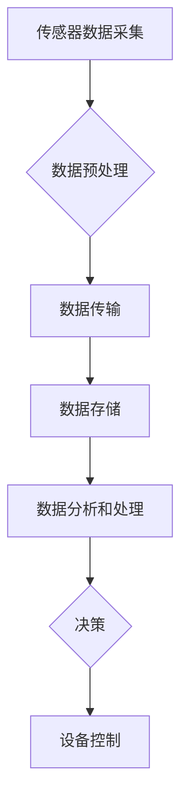

> 物联网 (IoT), 传感器集成, 数据处理, 数据分析, 智能化, 深度学习, 实时监控, 工业自动化, 智能家居

# 物联网(IoT)技术和各种传感器设备的集成：传感器数据的处理与分析

随着物联网（Internet of Things, IoT）技术的快速发展，传感器设备在各个行业中扮演着越来越重要的角色。从智能家居到工业自动化，从智能交通到环境保护，传感器数据成为了驱动决策和优化流程的关键信息。本文将深入探讨物联网技术如何与各种传感器设备集成，并着重分析如何处理和分析这些宝贵的数据，以实现智能化和自动化的目标。

## 1. 背景介绍

### 1.1 物联网的兴起

物联网是指通过互联网将各种物理设备连接起来，实现设备间信息交换和通信的技术。随着微电子、通信和互联网技术的快速发展，物联网已经渗透到我们生活的方方面面。传感器设备作为物联网的核心组成部分，负责收集环境、物理系统或生物体的数据，为智能决策提供依据。

### 1.2 传感器设备的多样性

物联网中使用的传感器种类繁多，包括温度传感器、湿度传感器、压力传感器、加速度传感器、光敏传感器、声学传感器等。这些传感器能够感知不同的物理量，并将感知到的信号转换为数字信号，供后续处理和分析。

### 1.3 传感器数据的重要性

传感器数据是物联网应用的基础。通过对传感器数据的实时监测和分析，可以实现以下目标：

- 实时监控：了解设备或环境的当前状态，及时发现异常情况。
- 自动化控制：根据传感器数据自动调整设备工作状态，提高效率。
- 智能决策：基于历史数据预测未来趋势，优化决策过程。

## 2. 核心概念与联系

### 2.1 传感器集成原理

传感器集成是指将多种传感器设备与物联网平台连接，实现数据采集、传输和处理的过程。以下是一个简单的传感器集成流程的Mermaid流程图：



### 2.2 传感器集成架构

传感器集成通常涉及以下架构组件：

- **传感器节点**：负责收集物理信号，并将其转换为数字信号。
- **网关**：负责将传感器节点收集的数据传输到云端或边缘计算平台。
- **数据中心**：存储和管理传感器数据，提供数据分析和处理服务。
- **应用层**：根据传感器数据生成决策，控制设备或系统行为。

## 3. 核心算法原理 & 具体操作步骤

### 3.1 算法原理概述

传感器数据处理和分析主要涉及以下算法：

- **数据预处理**：包括滤波、去噪、归一化等，以提高数据质量。
- **特征提取**：从原始数据中提取有用的信息，用于后续分析。
- **模式识别**：识别数据中的模式和趋势，用于预测和分类。
- **决策支持**：基于分析结果生成决策，控制设备或系统行为。

### 3.2 算法步骤详解

**3.2.1 数据预处理**

数据预处理是数据处理的第一步，其目的是去除噪声和异常值，提高数据质量。以下是一些常见的数据预处理步骤：

- **滤波**：使用移动平均、中值滤波等方法去除短期噪声。
- **去噪**：使用小波变换、主成分分析等方法去除长期趋势和周期性噪声。
- **归一化**：将数据缩放到相同的尺度，便于后续分析。

**3.2.2 特征提取**

特征提取是从原始数据中提取有用信息的过程。以下是一些常见的特征提取方法：

- **时域特征**：包括均值、方差、频率等统计特征。
- **频域特征**：包括功率谱密度、频带能量等。
- **时频域特征**：结合时域和频域特征，更全面地描述信号。

**3.2.3 模式识别**

模式识别是识别数据中的模式和趋势的过程。以下是一些常见的模式识别方法：

- **聚类**：将相似的数据点分组，用于数据分析和可视化。
- **分类**：将数据点分类到不同的类别，用于预测和决策。
- **回归**：预测数据点的数值，用于趋势预测和优化。

**3.2.4 决策支持**

基于分析结果生成决策，控制设备或系统行为。以下是一些常见的决策支持方法：

- **规则引擎**：根据预设的规则进行决策。
- **机器学习**：使用机器学习模型进行决策。
- **人工智能**：使用人工智能技术进行智能决策。

### 3.3 算法优缺点

**3.3.1 数据预处理**

优点：提高数据质量，便于后续分析。
缺点：可能丢失部分信息，增加计算成本。

**3.3.2 特征提取**

优点：提取有用信息，简化后续分析。
缺点：特征提取过程复杂，可能引入噪声。

**3.3.3 模式识别**

优点：识别数据中的模式和趋势，用于预测和分类。
缺点：模型复杂，需要大量训练数据。

**3.3.4 决策支持**

优点：生成决策，控制设备或系统行为。
缺点：决策结果可能受限于模型和算法。

### 3.4 算法应用领域

- **智能家居**：通过传感器监测家居环境，实现自动化控制和节能。
- **工业自动化**：通过传感器监测生产过程，提高生产效率和产品质量。
- **智能交通**：通过传感器监测交通状况，优化交通流和减少拥堵。
- **环境保护**：通过传感器监测环境质量，及时预警和采取行动。

## 4. 数学模型和公式 & 详细讲解 & 举例说明

### 4.1 数学模型构建

传感器数据处理和分析的数学模型通常涉及以下内容：

- **信号处理模型**：包括傅里叶变换、小波变换、卡尔曼滤波等。
- **机器学习模型**：包括线性回归、支持向量机、神经网络等。
- **决策模型**：包括线性规划、整数规划等。

### 4.2 公式推导过程

以下是一些常见的数学公式及其推导过程：

- **傅里叶变换**：

$$
F(\omega) = \int_{-\infty}^{\infty} f(t) e^{-j\omega t} dt
$$

傅里叶变换是将时域信号转换为频域信号的方法。

- **卡尔曼滤波**：

$$
x_k = x_{k-1} + B_k(u_k - x_{k-1}) + \frac{1}{\sqrt{Q_k}}(z_k - H_k x_{k-1})
$$

卡尔曼滤波是一种线性动态系统的状态估计方法。

### 4.3 案例分析与讲解

以下是一个使用卡尔曼滤波进行温度传感器数据处理的案例：

**案例**：一个温度传感器用于监测室内温度。由于传感器存在一定的噪声，需要使用卡尔曼滤波进行数据平滑。

**解决方案**：

1. 建立卡尔曼滤波模型，包括状态转移矩阵 $A$、观测矩阵 $H$、噪声协方差矩阵 $Q_k$ 和 $R_k$。
2. 初始化卡尔曼滤波器，包括状态向量 $x_0$、预测协方差矩阵 $P_0$、观测估计值 $z_0$ 和观测协方差矩阵 $R_0$。
3. 对于每个观测数据 $z_k$，执行以下步骤：
   - 预测状态 $x_k$ 和预测协方差矩阵 $P_k$。
   - 计算卡尔曼增益 $K_k$。
   - 更新状态向量 $x_k$ 和协方差矩阵 $P_k$。

通过上述步骤，可以得到平滑后的温度值，用于室内温度控制。

## 5. 项目实践：代码实例和详细解释说明

### 5.1 开发环境搭建

为了进行传感器数据处理和分析的实践，我们需要以下开发环境：

- **编程语言**：Python
- **库**：NumPy、SciPy、Pandas、Matplotlib、scikit-learn
- **工具**：Jupyter Notebook

### 5.2 源代码详细实现

以下是一个使用Python和scikit-learn库进行数据预处理和分类的代码实例：

```python
import numpy as np
import pandas as pd
from sklearn.model_selection import train_test_split
from sklearn.preprocessing import StandardScaler
from sklearn.svm import SVC

# 加载数据
data = pd.read_csv('sensor_data.csv')

# 数据预处理
X = data.drop('label', axis=1).values
y = data['label'].values

# 划分训练集和测试集
X_train, X_test, y_train, y_test = train_test_split(X, y, test_size=0.2, random_state=42)

# 标准化数据
scaler = StandardScaler()
X_train = scaler.fit_transform(X_train)
X_test = scaler.transform(X_test)

# 分类
clf = SVC(kernel='linear')
clf.fit(X_train, y_train)

# 评估模型
score = clf.score(X_test, y_test)
print(f"模型准确率：{score:.2f}")
```

### 5.3 代码解读与分析

上述代码实现了以下功能：

1. 加载数据：使用pandas库读取CSV文件。
2. 数据预处理：使用NumPy和scikit-learn库进行数据标准化。
3. 划分训练集和测试集：使用scikit-learn库进行数据集划分。
4. 分类：使用scikit-learn库的SVC分类器进行分类。
5. 评估模型：计算模型准确率。

### 5.4 运行结果展示

假设传感器数据包括温度、湿度、风速等特征，以及标签（如正常/异常）。运行上述代码后，可以得到模型在测试集上的准确率，用于评估模型的性能。

## 6. 实际应用场景

### 6.1 智能家居

在智能家居领域，传感器可以监测室内温度、湿度、光照等环境因素，并根据监测结果自动调节空调、加湿器、照明设备等，实现舒适的生活环境。

### 6.2 工业自动化

在工业自动化领域，传感器可以监测设备运行状态，如温度、压力、振动等，及时发现故障并进行预警，提高生产效率和产品质量。

### 6.3 智能交通

在智能交通领域，传感器可以监测交通流量、车辆速度等，优化交通信号灯控制，减少拥堵，提高道路通行效率。

### 6.4 环境保护

在环境保护领域，传感器可以监测空气质量、水质等环境因素，及时发现污染问题并进行预警，保护生态环境。

## 7. 工具和资源推荐

### 7.1 学习资源推荐

- **书籍**：《Python数据科学手册》、《机器学习实战》、《深度学习》
- **在线课程**：Coursera、edX、Udacity
- **社区**：Stack Overflow、GitHub、Reddit

### 7.2 开发工具推荐

- **编程语言**：Python、Java
- **库**：NumPy、SciPy、Pandas、Matplotlib、scikit-learn、TensorFlow、PyTorch
- **工具**：Jupyter Notebook、Docker、Kubernetes

### 7.3 相关论文推荐

- **《A Survey of Sensor Data Processing Techniques for IoT Applications**》
- **《Deep Learning for IoT: A Survey**》
- **《A Review of IoT Security and Privacy Challenges**》

## 8. 总结：未来发展趋势与挑战

### 8.1 研究成果总结

本文介绍了物联网技术和各种传感器设备的集成方法，以及传感器数据的处理和分析技术。通过对传感器数据的预处理、特征提取、模式识别和决策支持，可以实现智能化和自动化的目标。

### 8.2 未来发展趋势

- **边缘计算**：将数据处理和分析任务从云端迁移到边缘设备，降低延迟，提高效率。
- **人工智能**：利用人工智能技术，如机器学习和深度学习，实现更复杂的任务。
- **区块链**：利用区块链技术，确保传感器数据的真实性和安全性。

### 8.3 面临的挑战

- **数据质量**：保证传感器数据的准确性和可靠性。
- **安全性**：确保传感器数据的安全性和隐私性。
- **可扩展性**：满足不断增长的数据量和计算需求。

### 8.4 研究展望

随着物联网技术的不断发展，传感器数据的处理和分析将面临更多挑战。未来研究需要关注以下方向：

- **数据融合**：将来自不同传感器和不同来源的数据进行融合，提高数据质量。
- **模型解释性**：提高模型的解释性，使决策过程更加透明。
- **跨领域应用**：将物联网技术应用于更多领域，如医疗、农业、能源等。

## 9. 附录：常见问题与解答

**Q1：如何选择合适的传感器设备？**

A：选择合适的传感器设备需要考虑以下因素：

- **应用场景**：根据实际需求选择合适的传感器类型和性能指标。
- **成本**：根据预算选择性价比高的传感器设备。
- **稳定性**：选择稳定性好的传感器设备，保证数据质量。

**Q2：如何处理大量传感器数据？**

A：处理大量传感器数据需要考虑以下方法：

- **数据压缩**：使用数据压缩技术减少数据存储空间。
- **数据流处理**：使用数据流处理技术实时处理和分析数据。
- **分布式计算**：使用分布式计算技术提高数据处理效率。

**Q3：如何确保传感器数据的安全性和隐私性？**

A：确保传感器数据的安全性和隐私性需要考虑以下措施：

- **加密**：对传感器数据进行加密，防止数据泄露。
- **访问控制**：限制对传感器数据的访问权限。
- **审计**：对传感器数据的使用进行审计，确保合规性。

**Q4：如何将传感器数据应用于实际场景？**

A：将传感器数据应用于实际场景需要考虑以下步骤：

- **问题定义**：明确应用场景中需要解决的问题。
- **数据收集**：收集相关传感器数据。
- **数据分析和处理**：对传感器数据进行分析和处理。
- **决策支持**：根据分析结果生成决策，控制设备或系统行为。

作者：禅与计算机程序设计艺术 / Zen and the Art of Computer Programming