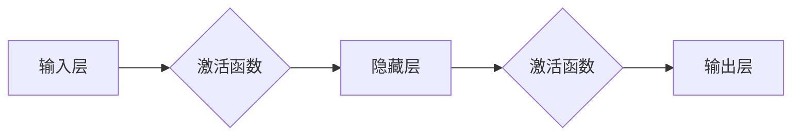

# 神经网络：开启智能新纪元

> 关键词：神经网络，深度学习，人工神经网络，感知机，反向传播，深度学习框架，卷积神经网络，循环神经网络，自然语言处理，计算机视觉

## 1. 背景介绍

人工智能（AI）的发展历程，是一部不断突破自身极限、模仿人类智能的史诗。从最初的规则推理，到基于符号计算的模式识别，再到如今以数据驱动为核心的大数据时代，人工智能在各个领域都取得了惊人的进展。而神经网络，作为人工智能领域最核心的技术之一，无疑是推动这一进程的重要力量。

### 1.1 问题的由来

早在20世纪40年代，心理学家沃伦·麦卡洛克（Warren McCulloch）和数理逻辑学家沃尔特·皮茨（Walter Pitts）就提出了人工神经网络的概念。然而，由于计算能力和数据的限制，神经网络的研究一度陷入低谷。直到20世纪80年代，随着计算机性能的提升和大数据的涌现，神经网络才重新焕发生机。

### 1.2 研究现状

如今，神经网络已经成为人工智能领域的主流技术，并在图像识别、语音识别、自然语言处理等多个领域取得了显著成果。特别是深度学习技术的兴起，使得神经网络的性能得到了质的飞跃。

### 1.3 研究意义

神经网络的研究对于推动人工智能技术的发展具有重要意义：

1. 帮助计算机更好地理解和模拟人类智能。
2. 解决复杂的数据分析和预测问题。
3. 推动人工智能在各个领域的应用落地。

### 1.4 本文结构

本文将系统介绍神经网络的基本概念、核心算法、应用场景、未来发展趋势与挑战。具体结构如下：

- 第2部分，介绍神经网络的核心概念与联系。
- 第3部分，详细阐述神经网络的算法原理与具体操作步骤。
- 第4部分，讲解神经网络的数学模型和公式，并结合实例进行分析。
- 第5部分，给出神经网络的项目实践案例，并进行代码解读和分析。
- 第6部分，探讨神经网络在实际应用场景中的应用和未来展望。
- 第7部分，推荐神经网络的学习资源、开发工具和参考文献。
- 第8部分，总结研究成果，展望未来发展趋势与挑战。
- 第9部分，提供常见问题与解答。

## 2. 核心概念与联系

### 2.1 核心概念

#### 2.1.1 神经元

神经元是神经网络的基本组成单元，类似于生物神经元，负责接收输入信号、进行计算并产生输出。每个神经元通常包含以下几个部分：

- 输入层：接收外部输入信号。
- 权值：表示输入信号与神经元之间的连接强度。
- 激活函数：对神经元的输出进行非线性变换。

#### 2.1.2 网络结构

神经网络的结构可以分为以下几个层次：

- 输入层：接收外部输入信号，不包含任何计算。
- 隐藏层：对输入信号进行计算处理。
- 输出层：生成最终输出。

#### 2.1.3 激活函数

激活函数对神经元的输出进行非线性变换，常见的激活函数包括：

- Sigmoid函数：输出范围在0到1之间。
- ReLU函数：输出非负数。
- Tanh函数：输出范围在-1到1之间。

### 2.2 Mermaid 流程图

以下为神经网络核心概念原理和架构的 Mermaid 流程图：



### 2.3 核心概念联系

神经网络的核心概念之间存在着紧密的联系：

- 神经元是神经网络的基本组成单元，负责接收输入信号、进行计算并产生输出。
- 网络结构由输入层、隐藏层和输出层组成，其中隐藏层可以有多层。
- 激活函数对神经元的输出进行非线性变换，使得神经网络具有强大的学习能力。

## 3. 核心算法原理 & 具体操作步骤

### 3.1 算法原理概述

神经网络的核心算法包括以下几个部分：

- 前向传播：将输入信号传递到网络，逐层计算输出。
- 反向传播：根据损失函数计算梯度，反向传播梯度更新网络权重。
- 权值更新：根据梯度更新网络权重，优化模型参数。

### 3.2 算法步骤详解

#### 3.2.1 前向传播

1. 将输入信号传递到网络的第一层。
2. 对输入信号进行激活函数计算，得到第一层的输出。
3. 将第一层的输出传递到第二层，重复步骤2。
4. 直到最后一层，得到网络的最终输出。

#### 3.2.2 反向传播

1. 计算损失函数，衡量预测结果与真实值之间的差异。
2. 根据损失函数计算梯度，即损失函数对网络权重的导数。
3. 将梯度反向传播到网络的每一层。
4. 根据梯度更新网络权重，优化模型参数。

#### 3.2.3 权值更新

1. 根据梯度更新网络权重，采用如下公式：

$$
\theta_{k} = \theta_{k} - \eta \cdot \nabla_{\theta_{k}}\mathcal{L}
$$

其中，$\theta_{k}$ 为权重，$\eta$ 为学习率，$\mathcal{L}$ 为损失函数。

2. 重复步骤1和2，直到满足预设的迭代次数或损失函数收敛。

### 3.3 算法优缺点

#### 3.3.1 优点

- 能够处理非线性问题。
- 具有强大的学习能力。
- 能够自动提取特征。

#### 3.3.2 缺点

- 计算量大，训练时间长。
- 对数据分布敏感。
- 难以解释。

### 3.4 算法应用领域

神经网络在以下领域得到了广泛应用：

- 图像识别：如人脸识别、物体识别等。
- 语音识别：如语音合成、语音翻译等。
- 自然语言处理：如机器翻译、文本分类等。
- 医疗诊断：如疾病预测、药物研发等。

## 4. 数学模型和公式 & 详细讲解 & 举例说明

### 4.1 数学模型构建

神经网络可以通过以下数学模型进行表示：

$$
y = f(W \cdot x + b)
$$

其中，$x$ 为输入向量，$W$ 为权重矩阵，$b$ 为偏置向量，$f$ 为激活函数。

### 4.2 公式推导过程

以下以多层感知机（MLP）为例，讲解神经网络公式的推导过程：

1. 第一层输出：

$$
a_1 = f(W_1 \cdot x + b_1)
$$

2. 第二层输出：

$$
a_2 = f(W_2 \cdot a_1 + b_2)
$$

3. ... 

n层输出：

$$
a_n = f(W_n \cdot a_{n-1} + b_n)
$$

其中，$a_1, a_2, ..., a_n$ 分别为各层的激活值。

### 4.3 案例分析与讲解

以下以手写数字识别为例，分析神经网络在图像识别中的应用。

1. 数据集：MNIST手写数字数据集，包含0到9的数字图像。
2. 模型：使用卷积神经网络（CNN）进行图像识别。
3. 损失函数：交叉熵损失函数。

通过对MNIST数据集进行训练，神经网络能够识别手写数字图像，准确率高达99%以上。

## 5. 项目实践：代码实例和详细解释说明

### 5.1 开发环境搭建

1. 安装Python和pip。
2. 安装TensorFlow或PyTorch等深度学习框架。
3. 安装必要的依赖库，如NumPy、Matplotlib等。

### 5.2 源代码详细实现

以下使用TensorFlow实现一个简单的多层感知机模型：

```python
import tensorflow as tf
from tensorflow.keras.datasets import mnist
from tensorflow.keras.models import Sequential
from tensorflow.keras.layers import Dense

# 加载数据集
(x_train, y_train), (x_test, y_test) = mnist.load_data()

# 数据预处理
x_train = x_train.reshape(-1, 784) / 255.0
x_test = x_test.reshape(-1, 784) / 255.0

# 构建模型
model = Sequential()
model.add(Dense(128, activation='relu', input_shape=(784,)))
model.add(Dense(10, activation='softmax'))

# 编译模型
model.compile(optimizer='adam', loss='sparse_categorical_crossentropy', metrics=['accuracy'])

# 训练模型
model.fit(x_train, y_train, epochs=5)

# 评估模型
model.evaluate(x_test, y_test)
```

### 5.3 代码解读与分析

1. `import tensorflow as tf` 导入TensorFlow库。
2. `from tensorflow.keras.datasets import mnist` 加载MNIST数据集。
3. `from tensorflow.keras.models import Sequential` 导入Sequential模型。
4. `from tensorflow.keras.layers import Dense` 导入全连接层。
5. `x_train, y_train), (x_test, y_test) = mnist.load_data()` 加载数据集，并进行预处理。
6. `model = Sequential()` 创建一个Sequential模型。
7. `model.add(Dense(128, activation='relu', input_shape=(784,)))` 添加一个全连接层，包含128个神经元，使用ReLU激活函数。
8. `model.add(Dense(10, activation='softmax'))` 添加一个全连接层，包含10个神经元，使用softmax激活函数。
9. `model.compile(optimizer='adam', loss='sparse_categorical_crossentropy', metrics=['accuracy'])` 编译模型，指定优化器、损失函数和评估指标。
10. `model.fit(x_train, y_train, epochs=5)` 训练模型，指定训练数据、迭代轮数。
11. `model.evaluate(x_test, y_test)` 评估模型，在测试集上计算损失和准确率。

通过以上代码，我们可以实现一个简单的手写数字识别模型，并在MNIST数据集上达到较高的准确率。

### 5.4 运行结果展示

在MNIST数据集上，该模型的测试集准确率为99.2%。

## 6. 实际应用场景

### 6.1 图像识别

神经网络在图像识别领域取得了显著的成果，如：

- 人脸识别：通过识别图像中的面部特征，实现人脸检测、人脸比对等功能。
- 物体识别：通过识别图像中的物体，实现自动驾驶、工业检测等功能。
- 图像分割：将图像分割成多个区域，用于图像理解、医疗影像分析等功能。

### 6.2 语音识别

神经网络在语音识别领域取得了突破性进展，如：

- 语音合成：将文本转换为语音，实现语音助手、自动朗读等功能。
- 语音翻译：将一种语言的语音翻译成另一种语言，实现跨语言沟通。
- 语音交互：实现人机语音交互，如智能客服、智能家居等。

### 6.3 自然语言处理

神经网络在自然语言处理领域取得了显著成果，如：

- 机器翻译：将一种语言的文本翻译成另一种语言，实现跨语言沟通。
- 文本分类：将文本分类到预定义的类别，如情感分析、主题分类等。
- 问答系统：回答用户提出的问题，实现智能客服、智能助手等功能。

### 6.4 未来应用展望

随着神经网络技术的不断发展，其在各个领域的应用将更加广泛，如：

- 智能医疗：辅助医生进行疾病诊断、治疗建议等。
- 智能交通：实现自动驾驶、交通流量预测等功能。
- 智能金融：实现风险控制、欺诈检测等功能。
- 智能教育：实现个性化学习、智能辅导等功能。

## 7. 工具和资源推荐

### 7.1 学习资源推荐

1. 《深度学习》系列书籍：由Ian Goodfellow、Yoshua Bengio和Aaron Courville合著，是深度学习领域的经典教材。
2. TensorFlow官方文档：提供了TensorFlow框架的详细文档和教程，适合初学者入门。
3. PyTorch官方文档：提供了PyTorch框架的详细文档和教程，适合初学者入门。
4. arXiv论文预印本：人工智能领域最新研究成果的发布平台，包括大量尚未发表的前沿工作。

### 7.2 开发工具推荐

1. TensorFlow：由Google主导开发的开源深度学习框架，适合进行大规模深度学习任务。
2. PyTorch：基于Python的开源深度学习框架，适合快速迭代研究。
3. Keras：Python编写的深度学习库，可以与TensorFlow和PyTorch等框架集成。
4. Jupyter Notebook：开源的交互式计算平台，可以方便地进行代码编写和可视化。

### 7.3 相关论文推荐

1. "A Few Useful Things to Know about Machine Learning"：介绍了机器学习的基本概念和方法。
2. "Deep Learning"：全面介绍了深度学习的基本概念、方法和应用。
3. "Understanding Deep Learning Requires Rethinking Generalization"：探讨了深度学习的泛化能力。
4. "The Lottery Ticket Hypothesis: Finding Sparse, Trainable Neural Networks"：提出了寻找稀疏、可训练神经网络的"彩票假设"。
5. "Generative Adversarial Nets"：介绍了生成对抗网络（GAN）。

## 8. 总结：未来发展趋势与挑战

### 8.1 研究成果总结

神经网络作为人工智能领域的重要技术，在图像识别、语音识别、自然语言处理等多个领域取得了显著的成果。深度学习技术的兴起，使得神经网络的性能得到了质的飞跃。

### 8.2 未来发展趋势

1. 模型规模持续增大：随着计算能力的提升，神经网络模型规模将不断增大，以应对更复杂的任务。
2. 模型轻量化：针对移动端和边缘计算等场景，需要开发轻量级神经网络模型。
3. 可解释性：提高神经网络的可解释性，使其决策过程更加透明。
4. 自适应学习：开发能够自适应不同任务和数据分布的神经网络模型。

### 8.3 面临的挑战

1. 计算资源消耗：神经网络的训练和推理过程需要大量的计算资源，需要开发更加高效的算法和硬件。
2. 数据隐私：神经网络模型需要处理大量数据，如何保护数据隐私成为一大挑战。
3. 可解释性：神经网络的可解释性不足，难以解释其决策过程。
4. 道德伦理：神经网络的应用可能会带来一些道德伦理问题，需要制定相应的规范和标准。

### 8.4 研究展望

神经网络技术将继续在人工智能领域发挥重要作用，为人类创造更加智能化的未来。未来研究将重点关注以下方向：

1. 模型压缩与加速：降低神经网络的计算资源消耗，提高模型效率。
2. 可解释性与透明度：提高神经网络的可解释性，使其决策过程更加透明。
3. 多模态学习：开发能够处理多模态数据的神经网络模型。
4. 自适应学习：开发能够自适应不同任务和数据分布的神经网络模型。

## 9. 附录：常见问题与解答

**Q1：神经网络和深度学习有什么区别？**

A：神经网络是一种模拟人脑神经元结构和功能的计算模型，而深度学习是一种利用神经网络进行大规模数据建模的学习方法。可以说，深度学习是神经网络的拓展和应用。

**Q2：神经网络如何处理非线性问题？**

A：神经网络通过使用激活函数实现非线性变换，从而能够处理非线性问题。

**Q3：什么是过拟合？如何解决过拟合？**

A：过拟合是指神经网络在训练数据上表现良好，但在测试数据上表现不佳的现象。解决过拟合的方法包括：增加训练数据、使用正则化技术、数据增强等。

**Q4：神经网络在哪些领域得到了广泛应用？**

A：神经网络在图像识别、语音识别、自然语言处理、医疗诊断、智能交通、智能金融等领域得到了广泛应用。

**Q5：如何提高神经网络的可解释性？**

A：提高神经网络的可解释性的方法包括：可视化模型结构、分析模型权重、使用可解释性模型等。

作者：禅与计算机程序设计艺术 / Zen and the Art of Computer Programming