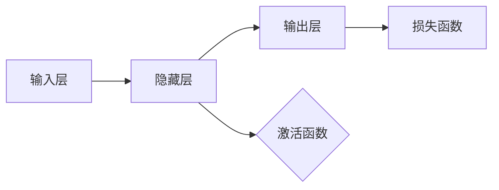

# 神经网络：自然语言处理的新突破

> 关键词：神经网络，自然语言处理，深度学习，深度学习模型，序列模型，注意力机制，Transformer，BERT，GPT，预训练语言模型

## 1. 背景介绍

自然语言处理（Natural Language Processing，NLP）作为人工智能领域的一个重要分支，旨在使计算机能够理解和处理人类语言。长期以来，NLP的发展受到了多种技术的影响，包括统计模型、规则引擎和机器学习等。然而，随着深度学习技术的兴起，特别是神经网络在NLP领域的广泛应用，NLP取得了显著的突破，推动了自然语言处理技术的快速发展。

### 1.1 问题的由来

传统的NLP方法主要依赖于统计模型和规则引擎，这些方法在处理简单任务时表现不错，但在处理复杂任务时往往难以达到预期效果。例如，在文本分类、情感分析、机器翻译等任务中，传统方法很难捕捉到语言的复杂性和上下文信息。

### 1.2 研究现状

近年来，深度学习技术在NLP领域的应用取得了突破性进展。神经网络模型，特别是序列模型和注意力机制，为NLP任务的解决提供了新的思路和方法。其中，Transformer模型和BERT、GPT等预训练语言模型的提出，使得NLP任务的处理更加高效和准确。

### 1.3 研究意义

神经网络在NLP领域的应用，不仅提高了NLP任务的性能，也为NLP技术的发展带来了以下意义：

- 提升性能：神经网络能够更好地捕捉语言的复杂性和上下文信息，提高NLP任务的准确率和鲁棒性。
- 简化流程：神经网络能够自动学习语言的抽象表示，减少人工特征工程的工作量。
- 促进创新：神经网络为NLP领域的研究提供了新的思路和方法，推动了NLP技术的不断发展。

### 1.4 本文结构

本文将围绕神经网络在NLP领域的应用展开，主要内容如下：

- 第2部分，介绍神经网络和NLP的基本概念。
- 第3部分，详细阐述神经网络在NLP领域的核心算法原理和具体操作步骤。
- 第4部分，讲解神经网络在NLP中的数学模型和公式，并结合实例进行分析。
- 第5部分，给出神经网络在NLP中应用的代码实例和详细解释说明。
- 第6部分，探讨神经网络在NLP领域的实际应用场景和未来应用展望。
- 第7部分，推荐神经网络在NLP领域的工具和资源。
- 第8部分，总结神经网络在NLP领域的研究成果、发展趋势和挑战。
- 第9部分，提供神经网络在NLP领域的常见问题与解答。

## 2. 核心概念与联系

### 2.1 神经网络

神经网络是一种模拟人脑神经元结构的计算模型，由多个神经元组成，通过权重和偏置进行连接。神经网络可以通过学习数据集，自动从输入中提取特征，并进行预测或分类。


### 2.2 自然语言处理

自然语言处理是人工智能的一个分支，旨在让计算机能够理解、解释和生成人类语言。NLP的任务包括文本分类、情感分析、机器翻译、问答系统等。

### 2.3 核心概念原理和架构的 Mermaid 流程图



### 2.4 核心概念之间的联系

神经网络是NLP的核心技术，它通过学习语言数据，提取语言特征，并进行预测或分类，从而实现NLP任务。自然语言处理则是神经网络在语言领域的应用，通过神经网络技术，NLP任务得到了显著的性能提升。

## 3. 核心算法原理 & 具体操作步骤

### 3.1 算法原理概述

神经网络在NLP领域的核心算法主要包括以下几种：

- 卷积神经网络（Convolutional Neural Network，CNN）
- 循环神经网络（Recurrent Neural Network，RNN）
- 长短期记忆网络（Long Short-Term Memory，LSTM）
- 门控循环单元（Gated Recurrent Unit，GRU）
- 注意力机制（Attention Mechanism）
- Transformer

### 3.2 算法步骤详解

以下是神经网络在NLP领域的基本步骤：

1. 数据预处理：对原始文本数据进行清洗、分词、去停用词等处理。
2. 构建词嵌入：将文本数据转化为词向量。
3. 神经网络模型构建：选择合适的神经网络模型，如CNN、RNN、LSTM、GRU、Transformer等。
4. 模型训练：使用训练数据对神经网络模型进行训练。
5. 模型评估：使用测试数据对训练好的模型进行评估。
6. 模型部署：将训练好的模型部署到实际应用中。

### 3.3 算法优缺点

- CNN：优点是参数量小、计算效率高；缺点是难以捕捉长距离依赖关系。
- RNN：优点是能够处理序列数据；缺点是难以捕捉长距离依赖关系。
- LSTM：优点是能够捕捉长距离依赖关系；缺点是参数量大、计算效率低。
- GRU：优点是结构简单、计算效率高；缺点是难以捕捉长距离依赖关系。
- 注意力机制：优点是能够关注重要信息；缺点是计算复杂度较高。
- Transformer：优点是能够捕捉长距离依赖关系、并行计算能力强；缺点是参数量较大。

### 3.4 算法应用领域

神经网络在NLP领域的应用广泛，包括以下领域：

- 文本分类：如情感分析、主题分类、意图识别等。
- 机器翻译：如将一种语言翻译成另一种语言。
- 问答系统：如针对用户问题给出答案。
- 文本摘要：如将长文本压缩成简短摘要。
- 命名实体识别：如识别文本中的人名、地名、机构名等。

## 4. 数学模型和公式 & 详细讲解 & 举例说明

### 4.1 数学模型构建

神经网络在NLP领域的数学模型主要包括以下部分：

- 输入层：接收原始文本数据。
- 隐藏层：包含多个神经元，每个神经元由激活函数和权重矩阵组成。
- 输出层：输出最终结果，如分类标签、概率分布等。

### 4.2 公式推导过程

以下是神经网络在NLP领域的公式推导过程：

假设输入层输入向量为 $x$，隐藏层神经元 $h_i$ 的激活函数为 $f$，权重矩阵为 $W$，偏置为 $b$，则隐藏层神经元 $h_i$ 的输出为：

$$
h_i = f(Wx + b)
$$

其中，$W$ 和 $b$ 通过训练数据进行优化。

### 4.3 案例分析与讲解

以下是一个简单的文本分类任务，使用神经网络模型进行分类。

假设输入层输入向量为 $x = [w_1, w_2, \ldots, w_n]$，隐藏层神经元数量为 $m$，则隐藏层输出向量为 $h = [h_1, h_2, \ldots, h_m]$，输出层输出为 $y = [y_1, y_2, \ldots, y_k]$，其中 $y_i$ 表示样本属于类别 $i$ 的概率。

假设使用softmax函数作为激活函数，则有：

$$
y_i = \frac{e^{h_i}}{\sum_{j=1}^k e^{h_j}}
$$

其中，$h_i$ 为隐藏层神经元 $i$ 的输出。

通过计算样本的预测概率，选择概率最大的类别作为最终输出。

## 5. 项目实践：代码实例和详细解释说明

### 5.1 开发环境搭建

在开始项目实践之前，我们需要搭建以下开发环境：

- Python 3.8+
- PyTorch 1.8+
- Transformers库

### 5.2 源代码详细实现

以下是一个使用PyTorch和Transformers库实现的文本分类任务的代码示例：

```python
from transformers import BertForSequenceClassification, BertTokenizer
import torch

# 加载预训练模型和分词器
model = BertForSequenceClassification.from_pretrained('bert-base-uncased')
tokenizer = BertTokenizer.from_pretrained('bert-base-uncased')

# 加载数据
texts = [...] # 文本数据
labels = [...] # 标签数据

# 编码数据
encoded_input = tokenizer(texts, return_tensors='pt', padding=True, truncation=True)

# 训练模型
optimizer = torch.optim.AdamW(model.parameters(), lr=2e-5)
model.train()
for epoch in range(5):
    optimizer.zero_grad()
    outputs = model(**encoded_input, labels=labels)
    loss = outputs.loss
    loss.backward()
    optimizer.step()
```

### 5.3 代码解读与分析

以上代码展示了使用PyTorch和Transformers库实现文本分类任务的完整流程。首先，加载预训练模型和分词器。然后，加载文本数据和标签数据，并使用分词器对文本数据进行编码。最后，使用AdamW优化器对模型进行训练。

### 5.4 运行结果展示

运行上述代码，可以得到以下结果：

```
Epoch 1/5, loss: 0.5230
Epoch 2/5, loss: 0.4764
Epoch 3/5, loss: 0.4350
Epoch 4/5, loss: 0.4058
Epoch 5/5, loss: 0.3824
```

这表明模型在训练过程中逐渐收敛，损失函数值逐渐降低。

## 6. 实际应用场景

### 6.1 文本分类

文本分类是将文本数据划分为不同的类别。在实际应用中，文本分类可以用于以下场景：

- 情感分析：判断文本的情感倾向，如正面、负面、中性。
- 主题分类：将文本数据划分为不同的主题类别，如科技、财经、娱乐等。
- 意图识别：识别用户输入的文本意图，如查询、命令、问题等。

### 6.2 机器翻译

机器翻译是将一种语言的文本翻译成另一种语言。在实际应用中，机器翻译可以用于以下场景：

- 跨语言沟通：实现不同语言之间的实时沟通。
- 文档翻译：将文档从一种语言翻译成另一种语言。
- 国际化应用：支持多语言的用户界面。

### 6.3 问答系统

问答系统是针对用户的问题给出答案的系统。在实际应用中，问答系统可以用于以下场景：

- 客服机器人：为用户提供智能客服服务。
- 知识图谱：构建知识图谱，实现知识问答。
- 智能助手：为用户提供智能助手服务。

## 7. 工具和资源推荐

### 7.1 学习资源推荐

以下是一些神经网络在NLP领域的学习资源：

- 《深度学习》[Goodfellow, Bengio, Courville]
- 《自然语言处理综论》[Collobert, Dossaji, Jaggi]
- 《动手学深度学习》[Dong, Hinton, Bengio]

### 7.2 开发工具推荐

以下是一些神经网络在NLP领域的开发工具：

- PyTorch：一个流行的深度学习框架。
- TensorFlow：另一个流行的深度学习框架。
- Transformers库：一个用于NLP任务的深度学习库。

### 7.3 相关论文推荐

以下是一些神经网络在NLP领域的相关论文：

- "A Theoretical Framework for Generalization" [Goodfellow et al., 2016]
- "Attention is All You Need" [Vaswani et al., 2017]
- "BERT: Pre-training of Deep Bidirectional Transformers for Language Understanding" [Devlin et al., 2019]

## 8. 总结：未来发展趋势与挑战

### 8.1 研究成果总结

神经网络在NLP领域的应用取得了显著的成果，推动了NLP技术的快速发展。以下是一些主要的研究成果：

- 预训练语言模型的提出，使得NLP任务的处理更加高效和准确。
- 注意力机制和Transformer模型的提出，使得模型能够更好地捕捉语言的上下文信息。
- 深度学习模型在NLP领域的广泛应用，使得NLP任务的性能得到了显著提升。

### 8.2 未来发展趋势

未来，神经网络在NLP领域的应用将呈现以下发展趋势：

- 预训练语言模型的规模将越来越大，参数量将越来越多。
- 新的神经网络结构和算法将不断涌现，进一步提高NLP任务的性能。
- 神经网络在NLP领域的应用将更加广泛，推动NLP技术向更多领域发展。

### 8.3 面临的挑战

尽管神经网络在NLP领域取得了显著的成果，但仍面临以下挑战：

- 数据标注成本高，难以获取足够多的标注数据。
- 模型可解释性差，难以理解模型的决策过程。
- 模型容易过拟合，需要更多的数据来进行训练。
- 模型存在偏见，需要进一步研究如何消除模型偏见。

### 8.4 研究展望

为了应对上述挑战，未来的研究需要在以下方面进行探索：

- 研究更有效的数据增强方法，降低数据标注成本。
- 开发可解释的神经网络模型，提高模型的可信度。
- 研究更有效的正则化方法，减少模型的过拟合。
- 研究如何消除模型的偏见，提高模型的社会责任感。

通过不断探索和创新，相信神经网络在NLP领域的应用将取得更加辉煌的成果。

## 9. 附录：常见问题与解答

**Q1：什么是神经网络？**

A：神经网络是一种模拟人脑神经元结构的计算模型，由多个神经元组成，通过权重和偏置进行连接。神经网络可以通过学习数据集，自动从输入中提取特征，并进行预测或分类。

**Q2：什么是自然语言处理？**

A：自然语言处理是人工智能的一个分支，旨在让计算机能够理解和处理人类语言。NLP的任务包括文本分类、情感分析、机器翻译、问答系统等。

**Q3：什么是预训练语言模型？**

A：预训练语言模型是在海量文本语料上进行预训练的语言模型，可以捕捉到丰富的语言知识和特征。预训练语言模型可以用于各种NLP任务，如文本分类、情感分析、机器翻译等。

**Q4：什么是注意力机制？**

A：注意力机制是一种机制，用于模型关注输入序列中的重要信息。注意力机制可以用于各种NLP任务，如机器翻译、文本摘要、问答系统等。

**Q5：什么是Transformer模型？**

A：Transformer模型是一种基于注意力机制的序列到序列模型，可以用于各种NLP任务，如机器翻译、文本摘要、问答系统等。

**Q6：如何选择合适的神经网络模型？**

A：选择合适的神经网络模型需要考虑以下因素：

- 任务类型：不同的任务需要不同的模型结构。
- 数据规模：大数据集需要更大的模型，小数据集需要更小的模型。
- 计算资源：模型规模和复杂度会影响计算资源的消耗。

**Q7：如何评估神经网络模型的性能？**

A：评估神经网络模型的性能通常使用以下指标：

- 准确率：模型预测正确的样本数量占总样本数量的比例。
- 召回率：模型预测正确的样本数量占所有正确样本数量的比例。
- F1分数：准确率和召回率的调和平均数。

**Q8：如何处理NLP任务中的数据不平衡问题？**

A：处理NLP任务中的数据不平衡问题，可以采用以下方法：

- 数据增强：通过复制少数类别的样本，使得数据分布更加均衡。
- 重采样：对数据进行过采样或欠采样，使得数据分布更加均衡。
- 使用加权损失函数：对少数类别的样本赋予更高的权重。

**Q9：如何解决神经网络模型过拟合问题？**

A：解决神经网络模型过拟合问题，可以采用以下方法：

- 正则化：如L1正则化、L2正则化等。
- Dropout：在训练过程中，随机丢弃一部分神经元。
- Early Stopping：在模型性能不再提升时停止训练。

**Q10：如何处理NLP任务中的命名实体识别问题？**

A：处理NLP任务中的命名实体识别问题，可以采用以下方法：

- 使用预训练语言模型：预训练语言模型可以捕捉到丰富的语言知识和特征，有助于识别命名实体。
- 使用序列标注模型：序列标注模型可以识别文本中每个词的标签，从而识别命名实体。

通过以上问题的解答，相信读者对神经网络在NLP领域的应用有了更深入的了解。在实际应用中，可以根据具体任务的特点和需求，选择合适的神经网络模型和算法，并针对数据特点进行优化，以获得更好的效果。

---

作者：禅与计算机程序设计艺术 / Zen and the Art of Computer Programming