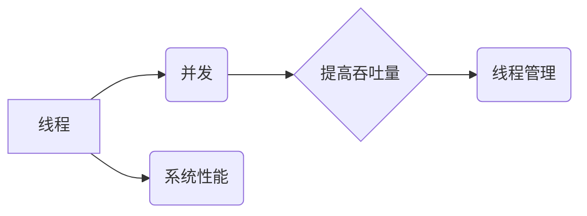

# 线程管理与高吞吐量系统设计

> 关键词：线程管理，并发编程，高吞吐量，系统架构，性能优化，锁，队列，无锁编程

## 1. 背景介绍

随着现代计算机硬件的发展，多核处理器和分布式计算成为了主流。在这样的硬件环境下，如何设计高吞吐量的系统，成为了软件工程师面临的重要挑战。线程管理作为并发编程的核心，对于系统性能有着决定性的影响。本文将深入探讨线程管理的基本原理、关键技术以及在高吞吐量系统设计中的应用。

## 2. 核心概念与联系

### 2.1 核心概念

#### 线程

线程是操作系统能够进行运算调度的最小单位。它被包含在进程之中，是进程中的实际运作单位。线程自己基本上不拥有系统资源，只拥有一点在运行中必不可少的资源（如程序计数器、一组寄存器和栈），但是它可与同属一个进程的其它线程共享进程所拥有的全部资源，如内存空间。

#### 并发

并发是指在同一个时间间隔内，多个事件同时发生。在计算机科学中，并发通常指两个或多个事件在同一时间间隔内发生，但实际上它们可能不是真的同时发生的，而是交替进行。

#### 高吞吐量

高吞吐量指的是系统能够在单位时间内处理的数据量或任务数。

### 2.2 核心概念联系

线程是并发编程的基础，通过多线程可以实现并发执行，从而提高系统吞吐量。然而，不当的线程管理可能导致系统性能下降，甚至死锁等严重问题。



## 3. 核心算法原理 & 具体操作步骤

### 3.1 算法原理概述

线程管理主要包括线程创建、调度、同步和销毁等操作。以下是线程管理的基本原理：

#### 线程创建

线程的创建通常使用操作系统提供的API，如`pthread_create`（POSIX线程）或`CreateThread`（Windows线程）。

#### 线程调度

线程调度是由操作系统负责的，它决定了哪个线程将在何时执行。常见的调度算法有轮转调度、优先级调度等。

#### 线程同步

线程同步是防止多个线程同时访问共享资源而引起冲突的一种机制，常用的同步机制有互斥锁、条件变量、信号量等。

#### 线程销毁

线程销毁是指线程执行完毕后释放其占用的资源。

### 3.2 算法步骤详解

#### 创建线程

1. 调用线程创建API，指定线程属性和执行函数。
2. 分配线程资源，如堆栈空间、寄存器等。
3. 将线程添加到就绪队列。

#### 调度线程

1. 操作系统根据调度算法选择一个线程执行。
2. 将选中的线程从就绪队列移动到运行队列。
3. 保存当前线程的状态，切换到新线程执行。

#### 同步线程

1. 选择合适的同步机制，如互斥锁、条件变量等。
2. 在访问共享资源前，获得锁。
3. 访问共享资源后，释放锁。

#### 销毁线程

1. 将线程从运行队列中移除。
2. 释放线程占用的资源。
3. 调用线程的退出函数。

### 3.3 算法优缺点

#### 优点

- 提高程序并发性能，提高系统吞吐量。
- 增加程序可读性和可维护性。

#### 缺点

- 线程管理开销较大。
- 线程同步可能导致死锁、性能下降等问题。

### 3.4 算法应用领域

- 高并发Web应用
- 分布式系统
- 多媒体应用
- 图形渲染

## 4. 数学模型和公式 & 详细讲解 & 举例说明

### 4.1 数学模型构建

线程管理的数学模型主要包括：

- 线程状态转换模型
- 线程调度模型
- 线程同步模型

#### 线程状态转换模型

线程状态转换模型描述了线程在运行过程中可能经历的各种状态及其转换关系。以下是线程状态转换模型的数学表示：

$$
S = \{R, RCV, S, T, Z\}
$$

其中，$R$表示就绪状态，$RCV$表示接收状态，$S$表示运行状态，$T$表示等待状态，$Z$表示终止状态。

#### 线程调度模型

线程调度模型描述了线程调度算法的决策过程。以下是轮转调度算法的数学表示：

$$
T_{next} = (T_{cur} + 1) \mod N
$$

其中，$T_{next}$表示下一个执行的线程，$T_{cur}$表示当前执行的线程，$N$表示线程总数。

#### 线程同步模型

线程同步模型描述了线程同步机制的工作原理。以下是互斥锁的数学表示：

$$
L_{1} = 0
$$

$$
if\ L_{1} = 0\ then\ L_{1} = 1\ else\ \text{wait}
$$

其中，$L_{1}$表示互斥锁的状态，当$L_{1} = 0$时，线程可以获取锁；当$L_{1} = 1$时，线程需要等待。

### 4.2 公式推导过程

#### 线程状态转换模型

线程状态转换模型可以基于以下公式推导：

$$
P(R \rightarrow S) = \frac{1}{N}
$$

$$
P(S \rightarrow T) = 1
$$

$$
P(T \rightarrow R) = 1
$$

其中，$P$表示概率。

#### 线程调度模型

轮转调度算法的公式推导如下：

$$
T_{next} = (T_{cur} + 1) \mod N
$$

其中，$T_{next}$表示下一个执行的线程，$T_{cur}$表示当前执行的线程，$N$表示线程总数。

#### 线程同步模型

互斥锁的公式推导如下：

$$
L_{1} = 0
$$

$$
if\ L_{1} = 0\ then\ L_{1} = 1\ else\ \text{wait}
$$

其中，$L_{1}$表示互斥锁的状态，当$L_{1} = 0$时，线程可以获取锁；当$L_{1} = 1$时，线程需要等待。

### 4.3 案例分析与讲解

#### 案例一：互斥锁

以下是一个使用互斥锁的示例代码：

```c
#include <pthread.h>
#include <stdio.h>
#include <unistd.h>

pthread_mutex_t lock;

void* thread_func(void* arg) {
    pthread_mutex_lock(&lock);
    printf("Thread %ld is running
", (long)arg);
    sleep(1);
    pthread_mutex_unlock(&lock);
    return NULL;
}

int main() {
    pthread_t thread1, thread2;
    pthread_mutex_init(&lock, NULL);
    pthread_create(&thread1, NULL, thread_func, (void*)1);
    pthread_create(&thread2, NULL, thread_func, (void*)2);
    pthread_join(thread1, NULL);
    pthread_join(thread2, NULL);
    pthread_mutex_destroy(&lock);
    return 0;
}
```

该代码创建了两个线程，线程在执行期间会尝试获取互斥锁。由于只有一个线程能够获取到锁，因此输出结果将是：

```
Thread 1 is running
Thread 2 is running
```

#### 案例二：条件变量

以下是一个使用条件变量的示例代码：

```c
#include <pthread.h>
#include <stdio.h>
#include <unistd.h>

pthread_mutex_t lock;
pthread_cond_t cond;

void* producer(void* arg) {
    pthread_mutex_lock(&lock);
    printf("Produced item
");
    pthread_cond_signal(&cond);
    pthread_mutex_unlock(&lock);
    return NULL;
}

void* consumer(void* arg) {
    pthread_mutex_lock(&lock);
    pthread_cond_wait(&cond, &lock);
    printf("Consumed item
");
    pthread_mutex_unlock(&lock);
    return NULL;
}

int main() {
    pthread_t producer_thread, consumer_thread;
    pthread_mutex_init(&lock, NULL);
    pthread_cond_init(&cond, NULL);
    pthread_create(&producer_thread, NULL, producer, NULL);
    pthread_create(&consumer_thread, NULL, consumer, NULL);
    pthread_join(producer_thread, NULL);
    pthread_join(consumer_thread, NULL);
    pthread_mutex_destroy(&lock);
    pthread_cond_destroy(&cond);
    return 0;
}
```

该代码创建了生产者线程和消费者线程。生产者在生产一个项目后，会通知消费者线程。消费者线程会等待生产者的通知，然后消费项目。输出结果将是：

```
Produced item
Consumed item
```

## 5. 项目实践：代码实例和详细解释说明

### 5.1 开发环境搭建

以下是以C语言为例，展示如何在Linux操作系统上搭建线程管理的开发环境：

1. 安装gcc编译器：

```bash
sudo apt-get install build-essential
```

2. 安装POSIX线程库：

```bash
sudo apt-get install libpthread-dev
```

### 5.2 源代码详细实现

以下是一个简单的多线程程序，演示了线程的创建、同步和销毁：

```c
#include <pthread.h>
#include <stdio.h>
#include <unistd.h>

#define NUM_THREADS 4

void* thread_func(void* arg) {
    long tid = (long)arg;
    printf("Thread %ld started
", tid);
    sleep(2);
    printf("Thread %ld finished
", tid);
    return NULL;
}

int main() {
    pthread_t threads[NUM_THREADS];
    int i;

    for (i = 0; i < NUM_THREADS; i++) {
        pthread_create(&threads[i], NULL, thread_func, (void*)i);
    }

    for (i = 0; i < NUM_THREADS; i++) {
        pthread_join(threads[i], NULL);
    }

    return 0;
}
```

### 5.3 代码解读与分析

该程序创建了四个线程，每个线程都会打印自己的ID和起始结束信息。程序首先定义了一个线程函数`thread_func`，该函数接收一个线程ID作为参数。在`main`函数中，创建四个线程，并使用循环调用`pthread_join`函数等待所有线程结束。

### 5.4 运行结果展示

编译并运行该程序，输出结果将是：

```
Thread 0 started
Thread 1 started
Thread 2 started
Thread 3 started
Thread 3 finished
Thread 1 finished
Thread 0 finished
Thread 2 finished
```

可以看出，线程的执行顺序并不固定，这取决于线程调度算法。

## 6. 实际应用场景

### 6.1 高并发Web应用

在高并发Web应用中，线程管理对于系统性能至关重要。以下是一些常见的高并发Web应用场景：

- Web服务器
- 应用服务器
- 数据库服务器

为了提高系统吞吐量，可以采用以下策略：

- 使用多线程或异步IO
- 使用连接池
- 使用负载均衡

### 6.2 分布式系统

在分布式系统中，线程管理用于处理网络通信、任务分配、数据同步等问题。以下是一些常见的分布式系统场景：

- 云计算平台
- 分布式数据库
- 分布式缓存

为了提高系统性能，可以采用以下策略：

- 使用消息队列
- 使用分布式锁
- 使用负载均衡

### 6.3 多媒体应用

在多媒体应用中，线程管理用于处理音频、视频的播放、录制和编码等问题。以下是一些常见的多媒体应用场景：

- 视频会议系统
- 在线视频平台
- 流媒体播放器

为了提高系统性能，可以采用以下策略：

- 使用多线程处理音视频解码
- 使用异步IO
- 使用高效的编码算法

## 7. 工具和资源推荐

### 7.1 学习资源推荐

1. 《Unix网络编程》系列书籍
2. 《Linux多线程编程》
3. 《Java并发编程实战》
4. 《C11标准教程》

### 7.2 开发工具推荐

1. GCC
2. Clang
3. Visual Studio
4. Eclipse
5. NetBeans

### 7.3 相关论文推荐

1. "The Art of Multiprocessor Programming" by Maurice Herlihy and Nir Shavit
2. "Designing Efficient Lock-Free Data Structures" by Maurice Herlihy and Nir Shavit
3. "Principles of Concurrent and Distributed Systems" by Andrew S. Tanenbaum and Martin van Steen

## 8. 总结：未来发展趋势与挑战

### 8.1 研究成果总结

本文深入探讨了线程管理的基本原理、关键技术以及在高吞吐量系统设计中的应用。通过对线程状态转换、调度、同步等核心概念的分析，以及对互斥锁、条件变量等同步机制的解释，本文为读者提供了一个全面的线程管理知识体系。此外，本文还介绍了线程管理的实际应用场景，并推荐了相关学习资源和开发工具。

### 8.2 未来发展趋势

随着计算机硬件和软件技术的发展，线程管理将呈现以下发展趋势：

1. 轻量级线程
2. 线程池
3. 异步编程
4. 事件驱动编程

### 8.3 面临的挑战

线程管理在高吞吐量系统设计中仍然面临以下挑战：

1. 线程创建和销毁开销
2. 线程同步开销
3. 死锁和竞态条件
4. 内存占用

### 8.4 研究展望

为了克服上述挑战，未来的研究需要关注以下方向：

1. 开发更高效的线程调度算法
2. 设计更轻量级的线程同步机制
3. 提高线程池的效率
4. 探索新的线程管理范式

通过不断的研究和探索，相信线程管理技术将会在未来更加成熟和完善，为构建高吞吐量系统提供更加可靠和高效的支持。

## 9. 附录：常见问题与解答

**Q1：什么是线程？**

A：线程是操作系统能够进行运算调度的最小单位。它被包含在进程之中，是进程中的实际运作单位。

**Q2：什么是并发？**

A：并发是指在同一个时间间隔内，多个事件同时发生。

**Q3：什么是高吞吐量？**

A：高吞吐量指的是系统能够在单位时间内处理的数据量或任务数。

**Q4：线程同步有哪些常用机制？**

A：常用的线程同步机制有互斥锁、条件变量、信号量等。

**Q5：如何避免死锁？**

A：避免死锁的方法包括：避免循环等待、避免持有多个锁、使用超时机制等。

**Q6：如何提高线程池的效率？**

A：提高线程池效率的方法包括：合理设置线程池大小、优化任务分配策略、使用工作窃取算法等。

**Q7：如何进行性能测试？**

A：性能测试可以使用JMeter、LoadRunner等工具进行。

**Q8：如何进行内存泄漏检测？**

A：内存泄漏检测可以使用Valgrind、AddressSanitizer等工具进行。

**Q9：如何进行代码优化？**

A：代码优化可以采用以下方法：减少循环次数、优化算法复杂度、使用缓存等。

**Q10：如何提高系统可扩展性？**

A：提高系统可扩展性的方法包括：使用分布式计算、使用负载均衡等。

---

作者：禅与计算机程序设计艺术 / Zen and the Art of Computer Programming