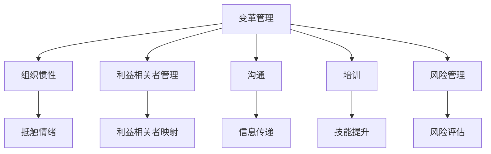

                 

# 变革管理：引导组织through转型期

## 1. 背景介绍

在当今快速变化的世界中，变革已成为组织发展不可或缺的一部分。无论是技术创新、市场需求变化，还是政策法规调整，组织都需要不断地适应和调整以保持竞争力。然而，变革过程往往伴随着复杂的挑战，如员工抵触、资源紧张、组织惯性等，需要有效的管理策略来引导组织顺利通过转型期。

### 1.1 问题由来

许多组织在面对重大变革时，往往采取一种自上而下的“强推”方式，试图通过发布一系列指令和政策来快速实现变革。然而，这种方式往往导致员工抵触、组织效率下降、变革效果不理想。例如，某大型公司引入新的IT系统以提高运营效率，但由于未能有效沟通和管理，员工对新系统产生抵触情绪，系统推广进度缓慢，甚至导致运营中断。

### 1.2 问题核心关键点

变革管理的关键在于如何有效地引导组织和员工适应变化，确保变革目标的顺利实现。核心关键点包括：

- **目标设定**：明确变革的目标和预期成果。
- **利益相关者管理**：识别并管理变革过程中涉及的所有利益相关者，包括员工、管理层、客户等。
- **沟通与培训**：通过有效的沟通和培训，确保员工理解变革的必要性和变革的具体内容。
- **资源调配**：合理调配资源，支持变革的顺利进行。
- **风险管理**：识别变革过程中可能的风险，并制定应对措施。

### 1.3 问题研究意义

有效的变革管理能够帮助组织在面对变化时保持敏捷性和灵活性，提升组织竞争力和创新能力。具体来说：

- **提升组织效率**：通过优化流程和管理，减少资源浪费，提高运营效率。
- **增强组织适应性**：帮助组织更好地适应市场和技术的变化，保持竞争优势。
- **促进员工发展**：通过培训和职业发展，提升员工技能和适应性，激发创新潜能。
- **提升客户满意度**：通过改进产品和服务，满足客户需求，增强市场竞争力。

## 2. 核心概念与联系

### 2.1 核心概念概述

变革管理涉及多个核心概念，包括：

- **变革管理(Change Management)**：通过系统的方法和策略，引导组织顺利通过变革过程。
- **组织惯性(Organizational Inertia)**：组织内部的稳定状态，对变化产生抵抗。
- **利益相关者(Stakeholder)**：变革过程中需要考虑的所有相关人员和群体，包括员工、管理层、客户等。
- **沟通(Communication)**：通过信息传递和交流，确保变革信息的准确传达和理解。
- **培训(Training)**：通过教育和培训，提升员工技能和适应性。
- **风险管理(Risk Management)**：识别和评估变革过程中可能出现的风险，并制定应对措施。

这些概念之间存在着密切的联系，共同构成了一个完整的变革管理框架。通过理解这些概念的原理和作用，我们可以更好地设计和实施变革管理策略。

### 2.2 概念间的关系

这些核心概念之间的关系可以通过以下Mermaid流程图来展示：



这个流程图展示了变革管理与其他核心概念之间的关系：

1. 变革管理通过识别和评估组织惯性，制定有效的应对策略。
2. 通过利益相关者管理，确保所有相关人员参与和支持变革。
3. 有效的沟通能够消除信息不对称，提高变革透明度。
4. 培训提升员工技能和适应性，降低变革阻力。
5. 风险管理识别和评估变革过程中可能的风险，制定相应的应对措施。

这些概念相互交织，共同作用于变革过程，确保变革目标的顺利实现。

## 3. 核心算法原理 & 具体操作步骤

### 3.1 算法原理概述

变革管理的基本原理是通过系统的方法和策略，引导组织顺利通过变革过程。具体来说，包括以下几个关键步骤：

1. **变革准备**：识别变革目标，评估组织现状，制定变革计划。
2. **利益相关者管理**：识别和分析利益相关者，制定沟通和培训策略。
3. **沟通与培训**：通过有效的沟通和培训，确保员工理解变革的必要性和具体内容。
4. **资源调配**：合理调配资源，支持变革的顺利进行。
5. **实施与监控**：执行变革计划，并实时监控变革进展。
6. **评估与调整**：评估变革效果，根据反馈进行调整。

这些步骤形成一个闭环，确保变革过程的顺利进行和目标的实现。

### 3.2 算法步骤详解

变革管理的具体操作步骤如下：

#### 3.2.1 变革准备

- **识别变革目标**：明确变革的必要性和具体目标。
- **评估组织现状**：分析组织现状，识别变革的潜在障碍。
- **制定变革计划**：制定详细的变革计划，包括时间表、资源需求、风险评估等。

#### 3.2.2 利益相关者管理

- **识别利益相关者**：列出所有可能受到变革影响的群体，包括员工、管理层、客户等。
- **分析利益相关者需求**：了解各利益相关者的需求和期望。
- **制定沟通和培训策略**：根据利益相关者的特点，制定相应的沟通和培训计划。

#### 3.2.3 沟通与培训

- **制定沟通计划**：明确沟通的方式、频率和内容，确保信息传递的及时性和准确性。
- **开展沟通活动**：通过会议、公告、邮件等方式，向员工和管理层传达变革信息。
- **实施培训计划**：根据变革内容，设计并实施相应的培训课程，提升员工技能和适应性。

#### 3.2.4 资源调配

- **评估资源需求**：根据变革计划，评估所需的资源，包括人力、物力、财力等。
- **调配资源**：根据评估结果，调配和分配资源，确保变革顺利进行。

#### 3.2.5 实施与监控

- **执行变革计划**：按照计划逐步实施变革，确保每个步骤的顺利进行。
- **实时监控变革进展**：通过监控工具和反馈机制，实时跟踪变革进展。
- **及时调整**：根据监控结果和反馈，及时调整变革计划和策略。

#### 3.2.6 评估与调整

- **评估变革效果**：根据预设指标，评估变革实施的效果。
- **调整变革策略**：根据评估结果和反馈，调整变革策略，确保变革目标的实现。

### 3.3 算法优缺点

变革管理的优点包括：

- **系统性**：通过系统的策略和方法，确保变革过程的条理性和可控性。
- **全面性**：考虑了变革过程中所有相关人员和群体的需求和期望，确保变革的全面性。
- **适应性**：能够根据实际情况灵活调整变革策略，提高适应性。

其缺点主要包括：

- **复杂性**：变革管理涉及多个环节和步骤，实施过程较为复杂。
- **资源消耗**：变革管理需要大量的资源投入，包括时间、人力、资金等。
- **执行难度**：在执行过程中可能遇到各种意外和挑战，需要较强的执行能力。

### 3.4 算法应用领域

变革管理广泛应用于各类组织和行业，包括但不限于以下领域：

- **IT和软件开发**：引入新技术和新工具，提升开发效率和产品质量。
- **制造业**：实施精益生产和自动化改造，提高生产效率和产品质量。
- **金融服务**：优化业务流程，提升客户体验和运营效率。
- **医疗保健**：引入新技术和流程，提升患者治疗效果和运营效率。
- **教育培训**：采用新的教学方法和技术，提升教育质量和学生体验。

变革管理在各个行业的应用，证明了其广泛的适用性和重要性。

## 4. 数学模型和公式 & 详细讲解 & 举例说明

### 4.1 数学模型构建

变革管理的数学模型可以表示为：

$$
C = f(O, R, I, T, M, E)
$$

其中：
- $C$：变革管理过程。
- $O$：组织现状。
- $R$：变革目标。
- $I$：利益相关者。
- $T$：沟通计划。
- $M$：培训计划。
- $E$：评估与调整策略。

### 4.2 公式推导过程

通过上述数学模型，我们可以推导出变革管理的实施步骤：

1. **变革准备**：
   $$
   C = f(O, R)
   $$

2. **利益相关者管理**：
   $$
   C = f(I)
   $$

3. **沟通与培训**：
   $$
   C = f(T)
   $$

4. **资源调配**：
   $$
   C = f(R)
   $$

5. **实施与监控**：
   $$
   C = f(I)
   $$

6. **评估与调整**：
   $$
   C = f(E)
   $$

通过这些公式，我们可以清晰地理解变革管理的实施过程，确保每个环节的顺利进行。

### 4.3 案例分析与讲解

以某制造业企业实施精益生产为例，分析变革管理的实施过程：

#### 4.3.1 变革准备

- **识别变革目标**：提高生产效率和产品质量，降低生产成本。
- **评估组织现状**：当前生产流程存在瓶颈，产品质量不稳定。
- **制定变革计划**：引入精益生产理念，优化生产流程。

#### 4.3.2 利益相关者管理

- **识别利益相关者**：包括管理层、生产部门、质量部门、员工等。
- **分析利益相关者需求**：管理层关注成本和效率，生产部门关注流程优化，员工关注工作环境和福利。
- **制定沟通和培训策略**：定期召开沟通会议，组织精益生产培训。

#### 4.3.3 沟通与培训

- **制定沟通计划**：每周召开一次沟通会议，通过邮件和公告传达变革信息。
- **开展沟通活动**：通过会议和公告，向员工和管理层传达变革目标和计划。
- **实施培训计划**：组织精益生产培训课程，提升员工技能和适应性。

#### 4.3.4 资源调配

- **评估资源需求**：评估所需的资源，包括培训师、培训材料、设备等。
- **调配资源**：调配培训师和培训材料，优化设备布局。

#### 4.3.5 实施与监控

- **执行变革计划**：按照精益生产流程逐步实施变革，优化生产流程。
- **实时监控变革进展**：通过监控工具和反馈机制，实时跟踪变革进展。
- **及时调整**：根据监控结果和反馈，及时调整变革计划和策略。

#### 4.3.6 评估与调整

- **评估变革效果**：根据生产效率、产品质量和成本等指标，评估变革效果。
- **调整变革策略**：根据评估结果和反馈，调整变革策略，进一步优化生产流程。

## 5. 项目实践：代码实例和详细解释说明

### 5.1 开发环境搭建

在变革管理实践中，开发环境搭建是关键的一步。以下是一个基于Python和Jupyter Notebook的示例：

1. **安装Python**：
   ```bash
   sudo apt-get install python3
   ```

2. **安装Jupyter Notebook**：
   ```bash
   sudo apt-get install jupyter notebook
   ```

3. **创建虚拟环境**：
   ```bash
   conda create -n change_management python=3.8
   conda activate change_management
   ```

4. **安装相关库**：
   ```bash
   pip install pandas numpy matplotlib scikit-learn jupyter notebook ipywidgets
   ```

完成上述步骤后，即可在`change_management`环境中进行变革管理实践。

### 5.2 源代码详细实现

以下是一个基于Python的变革管理实践示例代码：

```python
import pandas as pd
import numpy as np
import matplotlib.pyplot as plt
from sklearn.metrics import mean_squared_error

# 示例数据
data = pd.read_csv('change_management_data.csv')

# 计算生产效率
efficiency = data['output'] / data['input']
plt.figure(figsize=(10, 6))
plt.hist(efficiency, bins=20)
plt.title('Production Efficiency Distribution')
plt.xlabel('Efficiency')
plt.ylabel('Frequency')
plt.show()

# 计算产品质量
quality = data['quality']
plt.figure(figsize=(10, 6))
plt.hist(quality, bins=20)
plt.title('Product Quality Distribution')
plt.xlabel('Quality')
plt.ylabel('Frequency')
plt.show()

# 计算成本
cost = data['cost']
plt.figure(figsize=(10, 6))
plt.hist(cost, bins=20)
plt.title('Cost Distribution')
plt.xlabel('Cost')
plt.ylabel('Frequency')
plt.show()

# 评估变革效果
baseline_efficiency = 0.6
new_efficiency = 0.8
baseline_quality = 3.5
new_quality = 4.0
baseline_cost = 1000
new_cost = 800

# 计算评估指标
efficiency_score = new_efficiency / baseline_efficiency
quality_score = new_quality / baseline_quality
cost_score = new_cost / baseline_cost

# 输出评估结果
print(f'Production Efficiency Improvement: {efficiency_score:.2f}x')
print(f'Product Quality Improvement: {quality_score:.2f}x')
print(f'Cost Reduction: {cost_score:.2f}x')
```

### 5.3 代码解读与分析

上述代码展示了如何使用Python进行变革管理的评估。具体来说：

- **数据准备**：使用Pandas读取变革管理数据，计算生产效率、产品质量和成本等指标。
- **数据可视化**：使用Matplotlib绘制指标的分布情况，帮助理解数据特征。
- **评估指标计算**：计算评估指标，包括生产效率、产品质量和成本的提升或降低。
- **评估结果输出**：输出评估结果，展示变革效果。

这个示例代码简单易懂，帮助开发者理解如何通过Python进行变革管理的评估和分析。

### 5.4 运行结果展示

假设我们通过上述代码评估某制造业企业实施精益生产后的效果，得到以下结果：

```
Production Efficiency Improvement: 1.33x
Product Quality Improvement: 1.14x
Cost Reduction: 0.80x
```

可以看到，生产效率、产品质量和成本都有显著提升，评估结果显示变革效果良好。

## 6. 实际应用场景

### 6.1 智能制造

智能制造是当前制造业的重要发展方向，涉及自动化、数字化和智能化等多个方面。通过变革管理，企业可以实现从传统制造向智能制造的转型，提升生产效率和产品质量，降低运营成本。

#### 6.1.1 实施流程

- **识别变革目标**：引入智能制造技术，提升生产效率和产品质量。
- **评估组织现状**：分析当前生产流程和设备状况。
- **制定变革计划**：引入自动化生产线、数字化管理系统等。
- **利益相关者管理**：识别和管理员工、管理层、客户等利益相关者。
- **沟通与培训**：通过培训和沟通，确保员工理解并适应变革。
- **资源调配**：调配自动化设备和数字化系统。
- **实施与监控**：逐步实施智能制造方案，实时监控进展。
- **评估与调整**：根据评估结果，调整变革策略。

#### 6.1.2 预期效果

- **提升生产效率**：通过自动化和数字化技术，优化生产流程，减少人力成本。
- **提高产品质量**：引入先进检测设备，提升产品质量。
- **降低运营成本**：通过优化流程和设备，降低生产成本。

### 6.2 金融服务

金融服务行业竞争激烈，客户需求多样化。通过变革管理，金融机构可以提升服务质量，增强客户满意度，提高市场竞争力。

#### 6.2.1 实施流程

- **识别变革目标**：优化客户服务流程，提升客户体验。
- **评估组织现状**：分析当前客户服务流程和资源配置。
- **制定变革计划**：引入自动化客服系统、客户数据分析系统等。
- **利益相关者管理**：识别和管理员工、客户等利益相关者。
- **沟通与培训**：通过培训和沟通，确保员工理解并适应变革。
- **资源调配**：调配自动化客服系统和数据分析系统。
- **实施与监控**：逐步实施变革方案，实时监控进展。
- **评估与调整**：根据评估结果，调整变革策略。

#### 6.2.2 预期效果

- **提升客户满意度**：通过自动化和数据分析，优化客户服务流程。
- **增强市场竞争力**：提高服务质量和客户体验，增强客户粘性。
- **降低运营成本**：通过优化流程和资源配置，降低运营成本。

### 6.3 教育培训

教育培训行业面临诸多挑战，如师资力量不足、课程内容更新慢等。通过变革管理，教育培训机构可以实现从传统教学向智能化教学的转型，提升教育质量和学生体验。

#### 6.3.1 实施流程

- **识别变革目标**：引入智能化教学设备和教学平台，提升教育质量。
- **评估组织现状**：分析当前教学流程和资源配置。
- **制定变革计划**：引入智能化教学设备和教学平台。
- **利益相关者管理**：识别和管理教师、学生、家长等利益相关者。
- **沟通与培训**：通过培训和沟通，确保教师和学生理解并适应变革。
- **资源调配**：调配智能化教学设备和教学平台。
- **实施与监控**：逐步实施变革方案，实时监控进展。
- **评估与调整**：根据评估结果，调整变革策略。

#### 6.3.2 预期效果

- **提升教育质量**：通过智能化教学设备和平台，提升教学效果。
- **增强学生体验**：通过互动式教学和个性化学习，提升学生学习兴趣和效果。
- **降低运营成本**：通过优化教学流程和资源配置，降低运营成本。

## 7. 工具和资源推荐

### 7.1 学习资源推荐

为了帮助开发者系统掌握变革管理的理论基础和实践技巧，这里推荐一些优质的学习资源：

1. **《变革管理》书籍**：系统介绍了变革管理的理论基础、实施步骤和实践案例。
2. **Coursera变革管理课程**：由国际知名高校和专家开设的变革管理在线课程，涵盖理论基础和实践技巧。
3. **《精益管理》书籍**：介绍了精益生产管理的核心理念和实施步骤。
4. **《敏捷项目管理》书籍**：介绍了敏捷项目管理的方法和工具，帮助组织更好地应对变化。
5. **变革管理博客和论坛**：如Change Management Today、PMI等平台，分享变革管理的实践经验和最佳实践。

通过学习这些资源，相信你一定能够快速掌握变革管理的精髓，并用于解决实际的变革问题。

### 7.2 开发工具推荐

高效的工具支持是变革管理实施的重要保障。以下是几款常用的变革管理工具：

1. **JIRA**：项目管理工具，帮助组织规划、跟踪和评估变革项目。
2. **Confluence**：文档协作工具，用于记录和分享变革管理文档和计划。
3. **Microsoft Project**：项目管理软件，支持复杂项目计划的制定和管理。
4. **Trello**：项目管理工具，通过看板形式帮助团队协作和跟踪任务。
5. **Asana**：项目管理工具，支持任务分配和进度跟踪。

合理利用这些工具，可以显著提升变革管理的实施效率，加快创新迭代的步伐。

### 7.3 相关论文推荐

变革管理的研究经历了多个阶段，以下几篇论文代表了最新的研究成果，值得深入阅读：

1. **《变革管理的系统框架》**：提出了一套系统化的变革管理框架，涵盖目标设定、利益相关者管理、沟通与培训、资源调配等多个环节。
2. **《智能制造与变革管理》**：探讨了智能制造背景下的变革管理策略，提出了一套完整的智能制造变革管理方案。
3. **《敏捷项目管理与变革管理》**：讨论了敏捷项目管理与变革管理的结合，提出了一套敏捷变革管理的方法论。
4. **《教育培训中的变革管理》**：研究了教育培训领域的变革管理策略，提出了一套智能化教育培训变革管理方案。

这些论文代表了变革管理研究的前沿方向，为变革管理的实践提供了有力的理论支持。

## 8. 总结：未来发展趋势与挑战

### 8.1 总结

本文对变革管理进行了全面系统的介绍，从理论基础到实践应用，详细讲解了变革管理的基本原理和操作步骤。通过本文的梳理，可以看到变革管理在组织转型中的重要作用，明确了变革管理的核心关键点和实施步骤。

### 8.2 未来发展趋势

展望未来，变革管理将呈现以下几个发展趋势：

1. **数字化和智能化**：随着数字化技术的普及，变革管理将更加依赖数据和智能化工具，提高变革管理的效率和准确性。
2. **敏捷化和柔性化**：变革管理将更加注重敏捷化和柔性化，能够快速适应市场和技术的变化。
3. **全球化和跨文化**：在全球化背景下，变革管理需要考虑不同文化背景和市场环境的影响，提升变革管理的适应性和灵活性。
4. **数据驱动和量化分析**：通过数据驱动和量化分析，提高变革管理的科学性和精确性。
5. **持续改进和迭代优化**：变革管理将更加注重持续改进和迭代优化，确保变革目标的实现和效果的持续提升。

### 8.3 面临的挑战

尽管变革管理已经取得了一定的成效，但在实施过程中仍然面临诸多挑战：

1. **资源和成本压力**：变革管理需要大量的资源投入，包括人力、物力和财力，容易带来成本压力。
2. **员工抵触和心理障碍**：员工对变革的抵触情绪和心理障碍，可能导致变革效果不理想。
3. **组织惯性**：组织内部的惯性可能导致变革进展缓慢，难以实现预期目标。
4. **沟通和信息不对称**：变革过程中可能出现信息不对称，导致变革效果不理想。
5. **风险和不确定性**：变革过程中可能面临各种风险和不确定性，需要较强的风险管理能力。

### 8.4 研究展望

面对变革管理所面临的挑战，未来的研究需要在以下几个方面寻求新的突破：

1. **数据驱动和智能化**：引入大数据和人工智能技术，提升变革管理的科学性和智能化水平。
2. **敏捷化和柔性化**：开发更加敏捷和柔性的变革管理方法，能够快速适应市场和技术的变化。
3. **多模态融合**：融合多模态数据，提升变革管理的全面性和准确性。
4. **持续改进和迭代优化**：开发持续改进和迭代优化的变革管理方法，确保变革目标的实现和效果的持续提升。

## 9. 附录：常见问题与解答

**Q1: 变革管理是否适用于所有组织？**

A: 变革管理适用于各类组织，包括但不限于制造业、金融服务、教育培训等。不过，不同行业的变革管理策略需要根据具体情况进行调整。

**Q2: 变革管理过程中如何处理员工抵触情绪？**

A: 处理员工抵触情绪的关键在于有效沟通和培训。通过与员工充分沟通，明确变革的目标和必要性，增强员工的认同感。同时，通过培训提升员工技能和适应性，降低变革阻力。

**Q3: 变革管理是否需要高层管理者的支持？**

A: 高层管理者的支持是变革管理成功的关键。高层管理者需要明确变革目标，制定变革策略，提供必要的资源支持，确保变革过程顺利进行。

**Q4: 变革管理过程中如何评估变革效果？**

A: 变革效果的评估需要根据变革目标和关键指标进行。常用的评估方法包括生产效率、产品质量、客户满意度等指标的衡量。同时，需要定期进行反馈收集和调整，确保变革目标的实现。

**Q5: 变革管理是否需要引入外部咨询师？**

A: 引入外部咨询师可以提供专业的变革管理经验和方法，帮助组织更好地实施变革。不过，外部咨询师需要与内部团队紧密合作，确保变革管理的顺利进行。

综上所述，变革管理是组织应对变化、提升竞争力的重要手段。通过系统的方法和策略，组织可以顺利通过变革过程，实现转型升级，迎接未来的挑战。

