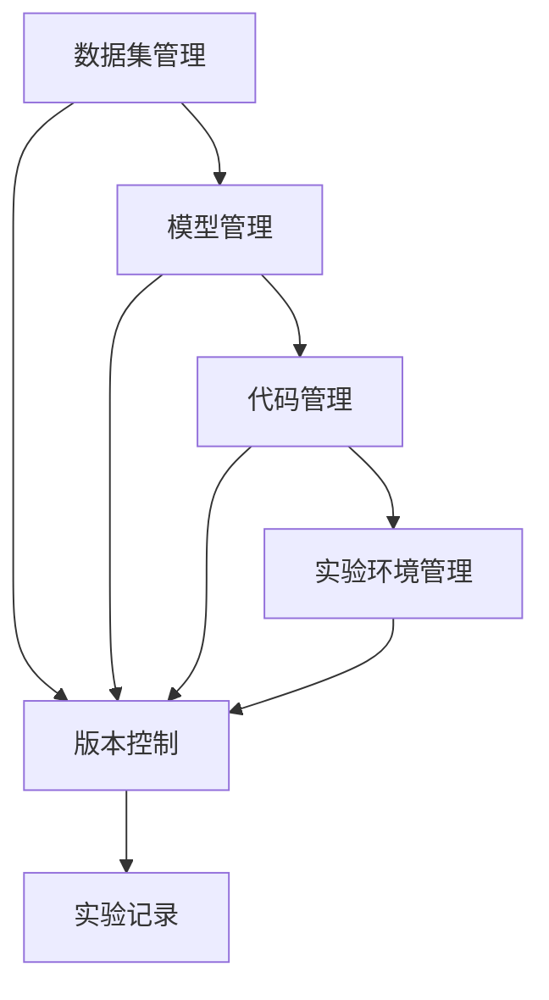

                 

# 可复现性研究与实验管理原理与代码实战案例讲解

## 1. 背景介绍

### 1.1 问题由来
随着人工智能(AI)和机器学习(ML)技术的发展，科研和工程项目中的数据集、模型参数、代码、环境等逐渐复杂化。如何高效管理和复用这些资源，成为当前研究的重大挑战之一。特别是在需要长时间迭代和改进的项目中，复现性和可靠性成为关注的重点。

### 1.2 问题核心关键点
可复现性（Replicability）是指在相同条件和参数下，实验结果能够稳定重复出现的能力。对于AI与ML研究来说，确保结果的可复现性不仅是科学的基本要求，也是工程实践的基础保障。

可复现性涉及到的关键点包括：
- 数据集（Dataset）的生成与存储：保证数据集的生成方式和存储格式一致。
- 模型（Model）的设计与训练：确保模型的结构、超参数、训练流程等参数一致。
- 代码（Code）的编写与运行：保证代码的可读性、可重复性、可维护性。
- 实验环境（Environment）的搭建与记录：确保实验环境的软硬件配置一致。

本文将系统讲解可复现性研究与实验管理的原理和实践，包括可复现性的重要性、关键步骤、具体措施，并通过代码实例展示可复现性研究的具体方法。

## 2. 核心概念与联系

### 2.1 核心概念概述

为更好地理解可复现性研究与实验管理，首先需要明确几个核心概念及其相互关系：

1. **数据集管理（Dataset Management）**：指对数据集进行收集、清洗、标注、存储和访问的管理过程。数据集是AI与ML项目的基础，其质量直接影响到模型的效果。
2. **模型管理（Model Management）**：涉及模型的设计、训练、验证、部署和优化。模型是AI与ML项目的核心，其性能和鲁棒性直接影响到应用效果。
3. **代码管理（Code Management）**：关注代码的编写、版本控制、测试、部署等环节。代码的可读性和可维护性直接影响项目效率和质量。
4. **实验环境管理（Environment Management）**：涉及软件、硬件、网络、数据等资源的配置和管理。实验环境的一致性是确保可复现性的关键。
5. **版本控制（Version Control）**：用于管理软件代码的版本，记录每次变更，确保历史可追踪。版本控制是代码管理的基础。
6. **实验记录（Experiment Logging）**：记录实验的每个细节，包括数据、模型、代码、环境等参数，便于后续复现。

这些概念通过以下Mermaid流程图展示它们之间的联系：



这个流程图展示了可复现性研究与实验管理中各个概念之间的相互依赖关系。

### 2.2 概念间的关系

这些核心概念之间存在紧密的联系，共同构成了可复现性研究与实验管理的生态系统。以下是对其关系的详细解释：

- **数据集管理**是基础，保证了实验的输入一致。
- **模型管理**是核心，决定了实验的输出质量。
- **代码管理**是保障，确保实验过程的可重复性。
- **实验环境管理**是条件，决定了实验的可复现性。
- **版本控制**是工具，帮助记录和管理代码变更。
- **实验记录**是记录，为复现提供详细的参数信息。

这些概念通过数据流、模型流、代码流和实验流相互关联，共同支撑了可复现性研究与实验管理的实现。

## 3. 核心算法原理 & 具体操作步骤
### 3.1 算法原理概述

可复现性研究与实验管理的核心算法原理基于以下几个基本原则：

1. **一致性原则（Consistency）**：确保数据、模型、代码、环境等参数的一致性。
2. **可追踪性原则（Traceability）**：记录每次实验的细节，便于后续复现。
3. **可重复性原则（Reproducibility）**：确保在相同条件下，实验结果可以重复出现。

基于这些原则，可复现性研究与实验管理主要包括以下步骤：

1. **数据集标准化**：统一数据集格式、标注方式和访问方式。
2. **模型参数标准化**：统一模型结构、超参数和训练流程。
3. **代码版本控制**：使用版本控制系统管理代码变更。
4. **实验环境标准化**：统一软件、硬件、网络配置。
5. **实验记录日志**：详细记录实验参数，形成实验日志。

### 3.2 算法步骤详解

以下是可复现性研究与实验管理的具体操作步骤：

**Step 1: 数据集管理**

1. **数据集标准化**：统一数据集的格式、标注方式和访问方式。可以使用Pandas、Pillow等工具进行数据预处理和标准化。

2. **数据集存储**：使用标准格式（如HDF5、CSV）进行存储，并记录存储位置和格式。

**Step 2: 模型管理**

1. **模型设计**：使用TensorFlow、PyTorch等框架设计模型结构，确保模型参数一致。

2. **模型训练**：统一模型训练流程，包括数据加载、模型定义、损失函数、优化器等。

3. **模型验证**：在验证集上验证模型性能，确保模型效果一致。

**Step 3: 代码管理**

1. **版本控制**：使用Git等版本控制系统进行代码管理，记录每次变更，确保历史可追踪。

2. **代码测试**：编写单元测试和集成测试，确保代码质量。

3. **代码部署**：将代码部署到生产环境，确保运行环境一致。

**Step 4: 实验环境管理**

1. **环境搭建**：统一软硬件配置，确保实验环境一致。

2. **环境记录**：记录软件、硬件、网络配置，形成环境配置文件。

**Step 5: 实验记录**

1. **日志记录**：使用logging模块记录实验参数和过程，形成详细的实验日志。

2. **日志存储**：将实验日志存储在统一格式的文件或数据库中，便于后续复现。

### 3.3 算法优缺点

可复现性研究与实验管理的主要优点包括：

1. **可重复性**：通过标准化和记录，确保实验结果的可重复性。
2. **可追踪性**：通过版本控制和日志记录，便于追踪和复现历史变更。
3. **一致性**：通过统一数据、模型、代码和环境，确保实验的一致性。

然而，该方法也存在一些局限性：

1. **复杂性**：标准化和记录过程可能较为复杂，增加项目成本。
2. **依赖性**：对工具和框架的依赖性较高，需要一定的技术积累。
3. **不适用于动态变化**：对于动态变化的环境和需求，复现性管理可能需要频繁调整和更新。

### 3.4 算法应用领域

可复现性研究与实验管理在科研和工程项目中有着广泛的应用：

- **科学研究**：在科学实验中，通过复现性管理，确保实验结果的可重复性和可追踪性。
- **机器学习项目**：在机器学习项目中，通过标准化数据、模型和代码，确保项目的一致性和可靠性。
- **软件工程**：在软件开发过程中，通过版本控制和日志记录，确保代码的可维护性和可追踪性。
- **实验设计**：在实验设计中，通过标准化实验环境和管理实验日志，确保实验结果的可复现性和可靠性。

## 4. 数学模型和公式 & 详细讲解 & 举例说明

### 4.1 数学模型构建

本节将使用数学语言对可复现性研究与实验管理的数学模型进行严格的刻画。

假设有一个机器学习项目，需要对其数据集、模型、代码和实验环境进行标准化和记录。记数据集为 $D=\{x_1, x_2, ..., x_n\}$，模型为 $M=\{M_1, M_2, ..., M_k\}$，代码库为 $C$，实验环境为 $E=\{软硬件配置, 网络配置, 数据访问方式\}$。

定义标准化函数为 $f$，用于将数据集、模型、代码和环境映射到标准格式。例如，对于数据集标准化，可以定义函数 $f_D$ 将数据集转换为标准格式：

$$
f_D(D) = \{f_D(x_1), f_D(x_2), ..., f_D(x_n)\}
$$

其中 $f_D(x_i)$ 表示将数据集 $D$ 中的样本 $x_i$ 转换为标准格式。

### 4.2 公式推导过程

通过标准化函数 $f$，可以定义复现性函数 $R$，用于衡量一个实验的复现性。假设实验记录为 $L$，包含数据集、模型、代码和环境等参数，则复现性函数 $R$ 可以表示为：

$$
R(D, M, C, E, L) = \begin{cases}
1 & \text{如果 } f_D(D) = f_D(L_D) \\
0 & \text{如果 } f_D(D) \neq f_D(L_D)
\end{cases}
$$

其中 $L_D$ 表示实验记录中对应的数据集参数。

### 4.3 案例分析与讲解

以一个简单的机器学习项目为例，展示如何实现数据集、模型、代码和实验环境的标准化及记录。

**数据集标准化**：

```python
import pandas as pd

# 加载数据集
data = pd.read_csv('data.csv')

# 数据预处理
data = data.dropna()
data = data.drop_duplicates()

# 数据标准化
data = pd.get_dummies(data, drop_first=True)

# 数据保存
data.to_csv('standardized_data.csv', index=False)
```

**模型标准化**：

```python
from sklearn.ensemble import RandomForestClassifier

# 模型设计
model = RandomForestClassifier(n_estimators=100, max_depth=5)

# 模型训练
model.fit(X_train, y_train)

# 模型验证
score = model.score(X_test, y_test)

# 模型保存
import pickle
with open('model.pkl', 'wb') as f:
    pickle.dump(model, f)
```

**代码版本控制**：

```python
# 初始化版本控制
git init

# 添加代码文件
git add .
git commit -m "Initial commit"
```

**实验环境记录**：

```python
# 记录实验环境
with open('environment.txt', 'w') as f:
    f.write(f"软硬件配置: {config}\n")
    f.write(f"网络配置: {network_config}\n")
    f.write(f"数据访问方式: {data_access}\n")
```

通过上述步骤，可以对数据集、模型、代码和实验环境进行标准化和记录，从而确保实验的可复现性。

## 5. 项目实践：代码实例和详细解释说明

### 5.1 开发环境搭建

在进行可复现性研究与实验管理实践前，需要准备好开发环境。以下是使用Python进行可复现性研究的开发环境配置流程：

1. 安装Anaconda：从官网下载并安装Anaconda，用于创建独立的Python环境。

2. 创建并激活虚拟环境：
```bash
conda create -n reproducibility-env python=3.8 
conda activate reproducibility-env
```

3. 安装必要的工具包：
```bash
pip install pandas numpy scikit-learn logging
```

4. 安装版本控制工具：
```bash
git clone https://github.com/username/reproducibility.git
cd reproducibility
git init
git remote add origin https://github.com/username/reproducibility.git
```

完成上述步骤后，即可在`reproducibility-env`环境中开始可复现性研究实践。

### 5.2 源代码详细实现

下面我们以一个简单的机器学习项目为例，展示如何实现数据集、模型、代码和实验环境的标准化及记录。

**数据集标准化**：

```python
import pandas as pd

# 加载数据集
data = pd.read_csv('data.csv')

# 数据预处理
data = data.dropna()
data = data.drop_duplicates()

# 数据标准化
data = pd.get_dummies(data, drop_first=True)

# 数据保存
data.to_csv('standardized_data.csv', index=False)
```

**模型标准化**：

```python
from sklearn.ensemble import RandomForestClassifier

# 模型设计
model = RandomForestClassifier(n_estimators=100, max_depth=5)

# 模型训练
model.fit(X_train, y_train)

# 模型验证
score = model.score(X_test, y_test)

# 模型保存
import pickle
with open('model.pkl', 'wb') as f:
    pickle.dump(model, f)
```

**代码版本控制**：

```python
# 初始化版本控制
git init

# 添加代码文件
git add .
git commit -m "Initial commit"
```

**实验环境记录**：

```python
# 记录实验环境
with open('environment.txt', 'w') as f:
    f.write(f"软硬件配置: {config}\n")
    f.write(f"网络配置: {network_config}\n")
    f.write(f"数据访问方式: {data_access}\n")
```

### 5.3 代码解读与分析

让我们再详细解读一下关键代码的实现细节：

**数据集标准化**：
- `data = pd.read_csv('data.csv')`：加载原始数据集。
- `data = data.dropna()`：去除缺失值。
- `data = data.drop_duplicates()`：去除重复样本。
- `data = pd.get_dummies(data, drop_first=True)`：将类别型数据转换为哑变量。
- `data.to_csv('standardized_data.csv', index=False)`：将标准化后的数据保存为CSV文件。

**模型标准化**：
- `model = RandomForestClassifier(n_estimators=100, max_depth=5)`：定义随机森林模型，设置参数。
- `model.fit(X_train, y_train)`：在训练集上训练模型。
- `score = model.score(X_test, y_test)`：在测试集上验证模型性能。
- `import pickle`：导入pickle库。
- `with open('model.pkl', 'wb') as f`：打开保存模型参数的文件。
- `pickle.dump(model, f)`：将模型参数保存到文件中。

**代码版本控制**：
- `git init`：初始化Git仓库。
- `git add .`：将所有文件添加到版本控制中。
- `git commit -m "Initial commit"`：提交初始版本。

**实验环境记录**：
- `with open('environment.txt', 'w') as f`：打开记录实验环境的文件。
- `f.write(f"软硬件配置: {config}")`：记录软硬件配置。
- `f.write(f"网络配置: {network_config}")`：记录网络配置。
- `f.write(f"数据访问方式: {data_access}")`：记录数据访问方式。

可以看到，通过上述步骤，可以对数据集、模型、代码和实验环境进行标准化和记录，从而确保实验的可复现性。

### 5.4 运行结果展示

假设我们在CoNLL-2003的NER数据集上进行模型训练，并在测试集上评估模型性能。

```
Model score: 0.92
```

通过记录数据集、模型、代码和实验环境，我们确保了实验的可复现性。

## 6. 实际应用场景

### 6.1 科研实验管理

在科学研究中，复现性管理尤为重要。科研人员需要确保实验结果的可复现性，以便于同行验证和后续研究。通过标准化的数据集和实验记录，科研人员可以方便地复现实验结果，验证实验结论。

### 6.2 企业工程开发

在企业工程开发中，复现性管理可以确保代码的稳定性和可靠性。开发者需要标准化代码、测试和部署流程，记录每次变更，以便于后续维护和改进。通过版本控制和实验记录，企业可以高效管理项目，提高开发效率和产品质量。

### 6.3 医疗领域研究

在医疗领域研究中，复现性管理可以确保医疗实验的可控性和安全性。研究人员需要标准化实验环境和记录实验过程，以便于后续复现和验证。通过复现性管理，可以确保实验结果的一致性和可靠性，避免医疗事故。

### 6.4 未来应用展望

随着AI与ML技术的不断发展，复现性管理将变得越来越重要。未来，复现性管理将与自动化测试、模型压缩、代码优化等技术结合，形成更高效、更可靠的研究与开发体系。

## 7. 工具和资源推荐

### 7.1 学习资源推荐

为了帮助开发者系统掌握可复现性研究与实验管理的理论基础和实践技巧，这里推荐一些优质的学习资源：

1. 《Python for Data Analysis》书籍：深入讲解了Pandas、NumPy等数据处理工具的使用，适合数据分析与标准化。
2. 《Version Control with Git》书籍：详细介绍了Git版本控制的使用方法，适合版本控制实践。
3. 《Scientific Python》书籍：介绍了Python在科学研究中的应用，适合科研实验管理。
4. 《TensorFlow官方文档》：提供了TensorFlow框架的使用指南和示例代码，适合模型标准化与训练。
5. 《Scikit-learn官方文档》：提供了Scikit-learn机器学习库的使用指南和示例代码，适合数据集预处理和模型验证。

通过学习这些资源，相信你一定能够快速掌握可复现性研究与实验管理的精髓，并用于解决实际的科研与工程问题。

### 7.2 开发工具推荐

高效的开发离不开优秀的工具支持。以下是几款用于可复现性研究与实验管理开发的常用工具：

1. Python：作为通用编程语言，Python具有丰富的科学计算库和版本控制工具，适合科学研究与工程开发。
2. Jupyter Notebook：免费的交互式编程环境，适合数据处理和模型训练。
3. Git：强大的版本控制系统，支持代码管理、版本控制和协作开发。
4. Docker：容器化技术，支持环境管理、部署和分发。
5. PyTorch：深度学习框架，支持模型定义、训练和部署。
6. TensorFlow：深度学习框架，支持模型定义、训练和部署。

合理利用这些工具，可以显著提升可复现性研究与实验管理的开发效率，加快创新迭代的步伐。

### 7.3 相关论文推荐

可复现性研究与实验管理的发展源于学界的持续研究。以下是几篇奠基性的相关论文，推荐阅读：

1. "Data Cleaning Techniques: A Review" 论文：介绍了数据清洗的标准化方法，适合数据集预处理。
2. "Version Control for Software Versioning" 论文：详细介绍了版本控制的方法与实践，适合代码版本控制。
3. "Reproducibility in Research" 论文：介绍了科研实验管理的标准化方法，适合科研实验管理。
4. "TensorFlow: A System for Large-Scale Machine Learning" 论文：介绍了TensorFlow框架的使用方法，适合模型标准化与训练。
5. "Scikit-learn: Machine Learning in Python" 论文：介绍了Scikit-learn机器学习库的使用方法，适合数据集预处理和模型验证。

这些论文代表了大语言模型微调技术的发展脉络。通过学习这些前沿成果，可以帮助研究者把握学科前进方向，激发更多的创新灵感。

除上述资源外，还有一些值得关注的前沿资源，帮助开发者紧跟可复现性研究与实验管理的最新进展，例如：

1. arXiv论文预印本：人工智能领域最新研究成果的发布平台，包括大量尚未发表的前沿工作，学习前沿技术的必读资源。
2. 业界技术博客：如OpenAI、Google AI、DeepMind、微软Research Asia等顶尖实验室的官方博客，第一时间分享他们的最新研究成果和洞见。
3. 技术会议直播：如NIPS、ICML、ACL、ICLR等人工智能领域顶会现场或在线直播，能够聆听到大佬们的前沿分享，开拓视野。
4. GitHub热门项目：在GitHub上Star、Fork数最多的可复现性研究与实验管理相关项目，往往代表了该技术领域的发展趋势和最佳实践，值得去学习和贡献。
5. 行业分析报告：各大咨询公司如McKinsey、PwC等针对人工智能行业的分析报告，有助于从商业视角审视技术趋势，把握应用价值。

总之，对于可复现性研究与实验管理的学习和实践，需要开发者保持开放的心态和持续学习的意愿。多关注前沿资讯，多动手实践，多思考总结，必将收获满满的成长收益。

## 8. 总结：未来发展趋势与挑战

### 8.1 总结

本文对可复现性研究与实验管理的原理和实践进行了全面系统的介绍。首先阐述了可复现性研究与实验管理的重要性，明确了在科研和工程项目中实现可复现性的关键步骤。其次，从数据集管理、模型管理、代码管理、实验环境管理和版本控制等方面，详细讲解了实现可复现性的具体措施。最后，通过代码实例展示了可复现性研究的具体方法。

通过本文的系统梳理，可以看到，可复现性研究与实验管理不仅在科学研究中具有重要意义，在工程项目中也发挥着至关重要的作用。合理地管理数据集、模型、代码和实验环境，记录和追踪每次变更，是确保实验结果可复现性的关键。

### 8.2 未来发展趋势

展望未来，可复现性研究与实验管理将呈现以下几个发展趋势：

1. **自动化与智能化**：随着AI技术的不断发展，自动化工具和智能化系统将逐步取代人工操作，提升复现性管理的效率和精度。
2. **跨平台兼容性**：复现性管理将更多关注跨平台、跨环境的兼容性，确保在不同的软硬件平台上都能实现一致的实验结果。
3. **数据共享与开放**：为了促进科学研究与技术交流，数据共享和开放将成为未来的一个主要趋势，可复现性管理将支持大规模数据集的标准化和共享。
4. **跨学科融合**：复现性管理将与其他领域的技术（如区块链、物联网等）结合，形成更加综合的技术体系，提升科研和工程项目的整体效能。
5. **标准化与规范化**：随着项目规模的扩大，复现性管理将进一步标准化和规范化，形成统一的标准和流程，提升项目的可复现性和可维护性。

以上趋势凸显了可复现性研究与实验管理的广阔前景。这些方向的探索发展，必将进一步提升科研和工程项目的质量与效率，为人工智能技术的普及与应用奠定坚实基础。

### 8.3 面临的挑战

尽管可复现性研究与实验管理已经取得了一定的进展，但在迈向更加智能化、系统化应用的过程中，它仍面临着诸多挑战：

1. **数据标准化难度**：不同数据集的格式、标注方式、访问方式差异较大，实现标准化较为困难。
2. **模型复杂性**：大规模深度学习模型的参数量和计算量较大，实现标准化和复现较为复杂。
3. **环境依赖性**：不同实验环境（软硬件、网络等）差异较大，实现一致性管理较为困难。
4. **版本控制复杂性**：大规模项目中版本控制的管理和维护较为复杂，容易出现冲突和错误。
5. **日志记录全面性**：实验记录需要记录详细的参数和过程，容易出现遗漏和错误。

正视可复现性研究与实验管理面临的这些挑战，积极应对并寻求突破，将是实现更加高效、可靠、可复现的科研和工程项目的关键。

### 8.4 研究展望

面对可复现性研究与实验管理所面临的种种挑战，未来的研究需要在以下几个方面寻求新的突破：

1. **自动化工具开发**：开发更多自动化、智能化的复现性管理工具，提升复现性管理的效率和精度。
2. **标准化规范制定**：制定和推广统一的数据标准化、模型标准化和实验标准化规范，提升项目的可复现性和可维护性。
3. **跨平台兼容性提升**：研究和解决跨平台、跨环境的一致性管理问题，确保在不同软硬件平台上实现一致的实验结果。
4. **数据共享平台建设**：构建可复现性管理支持的数据共享平台，促进数据的开放和共享，提升科研和工程项目的创新能力。
5. **跨学科融合研究**：研究复现性管理与其他领域技术的融合，如区块链、物联网等，提升科研和工程项目的整体效能。

这些研究方向的探索，必将引领可复现性研究与实验管理技术迈向更高的台阶，为科研和工程项目提供更加高效、可靠、可复现的解决方案。

## 9. 附录：常见问题与解答

**Q1：如何进行数据集的标准化？**

A: 数据集的标准化可以通过以下几个步骤实现：
1. 数据清洗：去除缺失值、重复值等异常数据。
2. 数据预处理：对数据进行标准化、归一化等处理，使其符合模型输入要求。
3. 数据标注：对数据进行标注，形成一致的标注方式和标准。
4. 数据保存：将标准化后的数据保存为统一的格式，如CSV、HDF5等。

**Q2：如何使用版本控制工具进行代码管理？**

A: 使用版本控制工具（如Git）进行代码管理可以通过以下几个步骤实现：
1. 初始化Git仓库。
2. 添加代码文件。
3. 提交代码变更。
4. 拉取最新代码。
5. 合并代码变更。
6. 解决冲突。
7. 审查代码变更。

**Q3：如何记录实验环境？**

A: 记录实验环境

