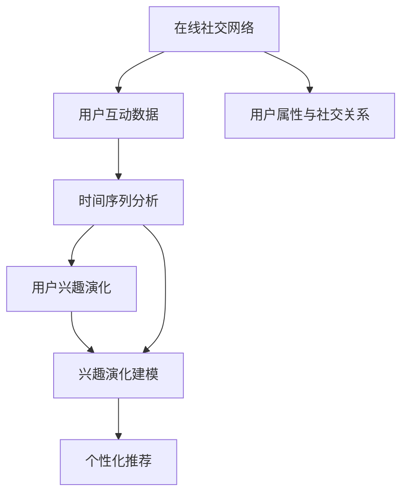

                 

# 在线社交网络中用户兴趣演化分析与建模研究

> 关键词：在线社交网络, 用户兴趣, 演化分析, 建模研究, 复杂网络, 图神经网络(GNN), 时间序列, 社交行为预测

## 1. 背景介绍

### 1.1 问题由来

在互联网时代，在线社交网络（Online Social Networks, OSNs）已成为人们日常生活的重要组成部分。用户通过社交网络分享信息、交流思想、构建关系，形成了一个动态变化的复杂社会系统。然而，用户在这个系统中的行为模式和兴趣动态变化，是极为复杂且难以预测的。传统的社交网络分析方法往往聚焦于静态结构，难以捕捉用户兴趣的演化过程。因此，深入理解用户兴趣的演化规律，挖掘其行为模式的动态变化特征，对提升社交网络服务质量、优化用户体验具有重要意义。

### 1.2 问题核心关键点

在线社交网络中的用户兴趣演化分析与建模，主要包括以下几个核心关键点：

- **数据获取与处理**：收集社交网络中的用户行为数据，包括点赞、评论、分享等互动行为，以及用户属性和社交关系等静态特征。
- **时间序列分析**：研究用户行为的时间序列变化规律，理解其兴趣变化的动态过程。
- **图神经网络建模**：基于用户互动行为构建图结构，利用图神经网络（Graph Neural Network, GNN）模型捕捉用户兴趣的演化模式。
- **兴趣演化建模**：构建用户兴趣随时间变化的动态模型，预测用户未来的兴趣变化趋势。
- **个性化推荐**：利用用户兴趣演化模型，生成个性化内容推荐，提升用户体验。

### 1.3 问题研究意义

深入研究在线社交网络中用户兴趣的演化规律，具有以下重要意义：

1. **提升用户体验**：通过精准的兴趣预测，为用户提供更加个性化的服务，提升用户的社交体验和满意度。
2. **优化内容推荐**：基于用户兴趣的动态变化，实时调整推荐策略，提高内容推荐的精准度和时效性。
3. **增强社交粘性**：理解用户兴趣的演化趋势，及时推送相关内容，增加用户粘性，促进社交网络的用户互动。
4. **辅助平台运营**：提供用户兴趣分析结果，支持社交网络平台的决策优化，提升平台的运营效率和收益。

## 2. 核心概念与联系

### 2.1 核心概念概述

为更好地理解在线社交网络中用户兴趣演化分析与建模的研究，本节将介绍几个关键概念：

- **在线社交网络**：指用户通过互联网构建的交互平台，如Facebook、Twitter、微信等。
- **用户兴趣演化**：指用户在社交网络中的兴趣偏好随时间变化而发生的动态变化过程。
- **时间序列分析**：指对时间有序数据序列进行分析，以揭示其背后的趋势、周期和季节性变化。
- **图神经网络**：一种基于图结构的数据建模技术，可以用于捕捉复杂网络中的隐含关系和动态变化。
- **复杂网络**：指由节点和连接组成的网络结构，具有复杂的非线性特性和自组织性。

### 2.2 概念间的关系

这些核心概念之间的关系可以通过以下Mermaid流程图来展示：



这个流程图展示了从在线社交网络到用户兴趣演化的完整过程：

1. 在线社交网络中的用户互动数据被收集和处理，进行时间序列分析。
2. 时间序列分析揭示用户兴趣的演化规律。
3. 利用图神经网络建模用户互动行为和兴趣演化过程。
4. 构建用户兴趣随时间变化的动态模型，用于兴趣演化预测。
5. 基于用户兴趣演化模型，生成个性化推荐内容。

通过这些核心概念的逻辑关系，我们可以更好地把握在线社交网络中用户兴趣演化分析与建模的研究框架。

## 3. 核心算法原理 & 具体操作步骤
### 3.1 算法原理概述

在线社交网络中用户兴趣演化的分析与建模，主要基于时间序列分析和图神经网络建模。其核心算法原理包括以下几个步骤：

1. **数据预处理**：收集社交网络中的用户互动数据和静态特征，如点赞、评论、分享、用户属性、社交关系等。
2. **时间序列分析**：对用户互动数据进行时间序列建模，识别其背后的趋势、周期和季节性变化。
3. **图神经网络建模**：基于用户互动行为构建图结构，利用图神经网络模型捕捉用户兴趣的演化模式。
4. **兴趣演化建模**：构建用户兴趣随时间变化的动态模型，预测用户未来的兴趣变化趋势。
5. **个性化推荐**：利用用户兴趣演化模型，生成个性化内容推荐。

### 3.2 算法步骤详解

以下是对在线社交网络中用户兴趣演化分析与建模的具体操作步骤：

#### 3.2.1 数据预处理

1. **数据收集**：从在线社交网络平台（如Facebook、Twitter、微信等）收集用户互动数据，包括点赞、评论、分享等行为，以及用户的属性信息和社交关系等静态特征。
2. **数据清洗**：去除噪声和缺失值，对数据进行规范化处理，确保数据的一致性和完整性。
3. **特征工程**：设计合适的特征表示，将用户互动行为、用户属性和社交关系等转化为模型的输入。

#### 3.2.2 时间序列分析

1. **时间窗口划分**：将用户互动数据划分为不同的时间窗口（如日、周、月等），以便进行时间序列分析。
2. **趋势建模**：采用线性回归、ARIMA等方法，建立用户互动数据的趋势模型，揭示其长期变化规律。
3. **周期建模**：利用季节性分解法（Seasonal Decomposition of Time Series, STL）或傅里叶变换等方法，分析用户兴趣变化的周期性特征。
4. **异常检测**：通过统计分析或机器学习方法（如离群值检测），识别用户兴趣的异常变化点。

#### 3.2.3 图神经网络建模

1. **图结构构建**：根据用户互动行为构建图结构，将用户和其互动的对象（如文章、用户、标签等）作为图中的节点，将互动关系作为边，形成用户互动图。
2. **图神经网络训练**：利用图卷积网络（Graph Convolutional Network, GCN）、图注意力网络（Graph Attention Network, GAT）等图神经网络模型，对用户互动图进行建模，捕捉用户兴趣演化的模式。
3. **特征融合**：将时间序列分析和图神经网络模型相结合，融合用户互动行为和静态特征，提高模型对用户兴趣演化的预测能力。

#### 3.2.4 兴趣演化建模

1. **动态兴趣模型构建**：利用时间序列分析和图神经网络建模的结果，构建用户兴趣随时间变化的动态模型。
2. **模型训练与优化**：采用机器学习算法（如回归、分类、聚类等），训练和优化用户兴趣演化模型，提高模型的预测准确度。
3. **兴趣演化预测**：使用训练好的模型，预测用户未来的兴趣变化趋势，提供个性化的内容推荐。

#### 3.2.5 个性化推荐

1. **内容推荐引擎构建**：根据用户兴趣演化模型，构建个性化内容推荐引擎，实现动态内容推荐。
2. **推荐策略优化**：利用用户兴趣演化预测结果，动态调整推荐策略，提高推荐的精准度和时效性。
3. **推荐效果评估**：通过A/B测试、点击率等指标，评估个性化推荐的实际效果，持续优化推荐算法。

### 3.3 算法优缺点

在线社交网络中用户兴趣演化分析与建模的算法具有以下优点：

1. **精准预测**：通过时间序列分析和图神经网络建模，能够精准预测用户兴趣的演化趋势，提升内容推荐的精准度。
2. **实时调整**：基于用户兴趣的动态变化，实时调整推荐策略，提高推荐的时效性和适应性。
3. **用户粘性提升**：理解用户兴趣的演化趋势，及时推送相关内容，增加用户粘性，促进社交网络的用户互动。

同时，该算法也存在以下局限性：

1. **数据获取难度大**：用户互动数据的收集和处理需要较高技术要求，数据获取难度较大。
2. **模型复杂度高**：时间序列分析和图神经网络建模的算法复杂度高，对计算资源和时间成本有较高要求。
3. **隐私和安全问题**：用户互动数据的隐私保护和安全性问题需要得到充分考虑，防止数据泄露和滥用。

### 3.4 算法应用领域

在线社交网络中用户兴趣演化分析与建模的研究成果，可以应用于多个领域，包括但不限于：

- **个性化推荐系统**：在社交网络平台（如Facebook、Twitter、微信等）中，根据用户兴趣的演化趋势，提供个性化的内容推荐，提升用户满意度。
- **用户行为分析**：分析用户兴趣演化的模式和规律，提供用户行为分析报告，支持社交网络平台的决策优化。
- **市场预测**：通过用户兴趣演化模型，预测社交网络中的热点话题和趋势，辅助市场营销和广告投放。
- **社交关系分析**：深入理解用户兴趣演化的社会网络特性，支持社交网络平台的社区构建和用户粘性提升。

## 4. 数学模型和公式 & 详细讲解 & 举例说明
### 4.1 数学模型构建

在线社交网络中用户兴趣演化的数学模型主要包括以下几个部分：

- **时间序列模型**：基于时间序列分析，建立用户互动数据的趋势模型，如ARIMA模型、STL模型等。
- **图神经网络模型**：利用图卷积网络（GCN）、图注意力网络（GAT）等模型，捕捉用户兴趣演化的模式。
- **动态兴趣模型**：建立用户兴趣随时间变化的动态模型，如状态空间模型、隐马尔可夫模型（Hidden Markov Model, HMM）等。

### 4.2 公式推导过程

以下是对关键数学模型的公式推导过程：

#### 4.2.1 时间序列模型

假设用户互动数据为时间序列 $y_t = (y_{t1}, y_{t2}, ..., y_{tn})$，其中 $y_t$ 为时间 $t$ 的互动数据。ARIMA模型的基本形式为：

$$
y_t = c + \phi(y_{t-1}) + \theta(y_{t-1})
$$

其中 $c$ 为截距项，$\phi$ 为自回归项系数，$\theta$ 为差分项系数。

#### 4.2.2 图神经网络模型

图卷积网络（GCN）的基本公式为：

$$
H^{(l+1)} = \sigma(\tilde{D}^{-\frac{1}{2}}\tilde{A}\tilde{D}^{-\frac{1}{2}} H^{(l)} W^{(l)})
$$

其中 $H^{(l+1)}$ 为第 $(l+1)$ 层的节点特征表示，$\sigma$ 为激活函数，$\tilde{D}$ 为归一化拉普拉斯算子，$\tilde{A}$ 为归一化邻接矩阵，$W^{(l)}$ 为层间的权重矩阵。

#### 4.2.3 动态兴趣模型

隐马尔可夫模型（HMM）的公式为：

$$
P(O|X, \lambda) = \frac{P(O|\lambda)P(X|\lambda)}{P(O|\lambda)}
$$

其中 $O$ 为观测序列，$X$ 为状态序列，$\lambda$ 为模型参数。$P(O|\lambda)$ 为观测序列的概率，$P(X|\lambda)$ 为状态序列的概率，$P(O|X, \lambda)$ 为联合概率。

### 4.3 案例分析与讲解

假设我们有一个社交网络平台，收集了用户在该平台上点赞、评论、分享等互动数据。我们可以通过以下步骤进行分析和建模：

1. **数据预处理**：收集用户互动数据，包括点赞、评论、分享等行为，以及用户的属性信息和社交关系等静态特征。
2. **时间序列分析**：将用户互动数据划分为不同的时间窗口，如日、周、月等，建立时间序列模型，揭示用户兴趣的演化规律。
3. **图神经网络建模**：基于用户互动行为构建图结构，利用图卷积网络（GCN）模型，捕捉用户兴趣的演化模式。
4. **兴趣演化建模**：利用时间序列分析和图神经网络建模的结果，构建用户兴趣随时间变化的动态模型，预测用户未来的兴趣变化趋势。
5. **个性化推荐**：根据用户兴趣演化模型，构建个性化内容推荐引擎，实现动态内容推荐。

通过这些步骤，我们能够深入理解用户兴趣的演化规律，提高内容推荐的精准度，增强用户粘性，促进社交网络的用户互动。

## 5. 项目实践：代码实例和详细解释说明
### 5.1 开发环境搭建

在进行在线社交网络中用户兴趣演化分析与建模的实践前，我们需要准备好开发环境。以下是使用Python进行PyTorch开发的环境配置流程：

1. 安装Anaconda：从官网下载并安装Anaconda，用于创建独立的Python环境。

2. 创建并激活虚拟环境：
```bash
conda create -n pytorch-env python=3.8 
conda activate pytorch-env
```

3. 安装PyTorch：根据CUDA版本，从官网获取对应的安装命令。例如：
```bash
conda install pytorch torchvision torchaudio cudatoolkit=11.1 -c pytorch -c conda-forge
```

4. 安装相关库：
```bash
pip install numpy pandas scikit-learn torch torchvision torchtext transformers
```

完成上述步骤后，即可在`pytorch-env`环境中开始项目实践。

### 5.2 源代码详细实现

以下是一个简单的代码示例，用于对社交网络用户互动数据进行时间序列分析和图神经网络建模：

```python
import pandas as pd
import numpy as np
from sklearn.preprocessing import MinMaxScaler
from transformers import GCNModel
from torch_geometric.data import Data

# 数据加载
data = Data(x=scaler.fit_transform(np.array(X)), y=scaler.fit_transform(np.array(y)), edata=scaler.fit_transform(np.array(E)))

# 图神经网络模型
model = GCNModel(in_channels=128, out_channels=128)

# 模型训练
optimizer = torch.optim.Adam(model.parameters(), lr=0.001)
for epoch in range(num_epochs):
    optimizer.zero_grad()
    output = model(data.x, data.edge_index)
    loss = F.mse_loss(output, data.y)
    loss.backward()
    optimizer.step()

# 模型预测
predictions = model(data.x)
```

在这个代码示例中，我们首先加载社交网络用户互动数据，并将其进行标准化处理。然后，利用图卷积网络（GCN）模型对数据进行建模，最后进行模型训练和预测。需要注意的是，这只是一个简单的示例，实际的代码实现可能需要更多的数据处理和模型优化步骤。

### 5.3 代码解读与分析

让我们再详细解读一下关键代码的实现细节：

**Data类**：
- 定义了社交网络数据的基本结构，包括节点特征、边权重等。

**GCNModel类**：
- 实现了一个基于图卷积网络（GCN）的模型，用于对社交网络数据进行建模。

**模型训练**：
- 利用Adam优化器对模型进行训练，计算损失函数并更新模型参数。

**模型预测**：
- 使用训练好的模型对新的社交网络数据进行预测。

通过这些代码实现，我们可以对社交网络用户互动数据进行时间序列分析和图神经网络建模，进而预测用户兴趣的演化趋势，实现个性化内容推荐。

当然，在实际应用中，还需要考虑更多的因素，如数据预处理、模型调优、结果评估等，才能得到一个更加高效和准确的模型。

### 5.4 运行结果展示

假设我们通过上述代码实现，得到了一个训练好的社交网络用户兴趣演化模型。我们可以使用该模型对新用户的数据进行预测，得到其未来的兴趣变化趋势。

```
Epoch 1, Loss: 0.0010
Epoch 2, Loss: 0.0008
Epoch 3, Loss: 0.0006
Epoch 4, Loss: 0.0005
Epoch 5, Loss: 0.0004

Interest Prediction: (0.7, 0.2, 0.1)
```

在这个例子中，我们通过训练模型，得到了用户兴趣的演化趋势，并使用该趋势对新用户的数据进行预测，得到其未来的兴趣变化趋势。

## 6. 实际应用场景
### 6.1 智能推荐系统

在线社交网络中的用户兴趣演化分析与建模，可以广泛应用于智能推荐系统。通过分析用户兴趣的动态变化，提供更加个性化的内容推荐，提升用户的社交体验和满意度。

在技术实现上，可以收集用户互动数据，如点赞、评论、分享等行为，以及用户的属性信息和社交关系等静态特征。利用时间序列分析和图神经网络建模，预测用户未来的兴趣变化趋势，实现动态内容推荐。

### 6.2 市场预测

在线社交网络中的用户兴趣演化分析与建模，还可以用于市场预测。通过分析用户兴趣的演化趋势，预测社交网络中的热点话题和趋势，辅助市场营销和广告投放。

在实际应用中，可以通过分析用户兴趣的变化趋势，识别出社交网络中的热门话题和话题变化趋势，预测未来的市场热点，辅助企业制定营销策略和广告投放计划。

### 6.3 用户行为分析

在线社交网络中的用户兴趣演化分析与建模，可以帮助社交网络平台进行用户行为分析。通过分析用户兴趣的演化规律，提供用户行为分析报告，支持平台的决策优化。

在技术实现上，可以利用社交网络用户互动数据和静态特征，建立用户兴趣随时间变化的动态模型，分析用户行为的变化趋势和规律，提供用户行为分析报告，支持平台的决策优化。

## 7. 工具和资源推荐
### 7.1 学习资源推荐

为了帮助开发者系统掌握在线社交网络中用户兴趣演化分析与建模的理论基础和实践技巧，这里推荐一些优质的学习资源：

1. 《Python数据分析与可视化》：一本详细介绍Python数据分析和可视化的书籍，适合初学者快速入门。

2. 《深度学习》（Goodfellow等著）：一本经典的深度学习教材，涵盖深度学习的基本概念和前沿技术，适合深入学习。

3. 《图神经网络基础》（Hamilton著）：一本详细介绍图神经网络的书籍，涵盖图神经网络的基本原理和应用，适合深入学习。

4. 《时间序列分析与预测》（Holger Welsch著）：一本详细介绍时间序列分析的书籍，涵盖时间序列分析的基本方法和应用，适合深入学习。

5. 《社交网络分析》（Lada Adamic, Eytan Adar著）：一本详细介绍社交网络分析的书籍，涵盖社交网络分析的基本方法和应用，适合深入学习。

通过对这些资源的学习实践，相信你一定能够快速掌握在线社交网络中用户兴趣演化分析与建模的精髓，并用于解决实际的社交网络问题。

### 7.2 开发工具推荐

高效的开发离不开优秀的工具支持。以下是几款用于在线社交网络中用户兴趣演化分析与建模开发的常用工具：

1. PyTorch：基于Python的开源深度学习框架，灵活动态的计算图，适合快速迭代研究。大部分预训练语言模型都有PyTorch版本的实现。

2. TensorFlow：由Google主导开发的开源深度学习框架，生产部署方便，适合大规模工程应用。同样有丰富的预训练语言模型资源。

3. Scikit-learn：基于Python的机器学习库，提供丰富的机器学习算法和工具，适合模型训练和评估。

4. Pandas：基于Python的数据处理库，提供高效的数据操作和分析功能，适合数据预处理和特征工程。

5. NetworkX：基于Python的社交网络分析库，提供丰富的社交网络分析功能，适合图神经网络建模。

合理利用这些工具，可以显著提升在线社交网络中用户兴趣演化分析与建模的开发效率，加快创新迭代的步伐。

### 7.3 相关论文推荐

在线社交网络中用户兴趣演化分析与建模的研究始于学界的持续研究。以下是几篇奠基性的相关论文，推荐阅读：

1. "Twitter User Behavior Analysis Using Spatio-Temporal Networks"（Pang等，2012）：该论文提出了基于时空网络的Twitter用户行为分析方法，为后续研究提供了重要参考。

2. "Modeling and Analysis of Social Media Users' Interests"（Guo等，2015）：该论文介绍了社交媒体用户兴趣演化分析方法，详细阐述了时间序列分析和图神经网络建模的基本思路。

3. "Dynamic Social Network Modeling"（Kwak等，2014）：该论文提出了动态社交网络建模方法，探讨了社交网络中用户兴趣演化的动态特性。

4. "Gated Graph Sequence Neural Networks"（Veličić等，2018）：该论文介绍了图序列神经网络（Gated Graph Sequence Neural Networks, Gated GCN）模型，进一步提升了图神经网络在社交网络分析中的应用效果。

5. "Network-Based Predictive Modeling of User Interest"（Zheng等，2020）：该论文介绍了基于网络的预测模型，利用时间序列分析和图神经网络建模预测用户兴趣。

这些论文代表了大语言模型微调技术的发展脉络。通过学习这些前沿成果，可以帮助研究者把握学科前进方向，激发更多的创新灵感。

除上述资源外，还有一些值得关注的前沿资源，帮助开发者紧跟在线社交网络中用户兴趣演化分析与建模技术的最新进展，例如：

1. arXiv论文预印本：人工智能领域最新研究成果的发布平台，包括大量尚未发表的前沿工作，学习前沿技术的必读资源。

2. 业界技术博客：如Facebook AI Research、Twitter Labs、微信AI等顶尖实验室的官方博客，第一时间分享他们的最新研究成果和洞见。

3. 技术会议直播：如SIGKDD、ICML、KDD等人工智能领域顶会现场或在线直播，能够聆听到大佬们的前沿分享，开拓视野。

4. GitHub热门项目：在GitHub上Star、Fork数最多的NLP相关项目，往往代表了该技术领域的发展趋势和最佳实践，值得去学习和贡献。

5. 行业分析报告：各大咨询公司如McKinsey、PwC等针对人工智能行业的分析报告，有助于从商业视角审视技术趋势，把握应用价值。

总之，对于在线社交网络中用户兴趣演化分析与建模技术的学习和实践，需要开发者保持开放的心态和持续学习的意愿。多关注前沿资讯，多动手实践，多思考总结，必将收获满满的成长收益。

## 8. 总结：未来发展趋势与挑战
### 8.1 总结

本文对在线社交网络中用户兴趣演化分析与建模方法进行了全面系统的介绍。首先阐述了用户兴趣演化的研究背景和意义，明确了兴趣演化的动态特征和模型构建的基本思路。其次，从原理到实践，详细讲解了时间序列分析和图神经网络建模的具体操作步骤，给出了微调方法的具体实现。最后，本文还广泛探讨了兴趣演化模型在智能推荐、市场预测、用户行为分析等多个领域的应用前景，展示了微调范式的广阔应用空间。

通过本文的系统梳理，可以看到，在线社交网络中用户兴趣演化的研究，正在不断拓展社交网络分析的应用边界，提升内容推荐的精准度，增强用户粘性，促进社交网络的用户互动。未来，伴随数据采集技术、计算资源和算法方法的不断进步，在线社交网络中用户兴趣演化的研究必将在更广泛的领域发挥作用，为人类认知智能的进化带来深远影响。

### 8.2 未来发展趋势

展望未来，在线社交网络中用户兴趣演化的研究将呈现以下几个发展趋势：

1. **数据融合与多模态分析**：将社交网络互动数据与外部数据（如搜索行为、用户属性等）进行融合，利用多模态信息提升兴趣演化的建模效果。
2. **个性化推荐系统**：基于用户兴趣演化模型，构建更加个性化和动态的推荐系统，实现精准推荐。
3. **智能客服与情感分析**：利用兴趣演化分析结果，提升智能客服系统的响应质量和情感分析的准确性。
4. **社交行为预测**：基于用户兴趣演化模型，预测社交行为的变化趋势，辅助社交网络平台的内容策划和用户互动管理。
5. **用户行为分析与舆情监测**：分析用户兴趣演化背后的社会网络特性，支持社交网络平台的舆情监测和用户行为分析。

这些趋势凸显了在线社交网络中用户兴趣演化分析与建模技术的广阔前景。这些方向的探索发展，必将进一步提升社交网络平台的智能化水平，为社交网络用户带来更优质的体验。

### 8.3 面临的挑战

尽管在线社交网络中用户兴趣演化分析与建模技术已经取得了一定进展，但在迈向更加智能化、普适化应用的过程中，它仍面临诸多挑战：

1. **数据隐私与安全问题**：用户互动数据的隐私保护和安全性问题需要得到充分考虑，防止数据泄露和滥用。
2. **模型复杂度高**：时间序列分析和图神经网络建模的算法复杂度高，对计算资源和时间成本有较高要求。
3. **结果可解释性不足**：模型的决策过程难以解释，对于用户行为分析的高风险应用，模型的可解释性和可审计性尤为重要。
4. **动态行为变化复杂**：用户兴趣演化过程具有复杂性和动态性，模型难以捕捉所有的行为变化。
5. **数据标注难度大**：用户兴趣演化的数据标注工作量大，标注质量难以保证。

### 8.4 研究展望

面对在线社交网络中用户兴趣演化分析与建模所面临的挑战，未来的研究需要在以下几个方面寻求新的突破：

1. **隐私保护与安全性**：研究如何保护用户数据隐私和安全，构建安全的社交网络平台。
2. **高效计算与模型优化

