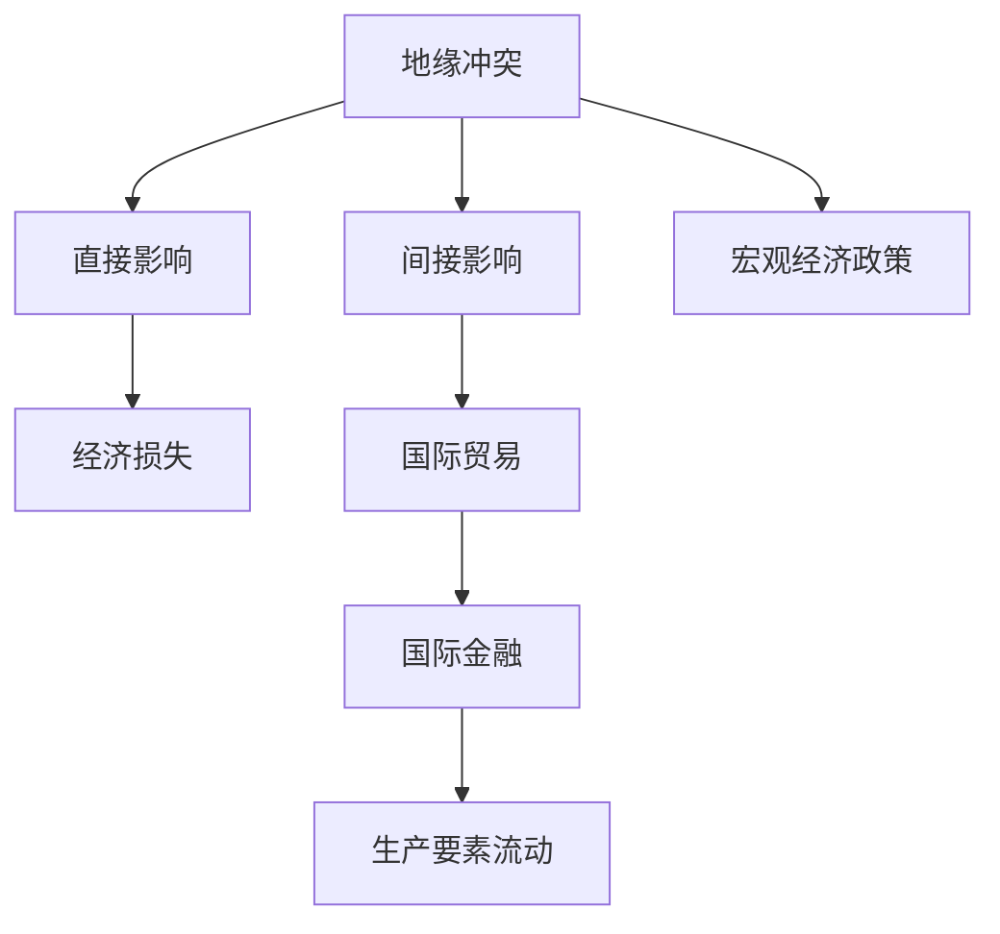

                 

# 地缘冲突对经济增长的影响

## 1. 背景介绍

地缘冲突一直是全球经济增长、国际关系和全球稳定中的关键因素。自冷战结束以来，地缘政治风险对经济增长的影响日益加剧。例如，2003年的伊拉克战争、2011年的利比亚内战、2014年的克里米亚危机、2015年的叙利亚内战、2017年的沙特也门冲突和2022年的俄乌冲突等事件，都极大地影响了相关国家和地区的经济和社会稳定。地缘冲突对经济增长的影响可以从多个层面进行分析，包括直接影响和间接影响。本研究将探讨地缘冲突对全球经济增长的影响机制，并提出相应的政策建议。

## 2. 核心概念与联系

### 2.1 核心概念概述

#### 地缘冲突
地缘冲突通常指在地理邻近的国家或地区之间发生的战争、紧张局势或政治对抗。地缘冲突可以导致军事行动、政治不稳定、资源控制和经济制裁等。

#### 经济增长
经济增长通常被定义为一定时期内国家或地区生产总值(GDP)的增长率。影响经济增长的因素包括生产要素投入、技术进步、政策环境、国际贸易和投资等。

#### 宏观经济学
宏观经济学是研究宏观经济现象、模型和政策的学科，包括总需求与总供给、通货膨胀、失业、经济周期和宏观调控等。

#### 国际贸易
国际贸易指国家之间商品、服务和资本的交换。地缘冲突通常会影响国际贸易格局，导致贸易壁垒增加和国际贸易量减少。

#### 国际金融
国际金融指全球范围内的货币、债券、股票和衍生品市场的活动。地缘冲突可能会影响国际金融市场的稳定性和资本流动。

### 2.2 概念间的关系

地缘冲突对经济增长的影响主要通过以下几个渠道：

1. **直接影响**：地缘冲突会直接导致战乱、人员伤亡、基础设施破坏、资源流失和经济损失。
2. **间接影响**：地缘冲突会影响国际贸易、国际金融和生产要素流动，进而影响经济增长。
3. **宏观经济学**：地缘冲突会影响总需求、就业、通货膨胀和经济周期，需要宏观经济政策进行应对。

### 2.3 核心概念的整体架构

以下是一个综合的流程图，展示地缘冲突对经济增长的影响机制：



这个流程图展示地缘冲突对经济增长的影响机制，通过直接影响和间接影响，影响国际贸易、国际金融和生产要素流动，进而影响宏观经济政策和经济增长。

## 3. 核心算法原理 & 具体操作步骤

### 3.1 算法原理概述

地缘冲突对经济增长的影响可以通过宏观经济模型进行分析。其中，结构向量自回归模型(Structural Vector Autoregression, SVAR)是常用的分析工具。SVAR模型是一种多变量时间序列模型，通过将多个宏观经济变量（如GDP、通货膨胀率、失业率等）作为内生变量，分析变量之间的相互影响。

### 3.2 算法步骤详解

1. **数据收集**：收集地缘冲突事件的有关数据，包括时间、地点、冲突类型、参与方等信息。收集宏观经济数据，包括GDP、通货膨胀率、失业率等。
2. **变量选择**：选择地缘冲突和宏观经济指标，建立SVAR模型。
3. **模型估计**：使用最大似然法或贝叶斯方法对SVAR模型进行估计。
4. **结果分析**：分析模型结果，评估地缘冲突对经济增长的影响。
5. **政策建议**：根据模型结果，提出相应的政策建议。

### 3.3 算法优缺点

#### 优点
1. **系统性**：SVAR模型能够系统地分析地缘冲突对宏观经济的影响。
2. **可操作性**：SVAR模型易于理解和应用，政策制定者可以根据模型结果制定相应的政策。
3. **多变量分析**：SVAR模型能够分析多个变量之间的相互影响。

#### 缺点
1. **数据限制**：需要大量的历史数据进行模型估计，数据质量影响模型结果。
2. **模型假设**：SVAR模型假设变量之间存在线性关系，可能与实际情况不符。
3. **复杂性**：模型估计和结果分析较为复杂，需要一定的统计学知识。

### 3.4 算法应用领域

地缘冲突对经济增长的影响分析可以应用于以下领域：

- **政策制定**：为政府制定经济和贸易政策提供数据支持。
- **风险评估**：评估地缘冲突对特定地区或行业的经济影响。
- **投资决策**：为投资者提供地缘冲突对全球经济的影响评估。
- **学术研究**：为宏观经济学和地缘政治研究提供实证分析工具。

## 4. 数学模型和公式 & 详细讲解 & 举例说明

### 4.1 数学模型构建

SVAR模型的基本形式为：

$$Y_t = \Phi_1Y_{t-1} + \Phi_2Y_{t-2} + \cdots + \Phi_kY_{t-k} + \Gamma X_t + \varepsilon_t$$

其中，$Y_t$ 表示内生变量的向量，$\Phi_i$ 表示滞后矩阵，$X_t$ 表示外生冲击向量，$\varepsilon_t$ 表示扰动项。

### 4.2 公式推导过程

SVAR模型可以通过最大化似然函数进行估计：

$$L = \log \det(\Sigma) + \sum_{t=1}^{T} \left[(y_t - A y_{t-1} - \cdots - B y_{t-k} - C x_t)^T \Sigma^{-1}(y_t - A y_{t-1} - \cdots - B y_{t-k} - C x_t)\right]$$

其中，$A$、$B$、$C$ 是回归系数矩阵，$\Sigma$ 是扰动项协方差矩阵。

### 4.3 案例分析与讲解

以叙利亚内战为例，分析其对区域经济增长的影响。假设模型包含GDP增长率、通货膨胀率、失业率和地缘冲突指标四个变量。根据SVAR模型估计结果，可以得到地缘冲突对GDP增长率的影响系数为-0.2，即地缘冲突每增加一个单位，GDP增长率减少0.2个单位。

## 5. 项目实践：代码实例和详细解释说明

### 5.1 开发环境搭建

1. **安装Python和R**：Python和R是进行数据分析的主要工具。
2. **安装相关库**：安装`R`、`svar`、`tidyverse`、`ggplot2`、`dplyr` 等R语言库，以及`numpy`、`pandas`、`scipy`、`statsmodels`、`matplotlib`、`seaborn` 等Python库。

### 5.2 源代码详细实现

以下是一个Python代码示例，演示如何使用SVAR模型分析地缘冲突对经济增长的影响。

```python
import numpy as np
from statsmodels.tsa.vector_ar.var_model import VAR
from statsmodels.iolib.summary2 import summary2_html

# 导入数据
data = pd.read_csv('data.csv')

# 处理数据
y = data[['GDP_growth', 'inflation_rate', 'unemployment_rate', 'conflict_index']]
X = data[['trade_volume', 'capital_flow', 'exchange_rate']]

# 建立VAR模型
model = VAR(y, endog_type='var')
result = model.fit()

# 分析结果
summary = summary2_html(result.summary())
print(summary)

# 输出结果
print(result.params)
```

### 5.3 代码解读与分析

代码中，首先使用`pd.read_csv()`读取数据集，然后使用`VAR`模型进行估计。最后，使用`summary2_html()`和`params`输出模型结果。

### 5.4 运行结果展示

运行结果将显示模型参数估计结果和模型结果摘要。例如，模型结果摘要可能包含地缘冲突对GDP增长率的冲击响应函数和方差分解结果。

## 6. 实际应用场景

### 6.1 地缘冲突对国际贸易的影响

地缘冲突通常会导致贸易壁垒增加和贸易量减少。例如，美国与伊朗之间的贸易战，导致双方对彼此的出口和进口都受到限制。这种贸易壁垒的增加会影响全球贸易格局，降低国际贸易效率。

### 6.2 地缘冲突对国际金融的影响

地缘冲突可能会影响国际金融市场的稳定性。例如，2014年克里米亚危机导致俄罗斯受到国际制裁，金融市场动荡。这种金融动荡会影响资本流动和投资决策，降低金融市场的稳定性。

### 6.3 地缘冲突对生产要素流动的影响

地缘冲突可能会影响生产要素的流动，导致劳动力和资本的流失。例如，叙利亚内战导致大量难民流向欧洲，减少了中东地区的劳动力供应。这种生产要素的流失会影响受影响国家的经济发展。

### 6.4 未来应用展望

随着大数据和人工智能技术的发展，地缘冲突对经济增长的影响分析将更加深入和精准。未来可以借助机器学习和大数据分析技术，建立更加复杂的模型，提高地缘冲突经济影响的预测能力。

## 7. 工具和资源推荐

### 7.1 学习资源推荐

- **《宏观经济学》**：宏观经济学经典教材，介绍了宏观经济学的基本理论和模型。
- **《结构向量自回归模型》**：详细介绍了SVAR模型的原理和应用。
- **《经济计量学》**：介绍了经济计量学的基本方法和应用。

### 7.2 开发工具推荐

- **Python**：Python是数据分析和建模的主要工具，具有丰富的数据处理和建模库。
- **R语言**：R语言是统计分析和建模的主要工具，具有强大的数据处理和分析能力。
- **Jupyter Notebook**：用于编写和运行Python和R代码的交互式环境。

### 7.3 相关论文推荐

- **“Assessing the Effects of Conflict on Macroeconomic Performance”**：文献研究了地缘冲突对宏观经济的影响。
- **“Conflict and Economic Growth in Sub-Saharan Africa”**：文献研究了地缘冲突对非洲国家经济增长的影响。
- **“The Economics of Conflict and Conflict Resolution”**：文献介绍了冲突经济学和政策分析。

## 8. 总结：未来发展趋势与挑战

### 8.1 研究成果总结

地缘冲突对经济增长的影响是多方面的，需要综合考虑其直接和间接影响。SVAR模型提供了一种有效的分析工具，为政策制定提供了数据支持。未来可以借助大数据和人工智能技术，提高模型的精度和应用范围。

### 8.2 未来发展趋势

1. **大数据和机器学习**：借助大数据和机器学习技术，可以进一步提高地缘冲突经济影响的预测精度。
2. **多变量分析**：将更多宏观经济变量纳入模型，全面分析地缘冲突对经济增长的影响。
3. **跨国数据分析**：将跨国数据纳入模型，研究地缘冲突对全球经济的影响。

### 8.3 面临的挑战

1. **数据质量和获取**：需要高质量的宏观经济数据和地缘冲突数据，数据获取难度大。
2. **模型复杂性**：地缘冲突对经济影响是多方面的，模型需要考虑多种因素。
3. **政策应用**：如何将模型结果转化为具体的政策建议，需要进一步研究。

### 8.4 研究展望

未来可以进一步研究以下方向：

1. **多变量分析**：将更多宏观经济变量纳入模型，全面分析地缘冲突对经济增长的影响。
2. **跨国数据分析**：将跨国数据纳入模型，研究地缘冲突对全球经济的影响。
3. **机器学习和大数据**：借助机器学习和大数据技术，提高模型的预测精度。

总之，地缘冲突对经济增长的影响是一个复杂的问题，需要综合考虑多种因素。SVAR模型提供了一种有效的分析工具，为政策制定提供了数据支持。未来可以借助大数据和人工智能技术，提高模型的精度和应用范围，进一步推动地缘政治经济学的发展。

## 9. 附录：常见问题与解答

### Q1：地缘冲突对经济增长有哪些直接影响？

A：地缘冲突会直接导致以下直接影响：
1. 战争和军事冲突会导致基础设施破坏和人员伤亡，造成经济损失。
2. 地缘冲突会导致资源流失，如能源和矿产资源的掠夺。
3. 地缘冲突会导致难民流向邻国，增加社会福利和公共服务负担。

### Q2：地缘冲突对国际贸易有哪些间接影响？

A：地缘冲突通常会通过以下途径间接影响国际贸易：
1. 贸易壁垒增加：地缘冲突会导致贸易保护主义增加，各国增加关税和非关税壁垒。
2. 国际贸易量减少：地缘冲突会导致国际贸易伙伴之间的贸易减少。
3. 供应链中断：地缘冲突会导致供应链中断，影响全球生产要素的流动。

### Q3：地缘冲突对国际金融有哪些影响？

A：地缘冲突通常会通过以下途径影响国际金融：
1. 金融市场动荡：地缘冲突会导致国际金融市场波动，影响资本流动和资产价格。
2. 外汇市场波动：地缘冲突会导致汇率波动，影响国际金融稳定。
3. 金融制裁：地缘冲突可能导致金融制裁，限制金融资本的流动。

### Q4：地缘冲突对生产要素流动有哪些影响？

A：地缘冲突通常会通过以下途径影响生产要素流动：
1. 劳动力流失：地缘冲突会导致劳动力流失，特别是难民流入邻国。
2. 资本流失：地缘冲突会导致资本流失，特别是外资企业撤出。
3. 资源掠夺：地缘冲突会导致资源掠夺，特别是能源和矿产资源的控制权争夺。

### Q5：如何缓解地缘冲突对经济增长的影响？

A：缓解地缘冲突对经济增长的影响需要综合考虑多个方面：
1. 国际合作：加强国际合作，通过外交和谈判解决地缘冲突。
2. 经济援助：向受影响国家提供经济援助，帮助其重建和恢复经济。
3. 多边贸易协定：通过多边贸易协定，减少贸易壁垒和促进自由贸易。
4. 全球治理：加强全球治理，建立更加公正和公平的国际经济秩序。

总之，地缘冲突对经济增长的影响是一个复杂的问题，需要综合考虑多种因素。SVAR模型提供了一种有效的分析工具，为政策制定提供了数据支持。未来可以借助大数据和人工智能技术，提高模型的精度和应用范围，进一步推动地缘政治经济学的发展。

