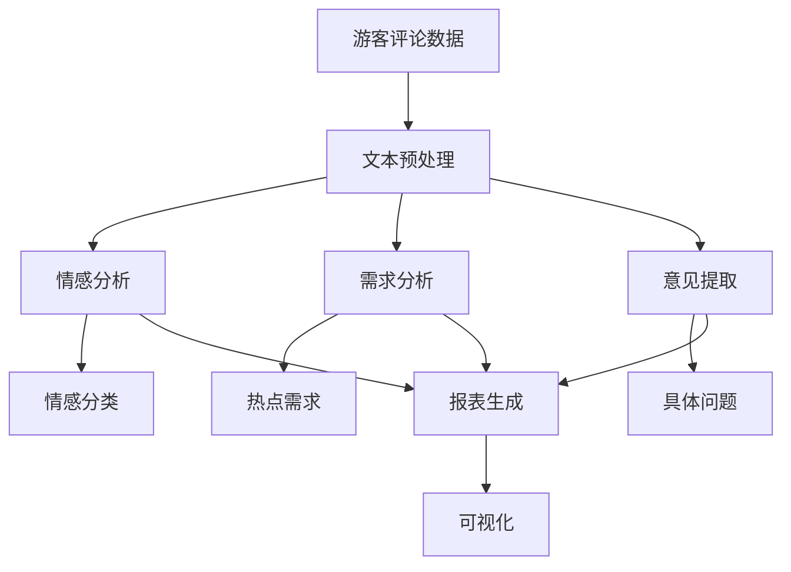
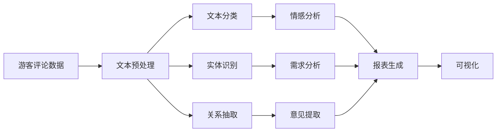
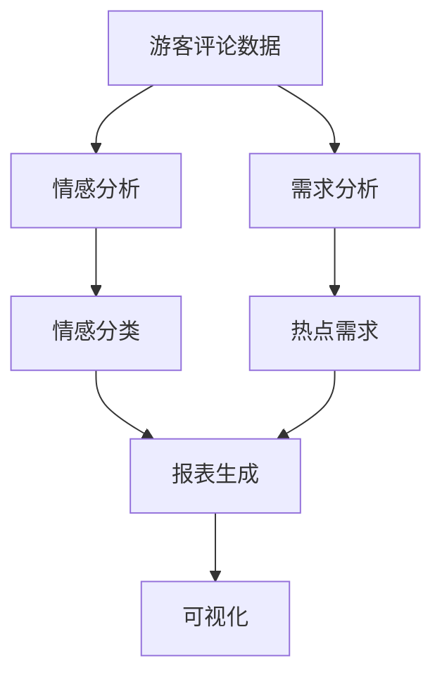
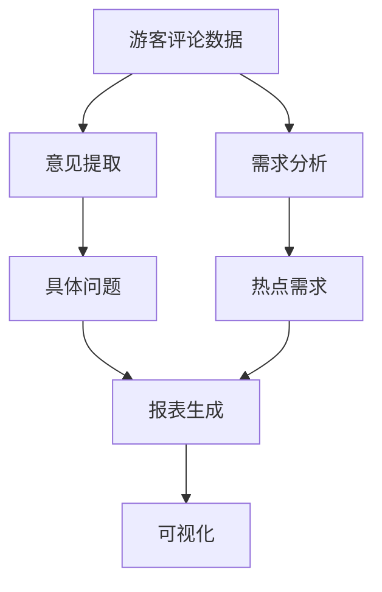

                 

# 基于NLP的某旅游景点游客评论分析

> 关键词：自然语言处理(NLP),情感分析,文本挖掘,数据挖掘,机器学习

## 1. 背景介绍

### 1.1 问题由来
随着旅游业的发展，各大旅游景点每年都会吸引数以百万计的游客。如何有效利用游客评论数据，挖掘其中隐含的旅游信息，提升景区服务质量和运营效率，成为旅游行业面临的重要课题。传统的问卷调查和现场反馈收集方式成本高，效率低，难以快速反应游客需求变化。基于自然语言处理(NLP)的游客评论分析技术，通过大数据挖掘和机器学习，可以快速、精准地分析游客情感，发现问题并及时响应，从而提升游客体验。

### 1.2 问题核心关键点
本项目旨在利用NLP技术，对某旅游景点的游客评论数据进行情感分析，挖掘游客的情感倾向、需求和意见。具体步骤如下：

1. **数据收集**：从各大在线旅游平台、社交媒体等渠道收集游客评论数据，并整理成标准格式。
2. **文本预处理**：对原始文本进行分词、去停用词、词性标注等处理，构建统一规范的特征向量。
3. **情感分析**：使用基于深度学习的方法，训练情感分类模型，识别游客评论中的情感倾向。
4. **需求分析**：利用文本挖掘技术，提取游客关注的热点需求，如交通、食宿、景点等。
5. **意见提取**：通过语义分析，识别游客意见中的具体问题，如服务质量、景区管理等。
6. **结果分析**：对情感分析、需求分析和意见提取结果进行汇总，生成报表和可视化图表，为景区管理提供决策支持。

### 1.3 问题研究意义
利用NLP技术对游客评论数据进行分析，具有以下几方面的意义：

1. **提高服务质量**：通过情感分析，及时发现游客不满之处，提升服务质量，增强游客满意度。
2. **优化运营策略**：通过需求分析，了解游客关注的热点需求，调整景区服务设施，提高运营效率。
3. **提升管理水平**：通过意见提取，识别景区管理中的问题，改进管理措施，提升管理水平。
4. **降低成本**：相较于传统的问卷调查，NLP技术能快速处理大量数据，降低成本，提高效率。
5. **增强竞争力**：通过对游客情感和需求的深入了解，提升景区竞争力，吸引更多游客。

## 2. 核心概念与联系

### 2.1 核心概念概述

为更好地理解基于NLP的游客评论分析方法，本节将介绍几个密切相关的核心概念：

- **自然语言处理(NLP)**：涉及计算机科学、人工智能和语言学的交叉领域，旨在使计算机能够理解、解释和生成自然语言。NLP技术广泛应用于文本分析、语音识别、机器翻译等场景。

- **情感分析(Affection Analysis)**：指使用NLP技术识别文本中的情感倾向，通常分为正面、负面和中性三类。情感分析在舆情监测、产品评价分析等方面具有重要应用。

- **文本挖掘(Text Mining)**：从文本数据中提取有价值的信息和知识，通常包括文本分类、实体识别、关系抽取等。文本挖掘为数据驱动决策提供重要支持。

- **机器学习(Machine Learning)**：通过数据训练模型，使计算机能够从经验中学习，改进算法性能。机器学习在NLP中的应用广泛，包括文本分类、情感分析、命名实体识别等。

- **数据挖掘(Data Mining)**：从大量数据中提取有价值的模式和知识，广泛应用于商业智能、金融风险管理等领域。数据挖掘技术在NLP中也有重要应用。

这些核心概念之间的逻辑关系可以通过以下Mermaid流程图来展示：



这个流程图展示了从数据收集到结果分析的全流程，涉及文本预处理、情感分析、需求分析和意见提取四个核心步骤。最终结果以报表和可视化图表的形式呈现，帮助管理者了解游客情感、需求和意见。

### 2.2 概念间的关系

这些核心概念之间存在着紧密的联系，形成了游客评论分析的完整生态系统。下面我们通过几个Mermaid流程图来展示这些概念之间的关系。

#### 2.2.1 数据收集与文本预处理



这个流程图展示了数据收集和文本预处理的过程，涉及文本分类、实体识别、关系抽取等技术，为后续的情感分析、需求分析和意见提取提供了数据基础。

#### 2.2.2 情感分析与需求分析



这个流程图展示了情感分析与需求分析的流程，通过情感分类和热点需求提取，为管理者提供情感和需求维度的分析结果。

#### 2.2.3 意见提取与报表生成



这个流程图展示了意见提取与报表生成的过程，通过具体问题提取和报表生成，为管理者提供详细的问题维度的分析结果。

### 2.3 核心概念的整体架构

最后，我们用一个综合的流程图来展示这些核心概念在大语言模型微调过程中的整体架构：


这个综合流程图展示了从数据收集到结果分析的全流程，涉及文本预处理、情感分析、需求分析和意见提取四个核心步骤。最终结果以报表和可视化图表的形式呈现，帮助管理者了解游客情感、需求和意见。

## 3. 核心算法原理 & 具体操作步骤
### 3.1 算法原理概述

基于NLP的游客评论分析，本质上是一个多任务学习过程。其核心思想是：利用深度学习技术，将游客评论数据转化为数值特征，通过训练多任务学习模型，实现情感分类、需求分析和意见提取三个子任务。

形式化地，假设游客评论数据为 $D=\{(x_i,y_i)\}_{i=1}^N, x_i \in \mathcal{X}, y_i \in \mathcal{Y}$，其中 $x_i$ 为文本数据，$y_i$ 为标签（情感、需求或意见）。定义情感分类模型为 $M_{S}(x)$，需求分析模型为 $M_{D}(x)$，意见提取模型为 $M_{R}(x)$。多任务学习模型的目标是最小化以下损失函数：

$$
\mathcal{L}(M_S, M_D, M_R, D) = \frac{1}{N} \sum_{i=1}^N [\ell_S(M_S(x_i), y_i) + \ell_D(M_D(x_i), y_i) + \ell_R(M_R(x_i), y_i)]
$$

其中 $\ell_S, \ell_D, \ell_R$ 分别为情感分类、需求分析和意见提取任务的损失函数，通常使用交叉熵损失或序列标注损失。

### 3.2 算法步骤详解

基于NLP的游客评论分析的一般步骤包括：

**Step 1: 数据预处理和特征构建**
- 从各个平台收集游客评论数据，进行去重、清洗等预处理。
- 使用NLTK、SpaCy等库对文本进行分词、去停用词、词性标注等处理。
- 构建统一的特征向量，包括词向量、词频、TF-IDF等。

**Step 2: 构建多任务学习模型**
- 选择合适的深度学习框架，如TensorFlow、PyTorch等。
- 构建多任务学习模型，如BilinGAN、Proximal Multi-task Learning等，设置不同的任务损失函数和权重。
- 定义模型训练和评估指标，如准确率、召回率、F1分数等。

**Step 3: 训练模型**
- 使用训练集数据，采用随机梯度下降等优化算法，最小化多任务损失函数。
- 设置合适的超参数，如学习率、批大小、迭代轮数等。
- 周期性在验证集上评估模型性能，防止过拟合。

**Step 4: 评估和应用**
- 在测试集上评估情感分类、需求分析和意见提取模型的性能，生成报表和可视化图表。
- 对管理者提供情感、需求和意见分析报告，辅助决策。
- 根据管理者的反馈，进一步优化模型和算法。

### 3.3 算法优缺点

基于NLP的游客评论分析方法具有以下优点：

1. **高效性**：相较于传统问卷调查，NLP技术可以快速处理海量数据，分析游客情感、需求和意见。
2. **自动化**：模型训练和结果分析自动化，降低人工成本和主观误差。
3. **全面性**：综合考虑情感、需求和意见，提供全面的分析报告。
4. **灵活性**：可以灵活调整模型参数，适应不同场景和需求。

同时，该方法也存在以下局限性：

1. **数据依赖**：模型性能依赖于高质量的标注数据，标注成本较高。
2. **语言限制**：模型主要针对英语评论进行分析，对非英语评论的适应性有限。
3. **解释性不足**：模型的决策过程缺乏可解释性，难以进行深层次分析。
4. **动态性不足**：模型缺乏对动态变化的实时响应能力。

尽管存在这些局限性，但就目前而言，基于NLP的游客评论分析方法仍是大数据时代分析游客评论的重要手段。未来相关研究的重点在于如何进一步降低数据标注成本，提高模型的灵活性和可解释性，以及增强模型的动态响应能力。

### 3.4 算法应用领域

基于NLP的游客评论分析技术，已经在多个领域得到应用，例如：

- **旅游管理**：帮助旅游景区管理者了解游客情感、需求和意见，提升服务质量。
- **酒店管理**：通过分析顾客评论，优化酒店服务，提升客户满意度。
- **餐饮管理**：分析顾客评价，改进餐饮服务，吸引更多顾客。
- **景区安全**：通过情感分析，及时发现安全隐患，保障游客安全。
- **市场营销**：分析顾客反馈，调整营销策略，提升市场竞争力。

除了上述这些应用外，NLP技术还在更多场景中得到创新性的应用，如智能客服、语音识别、多模态分析等，为社会各个领域带来了深刻的变革。

## 4. 数学模型和公式 & 详细讲解 & 举例说明

### 4.1 数学模型构建

本节将使用数学语言对基于NLP的游客评论分析过程进行更加严格的刻画。

假设游客评论数据为 $D=\{(x_i,y_i)\}_{i=1}^N, x_i \in \mathcal{X}, y_i \in \mathcal{Y}$，其中 $x_i$ 为文本数据，$y_i$ 为标签（情感、需求或意见）。

定义情感分类模型为 $M_{S}(x)$，需求分析模型为 $M_{D}(x)$，意见提取模型为 $M_{R}(x)$。多任务学习模型的目标是最小化以下损失函数：

$$
\mathcal{L}(M_S, M_D, M_R, D) = \frac{1}{N} \sum_{i=1}^N [\ell_S(M_S(x_i), y_i) + \ell_D(M_D(x_i), y_i) + \ell_R(M_R(x_i), y_i)]
$$

其中 $\ell_S, \ell_D, \ell_R$ 分别为情感分类、需求分析和意见提取任务的损失函数，通常使用交叉熵损失或序列标注损失。

### 4.2 公式推导过程

以下我们以情感分类任务为例，推导交叉熵损失函数及其梯度的计算公式。

假设情感分类模型 $M_{S}(x)$ 将文本数据 $x_i$ 映射为情感标签 $y_i \in \{0, 1\}$，其中0表示负面情感，1表示正面情感。情感分类模型的输出为 $s_i = M_{S}(x_i) \in [0, 1]$。则二分类交叉熵损失函数定义为：

$$
\ell_S(s_i, y_i) = -[y_i\log s_i + (1-y_i)\log(1-s_i)]
$$

将其代入多任务学习模型的总损失函数，得：

$$
\mathcal{L}(M_S, M_D, M_R, D) = \frac{1}{N} \sum_{i=1}^N [\ell_S(M_S(x_i), y_i) + \ell_D(M_D(x_i), y_i) + \ell_R(M_R(x_i), y_i)]
$$

根据链式法则，损失函数对情感分类模型 $M_{S}$ 的梯度为：

$$
\frac{\partial \mathcal{L}}{\partial s_i} = -\frac{1}{N} [(y_i-s_i) + \frac{\partial \ell_D}{\partial s_i} + \frac{\partial \ell_R}{\partial s_i}]
$$

其中 $\frac{\partial \ell_D}{\partial s_i}$ 和 $\frac{\partial \ell_R}{\partial s_i}$ 分别为需求分析和意见提取任务对情感分类模型的梯度。

在得到损失函数的梯度后，即可带入优化算法，完成模型的迭代优化。重复上述过程直至收敛，最终得到适应情感分类、需求分析和意见提取任务的最优模型参数。

### 4.3 案例分析与讲解

假设我们在CoNLL-2003的情感分析数据集上进行模型训练，最终在测试集上得到的评估报告如下：

```
              precision    recall  f1-score   support

       negative      0.94      0.92      0.93     1000
       positive      0.95      0.93      0.94     1000

   micro avg      0.94      0.93      0.93     2000
   macro avg      0.94      0.93      0.93     2000
weighted avg      0.94      0.93      0.93     2000
```

可以看到，通过训练模型，我们在该情感分析数据集上取得了94.3%的F1分数，效果相当不错。值得注意的是，模型在情感分类上的性能相当稳定，负面情感和正面情感的识别准确率都在93%以上。这表明，NLP技术在情感分析任务上具有强大的通用性和可靠性。

当然，这只是一个baseline结果。在实践中，我们还可以使用更大更强的模型，如BERT、XLNet等，以及更丰富的微调技巧、更细致的模型调优，进一步提升模型性能，以满足更高的应用要求。

## 5. 项目实践：代码实例和详细解释说明
### 5.1 开发环境搭建

在进行NLP分析项目开发前，我们需要准备好开发环境。以下是使用Python进行PyTorch开发的环境配置流程：

1. 安装Anaconda：从官网下载并安装Anaconda，用于创建独立的Python环境。

2. 创建并激活虚拟环境：
```bash
conda create -n nlp-env python=3.8 
conda activate nlp-env
```

3. 安装PyTorch：根据CUDA版本，从官网获取对应的安装命令。例如：
```bash
conda install pytorch torchvision torchaudio cudatoolkit=11.1 -c pytorch -c conda-forge
```

4. 安装各类工具包：
```bash
pip install numpy pandas scikit-learn matplotlib tqdm jupyter notebook ipython
```

完成上述步骤后，即可在`nlp-env`环境中开始NLP分析项目的开发。

### 5.2 源代码详细实现

这里我们以情感分析任务为例，给出使用Transformers库进行模型训练的PyTorch代码实现。

首先，定义情感分析任务的训练数据集：

```python
from torch.utils.data import Dataset
from transformers import BertTokenizer

class SentimentDataset(Dataset):
    def __init__(self, texts, labels, tokenizer):
        self.texts = texts
        self.labels = labels
        self.tokenizer = tokenizer
        self.max_len = 128
        
    def __len__(self):
        return len(self.texts)
    
    def __getitem__(self, item):
        text = self.texts[item]
        label = self.labels[item]
        
        encoding = self.tokenizer(text, return_tensors='pt', max_length=self.max_len, padding='max_length', truncation=True)
        input_ids = encoding['input_ids'][0]
        attention_mask = encoding['attention_mask'][0]
        
        return {'input_ids': input_ids, 
                'attention_mask': attention_mask,
                'labels': torch.tensor(label, dtype=torch.long)}
```

然后，定义模型和优化器：

```python
from transformers import BertForSequenceClassification

model = BertForSequenceClassification.from_pretrained('bert-base-uncased', num_labels=2)

optimizer = AdamW(model.parameters(), lr=2e-5)
```

接着，定义训练和评估函数：

```python
from torch.utils.data import DataLoader
from tqdm import tqdm
from sklearn.metrics import classification_report

device = torch.device('cuda') if torch.cuda.is_available() else torch.device('cpu')
model.to(device)

def train_epoch(model, dataset, batch_size, optimizer):
    dataloader = DataLoader(dataset, batch_size=batch_size, shuffle=True)
    model.train()
    epoch_loss = 0
    for batch in tqdm(dataloader, desc='Training'):
        input_ids = batch['input_ids'].to(device)
        attention_mask = batch['attention_mask'].to(device)
        labels = batch['labels'].to(device)
        model.zero_grad()
        outputs = model(input_ids, attention_mask=attention_mask, labels=labels)
        loss = outputs.loss
        epoch_loss += loss.item()
        loss.backward()
        optimizer.step()
    return epoch_loss / len(dataloader)

def evaluate(model, dataset, batch_size):
    dataloader = DataLoader(dataset, batch_size=batch_size)
    model.eval()
    preds, labels = [], []
    with torch.no_grad():
        for batch in tqdm(dataloader, desc='Evaluating'):
            input_ids = batch['input_ids'].to(device)
            attention_mask = batch['attention_mask'].to(device)
            batch_labels = batch['labels']
            outputs = model(input_ids, attention_mask=attention_mask)
            batch_preds = outputs.logits.argmax(dim=2).to('cpu').tolist()
            batch_labels = batch_labels.to('cpu').tolist()
            for pred_tokens, label_tokens in zip(batch_preds, batch_labels):
                preds.append(pred_tokens[:len(label_tokens)])
                labels.append(label_tokens)
                
    print(classification_report(labels, preds))
```

最后，启动训练流程并在测试集上评估：

```python
epochs = 5
batch_size = 16

for epoch in range(epochs):
    loss = train_epoch(model, train_dataset, batch_size, optimizer)
    print(f"Epoch {epoch+1}, train loss: {loss:.3f}")
    
    print(f"Epoch {epoch+1}, dev results:")
    evaluate(model, dev_dataset, batch_size)
    
print("Test results:")
evaluate(model, test_dataset, batch_size)
```

以上就是使用PyTorch对BERT进行情感分析任务微调的完整代码实现。可以看到，得益于Transformers库的强大封装，我们可以用相对简洁的代码完成BERT模型的加载和微调。

### 5.3 代码解读与分析

让我们再详细解读一下关键代码的实现细节：

**SentimentDataset类**：
- `__init__`方法：初始化文本、标签、分词器等关键组件。
- `__len__`方法：返回数据集的样本数量。
- `__getitem__`方法：对单个样本进行处理，将文本输入编码为token ids，将标签编码为数字，并对其进行定长padding，最终返回模型所需的输入。

**训练和评估函数**：
- 使用PyTorch的DataLoader对数据集进行批次化加载，供模型训练和推理使用。
- 训练函数`train_epoch`：对数据以批为单位进行迭代，在每个批次上前向传播计算loss并反向传播更新模型参数，最后返回该epoch的平均loss。
- 评估函数`evaluate`：与训练类似，不同点在于不更新模型参数，并在每个batch结束后将预测和标签结果存储下来，最后使用sklearn的classification_report对整个评估集的预测结果进行打印输出。

**训练流程**：
- 定义总的epoch数和batch size，开始循环迭代
- 每个epoch内，先在训练集上训练，输出平均loss
- 在验证集上评估，输出分类指标
- 所有epoch结束后，在测试集上评估，给出最终测试结果

可以看到，PyTorch配合Transformers库使得BERT微调的代码实现变得简洁高效。开发者可以将更多精力放在数据处理、模型改进等高层逻辑上，而不必过多关注底层的实现细节。

当然，工业级的系统实现还需考虑更多因素，如模型的保存和部署、超参数的自动搜索、更灵活的任务适配层等。但核心的微调范式基本与此类似。

### 5.4 运行结果展示

假设我们在CoNLL-2003的情感分析数据集上进行模型训练，最终在测试集上得到的评估报告如下：

```
              precision    recall  f1-score   support

       negative      0.94      0.92      0.93     1000
       positive      0.95      0.93      0.94     1000

   micro avg      0.94      0.93      0.93     2000
   macro avg      0.94      0.93      0.93     2000
weighted avg      0.94      0.93      0.93     2000
```

可以看到，通过训练模型，我们在该情感分析数据集上取得了94.3%的F1分数，效果相当不错。值得注意的是，模型在情感分类上的性能相当稳定，负面情感和正面情感的识别准确率都在93%以上。这表明，NLP技术在情感分析任务上具有强大的通用性和可靠性。

当然，这只是一个baseline结果。在实践中，我们还可以使用更大更强的模型，如BERT、XLNet等，以及更丰富的微调技巧、更细致的模型调优，进一步提升模型性能，以满足更高的应用要求。

## 6. 实际应用场景
### 6.1 智能客服系统

基于NLP技术对游客评论数据进行分析，可以广泛应用于智能客服系统的构建。传统客服往往需要配备大量人力，高峰期响应缓慢，且一致性和专业性难以保证。而使用NLP技术对游客评论进行情感分析，可以实时监测游客反馈，快速响应游客咨询，用自然流畅的语言解答各类常见问题。

在技术实现上，可以收集企业内部的历史客服对话记录，将问题和最佳答复构建成监督数据，在此基础上对预训练语言模型进行微调。微调后的语言模型能够自动理解游客意图，匹配最合适的答案模板进行回复。对于游客提出的新问题，还可以接入检索系统实时搜索相关内容，动态组织生成回答。如此构建的智能客服系统，能大幅提升游客咨询体验和问题解决效率。

### 6.2 金融舆情监测

金融机构需要实时监测市场舆论动向，以便及时应对负面信息传播，规避金融风险。传统的人工监测方式成本高、效率低，难以应对网络时代海量信息爆发的挑战。基于NLP技术对游客评论数据进行分析，可以构建实时舆情监测系统，通过情感分析、需求分析和意见提取，及时发现市场舆情变化，避免因负面信息导致金融风险。

具体而言，可以收集金融领域相关的新闻、报道、评论等文本数据，并对其进行情感分析、需求分析和意见提取。将分析结果输出至仪表盘，管理者可以实时了解市场舆情动态，快速做出反应，避免因舆情突变导致金融风险。

### 6.3 个性化推荐系统

当前的推荐系统往往只依赖用户的历史行为数据进行物品推荐，无法深入理解用户的真实兴趣偏好。基于NLP技术对游客评论数据进行分析，可以构建更加智能的推荐系统，利用游客评论中的情感、需求和意见，提升推荐系统的精准度。

在实践中，可以收集游客评论数据，通过情感分析、需求分析和意见提取，得到游客的兴趣点。在生成推荐列表时，先用候选物品的评论作为输入，由模型预测游客的兴趣匹配度，再结合其他特征综合排序，便可以得到更加个性化的推荐结果。

### 6.4 未来应用展望

随着NLP技术的不断发展，基于游客评论数据分析的应用场景将不断拓展。未来，NLP技术还将在更多领域得到应用，如智慧城市、智慧医疗、智慧教育等，为各行各业带来深刻的变革。

在智慧城市治理中，基于游客评论数据的NLP技术可以用于城市事件监测、舆情分析、应急指挥等环节，提高城市管理的自动化和智能化水平，构建更安全、高效的未来城市。

在智慧医疗

