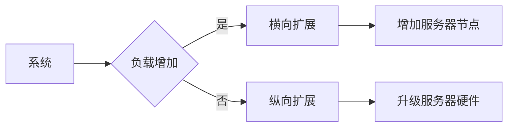

# 横向扩展与纵向扩展的区别

> 关键词：横向扩展，纵向扩展，系统架构，性能提升，可伸缩性，负载均衡，资源利用

## 1. 背景介绍

在信息技术领域，随着数据量的爆发式增长和业务需求的日益复杂，系统的可伸缩性和性能提升成为关键考量因素。为了应对这些挑战，系统架构师通常会采用横向扩展和纵向扩展两种策略。本文将深入探讨这两种扩展方式的区别，分析其原理、操作步骤、优缺点和应用领域，以帮助读者更好地理解和选择适合自己系统的扩展策略。

### 1.1 问题的由来

随着互联网的普及和电子商务的兴起，企业面临的数据量和用户访问量日益增长，传统的单机服务器架构难以满足需求。为了提高系统的处理能力和响应速度，系统架构师需要考虑如何有效地扩展系统资源。

### 1.2 研究现状

目前，横向扩展和纵向扩展是两种常见的系统扩展策略。它们在系统架构设计和性能优化中扮演着重要角色。然而，两种扩展方式在资源利用、性能提升和成本控制等方面存在显著差异，需要根据具体应用场景进行合理选择。

### 1.3 研究意义

深入理解横向扩展和纵向扩展的区别，有助于系统架构师更好地设计高可用、高性能的系统架构。通过合理选择扩展策略，可以优化资源利用，降低成本，提升系统性能和可伸缩性。

## 2. 核心概念与联系

### 2.1 核心概念

**横向扩展（Horizontal Scaling）**：通过增加更多的服务器节点来提高系统的处理能力和存储容量。横向扩展主要针对系统负载的增加。

**纵向扩展（Vertical Scaling）**：通过升级现有服务器的硬件配置（如CPU、内存、存储等）来提高单个服务器的性能。纵向扩展主要针对单个服务器性能的提升。

### 2.2 Mermaid 流程图



### 2.3 核心概念联系

横向扩展和纵向扩展是两种不同的系统扩展方式，它们在系统架构设计中相互补充。在实际应用中，根据系统负载和性能需求，可以选择单一扩展方式，也可以将两种扩展方式结合使用。

## 3. 核心算法原理 & 具体操作步骤

### 3.1 算法原理概述

横向扩展和纵向扩展的原理不同，具体操作步骤也有所区别。

**横向扩展**：通过增加服务器节点来分散负载，提高系统并发处理能力。主要涉及负载均衡、分布式存储等技术。

**纵向扩展**：通过升级现有服务器的硬件配置来提高单个服务器的性能。主要涉及硬件升级、性能优化等技术。

### 3.2 算法步骤详解

**横向扩展步骤**：

1. 评估系统负载和性能需求。
2. 选择合适的负载均衡器。
3. 增加服务器节点。
4. 配置负载均衡器，实现负载分发。
5. 测试和优化系统性能。

**纵向扩展步骤**：

1. 评估系统性能瓶颈。
2. 选择合适的硬件升级方案。
3. 升级服务器硬件。
4. 优化系统配置和参数。
5. 测试和验证系统性能。

### 3.3 算法优缺点

**横向扩展**：

- **优点**：可扩展性强，易于实现，成本相对较低。
- **缺点**：可能引入单点故障，维护复杂，性能提升有限。

**纵向扩展**：

- **优点**：性能提升显著，易于管理，适合对性能要求较高的场景。
- **缺点**：可扩展性较差，成本较高，硬件升级可能影响系统稳定性。

### 3.4 算法应用领域

**横向扩展**：适用于高并发、高可用的系统，如Web应用、数据库、消息队列等。

**纵向扩展**：适用于对性能要求较高的系统，如高性能计算、大数据处理、实时分析等。

## 4. 数学模型和公式 & 详细讲解 & 举例说明

### 4.1 数学模型构建

横向扩展和纵向扩展的数学模型可以从以下几个方面进行构建：

- **处理能力**：假设系统处理能力与服务器数量成正比，可以表示为 $P = n \times P_0$，其中 $P$ 为系统总处理能力，$n$ 为服务器数量，$P_0$ 为单个服务器的处理能力。
- **存储容量**：假设系统存储容量与服务器数量成正比，可以表示为 $S = n \times S_0$，其中 $S$ 为系统总存储容量，$S_0$ 为单个服务器的存储容量。

### 4.2 公式推导过程

以上公式基于简单的线性关系进行推导，实际应用中可能需要考虑更复杂的因素，如网络延迟、数据传输等。

### 4.3 案例分析与讲解

假设一个Web应用服务器，单个服务器处理能力为 $P_0 = 100$ QPS（Query Per Second），现有 10 个服务器，系统总处理能力为 $P = 10 \times 100 = 1000$ QPS。如果业务需求增长，需要将系统处理能力提升至 $P' = 2000$ QPS，可以选择以下两种方案：

- **横向扩展**：增加 10 个服务器节点，总服务器数量变为 20，系统总处理能力达到 $P' = 20 \times 100 = 2000$ QPS。
- **纵向扩展**：升级现有服务器硬件，将单个服务器处理能力提升至 $P_0' = 200$ QPS，系统总处理能力达到 $P' = 10 \times 200 = 2000$ QPS。

两种方案都能达到相同的性能目标，但横向扩展需要额外的服务器成本，而纵向扩展则需要更高的硬件成本。

## 5. 项目实践：代码实例和详细解释说明

### 5.1 开发环境搭建

由于横向扩展和纵向扩展涉及硬件和软件多个层面，以下以一个简单的负载均衡配置为例，展示如何进行横向扩展。

1. 安装Apache HTTP Server作为Web服务器。
2. 安装Nginx作为负载均衡器。
3. 配置Nginx监听80端口，并将请求分发到多个Apache服务器。

### 5.2 源代码详细实现

以下是一个简单的Nginx配置文件示例：

```nginx
http {
    upstream myapp {
        server server1.example.com;
        server server2.example.com;
        server server3.example.com;
        server server4.example.com;
    }

    server {
        listen 80;

        location / {
            proxy_pass http://myapp;
        }
    }
}
```

### 5.3 代码解读与分析

在上面的配置文件中，定义了一个名为`myapp`的上游服务器池，包含4个Apache服务器。当客户端访问80端口时，Nginx会将请求均衡地分发到这4个服务器。

### 5.4 运行结果展示

启动Nginx服务后，客户端访问80端口，Nginx会自动将请求分发到不同的Apache服务器，从而实现横向扩展。

## 6. 实际应用场景

### 6.1 横向扩展应用场景

- **电子商务网站**：通过增加更多的服务器节点，提高网站并发访问量，提升用户体验。
- **在线教育平台**：通过横向扩展数据库服务器，提高用户数据存储和处理能力。
- **云计算平台**：通过横向扩展虚拟机实例，提供更多的计算资源。

### 6.2 纵向扩展应用场景

- **高性能计算**：通过升级服务器硬件，提高计算性能，处理更复杂的计算任务。
- **大数据处理**：通过升级存储硬件，提高数据存储和处理能力。
- **实时分析**：通过升级服务器硬件，提高实时数据分析和处理能力。

## 7. 工具和资源推荐

### 7.1 学习资源推荐

- 《系统性能调优实战》
- 《高性能Linux服务器构建实战》
- 《负载均衡技术内幕》

### 7.2 开发工具推荐

- Nginx：高性能的Web服务器和反向代理服务器。
- HAProxy：开源的高性能负载均衡器。
- Apache：开源的Web服务器。

### 7.3 相关论文推荐

- 《Scalability and Performance of Large-scale Internet Services》
- 《The Case for Scaling Up》
- 《An Overview of Load Balancing Techniques for High-Performance Computing》

## 8. 总结：未来发展趋势与挑战

### 8.1 研究成果总结

本文深入探讨了横向扩展和纵向扩展的区别，分析了其原理、操作步骤、优缺点和应用领域。通过对比两种扩展方式，读者可以更好地选择适合自己系统的扩展策略。

### 8.2 未来发展趋势

随着云计算和虚拟化技术的发展，系统扩展将更加灵活和高效。未来，以下趋势值得关注：

- **自动化扩展**：通过自动化工具实现系统的自动化扩展，提高资源利用率。
- **混合扩展**：结合横向扩展和纵向扩展，实现更灵活的系统扩展。
- **微服务架构**：通过微服务架构，实现服务的按需扩展。

### 8.3 面临的挑战

尽管系统扩展技术不断进步，但以下挑战仍需克服：

- **资源利用率**：如何优化资源利用率，避免资源浪费。
- **扩展成本**：如何降低系统扩展的成本。
- **系统稳定性**：如何保证系统在扩展过程中的稳定性。

### 8.4 研究展望

未来，系统扩展技术将朝着更加自动化、智能化和高效化的方向发展。通过不断创新，我们可以构建更加稳定、高效、可伸缩的系统架构，满足不断增长的业务需求。

## 9. 附录：常见问题与解答

**Q1：横向扩展和纵向扩展哪种方式更好？**

A：横向扩展和纵向扩展各有优缺点，具体选择哪种方式取决于系统需求、预算和业务场景。在实际应用中，可以根据实际情况选择单一扩展方式，也可以将两种扩展方式结合使用。

**Q2：如何选择合适的负载均衡器？**

A：选择合适的负载均衡器需要考虑以下因素：

- **性能**：负载均衡器的性能要满足系统负载需求。
- **功能**：负载均衡器要支持所需的扩展功能，如健康检查、会话保持等。
- **可靠性**：负载均衡器要保证系统的高可用性。
- **兼容性**：负载均衡器要与现有系统兼容。

**Q3：如何评估系统扩展的可行性？**

A：评估系统扩展的可行性需要考虑以下因素：

- **系统负载**：分析系统负载情况，确定是否需要扩展。
- **性能瓶颈**：找出系统性能瓶颈，确定扩展方向。
- **成本效益**：评估扩展的成本和效益，确定扩展的可行性。

**Q4：如何实现混合扩展？**

A：实现混合扩展可以采用以下方法：

- **分层次扩展**：先进行横向扩展，再进行纵向扩展。
- **动态扩展**：根据系统负载动态调整扩展策略。
- **策略组合**：结合多种扩展策略，实现更灵活的扩展。

通过解决这些常见问题，读者可以更好地理解和应用系统扩展技术。