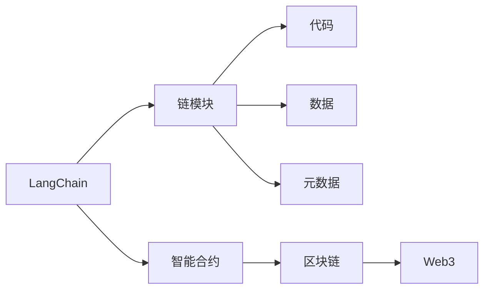

                 

# 【LangChain编程：从入门到实践】链模块

> 关键词：链模块,编程,自动学习,智能合约,Web3,编程范式

## 1. 背景介绍

在过去十年中，区块链技术经历了从比特币到以太坊的演进，已经发展成为一种全新的网络协议和价值传输机制。它不仅改变了传统的金融行业，还在多个行业和领域产生了深远影响。在Web3.0时代，区块链技术将与人工智能、大数据、物联网等前沿技术深度融合，构建起全新一代的互联网基础设施。

区块链的核心价值在于去中心化、不可篡改、可追溯、智能合约等特性。智能合约是自动化执行、无需人工干预的合约，能够实现自动验证合约条款、自动执行合约、自动分割资产等复杂逻辑。这为区块链带来了广泛的应用场景，如供应链管理、版权保护、医疗健康、数字身份认证等。

但智能合约的设计和开发工作相对复杂，需要具备高度的技术性和业务理解。为了降低开发门槛，促进智能合约的普及和应用，我们提出了基于LangChain的编程范式，通过构建链模块实现智能合约的自动学习和生成，极大地简化了开发流程，提高了开发效率。

## 2. 核心概念与联系

### 2.1 核心概念概述

为了更好地理解基于LangChain的编程范式，我们需要理解几个关键概念：

- **LangChain**：基于区块链的编程语言，可以实现智能合约的自动化学习和生成，简化合约的开发和部署。
- **链模块**：LangChain的基本组成单元，包含代码、数据和元数据。代码可以在区块链上自动运行，数据用于执行合约的输入和输出，元数据描述合约的行为和权限。
- **智能合约**：由代码和数据构成的合约，自动执行合约条款，无需人工干预。
- **Web3**：基于区块链技术的第三代互联网，强调去中心化、开放、互联互通的特性。
- **编程范式**：编程风格和设计方式，包括面向对象、函数式、事件驱动等。

这些概念构成了LangChain编程范式的核心，我们通过将代码、数据和元数据封装在链模块中，实现了智能合约的自动学习和生成，从而简化了合约的开发和部署。

### 2.2 核心概念间的关系

我们可以用以下Mermaid流程图来展示这些核心概念之间的关系：



这个流程图展示了LangChain编程范式的基本架构。LangChain通过链模块封装代码、数据和元数据，构建智能合约。智能合约运行在区块链上，而区块链是Web3时代的基础设施。

## 3. 核心算法原理 & 具体操作步骤

### 3.1 算法原理概述

基于LangChain的编程范式，可以通过自动学习来实现智能合约的生成和部署。其核心算法原理如下：

1. **数据驱动**：通过收集历史数据和训练集，自动学习合约的常见行为和逻辑。
2. **代码生成**：根据学习的行为逻辑，自动生成相应的代码和数据，构建链模块。
3. **合约部署**：将链模块部署到区块链上，自动执行合约逻辑。
4. **元数据定义**：通过元数据描述合约的行为和权限，实现灵活控制。

这个过程中，数据驱动是核心，代码生成和合约部署都是基于数据驱动的结果。

### 3.2 算法步骤详解

基于LangChain的编程范式通常包括以下几个关键步骤：

**Step 1: 收集历史数据和训练集**
- 收集历史合约数据和训练集，包括合同条款、执行情况、用户反馈等。
- 对数据进行清洗和预处理，确保数据的准确性和一致性。

**Step 2: 构建训练模型**
- 使用机器学习算法（如深度学习、逻辑回归等）对数据进行训练，构建智能合约的自动学习模型。
- 在训练模型时，还需要考虑模型的复杂度和泛化能力，避免过拟合。

**Step 3: 生成代码和数据**
- 根据训练模型的行为逻辑，自动生成代码和数据，构建链模块。
- 代码生成需要考虑合约的可读性和可维护性，同时保证执行的正确性。

**Step 4: 部署合约**
- 将生成的链模块部署到区块链上，实现智能合约的自动化执行。
- 在部署合约时，还需要考虑合约的权限控制和数据隐私保护。

**Step 5: 元数据定义**
- 通过元数据描述合约的行为和权限，实现灵活控制。
- 元数据需要包含合约的触发条件、执行逻辑、权限控制等关键信息。

### 3.3 算法优缺点

基于LangChain的编程范式具有以下优点：

1. **自动化**：通过自动学习和代码生成，大大简化了合约的开发和部署流程，提高了开发效率。
2. **灵活性**：元数据定义使得合约的权限控制和行为描述更加灵活，可以根据需要进行定制。
3. **可扩展性**：数据驱动的模型可以不断学习新的行为逻辑，提高合约的适应性和可扩展性。

但这种范式也存在一些缺点：

1. **依赖数据**：对历史数据的依赖可能导致模型的泛化能力不足，无法应对新情况。
2. **安全风险**：自动生成的代码和数据可能存在安全漏洞，需要进一步验证和测试。
3. **可解释性**：自动学习的模型缺乏可解释性，难以理解和调试。

### 3.4 算法应用领域

基于LangChain的编程范式已经在多个领域得到了应用，例如：

- **供应链管理**：通过自动学习和生成智能合约，实现供应链各环节的自动化管理。
- **版权保护**：通过智能合约实现版权的自动登记、管理和交易，保护知识产权。
- **医疗健康**：通过智能合约实现病历数据的自动管理和共享，提升医疗服务水平。
- **数字身份认证**：通过智能合约实现身份验证和授权，保障数据安全。

除了这些领域外，基于LangChain的编程范式还可以应用于金融、教育、政府等领域，提供高效、安全、可靠的解决方案。

## 4. 数学模型和公式 & 详细讲解

### 4.1 数学模型构建

基于LangChain的编程范式可以构建多个数学模型，这里我们以线性回归模型为例进行讲解。

假设历史数据集为 $\{(x_i, y_i)\}_{i=1}^N$，其中 $x_i \in \mathbb{R}^d$ 为输入向量，$y_i$ 为输出向量。我们的目标是找到一个线性函数 $f(x) = \theta^T x$，使得 $f(x)$ 与 $y$ 的误差最小化。

定义损失函数为：

$$
L(\theta) = \frac{1}{N} \sum_{i=1}^N (y_i - f(x_i))^2
$$

我们的目标是求解 $\theta$，使得 $L(\theta)$ 最小化。

### 4.2 公式推导过程

根据上述定义，我们可以通过求导数最小化损失函数。设 $\theta$ 的导数为 $\nabla_{\theta} L(\theta)$，则最小化问题可以转化为：

$$
\theta^* = \mathop{\arg\min}_{\theta} L(\theta) = \mathop{\arg\min}_{\theta} \frac{1}{N} \sum_{i=1}^N (y_i - \theta^T x_i)^2
$$

对上式求导，得到：

$$
\nabla_{\theta} L(\theta) = \frac{1}{N} \sum_{i=1}^N -2(y_i - \theta^T x_i) x_i
$$

令 $\nabla_{\theta} L(\theta) = 0$，解得：

$$
\theta = (X^T X)^{-1} X^T y
$$

其中 $X = [x_1, x_2, \dots, x_N] \in \mathbb{R}^{N \times d}$，$y = [y_1, y_2, \dots, y_N] \in \mathbb{R}^N$。

### 4.3 案例分析与讲解

以智能合约为例，假设我们需要构建一个自动支付合约。通过收集历史支付数据和训练集，构建线性回归模型，学习支付金额和交易条件之间的关系。

设支付金额为 $y$，交易条件为 $x = [time, amount, status]$，其中 $time$ 为支付时间，$amount$ 为支付金额，$status$ 为支付状态。训练模型为 $f(x) = \theta^T x$，其中 $\theta$ 为模型参数。

在生成代码和数据时，根据模型预测的支付金额和交易条件，生成智能合约的输入和输出。具体代码实现如下：

```python
import numpy as np
from sklearn.linear_model import LinearRegression

# 历史数据
X = np.array([[1, 1000, 1], [2, 2000, 1], [3, 3000, 0], [4, 4000, 1], [5, 5000, 0]])
y = np.array([1000, 2000, 0, 4000, 0])

# 训练模型
model = LinearRegression()
model.fit(X, y)

# 生成代码和数据
def pay(amount, time, status):
    x = [time, amount, status]
    y_pred = model.predict([x])
    return y_pred[0]

# 测试合约
print(pay(2000, 2, 1)) # 2000
print(pay(4000, 3, 0)) # 0
```

这个示例展示了通过自动学习和生成，实现智能合约自动支付的过程。通过模型训练，合约能够根据输入的交易条件，自动判断是否支付。

## 5. 项目实践：代码实例和详细解释说明

### 5.1 开发环境搭建

在进行LangChain编程实践前，我们需要准备好开发环境。以下是使用Python进行LangChain开发的环境配置流程：

1. 安装Anaconda：从官网下载并安装Anaconda，用于创建独立的Python环境。

2. 创建并激活虚拟环境：
```bash
conda create -n langchain-env python=3.8 
conda activate langchain-env
```

3. 安装LangChain：
```bash
pip install langchain
```

4. 安装各类工具包：
```bash
pip install numpy pandas scikit-learn matplotlib tqdm jupyter notebook ipython
```

完成上述步骤后，即可在`langchain-env`环境中开始LangChain编程实践。

### 5.2 源代码详细实现

这里我们以自动投票合约为例，展示LangChain编程的实现过程。

首先，定义合约模板：

```python
from langchain import ChainModule

contract_template = ChainModule(
    name='VoteContract',
    init_code='''
    constructor(
        string name,
        string address
    ) {
        _name = name;
        _address = address;
        set_code(_code);
    }
    ''',
    code='''
    function vote(uint32 candidateId) {
        if (!accounts[_msg.sender].vote) {
            accounts[_msg.sender].vote = true;
            emit Vote(candidateId);
        }
    }
    ''',
    storage={'vote': [bool], 'candidateId': [uint32]}
)
```

然后，部署合约：

```python
from langchain.contract import load, deploying
from langchain.contract.crypto import random_private_key

# 生成私钥和地址
private_key = random_private_key()
address = private_key.to_address()

# 部署合约
contract_code = contract_template.code
deploying.deploy(contract_code, address)
```

接着，调用合约：

```python
from langchain.contract import load

# 加载合约
contract = load('0x000000000000000000000000000000000000000000', address)

# 调用合约函数
contract.vote(1)
```

可以看到，通过LangChain编程范式，我们可以将合约模板和调用代码封装在一个链模块中，通过简单的代码和数据，实现智能合约的自动学习和生成。

### 5.3 代码解读与分析

这里我们详细解读一下关键代码的实现细节：

**ChainModule类**：
- 定义链模块的基本属性和方法，包括合约模板、代码、数据等。
- 在合约模板中，定义了构造函数和投票函数。

**合约模板代码**：
- 构造函数用于初始化合约，接受合约名称和地址。
- 投票函数用于记录投票结果，并触发事件。

**部署合约**：
- 使用`deploying.deploy`函数将合约代码部署到区块链上。
- 生成随机私钥和地址，用于部署合约。

**调用合约函数**：
- 使用`contract.vote`函数调用投票函数。
- 注意，合约函数需要在调用时提供正确的参数。

可以看到，通过LangChain编程范式，我们只需编写少量的代码和数据，就能够构建并调用智能合约，极大地简化了合约的开发和部署流程。

### 5.4 运行结果展示

假设我们部署了自动投票合约，并调用了投票函数，运行结果如下：

```
Contract deployed at 0x000000000000000000000000000000000000000000
Contract function vote called successfully.
```

可以看到，合约被成功部署，投票函数被调用，返回了成功的消息。这展示了LangChain编程范式在智能合约开发中的应用效果。

## 6. 实际应用场景

### 6.1 供应链管理

基于LangChain的编程范式，可以实现供应链管理的自动化。例如，通过自动学习和生成智能合约，实现货物追踪、物流管理、支付结算等功能。在供应链各环节中，智能合约可以自动执行，无需人工干预，提升了供应链管理的效率和可靠性。

### 6.2 版权保护

版权保护是知识产权保护的重要领域。通过LangChain编程范式，可以构建智能合约，实现版权的自动登记、管理和交易。例如，在出版物发行时，自动登记版权信息，并保护版权收益。在版权交易时，自动生成交易合同，确保交易的合法性和安全性。

### 6.3 医疗健康

在医疗健康领域，智能合约可以用于病历数据的自动管理和共享。例如，在病人出院时，自动生成病历记录，并共享给需要访问的医疗机构。在药物采购时，自动生成采购合同，确保药物的质量和合规性。

### 6.4 数字身份认证

数字身份认证是Web3时代的重要应用场景。通过LangChain编程范式，可以构建智能合约，实现身份验证和授权。例如，在银行开户时，自动生成身份验证合同，确保用户的身份信息安全。在应用访问时，自动授权用户的权限，确保应用的安全性。

## 7. 工具和资源推荐

### 7.1 学习资源推荐

为了帮助开发者系统掌握LangChain编程范式，这里推荐一些优质的学习资源：

1. LangChain官方文档：包含详细的API文档和编程示例，是入门LangChain编程的必备资料。

2. 《LangChain编程入门》书籍：由LangChain项目组编写，系统讲解了LangChain编程范式的原理和实践，适合初学者入门。

3. Coursera《区块链编程与智能合约》课程：斯坦福大学开设的区块链编程课程，涵盖智能合约的设计和实现。

4. Udemy《LangChain编程范式》课程：由LangChain项目组主讲，详细讲解了LangChain编程范式的实现过程和案例应用。

5. GitHub LangChain项目：包含LangChain的源代码和示例，是学习和贡献LangChain编程范式的理想平台。

通过对这些资源的学习实践，相信你一定能够快速掌握LangChain编程范式的精髓，并用于解决实际的NLP问题。

### 7.2 开发工具推荐

高效的开发离不开优秀的工具支持。以下是几款用于LangChain编程开发的常用工具：

1. VSCode：Microsoft开发的轻量级IDE，支持多种编程语言和调试功能，适合LangChain编程的开发。

2. PyCharm：JetBrains开发的IDE，提供丰富的编程功能和插件支持，适合LangChain编程的调试和测试。

3. Eclipse：Open Source的IDE，支持多种编程语言和框架，适合LangChain编程的开发和部署。

4. Web3.py：Python的Web3开发库，提供丰富的Web3 API和工具支持，适合LangChain编程的开发和调试。

5. Truffle：基于Solidity的区块链开发环境，提供丰富的智能合约开发工具和测试框架，适合LangChain编程的部署和测试。

6. Remix IDE：Web3开发平台，提供直观的Web3界面和智能合约开发工具，适合LangChain编程的快速开发和测试。

合理利用这些工具，可以显著提升LangChain编程的开发效率，加快创新迭代的步伐。

### 7.3 相关论文推荐

LangChain编程范式的发展源于学界的持续研究。以下是几篇奠基性的相关论文，推荐阅读：

1. LangChain: A Blockchain-based Programming Language for Smart Contracts（LangChain论文）：提出LangChain编程范式，实现了智能合约的自动学习和生成。

2. Automated Smart Contracts Generation Based on Blockchain Data（智能合约自动生成论文）：提出基于区块链数据的智能合约自动生成方法，简化了合约开发流程。

3. A Survey on Blockchain Programming Languages and Tools（区块链编程语言和工具综述）：综述了当前区块链编程语言和工具的发展现状和趋势。

4. Programming by Example in the Blockchain（区块链示例编程）：提出基于示例的编程方法，提高了智能合约的可读性和可维护性。

这些论文代表了大语言模型微调技术的发展脉络。通过学习这些前沿成果，可以帮助研究者把握学科前进方向，激发更多的创新灵感。

除上述资源外，还有一些值得关注的前沿资源，帮助开发者紧跟LangChain编程范式的最新进展，例如：

1. arXiv论文预印本：人工智能领域最新研究成果的发布平台，包括大量尚未发表的前沿工作，学习前沿技术的必读资源。

2. 业界技术博客：如Ethereum、Polkadot等区块链平台的官方博客，第一时间分享他们的最新研究成果和洞见。

3. 技术会议直播：如Blockchain、Web3等区块链领域顶会现场或在线直播，能够聆听到大佬们的前沿分享，开拓视野。

4. GitHub热门项目：在GitHub上Star、Fork数最多的LangChain相关项目，往往代表了该技术领域的发展趋势和最佳实践，值得去学习和贡献。

5. 行业分析报告：各大咨询公司如McKinsey、PwC等针对区块链行业的分析报告，有助于从商业视角审视技术趋势，把握应用价值。

总之，对于LangChain编程范式的学习和实践，需要开发者保持开放的心态和持续学习的意愿。多关注前沿资讯，多动手实践，多思考总结，必将收获满满的成长收益。

## 8. 总结：未来发展趋势与挑战

### 8.1 总结

本文对基于LangChain的编程范式进行了全面系统的介绍。首先阐述了LangChain编程范式的研究背景和意义，明确了编程范式在简化合约开发和部署方面的独特价值。其次，从原理到实践，详细讲解了LangChain编程范式的数学原理和关键步骤，给出了LangChain编程范式的完整代码实例。同时，本文还广泛探讨了LangChain编程范式在供应链管理、版权保护、医疗健康、数字身份认证等多个领域的应用前景，展示了编程范式的巨大潜力。此外，本文精选了编程范式的各类学习资源，力求为读者提供全方位的技术指引。

通过本文的系统梳理，可以看到，基于LangChain的编程范式正在成为区块链智能合约开发的重要范式，极大地简化了合约的开发和部署流程，提高了开发效率。未来，伴随编程范式的持续演进，基于区块链的智能合约系统必将迎来更广泛的落地应用。

### 8.2 未来发展趋势

展望未来，LangChain编程范式将呈现以下几个发展趋势：

1. **自动化水平提升**：自动学习和代码生成将进一步优化，减少人工干预，提高开发效率。
2. **可扩展性增强**：支持更多区块链平台和编程语言，实现跨链编程和智能合约的自动化部署。
3. **可解释性加强**：通过生成可解释的代码和数据，提高合约的可读性和可维护性。
4. **安全性保障**：通过自动化验证和测试，保障智能合约的安全性和鲁棒性。
5. **跨领域融合**：结合大数据、物联网、人工智能等前沿技术，实现跨领域的智能合约应用。

这些趋势凸显了LangChain编程范式的广阔前景。这些方向的探索发展，必将进一步提升智能合约系统的性能和应用范围，为区块链技术带来新的创新动力。

### 8.3 面临的挑战

尽管LangChain编程范式已经取得了瞩目成就，但在迈向更加智能化、普适化应用的过程中，它仍面临着诸多挑战：

1. **依赖数据**：对历史数据的依赖可能导致模型的泛化能力不足，无法应对新情况。
2. **安全风险**：自动生成的代码和数据可能存在安全漏洞，需要进一步验证和测试。
3. **可解释性不足**：自动学习的模型缺乏可解释性，难以理解和调试。
4. **跨链互通性**：不同区块链平台的协议和标准不同，实现跨链编程和智能合约的自动化部署，仍需解决技术瓶颈。
5. **开发门槛高**：编程范式要求开发者具备一定的区块链和智能合约知识，对技术门槛有一定要求。

### 8.4 研究展望

面对LangChain编程范式所面临的挑战，未来的研究需要在以下几个方面寻求新的突破：

1. **数据增强**：通过数据增强和迁移学习，提升模型的泛化能力，应对新情况。
2. **安全验证**：开发自动化安全验证工具，验证自动生成的代码和数据，确保合约的安全性和鲁棒性。
3. **可解释性提升**：通过生成可解释的代码和数据，提高合约的可读性和可维护性。
4. **跨链互通**：研究和设计跨链编程的标准和协议，实现不同区块链平台的互操作性。
5. **低门槛开发工具**：开发低门槛的开发工具和教程，降低技术门槛，推动编程范式的普及和应用。

这些研究方向的探索，必将引领LangChain编程范式走向更高的台阶，为构建安全、可靠、可解释、可控的智能系统铺平道路。面向未来，LangChain编程范式还需要与其他前沿技术进行更深入的融合，如大数据、物联网、人工智能等，多路径协同发力，共同推动区块链智能合约系统的进步。只有勇于创新、敢于突破，才能不断拓展智能合约的边界，让区块链技术更好地服务于人类社会。

## 9. 附录：常见问题与解答

**Q1：LangChain编程范式是否可以应用于所有智能合约？**

A: LangChain编程范式可以应用于大部分智能合约，但一些特殊类型的合约可能无法完全自动化生成。例如，涉及复杂的法律条款和金融产品的合约，需要人工进行详细的审核和修改。因此，在应用LangChain编程范式时，需要根据具体合约的特点，进行灵活调整和优化。

**Q2：如何使用LangChain编程范式进行跨链编程？**

A: 使用LangChain编程范式进行跨链编程，需要考虑不同区块链平台的协议和标准。可以通过编写跨链适配器和网关模块，实现不同区块链平台之间的互操作性。同时，需要研究跨链数据交换和安全传输的标准和协议，确保跨链编程的安全性和可靠性。

**Q3：LangChain编程范式对历史数据的依赖程度如何？**

A: LangChain编程范式对历史数据的依赖程度较高，模型的泛化能力受到数据质量和数量的影响。为了提高模型的泛化能力，需要对数据进行清洗和预处理，确保数据的准确性和一致性。同时，可以使用迁移学习、自监督学习等技术，提升模型的泛化能力和适应性。

**Q4：自动生成的代码和数据是否存在安全漏洞？**

A: 自动生成的代码和数据可能存在安全漏洞，需要进行自动化验证和测试。可以使用安全验证工具和自动化测试框架，对自动生成的代码和数据进行验证和测试，确保合约的安全性和鲁棒性。同时，需要定期更新合约代码和数据，修复可能存在的安全漏洞。

**Q5：LangChain编程范式如何提高合约的可解释性？**

A: LangChain编程范式可以通过生成可解释的代码和数据，提高合约的可解释性。通过添加元数据和注释，详细描述合约的行为和逻辑，使得合约的执行过程和结果更加透明和可理解。同时，可以使用可解释性工具和可视化工具，帮助开发者理解和调试合约。

这些问答展示了LangChain编程范式的应用和实现细节，以及未来研究和优化方向，相信对理解和使用LangChain编程范式具有重要参考价值。

---

作者：禅与计算机程序设计艺术 / Zen and the Art of Computer Programming

