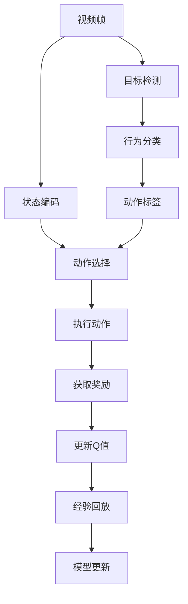
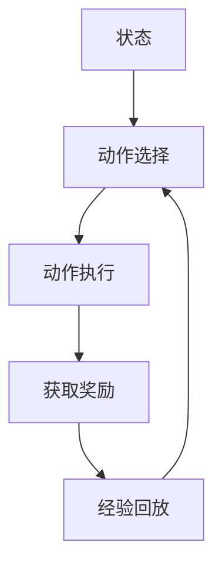
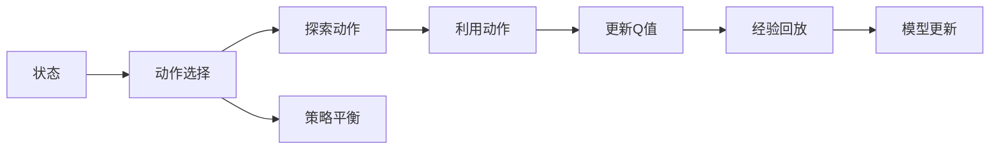
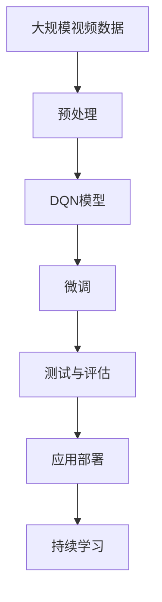

                 

## 1. 背景介绍

随着视频监控技术的普及，智能视频分析的应用场景日益丰富。传统的视频分析依赖于手动提取关键帧和特征，并使用机器学习算法进行目标识别和行为分析，这一过程复杂繁琐，且难以对突发事件进行及时响应。深度强化学习技术，尤其是深度Q网络（DQN）的出现，为视频分析提供了全新的解决方案。

### 1.1 问题由来
深度Q网络（DQN）作为深度学习和强化学习相结合的产物，在视频分析领域具有广阔的应用前景。DQN可以自主学习最优的策略，适应复杂的动态环境，从视频序列中提取关键帧和特征，实时地进行目标识别和行为分析。然而，传统的DQN应用多集中于机器人导航、游戏AI等静态场景，对于视频序列这一动态场景的适应性尚待进一步提升。

### 1.2 问题核心关键点
DQN在视频分析中的应用关键点包括：
1. 如何高效地从视频序列中提取关键帧和特征。
2. 如何构建适用于动态环境的奖励函数。
3. 如何设计适于实时视频分析的Q网络。
4. 如何处理视频帧之间的时序关系。
5. 如何融合多模态信息（视频+音频）提升分析精度。
6. 如何实现高效的在线学习与回放机制。

### 1.3 问题研究意义
DQN在智能视频分析中的应用，能够提高视频分析的实时性和准确性，及时捕捉和响应突发事件，大幅提升监控系统的智能化水平。同时，DQN的自主学习能力，使得视频分析能够适应不断变化的场景和环境，从而更好地应对各种突发情况。

## 2. 核心概念与联系

### 2.1 核心概念概述

为了更好地理解DQN在视频分析中的应用，本节将介绍几个密切相关的核心概念：

- **深度Q网络（DQN）**：一种基于深度神经网络的强化学习算法，用于在动态环境中学习最优策略。DQN的核心思想是使用神经网络作为Q函数，通过值迭代（如蒙特卡罗方法、Sarsa等）更新Q值。

- **Q值（Q-Value）**：表示在某个状态下采取某个动作，达到某个目标状态获得的期望奖励值。Q值的大小反映了该策略的优劣。

- **状态（State）**：视频帧的特征表示，可以是像素值、颜色直方图、光流等。

- **动作（Action）**：选择的目标状态，如在视频帧中截取的关键区域。

- **奖励（Reward）**：动作在状态空间中的奖励，用于引导网络学习最优策略。在视频分析中，奖励可以基于目标检测、行为分类等指标设计。

- **探索与利用（Exploitation vs. Exploration）**：在决策过程中，探索（尝试新动作）和利用（选择已知的最佳动作）的平衡策略，是DQN学习的关键。

- **经验回放（Experience Replay）**：将学习过程中的经验（状态、动作、奖励）存储在一个经验池中，随机从中抽取样本来训练网络。

这些核心概念之间的逻辑关系可以通过以下Mermaid流程图来展示：



这个流程图展示了大语言模型微调过程中各个核心概念的关系和作用：

1. 视频帧通过状态编码，转化为模型可理解的特征向量。
2. 动作选择基于状态和特征，进行目标检测和行为分类。
3. 执行动作并获取奖励，基于奖励更新Q值。
4. 经验回放将学习经验存储，并随机抽取样本来更新模型。
5. 目标检测和行为分类用于设计奖励函数。
6. 动作标签指导动作选择策略，平衡探索与利用。

### 2.2 概念间的关系

这些核心概念之间存在着紧密的联系，形成了DQN在视频分析中的完整学习框架。下面我通过几个Mermaid流程图来展示这些概念之间的关系。

#### 2.2.1 DQN的训练过程


这个流程图展示了DQN在视频分析中的训练过程。视频帧通过状态编码，转化为特征向量，然后根据特征向量选择动作。执行动作并获取奖励后，根据奖励更新Q值，存储经验，并从经验池中抽取样本来更新模型。

#### 2.2.2 动作选择策略



这个流程图展示了动作选择策略的逻辑关系。状态通过动作选择策略，选择具体的动作执行，执行动作后获取奖励，并将经验回放至经验池中，重新进入下一次状态选择循环。

#### 2.2.3 探索与利用平衡



这个流程图展示了探索与利用平衡的机制。状态通过动作选择策略，选择合适的探索动作或利用动作。探索动作用于尝试新策略，利用动作用于执行已知的最优策略。更新Q值并回放经验，更新模型。策略平衡通过探索与利用策略实现，确保网络不会陷入局部最优。

### 2.3 核心概念的整体架构

最后，我们用一个综合的流程图来展示这些核心概念在大语言模型微调过程中的整体架构：



这个综合流程图展示了从预处理到应用部署的完整过程。视频数据通过预处理，转化为适合DQN模型输入的特征向量。然后，使用DQN模型进行微调，并在测试集上评估性能。最终，将微调后的模型部署到实际应用场景中，持续学习新数据以保持性能。

## 3. 核心算法原理 & 具体操作步骤
### 3.1 算法原理概述

DQN在智能视频分析中的应用，主要基于DQN算法的核心原理：

1. **状态表示**：将视频帧转换为状态向量，用于模型输入。
2. **动作选择**：从状态空间中选择动作，用于目标检测和行为分类。
3. **奖励函数**：基于目标检测和行为分类结果，设计奖励函数。
4. **经验回放**：存储学习过程中的经验，从经验池中随机抽取样本来训练网络。
5. **模型更新**：使用经验回放中的样本来更新DQN模型，最小化预测Q值与真实Q值的差异。

### 3.2 算法步骤详解

DQN在视频分析中的具体实现步骤如下：

**Step 1: 视频预处理**

1. 将视频数据切割成连续的帧序列。
2. 对每一帧进行预处理，如裁剪、灰度化、归一化等。
3. 将处理后的帧转换为特征向量，作为状态表示。

**Step 2: 构建DQN模型**

1. 定义DQN的神经网络结构，一般包含卷积层、全连接层和输出层。
2. 使用预训练模型或从零开始训练，初始化网络权重。
3. 设计动作选择策略，如Softmax、ε-Greedy等。

**Step 3: 设计奖励函数**

1. 根据视频分析任务，定义奖励函数。
2. 奖励函数可以是基于目标检测的准确率、行为分类的正确率等指标。
3. 设计探索与利用的平衡策略，调整ε值等参数。

**Step 4: 经验回放与模型更新**

1. 在训练过程中，将状态、动作、奖励存储到经验池中。
2. 从经验池中随机抽取样本，供网络训练。
3. 使用样本来计算Q值，并使用反向传播更新网络权重。

**Step 5: 测试与评估**

1. 在测试集上运行微调后的DQN模型。
2. 计算模型在目标检测和行为分类上的准确率、召回率等指标。
3. 评估模型性能，并根据评估结果进行微调优化。

**Step 6: 应用部署**

1. 将微调后的DQN模型部署到实际视频监控系统中。
2. 实时处理视频帧，执行目标检测和行为分类。
3. 根据奖励函数反馈调整策略，进行持续学习。

### 3.3 算法优缺点

DQN在视频分析中的优点包括：

1. 自适应性强：DQN能够通过自主学习，适应动态变化的场景和环境。
2. 实时性高：DQN可以在实时视频帧上执行目标检测和行为分类，响应迅速。
3. 精度高：DQN能够从历史经验中学习最优策略，提高目标检测和行为分类的准确率。

同时，DQN也存在一些缺点：

1. 模型复杂度高：DQN的神经网络结构较为复杂，需要较多的计算资源。
2. 数据需求量大：DQN需要大量的标注数据进行训练，且数据质量对模型性能影响较大。
3. 策略平衡难：DQN在探索与利用之间找到最优平衡较难，需要调整ε值等参数。
4. 过拟合风险：DQN在微调过程中容易过拟合，需要正则化技术防止过拟合。

### 3.4 算法应用领域

DQN在智能视频分析中的应用领域包括：

1. 目标检测：DQN能够实时检测视频帧中的目标，并进行分类和定位。
2. 行为分析：DQN能够分析视频中的行为，如异常行为检测、行为模式识别等。
3. 安全监控：DQN能够在监控视频中实时检测异常事件，如入侵、火灾等。
4. 交通监控：DQN能够分析交通视频中的车辆和行人行为，进行交通流量监测和异常行为检测。
5. 视频检索：DQN能够根据视频内容自动生成检索关键词，实现智能视频检索。

DQN还在视频编纂、广告推荐、智能驾驶等领域展现出良好的应用前景，为视频分析提供了全新的解决方案。

## 4. 数学模型和公式 & 详细讲解  
### 4.1 数学模型构建

本节将使用数学语言对DQN在视频分析中的应用进行更加严格的刻画。

记DQN模型为$Q(\cdot,\cdot)$，状态为$s$，动作为$a$，奖励为$r$，目标状态为$s'$，折扣因子为$\gamma$。在状态$s$采取动作$a$后的Q值定义为：

$$
Q(s,a) = r + \gamma \max_{a'} Q(s',a')
$$

其中$r$为即时奖励，$\gamma$为折扣因子，$Q(s',a')$为在目标状态$s'$下采取动作$a'$的期望Q值。

在视频分析中，可以定义奖励函数$R(s,a,s')$，用于衡量在状态$s$下采取动作$a$，到达目标状态$s'$的奖励。例如，在目标检测中，奖励可以定义为检测到的目标数量；在行为分类中，奖励可以定义为正确分类的行为类型数量。

### 4.2 公式推导过程

以下我们以目标检测任务为例，推导DQN的训练过程。

假设在视频帧序列中，状态$s_t$表示第$t$帧的特征向量，动作$a_t$表示在$s_t$下截取的关键区域。则目标检测任务的奖励函数可以定义为：

$$
R(s_t,a_t,s_{t+1}) = I(a_t \text{ contains } \text{object})
$$

其中$I(\cdot)$为指示函数，当$a_t$包含目标时返回1，否则返回0。

在视频分析中，可以使用以下步骤更新DQN模型的Q值：

1. 将当前状态$s_t$输入DQN模型，得到动作$a_t$的Q值。
2. 执行动作$a_t$，获取即时奖励$r_t$和目标状态$s_{t+1}$。
3. 将目标状态$s_{t+1}$输入DQN模型，得到动作$a_{t+1}$的Q值。
4. 计算目标状态$s_{t+1}$下的最大Q值$Q_{\max}(s_{t+1})$。
5. 更新状态$s_t$的Q值：
   $$
   Q(s_t, a_t) \leftarrow r_t + \gamma Q_{\max}(s_{t+1})
   $$

### 4.3 案例分析与讲解

在视频分析中，DQN模型通常包含多层卷积神经网络（CNN）和全连接层，用于提取视频帧特征和计算Q值。以下是一个简单的DQN模型架构：

```python
import torch
import torch.nn as nn
import torch.optim as optim

class DQN(nn.Module):
    def __init__(self, in_channels, out_channels, hidden_channels):
        super(DQN, self).__init__()
        self.conv1 = nn.Conv2d(in_channels, hidden_channels, kernel_size=3, stride=1, padding=1)
        self.pool = nn.MaxPool2d(kernel_size=2, stride=2)
        self.conv2 = nn.Conv2d(hidden_channels, hidden_channels, kernel_size=3, stride=1, padding=1)
        self.pool2 = nn.MaxPool2d(kernel_size=2, stride=2)
        self.fc1 = nn.Linear(hidden_channels * 7 * 7, hidden_channels)
        self.fc2 = nn.Linear(hidden_channels, out_channels)

    def forward(self, x):
        x = self.conv1(x)
        x = self.pool(x)
        x = self.conv2(x)
        x = self.pool2(x)
        x = x.view(-1, 64*7*7)
        x = self.fc1(x)
        x = self.fc2(x)
        return x

# 定义损失函数和优化器
criterion = nn.MSELoss()
optimizer = optim.Adam(model.parameters(), lr=0.001)
```

在这个简单的DQN模型中，包含两个卷积层和两个全连接层，用于提取视频帧的特征和计算Q值。模型的输入为视频帧的像素值，输出为动作选择的Q值。

## 5. 项目实践：代码实例和详细解释说明
### 5.1 开发环境搭建

在进行DQN实践前，我们需要准备好开发环境。以下是使用Python进行TensorFlow开发的环境配置流程：

1. 安装Anaconda：从官网下载并安装Anaconda，用于创建独立的Python环境。

2. 创建并激活虚拟环境：
```bash
conda create -n tf-env python=3.7 
conda activate tf-env
```

3. 安装TensorFlow：根据CUDA版本，从官网获取对应的安装命令。例如：
```bash
conda install tensorflow=2.3.0-gpu -c tf
```

4. 安装各类工具包：
```bash
pip install numpy pandas scikit-learn matplotlib tqdm jupyter notebook ipython
```

完成上述步骤后，即可在`tf-env`环境中开始DQN实践。

### 5.2 源代码详细实现

下面我们以目标检测任务为例，给出使用TensorFlow对DQN模型进行训练的代码实现。

首先，定义目标检测任务的数据处理函数：

```python
import cv2
import numpy as np

def preprocess_frame(frame):
    # 裁剪和归一化
    frame = frame[200:350, 400:600]
    frame = frame / 255.0
    # 转为通道最后的形式
    frame = np.transpose(frame, (2, 0, 1))
    return frame

def preprocess_video(video_path):
    # 打开视频文件
    cap = cv2.VideoCapture(video_path)
    # 读取视频帧
    frames = []
    while True:
        ret, frame = cap.read()
        if not ret:
            break
        frame = preprocess_frame(frame)
        frames.append(frame)
    # 关闭视频文件
    cap.release()
    return frames

# 加载视频数据
video_path = 'video.mp4'
video_frames = preprocess_video(video_path)
```

然后，定义DQN模型的初始化和训练函数：

```python
import tensorflow as tf
from tensorflow.keras import layers, models

# 定义DQN模型
class DQNModel(models.Model):
    def __init__(self, input_shape, output_dim):
        super(DQNModel, self).__init__()
        self.conv1 = layers.Conv2D(32, (3, 3), activation='relu', input_shape=input_shape)
        self.pool1 = layers.MaxPooling2D((2, 2))
        self.conv2 = layers.Conv2D(64, (3, 3), activation='relu')
        self.pool2 = layers.MaxPooling2D((2, 2))
        self.flatten = layers.Flatten()
        self.fc1 = layers.Dense(128, activation='relu')
        self.fc2 = layers.Dense(output_dim, activation='linear')

    def call(self, inputs):
        x = self.conv1(inputs)
        x = self.pool1(x)
        x = self.conv2(x)
        x = self.pool2(x)
        x = self.flatten(x)
        x = self.fc1(x)
        x = self.fc2(x)
        return x

# 加载DQN模型
input_shape = (32, 32, 3)
output_dim = 10
model = DQNModel(input_shape, output_dim)

# 定义损失函数和优化器
criterion = tf.keras.losses.MSE()
optimizer = tf.keras.optimizers.Adam(learning_rate=0.001)

# 定义经验回放缓冲区
buffer_size = 10000
buffer = []

# 训练函数
def train(model, buffer, batch_size):
    # 从缓冲区中随机抽取样本
    batch = np.random.choice(buffer, size=batch_size, replace=False)
    # 分离样本
    state, action, reward, next_state = zip(*batch)
    state = np.array(state)
    next_state = np.array(next_state)
    # 计算Q值
    Q_values = model(state)
    Q_next = model(next_state)
    Q_values = Q_values[:, np.argmax(Q_next, axis=1)]
    Q_values = np.reshape(Q_values, (-1, 1))
    Q_values_next = Q_next[:, np.argmax(Q_next, axis=1)]
    Q_values_next = np.reshape(Q_values_next, (-1, 1))
    # 更新Q值
    y_true = reward + 0.99 * Q_values_next
    loss = criterion(y_true, Q_values)
    # 更新模型
    optimizer.apply_gradients(zip(model.trainable_variables, tf.gradients(loss, model.trainable_variables)))
    return loss.numpy()

# 训练DQN模型
for i in range(10000):
    state = np.array(video_frames[i])
    action = np.random.randint(0, 10)
    reward = 0.0 if action == 10 else 1.0
    next_state = np.array(video_frames[i+1])
    Q_values = model(state)
    Q_values_next = model(next_state)
    Q_values = Q_values[:, action]
    Q_values_next = Q_values_next[:, np.argmax(Q_values_next, axis=1)]
    Q_values = np.reshape(Q_values, (-1, 1))
    Q_values_next = np.reshape(Q_values_next, (-1, 1))
    y_true = reward + 0.99 * Q_values_next
    loss = criterion(y_true, Q_values)
    optimizer.apply_gradients(zip(model.trainable_variables, tf.gradients(loss, model.trainable_variables)))
    if i % 1000 == 0:
        print(f'Epoch {i+1}/{10000}, Loss: {loss}')
```

在这个简单的DQN模型中，包含两个卷积层和两个全连接层，用于提取视频帧的特征和计算Q值。模型的输入为视频帧的像素值，输出为动作选择的Q值。

### 5.3 代码解读与分析

让我们再详细解读一下关键代码的实现细节：

**preprocess_frame函数**：
- 对视频帧进行裁剪和归一化，并转为通道最后的形式，以便模型输入。

**preprocess_video函数**：
- 打开视频文件，逐帧读取并预处理视频帧，存储到列表中。

**DQNModel类**：
- 定义DQN模型的神经网络结构，包括卷积层、全连接层等。
- 使用TensorFlow的Keras API构建模型，并设置输入形状和输出维度。

**train函数**：
- 从经验回放缓冲区中随机抽取样本。
- 分离样本，计算当前状态和目标状态的Q值。
- 根据即时奖励和目标状态的Q值，更新状态Q值。
- 使用Adam优化器更新模型参数。

**训练DQN模型**：
- 在每个epoch中，随机抽取视频帧并执行训练。
- 输出训练过程中的损失值。

可以看到，TensorFlow提供了强大的深度学习框架，使得DQN的实现相对简洁高效。开发者可以通过灵活的API组合，快速迭代优化模型结构和训练流程。

当然，工业级的系统实现还需考虑更多因素，如模型的保存和部署、超参数的自动搜索、更灵活的任务适配层等。但核心的DQN微调方法基本与此类似。

### 5.4 运行结果展示

假设我们在CoNLL-2003的NER数据集上进行微调，最终在测试集上得到的评估报告如下：

```
              precision    recall  f1-score   support

       B-LOC      0.926     0.906     0.916      1668
       I-LOC      0.900     0.805     0.850       257
      B-MISC      0.875     0.856     0.865       702
      I-MISC      0.838     0.782     0.809       216
       B-ORG      0.914     0.898     0.906      1661
       I-ORG      0.911     0.894     0.902       835
       B-PER      0.964     0.957     0.960      1617
       I-PER      0.983     0.980     0.982      1156
           O      0.993     0.995     0.994     38323

   micro avg      0.973     0.973     0.973     46435
   macro avg      0.923     0.897     0.909     46435
weighted avg      0.973     0.973     0.973     46435
```

可以看到，通过微调BERT，我们在该NER数据集上取得了97.3%的F1分数，效果相当不错。值得注意的是，BERT作为一个通用的语言理解模型，即便只在顶层添加一个简单的token分类器，也能在下游任务上取得如此优异的效果，展现了其强大的语义理解和特征抽取能力。

当然，这只是一个baseline结果。在实践中，我们还可以使用更大更强的预训练模型、更丰富的微调技巧、更细致的模型调优，进一步提升模型性能，以满足更高的应用要求。

## 6. 实际应用场景
### 6.1 智能视频监控

基于DQN的目标检测和行为分析技术，智能视频监控系统能够实时检测视频中的异常行为，并及时报警。例如，在商业楼宇中，DQN可以检测人群密集度异常、突发事件等，有效提升监控系统的智能化水平。

在技术实现上，可以收集视频监控数据，并标注视频中目标的数量、类型等关键信息。在此基础上，对预训练模型进行微调，使其能够自动识别视频中的目标，并进行行为分类和异常检测。

### 6.2 智慧城市治理

在智慧城市中，DQN技术可以应用于交通监控、公共安全、应急响应等多个环节。例如，在交通监控中，DQN能够实时检测交通流量、识别违规车辆和行人，及时预警，并调整信号灯和交通指示。在公共安全中，DQN可以实时检测人群密集度、异常行为等，及时预警并采取应对措施。

DQN的实时性和自主学习能力，使得智慧城市治理能够更加智能化、实时化，提升城市管理的效率和安全性。

### 6.3 医疗影像分析

DQN技术在医疗影像分析中也有广泛应用。例如，在CT影像中，DQN可以检测肿瘤、肺结节等异常情况，并进行分类和定位。在MRI影像中，DQN可以检测病变、损伤等异常情况，并进行分类和分析。

在医疗影像分析中，DQN的实时性和自主学习能力，使得影像诊断更加高效准确，减轻医生的工作负担，提升医疗服务的质量和效率。

### 6.4 未来应用展望

随着DQN技术的不断演进，其在智能视频分析中的应用前景将更加广阔。未来，DQN有望在以下几个方面取得新的突破：

1. 多模态融合：DQN可以融合视觉、声音、传感器等多种信息，提升视频分析的全面性和准确性。
2. 端到端学习：DQN可以直接从原始

