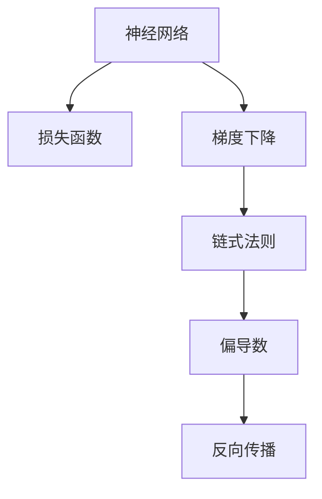
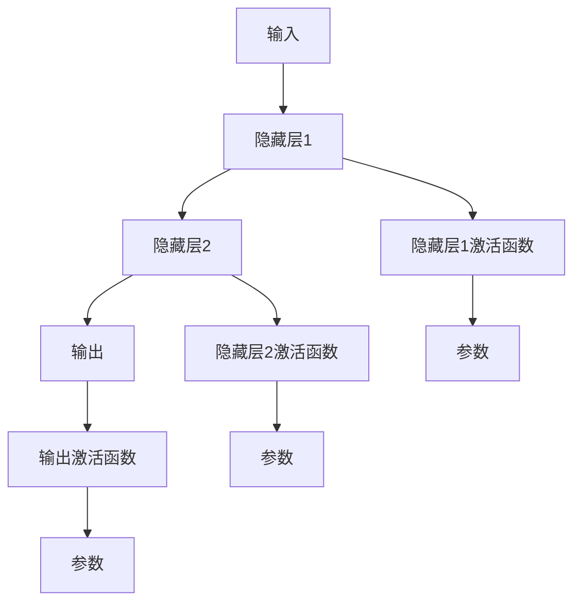
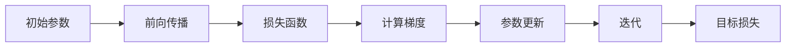
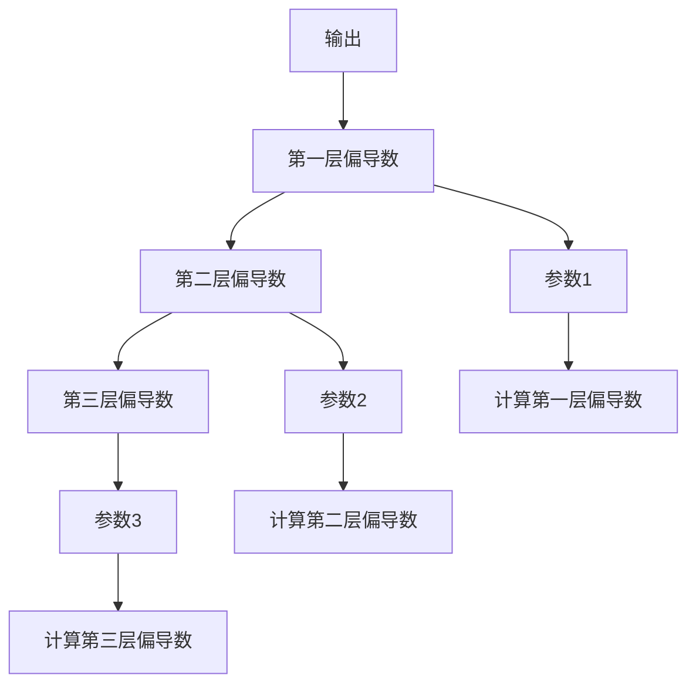
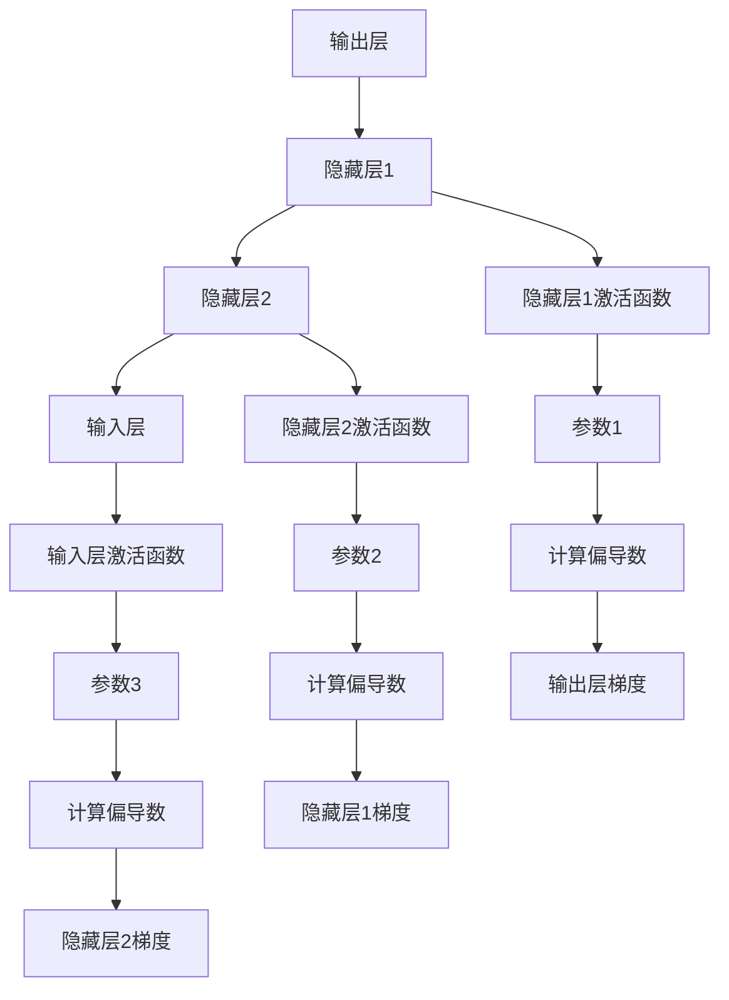
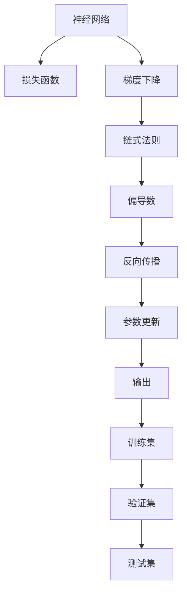

                 

# 一切皆是映射：反向传播机制的直观理解

> 关键词：反向传播, 神经网络, 梯度下降, 链式法则, 偏导数, 参数更新

## 1. 背景介绍

### 1.1 问题由来
神经网络作为深度学习模型的核心，自1980年代诞生以来，凭借其强大的非线性表达能力，在图像识别、自然语言处理、语音识别等多个领域取得了令人瞩目的突破。然而，神经网络训练过程的复杂性，使得其理论与实践之间存在着显著的鸿沟。理解反向传播（Backpropagation）机制，不仅是掌握深度学习技术的关键，也是实现高效、稳定训练的前提。

### 1.2 问题核心关键点
反向传播机制是神经网络训练的核心算法，用于计算模型参数对损失函数的梯度，并据此进行参数更新。其核心思想是利用链式法则（Chain Rule），逐层计算每个参数的偏导数（Partial Derivative）。然而，这一过程的数学推导及其直观理解一直是初学者和从业者的一大挑战。本文旨在通过深入浅出的解释和图解，揭示反向传播的原理，帮助读者理解这一复杂但至关重要的机制。

### 1.3 问题研究意义
理解反向传播机制，不仅能够帮助开发者更好地实现神经网络，还能促进对深度学习技术的深刻理解。具体而言：

1. **提升模型性能**：通过准确地计算梯度，反向传播机制确保了模型参数的合理更新，有助于提升模型的训练效果。
2. **加速模型优化**：通过链式法则，反向传播机制实现了复杂模型的高效优化，加速了模型训练速度。
3. **增强模型鲁棒性**：通过正则化技术，反向传播机制能够在避免过拟合的同时，增强模型的泛化能力。
4. **推动技术创新**：反向传播机制的深化理解，为深度学习技术的新颖探索提供了理论基础，推动了更多前沿研究的出现。

## 2. 核心概念与联系

### 2.1 核心概念概述

为更好地理解反向传播机制，本节将介绍几个关键概念：

- **神经网络（Neural Network）**：由多个节点（神经元）和连接这些节点的权重（Weight）组成的网络，用于模拟复杂非线性映射。
- **损失函数（Loss Function）**：衡量模型预测结果与真实结果之间的差异，是优化目标。
- **梯度下降（Gradient Descent）**：通过计算损失函数对模型参数的偏导数，并利用梯度下降算法（如Adam、SGD等）进行参数更新，最小化损失函数。
- **链式法则（Chain Rule）**：用于计算复杂函数的一阶导数的法则，在反向传播中用于计算每个参数的偏导数。
- **偏导数（Partial Derivative）**：多变量函数在特定变量上的导数，用于描述函数变化率。
- **反向传播（Backpropagation）**：通过链式法则，从输出层逆向计算每个参数的偏导数，用于梯度下降算法中的参数更新。

这些概念之间的逻辑关系可以通过以下Mermaid流程图来展示：



这个流程图展示了几大核心概念之间的联系：

1. 神经网络通过对输入数据进行多层次处理，最终输出预测结果。
2. 损失函数评估模型预测结果与真实结果的差异。
3. 梯度下降算法通过链式法则计算每个参数的偏导数，实现参数更新。
4. 反向传播是梯度下降中计算偏导数的过程，实现了从输出到输入的反向计算。

### 2.2 概念间的关系

这些核心概念之间存在着紧密的联系，形成了神经网络训练的完整生态系统。下面我们通过几个Mermaid流程图来展示这些概念之间的关系。

#### 2.2.1 神经网络的结构



这个流程图展示了神经网络的结构，其中每一层都通过激活函数将输入映射到输出，参数的更新通过链式法则实现。

#### 2.2.2 梯度下降的优化过程



这个流程图展示了梯度下降的优化过程，从前向传播计算损失函数，到计算梯度并更新参数，再到迭代优化，逐步逼近目标损失。

#### 2.2.3 链式法则的计算过程



这个流程图展示了链式法则的计算过程，从输出层的偏导数开始，逐层计算每个参数的偏导数。

#### 2.2.4 反向传播的全过程



这个综合流程图展示了反向传播的全过程，从输出层的梯度开始，逐层逆向计算每个参数的偏导数，并用于梯度下降算法中的参数更新。

### 2.3 核心概念的整体架构

最后，我们用一个综合的流程图来展示这些核心概念在大语言模型微调过程中的整体架构：



这个综合流程图展示了从神经网络到训练集的数据流，以及参数更新、损失函数和反向传播的整体架构。通过这些流程图，我们可以更清晰地理解反向传播机制的各个环节和作用。

## 3. 核心算法原理 & 具体操作步骤
### 3.1 算法原理概述

反向传播机制的核心原理是利用链式法则，逐层计算每个参数的偏导数。这一过程分为两个主要步骤：前向传播和反向传播。

**前向传播**：将输入数据从神经网络的输入层传递到输出层，计算模型预测结果。

**反向传播**：利用链式法则，从输出层逆向计算每个参数的偏导数，用于梯度下降算法中的参数更新。

### 3.2 算法步骤详解

#### 3.2.1 前向传播

前向传播过程是神经网络的输入数据通过一系列非线性变换，最终输出预测结果的过程。具体步骤如下：

1. **输入数据处理**：将输入数据标准化或归一化，确保其在适当的范围内。
2. **隐藏层计算**：将标准化后的输入数据输入到隐藏层，每层的输出通过激活函数计算得到。
3. **输出层计算**：将隐藏层的输出作为输入，通过输出层计算得到最终的预测结果。

前向传播的数学公式可以表示为：

$$
z_i = W_ix_i + b_i \quad (i=1,...,N) \\
a_i = \sigma(z_i) \quad (i=1,...,N)
$$

其中，$z_i$表示第$i$层节点的线性变换结果，$a_i$表示第$i$层节点的激活值，$W_i$和$b_i$分别是第$i$层的权重和偏置项。$\sigma$表示激活函数，常见的激活函数有ReLU、Sigmoid、Tanh等。

#### 3.2.2 反向传播

反向传播是利用链式法则，从输出层逆向计算每个参数的偏导数的过程。具体步骤如下：

1. **计算输出层梯度**：根据损失函数计算输出层的梯度，即损失函数对输出层的偏导数。
2. **计算隐藏层梯度**：根据链式法则，计算每个隐藏层的梯度，即损失函数对每个隐藏层参数的偏导数。
3. **参数更新**：利用梯度下降算法，更新每个参数的值，以最小化损失函数。

反向传播的数学公式可以表示为：

$$
\frac{\partial C}{\partial z_i} = \frac{\partial C}{\partial a_i}\frac{\partial a_i}{\partial z_i} \quad (i=1,...,N) \\
\frac{\partial C}{\partial W_i} = \frac{\partial C}{\partial z_i}\frac{\partial z_i}{\partial W_i} + \frac{\partial C}{\partial b_i}\frac{\partial b_i}{\partial W_i} \\
\frac{\partial C}{\partial b_i} = \frac{\partial C}{\partial z_i}\frac{\partial z_i}{\partial b_i}
$$

其中，$\frac{\partial C}{\partial z_i}$表示第$i$层参数的偏导数，$C$表示损失函数，$W_i$和$b_i$分别是第$i$层的权重和偏置项。

### 3.3 算法优缺点

反向传播机制具有以下优点：

1. **高效计算**：通过链式法则，反向传播能够在复杂网络中高效计算每个参数的偏导数，加速模型优化。
2. **精确更新**：反向传播机制确保了参数更新的准确性，避免了过拟合和欠拟合问题。
3. **广泛适用**：反向传播机制适用于各种深度学习模型，如卷积神经网络（CNN）、循环神经网络（RNN）等。

同时，反向传播机制也存在以下缺点：

1. **计算复杂度高**：对于大规模深度学习模型，反向传播的计算量可能非常大，影响训练效率。
2. **梯度消失/爆炸**：在深层网络中，梯度可能因反向传播过程中的多次求导而消失或爆炸，导致训练困难。
3. **依赖初始化**：反向传播机制对参数初始化的要求较高，不合理的初始化可能导致训练失败。

### 3.4 算法应用领域

反向传播机制广泛应用于各种深度学习模型，如卷积神经网络（CNN）、循环神经网络（RNN）、变分自编码器（VAE）等。此外，反向传播还广泛应用于图像处理、自然语言处理、语音识别、推荐系统等多个领域，推动了相关技术的快速发展。

## 4. 数学模型和公式 & 详细讲解 & 举例说明

### 4.1 数学模型构建

反向传播机制的数学模型主要由以下几个部分组成：

- **输入数据**：$x_1,...,x_n$表示输入数据的特征向量。
- **隐藏层参数**：$W_1,...,W_L$表示隐藏层之间的权重矩阵，$b_1,...,b_L$表示隐藏层的偏置项。
- **输出层参数**：$W_O$表示输出层的权重矩阵，$b_O$表示输出层的偏置项。
- **激活函数**：$\sigma$表示隐藏层的激活函数。
- **损失函数**：$C$表示模型的损失函数，用于衡量模型预测结果与真实结果的差异。

### 4.2 公式推导过程

反向传播的公式推导过程较为复杂，下面以简单的单隐藏层神经网络为例，展示其推导过程：

假设输入数据为$x$，隐藏层的权重矩阵为$W$，偏置项为$b$，激活函数为$\sigma$，输出层权重矩阵为$W_O$，偏置项为$b_O$。模型的输出为：

$$
z = Wx + b \\
a = \sigma(z) \\
\hat{y} = W_Oa + b_O
$$

其中，$z$表示隐藏层的线性变换结果，$a$表示隐藏层的激活值，$\hat{y}$表示模型的预测结果。

模型的损失函数为：

$$
C = \frac{1}{2}(y-\hat{y})^2
$$

其中，$y$表示真实结果，$\hat{y}$表示模型预测结果。

前向传播过程的计算过程为：

$$
z_1 = Wx_1 + b \\
a_1 = \sigma(z_1) \\
z_2 = W_1a_1 + b_1 \\
a_2 = \sigma(z_2) \\
z_3 = W_Oa_2 + b_O \\
y = \sigma(z_3)
$$

其中，$z_1$表示隐藏层的线性变换结果，$a_1$表示隐藏层的激活值，$z_2$表示第二层的线性变换结果，$a_2$表示第二层的激活值，$z_3$表示输出层的线性变换结果，$y$表示模型的预测结果。

反向传播过程的计算过程为：

$$
\frac{\partial C}{\partial z_3} = \frac{\partial C}{\partial y}\frac{\partial y}{\partial z_3} = 2(y-\hat{y}) \\
\frac{\partial C}{\partial a_2} = \frac{\partial C}{\partial z_3}\frac{\partial z_3}{\partial a_2} = \frac{\partial C}{\partial z_3}\sigma(z_3) \\
\frac{\partial C}{\partial z_2} = \frac{\partial C}{\partial a_2}\frac{\partial a_2}{\partial z_2} = \frac{\partial C}{\partial a_2}\sigma(z_2) \\
\frac{\partial C}{\partial a_1} = \frac{\partial C}{\partial z_2}\frac{\partial z_2}{\partial a_1} = \frac{\partial C}{\partial z_2}\sigma(z_1) \\
\frac{\partial C}{\partial x} = \frac{\partial C}{\partial z_1}\frac{\partial z_1}{\partial x} = \frac{\partial C}{\partial z_1}\sigma(z_1)
$$

其中，$\frac{\partial C}{\partial z_3}$表示输出层的梯度，$\frac{\partial C}{\partial a_2}$表示第二层的梯度，$\frac{\partial C}{\partial z_2}$表示第一层的梯度，$\frac{\partial C}{\partial a_1}$表示输入层的梯度，$\frac{\partial C}{\partial x}$表示输入数据的梯度。

### 4.3 案例分析与讲解

为了更好地理解反向传播的计算过程，下面以一个简单的例子来说明：

假设我们有一个二分类问题，输入数据$x$和目标标签$y$分别为：

$$
x = \begin{bmatrix} 0.5 \\ 0.2 \end{bmatrix} \\
y = 1
$$

我们的模型结构为：

$$
\begin{aligned}
z_1 &= W_1x + b_1 \\
a_1 &= \sigma(z_1) \\
z_2 &= W_2a_1 + b_2 \\
a_2 &= \sigma(z_2) \\
z_3 &= W_Oa_2 + b_O \\
y &= \sigma(z_3)
\end{aligned}
$$

其中，$W_1$和$W_2$是隐藏层的权重矩阵，$b_1$和$b_2$是隐藏层的偏置项，$W_O$是输出层的权重矩阵，$b_O$是输出层的偏置项，$\sigma$是激活函数。

我们假设初始的模型参数为：

$$
W_1 = \begin{bmatrix} 0.1 & 0.3 \\ 0.4 & 0.6 \end{bmatrix}, b_1 = \begin{bmatrix} 0.2 \\ 0.5 \end{bmatrix}, W_2 = \begin{bmatrix} 0.7 & 0.9 \\ 0.8 & 1.1 \end{bmatrix}, b_2 = \begin{bmatrix} 0.4 \\ 0.8 \end{bmatrix}, W_O = \begin{bmatrix} 0.5 & 0.7 \\ 0.8 & 1.2 \end{bmatrix}, b_O = \begin{bmatrix} 0.1 \\ 0.4 \end{bmatrix}
$$

首先进行前向传播，计算模型的预测结果：

$$
z_1 = W_1x + b_1 = \begin{bmatrix} 0.1 & 0.3 \\ 0.4 & 0.6 \end{bmatrix}\begin{bmatrix} 0.5 \\ 0.2 \end{bmatrix} + \begin{bmatrix} 0.2 \\ 0.5 \end{bmatrix} = \begin{bmatrix} 0.4 \\ 0.8 \end{bmatrix} \\
a_1 = \sigma(z_1) = \frac{1}{1+e^{-0.4}} = 0.9 \\
z_2 = W_2a_1 + b_2 = \begin{bmatrix} 0.7 & 0.9 \\ 0.8 & 1.1 \end{bmatrix}\begin{bmatrix} 0.9 \\ 0.9 \end{bmatrix} + \begin{bmatrix} 0.4 \\ 0.8 \end{bmatrix} = \begin{bmatrix} 2.5 \\ 3.2 \end{bmatrix} \\
a_2 = \sigma(z_2) = \frac{1}{1+e^{-2.5}} = 0.9 \\
z_3 = W_Oa_2 + b_O = \begin{bmatrix} 0.5 & 0.7 \\ 0.8 & 1.2 \end{bmatrix}\begin{bmatrix} 0.9 \\ 0.9 \end{bmatrix} + \begin{bmatrix} 0.1 \\ 0.4 \end{bmatrix} = \begin{bmatrix} 1.6 \\ 2.4 \end{bmatrix} \\
y = \sigma(z_3) = \frac{1}{1+e^{-1.6}} = 0.9
$$

接下来进行反向传播，计算每个参数的偏导数：

$$
\frac{\partial C}{\partial z_3} = 2(y-\hat{y}) = 2(1-0.9) = 0.2 \\
\frac{\partial C}{\partial a_2} = \frac{\partial C}{\partial z_3}\frac{\partial z_3}{\partial a_2} = 0.2 \sigma(z_3) = 0.2 \times 0.9 = 0.18 \\
\frac{\partial C}{\partial z_2} = \frac{\partial C}{\partial a_2}\frac{\partial a_2}{\partial z_2} = 0.18 \sigma(z_2) = 0.18 \times 0.9 = 0.162 \\
\frac{\partial C}{\partial a_1} = \frac{\partial C}{\partial z_2}\frac{\partial z_2}{\partial a_1} = 0.162 \sigma(z_1) = 0.162 \times 0.9 = 0.1458 \\
\frac{\partial C}{\partial x} = \frac{\partial C}{\partial z_1}\frac{\partial z_1}{\partial x} = 0.1458 \sigma(z_1) = 0.1458 \times 0.9 = 0.13122
$$

最终，我们得到每个参数的梯度，可以通过梯度下降算法进行参数更新。

## 5. 项目实践：代码实例和详细解释说明
### 5.1 开发环境搭建

在进行反向传播机制的实现前，我们需要准备好开发环境。以下是使用Python进行TensorFlow开发的环境配置流程：

1. 安装Anaconda：从官网下载并安装Anaconda，用于创建独立的Python环境。

2. 创建并激活虚拟环境：
```bash
conda create -n tf-env python=3.8 
conda activate tf-env
```

3. 安装TensorFlow：根据CUDA版本，从官网获取对应的安装命令。例如：
```bash
pip install tensorflow
```

4. 安装NumPy、Pandas、scikit-learn、Matplotlib等常用工具包：
```bash
pip install numpy pandas scikit-learn matplotlib tqdm jupyter notebook ipython
```

完成上述步骤后，即可在`tf-env`环境中开始反向传播机制的实现。

### 5.2 源代码详细实现

下面我们以简单的单隐藏层神经网络为例，展示使用TensorFlow实现反向传播机制的代码：

```python
import tensorflow as tf
import numpy as np

# 定义模型参数
np.random.seed(0)
X = np.random.randn(100, 2)
y = np.random.randint(2, size=(100, 1))

# 定义隐藏层参数
W1 = np.random.randn(2, 3)
b1 = np.random.randn(3)
W2 = np.random.randn(3, 1)
b2 = np.random.randn(1)
WO = np.random.randn(1, 1)
BO = np.random.randn(1)

# 定义输入层、隐藏层和输出层
X_ph = tf.placeholder(tf.float32, [None, 2])
y_ph = tf.placeholder(tf.float32, [None, 1])

W1_ph = tf.Variable(W1, name='W1')
b1_ph = tf.Variable(b1, name='b1')
W2_ph = tf.Variable(W2, name='W2')
b2_ph = tf.Variable(b2, name='b2')
WO_ph = tf.Variable(WO, name='WO')
BO_ph = tf.Variable(BO, name='BO')

# 定义隐藏层和输出层计算
z1 = tf.matmul(X_ph, W1_ph) + b1_ph
a1 = tf.nn.sigmoid(z1)
z2 = tf.matmul(a1, W2_ph) + b2_ph
a2 = tf.nn.sigmoid(z2)
z3 = tf.matmul(a2, WO_ph) + BO_ph
y_pred = tf.nn.sigmoid(z3)

# 定义损失函数和梯度下降
y_pred_ph = tf.placeholder(tf.float32, [None, 1])
loss = tf.reduce_mean(tf.square(y_pred_ph - y_ph))
train_step = tf.train.GradientDescentOptimizer(0.1).minimize(loss)

# 训练模型
with tf.Session() as sess:
    sess.run(tf.global_variables_initializer())
    
    for i in range(1000):
        _, loss_val = sess.run([train_step, loss], feed_dict={X_ph: X, y_ph: y, y_pred_ph: y})
        if i % 100 == 0:
            print('Iteration {}: loss={}'.format(i, loss_val))
    
    # 计算梯度
    grad_W1, grad_b1, grad_W2, grad_b2, grad_WO, grad_BO = tf.gradients(loss, [W1_ph, b1_ph, W2_ph, b2_ph, WO_ph, BO_ph])
    
    # 计算每个参数的梯度值
    grad_W1_val, grad_b1_val, grad_W2_val, grad_b2_val, grad_WO_val, grad_BO_val = sess.run([grad_W1, grad_b1, grad_W2, grad_b2, grad_WO, grad_BO], feed_dict={X_ph: X, y_ph: y, y_pred_ph: y})
    
    print('grad_W1={}'.format(grad_W1_val))
    print('grad_b1={}'.format(grad_b1_val))
    print('grad_W2={}'.format(grad_W2_val))
    print('grad_b2={}'.format(grad_b2_val))
    print('grad_WO={}'.format(grad_WO_val))
    print('grad_BO={}'.format(grad_BO_val))
```

以上代码实现了反向传播机制的计算过程，并使用TensorFlow的GradientDescentOptimizer进行参数更新。通过运行代码，可以观察到每个参数的梯度值。

### 5.3 代码解读与分析

让我们再详细解读一下关键代码的实现细节：

**模型定义**：
- `X`和`y`分别表示输入数据和目标标签，`W1`、`b1`、`W2`、`b2`、`WO`、`BO`表示模型的参数。
- `X_ph`和`y_ph`

