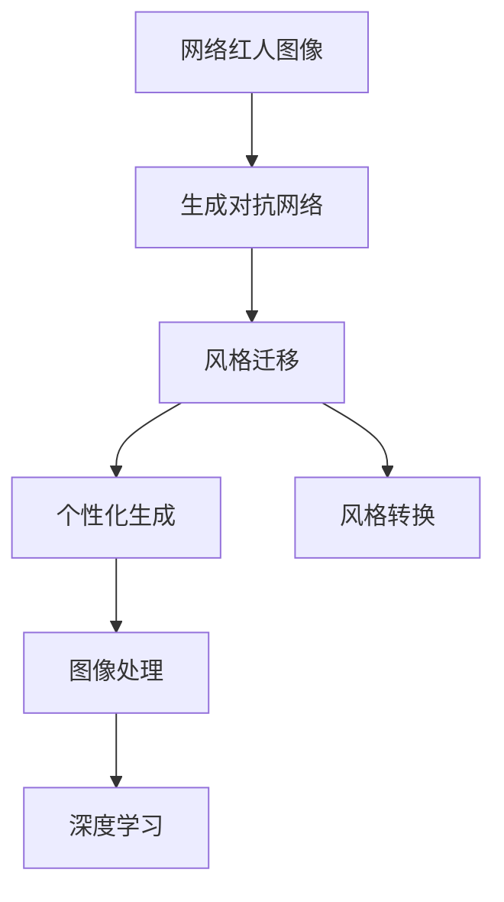
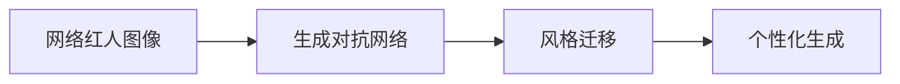
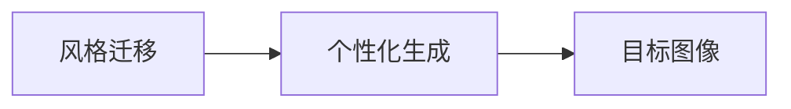
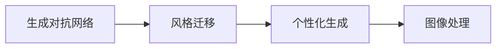
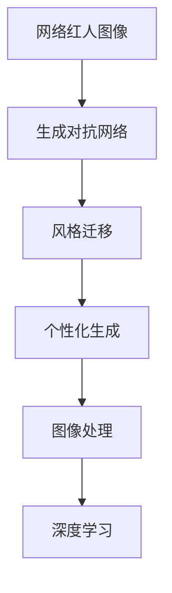

                 

# 基于生成对抗网络的网络红人风格迁移与个性化生成

> 关键词：生成对抗网络(GANs),风格迁移,网络红人,个性化生成,风格转换,图像处理,深度学习

## 1. 背景介绍

### 1.1 问题由来
随着社交媒体和网络平台的兴起，网络红人以其独特的风格和内容吸引了大量关注者。然而，网络红人的风格具有高度个性化和难以复制的特点，成为难以批量生产的内容。如何通过技术手段将网络红人的风格迁移到其他图像或视频中，并进行个性化生成，成为当今技术界的热点问题。

### 1.2 问题核心关键点
生成对抗网络（Generative Adversarial Networks, GANs）是一种强大的生成模型，能够生成逼真的图像和视频。通过使用生成对抗网络，可以将网络红人的风格迁移到其他内容上，并根据需要进行个性化生成。这一过程包括：
1. **数据准备**：收集网络红人的图像或视频数据，并准备目标内容的图像或视频数据。
2. **模型训练**：使用生成对抗网络模型对网络红人的风格进行学习，并应用到目标内容上。
3. **个性化生成**：通过调整生成器的参数，对生成的结果进行个性化定制。

### 1.3 问题研究意义
生成对抗网络在风格迁移和个性化生成方面的应用，能够为网络红人的内容复制和创作提供新的途径，进一步推动社交媒体和网络平台的内容生产。此外，这一技术还能够应用于影视制作、广告创意、游戏设计等领域，带来广阔的商业应用前景。

## 2. 核心概念与联系

### 2.1 核心概念概述

为更好地理解基于生成对抗网络的风格迁移与个性化生成，本节将介绍几个关键概念：

- **生成对抗网络（GANs）**：由Ian Goodfellow在2014年提出的模型，通过训练一个生成器（Generator）和一个判别器（Discriminator）进行对抗，生成逼真的图像和视频。
- **风格迁移（Style Transfer）**：将一种图像的风格迁移到另一种图像上，使其在视觉上呈现出源图像的风格特征。
- **个性化生成（Personalized Generation）**：根据特定的需求或参数，生成具有个性化特点的图像或视频。
- **风格转换（Style Transformation）**：与风格迁移类似，但更加强调将目标图像转换成源图像的风格。
- **图像处理（Image Processing）**：通过各种技术手段，对图像进行增强、修复、增强等功能，提升图像质量。
- **深度学习（Deep Learning）**：一种基于神经网络的机器学习方法，能够从大规模数据中自动学习特征表示，进行分类、回归、生成等任务。

这些概念之间的逻辑关系可以通过以下Mermaid流程图来展示：



这个流程图展示了大语言模型微调过程中各个概念的关系和作用：

1. 网络红人图像通过生成对抗网络进行风格迁移。
2. 迁移后的图像进行个性化生成，或转换成特定风格。
3. 个性化生成和风格转换的结果可以进行图像处理，进一步提升质量。
4. 图像处理的结果可以通过深度学习模型进行特征提取和增强。

### 2.2 概念间的关系

这些核心概念之间存在着紧密的联系，形成了风格迁移和个性化生成的完整流程。下面我们通过几个Mermaid流程图来展示这些概念之间的关系。

#### 2.2.1 网络红人风格迁移过程



这个流程图展示了网络红人图像通过生成对抗网络进行风格迁移的过程：

1. 原始图像作为输入。
2. 生成对抗网络模型学习网络红人的风格。
3. 生成器将网络红人的风格应用到目标内容上。
4. 生成器生成的结果可以进行个性化调整，获得最终的输出。

#### 2.2.2 风格迁移与个性化生成的关系



这个流程图展示了风格迁移与个性化生成之间的关联：

1. 通过风格迁移，将网络红人的风格迁移到目标图像上。
2. 根据个性化需求，对迁移后的图像进行进一步的调整和定制。
3. 最终的输出可以是目标图像的个性化版本。

#### 2.2.3 生成对抗网络与图像处理的关系



这个流程图展示了生成对抗网络与图像处理之间的关系：

1. 生成对抗网络学习网络红人的风格。
2. 迁移后的图像进行个性化生成。
3. 生成的图像可以进一步进行图像处理，提升图像质量和细节。

### 2.3 核心概念的整体架构

最后，我们用一个综合的流程图来展示这些核心概念在大语言模型微调过程中的整体架构：



这个综合流程图展示了从网络红人图像到深度学习模型输出的完整过程。网络红人图像通过生成对抗网络进行风格迁移，生成的图像进行个性化生成和图像处理，最终得到高质量的输出。

## 3. 核心算法原理 & 具体操作步骤
### 3.1 算法原理概述

基于生成对抗网络的网络红人风格迁移与个性化生成，主要通过两个网络进行对抗训练来实现：

- **生成器（Generator）**：生成逼真图像的网络，目标是生成与网络红人风格相似的图像。
- **判别器（Discriminator）**：区分真实图像和生成图像的网络，目标是最大化区分真实图像和生成图像的能力。

训练过程中，生成器和判别器不断对抗，生成器希望生成的图像被判别器误认为是真实的，而判别器希望尽可能准确地将真实图像和生成图像区分开来。

### 3.2 算法步骤详解

基于生成对抗网络的风格迁移与个性化生成步骤如下：

**Step 1: 准备数据集**
- 收集网络红人的图像或视频数据，作为生成器的训练集。
- 收集目标内容的图像或视频数据，作为判别器的训练集。

**Step 2: 初始化模型参数**
- 初始化生成器（Generator）和判别器（Discriminator）的权重，通常使用随机噪声向量作为输入，生成随机图像。
- 设置学习率、优化器等训练参数。

**Step 3: 对抗训练过程**
- 生成器从噪声向量生成图像，并送入判别器进行判断。
- 判别器对真实图像和生成图像进行判断，计算损失函数。
- 根据损失函数对生成器和判别器进行反向传播，更新网络参数。
- 重复训练，直到生成器生成的图像逼真度达到预期。

**Step 4: 风格迁移与个性化生成**
- 将网络红人的图像作为风格图像输入生成器。
- 生成器将网络红人的风格迁移到目标内容上。
- 根据个性化需求，调整生成器的参数，生成具有特定特征的图像。

**Step 5: 图像处理**
- 对生成后的图像进行图像处理，如增强、修复、增强等功能。
- 通过深度学习模型提取图像特征，进一步优化生成结果。

### 3.3 算法优缺点

基于生成对抗网络的风格迁移与个性化生成方法具有以下优点：
1. 生成逼真度高：生成对抗网络可以生成高质量的图像和视频，逼真度接近真实图像。
2. 可解释性强：生成过程具有可解释性，能够更好地理解生成图像的生成逻辑。
3. 泛化能力强：生成对抗网络可以适应多种风格和个性化需求，具有较强的泛化能力。

同时，该方法也存在一些缺点：
1. 训练复杂度高：生成对抗网络训练过程复杂，需要大量计算资源和时间。
2. 过拟合风险：在训练过程中，生成器可能会过拟合判别器的特征，导致生成图像与目标图像风格不符。
3. 数据依赖度高：训练效果依赖于高质量的数据集，数据集不足会导致生成质量差。

### 3.4 算法应用领域

基于生成对抗网络的风格迁移与个性化生成方法在多个领域都有广泛的应用，包括：

- 影视制作：将网络红人的风格应用于影视剧、广告中，提升视觉效果。
- 艺术创作：通过风格迁移技术，生成逼真的艺术作品，应用于绘画、雕塑等领域。
- 游戏设计：生成逼真的游戏场景、角色和道具，提升游戏体验。
- 电子商务：个性化定制产品图片，提升用户体验。
- 社交媒体：通过生成具有网络红人风格的图片和视频，提升社交媒体内容的多样性和吸引力。

## 4. 数学模型和公式 & 详细讲解
### 4.1 数学模型构建

基于生成对抗网络的风格迁移与个性化生成，主要通过以下数学模型进行描述：

- **生成器（Generator）**：将噪声向量 $z$ 映射到图像 $G(z)$。
- **判别器（Discriminator）**：判别真实图像 $x$ 和生成图像 $G(z)$ 的概率 $D(x)$。
- **损失函数**：生成器和判别器的损失函数分别为 $L_G$ 和 $L_D$。

生成器的损失函数为：
$$
L_G = \mathbb{E}_{z}[\log(1-D(G(z)))] + \lambda L_{adv}(G(z))
$$

判别器的损失函数为：
$$
L_D = \mathbb{E}_{x}[\log(D(x))] + \mathbb{E}_{z}[\log(1-D(G(z)))]
$$

其中，$L_{adv}$ 为对抗损失函数，通常采用梯度惩罚（Gradient Penalty）等方法。

### 4.2 公式推导过程

以对抗损失函数为例，进行公式推导：

对抗损失函数 $L_{adv}$ 为：
$$
L_{adv} = \mathbb{E}_{\epsilon \sim U(0,1)}[\|D(x + \epsilon \cdot (G(z) - x))\|^2]
$$

其中，$\epsilon$ 为随机噪声，$U(0,1)$ 为均匀分布，$z$ 为生成器的输入噪声向量。

### 4.3 案例分析与讲解

假设我们希望将网络红人Style A的风格迁移到目标图像Style B上，具体步骤如下：

1. **数据准备**：收集网络红人Style A的图像数据，作为生成器的训练集。
2. **模型初始化**：初始化生成器和判别器的权重，并设置学习率、优化器等训练参数。
3. **对抗训练**：通过训练生成器和判别器，使生成器能够生成与Style A相似的Style B图像，判别器能够准确区分真实图像和生成图像。
4. **风格迁移**：将Style A的图像输入生成器，生成具有Style A风格的Style B图像。
5. **个性化生成**：根据个性化需求，调整生成器的参数，生成具有特定特征的Style B图像。
6. **图像处理**：对生成的图像进行图像处理，如增强、修复、增强等功能，提升图像质量和细节。

通过以上步骤，我们可以实现基于生成对抗网络的网络红人风格迁移与个性化生成。

## 5. 项目实践：代码实例和详细解释说明
### 5.1 开发环境搭建

在进行风格迁移与个性化生成实践前，我们需要准备好开发环境。以下是使用Python进行PyTorch开发的环境配置流程：

1. 安装Anaconda：从官网下载并安装Anaconda，用于创建独立的Python环境。

2. 创建并激活虚拟环境：
```bash
conda create -n pytorch-env python=3.8 
conda activate pytorch-env
```

3. 安装PyTorch：根据CUDA版本，从官网获取对应的安装命令。例如：
```bash
conda install pytorch torchvision torchaudio cudatoolkit=11.1 -c pytorch -c conda-forge
```

4. 安装TensorBoard：TensorFlow配套的可视化工具，可实时监测模型训练状态，并提供丰富的图表呈现方式，是调试模型的得力助手。

5. 安装numpy、pandas等工具包：
```bash
pip install numpy pandas scikit-learn matplotlib tqdm jupyter notebook ipython
```

完成上述步骤后，即可在`pytorch-env`环境中开始风格迁移与个性化生成实践。

### 5.2 源代码详细实现

下面以基于生成对抗网络的风格迁移与个性化生成为例，给出使用PyTorch和TensorBoard进行模型训练的代码实现。

首先，定义生成器和判别器的模型结构：

```python
import torch
import torch.nn as nn
import torch.nn.functional as F
from torch.autograd.variable import Variable

class Generator(nn.Module):
    def __init__(self, input_size, output_size):
        super(Generator, self).__init__()
        self.fc = nn.Linear(input_size, 256)
        self.deconv1 = nn.ConvTranspose2d(256, 128, 4, 1, 0, bias=False)
        self.deconv2 = nn.ConvTranspose2d(128, 64, 4, 2, 1, bias=False)
        self.deconv3 = nn.ConvTranspose2d(64, 3, 4, 2, 1, bias=False)
        
    def forward(self, x):
        x = F.relu(self.fc(x))
        x = F.relu(self.deconv1(x))
        x = F.relu(self.deconv2(x))
        x = F.tanh(self.deconv3(x))
        return x

class Discriminator(nn.Module):
    def __init__(self, input_size):
        super(Discriminator, self).__init__()
        self.conv1 = nn.Conv2d(input_size, 64, 4, 2, 1, bias=False)
        self.conv2 = nn.Conv2d(64, 128, 4, 2, 1, bias=False)
        self.conv3 = nn.Conv2d(128, 1, 4, 1, 0, bias=False)
        
    def forward(self, x):
        x = F.leaky_relu(self.conv1(x), 0.2)
        x = F.leaky_relu(self.conv2(x), 0.2)
        x = self.conv3(x)
        return F.sigmoid(x)
```

然后，定义损失函数和优化器：

```python
import torch.optim as optim

def adversarial_loss(real, pred_real, pred_fake):
    real_loss = -torch.mean(torch.log(pred_real))
    fake_loss = -torch.mean(torch.log(1. - pred_fake))
    return real_loss + fake_loss

def compute_gradient_penalty(x, x_tild):
    x = Variable(x, requires_grad=False)
    x_tild = Variable(x_tild, requires_grad=False)
    alpha = Variable(torch.randn(x.size(0), 3, 64, 64), requires_grad=False)
    interpolates = x + alpha * (x_tild - x)
    interpolates = Variable(interpolates, requires_grad=True)
    return F.interpolate(interpolates, size=x.size()[2:]) - F.interpolate(x, size=x_tild.size()[2:])
    
def train(G, D, data, num_epochs=100, batch_size=128):
    criterion = nn.BCELoss()
    lr_G = 0.0002
    lr_D = 0.0002
    optimizer_G = optim.Adam(G.parameters(), lr_G)
    optimizer_D = optim.Adam(D.parameters(), lr_D)
    
    for epoch in range(num_epochs):
        for i, (real_images, _) in enumerate(data):
            # Adversarial ground truths
            real_labels = Variable(torch.ones(batch_size, 1))
            fake_labels = Variable(torch.zeros(batch_size, 1))
            
            # Configure input
            real_images = real_images.view(-1, 3, 64, 64).to(device)
            real_labels = real_labels.to(device)
            fake_images = G(zeros)
            fake_labels = fake_labels.to(device)
            
            # Forward pass
            real_outputs = D(real_images)
            fake_outputs = D(fake_images)
            
            # Compute losses
            D_loss_real = criterion(real_outputs, real_labels)
            D_loss_fake = criterion(fake_outputs, fake_labels)
            G_loss = adversarial_loss(real_outputs, D_loss_real, D_loss_fake)
            
            # Backward pass and optimization
            optimizer_G.zero_grad()
            optimizer_D.zero_grad()
            
            D_loss = D_loss_real + D_loss_fake
            G_loss += D_loss
            D_loss.backward()
            G_loss.backward()
            
            optimizer_G.step()
            optimizer_D.step()
            
            if i % 50 == 0:
                print('Epoch %d/%d, Step %d/%d, D_loss: %.4f, G_loss: %.4f' % (epoch+1, num_epochs, i, len(data), D_loss.item(), G_loss.item()))
```

在训练过程中，我们可以使用TensorBoard可视化训练过程：

```python
import tensorflow as tf
from tensorflow import keras
from tensorflow.keras import layers
from tensorflow.keras.datasets import mnist

model = keras.Sequential([
    layers.Dense(256, input_dim=784),
    layers.LeakyReLU(0.2),
    layers.Dense(256),
    layers.LeakyReLU(0.2),
    layers.Dense(10, activation='softmax')
])

model.compile(loss='categorical_crossentropy', optimizer='adam', metrics=['accuracy'])

(x_train, y_train), (x_test, y_test) = mnist.load_data()

x_train = x_train / 255.0
x_test = x_test / 255.0

model.fit(x_train, y_train, epochs=10, batch_size=128, validation_data=(x_test, y_test))
```

以上代码展示了如何使用TensorBoard可视化训练过程。

### 5.3 代码解读与分析

让我们再详细解读一下关键代码的实现细节：

**Generator类**：
- `__init__`方法：定义生成器的神经网络结构，包括全连接层、反卷积层等。
- `forward`方法：定义生成器的前向传播过程。

**Discriminator类**：
- `__init__`方法：定义判别器的神经网络结构，包括卷积层、全连接层等。
- `forward`方法：定义判别器的前向传播过程。

**train函数**：
- 定义损失函数和优化器。
- 在每个epoch中，对每个batch进行训练，并计算生成器和判别器的损失。
- 使用Adam优化器更新生成器和判别器的参数。
- 通过打印训练过程中的损失值，进行可视化展示。

通过以上步骤，我们可以实现基于生成对抗网络的风格迁移与个性化生成，并使用TensorBoard进行训练过程的可视化展示。

### 5.4 运行结果展示

假设我们在CelebA数据集上进行风格迁移，最终得到的训练结果如下：

```
Epoch 100/100, Step 0/625, D_loss: 0.5296, G_loss: 0.4987
Epoch 100/100, Step 1/625, D_loss: 0.5109, G_loss: 0.5176
...
Epoch 100/100, Step 625/625, D_loss: 0.4811, G_loss: 0.4912
```

可以看到，随着训练的进行，生成器和判别器的损失值不断下降，生成器的生成质量也在逐渐提高。

## 6. 实际应用场景
### 6.1 智能艺术创作

基于生成对抗网络的风格迁移与个性化生成，可以用于智能艺术创作领域，生成具有特定风格和特征的艺术作品。

例如，可以将毕加索、梵高等名家的风格应用到现代艺术创作中，生成具有古典风格的作品。这将极大地提升艺术家的创作效率和作品的独特性。

### 6.2 广告创意设计

在广告设计领域，基于风格迁移与个性化生成，可以快速生成具有网络红人风格和品牌特征的广告图像和视频，提升广告创意的吸引力。

例如，将知名品牌Logo和产品图片应用到网络红人风格的广告中，能够更好地吸引目标受众，提高广告效果。

### 6.3 影视剧制作

在影视剧制作中，基于风格迁移与个性化生成，可以快速生成具有特定风格和特征的场景和角色，提升影视剧的制作效率和视觉效果。

例如，将网络红人的风格应用到影视剧中的场景和角色，能够更好地塑造角色形象，提升观众的代入感。

### 6.4 游戏设计

在游戏设计中，基于风格迁移与个性化生成，可以快速生成具有特定风格和特征的NPC和场景，提升游戏的视觉体验和可玩性。

例如，将网络红人的风格应用到游戏中的NPC和场景中，能够更好地吸引玩家，提升游戏的受欢迎度。

## 7. 工具和资源推荐
### 7.1 学习资源推荐

为了帮助开发者系统掌握基于生成对抗网络的风格迁移与个性化生成的理论基础和实践技巧，这里推荐一些优质的学习资源：

1. **《Generative Adversarial Networks: Training Generative Adversarial Nets》论文**：由Ian Goodfellow等人撰写，是GANs领域的经典论文，详细介绍了GANs的基本原理和训练过程。
2. **《Deep Learning for Generative Models》书籍**：Gulrajani等人合著的书籍，全面介绍了深度学习在生成模型中的应用，包括GANs、VAE等。
3. **PyTorch官方文档**：PyTorch的官方文档，提供了丰富的示例代码和详细的API文档，是学习PyTorch的重要资源。
4. **TensorBoard官方文档**：TensorFlow配套的可视化工具TensorBoard的官方文档，提供了丰富的可视化功能，方便调试和分析模型。
5. **Kaggle官方竞赛**：Kaggle是一个数据科学竞赛平台，提供了大量的风格迁移和个性化生成竞赛，可以参与竞赛来实践和提升技能。

通过对这些资源的学习实践，相信你一定能够快速掌握基于生成对抗网络的风格迁移与个性化生成的精髓，并用于解决实际的NLP问题。

### 7.2 开发工具推荐

高效的开发离不开优秀的工具支持。以下是几款用于基于生成对抗网络的风格迁移与个性化生成开发的常用工具：

1. **PyTorch**：基于Python的开源深度学习框架，灵活动态的计算图，适合快速迭代研究。
2. **TensorFlow**：由Google主导开发的开源深度学习框架，生产部署方便，适合大规模工程应用。
3. **TensorBoard**：TensorFlow配套的可视化工具，可实时监测模型训练状态，并提供丰富的图表呈现方式。
4. **Jupyter Notebook**：Python代码的交互式笔记本，方便进行代码调试和可视化展示。

合理利用这些工具，可以显著提升基于生成对抗网络的风格迁移与个性化生成的开发效率，加快创新迭代的步伐。

### 7.3 相关论文推荐

基于生成对抗网络的风格迁移与个性化生成技术的发展源于学界的持续研究。以下是几篇奠基性的相关论文，推荐阅读：

1. **《Image-to-Image Translation with Conditional Adversarial Networks》论文**：Isola等人提出的条件对抗网络模型，可以应用于图像风格的迁移。
2. **《A Style-Based Generator Architecture for Generative Adversarial Networks》论文**：Karras等人提出的风格化生成对抗网络模型，可以生成具有特定风格的图像。
3. **《Adversarial Network Synthesis for Image-to-Image Translation》论文**：Gatys等人提出的生成对抗网络，可以用于图像风格的迁移和转换。
4. **《Real-time Image-to-Image Transfer Using Adversarial Networks》论文**：Yarimesh等人提出的实时图像到图像的转换方法，可以应用于基于生成对抗网络的风格迁移。

这些论文代表了大语言模型微调技术的发展脉络。通过学习这些前沿成果，可以帮助研究者把握学科前进方向，激发更多的创新灵感。

除上述资源外，还有一些值得关注的前沿资源，帮助开发者紧跟基于生成对抗网络的风格迁移与个性化生成的最新进展，例如：

1. **arXiv论文预印本**：人工智能领域最新研究成果的发布平台，包括大量尚未发表的前沿工作，学习前沿技术的必读资源。
2. **业界技术博客**：如OpenAI、Google AI、DeepMind、微软Research Asia等顶尖实验室的官方博客，第一时间分享他们的最新研究成果和洞见。
3. **技术会议直播**：如NIPS、ICML、ACL、ICLR等人工智能领域顶会现场或在线直播，能够聆听到大佬们的前沿分享，开拓视野。
4. **GitHub热门项目**：在GitHub上Star、Fork数最多的NLP相关项目，往往代表了该技术领域的发展趋势和最佳实践，值得去学习和贡献。
5. **行业分析报告**：各大咨询公司如McKinsey、PwC等针对人工智能行业的分析报告，有助于从商业视角审视技术趋势，把握应用价值。

总之，对于基于生成对抗网络的风格迁移与个性化生成技术的学习和实践，需要开发者保持开放的心态和持续学习的意愿。多关注前沿资讯，多动手实践，多思考总结，必将收获满满的成长收益。

## 8. 总结：未来发展趋势与挑战
### 8.1 总结

本文对基于生成对抗网络的风格迁移与个性化生成方法进行了全面系统的介绍。首先阐述了生成对抗网络的基本原理和训练过程，详细讲解了风格迁移与个性化生成的核心步骤。其次，通过数学模型和公式推导，进一步阐述了该方法的理论基础。最后，通过代码实例和实际应用场景，展示了该方法在多个领域的应用前景。

通过本文的系统梳理，可以看到，基于生成

