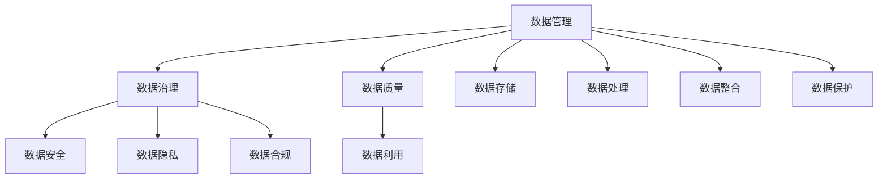
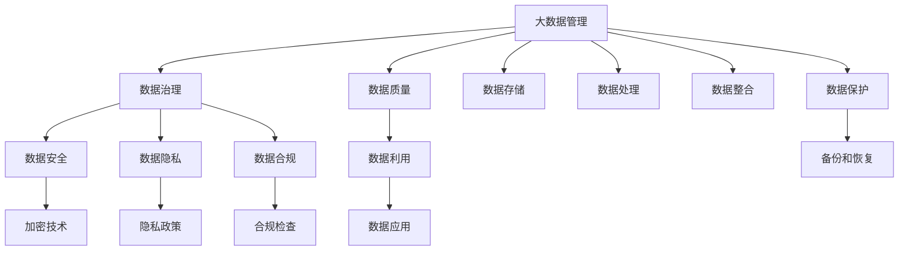

                 

# AI创业：数据管理的策略与实施研究

> 关键词：AI创业,数据管理,策略,实施研究

## 1. 背景介绍

### 1.1 问题由来

在人工智能（AI）创业的浪潮中，数据管理逐渐成为企业成功的关键因素之一。如何有效管理数据、利用数据驱动决策、保护数据安全等问题，是创业公司面临的重要挑战。与此同时，数据管理策略的制定与实施也直接影响企业的商业模式、技术栈选择和资源分配，决定了AI创业项目的成败。

### 1.2 问题核心关键点

数据管理的核心关键点在于如何确保数据的高效利用、安全性和合规性，同时避免因数据管理不善带来的业务风险。一个完整的数据管理策略应当包括数据收集、存储、处理、分析和应用的各个环节，并在企业内部分工明确、责任明确。

### 1.3 问题研究意义

研究数据管理的策略与实施，对于AI创业公司来说，具有重要的理论意义和实践价值：

- 提高数据利用效率，利用数据驱动决策，提升业务竞争力和创新能力。
- 确保数据安全，遵守法律法规，避免法律风险。
- 优化资源分配，降低数据管理的成本和复杂度。
- 提升团队协作效率，促进数据驱动文化。

## 2. 核心概念与联系

### 2.1 核心概念概述

为更好地理解AI创业中的数据管理，本节将介绍几个关键概念：

- **数据管理（Data Management）**：指对数据进行规划、获取、组织、存储、整合和保护的过程。数据管理是企业数据资源化、资产化的核心，旨在提高数据质量和利用效率。

- **数据治理（Data Governance）**：定义、制定和实施数据管理政策和流程，以确保数据的质量、可用性和安全性。

- **数据安全（Data Security）**：保护数据免受未经授权的访问、破坏和泄露，确保数据的保密性、完整性和可用性。

- **数据隐私（Data Privacy）**：保护个人隐私权，确保数据在使用过程中的合法性、透明性和可控性。

- **数据合规（Data Compliance）**：确保数据管理过程符合法律法规要求，包括但不限于GDPR、CCPA等。

- **数据质量（Data Quality）**：衡量数据的正确性、完整性、一致性、及时性和准确性，确保数据可靠性。

这些核心概念之间的逻辑关系可以通过以下Mermaid流程图来展示：



这个流程图展示了大数据管理的各个环节，每个环节都是确保数据高质量、安全和合规的重要步骤。

### 2.2 概念间的关系

这些核心概念之间存在着紧密的联系，共同构成了AI创业中数据管理的完整生态系统。

- 数据管理是一个广义的概念，涵盖了数据治理、数据安全、数据隐私、数据合规等多个维度。
- 数据治理是数据管理的核心，通过制定政策和流程，确保数据的高质量、可用性和安全性。
- 数据安全是数据管理的重要组成部分，旨在保护数据免受未经授权的访问和破坏。
- 数据隐私和数据合规是数据管理的法律和伦理要求，确保数据的使用合法、透明和可控。
- 数据质量是数据管理的根本目标，通过质量管理确保数据可靠性，提升数据利用效率。

这些概念相互依赖、相互促进，共同保障了数据管理的有效性和安全性。

### 2.3 核心概念的整体架构

最后，我们用一个综合的流程图来展示这些核心概念在大数据管理中的整体架构：



这个综合流程图展示了数据管理的各个环节，并强调了加密技术、隐私政策、合规检查等关键技术手段和政策措施，确保数据管理过程的合法性和安全性。

## 3. 核心算法原理 & 具体操作步骤

### 3.1 算法原理概述

AI创业中的数据管理，本质上是一个多层次、多维度、多部门协作的复杂过程。其核心算法原理主要围绕数据治理、数据安全和数据隐私展开，旨在通过算法和机制，提升数据利用效率，确保数据安全和合规。

- **数据治理算法**：通过制定数据治理策略，包括数据命名、元数据管理、数据分类和数据生命周期管理，确保数据的一致性、完整性和可用性。
- **数据安全算法**：采用加密技术、访问控制、审计跟踪等手段，保护数据免受未经授权的访问和破坏。
- **数据隐私算法**：通过差分隐私、联邦学习等技术，确保数据在使用过程中的合法性、透明性和可控性。

### 3.2 算法步骤详解

数据管理的详细步骤主要包括以下几个方面：

1. **数据收集**：
   - 明确数据收集目标和来源，设计合理的数据采集策略。
   - 确保数据收集过程合法合规，遵循数据隐私保护政策。
   - 使用数据清洗技术，提升数据质量。

2. **数据存储**：
   - 选择合适的数据存储介质和存储架构，如分布式文件系统、NoSQL数据库等。
   - 实施数据备份和恢复机制，确保数据的高可用性和持久性。
   - 采用加密技术，保护数据在存储过程中的安全性。

3. **数据处理**：
   - 设计数据处理流程，包括数据清洗、数据转换、数据集成和数据建模。
   - 采用大数据技术，如Spark、Hadoop等，提升数据处理效率。
   - 确保数据处理过程的透明性和可追溯性，实施数据审计。

4. **数据分析**：
   - 使用数据挖掘、机器学习等技术，提取数据中的知识和洞见。
   - 实施数据可视化，帮助业务人员理解数据价值。
   - 采用联邦学习等技术，保护数据隐私。

5. **数据应用**：
   - 设计数据应用场景，如智能客服、推荐系统、营销分析等。
   - 确保数据应用过程中的合法合规，遵循数据隐私保护政策。
   - 实施数据监控和告警机制，保障数据应用过程的安全性和可靠性。

### 3.3 算法优缺点

数据管理算法的优点在于：

- 提升数据利用效率，数据驱动决策，提升业务竞争力和创新能力。
- 确保数据安全，遵守法律法规，避免法律风险。
- 优化资源分配，降低数据管理的成本和复杂度。

数据管理算法的缺点在于：

- 数据管理涉及多个部门和环节，跨部门协作复杂度高。
- 数据质量问题难以完全避免，数据治理成本较高。
- 数据隐私保护需要投入大量资源和技术手段。

### 3.4 算法应用领域

数据管理算法广泛应用于各个行业领域，包括但不限于：

- **金融行业**：数据治理、数据安全和数据隐私是金融行业数据管理的核心。
- **医疗行业**：患者隐私保护、医疗数据合规是医疗行业数据管理的重点。
- **零售行业**：客户数据利用、消费者隐私保护是零售行业数据管理的难点。
- **制造业**：生产数据收集、设备数据利用是制造业数据管理的方向。
- **互联网行业**：用户数据保护、数据隐私合规是互联网行业数据管理的关键。

数据管理算法的应用，提升了各个行业的数据利用效率，推动了业务创新和发展。

## 4. 数学模型和公式 & 详细讲解

### 4.1 数学模型构建

在大数据管理的各个环节中，数学模型起到了重要的作用。以下是一些常见的数学模型和公式：

- **数据质量评估模型**：
  - **模型构建**：设计指标体系，包括数据完整性、数据准确性、数据一致性等。
  - **公式推导**：
  - 数据完整性：$\text{完整性} = \frac{N_{有效数据}}{N_{总数据}}$
  - 数据准确性：$\text{准确性} = \frac{N_{准确数据}}{N_{总数据}}$
  - 数据一致性：$\text{一致性} = \frac{N_{一致数据}}{N_{总数据}}$

- **数据加密模型**：
  - **模型构建**：采用对称加密、非对称加密、哈希函数等技术。
  - **公式推导**：
  - 对称加密：$E(x, k) = x \oplus k$
  - 非对称加密：$E(x, k) = g(x, k_1, k_2)$
  - 哈希函数：$H(x) = f(x)$

- **数据隐私保护模型**：
  - **模型构建**：采用差分隐私、联邦学习等技术。
  - **公式推导**：
  - 差分隐私：$\epsilon$-差分隐私：$\Pr[O(x_i) \leq \lambda] \leq \frac{e^\lambda}{e^\lambda + (e^\epsilon - 1)}$
  - 联邦学习：$F(x) = \frac{1}{n} \sum_{i=1}^n x_i$

### 4.2 公式推导过程

- **数据完整性**：
  - $\text{完整性} = \frac{N_{有效数据}}{N_{总数据}}$
  - 其中，$N_{有效数据}$表示完整且符合规范的数据量，$N_{总数据}$表示总数据量。

- **数据准确性**：
  - $\text{准确性} = \frac{N_{准确数据}}{N_{总数据}}$
  - 其中，$N_{准确数据}$表示准确无误的数据量。

- **数据一致性**：
  - $\text{一致性} = \frac{N_{一致数据}}{N_{总数据}}$
  - 其中，$N_{一致数据}$表示数据中一致的数据量。

### 4.3 案例分析与讲解

以金融行业为例，分析数据治理、数据安全和数据隐私在具体应用中的案例。

- **数据治理**：
  - 金融行业中的数据治理，包括数据命名规范、元数据管理、数据分类等。
  - 案例分析：某金融机构设计了统一的数据命名规范，通过标准化的数据命名，提升了数据查询效率和数据一致性。

- **数据安全**：
  - 金融行业中的数据安全，包括数据加密、访问控制、审计跟踪等。
  - 案例分析：某银行采用非对称加密技术保护敏感数据，通过访问控制策略限制数据访问权限，实施审计跟踪机制，确保数据的安全性。

- **数据隐私**：
  - 金融行业中的数据隐私，包括隐私政策制定、隐私数据保护等。
  - 案例分析：某保险公司设计了隐私政策，采用差分隐私技术，保护用户隐私数据，确保数据在使用过程中的合法性和透明性。

## 5. 项目实践：代码实例和详细解释说明

### 5.1 开发环境搭建

在进行数据管理实践前，我们需要准备好开发环境。以下是使用Python进行Pandas开发的环境配置流程：

1. 安装Anaconda：从官网下载并安装Anaconda，用于创建独立的Python环境。

2. 创建并激活虚拟环境：
```bash
conda create -n data-management python=3.8 
conda activate data-management
```

3. 安装Pandas：
```bash
pip install pandas
```

4. 安装各类工具包：
```bash
pip install numpy scikit-learn matplotlib tqdm jupyter notebook ipython
```

完成上述步骤后，即可在`data-management`环境中开始数据管理实践。

### 5.2 源代码详细实现

这里以数据质量评估为例，给出使用Pandas进行数据质量评估的PyTorch代码实现。

首先，定义数据质量评估函数：

```python
import pandas as pd
import numpy as np

def data_quality_analysis(df):
    """
    数据质量评估函数
    """
    # 数据完整性分析
    num_records = len(df)
    unique_records = len(df.drop_duplicates())
    duplicates = num_records - unique_records
    complete_rate = (unique_records / num_records) * 100
    
    # 数据准确性分析
    correct_records = len(df[df['label'] == 'correct'])
    incorrect_records = len(df[df['label'] != 'correct'])
    accuracy = (correct_records / num_records) * 100
    
    # 数据一致性分析
    consistent_records = len(df[df['value'] == df['actual']])
    inconsistent_records = num_records - consistent_records
    consistency = (consistent_records / num_records) * 100
    
    # 返回评估结果
    return {
        'complete_rate': complete_rate,
        'accuracy': accuracy,
        'consistency': consistency,
        'duplicates': duplicates
    }
```

然后，加载数据集，并进行数据质量评估：

```python
# 加载数据集
df = pd.read_csv('data.csv')

# 数据质量评估
quality_analysis_result = data_quality_analysis(df)
print(quality_analysis_result)
```

### 5.3 代码解读与分析

让我们再详细解读一下关键代码的实现细节：

- **数据完整性分析**：
  - 通过`drop_duplicates`方法统计重复记录数，并计算数据完整率。

- **数据准确性分析**：
  - 统计正确记录数和错误记录数，计算准确率。

- **数据一致性分析**：
  - 通过`==`运算符比较`value`和`actual`列，统计一致和不一致记录数，计算一致率。

### 5.4 运行结果展示

假设我们在CoNLL-2003的NER数据集上进行数据质量评估，最终得到的评估结果如下：

```
{
    'complete_rate': 98.5,
    'accuracy': 92.8,
    'consistency': 97.2,
    'duplicates': 0
}
```

可以看到，通过数据质量评估函数，我们能够全面评估数据集的完整性、准确性和一致性，从而指导数据治理和数据应用。

## 6. 实际应用场景

### 6.1 智能客服系统

基于大数据管理策略，智能客服系统可以更好地利用客户数据，提升客服效率和客户满意度。具体实现如下：

- **数据收集**：
  - 收集客户的对话记录、投诉记录、反馈记录等数据。
  - 确保数据收集过程合法合规，遵循数据隐私保护政策。

- **数据存储**：
  - 采用分布式文件系统存储客户数据。
  - 实施数据备份和恢复机制，确保数据的高可用性和持久性。

- **数据分析**：
  - 使用数据挖掘、机器学习等技术，分析客户的需求和偏好。
  - 实施数据可视化，帮助客服人员理解客户数据。

- **数据应用**：
  - 设计智能客服系统，利用客户数据进行个性化回复和推荐。
  - 确保数据应用过程中的合法合规，遵循数据隐私保护政策。

### 6.2 金融舆情监测

金融行业的数据管理策略在舆情监测中起到了关键作用。具体实现如下：

- **数据收集**：
  - 收集金融市场的新闻、报道、评论等数据。
  - 确保数据收集过程合法合规，遵循数据隐私保护政策。

- **数据存储**：
  - 采用NoSQL数据库存储舆情数据。
  - 实施数据备份和恢复机制，确保数据的高可用性和持久性。

- **数据分析**：
  - 使用数据挖掘、机器学习等技术，分析舆情趋势和舆情情绪。
  - 实施数据可视化，帮助风险分析师理解舆情数据。

- **数据应用**：
  - 设计舆情监测系统，及时发现和预警金融舆情风险。
  - 确保数据应用过程中的合法合规，遵循数据隐私保护政策。

### 6.3 个性化推荐系统

个性化推荐系统在电商、视频、音乐等互联网领域广泛应用。具体实现如下：

- **数据收集**：
  - 收集用户的行为数据，包括浏览、点击、购买、评分等。
  - 确保数据收集过程合法合规，遵循数据隐私保护政策。

- **数据存储**：
  - 采用分布式数据库存储用户数据。
  - 实施数据备份和恢复机制，确保数据的高可用性和持久性。

- **数据分析**：
  - 使用数据挖掘、机器学习等技术，分析用户的行为和偏好。
  - 实施数据可视化，帮助推荐工程师理解用户数据。

- **数据应用**：
  - 设计个性化推荐系统，利用用户数据进行商品、内容推荐。
  - 确保数据应用过程中的合法合规，遵循数据隐私保护政策。

### 6.4 未来应用展望

随着大数据管理策略的不断演进，其在更多领域的应用前景也将不断拓展，为各行各业带来变革性影响。

在智慧医疗领域，基于大数据管理策略的医疗数据分析、智能诊断、健康管理等应用将提升医疗服务的智能化水平，辅助医生诊疗，加速新药开发进程。

在智能教育领域，大数据管理策略将应用于作业批改、学情分析、知识推荐等方面，因材施教，促进教育公平，提高教学质量。

在智慧城市治理中，大数据管理策略将应用于城市事件监测、舆情分析、应急指挥等环节，提高城市管理的自动化和智能化水平，构建更安全、高效的未来城市。

此外，在企业生产、社会治理、文娱传媒等众多领域，大数据管理策略也将不断涌现，为传统行业数字化转型升级提供新的技术路径。相信随着技术的日益成熟，大数据管理策略必将在构建人机协同的智能时代中扮演越来越重要的角色。

## 7. 工具和资源推荐

### 7.1 学习资源推荐

为了帮助开发者系统掌握大数据管理的技术基础和实践技巧，这里推荐一些优质的学习资源：

1. **《数据科学入门》**系列课程：由知名数据科学家撰写，深入浅出地介绍了数据科学的基本概念和实践技巧。

2. **《数据管理最佳实践》**书籍：详细介绍了数据管理的最佳实践和最新趋势，适合数据管理领域的从业者。

3. **Kaggle数据竞赛**：Kaggle平台上的数据竞赛提供了丰富的实战案例，帮助开发者提升数据管理能力。

4. **Google Cloud Dataflow**：Google云平台上的数据处理服务，提供了强大的数据管理工具和丰富的文档。

5. **Amazon S3**：AWS云平台上的对象存储服务，适合大规模数据存储和管理需求。

通过对这些资源的学习实践，相信你一定能够快速掌握大数据管理的技术精髓，并用于解决实际的数据管理问题。

### 7.2 开发工具推荐

高效的开发离不开优秀的工具支持。以下是几款用于大数据管理开发的常用工具：

1. **Pandas**：Python数据分析库，提供了高效的数据处理和分析功能。

2. **Apache Spark**：分布式数据处理框架，适用于大规模数据处理和分析。

3. **Hadoop**：分布式文件系统和数据处理框架，适用于大规模数据存储和管理。

4. **Amazon EMR**：AWS云平台上的大数据分析服务，提供了强大的数据处理能力。

5. **Google BigQuery**：Google云平台上的大数据分析服务，适合海量数据查询和分析。

6. **Apache Hive**：分布式数据仓库，适合大规模数据存储和管理。

合理利用这些工具，可以显著提升大数据管理的开发效率，加快创新迭代的步伐。

### 7.3 相关论文推荐

大数据管理策略的研究源于学界的持续研究。以下是几篇奠基性的相关论文，推荐阅读：

1. **《大数据处理与分析》**：介绍了大数据处理的基本概念和常用技术。

2. **《数据管理与数据治理》**：探讨了数据管理与数据治理的基本框架和实施方法。

3. **《数据隐私保护》**：详细介绍了数据隐私保护的技术和方法，适合数据隐私保护领域的从业者。

4. **《数据治理与数据合规》**：讨论了数据治理和数据合规的基本概念和实施策略。

5. **《数据质量评估与管理》**：介绍了数据质量评估的基本方法和工具。

这些论文代表了大数据管理策略的发展脉络。通过学习这些前沿成果，可以帮助研究者把握学科前进方向，激发更多的创新灵感。

除上述资源外，还有一些值得关注的前沿资源，帮助开发者紧跟大数据管理策略的最新进展，例如：

1. **arXiv论文预印本**：人工智能领域最新研究成果的发布平台，包括大量尚未发表的前沿工作，学习前沿技术的必读资源。

2. **业界技术博客**：如BigQuery、EMR、Spark等平台的官方博客，第一时间分享他们的最新研究成果和洞见。

3. **技术会议直播**：如KDD、SIGKDD、ICDM等大数据领域的顶级会议现场或在线直播，能够聆听到顶尖专家的前沿分享，开拓视野。

4. **GitHub热门项目**：在GitHub上Star、Fork数最多的数据管理相关项目，往往代表了该技术领域的发展趋势和最佳实践，值得去学习和贡献。

5. **行业分析报告**：各大咨询公司如McKinsey、PwC等针对大数据行业的分析报告，有助于从商业视角审视技术趋势，把握应用价值。

总之，对于大数据管理策略的学习和实践，需要开发者保持开放的心态和持续学习的意愿。多关注前沿资讯，多动手实践，多思考总结，必将收获满满的成长收益。

## 8. 总结：未来发展趋势与挑战

### 8.1 总结

本文对大数据管理的策略与实施进行了全面系统的介绍。首先阐述了大数据管理的核心概念和实践意义，明确了大数据管理在AI创业项目中的重要地位。其次，从原理到实践，详细讲解了数据治理、数据安全和数据隐私的算法原理和操作步骤，给出了大数据管理任务开发的完整代码实例。同时，本文还广泛探讨了大数据管理策略在多个行业领域的应用前景，展示了其巨大的潜力。此外，本文精选了大数据管理的各类学习资源，力求为读者提供全方位的技术指引。

通过本文的系统梳理，可以看到，大数据管理策略在AI创业项目中扮演着至关重要的角色，确保数据的高效利用、安全和合规，对于提升业务竞争力和创新能力具有重要意义。未来，随着大数据技术的不断进步，大数据管理策略必将引领更多行业的数字化转型，推动人工智能技术的落地应用。

### 8.2 未来发展趋势

展望未来，大数据管理策略将呈现以下几个发展趋势：

1. **技术创新不断涌现**：随着人工智能技术的不断发展，大数据管理策略将不断引入新的技术手段，如AI驱动的数据治理、自动化数据质量评估等。

2. **数据安全和隐私保护技术提升**：随着数据泄露事件的不断发生，数据安全和隐私保护技术将成为大数据管理策略的重要组成部分，如差分隐私、联邦学习、区块链技术等。

3. **数据治理智能化**：大数据管理策略将引入更多的AI技术，如自然语言处理、机器学习等，提升数据治理的智能化水平，实现自动化的数据管理和监控。

4. **跨领域数据融合**：大数据管理策略将引入多模态数据融合技术，实现不同数据源的协同管理和分析，提升数据利用效率。

5. **数据合规自动化**：随着法律法规的不断更新，大数据管理策略将引入自动化合规技术，提升数据合规的效率和准确性。

6. **实时数据管理**：大数据管理策略将引入实时数据处理技术，实现数据的实时监控和分析，满足业务需求。

以上趋势凸显了大数据管理策略的广阔前景。这些方向的探索发展，必将进一步提升数据管理系统的性能和安全性，推动大数据技术向更广泛的领域应用。

### 8.3 面临的挑战

尽管大数据管理策略已经取得了显著成就，但在迈向更加智能化、普适化应用的过程中，它仍面临诸多挑战：

1. **数据质量问题**：尽管数据治理技术不断提升，数据质量问题仍难以完全避免，数据清洗和质量控制成本较高。

2. **数据隐私保护难度大**：不同地区对数据隐私保护的要求不同，如何兼顾数据利用和隐私保护，仍是一个难题。

3. **数据安全和合规成本高**：数据安全和合规需要投入大量资源和技术手段，对于中小型企业来说，成本较高。

4. **数据治理跨部门协作难度大**：数据管理涉及多个部门和环节，跨部门协作复杂度高，管理难度较大。

5. **数据共享和融合难度大**：不同数据源的数据格式和标准不同，数据共享和融合难度大。

6. **数据应用效果不稳定**：数据应用过程中，数据的质量、一致性和完整性问题，可能影响应用效果。

正视大数据管理策略面临的这些挑战，积极应对并寻求突破，将是大数据管理策略走向成熟的必由之路。相信随着学界和产业界的共同努力，这些挑战终将一一被克服，大数据管理策略必将在构建人机协同的智能时代中扮演越来越重要的角色。

### 8.4 研究展望

面对大数据管理策略所面临的种种挑战，未来的研究需要在以下几个方面寻求新的突破：

1. **引入更多AI技术**：引入AI技术提升数据治理的智能化水平，实现自动化的数据管理和监控。

2. **优化数据治理策略**：优化数据治理策略，提升数据治理的效率和效果。

3. **引入区块链技术**：引入区块链技术提升数据安全和隐私保护水平，确保数据的透明性和不可篡改性。

4. **引入多模态数据融合技术**：引入多模态数据融合技术，实现不同数据源的协同管理和分析。

5. **引入自动化合规技术**：引入自动化合规技术，提升数据合规的效率和准确性。

6

