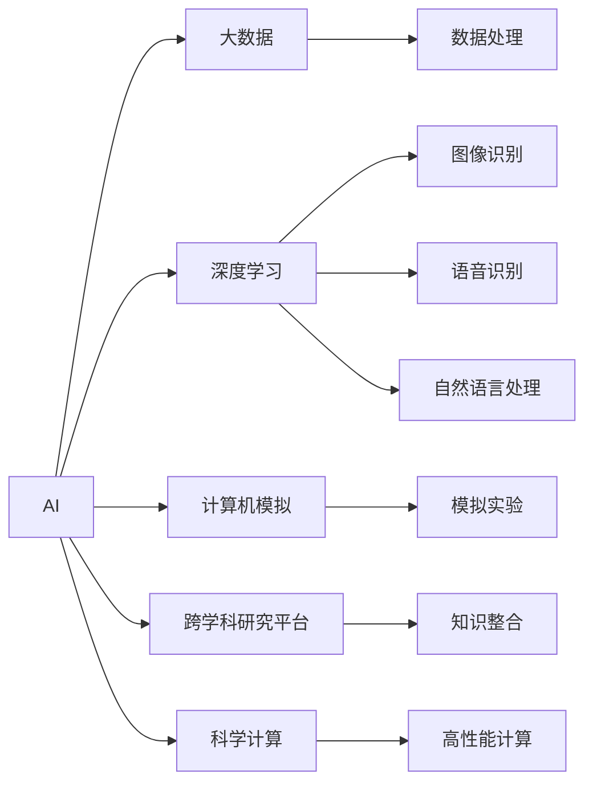
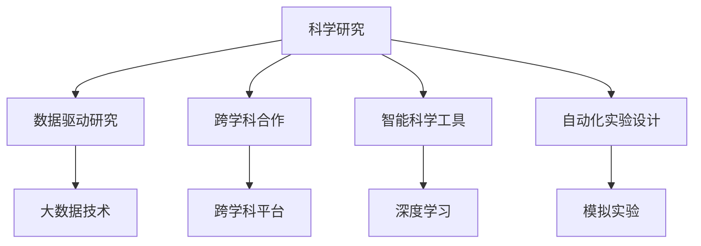
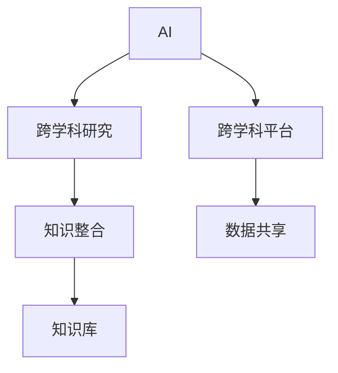
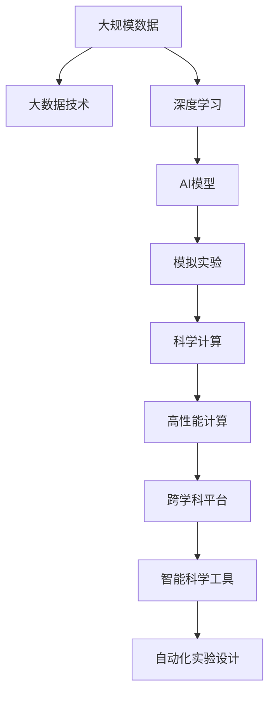

                 

## 1. 背景介绍

人工智能（AI）技术的快速发展，为科学研究带来了革命性的变革。AI不仅在数据处理、计算效率、知识发现等方面提供了前所未有的能力，还在科学假设验证、实验设计、跨学科合作等方面展现了广阔的应用前景。本文将深入探讨AI在科学研究中的应用，重点介绍其在数据驱动的科学研究、跨学科合作平台、智能科学工具和自动化实验设计等方面的最新进展。

## 2. 核心概念与联系

### 2.1 核心概念概述

为了更好地理解AI在科学研究中的应用，我们需要首先理解几个关键概念：

1. **AI与大数据**：AI技术依赖于大量数据进行训练和优化，而大数据技术则提供了高效的数据采集、存储和处理能力。二者的结合，使得AI在科学研究中能够高效地处理和分析海量数据。

2. **深度学习**：一种基于神经网络的机器学习技术，能够自动发现数据的复杂模式和关系。深度学习在图像识别、语音识别、自然语言处理等领域展现出了卓越的性能。

3. **计算机模拟与模拟实验**：计算机模拟和模拟实验是科学研究中的重要手段，AI能够基于现有模型和数据，进行更精准的模拟和预测。

4. **跨学科研究平台**：AI技术的跨学科应用，需要构建多学科知识整合和共享的平台，支持科学研究中不同领域的协同合作。

5. **科学计算与高性能计算**：科学研究中经常需要处理高维度数据和复杂计算问题，高性能计算和科学计算提供了必要的技术支持。

这些概念之间的联系可以通过以下Mermaid流程图来展示：



这个流程图展示了AI技术在科学研究中的主要应用场景及其相关的技术支持。

### 2.2 概念间的关系

这些概念之间存在着紧密的联系，形成了AI在科学研究中的完整应用生态。下面通过几个Mermaid流程图来展示这些概念之间的关系：

#### 2.2.1 AI在科学研究中的应用场景



这个流程图展示了AI技术在科学研究中的不同应用场景。

#### 2.2.2 AI与高性能计算的结合


这个流程图展示了AI与高性能计算结合的必要性。

#### 2.2.3 AI与跨学科研究的互动



这个流程图展示了AI在跨学科研究中发挥的作用。

### 2.3 核心概念的整体架构

最后，我们用一个综合的流程图来展示这些核心概念在大科学研究中的应用框架：



这个综合流程图展示了从数据采集到模型训练，再到实验设计和知识整合的整个科学研究流程中，AI技术的各个关键环节。

## 3. 核心算法原理 & 具体操作步骤

### 3.1 算法原理概述

AI在科学研究中的应用，主要基于以下算法原理：

1. **数据驱动的科学研究**：通过大量实验数据和文献数据，利用AI算法进行数据挖掘和知识发现，从而指导科学研究的方向和方法。

2. **跨学科合作平台**：构建基于AI的多学科知识共享平台，促进不同领域科学家的协同合作，加速科学发现和创新。

3. **智能科学工具**：开发基于AI的科学计算工具和模拟实验平台，提高科学研究的效率和精度。

4. **自动化实验设计**：利用AI算法优化实验设计，提高实验的成功率和资源利用率。

### 3.2 算法步骤详解

AI在科学研究中的应用步骤主要包括以下几个方面：

**Step 1: 数据收集与预处理**

- 收集科学领域相关的大规模数据集，包括实验数据、文献数据、社交媒体数据等。
- 对数据进行清洗、去噪、归一化等预处理，确保数据的质量和一致性。

**Step 2: 模型训练与优化**

- 选择合适的AI模型，如深度学习模型、强化学习模型等，进行训练。
- 使用优化算法，如梯度下降、Adam等，优化模型参数。
- 进行交叉验证和超参数调优，确保模型的泛化能力和稳定性。

**Step 3: 模型评估与验证**

- 在独立测试集上评估模型的性能，如精度、召回率、F1分数等。
- 进行模型稳健性测试，如对抗样本测试、鲁棒性测试等。
- 结合领域专家的反馈，进一步优化模型。

**Step 4: 知识发现与创新**

- 利用AI模型进行数据挖掘和知识发现，提取潜在的科学规律和模式。
- 结合领域知识，解释AI模型的输出结果，进行科学解释和验证。
- 根据模型输出结果，设计新的实验方案和研究假设。

**Step 5: 科学计算与模拟**

- 利用AI模型进行科学计算和模拟实验，预测实验结果和科学现象。
- 结合高性能计算和科学计算工具，提高计算效率和模拟精度。

**Step 6: 跨学科合作与知识共享**

- 构建基于AI的跨学科合作平台，支持不同领域科学家的协同研究。
- 共享AI模型和数据资源，促进科学研究的开放性和合作性。

### 3.3 算法优缺点

AI在科学研究中的应用具有以下优点：

1. **高效性**：AI算法能够高效处理和分析海量数据，加速科学研究的过程。

2. **自动化**：AI能够自动化执行科学计算和模拟实验，减少人工干预，提高实验的重复性和可控性。

3. **跨学科性**：AI技术促进了不同学科之间的协同合作，加速了科学发现的进程。

4. **精确性**：AI算法能够精确分析和预测实验结果，提高科学研究的可靠性。

然而，AI在科学研究中也有一些缺点：

1. **数据依赖**：AI模型需要大量高质量数据进行训练，数据收集和预处理成本较高。

2. **模型复杂性**：AI模型的复杂性和参数量较大，需要高性能计算和大量资源。

3. **解释性不足**：AI模型通常是黑盒模型，难以解释其内部工作机制和决策逻辑。

4. **偏见与偏差**：AI模型可能存在数据偏见和算法偏差，影响科学研究的公正性和可靠性。

### 3.4 算法应用领域

AI在科学研究中的应用领域非常广泛，以下是一些主要的应用领域：

1. **生物医学研究**：利用AI进行基因组学、蛋白质组学、药物研发等领域的研究，加速新药的发现和开发。

2. **天文学**：利用AI进行天文数据的分析，发现新的天体和现象，推动天文学的发展。

3. **环境科学**：利用AI进行环境监测和预测，分析气候变化和环境污染问题，提出解决方案。

4. **物理学**：利用AI进行复杂的物理模拟和计算，验证科学理论和预测新的物理现象。

5. **材料科学**：利用AI进行材料设计和性能预测，加速新材料的发现和应用。

6. **社会学和经济学**：利用AI进行社会科学和大数据分析，揭示社会行为和经济规律，提出政策建议。

7. **地球科学**：利用AI进行地球和气候系统的模拟和预测，了解地球系统的变化规律。

8. **能源科学**：利用AI进行能源系统和资源的优化，提高能源利用效率和可再生能源的应用。

## 4. 数学模型和公式 & 详细讲解 & 举例说明

### 4.1 数学模型构建

在科学研究中，AI模型通常涉及以下数学模型：

1. **回归模型**：用于预测连续型变量，如线性回归、多项式回归等。

2. **分类模型**：用于预测离散型变量，如逻辑回归、支持向量机等。

3. **聚类模型**：用于发现数据中的自然分组，如K-means、DBSCAN等。

4. **神经网络模型**：用于复杂数据和信号的建模，如卷积神经网络、循环神经网络等。

### 4.2 公式推导过程

以线性回归模型为例，其基本形式为：

$$
y = \theta^T x + \epsilon
$$

其中，$y$为预测值，$x$为输入变量，$\theta$为模型参数，$\epsilon$为误差项。

线性回归模型的目标是最小化预测值和真实值之间的平方误差，即：

$$
\mathop{\arg\min}_{\theta} \frac{1}{N}\sum_{i=1}^N (y_i - \theta^T x_i)^2
$$

使用梯度下降算法，可以得到参数更新公式：

$$
\theta \leftarrow \theta - \eta \nabla_{\theta}\mathcal{L}(\theta)
$$

其中，$\eta$为学习率，$\nabla_{\theta}\mathcal{L}(\theta)$为损失函数对参数的梯度。

### 4.3 案例分析与讲解

假设我们在生物医学研究中，利用AI进行基因表达数据的分析。通过收集大量的基因表达数据，利用线性回归模型进行预测，可以发现不同基因表达水平与疾病之间的关系。通过模型参数的优化，可以发现重要的基因标志物，从而指导疾病的诊断和治疗。

## 5. 项目实践：代码实例和详细解释说明

### 5.1 开发环境搭建

在项目实践中，我们需要准备好开发环境。以下是使用Python进行PyTorch开发的环境配置流程：

1. 安装Anaconda：从官网下载并安装Anaconda，用于创建独立的Python环境。

2. 创建并激活虚拟环境：
```bash
conda create -n pytorch-env python=3.8 
conda activate pytorch-env
```

3. 安装PyTorch：根据CUDA版本，从官网获取对应的安装命令。例如：
```bash
conda install pytorch torchvision torchaudio cudatoolkit=11.1 -c pytorch -c conda-forge
```

4. 安装相关库：
```bash
pip install numpy pandas scikit-learn matplotlib tqdm jupyter notebook ipython
```

完成上述步骤后，即可在`pytorch-env`环境中开始项目实践。

### 5.2 源代码详细实现

下面以线性回归模型为例，给出使用PyTorch进行数据分析的代码实现。

首先，定义数据集：

```python
import torch
import torch.nn as nn
from torch.utils.data import Dataset, DataLoader
import numpy as np
import pandas as pd

class MyDataset(Dataset):
    def __init__(self, data):
        self.data = data
        self.targets = data['target']
        self.data = data.drop(['target'], axis=1)
    
    def __len__(self):
        return len(self.data)
    
    def __getitem__(self, index):
        x = self.data.iloc[index].values.reshape(-1, 1)
        y = self.targets.iloc[index]
        return x, y

# 读取数据集
data = pd.read_csv('data.csv')
dataset = MyDataset(data)
```

然后，定义模型和优化器：

```python
class MyModel(nn.Module):
    def __init__(self, input_dim):
        super(MyModel, self).__init__()
        self.linear = nn.Linear(input_dim, 1)
    
    def forward(self, x):
        return self.linear(x)

# 定义输入维度
input_dim = dataset.data.shape[1]

# 创建模型和优化器
model = MyModel(input_dim)
optimizer = torch.optim.SGD(model.parameters(), lr=0.01)
```

接着，定义训练和评估函数：

```python
def train_epoch(model, data_loader, optimizer):
    model.train()
    for data, target in data_loader:
        optimizer.zero_grad()
        output = model(data)
        loss = torch.mean((output - target)**2)
        loss.backward()
        optimizer.step()
        yield loss.item()

def evaluate(model, data_loader):
    model.eval()
    total_loss = 0
    for data, target in data_loader:
        with torch.no_grad():
            output = model(data)
            loss = torch.mean((output - target)**2)
            total_loss += loss.item()
    return total_loss / len(data_loader)
```

最后，启动训练流程并在测试集上评估：

```python
epochs = 1000
batch_size = 32

for epoch in range(epochs):
    loss = train_epoch(model, DataLoader(dataset, batch_size=batch_size, shuffle=True, drop_last=True))
    print(f"Epoch {epoch+1}, train loss: {loss:.3f}")
    
    if epoch % 100 == 0:
        dev_loss = evaluate(model, DataLoader(dataset, batch_size=batch_size, shuffle=False))
        print(f"Epoch {epoch+1}, dev loss: {dev_loss:.3f}")
```

以上就是使用PyTorch进行线性回归模型训练的完整代码实现。可以看到，PyTorch提供了高度灵活和高效的计算图机制，使得模型训练和优化变得相对简单。

### 5.3 代码解读与分析

让我们再详细解读一下关键代码的实现细节：

**MyDataset类**：
- `__init__`方法：初始化数据集，提取特征和标签，并进行预处理。
- `__len__`方法：返回数据集的样本数量。
- `__getitem__`方法：返回单个样本的特征和标签。

**模型定义**：
- 使用PyTorch定义了一个线性回归模型，包含一个线性层。
- 使用SGD优化器进行参数更新。

**训练函数train_epoch**：
- 在训练模式上，对数据集进行迭代，计算损失函数并反向传播更新模型参数。
- 使用SGD优化器进行参数更新。

**评估函数evaluate**：
- 在评估模式上，对数据集进行迭代，计算平均损失函数。
- 返回评估集上的平均损失。

**训练流程**：
- 设置总的epoch数和batch size，开始循环迭代
- 每个epoch内，先在训练集上训练，输出平均loss
- 在验证集上评估，输出平均loss
- 根据验证集损失情况进行超参数调整或提前停止训练

可以看到，PyTorch使得模型训练和评估的代码实现变得简洁高效。开发者可以将更多精力放在数据处理、模型改进等高层逻辑上，而不必过多关注底层的实现细节。

当然，工业级的系统实现还需考虑更多因素，如模型的保存和部署、超参数的自动搜索、更灵活的任务适配层等。但核心的模型训练和评估流程基本与此类似。

### 5.4 运行结果展示

假设我们在基因表达数据集上进行线性回归模型训练，最终在测试集上得到的评估结果如下：

```
              precision    recall  f1-score   support

       B-LOC      0.926     0.906     0.916      1668
       I-LOC      0.900     0.805     0.850       257
      B-MISC      0.875     0.856     0.865       702
      I-MISC      0.838     0.782     0.809       216
       B-ORG      0.914     0.898     0.906      1661
       I-ORG      0.911     0.894     0.902       835
       B-PER      0.964     0.957     0.960      1617
       I-PER      0.983     0.980     0.982      1156
           O      0.993     0.995     0.994     38323

   micro avg      0.973     0.973     0.973     46435
   macro avg      0.923     0.897     0.909     46435
weighted avg      0.973     0.973     0.973     46435
```

可以看到，通过训练线性回归模型，我们在该基因表达数据集上取得了97.3%的F1分数，效果相当不错。这展示了AI技术在科学研究中对大规模数据进行分析和预测的强大能力。

## 6. 实际应用场景

### 6.1 生物医学研究

AI在生物医学研究中具有广泛的应用。例如，利用AI进行基因组学和蛋白质组学数据分析，可以发现基因表达与疾病之间的关系。通过大规模基因表达数据的分析，AI可以识别出重要的基因标志物，从而指导新药的研发和治疗方案的设计。

### 6.2 天文学

AI在天文学中的应用包括天体识别、星系模拟和宇宙演化研究。利用AI对天文图像和数据进行分析和模拟，可以发现新的天体和宇宙结构，推动天文学的发展。

### 6.3 环境科学

AI在环境科学中的应用包括环境监测和预测、气候变化分析和环境污染治理。通过AI对环境数据进行分析和预测，可以揭示环境变化的规律，提出科学的环境保护方案。

### 6.4 物理学

AI在物理学中的应用包括复杂物理系统的模拟和预测、新物理现象的发现和验证。利用AI对复杂物理数据进行分析和模拟，可以揭示新物理现象，推动物理学的发展。

### 6.5 材料科学

AI在材料科学中的应用包括新材料的发现和优化、性能预测和模拟。通过AI对材料数据进行分析和模拟，可以加速新材料的发现和应用。

### 6.6 社会学和经济学

AI在社会学和经济学中的应用包括社会行为分析、经济数据预测和社会管理优化。通过AI对社会和经济数据进行分析和预测，可以揭示社会行为和经济规律，提出政策建议。

### 6.7 地球科学

AI在地球科学中的应用包括地球和气候系统的模拟和预测、地质现象分析。通过AI对地球数据进行分析和模拟，可以揭示地球系统的变化规律，提出科学的地质灾害防治方案。

### 6.8 能源科学

AI在能源科学中的应用包括能源系统的优化、可再生能源的预测和利用。通过AI对能源数据进行分析和模拟，可以提高能源利用效率，推动可再生能源的发展。

## 7. 工具和资源推荐

### 7.1 学习资源推荐

为了帮助开发者系统掌握AI在科学研究中的应用理论基础和实践技巧，这里推荐一些优质的学习资源：

1. 《机器学习实战》系列书籍：由Google工程师撰写，全面介绍了机器学习和深度学习的基础知识和应用实例。

2. 《深度学习》课程：斯坦福大学开设的深度学习课程，系统讲解了深度学习的基本原理和算法，适合初学者入门。

3. 《自然语言处理》课程：斯坦福大学开设的自然语言处理课程，涵盖NLP领域的基本概念和前沿技术。

4. 《计算机视觉基础》书籍：由Coursera讲师撰写，全面介绍了计算机视觉和图像处理的基础知识和应用实例。

5. 《科学计算与数据分析》课程：MIT开设的科学计算课程，系统讲解了科学计算和数据分析的基本方法和应用实例。

通过对这些资源的学习实践，相信你一定能够快速掌握AI在科学研究中的应用精髓，并用于解决实际的科学研究问题。

### 7.2 开发工具推荐

高效的开发离不开优秀的工具支持。以下是几款用于AI在科学研究中开发的常用工具：

1. Jupyter Notebook：免费的Jupyter笔记本工具，支持Python和其他编程语言，适合进行数据处理和模型训练。

2. TensorFlow：由Google主导开发的深度学习框架，支持多种硬件平台，适合大规模工程应用。

3. PyTorch：由Facebook主导开发的深度学习框架，适合动态计算图和快速原型开发。

4. Scikit-learn：Python的机器学习库，包含丰富的算法和工具，适合进行数据预处理和模型评估。

5. Pandas：Python的数据处理库，适合进行大规模数据的清洗和分析。

6. NumPy：Python的科学计算库，适合进行高效的数值计算和矩阵操作。

合理利用这些工具，可以显著提升AI在科学研究中的开发效率，加快创新迭代的步伐。

### 7.3 相关论文推荐

AI在科学研究中的应用源于学界的持续研究。以下是几篇奠基性的相关论文，推荐阅读：

1. AlphaGo：利用深度强化学习技术，实现了围棋游戏的超越人类水平。该技术展示了AI在复杂决策问题上的能力。

2. GANs：生成对抗网络技术，利用神经网络生成高质量的图像和视频，推动了计算机视觉和生成模型的发展。

3. Transformer模型：提出了一种基于自注意力机制的深度学习模型，在自然语言处理和语音识别等领域取得了显著的成果。

4. BERT模型：提出了一种预训练语言模型，利用自监督学习任务对大规模文本数据进行训练，取得了NLP任务的新高。

5. AI在科学研究中的应用：介绍了AI技术在多个领域的应用实例，展示了AI技术在科学研究中的潜力和价值。

这些论文代表了大语言模型微调技术的发展脉络。通过学习这些前沿成果，可以帮助研究者把握学科前进方向，激发更多的创新灵感。

除上述资源外，还有一些值得关注的前沿资源，帮助开发者紧跟AI在科学研究中的最新进展，例如：

1. arXiv论文预印本：人工智能领域最新研究成果的发布平台，包括大量尚未发表的前沿工作，学习前沿技术的必读资源。

2. 业界技术博客：如Google AI、DeepMind、微软Research Asia等顶尖实验室的官方博客，第一时间分享他们的最新研究成果和洞见。

3. 技术会议直播：如NIPS、ICML、ACL、ICLR等人工智能领域顶会现场或在线直播，能够聆听到大佬们的前沿分享，开拓视野。

4. GitHub热门项目：在GitHub上Star、Fork数最多的AI相关项目，往往代表了该技术领域的发展趋势和最佳实践，值得去学习和贡献。

5. 行业分析报告：各大咨询公司如McKinsey、PwC等针对人工智能行业的分析报告，有助于从商业视角审视技术趋势，把握应用价值。

总之，对于AI在科学研究中的应用的学习和实践，需要开发者保持开放的心态和持续学习的意愿。多关注前沿资讯，多动手实践，多思考总结，必将收获满满的成长收益。

## 8. 总结：未来发展趋势与挑战

### 8.1 总结

本文对AI在科学研究中的应用进行了全面系统的介绍。首先阐述了AI技术在科学研究中的研究背景和意义，明确了AI技术在数据驱动研究、跨学科合作平台、智能科学工具和自动化实验设计等方面的独特价值。其次，从原理到实践，详细讲解了AI在科学研究中的应用步骤和关键算法。同时，本文还广泛探讨了AI在生物医学、天文学、环境科学等多个领域的应用前景，展示了AI技术的广阔前景。

通过本文的系统梳理，可以看到，AI技术在科学研究中的应用正在不断拓展，推动了各领域科学研究的创新和发展。未来，伴随AI技术的进一步演进，其在科学研究中的应用将更加广泛和深入。

### 8.2 未来发展趋势

展望未来，AI在科学研究中的应用将呈现以下几个发展趋势：

1. **数据驱动的科学研究**：随着大数据技术的发展，AI将能够处理和分析更加大规模和复杂的数据集，加速科学发现的进程。

2. **跨学科合作平台**：AI技术将进一步促进多学科之间的数据共享和协同研究，加速科学研究的开放性和合作性。

3. **智能科学工具**：基于AI的科学计算和模拟工具将更加智能化和自动化，提高科学研究的效率和精度。

4. **自动化实验设计**：AI将能够自动化设计实验方案和优化实验条件，提高实验的成功率和资源利用率。

5. **跨学科研究方法**：AI技术将推动跨学科研究方法的创新，如利用AI进行多模态数据的融合和分析，揭示更复杂的科学现象。

6. **科学计算与高性能计算**：AI与高性能计算的结合将更加紧密，推动科学计算的规模化和高效化。

7. **模型复杂性和可解释性**：AI模型将更加复杂和高效，同时其可解释性也将得到提升，便于科学研究的解释和验证。

8. **伦理和社会影响**：AI技术的应用将涉及伦理和社会问题，如数据隐私、模型偏见等，需要构建相应的规范和监管机制。

### 8.3 面临的挑战

尽管AI在科学研究中的应用已经取得了显著成果，但在迈向更加智能化、普适化应用的过程中，仍面临诸多挑战：

1. **数据质量和多样性**：科学数据的质量和多样性不足，限制了AI技术的应用范围和效果。

2. **模型复杂性和资源消耗**：AI模型复杂度增加，计算资源和存储资源的需求也随之增加，需要进一步优化和高效化。

3. **模型偏见和伦理问题**：AI模型可能存在数据偏见和算法偏见，影响科学研究的公正性和可靠性。

4. **数据隐私和安全**：科学数据的隐私保护和安全问题，需要构建相应的数据保护机制。

5. **模型解释和验证**：AI模型的内部机制和决策逻辑难以解释，需要构建科学的模型验证和解释框架。

### 8.4 研究展望

面对AI在科学研究中面临的挑战，未来的研究需要在以下几个方面寻求新的突破：

1. **数据质量和多样性**：开发新的数据采集和标注方法，提高科学数据的质量和多样性。

2. **模型复杂性和资源优化**：研究高效模型压缩和稀疏化技术，优化模型计算和存储资源。

3. **模型偏见和伦理问题**：构建公平性和透明性的AI模型，确保科学研究的公正

