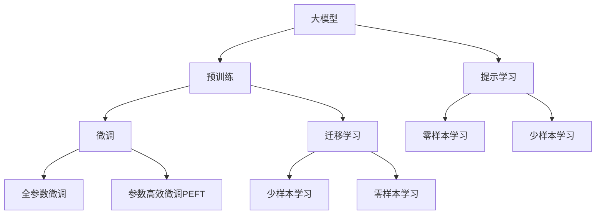

                 

# AI大模型创业：如何应对未来挑战？

## 1. 背景介绍

随着人工智能技术的快速发展和应用落地，AI大模型的创业潜力不断被挖掘和验证。然而，这些模型在商业化应用过程中，也面临着众多挑战，包括技术、市场、运营、伦理等方面的问题。本文将详细探讨如何应对这些挑战，助力AI大模型创业公司更好地应对未来发展道路上的各种问题。

## 2. 核心概念与联系

### 2.1 核心概念概述

在大模型创业领域，涉及的关键概念包括：

- **大模型**：基于深度学习技术，通过预训练学习到复杂语言表示的模型，如BERT、GPT等。
- **微调(Fine-tuning)**：在大模型基础上，使用特定任务的数据进行有监督学习，优化模型以适应新任务。
- **迁移学习(Transfer Learning)**：将大模型在某一领域的知识迁移到另一个相关领域，提高模型的泛化能力。
- **参数高效微调(Parameter-Efficient Fine-tuning, PEFT)**：仅更新模型的一部分参数，以提高微调效率和模型泛化能力。
- **零样本学习(Zero-shot Learning)**：模型无需经过微调，仅通过任务描述即可执行新任务。
- **少样本学习(Few-shot Learning)**：模型在少量标注样本的情况下，学习新任务的能力。

这些概念通过以下Mermaid流程图展示了相互之间的联系：



### 2.2 核心概念间的联系

这些核心概念共同构成了AI大模型的学习和应用框架，帮助模型更好地适应各种任务，并在不同领域中发挥其潜力。

- **预训练**：在大规模无标签数据上训练大模型，学习通用的语言表示。
- **微调**：通过特定任务的数据，优化模型以适应新任务，提高模型性能。
- **迁移学习**：利用大模型的通用能力，迁移到特定领域，提升模型在特定任务上的表现。
- **参数高效微调**：在保留预训练权重的情况下，只更新部分参数，提高微调效率。
- **提示学习**：通过输入格式的调整，使模型能够适应少样本和零样本学习，减少对标注数据的依赖。
- **少样本学习和零样本学习**：在大模型的预训练和微调基础上，进一步提升模型在数据量少的情况下的学习能力。

## 3. 核心算法原理 & 具体操作步骤

### 3.1 算法原理概述

AI大模型的创业公司，在构建和应用大模型时，需要解决核心算法原理和具体操作步骤。核心算法原理通常基于监督学习、自监督学习、迁移学习等范式，而具体操作步骤则包括模型搭建、数据准备、模型训练、模型评估和部署等环节。

### 3.2 算法步骤详解

1. **模型选择与搭建**：根据具体应用场景，选择合适的预训练模型，并搭建适合的任务适配层。
2. **数据准备**：收集并处理适合任务的标注数据，分为训练集、验证集和测试集。
3. **超参数设置**：选择合适的优化算法、学习率、批大小等超参数。
4. **模型训练**：使用训练集数据，通过梯度下降等优化算法，不断更新模型参数。
5. **模型评估**：在验证集上评估模型性能，选择合适的模型进行微调。
6. **模型部署**：将微调后的模型部署到实际应用环境中，进行实时推理和业务处理。

### 3.3 算法优缺点

AI大模型具有以下优点：

- **通用性强**：预训练模型可在多个任务上表现优异，通过微调进一步提升。
- **泛化能力强**：大模型能够学习到丰富的语言知识，在数据量较少的情况下仍能保持较高性能。
- **迁移能力强**：大模型通过迁移学习，可以轻松适应新领域和新任务。

然而，大模型也存在一些缺点：

- **资源消耗大**：大模型参数量庞大，需要高性能计算资源进行训练和推理。
- **依赖标注数据**：微调和少样本学习需要标注数据，标注成本较高。
- **可解释性差**：大模型通常被视为"黑盒"模型，难以解释其决策过程。
- **偏见和伦理问题**：大模型可能会学习到数据中的偏见，对某些群体产生歧视性。

### 3.4 算法应用领域

AI大模型已经在多个领域得到了应用，包括但不限于：

- **自然语言处理(NLP)**：文本分类、命名实体识别、问答系统、机器翻译等。
- **计算机视觉(CV)**：图像分类、目标检测、人脸识别等。
- **语音识别(SR)**：语音识别、情感分析、语义理解等。
- **智能推荐**：个性化推荐、广告投放等。
- **智能客服**：自动问答、自动回复等。

## 4. 数学模型和公式 & 详细讲解 & 举例说明

### 4.1 数学模型构建

基于监督学习的大模型微调，数学模型可以表示为：

$$
\theta^* = \mathop{\arg\min}_{\theta} \mathcal{L}(M_{\theta},D)
$$

其中，$M_{\theta}$ 为预训练模型，$D$ 为标注数据集，$\theta$ 为待优化的模型参数，$\mathcal{L}$ 为损失函数。

### 4.2 公式推导过程

以二分类任务为例，交叉熵损失函数为：

$$
\ell(M_{\theta}(x),y) = -[y\log \hat{y} + (1-y)\log(1-\hat{y})]
$$

经验风险为：

$$
\mathcal{L}(\theta) = \frac{1}{N}\sum_{i=1}^N \ell(M_{\theta}(x_i),y_i)
$$

梯度下降优化公式为：

$$
\theta \leftarrow \theta - \eta \nabla_{\theta}\mathcal{L}(\theta)
$$

其中，$\eta$ 为学习率，$\nabla_{\theta}\mathcal{L}(\theta)$ 为损失函数对参数 $\theta$ 的梯度。

### 4.3 案例分析与讲解

在实际应用中，基于监督学习的微调方法已经在多个任务上取得了成功。例如，在文本分类任务中，可以使用预训练的BERT模型作为初始模型，然后在特定任务的数据集上进行微调。

## 5. 项目实践：代码实例和详细解释说明

### 5.1 开发环境搭建

在搭建开发环境时，需要安装相关依赖库，如PyTorch、TensorFlow等深度学习框架，以及相关的工具包。

### 5.2 源代码详细实现

以下是一个基于PyTorch的BERT模型微调示例代码：

```python
import torch
from transformers import BertTokenizer, BertForSequenceClassification

# 初始化模型和分词器
model = BertForSequenceClassification.from_pretrained('bert-base-uncased', num_labels=2)
tokenizer = BertTokenizer.from_pretrained('bert-base-uncased')

# 准备数据
train_data = ...
val_data = ...
test_data = ...

# 设置超参数
batch_size = 16
learning_rate = 2e-5
epochs = 3

# 训练模型
device = torch.device('cuda' if torch.cuda.is_available() else 'cpu')
model.to(device)

for epoch in range(epochs):
    model.train()
    for batch in train_data:
        input_ids = batch.input_ids.to(device)
        attention_mask = batch.attention_mask.to(device)
        labels = batch.labels.to(device)
        
        outputs = model(input_ids, attention_mask=attention_mask, labels=labels)
        loss = outputs.loss
        loss.backward()
        optimizer.step()
        
    model.eval()
    for batch in val_data:
        input_ids = batch.input_ids.to(device)
        attention_mask = batch.attention_mask.to(device)
        labels = batch.labels.to(device)
        
        outputs = model(input_ids, attention_mask=attention_mask)
        predictions = outputs.logits.argmax(dim=1)
        accuracy = (predictions == labels).sum().item() / len(labels)
        print(f'Epoch {epoch+1}, validation accuracy: {accuracy:.2f}')
        
# 测试模型
model.eval()
for batch in test_data:
    input_ids = batch.input_ids.to(device)
    attention_mask = batch.attention_mask.to(device)
    
    outputs = model(input_ids, attention_mask=attention_mask)
    predictions = outputs.logits.argmax(dim=1)
    accuracy = (predictions == labels).sum().item() / len(labels)
    print(f'Test accuracy: {accuracy:.2f}')
```

### 5.3 代码解读与分析

在上述代码中，首先初始化预训练的BERT模型和分词器，然后准备训练、验证和测试数据。设置超参数，包括批次大小、学习率和训练轮数。在每个epoch中，先进行模型训练，然后评估验证集上的准确率。最后，在测试集上评估模型性能。

## 6. 实际应用场景

### 6.1 智能客服系统

智能客服系统可以通过微调BERT模型，实现自动问答、自动回复等功能，提高客户服务效率。

### 6.2 金融舆情监测

在金融领域，可以使用微调BERT模型进行舆情监测，及时识别和应对金融市场中的负面信息。

### 6.3 个性化推荐系统

推荐系统可以通过微调BERT模型，提升推荐算法的效果，更好地匹配用户需求。

### 6.4 未来应用展望

未来，AI大模型的应用将更加广泛，涉及更多领域和场景。同时，随着技术的发展，大模型将朝着更加通用、高效、可解释和安全的方向发展。

## 7. 工具和资源推荐

### 7.1 学习资源推荐

- 《Transformer from Zero to Hero》：介绍Transformer模型和微调技术。
- 《Deep Learning for Natural Language Processing》：NLP领域的深度学习入门教材。
- 《Neural Network and Deep Learning》：深度学习领域经典教材。

### 7.2 开发工具推荐

- PyTorch：深度学习框架，支持动态计算图。
- TensorFlow：深度学习框架，支持静态计算图。
- Transformers库：提供了预训练模型的封装和微调接口。

### 7.3 相关论文推荐

- Attention is All You Need：Transformer模型的原论文。
- BERT: Pre-training of Deep Bidirectional Transformers for Language Understanding：BERT模型的论文。
- Parameter-Efficient Transfer Learning for NLP：介绍参数高效微调方法。

## 8. 总结：未来发展趋势与挑战

### 8.1 研究成果总结

AI大模型的创业公司在推动NLP技术的发展和落地应用方面，取得了显著的成果。然而，仍需面对技术、市场、伦理等方面的挑战。

### 8.2 未来发展趋势

未来，AI大模型将朝着更加通用、高效、可解释和安全的方向发展，应用领域也将更加广泛。

### 8.3 面临的挑战

- **技术挑战**：模型的泛化能力、计算资源消耗、模型优化等。
- **市场挑战**：用户需求多样、数据获取难度大、竞争激烈等。
- **伦理挑战**：模型偏见、数据隐私、安全性等。

### 8.4 研究展望

未来，AI大模型创业公司需要在技术、市场和伦理等方面进行持续创新和优化，应对各种挑战，推动NLP技术的进一步发展。

## 9. 附录：常见问题与解答

**Q1: AI大模型创业公司如何选择合适的预训练模型？**

A: 需要根据具体应用场景和任务需求，选择合适的预训练模型。通常，Bert、GPT等大模型在NLP领域表现优异。

**Q2: AI大模型创业公司如何优化模型性能？**

A: 可以通过微调、参数高效微调、提示学习等方法，提高模型在特定任务上的表现。同时，通过数据增强、正则化等技术，避免过拟合。

**Q3: AI大模型创业公司如何处理模型偏见问题？**

A: 在数据采集和模型训练过程中，需要对数据进行清洗和预处理，避免引入偏见。同时，在模型评估和部署阶段，需要对模型进行公平性和透明性的分析。

**Q4: AI大模型创业公司如何提高模型可解释性？**

A: 可以通过增加模型的透明度，使用可解释的模型结构，添加模型解释工具等方式，提高模型的可解释性。

**Q5: AI大模型创业公司如何应对计算资源不足问题？**

A: 可以通过模型压缩、量化加速、模型并行等技术，减少计算资源的消耗，提高模型的推理速度和效率。

---

作者：禅与计算机程序设计艺术 / Zen and the Art of Computer Programming

