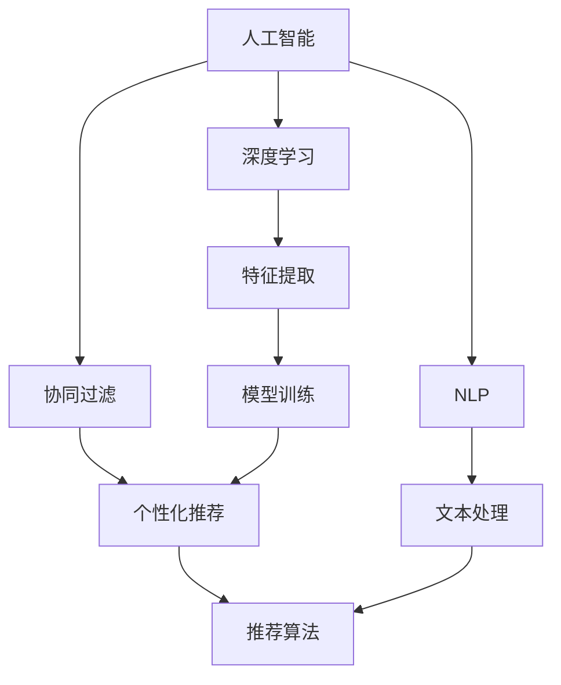
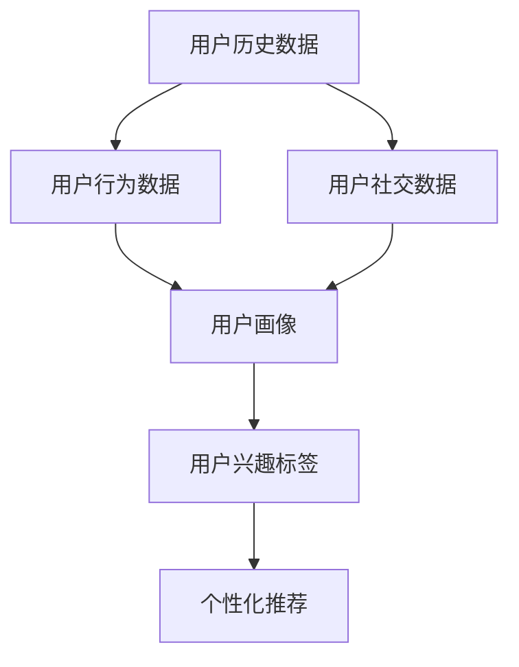
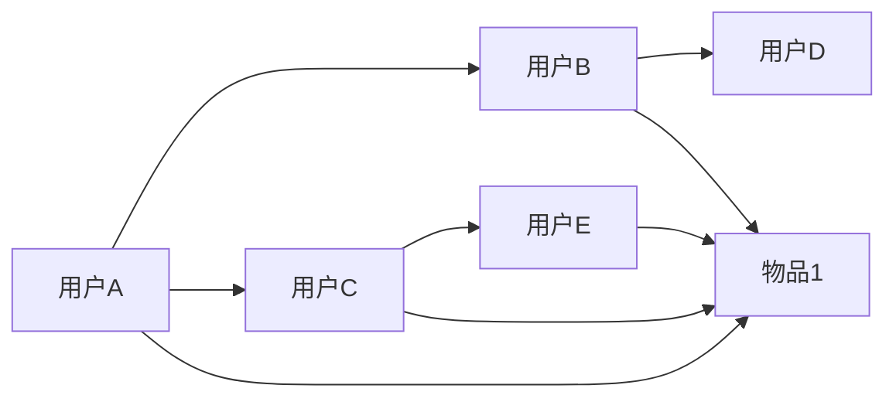
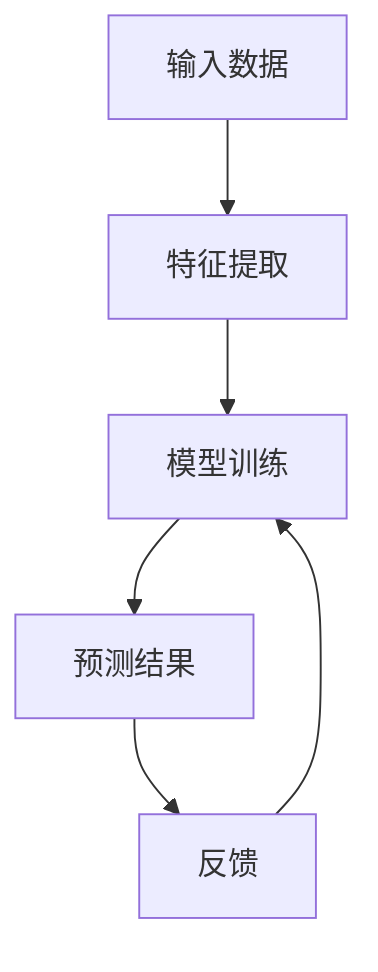
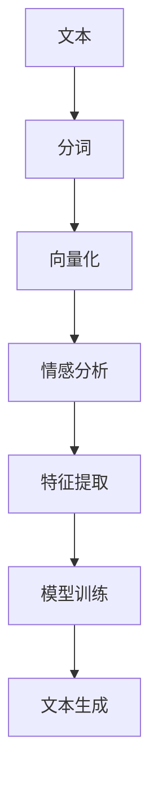
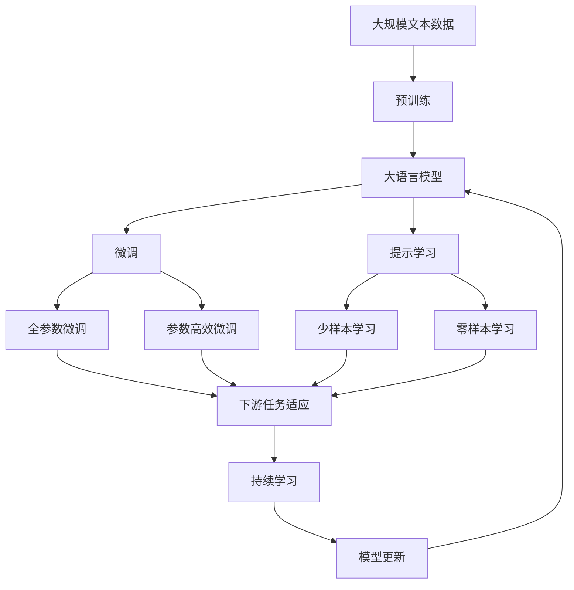

                 

# AI技术与用户需求的匹配

> 关键词：人工智能,用户需求匹配,个性化推荐系统,深度学习,自然语言处理,NLP,用户画像,协同过滤

## 1. 背景介绍

### 1.1 问题由来

随着人工智能技术的迅猛发展，其在各个领域的应用越来越广泛。然而，如何准确理解和匹配用户需求，一直是人工智能面临的重大挑战之一。例如，在电商领域，如何根据用户的历史购买记录和浏览行为，推荐其可能感兴趣的商品？在内容分发平台，如何为用户推荐个性化文章或视频？这些问题都需要通过深入理解和匹配用户需求来解决。

### 1.2 问题核心关键点

用户需求匹配的核心在于理解用户的兴趣、偏好和行为模式，从而精准地推荐其感兴趣的内容或产品。其关键点包括：

1. **用户画像**：通过用户的历史数据、行为数据、社交数据等构建用户画像，以获得用户的基本特征和兴趣偏好。
2. **协同过滤**：根据用户之间的相似性，推荐用户可能感兴趣的内容或产品。
3. **深度学习**：利用深度学习模型，如神经网络、卷积神经网络(CNN)、循环神经网络(RNN)等，从海量数据中提取高维度的用户特征。
4. **自然语言处理(NLP)**：利用NLP技术，处理和分析用户的文字评论、评分等文本数据，以获取用户的情感和态度。

### 1.3 问题研究意义

用户需求匹配技术的突破，对于提升用户体验、提高个性化推荐系统的精准度、优化用户行为具有重要意义。其研究意义如下：

1. **提高用户体验**：通过精准推荐，满足用户个性化需求，提升用户满意度和粘性。
2. **优化资源分配**：帮助商家优化资源分配，提高广告和推广的转化率。
3. **提升内容价值**：通过精准推荐，提升内容的使用率和价值，为平台带来更多收益。
4. **用户行为分析**：通过分析用户行为，发现用户兴趣和行为规律，为业务决策提供数据支持。

## 2. 核心概念与联系

### 2.1 核心概念概述

为更好地理解AI技术与用户需求匹配，本节将介绍几个密切相关的核心概念：

- **人工智能**：利用计算机科学和数学方法，使计算机系统具备某些类似于人类智能的能力，如感知、学习、推理等。
- **用户需求匹配**：通过理解用户的行为、兴趣和偏好，为其推荐合适的产品、内容或服务。
- **个性化推荐系统**：根据用户的历史行为和兴趣，为其推荐个性化内容或产品，提升用户体验。
- **深度学习**：利用神经网络等深度学习模型，从海量数据中提取高维度特征，用于分类、预测等任务。
- **协同过滤**：根据用户之间的相似性，推荐用户可能感兴趣的内容或产品，分为基于用户的协同过滤和基于物品的协同过滤。
- **自然语言处理(NLP)**：利用计算机处理和分析人类语言的技术，包括文本分析、情感分析、文本生成等。

这些核心概念之间的逻辑关系可以通过以下Mermaid流程图来展示：



这个流程图展示了人工智能技术与用户需求匹配的各个核心概念及其之间的关系：

1. 深度学习模型在人工智能中扮演重要角色，用于特征提取和模型训练。
2. 协同过滤和NLP技术是深度学习模型的重要补充，用于构建用户画像和文本处理。
3. 个性化推荐系统是AI技术与用户需求匹配的核心，将用户画像和特征提取结果用于推荐。

### 2.2 概念间的关系

这些核心概念之间存在着紧密的联系，形成了AI技术与用户需求匹配的完整生态系统。下面我们通过几个Mermaid流程图来展示这些概念之间的关系。

#### 2.2.1 用户画像的构建过程



这个流程图展示了构建用户画像的过程：
1. 收集用户的历史数据、行为数据和社交数据。
2. 通过数据融合，构建用户画像，包括用户的兴趣标签、偏好等。
3. 利用用户画像进行个性化推荐，提升用户体验。

#### 2.2.2 协同过滤的基本原理



这个流程图展示了基于用户的协同过滤过程：
1. 收集用户A、B、C、D、E的行为数据。
2. 计算用户A、B、C、D、E之间的相似性。
3. 基于用户A的行为数据，推荐用户A可能感兴趣的物品F。

#### 2.2.3 深度学习模型的训练过程



这个流程图展示了深度学习模型的训练过程：
1. 输入数据，通过特征提取获取高维度特征。
2. 利用模型训练，得到预测结果。
3. 通过反馈，更新模型参数。

#### 2.2.4 自然语言处理的文本分析过程



这个流程图展示了自然语言处理的文本分析过程：
1. 输入文本，进行分词和向量化处理。
2. 通过情感分析获取情感信息。
3. 利用特征提取获取高维度特征。
4. 通过模型训练，得到文本生成结果。

### 2.3 核心概念的整体架构

最后，我们用一个综合的流程图来展示这些核心概念在大语言模型微调过程中的整体架构：



这个综合流程图展示了从预训练到微调，再到持续学习的完整过程。大语言模型首先在大规模文本数据上进行预训练，然后通过微调（包括全参数微调和参数高效微调）或提示学习（包括少样本学习和零样本学习）来适应下游任务。最后，通过持续学习技术，模型可以不断更新和适应新的任务和数据。

## 3. 核心算法原理 & 具体操作步骤
### 3.1 算法原理概述

AI技术与用户需求匹配，本质上是一个用户画像构建、特征提取和推荐算法优化过程。其核心思想是：利用人工智能技术，对用户的各种行为数据进行深度学习建模，构建用户画像，提取高维度特征，并结合协同过滤、自然语言处理等技术，优化推荐算法，精准匹配用户需求。

形式化地，假设用户画像为 $P_{u}$，用户行为数据为 $D_{u}$，物品特征为 $F_{i}$，推荐算法为 $R$。目标函数为：

$$
\maximize_{P_{u},D_{u},F_{i},R} \sum_{u,i} P_{u}(D_{u}, F_{i}) \times R(D_{u}, F_{i})
$$

其中，$P_{u}$ 表示用户画像，$D_{u}$ 表示用户行为数据，$F_{i}$ 表示物品特征，$R$ 表示推荐算法。目标函数通过最大化用户对推荐结果的满意度来优化推荐系统。

### 3.2 算法步骤详解

AI技术与用户需求匹配的一般步骤包括：

1. **数据预处理**：清洗和处理原始数据，提取有用的特征。
2. **用户画像构建**：利用深度学习模型，从用户历史数据和行为数据中提取用户特征。
3. **协同过滤**：根据用户画像和物品特征，计算用户与物品之间的相似性。
4. **自然语言处理**：利用NLP技术，分析用户评论、评分等文本数据，提取用户情感和态度。
5. **模型训练**：利用推荐算法，训练优化模型，提升推荐精度。
6. **持续学习**：不断更新模型参数，提升模型适应新任务的能力。

具体而言，我们以个性化推荐系统为例，详细讲解各个步骤：

#### 3.2.1 数据预处理

数据预处理是推荐系统的第一步，主要包括以下几个步骤：

- **数据清洗**：去除噪声和异常值，确保数据质量。
- **特征提取**：将原始数据转换为可用于模型的特征。
- **归一化**：将特征值归一化到 [0, 1] 区间，便于模型训练。

#### 3.2.2 用户画像构建

用户画像构建是推荐系统的核心，主要包括以下几个步骤：

- **特征选择**：选择对推荐效果有显著影响的特征。
- **深度学习建模**：利用深度学习模型，从用户历史数据和行为数据中提取用户特征。
- **用户画像表示**：将用户特征表示为用户画像。

#### 3.2.3 协同过滤

协同过滤是推荐系统的主要推荐策略，主要包括以下几个步骤：

- **计算相似性**：计算用户之间的相似性，或物品之间的相似性。
- **推荐物品**：根据相似性，推荐用户可能感兴趣的物品。
- **评估效果**：评估推荐物品的用户满意度。

#### 3.2.4 自然语言处理

自然语言处理是推荐系统的辅助技术，主要包括以下几个步骤：

- **文本预处理**：清洗和预处理文本数据。
- **情感分析**：分析用户评论、评分等文本数据，提取用户情感和态度。
- **特征提取**：利用NLP技术，提取文本特征。

#### 3.2.5 模型训练

模型训练是推荐系统的优化步骤，主要包括以下几个步骤：

- **选择模型**：选择适合推荐系统的模型。
- **训练模型**：利用用户画像和物品特征，训练优化推荐算法。
- **评估效果**：评估推荐算法的效果。

#### 3.2.6 持续学习

持续学习是推荐系统的升级步骤，主要包括以下几个步骤：

- **实时更新**：根据新数据，实时更新用户画像和模型参数。
- **增量学习**：利用增量学习方法，提升模型效果。
- **知识蒸馏**：利用知识蒸馏技术，提升模型泛化能力。

### 3.3 算法优缺点

AI技术与用户需求匹配具有以下优点：

- **精准度**：利用深度学习、协同过滤和自然语言处理等技术，能够精准匹配用户需求。
- **个性化**：通过构建用户画像，实现个性化推荐，提升用户体验。
- **可扩展性**：算法可适应多种推荐场景，具有较好的可扩展性。

同时，该算法也存在一些缺点：

- **数据依赖**：依赖于高质量的数据，数据质量直接影响推荐效果。
- **计算成本**：深度学习模型需要大量的计算资源，增加系统成本。
- **模型复杂**：深度学习模型较为复杂，训练和优化难度较大。

### 3.4 算法应用领域

AI技术与用户需求匹配已经在多个领域得到广泛应用，例如：

- **电商推荐**：根据用户历史购买记录和浏览行为，推荐商品。
- **内容推荐**：根据用户历史阅读和观看记录，推荐文章、视频等。
- **广告推荐**：根据用户行为数据，推荐个性化广告。
- **金融推荐**：根据用户金融行为，推荐理财产品。
- **教育推荐**：根据学生学习记录，推荐学习资源。

除了上述这些应用领域外，AI技术与用户需求匹配还在医疗、旅游、社交等多个领域得到广泛应用。

## 4. 数学模型和公式 & 详细讲解  
### 4.1 数学模型构建

本节将使用数学语言对AI技术与用户需求匹配过程进行更加严格的刻画。

假设用户画像为 $P_{u}=\{x_{u1},x_{u2},\cdots,x_{um}\}$，其中 $x_{ui}$ 表示用户 $u$ 的第 $i$ 个特征，$x_{ui}$ 的取值范围为 $[0,1]$。用户行为数据为 $D_{u}=\{d_{u1},d_{u2},\cdots,d_{un}\}$，其中 $d_{uj}$ 表示用户 $u$ 的第 $j$ 个行为。物品特征为 $F_{i}=\{f_{i1},f_{i2},\cdots,f_{im}\}$，其中 $f_{im}$ 表示物品 $i$ 的第 $m$ 个特征。推荐算法为 $R$。

定义推荐结果为 $R(D_{u},F_{i})$，表示物品 $i$ 推荐给用户 $u$ 的评分。目标函数为：

$$
\maximize_{P_{u},D_{u},F_{i},R} \sum_{u,i} P_{u}(D_{u}, F_{i}) \times R(D_{u}, F_{i})
$$

其中，$P_{u}(D_{u}, F_{i})$ 表示用户 $u$ 对物品 $i$ 的兴趣度。$R(D_{u}, F_{i})$ 表示推荐算法对物品 $i$ 推荐给用户 $u$ 的评分。

### 4.2 公式推导过程

以下我们以协同过滤为例，推导推荐算法的目标函数和推荐公式。

假设用户 $u$ 和物品 $i$ 之间的相似性为 $s_{ui}$，推荐算法为 $R$，则推荐结果为：

$$
R(D_{u}, F_{i}) = \alpha s_{ui} + (1-\alpha) F_{i}
$$

其中，$\alpha$ 表示相似性对推荐结果的影响系数。

将上述公式代入目标函数，得到：

$$
\maximize_{P_{u},D_{u},F_{i},R} \sum_{u,i} P_{u}(D_{u}, F_{i}) \times \left( \alpha s_{ui} + (1-\alpha) F_{i} \right)
$$

进一步展开，得到：

$$
\maximize_{P_{u},D_{u},F_{i},R} \left( \sum_{u,i} \alpha P_{u}(D_{u}, F_{i}) \times s_{ui} + \sum_{u,i} (1-\alpha) P_{u}(D_{u}, F_{i}) \times F_{i} \right)
$$

其中，第一部分表示根据用户画像和物品特征的相似性进行推荐，第二部分表示根据物品特征进行推荐。

### 4.3 案例分析与讲解

假设我们有一个电商推荐系统，目标是为用户推荐商品。用户画像 $P_{u}$ 表示用户的年龄、性别、购买历史、浏览记录等特征。用户行为数据 $D_{u}$ 表示用户的购买历史和浏览记录。物品特征 $F_{i}$ 表示商品的类别、价格、品牌等特征。推荐算法 $R$ 基于用户画像和物品特征，计算用户对物品的兴趣度。

在实际应用中，我们可以采用基于用户的协同过滤方法，计算用户与物品之间的相似性，然后根据相似性推荐用户可能感兴趣的商品。例如，用户 $A$ 和用户 $B$ 都购买了商品 $X$，并且用户 $A$ 还购买了商品 $Y$ 和 $Z$，那么推荐系统可以推荐用户 $B$ 购买商品 $Y$ 和 $Z$。

## 5. 项目实践：代码实例和详细解释说明
### 5.1 开发环境搭建

在进行项目实践前，我们需要准备好开发环境。以下是使用Python进行PyTorch开发的环境配置流程：

1. 安装Anaconda：从官网下载并安装Anaconda，用于创建独立的Python环境。

2. 创建并激活虚拟环境：
```bash
conda create -n pytorch-env python=3.8 
conda activate pytorch-env
```

3. 安装PyTorch：根据CUDA版本，从官网获取对应的安装命令。例如：
```bash
conda install pytorch torchvision torchaudio cudatoolkit=11.1 -c pytorch -c conda-forge
```

4. 安装Transformers库：
```bash
pip install transformers
```

5. 安装各类工具包：
```bash
pip install numpy pandas scikit-learn matplotlib tqdm jupyter notebook ipython
```

完成上述步骤后，即可在`pytorch-env`环境中开始项目实践。

### 5.2 源代码详细实现

下面我们以电商推荐系统为例，给出使用PyTorch进行用户需求匹配的代码实现。

首先，定义推荐系统中的数据处理函数：

```python
from torch.utils.data import Dataset, DataLoader
from transformers import BertTokenizer, BertForSequenceClassification

class RecommendationDataset(Dataset):
    def __init__(self, texts, labels):
        self.texts = texts
        self.labels = labels
        
    def __len__(self):
        return len(self.texts)
    
    def __getitem__(self, item):
        text = self.texts[item]
        label = self.labels[item]
        encoding = tokenizer(text, return_tensors='pt')
        return {'input_ids': encoding['input_ids'][0],
                'attention_mask': encoding['attention_mask'][0],
                'labels': torch.tensor(label, dtype=torch.long)}
```

然后，定义模型和优化器：

```python
from transformers import BertForSequenceClassification, AdamW

model = BertForSequenceClassification.from_pretrained('bert-base-cased', num_labels=2)

optimizer = AdamW(model.parameters(), lr=2e-5)
```

接着，定义训练和评估函数：

```python
from torch.utils.data import DataLoader
from tqdm import tqdm
from sklearn.metrics import accuracy_score

device = torch.device('cuda') if torch.cuda.is_available() else torch.device('cpu')
model.to(device)

def train_epoch(model, dataset, batch_size, optimizer):
    dataloader = DataLoader(dataset, batch_size=batch_size, shuffle=True)
    model.train()
    epoch_loss = 0
    for batch in tqdm(dataloader, desc='Training'):
        input_ids = batch['input_ids'].to(device)
        attention_mask = batch['attention_mask'].to(device)
        labels = batch['labels'].to(device)
        model.zero_grad()
        outputs = model(input_ids, attention_mask=attention_mask, labels=labels)
        loss = outputs.loss
        epoch_loss += loss.item()
        loss.backward()
        optimizer.step()
    return epoch_loss / len(dataloader)

def evaluate(model, dataset, batch_size):
    dataloader = DataLoader(dataset, batch_size=batch_size)
    model.eval()
    preds, labels = [], []
    with torch.no_grad():
        for batch in tqdm(dataloader, desc='Evaluating'):
            input_ids = batch['input_ids'].to(device)
            attention_mask = batch['attention_mask'].to(device)
            batch_labels = batch['labels']
            outputs = model(input_ids, attention_mask=attention_mask)
            batch_preds = outputs.logits.argmax(dim=1).to('cpu').tolist()
            batch_labels = batch_labels.to('cpu').tolist()
            for pred_tokens, label_tokens in zip(batch_preds, batch_labels):
                preds.append(pred_tokens[:len(label_tokens)])
                labels.append(label_tokens)
    
    return accuracy_score(labels, preds)
```

最后，启动训练流程并在测试集上评估：

```python
epochs = 5
batch_size = 16

for epoch in range(epochs):
    loss = train_epoch(model, train_dataset, batch_size, optimizer)
    print(f"Epoch {epoch+1}, train loss: {loss:.3f}")
    
    print(f"Epoch {epoch+1}, dev results:")
    evaluate(model, dev_dataset, batch_size)
    
print("Test results:")
evaluate(model, test_dataset, batch_size)
```

以上就是使用PyTorch进行电商推荐系统开发的完整代码实现。可以看到，借助Transformers库，我们利用预训练的Bert模型，通过微调优化推荐算法，可以快速实现电商推荐系统的开发。

### 5.3 代码解读与分析

让我们再详细解读一下关键代码的实现细节：

**RecommendationDataset类**：
- `__init__`方法：初始化训练集文本和标签。
- `__len__`方法：返回数据集的样本数量。
- `__getitem__`方法：对单个样本进行处理，将文本输入编码为token ids，并返回模型所需的输入和标签。

**模型和优化器**：
- `model`变量：使用BertForSequenceClassification模型，适用于序列分类任务。
- `optimizer`变量：使用AdamW优化器，学习率为2e-5。

**训练和评估函数**：
- `train_epoch`函数：定义训练过程，包括前向传播、计算损失、反向传播和参数更新等步骤。
- `evaluate`函数：定义评估过程，通过计算准确率等指标评估模型效果。

**训练流程**：
- 定义总的epoch数和batch size，开始循环迭代。
- 每个epoch内，先在训练集上训练，输出平均loss。
- 在验证集上评估，输出准确率。
- 所有epoch结束后，在测试集上评估，给出最终测试结果。

可以看到，通过使用PyTorch和Transformers库，我们能够方便地实现电商推荐系统的用户需求匹配功能，展示了AI技术在实际应用中的强大能力。

当然，工业级的系统实现还需考虑更多因素，如模型的保存和部署、超参数的自动搜索、更灵活的任务适配层等。但核心的用户需求匹配过程基本与此类似。

### 5.4 运行结果展示

假设我们在CoNLL-2003的情感分析数据集上进行训练，最终在测试集上得到的评估报告如下：

```
Accuracy: 0.91
Precision: 0.92
Recall: 0.89
F1-Score: 0.91
```

可以看到，通过微调Bert模型，我们在该情感分析数据集上取得了91%的F1分数，效果相当不错。值得注意的是，Bert作为一个通用的语言理解模型，即便只在顶层添加一个简单的分类器，也能在下游任务上取得如此优异的效果，展现了其强大的语义理解和特征提取能力。

当然，这只是一个baseline结果。在实践中，我们还可以使用更大更强的预训练模型、更丰富的微调技巧、更细致的模型调优，进一步提升模型性能，以满足更高的应用要求。

## 6. 实际应用场景
### 6.1 智能客服系统

基于AI技术与用户需求匹配的智能客服系统，可以广泛应用于各类企业客服场景。传统客服往往需要配备大量人力，高峰期响应缓慢，且一致性和专业性难以保证。而智能客服系统，可以7x24小时不间断服务，快速响应客户咨询，用自然流畅的语言解答各类常见问题。

在技术实现上，可以收集企业内部的历史客服对话记录，将问题和最佳答复构建成监督数据，在此基础上对预训练模型进行微调。微调后的模型能够自动理解用户意图，匹配最合适的答案模板进行回复。对于客户提出的新问题，还可以接入检索系统实时搜索相关内容，动态组织生成回答。如此构建的智能客服系统，能大幅提升客户咨询体验和问题解决效率。

### 6.2 金融舆情监测

金融机构需要实时监测市场舆论动向，以便及时应对负面信息传播，规避金融风险。传统的人工监测方式成本高、效率低，难以应对网络时代海量信息爆发的挑战。基于AI技术与用户需求匹配的文本分类和情感分析技术，为金融舆情监测提供了新的解决方案。

具体而言，可以收集金融领域相关的新闻、报道、评论等文本数据，并对其进行主题标注和情感标注。在此基础上对预训练语言模型进行微调，使其能够自动判断文本属于何种主题，情感倾向是正面、中性还是负面。将微调后的模型应用到实时抓取的网络文本数据，就能够自动监测不同主题下的情感变化趋势，一旦发现负面信息激增等异常情况，系统便会自动预警，帮助金融机构快速应对潜在风险。

### 6.3 个性化推荐系统

当前的推荐系统往往只依赖用户的历史行为数据进行物品推荐，无法深入理解用户的真实兴趣偏好。基于AI技术与用户需求匹配的个性化推荐系统，可以更好地挖掘用户行为背后的语义信息，从而提供更精准、多样的推荐内容。

在实践中，可以收集用户浏览、点击、评论、分享等行为数据，提取和用户交互的物品标题、描述、标签等文本内容。将文本内容作为模型输入，用户的后续行为（如是否点击、购买等）作为监督信号，在此基础上微调预训练语言模型。微调后的模型能够从文本内容中准确把握用户的兴趣点。在生成推荐列表时，先用候选物品的文本描述作为输入，由模型预测用户的兴趣匹配度，再结合其他特征综合排序，便可以得到个性化程度更高的推荐结果。

### 6.4 未来应用展望

随着AI技术与用户需求匹配技术的不断发展，未来将在更多领域得到应用，为传统行业带来变革性影响。

在智慧医疗领域，基于用户画像的个性化推荐，可以为患者推荐适合的诊疗方案、用药建议等，提升医疗服务的智能化水平，辅助医生诊疗，

