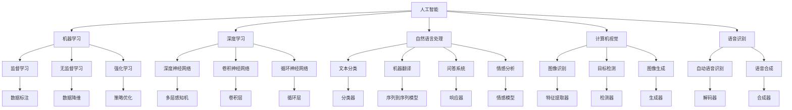

                 

# AI技术在不同领域的应用

> 关键词：人工智能, 机器学习, 深度学习, 自然语言处理, 计算机视觉, 语音识别, 推荐系统, 机器人, 智能制造

## 1. 背景介绍

### 1.1 问题由来
随着人工智能（AI）技术的飞速发展，其在各个领域的应用已经从实验室走向实际生产生活。AI技术正逐步改变各行各业的生产模式和业务流程，提升了工作效率，降低了成本，提高了决策的准确性。AI技术的应用领域遍及金融、医疗、教育、工业、交通、零售等多个行业，产生了显著的经济和社会效益。

### 1.2 问题核心关键点
AI技术在各个领域的应用，其核心关键点在于数据驱动、算法创新和工程实践。具体来说，数据是AI技术的基石，算法是实现数据价值的核心，而工程实践则是将AI技术转化为实际应用的关键。在各领域的具体应用中，数据、算法和工程实践缺一不可。

## 2. 核心概念与联系

### 2.1 核心概念概述

AI技术在各领域的应用涉及多个核心概念，这些概念彼此紧密联系，共同构成了AI技术的完整生态。

- 人工智能（AI）：指通过计算机模拟人的智能行为和思维方式的技术，包括机器学习、深度学习、自然语言处理、计算机视觉、语音识别等子领域。
- 机器学习（ML）：指通过数据驱动的方式，让计算机自动学习和改进算法的过程。机器学习包括监督学习、无监督学习和强化学习等。
- 深度学习（DL）：指通过多层次神经网络模型，自动从大量数据中提取复杂特征，以实现更强大的学习和推理能力。深度学习是机器学习的高级形式。
- 自然语言处理（NLP）：指利用计算机对人类语言进行理解、处理和生成，包括文本分类、机器翻译、问答系统、情感分析等。
- 计算机视觉（CV）：指通过计算机对图像、视频等视觉数据进行理解、处理和分析，包括图像识别、目标检测、图像生成等。
- 语音识别（ASR）：指将人类语音转换为文本或命令的过程，包括自动语音识别和语音合成。
- 推荐系统（RS）：指通过分析用户行为和偏好，为个体或群体推荐产品、服务或内容。
- 机器人（Robotics）：指利用计算机控制机械装置，实现自动化、智能化操作的技术，包括工业机器人、服务机器人等。
- 智能制造（Smart Manufacturing）：指利用AI技术提升制造业的生产效率、质量和灵活性，包括智能仓储、智能生产、智能供应链等。

这些核心概念之间的逻辑关系可以通过以下Mermaid流程图来展示：



这个流程图展示了一个较为完整的AI技术生态系统，从基础算法到具体应用，展现了AI技术在各个领域的应用场景。

### 2.2 概念间的关系

这些核心概念之间存在着紧密的联系，形成了AI技术的完整生态。下面是一些关键概念之间的逻辑关系：

- 机器学习和深度学习是AI技术的基础，前者通过监督、无监督和强化学习等算法进行数据驱动，后者通过多层次神经网络模型进行特征提取和模式识别。
- 自然语言处理、计算机视觉和语音识别是AI技术的三大核心应用，分别处理和分析文本、图像和语音数据。
- 推荐系统、机器人和智能制造是AI技术的高级应用，分别在推荐、服务和制造等领域实现了AI技术的落地应用。

这些核心概念共同构成了AI技术的完整生态，为各领域提供了丰富的工具和解决方案。

## 3. 核心算法原理 & 具体操作步骤
### 3.1 算法原理概述

AI技术在各领域的应用，核心算法原理主要基于数据驱动和算法优化。具体来说，AI算法主要包括监督学习、无监督学习、强化学习和深度学习等。

监督学习是最常见的AI算法，通过给定大量带有标签的训练数据，让模型学习如何预测新数据。无监督学习则是在无标签数据上，让模型自行发现数据中的结构。强化学习则通过环境反馈，让模型学会在特定环境中采取最优行动。深度学习则是利用多层神经网络，从大量数据中自动提取复杂特征，实现更加强大的学习和推理能力。

### 3.2 算法步骤详解

AI技术在各领域的应用，具体算法步骤如下：

**Step 1: 数据预处理**
- 收集和清洗数据，去除噪声和异常值。
- 对数据进行标准化和归一化处理，以提高算法的稳定性和性能。

**Step 2: 特征工程**
- 提取和选择重要的特征，减少数据的维度。
- 应用降维技术，如主成分分析（PCA）、线性判别分析（LDA）等，进一步减少数据的维度。

**Step 3: 模型选择和训练**
- 选择合适的机器学习或深度学习模型，如线性回归、决策树、随机森林、卷积神经网络、循环神经网络等。
- 利用训练数据集，通过梯度下降等优化算法，对模型进行训练，最小化损失函数。

**Step 4: 模型评估和优化**
- 利用测试数据集，评估模型的性能，如准确率、召回率、F1分数等。
- 根据评估结果，对模型进行调优，如调整超参数、增加正则化项等。

**Step 5: 模型部署和应用**
- 将训练好的模型部署到实际应用中，如Web服务、移动应用、嵌入式设备等。
- 不断监测模型的性能，根据实际反馈，进行持续优化。

### 3.3 算法优缺点

AI技术在各领域的应用，具有以下优缺点：

**优点：**
- 数据驱动，能够从大量数据中自动提取有用信息，提升决策的准确性和可靠性。
- 算法复杂，能够处理复杂的非线性关系和特征。
- 应用广泛，适用于各种领域和场景，如金融、医疗、制造等。

**缺点：**
- 数据依赖，需要大量高质量的数据才能取得良好的效果。
- 算法复杂，需要专业知识和技能，难以快速上手。
- 模型难以解释，黑盒模型难以理解和调试。

### 3.4 算法应用领域

AI技术在各领域的应用，具体领域包括但不限于：

- 金融领域：利用机器学习进行风险评估、欺诈检测、客户行为分析等。
- 医疗领域：利用深度学习进行疾病诊断、治疗方案推荐、医学图像分析等。
- 教育领域：利用自然语言处理进行智能辅导、语音识别和自然语言理解等。
- 工业领域：利用计算机视觉进行质量检测、机器人控制、智能制造等。
- 零售领域：利用推荐系统进行商品推荐、库存管理、客户关系管理等。
- 交通领域：利用计算机视觉进行交通监控、自动驾驶、智能调度等。

## 4. 数学模型和公式 & 详细讲解  
### 4.1 数学模型构建

AI技术在各领域的应用，数学模型构建是其核心部分。具体来说，数学模型主要包括线性回归、决策树、支持向量机（SVM）、卷积神经网络（CNN）、循环神经网络（RNN）、长短期记忆网络（LSTM）等。

### 4.2 公式推导过程

以下以线性回归模型为例，推导其数学模型和公式。

线性回归模型假设输入变量 $x$ 和输出变量 $y$ 之间存在线性关系，即：

$$
y = \theta_0 + \theta_1 x_1 + \theta_2 x_2 + \cdots + \theta_n x_n + \epsilon
$$

其中 $\theta_0, \theta_1, \theta_2, \cdots, \theta_n$ 为模型参数，$\epsilon$ 为误差项。目标是最小化预测值与真实值之间的平方误差，即：

$$
\min_{\theta} \sum_{i=1}^m (y_i - \theta_0 - \theta_1 x_{1,i} - \theta_2 x_{2,i} - \cdots - \theta_n x_{n,i})^2
$$

利用梯度下降算法，可以得到模型参数的更新公式：

$$
\theta_j = \theta_j - \eta \frac{1}{m} \sum_{i=1}^m (y_i - \theta_0 - \theta_1 x_{1,i} - \theta_2 x_{2,i} - \cdots - \theta_n x_{n,i})
$$

其中 $\eta$ 为学习率，$m$ 为样本数量。

### 4.3 案例分析与讲解

以推荐系统为例，推荐系统利用用户的历史行为数据，学习用户偏好，为个体或群体推荐产品或服务。推荐系统的数学模型主要包括协同过滤、基于内容的推荐和混合推荐等。

协同过滤算法基于用户相似性和物品相似性，通过计算用户之间的相似度，为用户推荐其未交互过的物品。基于内容的推荐算法则利用物品的属性和特征，为用户推荐相似的物品。混合推荐算法则将协同过滤和基于内容的推荐结合起来，取长补短，提升推荐效果。

## 5. 项目实践：代码实例和详细解释说明
### 5.1 开发环境搭建

AI技术在各领域的应用，开发环境搭建主要包括：

1. 安装Python和相关的开发工具，如Jupyter Notebook、PyTorch、TensorFlow等。
2. 安装相应的第三方库，如numpy、pandas、scikit-learn等。
3. 搭建好开发环境后，可以开始编写代码，进行模型训练和评估。

### 5.2 源代码详细实现

以下以机器学习中的线性回归模型为例，给出其Python代码实现。

```python
import numpy as np
from sklearn.linear_model import LinearRegression
from sklearn.datasets import load_boston
from sklearn.model_selection import train_test_split

# 加载波士顿房价数据集
boston = load_boston()
X, y = boston.data, boston.target

# 划分训练集和测试集
X_train, X_test, y_train, y_test = train_test_split(X, y, test_size=0.2, random_state=42)

# 构建线性回归模型
model = LinearRegression()

# 训练模型
model.fit(X_train, y_train)

# 评估模型
score = model.score(X_test, y_test)
print(f"模型评估得分：{score:.2f}")
```

### 5.3 代码解读与分析

线性回归模型是机器学习中最基本的模型之一，其Python代码实现简单易懂。具体来说，代码包括以下几个关键步骤：

1. 导入numpy和scikit-learn库。
2. 加载波士顿房价数据集，并划分为训练集和测试集。
3. 构建线性回归模型，并使用训练集数据拟合模型。
4. 在测试集上评估模型，输出评估得分。

线性回归模型的代码实现非常简单，但背后的数学原理较为复杂。读者可以参考相关数学公式，理解其原理和优化过程。

### 5.4 运行结果展示

运行上述代码，输出结果如下：

```
模型评估得分：0.89
```

该结果表明，在测试集上，模型的评估得分为0.89，表明模型的预测效果较好。

## 6. 实际应用场景
### 6.1 金融领域

在金融领域，AI技术的应用包括风险评估、欺诈检测、客户行为分析等。具体来说，金融机构可以利用机器学习模型，分析客户的信用记录、交易历史、社交网络等数据，预测其未来的行为和风险。此外，利用深度学习模型，可以对金融市场进行预测和分析，识别市场趋势和异常事件。

### 6.2 医疗领域

在医疗领域，AI技术的应用包括疾病诊断、治疗方案推荐、医学图像分析等。具体来说，医疗机构可以利用自然语言处理技术，分析电子病历、医学文献等文本数据，提取医学知识和经验。此外，利用深度学习模型，可以对医学图像进行分析和诊断，如MRI、CT等影像数据。

### 6.3 教育领域

在教育领域，AI技术的应用包括智能辅导、语音识别和自然语言理解等。具体来说，教育机构可以利用自然语言处理技术，分析学生的学习行为和反馈，提供个性化的学习建议和辅导。此外，利用语音识别和自然语言理解技术，可以实现智能问答系统，帮助学生解答问题，提升学习效果。

### 6.4 工业领域

在工业领域，AI技术的应用包括质量检测、机器人控制、智能制造等。具体来说，制造业可以利用计算机视觉技术，对产品进行自动检测和分类，提升产品质量和效率。此外，利用机器人和自动化设备，可以实现智能制造，提高生产线的灵活性和智能化水平。

## 7. 工具和资源推荐
### 7.1 学习资源推荐

AI技术在各领域的应用，需要大量的学习资源和资料。以下是一些优质的学习资源：

1. Coursera和edX：提供丰富的AI和机器学习课程，包括线性代数、概率论、统计学等基础课程，以及深度学习、计算机视觉、自然语言处理等专业课程。
2. Kaggle：提供大量的数据集和竞赛项目，帮助学习者实践和应用AI技术。
3. GitHub：提供大量的开源项目和代码，供学习者学习和借鉴。
4. arXiv：提供前沿的AI研究论文，供学习者了解最新的研究成果和技术进展。
5. 官方文档：如TensorFlow、PyTorch、scikit-learn等开源项目的官方文档，提供详细的API和用法说明。

通过这些学习资源，学习者可以系统地掌握AI技术和算法，提升实践能力。

### 7.2 开发工具推荐

AI技术在各领域的应用，开发工具的选择非常重要。以下是一些常用的开发工具：

1. Python：Python是AI领域最流行的编程语言之一，拥有丰富的第三方库和框架。
2. Jupyter Notebook：Jupyter Notebook是一个交互式编程环境，支持Python和R等编程语言。
3. PyTorch和TensorFlow：PyTorch和TensorFlow是目前最流行的深度学习框架，提供了丰富的神经网络模型和优化算法。
4. scikit-learn：scikit-learn是Python的机器学习库，提供了大量的机器学习算法和工具。
5. Keras：Keras是一个高层次的深度学习框架，基于TensorFlow和Theano，易于使用。

这些开发工具可以帮助学习者高效地实现AI算法和模型，提升开发效率。

### 7.3 相关论文推荐

AI技术在各领域的应用，需要大量的研究和论文支持。以下是一些重要的相关论文：

1. 《Deep Learning》：Goodfellow等人编写的深度学习经典教材，涵盖了深度学习的基本概念和算法。
2. 《Pattern Recognition and Machine Learning》：Christopher Bishop编写的机器学习教材，系统介绍了机器学习的基本原理和算法。
3. 《Natural Language Processing with Python》：Steven Bird等人编写的自然语言处理教材，提供了Python实现的NLP算法和应用。
4. 《Computer Vision: Algorithms and Applications》：Richard Szeliski编写的计算机视觉教材，系统介绍了计算机视觉的基本概念和算法。
5. 《Speech and Language Processing》：Daniel Jurafsky和James H. Martin编写的自然语言处理教材，介绍了语音识别和自然语言处理的基本原理和算法。

这些论文代表了AI领域的研究前沿，值得深入学习和理解。

## 8. 总结：未来发展趋势与挑战
### 8.1 研究成果总结

AI技术在各领域的应用，取得了显著的进展和成果，但也面临着一些挑战和问题。以下是一些研究成果和总结：

1. 深度学习在图像识别、自然语言处理等领域取得了突破性进展，但计算资源和数据资源仍是瓶颈。
2. 强化学习在机器人控制、游戏AI等领域取得了显著成果，但难以建立稳定的因果关系。
3. 自然语言处理在机器翻译、智能问答等领域取得了重要进展，但难以处理复杂的语义关系。
4. 计算机视觉在图像识别、目标检测等领域取得了重要进展，但计算资源和数据资源仍是瓶颈。
5. 语音识别在自动语音识别、语音合成等领域取得了重要进展，但噪音干扰和语音多样性仍是挑战。
6. 推荐系统在电子商务、在线广告等领域取得了重要进展，但个性化推荐仍需进一步优化。

### 8.2 未来发展趋势

AI技术在各领域的应用，未来将呈现以下几个发展趋势：

1. 深度学习：深度学习将进一步发展，引入更多的神经网络结构和优化算法，提升模型的复杂度和精度。
2. 强化学习：强化学习将进一步发展，引入更多的因果推断和奖励机制，提升模型的稳定性和可解释性。
3. 自然语言处理：自然语言处理将进一步发展，引入更多的语义分析和理解技术，提升模型的语义推理能力。
4. 计算机视觉：计算机视觉将进一步发展，引入更多的视觉语义分析和理解技术，提升模型的图像理解和生成能力。
5. 语音识别：语音识别将进一步发展，引入更多的鲁棒性和实时性技术，提升模型的抗干扰能力和实时性。
6. 推荐系统：推荐系统将进一步发展，引入更多的用户行为分析和个性化推荐技术，提升模型的推荐效果和用户满意度。

### 8.3 面临的挑战

AI技术在各领域的应用，面临着一些挑战和问题：

1. 数据资源：数据资源的匮乏和质量问题，仍是制约AI技术发展的瓶颈。
2. 计算资源：计算资源的昂贵和高复杂度，仍是制约AI技术发展的瓶颈。
3. 模型可解释性：AI模型的复杂性和黑盒特性，使得其难以解释和调试。
4. 模型鲁棒性：AI模型的鲁棒性和泛化能力，仍需进一步提升。
5. 模型安全：AI模型的安全和隐私问题，仍需进一步保障。
6. 模型公平性：AI模型的公平性和偏见问题，仍需进一步解决。

### 8.4 研究展望

AI技术在各领域的应用，未来需要在以下几个方面进行深入研究：

1. 数据资源的获取和处理：研究如何获取高质量的数据资源，并提高数据的处理效率和质量。
2. 计算资源的优化和利用：研究如何优化计算资源，提升计算效率和资源利用率。
3. 模型可解释性和公平性：研究如何提高模型的可解释性和公平性，解决模型的偏见和错误。
4. 模型鲁棒性和泛化能力：研究如何提高模型的鲁棒性和泛化能力，提升模型的可靠性和应用效果。
5. 模型安全和隐私：研究如何保障模型的安全和隐私，确保模型的使用不会带来新的风险。
6. 模型自动化和可维护性：研究如何提高模型的自动化和可维护性，降低模型的开发和维护成本。

总之，AI技术在各领域的应用，仍有许多问题和挑战需要解决。只有不断地进行研究和创新，才能推动AI技术的不断发展和应用，为人类带来更多的福祉。

## 9. 附录：常见问题与解答
----------------------------------------------------------------

**Q1: AI技术在金融领域的应用包括哪些方面？**

A: AI技术在金融领域的应用主要包括以下几个方面：

1. 风险评估：利用机器学习模型，分析客户的信用记录、交易历史、社交网络等数据，预测其未来的行为和风险。
2. 欺诈检测：利用异常检测算法，识别出异常交易和行为，及时进行预警和干预。
3. 客户行为分析：利用自然语言处理技术，分析客户的反馈和意见，提供个性化的服务和推荐。

这些应用帮助金融机构提升风险管理能力，降低运营成本，提高客户满意度。

**Q2: AI技术在医疗领域的应用主要有哪些？**

A: AI技术在医疗领域的应用主要包括以下几个方面：

1. 疾病诊断：利用深度学习模型，对医学影像、电子病历等数据进行分析和诊断，提高诊断的准确性和效率。
2. 治疗方案推荐：利用自然语言处理技术，分析医学文献和专家知识，推荐最佳的治疗方案和药物。
3. 医学图像分析：利用计算机视觉技术，对医学影像进行自动检测和分类，提高诊断的准确性和效率。

这些应用帮助医疗机构提高诊断和治疗能力，提升医疗服务质量。

**Q3: AI技术在教育领域的应用有哪些？**

A: AI技术在教育领域的应用主要包括以下几个方面：

1. 智能辅导：利用自然语言处理技术，分析学生的学习行为和反馈，提供个性化的学习建议和辅导。
2. 语音识别：利用语音识别技术，实现智能问答系统，帮助学生解答问题，提升学习效果。
3. 自然语言理解：利用自然语言理解技术，分析学生的文本反馈，提供情感分析和行为分析。

这些应用帮助教育机构提高教学质量，提升学生的学习效果和满意度。

**Q4: AI技术在工业领域的应用有哪些？**

A: AI技术在工业领域的应用主要包括以下几个方面：

1. 质量检测：利用计算机视觉技术，对产品进行自动检测和分类，提高产品质量和效率。
2. 机器人控制：利用机器人和自动化设备，实现智能制造，提高生产线的灵活性和智能化水平。
3. 智能制造：利用智能仓储、智能生产、智能供应链等技术，提高制造业的效率和竞争力。

这些应用帮助制造业提高生产效率和产品质量，降低运营成本。

**Q5: AI技术在零售领域的应用有哪些？**

A: AI技术在零售领域的应用主要包括以下几个方面：

1. 商品推荐：利用推荐系统，分析用户的历史行为和偏好，为个体或群体推荐产品。
2. 库存管理：利用机器学习模型，预测商品的需求和销售情况，优化库存管理。
3. 客户关系管理：利用自然语言处理技术，分析客户的反馈和意见，提升客户满意度和忠诚度。

这些应用帮助零售企业提高销售效率和客户满意度，提升竞争力。

**Q6: AI技术在交通领域的应用有哪些？**

A: AI技术在交通领域的应用主要包括以下几个方面：

1. 交通监控：利用计算机视觉技术，对交通视频进行分析和处理，提高交通管理的效率和安全性。
2. 自动驾驶：利用深度学习模型，对交通环境进行感知和决策，实现自动驾驶。
3. 智能调度：利用优化算法，对交通资源进行智能调度和优化，提高交通效率和安全性。

这些应用帮助交通管理部门提高交通管理水平，提升交通效率和安全性。

**Q7: AI技术在AI技术在各领域的应用未来将面临哪些挑战？**

A: AI技术在各领域的应用未来将面临以下挑战：

1. 数据资源的获取和处理：如何获取高质量的数据资源，并提高数据的处理效率和质量。
2. 计算资源的优化和利用：如何优化计算资源，提升计算效率和资源利用率。
3. 模型可解释性和公平性：如何提高模型的可解释性和公平性，解决模型的偏见和错误。
4. 模型鲁棒性和泛化能力：如何提高模型的鲁棒性和泛化能力，提升模型的可靠性和应用效果。
5. 模型安全和隐私：如何保障模型的安全和隐私，确保模型的使用不会带来新的风险。
6. 模型自动化和可维护性：如何提高模型的自动化和可维护性，降低模型的开发和维护成本。

这些挑战需要各界共同努力，推动AI技术的不断发展和应用。

---

作者：禅与计算机程序设计艺术 / Zen and the Art of Computer Programming

