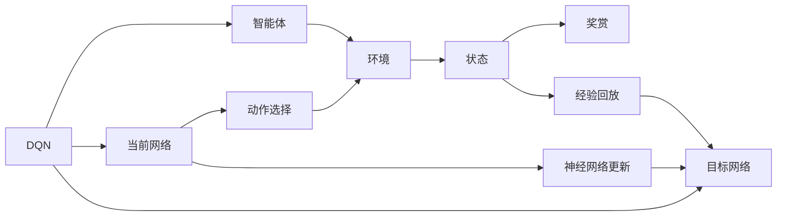
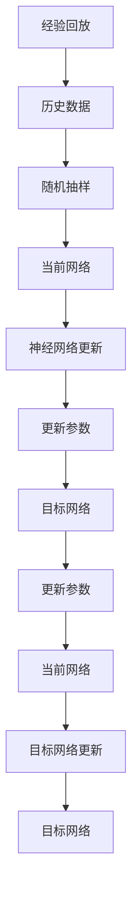
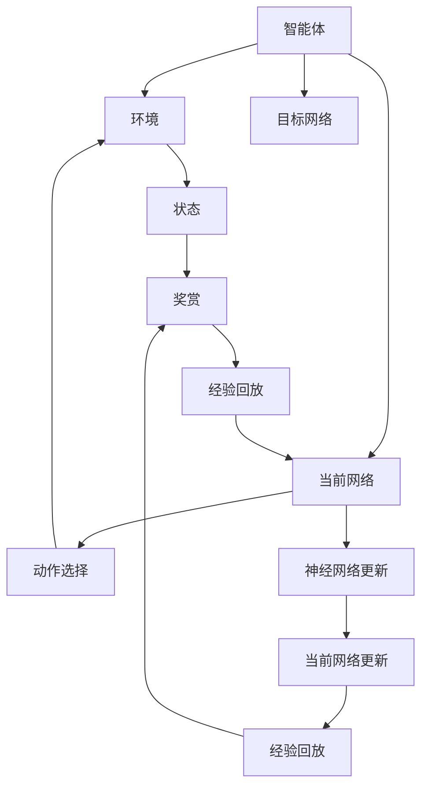

                 

# 一切皆是映射：AI深度强化学习DQN原理入门

> 关键词：深度强化学习, DQN, 马尔可夫决策过程, 探索与利用权衡, 梯度下降, 神经网络, 神经网络应用, 蒙特卡罗方法

## 1. 背景介绍

### 1.1 问题由来

随着人工智能技术的飞速发展，强化学习（Reinforcement Learning, RL）日益成为人工智能研究的热门领域。然而，传统强化学习基于马尔可夫决策过程（Markov Decision Process, MDP），在面对复杂的非线性问题时往往陷入局部最优。而深度学习与强化学习的结合，即深度强化学习（Deep Reinforcement Learning, DRL），利用深度神经网络强大的特征提取和泛化能力，极大提升了强化学习的求解效率和效果。其中，DQN（Deep Q-Networks）是深度强化学习中最具代表性的算法之一，通过神经网络逼近Q值函数，在控制智能体行为决策上取得了显著的成果。

### 1.2 问题核心关键点

DQN算法通过神经网络逼近Q值函数，使得智能体可以在没有显式模型的情况下，通过与环境的交互逐步学习最优策略。DQN通过以下核心步骤实现这一过程：

1. **初始化神经网络**：定义神经网络结构，并初始化网络参数。
2. **经验回放**：记录智能体与环境的交互历史，并将历史状态、动作和奖赏存入经验回放池（Experience Replay）。
3. **选择动作**：利用当前状态和网络参数，通过ε-greedy策略选择动作。
4. **环境交互**：执行动作并接收环境反馈，包括状态和奖赏。
5. **神经网络更新**：将当前状态和奖赏传递给神经网络，更新网络参数，计算目标Q值。
6. **经验回放**：将更新后的网络参数应用于目标网络，进行模型迁移，实现网络参数的稳定更新。
7. **周期性调整网络**：周期性地将目标网络参数更新为当前网络参数，确保网络参数的持续优化。

这些步骤构成了DQN算法的核心流程，通过不断迭代，智能体能够逐步学习最优策略，解决复杂的控制问题。

### 1.3 问题研究意义

研究DQN算法，对于探索智能体如何通过学习逐步优化决策策略，提升在复杂环境中表现的能力，具有重要意义：

1. 解决无模型问题：DQN算法无需显式模型，适合复杂且动态的环境，提升智能体在实际应用中的泛化能力。
2. 提升决策效率：通过神经网络逼近Q值函数，DQN能够高效处理高维状态和动作空间，快速求解复杂决策问题。
3. 提供新范式：DQN算法为复杂问题的求解提供了新的思路和方法，适用于工业控制、自动驾驶、游戏策略等多个领域。
4. 可扩展性强：DQN算法可以应用于不同的网络结构、不同的任务目标，具有较强的扩展性和灵活性。
5. 面向未来：随着深度强化学习的不断发展，DQN算法将继续引领未来智能决策领域的研究方向。

## 2. 核心概念与联系

### 2.1 核心概念概述

为更好地理解DQN算法，本节将介绍几个密切相关的核心概念：

- **马尔可夫决策过程（MDP）**：用于描述智能体与环境交互的数学模型，由状态、动作、奖赏、转移概率等元素构成。MDP是强化学习的理论基础，通过状态转移和奖赏反馈，指导智能体采取最优动作。
- **Q值函数**：定义为状态动作对（s, a）的预期奖赏之和，通过Q值函数可以评估每个状态动作对的价值。Q值函数的求解是强化学习中的核心问题。
- **深度Q网络（DQN）**：结合深度神经网络和经验回放，通过神经网络逼近Q值函数，提升求解效率和效果。DQN广泛应用于机器人控制、游戏AI、自动化交易等领域。
- **经验回放**：记录智能体与环境交互的历史数据，通过随机抽样，使网络学习更加稳定和健壮。经验回放是DQN算法的核心技术之一。
- **ε-greedy策略**：在动作选择时，以一定的概率随机选择动作，以探索新的状态动作对，以1-ε的概率选择当前状态的最大Q值动作，以利用已有的知识，平衡探索和利用。

这些核心概念之间的逻辑关系可以通过以下Mermaid流程图来展示：

```mermaid
graph TB
    A[马尔可夫决策过程(MDP)] --> B[状态(s)]
    A --> C[动作(a)]
    A --> D[奖赏(r)]
    B --> E[转移概率]
    C --> F[神经网络]
    F --> G[目标网络]
    C --> H[当前网络]
    B --> I[经验回放]
    I --> J[历史数据]
    G --> K[目标网络更新]
    H --> L[当前网络更新]
    K --> M[经验回放]
    L --> N[经验回放]
```

这个流程图展示了大语言模型的核心概念及其之间的关系：

1. 智能体与环境的交互通过MDP模型进行描述。
2. 神经网络逼近Q值函数，通过当前网络计算Q值。
3. 经验回放记录智能体的交互历史，随机抽样用于网络更新。
4. 利用ε-greedy策略，平衡探索和利用，引导智能体学习最优策略。

### 2.2 概念间的关系

这些核心概念之间存在着紧密的联系，形成了DQN算法的完整生态系统。下面我们通过几个Mermaid流程图来展示这些概念之间的关系。

#### 2.2.1 DQN算法的学习范式



这个流程图展示了大语言模型的学习范式。智能体通过与环境交互，在当前网络指导下选择动作，并根据环境反馈更新神经网络。

#### 2.2.2 DQN与MDP的关系

```mermaid
graph LR
    A[MDP] --> B[状态(s)]
    A --> C[动作(a)]
    A --> D[奖赏(r)]
    B --> E[转移概率]
    C --> F[神经网络]
    F --> G[目标网络]
    C --> H[当前网络]
    E --> I[经验回放]
    I --> J[历史数据]
    G --> K[目标网络更新]
    H --> L[当前网络更新]
    K --> M[经验回放]
    L --> N[经验回放]
```

这个流程图展示了DQN算法在MDP框架下的学习过程。智能体通过状态转移和奖赏反馈，指导神经网络更新，逐步学习最优策略。

#### 2.2.3 经验回放与网络更新的关系



这个流程图展示了经验回放在神经网络更新中的应用。通过随机抽样历史数据，更新当前网络参数，从而稳定优化网络性能。

### 2.3 核心概念的整体架构

最后，我们用一个综合的流程图来展示这些核心概念在大语言模型微调过程中的整体架构：



这个综合流程图展示了从智能体与环境交互到神经网络更新的完整过程。智能体通过与环境交互，在当前网络指导下选择动作，并根据环境反馈更新神经网络，通过经验回放记录历史数据，随机抽样用于网络更新，最终实现智能体策略的逐步优化。 通过这些流程图，我们可以更清晰地理解DQN算法的学习机制，为后续深入讨论具体的算法步骤和技术细节奠定基础。

## 3. 核心算法原理 & 具体操作步骤
### 3.1 算法原理概述

DQN算法通过神经网络逼近Q值函数，实现智能体的最优决策策略。其核心思想是：在无显式模型的情况下，智能体通过与环境的交互，逐步学习每个状态动作对的预期奖赏，从而优化决策策略。

形式化地，假设智能体在状态 $s_t$ 时采取动作 $a_t$，接收奖赏 $r_{t+1}$ 并转移到状态 $s_{t+1}$，则当前状态 $s_t$ 的Q值定义为：

$$
Q(s_t,a_t) = \mathbb{E}[r_{t+1} + \gamma Q(s_{t+1},a_{t+1})]
$$

其中，$r_{t+1}$ 是环境反馈的即时奖赏，$\gamma$ 是折现因子，$Q(s_{t+1},a_{t+1})$ 是下一个状态的预期Q值。

DQN算法通过神经网络逼近上述Q值函数，从而计算每个状态动作对的价值，指导智能体采取最优动作。具体而言，神经网络输出每个状态动作对的Q值预测，通过经验回放和神经网络更新，逐步优化Q值预测，从而优化智能体的决策策略。

### 3.2 算法步骤详解

DQN算法通过以下几个关键步骤实现智能体的最优策略学习：

**Step 1: 初始化神经网络**

- 定义神经网络结构，如卷积神经网络（CNN）、全连接神经网络（FCN）等。
- 初始化网络参数，如权重、偏置等。
- 定义网络损失函数和优化器，如均方误差（MSE）、Adam等。

**Step 2: 经验回放**

- 在每个时间步 $t$，记录智能体与环境的交互历史 $(s_t,a_t,r_{t+1},s_{t+1})$，存储在经验回放池中。
- 随机从经验回放池中抽取一组历史数据 $(s_t,a_t,r_{t+1},s_{t+1})$。

**Step 3: 动作选择**

- 利用当前状态 $s_t$，通过神经网络计算Q值预测 $Q(s_t,\cdot)$。
- 根据ε-greedy策略，以一定概率随机选择动作 $a_t$，以1-ε的概率选择当前状态的最大Q值动作。

**Step 4: 环境交互**

- 执行动作 $a_t$，接收环境反馈，包括状态 $s_{t+1}$ 和奖赏 $r_{t+1}$。
- 根据状态转移概率 $P(s_{t+1}|s_t,a_t)$ 和奖赏模型 $R(s_t,a_t)$，计算下一个状态 $s_{t+1}$ 和奖赏 $r_{t+1}$。

**Step 5: 神经网络更新**

- 计算目标Q值 $Q_{t+1}(s_{t+1},a_{t+1})$，将当前状态 $s_t$ 和奖赏 $r_{t+1}$ 传递给神经网络，更新网络参数。
- 通过神经网络输出Q值预测 $Q(s_t,\cdot)$，计算预测误差 $\delta_t = Q(s_t,a_t) - (r_{t+1} + \gamma Q(s_{t+1},a_{t+1}))$。
- 通过均方误差（MSE）或均方平均误差（MAE）作为损失函数，反向传播计算梯度，更新神经网络参数。

**Step 6: 经验回放**

- 将更新后的网络参数应用于目标网络，进行模型迁移，确保网络参数的稳定更新。
- 周期性地将目标网络参数更新为当前网络参数，确保网络参数的连续优化。

以上是DQN算法的核心流程，通过不断迭代，智能体能够逐步学习最优策略，解决复杂的控制问题。

### 3.3 算法优缺点

DQN算法具有以下优点：

1. 无需显式模型：DQN算法通过神经网络逼近Q值函数，无需显式建模环境状态转移和奖赏机制，适应性更强。
2. 高效求解：DQN算法利用深度神经网络强大的特征提取和泛化能力，高效处理高维状态和动作空间，快速求解复杂决策问题。
3. 稳定更新：经验回放通过随机抽样历史数据，使网络学习更加稳定和健壮。
4. 可扩展性强：DQN算法可以应用于不同的网络结构、不同的任务目标，具有较强的扩展性和灵活性。
5. 应用广泛：DQN算法广泛应用于机器人控制、游戏AI、自动化交易等多个领域，具有广泛的实际应用前景。

同时，DQN算法也存在一些局限性：

1. 高方差问题：由于神经网络估计Q值函数，存在高方差问题，容易在初期训练中发生收敛困难。
2. 参数更新频繁：由于神经网络参数较多，每次更新参数消耗较多计算资源。
3. 状态空间复杂：在复杂环境中，状态空间可能非常庞大，难以处理。
4. 模型泛化能力不足：DQN算法容易陷入局部最优，难以实现全局最优。
5. 网络结构复杂：DQN算法依赖于复杂的神经网络结构，难以理解和调试。

尽管存在这些局限性，但DQN算法仍是大规模控制问题求解的利器，具有重要的研究和应用价值。

### 3.4 算法应用领域

DQN算法在以下领域具有广泛的应用：

- **机器人控制**：通过DQN算法，智能机器人能够学习最优路径规划、任务执行策略，提高自动化和智能化水平。
- **游戏AI**：DQN算法在游戏AI领域取得了显著成果，如AlphaGo，通过神经网络逼近Q值函数，学习最优下棋策略，击败人类顶级棋手。
- **自动化交易**：通过DQN算法，智能交易系统能够学习最优交易策略，提高投资回报率。
- **自动驾驶**：DQN算法应用于自动驾驶系统，学习最优驾驶策略，提升行驶安全性和效率。
- **智能推荐**：DQN算法应用于智能推荐系统，学习用户行为和偏好，提供个性化推荐内容。
- **社交机器人**：通过DQN算法，社交机器人能够学习最优对话策略，提升用户交互体验。

除了上述这些经典应用外，DQN算法还被创新性地应用于更多场景中，如智能家居、智能物流、智能制造等，为各行各业带来了新的变革和机遇。

## 4. 数学模型和公式 & 详细讲解  
### 4.1 数学模型构建

本节将使用数学语言对DQN算法的学习过程进行更加严格的刻画。

记智能体在状态 $s_t$ 时采取动作 $a_t$，接收奖赏 $r_{t+1}$ 并转移到状态 $s_{t+1}$，其Q值函数定义为：

$$
Q(s_t,a_t) = \mathbb{E}[r_{t+1} + \gamma Q(s_{t+1},a_{t+1})]
$$

其中，$r_{t+1}$ 是环境反馈的即时奖赏，$\gamma$ 是折现因子。

定义神经网络 $f_\theta$ 逼近Q值函数，其中 $\theta$ 为网络参数。在每个时间步 $t$，利用神经网络输出Q值预测 $Q_{\theta}(s_t,a_t)$，通过神经网络更新优化网络参数。

具体而言，神经网络更新过程包括以下步骤：

1. 随机从经验回放池中抽取一组历史数据 $(s_t,a_t,r_{t+1},s_{t+1})$。
2. 利用当前状态 $s_t$ 和奖赏 $r_{t+1}$，通过神经网络输出Q值预测 $Q_{\theta}(s_t,a_t)$。
3. 通过神经网络输出Q值预测 $Q_{\theta}(s_{t+1},\cdot)$，计算目标Q值 $Q_{t+1}(s_{t+1},a_{t+1})$。
4. 计算预测误差 $\delta_t = Q_{\theta}(s_t,a_t) - (r_{t+1} + \gamma Q_{\theta}(s_{t+1},a_{t+1}))$。
5. 通过均方误差（MSE）或均方平均误差（MAE）作为损失函数，反向传播计算梯度，更新神经网络参数。

### 4.2 公式推导过程

以下我们以二臂赌博机为例，推导DQN算法的核心公式。

假设智能体在状态 $s_t$ 时采取动作 $a_t$，接收奖赏 $r_{t+1}$ 并转移到状态 $s_{t+1}$，Q值函数定义为：

$$
Q(s_t,a_t) = \mathbb{E}[r_{t+1} + \gamma Q(s_{t+1},a_{t+1})]
$$

在每个时间步 $t$，利用神经网络输出Q值预测 $Q_{\theta}(s_t,a_t)$，通过神经网络更新优化网络参数。

神经网络输出Q值预测的过程可以表示为：

$$
Q_{\theta}(s_t,a_t) = \mathbb{E}_{x\sim\mathcal{D}}[\hat{Q}_{\theta}(x,a_t)]
$$

其中，$\mathcal{D}$ 为样本分布，$\hat{Q}_{\theta}(x,a_t)$ 为神经网络的Q值预测。

神经网络更新过程可以表示为：

$$
\min_{\theta} \frac{1}{N} \sum_{i=1}^N (Q_{\theta}(s_i,a_i) - (r_{i+1} + \gamma \max_{a} Q_{\theta}(s_{i+1},a)))^2
$$

其中，$N$ 为样本数量，$\min_{\theta}$ 表示优化过程。

目标Q值计算过程可以表示为：

$$
Q_{t+1}(s_{t+1},a_{t+1}) = \mathbb{E}[r_{t+1} + \gamma Q(s_{t+1},a_{t+1})]
$$

目标Q值计算可以表示为：

$$
Q_{t+1}(s_{t+1},a_{t+1}) = r_{t+1} + \gamma \max_{a} Q_{\theta}(s_{t+1},a)
$$

目标Q值与神经网络Q值预测的误差可以表示为：

$$
\delta_t = Q_{\theta}(s_t,a_t) - (r_{t+1} + \gamma \max_{a} Q_{\theta}(s_{t+1},a))
$$

通过均方误差（MSE）或均方平均误差（MAE）作为损失函数，反向传播计算梯度，更新神经网络参数。

### 4.3 案例分析与讲解

下面以AlphaGo为例，具体分析DQN算法的应用。

AlphaGo通过神经网络逼近Q值函数，学习下棋策略。在每个时间步，AlphaGo利用神经网络输出Q值预测，并通过神经网络更新优化网络参数。具体而言，AlphaGo通过以下步骤实现下棋策略的逐步优化：

1. 初始化神经网络，定义神经网络结构，如卷积神经网络（CNN）、全连接神经网络（FCN）等。
2. 记录与环境的交互历史，将历史状态、动作和奖赏存入经验回放池中。
3. 利用当前状态和神经网络输出Q值预测，选择动作。
4. 执行动作，接收环境反馈，包括状态和奖赏。
5. 计算目标Q值，通过神经网络输出Q值预测，计算预测误差，反向传播计算梯度，更新神经网络参数。
6. 将更新后的网络参数应用于目标网络，进行模型迁移，确保网络参数的稳定更新。

通过DQN算法，AlphaGo学习到了最优的下棋策略，取得了举世瞩目的成就，展示了深度强化学习的强大潜力。

## 5. 项目实践：代码实例和详细解释说明
### 5.1 开发环境搭建

在进行DQN实践前，我们需要准备好开发环境。以下是使用Python进行TensorFlow开发的环境配置流程：

1. 安装Anaconda：从官网下载并安装Anaconda，用于创建独立的Python环境。

2. 创建并激活虚拟环境：
```bash
conda create -n tf-env python=3.8 
conda activate tf-env
```

3. 安装TensorFlow：根据CUDA版本，从官网获取对应的安装命令。例如：
```bash
pip install tensorflow==2.6.0
```

4. 安装各类工具包：
```bash
pip install numpy pandas scikit-learn matplotlib tqdm jupyter notebook ipython
```

完成上述步骤后，即可在`tf-env`环境中开始DQN实践。

### 5.2 源代码详细实现

这里我们以DQN算法应用于Atari游戏中为例，给出使用TensorFlow进行DQN算法开发的PyTorch代码实现。

首先，定义神经网络结构：

```python
import tensorflow as tf
from tensorflow.keras import layers

class DQN(tf.keras.Model):
    def __init__(self, state_size, action_size):
        super(DQN, self).__init__()
        self.conv1 = layers.Conv2D(32, (8, 8), strides=(4, 4), activation='relu', input_shape=(84, 84, 1))
        self.conv2 = layers.Conv2D(64, (4, 4), strides=(2, 2), activation='relu')
        self.flatten = layers.Flatten()
        self.fc1 = layers.Dense(256, activation='relu')
        self.fc2 = layers.Dense(action_size)

    def call(self, inputs):
        x = self.conv1(inputs)
        x = tf.reduce_mean(x, axis=(1, 2), keepdims=True)
        x = self.conv2(x)
        x = tf.reduce_mean(x, axis=(1, 2), keepdims=True)
        x = self.flatten(x)
        x = self.fc1(x)
        return self.fc2(x)
```

然后，定义经验回放缓冲区：

```python
import collections
import numpy as np

class ReplayBuffer:
    def __init__(self, buffer_size):
        self.buffer_size = buffer_size
        self.buffer = collections.deque(maxlen=buffer_size)
        self.count = 0

    def add(self, state, action, reward, next_state, done):
        transition = np.hstack((state, [action, reward, next_state, done])
        self.buffer.append(transition)
        self.count = min(self.count + 1, self.buffer_size)

    def sample(self, batch_size):
        batch = np.random.choice(len(self.buffer), batch_size, replace=False)
        return self.buffer[batch]
```

接着，定义DQN算法的核心过程：

```python
import tensorflow as tf

class DQN(tf.keras.Model):
    def __init__(self, state_size, action_size):
        super(DQN, self).__init__()
        self.conv1 = layers.Conv2D(32, (8, 8), strides=(4, 4), activation='relu', input_shape=(84, 84, 1))
        self.conv2 = layers.Conv2D(64, (4, 4), strides=(2, 2), activation='relu')
        self.flatten = layers.Flatten()
        self.fc1 = layers.Dense(256, activation='relu')
        self.fc2 = layers.Dense(action_size)

    def call(self, inputs):
        x = self.conv1(inputs)
        x = tf.reduce_mean(x, axis=(1, 2), keepdims=True)
        x = self.conv2(x)
        x = tf.reduce_mean(x, axis=(1, 2), keepdims=True)
        x = self.flatten(x)
        x = self.fc1(x)
        return self.fc2(x)

    def act(self, state):
        if np.random.rand() < epsilon:
            return np.random.choice(action_size)
        q_values = self.predict(state)
        return np.argmax(q_values[0])

    def predict(self, state):
        state = np.expand_dims(state, axis=0)
        q_values = self.call(state)
        return q_values

    def replay(self, batch_size):
        minibatch = env.replay_memory.sample(batch_size)
        for state, action, reward, next_state, done in minibatch:
            target = reward + gamma * np.amax(self.predict(next_state)[0])
            if not done:
                target = reward + gamma * np.amax(self.predict(next_state)[0])
            target_f = self.predict(state)
            target_f[0][action] = target
            loss = tf.keras.losses.mean_squared_error(target_f, self.predict(state))
            tf.keras.backend.clear_session()
```

最后，启动训练流程并在测试集上评估：

```python
import tensorflow as tf

epsilon = 0.1
batch_size = 32
gamma = 0.99
learning_rate = 0.001
update_frequency = 4

env = create_environment()
state

