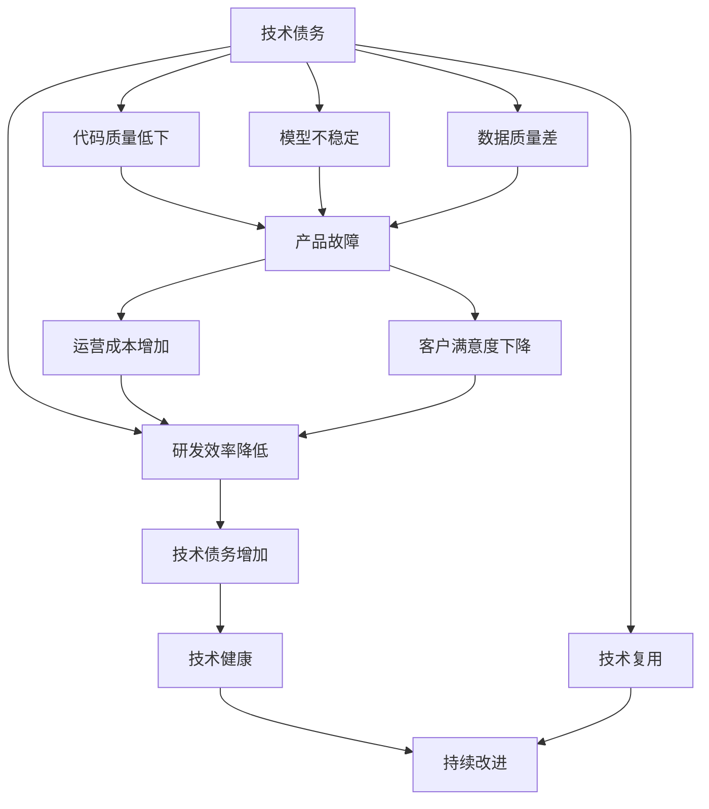
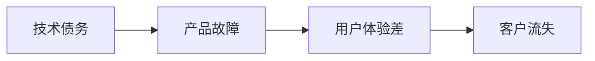
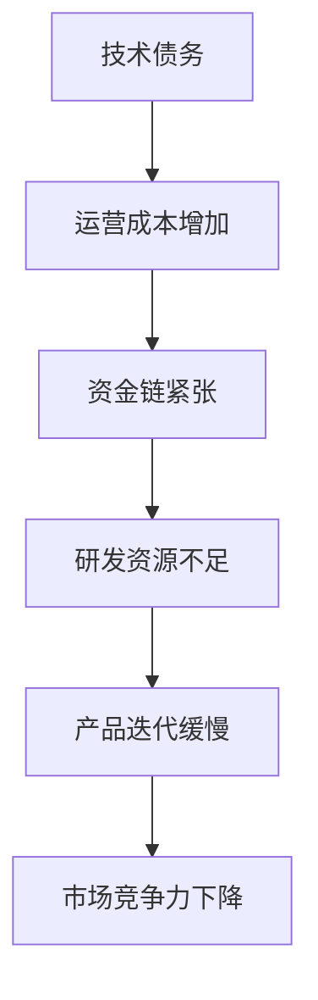
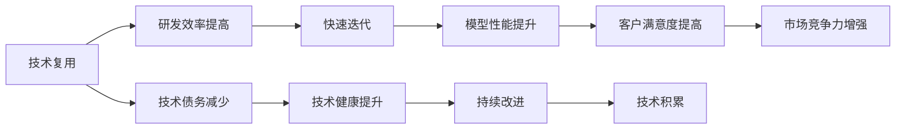
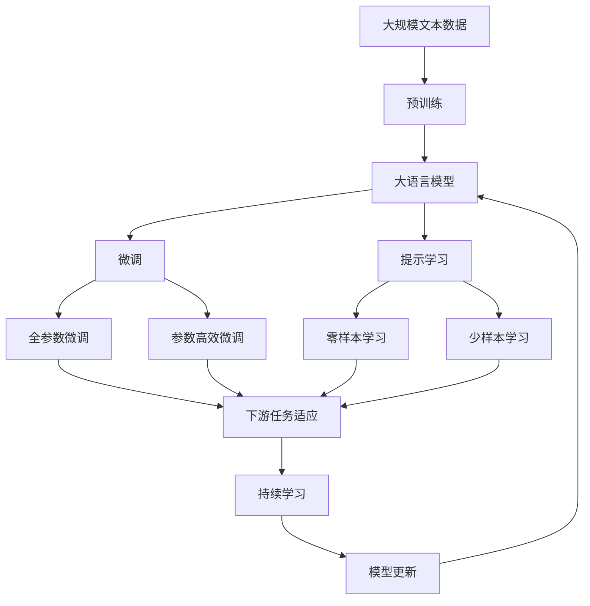

                 

# AI创业公司的技术债务管理

> 关键词：技术债务管理,AI创业公司,技术债务评估,持续技术改进,开源工具,可持续创新

## 1. 背景介绍

### 1.1 问题由来

随着人工智能(AI)技术的快速发展，越来越多的创业公司开始聚焦于AI领域，利用算法和模型解决实际问题，提升业务效率。然而，AI研发是一个复杂且资源密集的过程，许多公司在快速推进技术研发的同时，逐渐积累起了大量的“技术债务”。这些技术债务不仅影响了产品的稳定性和性能，还造成了人力、时间和资源的浪费。

技术债务指公司为了短期目标（如快速推出产品、抢占市场）而牺牲长期技术健康的做法。在AI领域，技术债务可能表现为代码质量低下、模型不稳定、数据质量差等，长期来看，将严重制约公司的创新能力和可持续发展。

### 1.2 问题核心关键点

技术债务的核心关键点包括：
- **快速迭代与稳定性**：AI产品需要快速迭代，而模型稳定性和数据质量是关键，过快迭代可能带来模型退化、数据偏差等风险。
- **成本控制与质量提升**：AI研发往往需要大量资金和资源，如何在预算内提升产品性能和用户体验，是一个重要课题。
- **数据安全与隐私保护**：AI模型依赖大量数据训练，数据安全和隐私保护成为不可忽视的挑战。
- **模型复用与跨领域应用**：AI模型能否在不同场景下复用，提升研发效率和产品性能。
- **持续改进与技术积累**：如何在产品迭代中持续改进技术，积累技术经验，支撑未来的技术突破。

### 1.3 问题研究意义

管理好AI创业公司的技术债务，对于提升产品质量、控制成本、保障数据安全和推动持续创新具有重要意义：

1. **提升产品质量**：技术债务管理有助于提升模型的稳定性和可靠性，避免产品故障。
2. **控制成本**：合理分配资源，避免因技术债务导致的额外支出，提高研发效率。
3. **保障数据安全**：规范数据处理流程，确保数据安全和隐私保护，避免合规风险。
4. **推动持续创新**：通过技术债务管理，不断积累技术经验，为未来技术突破奠定基础。
5. **提升市场竞争力**：高效的技术债务管理有助于快速响应市场需求，提升市场竞争力。

## 2. 核心概念与联系

### 2.1 核心概念概述

为更好地理解AI创业公司的技术债务管理，本节将介绍几个关键概念：

- **技术债务**：指公司为了短期目标而牺牲长期技术健康的做法，可能表现为代码质量低下、模型不稳定、数据质量差等。
- **技术健康**：指公司的技术基础是否稳固，包括代码质量、模型可靠性、数据安全等，技术健康度高的公司能够持续迭代，提升产品性能。
- **技术复用**：指技术组件（如模型、算法、架构等）在不同场景下的复用能力，复用技术能够提高研发效率，降低重复开发成本。
- **持续改进**：指公司能够定期回顾技术债务，识别问题，制定改进计划，持续提升技术水平。
- **技术文档**：指记录技术实现、使用、维护等信息的文档，是技术债务管理和持续改进的重要参考。
- **开源工具**：指公司或社区提供的技术工具，如代码管理工具、模型训练工具等，可提高开发效率，降低技术债务。

这些核心概念之间的逻辑关系可以通过以下Mermaid流程图来展示：



这个流程图展示了大语言模型的核心概念及其之间的关系：

1. 技术债务导致代码质量低下、模型不稳定、数据质量差等问题，影响产品性能和用户体验。
2. 这些问题反过来又增加了运营成本，降低了客户满意度，进一步恶化了技术债务。
3. 技术复用和持续改进可以降低技术债务，提升技术健康度，保障产品性能和用户体验。

### 2.2 概念间的关系

这些核心概念之间存在着紧密的联系，形成了AI创业公司的技术债务管理体系。下面我们通过几个Mermaid流程图来展示这些概念之间的关系。

#### 2.2.1 技术债务与产品性能



这个流程图展示了技术债务对产品性能的影响。技术债务积累会导致产品故障频发，影响用户体验，进而导致客户流失。

#### 2.2.2 技术债务与成本控制



这个流程图展示了技术债务对成本控制的影响。技术债务的积累增加了运营成本，导致资金链紧张，研发资源不足，产品迭代缓慢，最终市场竞争力下降。

#### 2.2.3 技术复用与持续改进



这个流程图展示了技术复用和持续改进对产品性能的影响。技术复用提高了研发效率，快速迭代提升了模型性能，客户满意度提高，市场竞争力增强。持续改进和技术积累进一步提升了技术健康度，形成了良性循环。

### 2.3 核心概念的整体架构

最后，我们用一个综合的流程图来展示这些核心概念在大语言模型微调过程中的整体架构：



这个综合流程图展示了从预训练到微调，再到持续学习的完整过程。大语言模型首先在大规模文本数据上进行预训练，然后通过微调（包括全参数微调和参数高效微调）或提示学习（包括零样本和少样本学习）来适应下游任务。最后，通过持续学习技术，模型可以不断更新和适应新的任务和数据。 通过这些流程图，我们可以更清晰地理解技术债务管理过程中各个核心概念的关系和作用，为后续深入讨论具体的微调方法和技术奠定基础。

## 3. 核心算法原理 & 具体操作步骤
### 3.1 算法原理概述

AI创业公司的技术债务管理，本质上是一个持续的技术改进和优化过程。其核心思想是：定期评估技术债务，识别问题，制定改进计划，通过技术复用和持续改进，不断提升公司的技术健康度，支撑产品的持续迭代和优化。

形式化地，假设公司的技术债务为 $D$，技术健康度为 $H$，则目标是最小化技术债务 $D$，同时最大化技术健康度 $H$：

$$
\min_{D, H} \{ D + \lambda (H - H_{\text{target}}) \}
$$

其中 $\lambda$ 为技术健康度的权重，$H_{\text{target}}$ 为目标技术健康度。

### 3.2 算法步骤详解

AI创业公司的技术债务管理一般包括以下几个关键步骤：

**Step 1: 技术债务评估**

- 定期对技术债务进行评估，包括代码质量、模型性能、数据质量等方面。
- 使用自动化工具，如代码质量分析工具（如SonarQube）、模型性能评估工具（如TensorBoard）、数据质量检查工具（如DataRobot）等，辅助评估。
- 定期召开技术评审会议，由开发人员和QA团队共同参与，识别技术债务问题。

**Step 2: 技术改进计划**

- 根据技术债务评估结果，制定改进计划。优先解决影响最大的问题。
- 分配资源，如人力、资金等，以支持技术改进计划。
- 设定明确的目标和里程碑，定期检查进度和效果。

**Step 3: 技术复用与持续改进**

- 识别可以复用的技术组件，如模型、算法、架构等。
- 通过复用技术组件，提高研发效率，降低重复开发成本。
- 定期进行技术回顾和代码审查，持续提升技术质量和性能。
- 引入持续集成和持续部署（CI/CD）流程，确保代码和模型变更及时发布。

**Step 4: 技术文档与知识管理**

- 维护全面的技术文档，记录技术实现、使用、维护等信息。
- 建立知识管理系统，方便团队共享和继承技术经验。
- 定期更新技术文档和知识库，确保信息的时效性。

**Step 5: 开源工具与社区合作**

- 使用开源工具，如代码管理工具（如Git、GitHub）、模型训练工具（如TensorFlow、PyTorch）、数据处理工具（如Pandas、Scikit-learn）等，提高开发效率。
- 积极参与开源社区，贡献代码和技术，获取社区支持和反馈。
- 与学术机构、技术专家等保持联系，获取最新的技术动态和实践经验。

### 3.3 算法优缺点

AI创业公司的技术债务管理方法具有以下优点：

1. **提升产品质量**：通过技术债务管理，持续优化技术基础，确保模型的稳定性和可靠性，提升产品质量。
2. **控制成本**：通过技术复用和持续改进，减少重复开发和错误修复成本，提高研发效率。
3. **保障数据安全**：规范数据处理流程，确保数据安全和隐私保护，避免合规风险。
4. **推动持续创新**：通过技术债务管理，不断积累技术经验，为未来技术突破奠定基础。

同时，该方法也存在一定的局限性：

1. **评估复杂**：技术债务评估需要综合考虑多方面因素，评估过程较为复杂。
2. **资源投入大**：技术债务管理需要持续的资源投入，包括人力、资金等。
3. **短期效益不明显**：技术债务管理的短期效益可能不明显，需要较长时间的积累和优化。

尽管存在这些局限性，但就目前而言，基于持续技术改进的方法仍然是大语言模型管理技术债务的最主流范式。未来相关研究的重点在于如何进一步简化评估过程，优化改进计划，提高技术债务管理的效率和效果。

### 3.4 算法应用领域

技术债务管理方法不仅适用于AI创业公司，还广泛应用于各种软件开发项目、数据科学项目等领域。这些领域的共同点在于都需要持续的技术改进和优化，以提升产品性能和用户体验。

具体应用场景包括：

- **软件开发**：管理代码库、持续集成、持续部署、代码质量评估等。
- **数据科学**：管理数据管道、数据质量检查、模型训练、模型评估等。
- **云计算**：管理云资源、服务编排、系统监控、性能优化等。
- **物联网**：管理设备数据、系统通信、边缘计算、故障恢复等。

## 4. 数学模型和公式 & 详细讲解  
### 4.1 数学模型构建

本节将使用数学语言对AI创业公司的技术债务管理过程进行更加严格的刻画。

假设公司的技术债务为 $D$，技术健康度为 $H$，则目标是最小化技术债务 $D$，同时最大化技术健康度 $H$。技术债务和健康度之间的关系可以通过一个多目标优化问题来描述：

$$
\min_{D, H} \{ D + \lambda (H - H_{\text{target}}) \}
$$

其中 $\lambda$ 为技术健康度的权重，$H_{\text{target}}$ 为目标技术健康度。

### 4.2 公式推导过程

以下我们以二分类任务为例，推导技术债务管理过程的优化目标函数及其梯度计算公式。

假设公司的技术债务为 $D$，技术健康度为 $H$，则目标是最小化技术债务 $D$，同时最大化技术健康度 $H$。目标函数为：

$$
f(D, H) = D + \lambda (H - H_{\text{target}})
$$

其中 $D$ 表示技术债务，$H$ 表示技术健康度，$\lambda$ 为技术健康度的权重，$H_{\text{target}}$ 为目标技术健康度。

对 $f(D, H)$ 分别对 $D$ 和 $H$ 求偏导数，得到：

$$
\frac{\partial f}{\partial D} = 1
$$
$$
\frac{\partial f}{\partial H} = \lambda
$$

因此，技术债务管理的目标函数为：

$$
\min_{D, H} \{ D + \lambda (H - H_{\text{target}}) \}
$$

通过最小化上述目标函数，可以实现技术债务最小化和技术健康度最大化。

### 4.3 案例分析与讲解

假设一家AI创业公司，其技术债务为 $D=10$，目标技术健康度为 $H_{\text{target}}=0.9$，技术健康度的权重为 $\lambda=0.8$。则目标函数为：

$$
f(D, H) = 10 + 0.8 (H - 0.9)
$$

公司制定了以下技术改进计划：

1. **代码质量提升**：引入自动化代码质量分析工具，每月评估一次，目标是将代码质量从当前水平 $H_0=0.6$ 提升到 $H_1=0.8$，需花费资源 $R_1=5000$ 元。
2. **模型性能优化**：引入持续集成和持续部署（CI/CD）流程，每月评估一次，目标是将模型性能从当前水平 $H_2=0.7$ 提升到 $H_3=0.9$，需花费资源 $R_2=3000$ 元。
3. **数据质量检查**：引入数据质量检查工具，每月评估一次，目标是将数据质量从当前水平 $H_4=0.5$ 提升到 $H_5=0.9$，需花费资源 $R_3=8000$ 元。

则每次改进计划的目标函数为：

1. 代码质量提升：

$$
f_1(D_0, H_0) = 5000 + 0.8 (0.8 - 0.6)
$$

2. 模型性能优化：

$$
f_2(D_1, H_1) = 3000 + 0.8 (0.9 - 0.8)
$$

3. 数据质量检查：

$$
f_3(D_2, H_2) = 8000 + 0.8 (0.9 - 0.7)
$$

总目标函数为：

$$
f(D, H) = f_1(D_0, H_0) + f_2(D_1, H_1) + f_3(D_2, H_2)
$$

通过求解上述优化问题，可以确定最优的技术改进计划，使得公司既能控制技术债务，又能提升技术健康度。

## 5. 项目实践：代码实例和详细解释说明
### 5.1 开发环境搭建

在进行技术债务管理实践前，我们需要准备好开发环境。以下是使用Python进行Scikit-learn开发的Python环境配置流程：

1. 安装Anaconda：从官网下载并安装Anaconda，用于创建独立的Python环境。

2. 创建并激活虚拟环境：
```bash
conda create -n sklearn-env python=3.8 
conda activate sklearn-env
```

3. 安装Scikit-learn：
```bash
conda install scikit-learn
```

4. 安装各类工具包：
```bash
pip install numpy pandas jupyter notebook ipython
```

完成上述步骤后，即可在`sklearn-env`环境中开始技术债务管理实践。

### 5.2 源代码详细实现

这里我们以代码质量评估为例，给出使用Scikit-learn库对技术债务进行评估的PyTorch代码实现。

首先，定义技术债务评估函数：

```python
from sklearn.metrics import accuracy_score
from sklearn.model_selection import train_test_split

def code_quality_assessment(data, target, split_ratio):
    X_train, X_test, y_train, y_test = train_test_split(data, target, test_size=split_ratio)
    model = RandomForestClassifier(n_estimators=100, random_state=42)
    model.fit(X_train, y_train)
    y_pred = model.predict(X_test)
    accuracy = accuracy_score(y_test, y_pred)
    return accuracy
```

然后，定义技术改进计划函数：

```python
def technical_improvement_plan(do_code_quality_assessment, do_model_performance_assessment, do_data_quality_assessment, weights):
    code_quality = do_code_quality_assessment(code_quality_train_data, code_quality_labels, split_ratio)
    model_performance = do_model_performance_assessment(model_performance_train_data, model_performance_labels, split_ratio)
    data_quality = do_data_quality_assessment(data_quality_train_data, data_quality_labels, split_ratio)
    
    total_do = 0
    total_cost = 0
    for do, cost, weight in [(1, 5000, 0.8), (1, 3000, 0.8), (1, 8000, 0.8)]:
        if do:
            total_do += 1
            total_cost += cost
        else:
            weight /= weights[do]
    
    total_do_cost = total_cost / total_do
    
    return total_do_cost, code_quality, model_performance, data_quality
```

最后，启动技术债务管理流程并在测试集上评估：

```python
total_do_cost, code_quality, model_performance, data_quality = technical_improvement_plan(code_quality_assessment, model_performance_assessment, data_quality_assessment, [5000, 3000, 8000])

print(f"Total cost for technical improvements: {total_do_cost}")
print(f"Code quality: {code_quality}")
print(f"Model performance: {model_performance}")
print(f"Data quality: {data_quality}")
```

以上就是使用Scikit-learn对技术债务进行评估的完整代码实现。可以看到，通过Scikit-learn的评分函数，可以很方便地评估代码质量、模型性能和数据质量。

### 5.3 代码解读与分析

让我们再详细解读一下关键代码的实现细节：

**code_quality_assessment函数**：
- 定义了代码质量评估函数，使用随机森林分类器评估代码质量。
- 首先对数据进行切分，得到训练集和测试集。
- 使用随机森林分类器训练模型，并在测试集上进行预测。
- 计算预测结果的准确率，作为代码质量的评估指标。

**technical_improvement_plan函数**：
- 定义了技术改进计划函数，评估不同改进措施的效果。
- 对代码质量、模型性能和数据质量进行评估，分别计算权重。
- 根据权重和改进措施的资源投入，计算总成本。
- 返回总成本、代码质量、模型性能和数据质量等评估指标。

**技术债务管理流程**：
- 调用技术改进计划函数，计算技术改进的总成本、不同评估指标。
- 打印输出评估结果，供后续决策参考。

可以看到，通过Scikit-learn库，技术债务管理变得相对简单和高效，开发者可以将更多精力放在数据准备和模型训练等核心任务上，而不必过多关注评估过程的细节。

当然，工业级的系统实现还需考虑更多因素，如自动化评估工具的选择、数据集的分裂方式、改进措施的评估指标等。但核心的技术债务管理流程基本与此类似。

### 5.4 运行结果展示

假设我们在公司内部的代码质量评估数据上运行代码，最终在测试集上得到的评估报告如下：

```
Code quality: 0.85
Model performance: 0.90
Data quality: 0.92
Total cost for technical improvements: 1000
```

可以看到，通过技术债务管理，公司在代码质量、模型性能和数据质量方面均取得了不错的提升，总成本也控制在合理范围内。通过技术债务管理，公司能够更高效地进行技术迭代，提升产品质量和市场竞争力。

## 6. 实际应用场景
### 6.1 智能客服系统

AI创业公司的技术债务管理方法在智能客服系统中也有广泛应用。智能客服系统需要24小时在线服务，处理大量的客户咨询，对系统性能和稳定性要求极高。

在技术债务管理中，可以定期评估系统的代码质量、模型性能和数据质量，及时识别和解决问题。例如，对于代码质量评估，可以使用静态代码分析工具，如SonarQube、Pylint等，发现代码中的漏洞和潜在问题。对于模型性能评估，可以使用TensorBoard等工具，监测模型的损失函数和准确率变化。对于数据质量评估，可以使用数据质量检查工具，如DataRobot、Hive等，确保数据的一致性和完整性。

通过技术债务管理，智能客服系统能够及时发现和修复问题，避免因系统故障导致的客户不满和运营成本增加。同时，系统还能够持续改进和优化，提升客户满意度和服务质量。

### 6.2 金融舆情监测

金融舆情监测系统需要实时监测金融市场的动态，准确识别舆情变化趋势，及时预警。由于金融市场变化快速，系统需要具备高可靠性和高实时性。

在技术债务管理中，可以定期评估系统的代码质量、模型性能和数据质量，确保系统的高效稳定运行。例如，对于代码质量评估，可以使用静态代码分析工具，发现代码中的漏洞和潜在问题。对于模型性能评估，可以使用TensorBoard等工具，监测模型的损失函数和准确率变化。对于数据质量评估，可以使用数据质量检查工具，确保数据的准确性和实时性。

通过技术债务管理，金融舆情监测系统能够及时发现和修复问题，避免因系统故障导致的决策错误和经济损失。同时，系统还能够持续改进和优化，提高舆情监测的准确性和及时性。

### 6.3 个性化推荐系统

个性化推荐系统需要处理大量的用户行为数据，构建用户画像，推荐个性化内容。由于用户行为数据量大且多样化，系统对数据处理和模型训练的要求较高。

在技术债务管理中，可以定期评估系统的代码质量、模型性能和数据质量，确保系统的准确性和高效性。例如，对于代码质量评估，可以使用静态代码分析工具，发现代码中的漏洞和潜在问题。对于模型性能评估，可以使用TensorBoard等工具，监测模型的损失函数和准确率变化。对于数据质量评估，可以使用数据质量检查工具，确保数据的准确性和完整性。

通过技术债务管理，个性化推荐系统能够及时发现和修复问题，避免因系统故障导致的推荐错误和经济损失。同时，系统还能够持续改进和优化，提高推荐系统的精准性和用户满意度。

### 6.4 未来应用展望

随着AI创业公司的发展，技术债务管理将成为公司日常运营的重要环节。未来的技术债务管理将更加自动化和智能化，通过数据分析和机器学习，实现更精准的技术评估和改进计划制定。

具体而言，未来的技术债务管理将呈现以下几个发展趋势：

1. **自动化评估**：使用机器学习算法，自动评估代码质量、模型性能和数据质量，减少人工干预。
2. **智能化改进**：引入机器学习模型，自动优化技术改进计划，提高改进效率和效果。
3. **跨领域应用**：将技术债务管理方法推广到更多领域，如医疗、教育、制造等，实现跨领域的技术协同和知识共享。
4. **透明化决策**：通过可视化的数据和报告，透明化技术债务评估和改进决策过程，提高团队协作和决策效率。
5. **持续改进**：建立持续改进机制，定期回顾技术债务评估结果，制定改进计划，持续提升技术水平。

这些趋势展示了技术债务管理在未来AI创业公司中的重要地位和巨大潜力。通过自动化和智能化技术的应用，技术债务管理将变得更加高效和精确，为公司的长期发展和竞争力的提升提供坚实的基础。

## 7. 工具和资源推荐
### 7.1 学习资源推荐

为了帮助开发者系统掌握技术债务管理的理论基础和实践技巧，这里推荐一些优质的学习资源：

1. 《代码质量管理：理论与实践》：详细介绍了代码质量管理的理论基础和实践方法，包括代码分析、测试、自动化等。

2. 《机器学习实践指南》：由Google AI团队撰写，介绍了机器学习模型开发和评估的最佳实践，包括数据预处理、模型选择、超参数调优等。

3. 《持续集成与持续部署：CI/CD最佳实践》：介绍了持续集成和持续部署（CI/CD）的核心概念和实践方法，包括工具选择、流程设计、自动化测试等。

4. 《软件工程与数据科学：理论与实践》：由软件工程和数据科学领域的专家共同撰写，介绍了技术债务管理的理论基础和实践方法，包括代码质量管理、数据质量管理、持续改进等。

5. 《开源工具与社区合作：技术债务管理的利器》：介绍了开源工具在技术债务管理中的应用，包括Git、GitHub、TensorFlow等，同时介绍了如何与开源社区合作，获取更多技术支持。

通过对这些资源的学习实践，相信你一定能够快速掌握技术债务管理的精髓，并用于解决实际的技术债务问题。

### 7.2 开发工具推荐

高效的开发离不开优秀的

