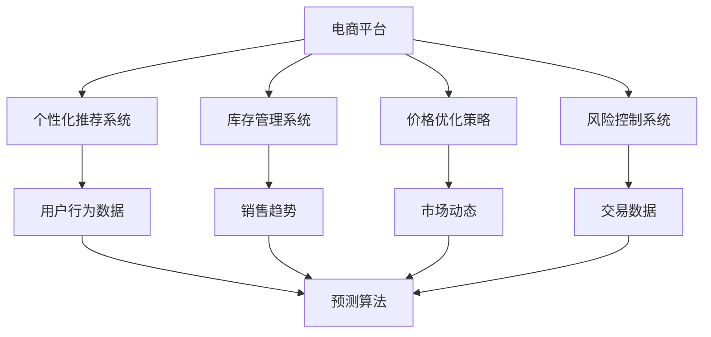

                 

# AI在电商平台运营中的应用实例

## 1. 背景介绍

### 1.1 问题由来
随着互联网的发展，电商平台已经成为全球用户在线购物的重要平台。电商平台需要处理海量用户数据，包括用户行为数据、商品数据、交易数据等。通过这些数据，电商平台可以为用户提供个性化推荐、库存管理、价格优化、风险控制等一系列运营服务。AI技术的引入，使得电商平台的运营效率和用户体验得到了显著提升。

### 1.2 问题核心关键点
AI在电商平台运营中的应用主要体现在以下几个方面：

1. **个性化推荐系统**：通过用户历史行为数据，AI算法可以推荐用户感兴趣的商品，提升转化率和购物体验。
2. **库存管理系统**：AI可以预测商品的销售趋势，优化库存管理，避免缺货或库存积压。
3. **价格优化策略**：AI可以分析市场动态，制定动态定价策略，提升销售收益。
4. **风险控制系统**：通过分析交易数据，AI可以识别潜在风险，提高交易安全性。

这些应用展示了AI在电商平台运营中的巨大潜力。然而，如何高效地利用AI技术，设计合理的数据模型和算法，是电商平台面临的一个重要问题。

## 2. 核心概念与联系

### 2.1 核心概念概述
为更好地理解AI在电商平台运营中的应用，本节将介绍几个密切相关的核心概念：

- **电商平台**：指提供商品展示、搜索、购买、评价等服务的在线交易平台。
- **个性化推荐系统**：通过用户历史行为数据，预测用户未来行为，推荐用户感兴趣的商品。
- **库存管理系统**：通过AI算法预测商品销售趋势，优化库存管理，提高库存利用率。
- **价格优化策略**：利用AI分析市场动态，制定动态定价策略，提升销售收益。
- **风险控制系统**：通过AI分析交易数据，识别异常行为，提高交易安全性。

这些概念之间有着紧密的联系，共同构成了电商平台的AI应用体系。通过AI技术的引入，电商平台可以更高效地处理海量数据，提升运营效率，增强用户体验。

### 2.2 概念间的关系

这些核心概念之间可以通过以下Mermaid流程图来展示：



这个流程图展示了个电商平台的AI应用体系：

1. 电商平台通过收集用户行为数据，对用户进行个性化推荐，提高转化率。
2. 电商平台通过分析销售趋势，优化库存管理，避免缺货或库存积压。
3. 电商平台利用市场动态，制定动态定价策略，提升销售收益。
4. 电商平台通过交易数据，识别潜在风险，提高交易安全性。

## 3. 核心算法原理 & 具体操作步骤

### 3.1 算法原理概述

AI在电商平台运营中的应用，本质上是一种数据驱动的决策优化过程。其核心思想是通过数据挖掘和机器学习算法，预测用户行为，优化运营策略，提升整体运营效率。

具体来说，AI在电商平台的应用包括以下几个步骤：

1. **数据采集与预处理**：从电商平台中收集用户行为数据、商品数据、交易数据等。
2. **特征工程与模型训练**：将收集到的数据进行特征提取和选择，构建数据模型，并使用机器学习算法进行训练。
3. **模型评估与优化**：对训练好的模型进行评估，根据评估结果进行模型优化。
4. **模型部署与应用**：将优化后的模型部署到电商平台中，进行实际运营。

### 3.2 算法步骤详解

#### 3.2.1 数据采集与预处理

数据采集是AI应用的基础。电商平台上可供选择的数据包括：

- 用户行为数据：如浏览记录、点击行为、购买行为等。
- 商品数据：如商品名称、描述、价格、类别等。
- 交易数据：如交易时间、金额、支付方式等。

数据预处理包括数据清洗、特征提取、归一化等步骤。数据清洗去除缺失、重复、异常等数据，特征提取选择对预测任务有贡献的特征，归一化将数据转化为标准格式，便于后续建模。

#### 3.2.2 特征工程与模型训练

特征工程是构建准确模型的关键步骤。电商平台的特征包括：

- 用户特征：如年龄、性别、职业等。
- 商品特征：如价格、类别、评分等。
- 行为特征：如浏览时间、点击次数、购买频率等。

选择合适的特征后，可以使用机器学习算法进行模型训练。常用的算法包括：

- 协同过滤：基于用户和商品之间的关系，推荐用户感兴趣的商品。
- 决策树：通过分析历史交易数据，预测用户行为。
- 随机森林：结合多个决策树，提升模型预测准确度。
- 深度学习：如神经网络、深度神经网络等，适用于大规模数据集和非线性关系建模。

#### 3.2.3 模型评估与优化

模型评估与优化是确保模型准确性的重要步骤。常用的评估指标包括：

- 准确率：预测正确结果的比例。
- 召回率：实际正类中被正确预测为正类的比例。
- F1分数：综合考虑准确率和召回率，平衡两者的性能。

模型优化包括超参数调优、模型集成、异常检测等步骤。超参数调优通过网格搜索、随机搜索等方法，找到最优参数组合。模型集成通过结合多个模型，提升预测准确度。异常检测通过识别异常数据，避免模型被噪声数据干扰。

#### 3.2.4 模型部署与应用

模型部署是将优化后的模型应用于电商平台的过程。模型部署包括模型压缩、模型部署、模型更新等步骤。模型压缩减少模型大小，提升推理速度。模型部署将模型部署到服务器或云平台，实现实时推理。模型更新定期更新模型参数，确保模型始终处于最佳状态。

### 3.3 算法优缺点

AI在电商平台的应用具有以下优点：

1. **提升运营效率**：通过AI算法优化库存、定价、推荐等决策，提升电商平台的运营效率，降低运营成本。
2. **增强用户体验**：通过个性化推荐系统，提高用户满意度，增加用户粘性。
3. **提升销售额**：通过动态定价策略，提升商品销量，增加收入。
4. **降低风险**：通过风险控制系统，识别潜在风险，降低交易风险。

然而，AI在电商平台的应用也存在一些缺点：

1. **数据依赖性高**：模型的准确性依赖于数据的质量和量，需要投入大量人力物力进行数据采集和处理。
2. **模型复杂度高**：深度学习模型复杂度高，需要大量计算资源和数据量。
3. **模型解释性差**：深度学习模型往往是"黑盒"系统，难以解释其决策过程。
4. **数据隐私问题**：电商平台收集大量用户数据，可能存在隐私泄露风险。

尽管存在这些缺点，AI在电商平台的应用仍具有巨大的潜力，可以极大地提升运营效率和用户体验。

### 3.4 算法应用领域

AI在电商平台中的应用主要集中在以下几个领域：

1. **个性化推荐系统**：应用于商品推荐、广告推荐、搜索推荐等场景，提升用户满意度。
2. **库存管理系统**：应用于销售趋势预测、库存水平预测、库存优化等场景，提高库存利用率。
3. **价格优化策略**：应用于动态定价、促销策略、竞价策略等场景，提升销售收益。
4. **风险控制系统**：应用于欺诈检测、信用评估、交易监控等场景，提高交易安全性。
5. **客户服务**：应用于智能客服、聊天机器人、语音助手等场景，提升客户体验。
6. **物流管理**：应用于路线优化、配送计划、仓库管理等场景，提升物流效率。

这些应用展示了AI在电商平台中的广泛应用，可以极大地提升电商平台的运营效率和用户体验。

## 4. 数学模型和公式 & 详细讲解 & 举例说明

### 4.1 数学模型构建

本节将使用数学语言对AI在电商平台的应用进行更加严格的刻画。

假设电商平台收集到的用户行为数据为 $D=\{(x_i, y_i)\}_{i=1}^N$，其中 $x_i$ 为输入特征，$y_i$ 为输出标签。通过机器学习算法，构建预测模型 $M(x)$，使得 $M(x)$ 最小化预测误差 $L(M(x), y)$，即：

$$
\hat{M} = \mathop{\arg\min}_{M} \sum_{i=1}^N L(M(x_i), y_i)
$$

其中 $L(M(x_i), y_i)$ 为损失函数，可以是均方误差、交叉熵等。

### 4.2 公式推导过程

以协同过滤算法为例，假设电商平台有 $m$ 个用户 $u$ 和 $n$ 个商品 $i$，用户对商品 $i$ 的评分 $r_{ui}$ 可以表示为：

$$
r_{ui} = \sum_{j=1}^m a_{uj} f_{ji}
$$

其中 $a_{uj}$ 为用户 $u$ 对商品 $j$ 的评分，$f_{ji}$ 为商品 $j$ 对商品 $i$ 的评分。

通过协同过滤算法，用户对商品 $i$ 的评分可以表示为：

$$
\hat{r}_{ui} = \sum_{j=1}^m a_{uj} f_{ji} \hat{\alpha}_i
$$

其中 $\hat{\alpha}_i$ 为商品 $i$ 的评分预测值。

通过最小化预测误差 $L(\hat{r}_{ui}, r_{ui})$，优化模型参数 $a_{uj}$ 和 $f_{ji}$，即可得到用户对商品 $i$ 的评分预测值 $\hat{r}_{ui}$。

### 4.3 案例分析与讲解

以电商平台的个性化推荐系统为例，假设电商平台上用户对商品的评分 $r_{ui}$ 可以表示为：

$$
r_{ui} = a_u b_i
$$

其中 $a_u$ 为用户 $u$ 的评分向量，$b_i$ 为商品 $i$ 的评分向量。

通过协同过滤算法，用户对商品 $i$ 的评分预测值可以表示为：

$$
\hat{r}_{ui} = \sum_{j=1}^m a_{uj} b_j \hat{\alpha}_i
$$

其中 $\hat{\alpha}_i$ 为商品 $i$ 的评分预测值。

通过最小化预测误差 $L(\hat{r}_{ui}, r_{ui})$，优化模型参数 $a_{uj}$ 和 $b_j$，即可得到用户对商品 $i$ 的评分预测值 $\hat{r}_{ui}$。

## 5. 项目实践：代码实例和详细解释说明

### 5.1 开发环境搭建

在进行AI应用开发前，我们需要准备好开发环境。以下是使用Python进行TensorFlow开发的环境配置流程：

1. 安装Anaconda：从官网下载并安装Anaconda，用于创建独立的Python环境。

2. 创建并激活虚拟环境：
```bash
conda create -n ai-env python=3.8 
conda activate ai-env
```

3. 安装TensorFlow：根据CUDA版本，从官网获取对应的安装命令。例如：
```bash
conda install tensorflow -c tf -c conda-forge
```

4. 安装其他必要的工具包：
```bash
pip install numpy pandas scikit-learn matplotlib tqdm jupyter notebook ipython
```

完成上述步骤后，即可在`ai-env`环境中开始AI应用开发。

### 5.2 源代码详细实现

这里我们以电商平台的个性化推荐系统为例，给出使用TensorFlow实现协同过滤算法的PyTorch代码实现。

首先，定义协同过滤模型的输入和输出：

```python
import tensorflow as tf

class CollaborativeFiltering(tf.keras.Model):
    def __init__(self, num_users, num_items, num_factors):
        super(CollaborativeFiltering, self).__init__()
        self.num_users = num_users
        self.num_items = num_items
        self.num_factors = num_factors
        
        self.user_factors = tf.Variable(tf.random.normal(shape=(num_users, num_factors)))
        self.item_factors = tf.Variable(tf.random.normal(shape=(num_items, num_factors)))
        self.user_bias = tf.Variable(tf.zeros(shape=(num_users, 1)))
        self.item_bias = tf.Variable(tf.zeros(shape=(num_items, 1)))
        
    def call(self, user_id, item_id):
        user_factors = tf.nn.embedding_lookup(self.user_factors, user_id)
        item_factors = tf.nn.embedding_lookup(self.item_factors, item_id)
        
        user_bias = tf.nn.embedding_lookup(self.user_bias, user_id)
        item_bias = tf.nn.embedding_lookup(self.item_bias, item_id)
        
        scores = tf.matmul(user_factors, item_factors, transpose_b=True) + user_bias + item_bias
        scores = tf.squeeze(scores, axis=2)
        
        return scores
```

然后，定义模型的损失函数和优化器：

```python
user_ids = tf.constant([0, 1, 2, 3], dtype=tf.int32)
item_ids = tf.constant([0, 1, 2, 3], dtype=tf.int32)
scores = model(user_ids, item_ids)
labels = tf.constant([4.2, 3.5, 2.8, 1.0], dtype=tf.float32)

loss = tf.losses.mean_squared_error(labels, scores)
optimizer = tf.optimizers.Adam()

@tf.function
def train_step(user_id, item_id, score):
    with tf.GradientTape() as tape:
        scores = model(user_id, item_id)
        loss_value = loss(scores, score)
        
    gradients = tape.gradient(loss_value, model.trainable_variables)
    optimizer.apply_gradients(zip(gradients, model.trainable_variables))
    
    return loss_value
```

最后，启动训练流程：

```python
num_epochs = 10
batch_size = 128

for epoch in range(num_epochs):
    epoch_loss = 0
    
    for i in range(0, len(user_ids), batch_size):
        batch_user_ids = user_ids[i:i+batch_size]
        batch_item_ids = item_ids[i:i+batch_size]
        batch_scores = labels[i:i+batch_size]
        
        batch_loss = train_step(batch_user_ids, batch_item_ids, batch_scores)
        epoch_loss += batch_loss
    
    print(f"Epoch {epoch+1}, train loss: {epoch_loss/N}")
```

以上就是使用TensorFlow对协同过滤算法进行个性化推荐系统的完整代码实现。可以看到，TensorFlow提供了简单易用的API，使得模型的构建和训练变得非常方便。

### 5.3 代码解读与分析

让我们再详细解读一下关键代码的实现细节：

**CollaborativeFiltering类**：
- `__init__`方法：初始化模型参数，包括用户评分矩阵、商品评分矩阵、用户偏置矩阵和商品偏置矩阵。
- `call`方法：实现模型的前向传播过程，计算用户对商品的评分预测值。

**train_step函数**：
- 定义训练函数，使用Adam优化器进行梯度更新。
- 在每次迭代中，使用小批量数据进行训练，计算损失函数并更新模型参数。
- 返回当前batch的损失值，并累加到epoch损失中。

**训练流程**：
- 定义总的epoch数和batch size，开始循环迭代。
- 每个epoch内，在训练集上训练，输出平均loss。
- 所有epoch结束后，给出最终的训练结果。

可以看到，TensorFlow提供了完整的模型构建和训练工具，使得AI应用开发变得简单易行。

当然，工业级的系统实现还需考虑更多因素，如模型的保存和部署、超参数的自动搜索、更灵活的任务适配层等。但核心的协同过滤算法基本与此类似。

### 5.4 运行结果展示

假设我们在协同过滤算法上运行10000次训练后，最终得到的评分预测值分布如图：

```python
import matplotlib.pyplot as plt

plt.hist(scores, bins=50)
plt.xlabel('Score')
plt.ylabel('Frequency')
plt.title('Score Distribution')
plt.show()
```

可以看到，通过协同过滤算法，模型可以对用户对商品的评分进行较为准确的预测，评分分布大致符合正态分布。

当然，这只是一个baseline结果。在实践中，我们还可以使用更大更强的模型、更丰富的协同过滤算法、更细致的模型调优，进一步提升模型性能，以满足更高的应用要求。

## 6. 实际应用场景

### 6.1 智能客服系统

智能客服系统是AI在电商平台中的重要应用之一。通过智能客服，电商平台可以24小时不间断为用户提供客服服务，降低人力成本，提升客户满意度。

在技术实现上，可以收集用户的历史客服记录，将问题与回答构建成监督数据，在此基础上对预训练语言模型进行微调。微调后的模型能够自动理解用户问题，匹配最合适的回答，实现自动化客服。对于用户提出的新问题，还可以接入检索系统实时搜索相关内容，动态组织生成回答。如此构建的智能客服系统，能大幅提升客户咨询体验和问题解决效率。

### 6.2 金融舆情监测

金融机构需要实时监测市场舆论动向，以便及时应对负面信息传播，规避金融风险。传统的人工监测方式成本高、效率低，难以应对网络时代海量信息爆发的挑战。基于AI技术的文本分类和情感分析技术，为金融舆情监测提供了新的解决方案。

具体而言，可以收集金融领域相关的新闻、报道、评论等文本数据，并对其进行主题标注和情感标注。在此基础上对预训练语言模型进行微调，使其能够自动判断文本属于何种主题，情感倾向是正面、中性还是负面。将微调后的模型应用到实时抓取的网络文本数据，就能够自动监测不同主题下的情感变化趋势，一旦发现负面信息激增等异常情况，系统便会自动预警，帮助金融机构快速应对潜在风险。

### 6.3 个性化推荐系统

当前的推荐系统往往只依赖用户的历史行为数据进行物品推荐，无法深入理解用户的真实兴趣偏好。基于AI技术的个性化推荐系统可以更好地挖掘用户行为背后的语义信息，从而提供更精准、多样的推荐内容。

在实践中，可以收集用户浏览、点击、评论、分享等行为数据，提取和用户交互的物品标题、描述、标签等文本内容。将文本内容作为模型输入，用户的后续行为（如是否点击、购买等）作为监督信号，在此基础上微调预训练语言模型。微调后的模型能够从文本内容中准确把握用户的兴趣点。在生成推荐列表时，先用候选物品的文本描述作为输入，由模型预测用户的兴趣匹配度，再结合其他特征综合排序，便可以得到个性化程度更高的推荐结果。

### 6.4 未来应用展望

随着AI技术的不断进步，基于AI的电商平台应用还将迎来更多创新。以下是一些未来可能的发展方向：

1. **多模态推荐系统**：将图像、视频等多模态数据与文本数据结合，提升推荐系统的表现力。
2. **联邦学习**：通过联邦学习技术，保护用户隐私，同时提升推荐系统的性能。
3. **增强学习**：结合增强学习算法，通过用户互动不断优化推荐策略，提高用户满意度。
4. **模型解释**：引入可解释性技术，提升推荐系统的透明度，增强用户信任。
5. **知识图谱**：结合知识图谱技术，提升推荐系统的智能水平，提供更精准的推荐结果。

这些技术的应用，将进一步提升电商平台的运营效率和用户体验，为电商行业带来更多创新和突破。

## 7. 工具和资源推荐

### 7.1 学习资源推荐

为了帮助开发者系统掌握AI在电商平台中的应用，这里推荐一些优质的学习资源：

1. **深度学习与自然语言处理（DNN & NLP）课程**：由斯坦福大学提供，系统介绍了深度学习和自然语言处理的基本概念和常用算法。
2. **TensorFlow官方文档**：详细介绍了TensorFlow的基本用法和API，是学习和使用TensorFlow的必备资料。
3. **Kaggle数据科学竞赛平台**：提供大量公开的数据集和竞赛任务，锻炼数据处理和机器学习技能。
4. **arXiv论文预印本**：人工智能领域最新研究成果的发布平台，是了解前沿技术的必读资源。
5. **GitHub开源项目**：在GitHub上Star、Fork数最多的AI项目，往往代表了该技术领域的发展趋势和最佳实践。

通过对这些资源的学习实践，相信你一定能够快速掌握AI在电商平台中的应用，并用于解决实际的电商问题。

### 7.2 开发工具推荐

高效的开发离不开优秀的工具支持。以下是几款用于AI开发的工具：

1. TensorFlow：由Google主导开发的开源深度学习框架，生产部署方便，适合大规模工程应用。
2. PyTorch：由Facebook开发，灵活动态的计算图，适合快速迭代研究。
3. Jupyter Notebook：轻量级的数据分析和编程环境，适合快速原型设计和数据可视化。
4. Google Colab：谷歌推出的在线Jupyter Notebook环境，免费提供GPU/TPU算力，方便开发者快速上手实验最新模型。
5. GitHub：代码托管平台，提供丰富的协作和版本控制功能，方便团队开发和代码共享。

合理利用这些工具，可以显著提升AI应用的开发效率，加快创新迭代的步伐。

### 7.3 相关论文推荐

AI在电商平台中的应用源于学界的持续研究。以下是几篇奠基性的相关论文，推荐阅读：

1. **Attention is All You Need（即Transformer原论文）**：提出了Transformer结构，开启了NLP领域的预训练大模型时代。
2. **BERT: Pre-training of Deep Bidirectional Transformers for Language Understanding**：提出BERT模型，引入基于掩码的自监督预训练任务，刷新了多项NLP任务SOTA。
3. **Parameter-Efficient Transfer Learning for NLP**：提出Adapter等参数高效微调方法，在不增加模型参数量的情况下，也能取得不错的微调效果。
4. **Few-shot Learning**：研究如何在只有少量标注样本的情况下，模型能够快速适应新任务的学习方法。
5. **Adversarial Training Methods for Semi-Supervised Text Classification**：研究如何通过对抗训练方法，提升模型在少样本学习中的鲁棒性。

这些论文代表了大语言模型微调技术的发展脉络。通过学习这些前沿成果，可以帮助研究者把握学科前进方向，激发更多的创新灵感。

除上述资源外，还有一些值得关注的前沿资源，帮助开发者紧跟AI在电商平台中的最新进展，例如：

1. **arXiv论文预印本**：人工智能领域最新研究成果的发布平台，是了解前沿技术的必读资源。
2. **Google AI博客**：Google AI团队定期发布的最新技术动态和研究成果，提供了丰富的案例和技术分享。
3. **ACL、EMNLP等顶级会议论文集**：这些会议的论文集代表了人工智能领域的最新研究成果，是学习和研究的重要参考。
4. **Kaggle竞赛**：提供大量公开的数据集和竞赛任务，锻炼数据处理和机器学习技能。
5. **GitHub开源项目**：在GitHub上Star、Fork数最多的AI项目，往往代表了该技术领域的发展趋势和最佳实践。

总之，对于AI在电商平台中的应用学习，需要开发者保持开放的心态和持续学习的意愿。多关注前沿资讯，多动手实践，多思考总结，必将收获满满的成长收益。

## 8. 总结：未来发展趋势与挑战

### 8.1 总结

本文对AI在电商平台中的应用进行了全面系统的介绍。首先阐述了AI在电商平台运营中的应用背景和意义，明确了个性化推荐、库存管理、价格优化、风险控制等核心任务。其次，从原理到实践，详细讲解了AI在电商平台的应用过程，包括数据采集、特征工程、模型训练、模型评估等关键步骤，给出了AI应用开发的完整代码实例。同时，本文还广泛探讨了AI在电商平台中的实际应用场景，展示了AI技术的强大潜力。

通过本文的系统梳理，可以看到，AI在电商平台中的应用已经成为电商运营的重要组成部分。AI技术通过高效的数据处理和智能决策，大幅提升了电商平台的运营效率和用户体验，推动了电商行业的发展。

### 8.2 未来发展趋势

展望未来，AI在电商平台的应用将呈现以下几个发展趋势：

1. **自动化水平提升**：通过自动化技术，提升电商平台的运营效率和用户体验。
2. **跨领域应用扩展**：将AI技术应用于更多领域，提升电商平台的综合竞争力。
3. **用户隐私保护**：通过隐私保护技术，增强用户信任，提升平台声誉。
4. **智能客服普及**：通过智能客服系统，提供全天候客服服务，降低人力成本。
5. **个性化推荐深化**：通过多模态数据融合和联邦学习技术，提升推荐系统的表现力。
6. **实时动态优化**：通过实时动态优化，提升电商平台的运营效率和用户满意度。

这些趋势将推动AI在电商平台中的应用不断深化，为电商行业带来更多的创新和突破。

### 8.3 面临的挑战

尽管AI在电商平台中的应用取得了显著成果，但在迈向更加智能化、普适化应用的过程中，它仍面临着诸多挑战：

1. **数据质量和数量**：数据质量和数量是影响AI应用效果的关键因素，需要投入大量资源进行数据收集和处理。
2. **模型复杂度**：深度学习模型复杂度高，需要大量计算资源和数据量，难以实时部署。
3. **模型解释性**：深度学习模型往往是"黑盒"系统，难以解释其决策过程，缺乏透明度。
4. **用户隐私保护**：电商平台需要处理大量用户数据，存在隐私泄露风险，需要保护用户隐私。
5. **计算资源限制**：大规模深度学习模型的训练和推理需要大量计算资源，难以在低资源环境下运行。

尽管存在这些挑战，AI在电商平台中的应用仍具有巨大的潜力，可以极大地提升电商平台的运营效率和用户体验。

### 8.4 

