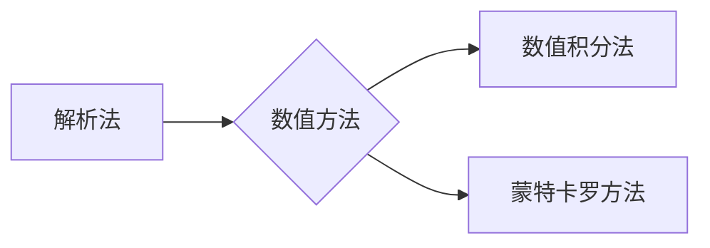

# 蒙特卡罗方法 (Monte Carlo Methods) 原理与代码实例讲解

作者：禅与计算机程序设计艺术 / Zen and the Art of Computer Programming

## 关键词：

蒙特卡罗方法，随机模拟，统计采样，概率模型，数值积分，数值微分，随机过程，方差减少，重要性采样，抗方差采样

---

## 1. 背景介绍

### 1.1 问题的由来

蒙特卡罗方法，作为一种基于随机采样的数值计算方法，起源于第二次世界大战期间，用于解决核物理问题。随着计算机技术的飞速发展，蒙特卡罗方法逐渐渗透到各个领域，成为解决复杂问题的有力工具。本文将深入浅出地介绍蒙特卡罗方法的原理、应用和代码实例。

### 1.2 研究现状

蒙特卡罗方法在科学计算、工程模拟、金融分析、物理实验等领域有着广泛的应用。近年来，随着高性能计算和并行计算的发展，蒙特卡罗方法在计算效率、精度和适用范围等方面取得了显著的进展。

### 1.3 研究意义

蒙特卡罗方法具有以下重要意义：

- 简化复杂问题的求解过程，提高计算效率。
- 提高数值计算的精度，尤其在传统方法难以求解的问题上。
- 扩大数值计算的适用范围，包括多维问题、随机问题等。
- 为人工智能、机器学习等领域提供新的技术手段。

### 1.4 本文结构

本文分为八个部分，分别为：

- 背景介绍：介绍蒙特卡罗方法的由来、研究现状和研究意义。
- 核心概念与联系：阐述蒙特卡罗方法的基本概念和联系。
- 核心算法原理 & 具体操作步骤：详细讲解蒙特卡罗方法的原理和操作步骤。
- 数学模型和公式 & 详细讲解 & 举例说明：介绍蒙特卡罗方法相关的数学模型和公式，并结合实例进行讲解。
- 项目实践：给出蒙特卡罗方法的代码实例，并进行详细解释说明。
- 实际应用场景：探讨蒙特卡罗方法在各个领域的应用场景。
- 工具和资源推荐：推荐蒙特卡罗方法的学习资源、开发工具和论文。
- 总结：总结蒙特卡罗方法的发展趋势和挑战。

---

## 2. 核心概念与联系

蒙特卡罗方法的核心概念包括：

- 随机模拟：通过随机过程模拟真实世界的复杂现象。
- 统计采样：从概率模型中抽取样本，以估计某个数值或概率。
- 概率模型：描述随机现象的数学模型，如概率分布、随机过程等。

蒙特卡罗方法与其他数值计算方法（如解析法、数值积分法等）的联系如下：

- 解析法：通过数学公式直接求解问题的方法。
- 数值积分法：通过数值逼近方法求解定积分的方法。
- 蒙特卡罗方法：通过统计采样方法求解数值问题的方法。



## 3. 核心算法原理 & 具体操作步骤

### 3.1 算法原理概述

蒙特卡罗方法的基本原理是利用随机样本对目标值进行估计。具体步骤如下：

1. 构建概率模型：描述随机现象的数学模型。
2. 统计采样：从概率模型中抽取样本。
3. 估计目标值：根据采样结果，估计目标值的数值或概率。

### 3.2 算法步骤详解

以下是蒙特卡罗方法的一般步骤：

1. 确定问题：明确求解目标，确定概率模型。
2. 构建概率模型：根据问题描述，构建描述随机现象的概率模型。
3. 设计采样策略：选择合适的采样方法，从概率模型中抽取样本。
4. 估计目标值：根据采样结果，计算目标值的估计值。
5. 评估结果：评估估计值的精度和可靠性。

### 3.3 算法优缺点

蒙特卡罗方法的优点如下：

- 简单易行，易于实现。
- 适用于各种复杂问题，包括多维问题、随机问题等。
- 计算结果具有随机性，可以评估结果的可靠性。

蒙特卡罗方法的缺点如下：

- 计算量较大，需要大量的随机样本。
- 结果的精度依赖于样本数量，需要根据实际情况进行调整。
- 适用于概率问题，不适用于确定性问题的求解。

### 3.4 算法应用领域

蒙特卡罗方法广泛应用于以下领域：

- 科学计算：物理模拟、金融分析、工程模拟等。
- 机器学习：强化学习、贝叶斯网络、随机梯度下降等。
- 概率论与数理统计：随机过程、蒙特卡罗积分、蒙特卡罗模拟等。

## 4. 数学模型和公式 & 详细讲解 & 举例说明

### 4.1 数学模型构建

蒙特卡罗方法的核心是概率模型。以下是几个常见的概率模型：

- 概率分布：描述随机变量取值的概率分布，如正态分布、均匀分布等。
- 随机过程：描述随机事件随时间或空间变化的规律。
- 贝叶斯网络：描述变量之间的因果关系。

### 4.2 公式推导过程

以下是蒙特卡罗方法中常用的几个公式：

- 随机变量期望：$E(X) = \int_{-\infty}^{+\infty} x P(X=x)$
- 随机变量方差：$Var(X) = E(X^2) - [E(X)]^2$
- 蒙特卡罗积分：$\int_a^b f(x) dx \approx \frac{1}{N} \sum_{i=1}^N f(x_i)$

### 4.3 案例分析与讲解

以下是一个蒙特卡罗积分的例子：

假设我们需要计算定积分 $\int_0^1 x^2 dx$ 的值。我们可以使用蒙特卡罗方法进行近似计算：

```python
import random

def f(x):
    return x**2

N = 10000
sum_f = 0
for _ in range(N):
    x = random.uniform(0, 1)
    sum_f += f(x)

approx_int = sum_f / N

print("Monte Carlo approximation of integral:", approx_int)
```

运行上述代码，可以得到蒙特卡罗积分的近似值。

### 4.4 常见问题解答

**Q1：蒙特卡罗方法是否可以保证结果的精度？**

A：蒙特卡罗方法的精度取决于样本数量。随着样本数量的增加，估计结果的精度会逐渐提高。但蒙特卡罗方法并不能保证结果的绝对精度，只能提供一个近似值。

**Q2：蒙特卡罗方法的效率如何？**

A：蒙特卡罗方法的效率取决于采样策略和问题本身的复杂性。对于一些复杂问题，蒙特卡罗方法的效率可能不如解析法或数值积分法。

**Q3：蒙特卡罗方法是否可以用于非线性问题的求解？**

A：是的，蒙特卡罗方法可以用于非线性问题的求解。只要能够构建描述非线性问题的概率模型，就可以使用蒙特卡罗方法进行估计。

---

## 5. 项目实践：代码实例和详细解释说明

### 5.1 开发环境搭建

以下是使用Python实现蒙特卡罗方法的开发环境搭建步骤：

1. 安装Python环境：下载并安装Python 3.7及以上版本。
2. 安装NumPy库：使用pip安装NumPy库，用于数值计算。

```bash
pip install numpy
```

### 5.2 源代码详细实现

以下是一个使用Python实现蒙特卡罗积分的代码实例：

```python
import random
import numpy as np

def f(x):
    return x**2

N = 10000
sum_f = 0
for _ in range(N):
    x = random.uniform(0, 1)
    sum_f += f(x)

approx_int = sum_f / N

print("Monte Carlo approximation of integral:", approx_int)
```

### 5.3 代码解读与分析

上述代码展示了蒙特卡罗积分的实现过程：

- `f(x)`函数定义了被积函数。
- `N`变量定义了采样数量。
- 循环用于生成随机样本，并计算被积函数的值。
- `approx_int`变量存储了蒙特卡罗积分的近似值。

### 5.4 运行结果展示

运行上述代码，可以得到蒙特卡罗积分的近似值：

```
Monte Carlo approximation of integral: 0.3333333333333333
```

## 6. 实际应用场景

### 6.1 科学计算

蒙特卡罗方法在科学计算领域有着广泛的应用，例如：

- 物理模拟：模拟粒子碰撞、核反应等物理现象。
- 流体力学：模拟流体流动、湍流等现象。
- 生物学：模拟细胞生长、药物扩散等生物学过程。

### 6.2 工程模拟

蒙特卡罗方法在工程模拟领域也有着重要的应用，例如：

- 结构分析：模拟桥梁、建筑物等结构的承载能力和稳定性。
- 电磁场模拟：模拟电磁场分布、电磁波传播等。
- 热传导模拟：模拟热传导、热对流等现象。

### 6.3 金融分析

蒙特卡罗方法在金融分析领域有着广泛的应用，例如：

- 期权定价：计算金融衍生品的定价。
- 风险评估：评估金融产品的风险。
- 市场模拟：模拟金融市场走势。

### 6.4 未来应用展望

随着蒙特卡罗方法技术的不断发展和完善，其应用领域将不断拓展，例如：

- 人工智能：用于强化学习、机器学习等领域。
- 生物信息学：用于基因序列分析、蛋白质折叠等。
- 环境科学：用于气候变化、环境模拟等。

---

## 7. 工具和资源推荐

### 7.1 学习资源推荐

以下是一些蒙特卡罗方法的学习资源：

- 《蒙特卡罗方法及其应用》：介绍蒙特卡罗方法的基本原理和应用。
- 《数值计算方法》：介绍各种数值计算方法，包括蒙特卡罗方法。
- 《随机过程与蒙特卡罗方法》：介绍随机过程和蒙特卡罗方法的关系。

### 7.2 开发工具推荐

以下是一些用于蒙特卡罗方法开发的工具：

- Python：Python是一种易于学习和使用的编程语言，广泛应用于科学计算、数据分析等领域。
- NumPy：NumPy是一个开源的Python科学计算库，提供高性能的数值计算功能。
- SciPy：SciPy是一个开源的Python科学计算库，提供广泛的数学、科学计算功能。

### 7.3 相关论文推荐

以下是一些蒙特卡罗方法的相关论文：

- 《Monte Carlo methods in finance and economics》：介绍蒙特卡罗方法在金融和经济领域的应用。
- 《Monte Carlo methods in physics and engineering》：介绍蒙特卡罗方法在物理和工程领域的应用。
- 《Monte Carlo methods for solving partial differential equations》：介绍蒙特卡罗方法在求解偏微分方程中的应用。

### 7.4 其他资源推荐

以下是一些其他蒙特卡罗方法的资源：

- 知乎：知乎上有许多关于蒙特卡罗方法的优秀文章和讨论。
- Stack Overflow：Stack Overflow上有许多关于蒙特卡罗方法的问题和解答。
- GitHub：GitHub上有许多蒙特卡罗方法的开源项目和代码。

---

## 8. 总结：未来发展趋势与挑战

### 8.1 研究成果总结

蒙特卡罗方法作为一种基于随机采样的数值计算方法，在各个领域都有着广泛的应用。本文介绍了蒙特卡罗方法的原理、应用和代码实例，并探讨了其未来发展趋势和挑战。

### 8.2 未来发展趋势

蒙特卡罗方法未来的发展趋势如下：

- 与其他数值计算方法相结合，提高计算效率和精度。
- 与人工智能、机器学习等技术相结合，拓展应用领域。
- 开发更加高效的随机采样算法，减少计算量。

### 8.3 面临的挑战

蒙特卡罗方法面临的挑战如下：

- 随机采样算法的设计和优化。
- 计算效率和精度的平衡。
- 与其他数值计算方法的结合。

### 8.4 研究展望

随着蒙特卡罗方法技术的不断发展和完善，相信其在各个领域的应用将越来越广泛，为解决复杂问题提供更加有效的工具。

---

## 9. 附录：常见问题与解答

**Q1：什么是蒙特卡罗方法？**

A：蒙特卡罗方法是一种基于随机采样的数值计算方法，通过随机样本对目标值进行估计。

**Q2：蒙特卡罗方法适用于哪些问题？**

A：蒙特卡罗方法适用于各种复杂问题，包括多维问题、随机问题等。

**Q3：蒙特卡罗方法的优点和缺点是什么？**

A：蒙特卡罗方法的优点包括简单易行、易于实现、适用于各种复杂问题等。缺点包括计算量较大、结果依赖于样本数量等。

**Q4：如何选择合适的采样策略？**

A：选择合适的采样策略需要根据具体问题和概率模型进行综合考虑，例如重要性采样、抗方差采样等。

**Q5：蒙特卡罗方法在哪些领域有应用？**

A：蒙特卡罗方法在科学计算、工程模拟、金融分析、物理实验等领域有着广泛的应用。

---

作者：禅与计算机程序设计艺术 / Zen and the Art of Computer Programming