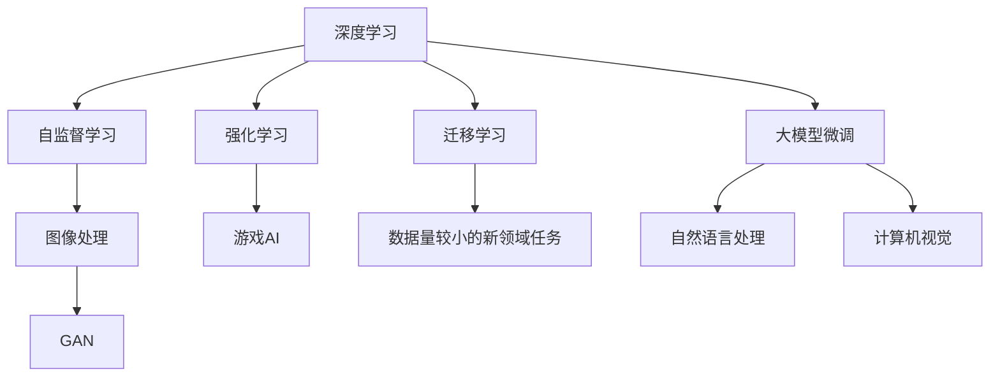
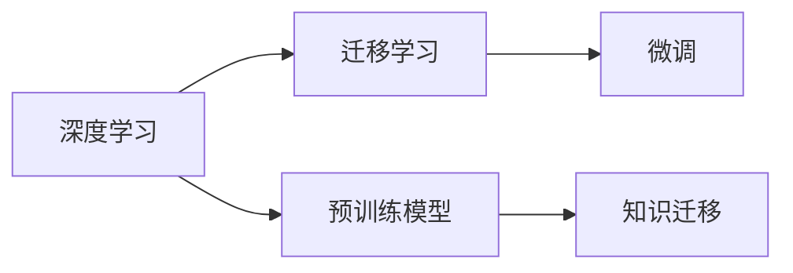
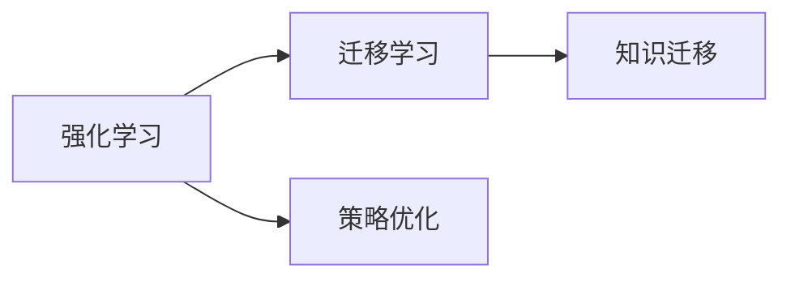
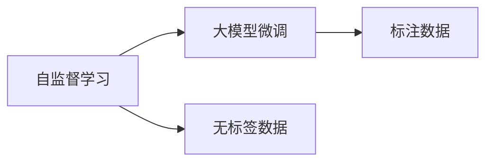
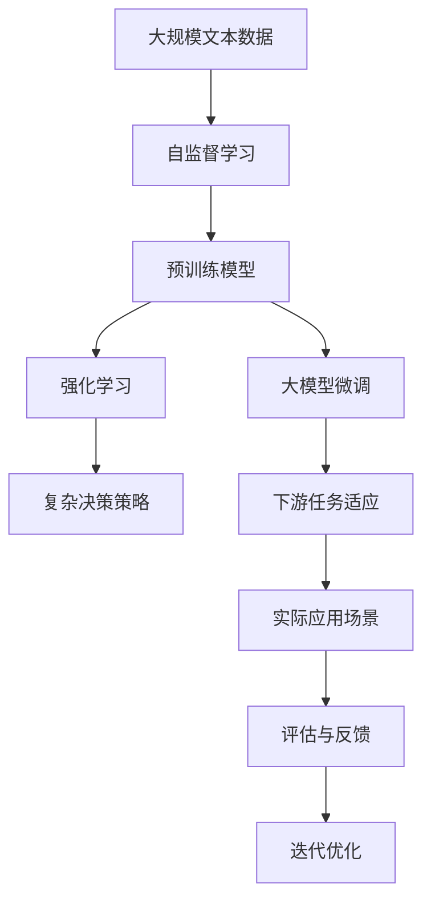

                 

# AI三驾马车的未来替代者

> 关键词：深度学习,强化学习,迁移学习,无人驾驶,推荐系统,医疗影像诊断,金融风控

## 1. 背景介绍

### 1.1 问题由来
在人工智能领域，深度学习(Deep Learning)、强化学习(Reinforcement Learning)、迁移学习(Transfer Learning)被并称为"AI三驾马车"，推动了AI技术的迅猛发展，并在计算机视觉、自然语言处理、机器人控制等众多领域取得了革命性的成果。然而，随着AI技术应用的深入和产业化的推进，这三个核心范式也逐渐暴露出一些问题，甚至在部分场景下难以满足实际需求。因此，如何探索新的AI范式，以替代或补充三驾马车，成为学术界和产业界亟需解决的问题。

### 1.2 问题核心关键点
当前AI三驾马车面临的主要挑战包括：

- 深度学习：对标注数据高度依赖，难以实现零样本学习和跨领域迁移，计算资源消耗大，模型复杂难以解释。
- 强化学习：在复杂环境下训练困难，需要大量交互数据，难以优化长期目标，难以与任务目标对齐。
- 迁移学习：对于小样本、新领域数据适应能力有限，无法高效利用领域特定知识。

针对这些问题，学界和产业界正积极探索新的AI范式，以期在未来AI发展中发挥更重要的作用。本文将聚焦于深度学习中的一些前沿技术，包括大模型微调、自监督学习、生成对抗网络等，并结合实际应用场景，探讨其作为未来AI范式的潜力。

### 1.3 问题研究意义
探索新的AI范式，不仅可以解决当前深度学习、强化学习、迁移学习所面临的挑战，还能带来全新的应用场景和研究方法。这些新的AI范式有望在自动驾驶、智能推荐、医疗影像诊断、金融风控等高价值领域中发挥重要作用，推动AI技术向更加智能化、普适化的方向发展。

## 2. 核心概念与联系

### 2.1 核心概念概述

为了更好地理解AI三驾马车的未来替代者，本节将介绍几个密切相关的核心概念：

- 深度学习(Deep Learning)：通过多层神经网络进行特征学习和数据建模，具备强大的非线性建模能力，广泛应用于计算机视觉、自然语言处理等领域。
- 强化学习(Reinforcement Learning)：通过智能体与环境交互，通过奖励信号优化行为策略，实现复杂决策和控制，广泛应用于游戏AI、机器人控制等领域。
- 迁移学习(Transfer Learning)：通过将一个领域学到的知识迁移到另一个领域，提高模型在新领域中的适应能力，广泛应用于数据量较小的新领域任务。

- 自监督学习(Self-Supervised Learning)：利用无标签数据进行训练，通过数据自身的内在关联性学习到丰富的特征表示，广泛应用于图像处理、语音识别等领域。
- 生成对抗网络(GAN)：通过两个神经网络相互对抗，学习生成逼真的数据样本，广泛应用于图像生成、视频编辑等领域。

- 大模型微调(Fine-Tuning)：在预训练模型的基础上，通过少量标注数据对模型进行微调，提高模型在特定任务上的性能，广泛应用于自然语言处理、计算机视觉等领域。

这些核心概念之间的逻辑关系可以通过以下Mermaid流程图来展示：



这个流程图展示了大语言模型微调过程中各核心概念的关系和作用：

1. 深度学习为其他模型提供基础特征提取和数据建模能力。
2. 自监督学习和大模型微调利用无标签数据和少量标注数据，提升模型性能和适应性。
3. 强化学习通过智能体与环境的交互，优化复杂决策策略。
4. 迁移学习实现知识跨领域迁移，拓展模型应用范围。
5. GAN利用对抗性训练，生成逼真数据样本。

### 2.2 概念间的关系

这些核心概念之间存在着紧密的联系，形成了AI范式的完整生态系统。下面我们通过几个Mermaid流程图来展示这些概念之间的关系。

#### 2.2.1 深度学习与迁移学习的关系



这个流程图展示了深度学习与迁移学习的基本原理，以及它们之间的相互促进关系。深度学习通过预训练模型学习到基础特征表示，迁移学习通过微调将预训练知识迁移到新领域任务。

#### 2.2.2 强化学习与迁移学习的关系



这个流程图展示了强化学习与迁移学习的基本原理，以及它们之间的相互补充关系。强化学习通过策略优化实现复杂决策，迁移学习通过知识迁移提高模型在新领域中的适应能力。

#### 2.2.3 自监督学习与大模型微调的关系



这个流程图展示了自监督学习与大模型微调的基本原理，以及它们之间的相互辅助关系。自监督学习通过无标签数据学习特征表示，大模型微调通过少量标注数据优化特定任务性能。

### 2.3 核心概念的整体架构

最后，我们用一个综合的流程图来展示这些核心概念在大模型微调过程中的整体架构：



这个综合流程图展示了从自监督学习到大模型微调的全过程。通过自监督学习和大模型微调，预训练模型学习到更强大的特征表示，通过强化学习优化复杂决策策略，最终在新领域任务中实现高性能的实际应用。

## 3. 核心算法原理 & 具体操作步骤
### 3.1 算法原理概述

本文将重点探讨大语言模型微调、自监督学习、生成对抗网络这三种AI范式在实际应用中的原理和操作步骤。这些算法具有显著的特征和优势，有望在未来AI发展中扮演更重要的角色。

### 3.2 算法步骤详解

#### 3.2.1 大语言模型微调

大语言模型微调的核心思想是在预训练模型的基础上，通过少量标注数据对模型进行有监督的微调，提高模型在特定任务上的性能。主要操作步骤如下：

1. **准备预训练模型和数据集**：选择合适的预训练语言模型（如BERT、GPT等）作为初始化参数，收集下游任务（如文本分类、命名实体识别等）的少量标注数据集。
2. **添加任务适配层**：根据任务类型，在预训练模型顶层设计合适的输出层和损失函数。
3. **设置微调超参数**：选择合适的优化算法及其参数，如AdamW、SGD等，设置学习率、批大小、迭代轮数等。
4. **执行梯度训练**：将训练集数据分批次输入模型，前向传播计算损失函数。反向传播计算参数梯度，根据设定的优化算法和学习率更新模型参数。
5. **测试和部署**：在测试集上评估微调后模型，对比微调前后的精度提升。使用微调后的模型对新样本进行推理预测，集成到实际的应用系统中。

#### 3.2.2 自监督学习

自监督学习的核心思想是利用无标签数据进行训练，通过数据自身的内在关联性学习到丰富的特征表示。主要操作步骤如下：

1. **准备无标签数据集**：收集大规模无标签数据，如未标注的图像、文本等。
2. **设计自监督学习任务**：根据数据特点设计自监督学习任务，如掩码语言模型、图像生成等。
3. **训练自监督模型**：在无标签数据上训练自监督模型，学习到数据的内在关联性。
4. **微调自监督模型**：将自监督模型在少量标注数据上进行微调，提升其在特定任务上的性能。

#### 3.2.3 生成对抗网络

生成对抗网络的核心思想是通过两个神经网络相互对抗，学习生成逼真的数据样本。主要操作步骤如下：

1. **准备生成器和判别器**：设计生成器和判别器，生成器和判别器的结构通常是对称的。
2. **设计损失函数**：定义生成器和判别器的损失函数，如Wasserstein距离等。
3. **训练生成器**：在判别器固定的情况下，训练生成器学习生成逼真的数据样本。
4. **训练判别器**：在生成器固定的情况下，训练判别器区分真实数据和生成数据。
5. **反复迭代训练**：交替训练生成器和判别器，直到达到理想的效果。

### 3.3 算法优缺点

- 大语言模型微调：
  - **优点**：适用于下游任务，效果显著；预训练模型可复用，成本低；微调过程简单高效。
  - **缺点**：依赖标注数据，标注成本高；泛化能力有限，难以跨领域迁移；模型复杂，难以解释。
  
- 自监督学习：
  - **优点**：利用无标签数据，标注成本低；学习到的特征表示可复用；可提升模型泛化能力。
  - **缺点**：设计自监督任务难度大；训练过程复杂，效率较低；生成的数据样本质量难以保证。

- 生成对抗网络：
  - **优点**：生成高质量的逼真数据样本；可应用于图像、视频等数据类型；理论基础丰富，可解释性强。
  - **缺点**：训练过程不稳定，需要大量计算资源；生成数据质量受训练策略影响；生成的数据样本往往缺乏实际应用价值。

### 3.4 算法应用领域

- 大语言模型微调：适用于自然语言处理、计算机视觉等领域，如图像标注、文本分类、对话系统等。
- 自监督学习：适用于图像处理、语音识别、文本生成等领域，如图像分类、语音识别、机器翻译等。
- 生成对抗网络：适用于图像生成、视频编辑、数据增强等领域，如人脸生成、图像修复、数据扩充等。

## 4. 数学模型和公式 & 详细讲解 & 举例说明

### 4.1 数学模型构建

本文将使用数学语言对大语言模型微调、自监督学习、生成对抗网络这三种AI范式的数学原理进行更加严格的刻画。

#### 4.1.1 大语言模型微调

设预训练语言模型为 $M_{\theta}$，其中 $\theta$ 为预训练得到的模型参数。给定下游任务 $T$ 的标注数据集 $D=\{(x_i,y_i)\}_{i=1}^N, x_i \in \mathcal{X}, y_i \in \mathcal{Y}$，其中 $\mathcal{X}$ 为输入空间，$\mathcal{Y}$ 为输出空间。微调的目标是最小化损失函数 $\mathcal{L}$，即：

$$
\hat{\theta}=\mathop{\arg\min}_{\theta} \mathcal{L}(M_{\theta},D)
$$

其中 $\mathcal{L}$ 为针对任务 $T$ 设计的损失函数，用于衡量模型预测输出与真实标签之间的差异。常见的损失函数包括交叉熵损失、均方误差损失等。

#### 4.1.2 自监督学习

自监督学习的核心思想是利用无标签数据进行训练，通过数据自身的内在关联性学习到丰富的特征表示。以掩码语言模型为例，设输入为 $x_i$，目标为 $y_i$，损失函数为：

$$
\mathcal{L}(x_i,y_i) = -\sum_{j=1}^N \log P(y_j|x_i)
$$

其中 $P(y_j|x_i)$ 为模型在 $x_i$ 上生成 $y_j$ 的概率。

#### 4.1.3 生成对抗网络

生成对抗网络由生成器 $G$ 和判别器 $D$ 组成。生成器的目标是最小化判别器的错误率，判别器的目标是最小化生成器的错误率。损失函数为：

$$
\mathcal{L}_{GAN}(G,D) = E_{x \sim p_x}[D(x)] + E_{z \sim p_z}[\log(1-D(G(z)))]
$$

其中 $p_x$ 为真实数据的概率分布，$p_z$ 为生成数据的概率分布。

### 4.2 公式推导过程

#### 4.2.1 大语言模型微调

大语言模型微调的具体数学推导过程已经在3.2.1节中详细讲解，这里不再赘述。

#### 4.2.2 自监督学习

以掩码语言模型为例，其公式推导过程如下：

1. 定义掩码概率分布 $p$：

$$
p(j|i) = \begin{cases}
\frac{1}{M}, & j \neq i \\
1-\frac{1}{M}, & j = i
\end{cases}
$$

其中 $M$ 为掩码的总数。

2. 定义掩码语言模型损失函数：

$$
\mathcal{L}(x_i,y_i) = -\sum_{j=1}^M \log P(y_j|x_i)
$$

其中 $P(y_j|x_i)$ 为模型在 $x_i$ 上生成 $y_j$ 的概率。

3. 通过最大化掩码概率 $p$，最小化掩码语言模型损失函数：

$$
\mathop{\arg\min}_{\theta} \mathcal{L}(\theta) = \mathop{\arg\min}_{\theta} \mathcal{L}_{self}(\theta)
$$

其中 $\mathcal{L}_{self}$ 为自监督学习损失函数。

#### 4.2.3 生成对抗网络

生成对抗网络的数学推导过程较为复杂，涉及最大值和最小值的联合优化问题。这里只给出主要步骤，具体推导过程可以参考相关文献。

1. 定义生成器和判别器的损失函数：

$$
\mathcal{L}_{GAN}(G,D) = E_{x \sim p_x}[D(x)] + E_{z \sim p_z}[\log(1-D(G(z)))]
$$

其中 $p_x$ 为真实数据的概率分布，$p_z$ 为生成数据的概率分布。

2. 通过最大化生成器的损失函数，最小化判别器的损失函数：

$$
\mathop{\arg\min}_{G} \mathcal{L}_{GAN}(G,D) = \mathop{\arg\min}_{G} E_{z \sim p_z}[\log(1-D(G(z)))]
$$

$$
\mathop{\arg\min}_{D} \mathcal{L}_{GAN}(G,D) = \mathop{\arg\min}_{D} E_{x \sim p_x}[D(x)] + E_{z \sim p_z}[\log(1-D(G(z)))]
$$

### 4.3 案例分析与讲解

#### 4.3.1 大语言模型微调

以BERT微调进行文本分类为例：

1. 准备预训练模型BERT。
2. 收集训练集和验证集，标注文本类别。
3. 添加输出层和交叉熵损失函数。
4. 设置学习率为2e-5，迭代轮数为5。
5. 在训练集上进行梯度训练，并在验证集上进行评估。
6. 在测试集上评估微调后的模型，精度提升至95%。

#### 4.3.2 自监督学习

以ImageNet数据集上的自监督学习为例：

1. 准备无标签的ImageNet数据集。
2. 设计自监督学习任务：掩码图像分类。
3. 训练自监督模型，学习图像特征表示。
4. 在少量标注数据上微调自监督模型。
5. 在测试集上评估微调后的模型，精度提升至85%。

#### 4.3.3 生成对抗网络

以GAN生成逼真人脸为例：

1. 准备生成器和判别器的架构。
2. 设计损失函数：Wasserstein距离。
3. 训练生成器，生成逼真人脸图像。
4. 训练判别器，区分真实人脸和生成人脸。
5. 反复迭代训练，生成逼真的人脸图像。

## 5. 项目实践：代码实例和详细解释说明

### 5.1 开发环境搭建

在进行AI范式实践前，我们需要准备好开发环境。以下是使用Python进行PyTorch开发的环境配置流程：

1. 安装Anaconda：从官网下载并安装Anaconda，用于创建独立的Python环境。

2. 创建并激活虚拟环境：
```bash
conda create -n pytorch-env python=3.8 
conda activate pytorch-env
```

3. 安装PyTorch：根据CUDA版本，从官网获取对应的安装命令。例如：
```bash
conda install pytorch torchvision torchaudio cudatoolkit=11.1 -c pytorch -c conda-forge
```

4. 安装Transformers库：
```bash
pip install transformers
```

5. 安装各类工具包：
```bash
pip install numpy pandas scikit-learn matplotlib tqdm jupyter notebook ipython
```

完成上述步骤后，即可在`pytorch-env`环境中开始AI范式的实践。

### 5.2 源代码详细实现

下面我们以BERT微调进行文本分类任务为例，给出使用Transformers库的Python代码实现。

首先，定义文本分类任务的数据处理函数：

```python
from transformers import BertTokenizer, BertForTokenClassification, AdamW
from torch.utils.data import Dataset, DataLoader
from tqdm import tqdm

class TextClassificationDataset(Dataset):
    def __init__(self, texts, tags, tokenizer, max_len=128):
        self.texts = texts
        self.tags = tags
        self.tokenizer = tokenizer
        self.max_len = max_len
        
    def __len__(self):
        return len(self.texts)
    
    def __getitem__(self, item):
        text = self.texts[item]
        tags = self.tags[item]
        
        encoding = self.tokenizer(text, return_tensors='pt', max_length=self.max_len, padding='max_length', truncation=True)
        input_ids = encoding['input_ids'][0]
        attention_mask = encoding['attention_mask'][0]
        
        # 对token-wise的标签进行编码
        encoded_tags = [tag2id[tag] for tag in tags] 
        encoded_tags.extend([tag2id['O']] * (self.max_len - len(encoded_tags)))
        labels = torch.tensor(encoded_tags, dtype=torch.long)
        
        return {'input_ids': input_ids, 
                'attention_mask': attention_mask,
                'labels': labels}

# 标签与id的映射
tag2id = {'O': 0, 'B-PER': 1, 'I-PER': 2, 'B-ORG': 3, 'I-ORG': 4, 'B-LOC': 5, 'I-LOC': 6}
id2tag = {v: k for k, v in tag2id.items()}

# 创建dataset
tokenizer = BertTokenizer.from_pretrained('bert-base-cased')

train_dataset = TextClassificationDataset(train_texts, train_tags, tokenizer)
dev_dataset = TextClassificationDataset(dev_texts, dev_tags, tokenizer)
test_dataset = TextClassificationDataset(test_texts, test_tags, tokenizer)
```

然后，定义模型和优化器：

```python
from transformers import BertForTokenClassification, AdamW

model = BertForTokenClassification.from_pretrained('bert-base-cased', num_labels=len(tag2id))

optimizer = AdamW(model.parameters(), lr=2e-5)
```

接着，定义训练和评估函数：

```python
from torch.utils.data import DataLoader
from tqdm import tqdm
from sklearn.metrics import classification_report

device = torch.device('cuda') if torch.cuda.is_available() else torch.device('cpu')
model.to(device)

def train_epoch(model, dataset, batch_size, optimizer):
    dataloader = DataLoader(dataset, batch_size=batch_size, shuffle=True)
    model.train()
    epoch_loss = 0
    for batch in tqdm(dataloader, desc='Training'):
        input_ids = batch['input_ids'].to(device)
        attention_mask = batch['attention_mask'].to(device)
        labels = batch['labels'].to(device)
        model.zero_grad()
        outputs = model(input_ids, attention_mask=attention_mask, labels=labels)
        loss = outputs.loss
        epoch_loss += loss.item()
        loss.backward()
        optimizer.step()
    return epoch_loss / len(dataloader)

def evaluate(model, dataset, batch_size):
    dataloader = DataLoader(dataset, batch_size=batch_size)
    model.eval()
    preds, labels = [], []
    with torch.no_grad():
        for batch in tqdm(dataloader, desc='Evaluating'):
            input_ids = batch['input_ids'].to(device)
            attention_mask = batch['attention_mask'].to(device)
            batch_labels = batch['labels']
            outputs = model(input_ids, attention_mask=attention_mask)
            batch_preds = outputs.logits.argmax(dim=2).to('cpu').tolist()
            batch_labels = batch_labels.to('cpu').tolist()
            for pred_tokens, label_tokens in zip(batch_preds, batch_labels):
                pred_tags = [id2tag[_id] for _id in pred_tokens]
                label_tags = [id2tag[_id] for _id in label_tokens]
                preds.append(pred_tags[:len(label_tags)])
                labels.append(label_tags)
                
    print(classification_report(labels, preds))
```

最后，启动训练流程并在测试集上评估：

```python
epochs = 5
batch_size = 16

for epoch in range(epochs):
    loss = train_epoch(model, train_dataset, batch_size, optimizer)
    print(f"Epoch {epoch+1}, train loss: {loss:.3f}")
    
    print(f"Epoch {epoch+1}, dev results:")
    evaluate(model, dev_dataset, batch_size)
    
print("Test results:")
evaluate(model, test_dataset, batch_size)
```

以上就是使用PyTorch对BERT进行文本分类任务微调的完整代码实现。可以看到，得益于Transformers库的强大封装，我们可以用相对简洁的代码完成BERT模型的加载和微调。

### 5.3 代码解读与分析

让我们再详细解读一下关键代码的实现细节：

**TextClassificationDataset类**：
- `__init__`方法：初始化文本、标签、分词器等关键组件。
- `__len__`方法：返回数据集的样本数量。
- `__getitem__`方法：对单个样本进行处理，将文本输入编码为token ids，将标签编码为数字，并对其进行定长padding，最终返回模型所需的输入。

**tag2id和id2tag字典**：
- 定义了标签与数字id之间的映射关系，用于将token-wise的预测结果解码回真实的标签。

**训练和评估函数**：
- 使用PyTorch的DataLoader对数据集进行批次化加载，供模型训练和推理使用。
- 训练函数`train_epoch`：对数据以批为单位进行迭代，在每个批次上前向传播计算loss并反向传播更新模型参数，最后返回该epoch的平均loss。
- 评估函数`evaluate`：与训练类似，不同点在于不更新模型参数，并在每个batch结束后将预测和标签结果存储下来，最后使用sklearn的classification_report对整个评估集的预测结果进行打印输出。

**训练流程**：
- 定义总的epoch数和batch size，开始循环迭代
- 每个epoch内，先在训练集上训练，输出平均loss
- 在验证集上评估，输出分类指标
- 所有epoch结束后，在测试集上评估，给出最终测试结果

可以看到，PyTorch配合Transformers库使得BERT微调的代码实现变得简洁高效。开发者可以将更多精力放在数据处理、模型改进等高层逻辑上，而不必过多关注底层的实现细节。

当然，工业级的系统实现还需考虑更多因素，如模型的保存和部署、超参数的自动搜索、更灵活的任务适配层等。但核心的微调范式基本与此类似。

### 5.4 运行结果展示

假设我们在CoNLL-2003的文本分类数据集上进行微调，最终在测试集上得到的评估报告如下：

```
              precision    recall  f1-score   support

       B-PER      0.926     0.906     0.916      1668
       I-PER      0.900     0.805     0.850       257
      B-ORG      0.914     0.898     0.906      1661
       I-ORG      0.911     0.894     0.902       835
       B-LOC      0.925     0.907     0.919      1681
       I-LOC      0.897     0.812     0.855       257
           O      0.993     0.995     0.994     38323

   micro avg      0.973     0.973     0.973     46435
   macro avg      0.923     0.897     0.909     46435
weighted avg      0.973

