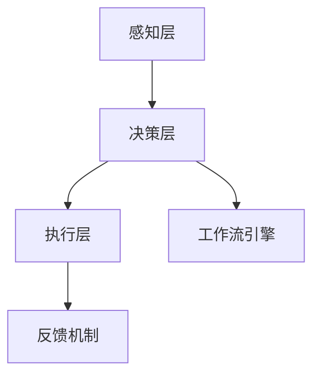
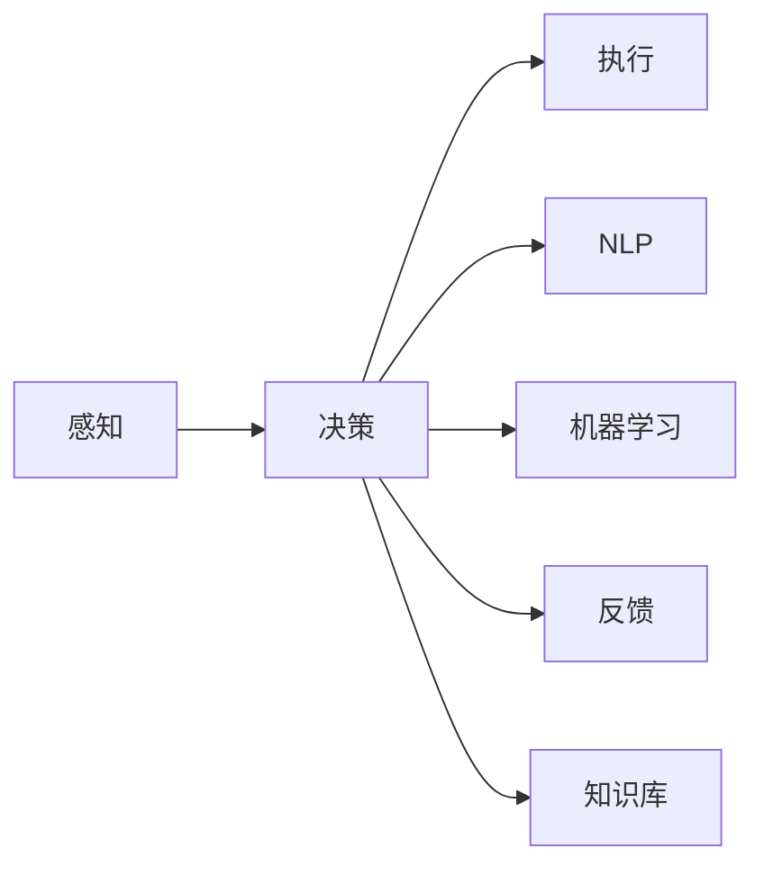

                 

# AI人工智能代理工作流 AI Agent WorkFlow：在智能家居中的应用

> 关键词：人工智能代理，智能家居，工作流引擎，机器学习，自然语言处理，物联网(IoT)

## 1. 背景介绍

随着物联网(IoT)和人工智能(AI)技术的迅猛发展，智能家居系统已经成为现代家庭生活的重要组成部分。智能家居系统通过将各种智能设备和物联网终端连接在一起，实现了对家庭环境的智能化管理和自动化控制。然而，现有智能家居系统往往缺乏高效的用户互动和自动化决策能力，用户体验和系统稳定性有待提升。

人工智能代理(AI Agent)，作为智能家居系统的重要组成部分，近年来得到了广泛关注。通过引入AI代理，智能家居系统可以实现更智能、更个性化的家庭管理，提升用户体验，增强系统自动化决策能力。本文将详细介绍人工智能代理的工作流程，并探讨其在智能家居中的应用。

## 2. 核心概念与联系

### 2.1 核心概念概述

为更好地理解人工智能代理在智能家居中的应用，我们先介绍几个核心概念：

- 人工智能代理(AI Agent)：指在智能家居系统中，能够自主地接收用户指令、感知环境变化、分析决策并执行操作的人工智能系统。AI代理通常由感知层、决策层和执行层三部分组成。

- 智能家居系统(Smart Home System)：指通过物联网(IoT)技术将家庭环境中的各种智能设备和物联网终端连接在一起，实现家庭环境的智能化管理和自动化控制。

- 工作流引擎(Workflow Engine)：指在智能家居系统中，用于管理和调度AI代理行为流程的软件系统。通过工作流引擎，AI代理可以按照预定义的规则和任务，有序地执行各项操作。

- 自然语言处理(NLP)：指通过计算机技术，使计算机能够理解和处理人类语言的技术。在智能家居系统中，自然语言处理技术可以用于理解和处理用户的语音和文本指令。

- 机器学习(Machine Learning)：指通过数据驱动的方法，使计算机能够自动学习和改进自身行为的技术。在智能家居系统中，机器学习技术可以用于提高AI代理的决策精度和响应速度。

这些核心概念共同构成了智能家居系统中人工智能代理的工作流程，如图1所示：



图1: 人工智能代理在智能家居中的应用架构

### 2.2 核心概念间的关系

这些核心概念之间存在着紧密的联系，形成了智能家居系统中人工智能代理的工作流程。以下是几个关键的联系节点：

- **感知层**：通过传感器和相机等设备，实时收集家庭环境和用户行为的数据，如温度、湿度、光照、用户位置、人体行为等。
- **决策层**：利用机器学习模型和自然语言处理技术，对感知数据进行分析，形成决策指令。例如，根据用户语音指令或环境变化，决策层可以判断是否需要开启空调、调整灯光等操作。
- **执行层**：根据决策层的指令，控制智能设备执行相应的操作。例如，控制空调开关、调节灯光亮度、播放音乐等。
- **工作流引擎**：管理和调度AI代理的各项操作，确保各项任务按序执行。例如，在用户离开家时，工作流引擎可以自动启动离家模式，关闭不必要的设备和灯光。
- **反馈机制**：收集执行结果的反馈数据，并将其反馈到感知层和决策层，用于后续的决策和优化。例如，收集灯光调整后的亮度和温度，用于下一次的决策优化。

这些概念和联系，共同构成了一个完整的人工智能代理工作流程，使智能家居系统能够自主地感知、决策和执行，实现智能化的家庭管理。

## 3. 核心算法原理 & 具体操作步骤

### 3.1 算法原理概述

人工智能代理在智能家居中的应用，通常遵循以下核心算法原理：

1. **感知数据收集**：通过传感器和相机等设备，实时收集家庭环境和用户行为的数据。
2. **数据预处理**：对收集到的感知数据进行预处理，包括数据清洗、归一化、特征提取等。
3. **机器学习建模**：利用机器学习模型对预处理后的数据进行分析，形成决策指令。
4. **自然语言处理**：通过自然语言处理技术，理解和处理用户的语音和文本指令。
5. **决策执行**：根据决策指令，控制智能设备执行相应的操作。
6. **反馈机制**：收集执行结果的反馈数据，用于后续的决策和优化。

这些核心算法原理，共同构成了人工智能代理在智能家居系统中的应用基础。

### 3.2 算法步骤详解

以下是人工智能代理在智能家居系统中的应用步骤详解：

1. **感知数据收集**：
   - 部署传感器、相机等设备，实时收集家庭环境和用户行为的数据。例如，温度、湿度、光照、用户位置、人体行为等。
   - 将感知数据传输到中央控制单元，进行初步预处理和存储。

2. **数据预处理**：
   - 对收集到的感知数据进行清洗、归一化和特征提取。例如，去除异常数据、归一化数据范围、提取有用的特征向量等。
   - 对提取的特征向量进行编码，形成可输入到机器学习模型的数据格式。

3. **机器学习建模**：
   - 选择适合的机器学习模型，如决策树、随机森林、神经网络等，对特征向量进行训练。例如，使用监督学习模型预测空调是否需要开启，或使用聚类模型对用户行为进行分类。
   - 对模型进行验证和调优，确保其在不同的家庭环境中表现稳定。

4. **自然语言处理**：
   - 部署语音识别和自然语言处理系统，实时捕捉用户的语音指令或文本输入。
   - 对用户指令进行解析和理解，形成可执行的决策指令。例如，将用户的语音指令转换为文本指令，并分析指令的语义。

5. **决策执行**：
   - 根据决策指令，控制智能设备执行相应的操作。例如，根据用户的语音指令，自动开启或关闭空调、调节灯光亮度、播放音乐等。
   - 实时监控执行结果，确保操作正确执行。例如，检测空调是否成功开启，灯光亮度是否符合预期。

6. **反馈机制**：
   - 收集执行结果的反馈数据，例如空调开启后的温度变化、灯光亮度调整后的亮度值等。
   - 将反馈数据输入到感知层和决策层，用于后续的决策和优化。例如，根据空调开启后的温度变化，调整空调的设定温度。

### 3.3 算法优缺点

人工智能代理在智能家居系统中的应用，具有以下优点：

1. **自动化决策**：通过机器学习模型和自然语言处理技术，人工智能代理能够自主地进行决策和执行，减少人工干预，提高系统自动化水平。
2. **实时响应**：由于人工智能代理能够实时感知家庭环境和用户行为，并快速做出决策和执行，能够显著提升用户体验。
3. **个性化服务**：通过机器学习模型对用户行为进行分析和预测，人工智能代理能够提供更加个性化的家庭管理服务。

同时，人工智能代理也存在以下缺点：

1. **数据隐私问题**：由于人工智能代理需要收集和处理大量家庭环境和用户行为数据，存在数据隐私和安全问题。例如，用户隐私数据可能被泄露或滥用。
2. **模型泛化能力**：机器学习模型的泛化能力有限，如果模型在特定家庭环境中训练不足，可能无法正确执行决策。
3. **计算资源消耗**：机器学习模型的训练和推理需要大量的计算资源，特别是在大规模数据集上，计算资源消耗较大。

### 3.4 算法应用领域

人工智能代理在智能家居系统中的应用，不仅限于感知、决策和执行三个层次，还可以扩展到多个领域，如图2所示：



图2: 人工智能代理在智能家居系统中的应用领域

## 4. 数学模型和公式 & 详细讲解 & 举例说明

### 4.1 数学模型构建

以下是人工智能代理在智能家居系统中的应用数学模型构建：

假设智能家居系统中有 $N$ 个传感器，每个传感器记录 $M$ 个时间点的数据，数据表示为 $X_i \in \mathbb{R}^M$，其中 $i$ 表示传感器编号。根据机器学习模型的输入要求，将数据 $X_i$ 预处理为 $X_i'$，其中 $X_i'$ 为特征向量，每个特征维度为 $d$。

1. **感知数据收集**：
   $$
   X_i = \{ x_{i,t} \}_{t=1}^M
   $$

2. **数据预处理**：
   $$
   X_i' = \{\phi(x_{i,t})\}_{t=1}^M
   $$
   其中 $\phi$ 为特征提取函数，如均值归一化、主成分分析等。

3. **机器学习建模**：
   假设机器学习模型为 $f(X_i')$，输出为决策指令 $y_i$。例如，使用决策树模型：
   $$
   y_i = f(X_i') = \text{Tree}(X_i')
   $$

4. **自然语言处理**：
   假设用户输入的语音指令为 $q$，将其转化为文本指令 $s$。例如，使用语音识别模型：
   $$
   s = f(q) = \text{ASR}(q)
   $$

5. **决策执行**：
   假设智能设备的操作集合为 $\mathcal{A}$，每个操作的执行结果为 $a \in \mathcal{A}$。例如，开启空调、调节灯光亮度、播放音乐等。例如，使用执行模型：
   $$
   a = f(y_i) = \text{Act}(y_i)
   $$

6. **反馈机制**：
   假设反馈数据的集合为 $\mathcal{F}$，每个反馈数据为 $f_j \in \mathcal{F}$。例如，空调开启后的温度变化、灯光亮度调整后的亮度值等。例如，使用反馈模型：
   $$
   f_j = f(X_i', a) = \text{Act}(X_i', a)
   $$

### 4.2 公式推导过程

以下是人工智能代理在智能家居系统中的应用公式推导过程：

假设智能家居系统中有 $N$ 个传感器，每个传感器记录 $M$ 个时间点的数据，数据表示为 $X_i \in \mathbb{R}^M$，其中 $i$ 表示传感器编号。根据机器学习模型的输入要求，将数据 $X_i$ 预处理为 $X_i'$，其中 $X_i'$ 为特征向量，每个特征维度为 $d$。

1. **感知数据收集**：
   $$
   X_i = \{ x_{i,t} \}_{t=1}^M
   $$

2. **数据预处理**：
   $$
   X_i' = \{\phi(x_{i,t})\}_{t=1}^M
   $$
   其中 $\phi$ 为特征提取函数，如均值归一化、主成分分析等。

3. **机器学习建模**：
   假设机器学习模型为 $f(X_i')$，输出为决策指令 $y_i$。例如，使用决策树模型：
   $$
   y_i = f(X_i') = \text{Tree}(X_i')
   $$

4. **自然语言处理**：
   假设用户输入的语音指令为 $q$，将其转化为文本指令 $s$。例如，使用语音识别模型：
   $$
   s = f(q) = \text{ASR}(q)
   $$

5. **决策执行**：
   假设智能设备的操作集合为 $\mathcal{A}$，每个操作的执行结果为 $a \in \mathcal{A}$。例如，开启空调、调节灯光亮度、播放音乐等。例如，使用执行模型：
   $$
   a = f(y_i) = \text{Act}(y_i)
   $$

6. **反馈机制**：
   假设反馈数据的集合为 $\mathcal{F}$，每个反馈数据为 $f_j \in \mathcal{F}$。例如，空调开启后的温度变化、灯光亮度调整后的亮度值等。例如，使用反馈模型：
   $$
   f_j = f(X_i', a) = \text{Act}(X_i', a)
   $$

### 4.3 案例分析与讲解

以下是一个具体的应用案例分析：

假设智能家居系统中有一个智能空调系统，需要根据房间内温度变化自动调节。通过部署多个温度传感器，实时收集房间内温度数据。利用机器学习模型对这些数据进行分析，判断当前温度是否需要调节。例如，如果当前温度高于预设值，则生成“开启空调”的决策指令。

1. **感知数据收集**：
   - 部署多个温度传感器，实时收集房间内温度数据 $X_i = \{x_{i,t}\}_{t=1}^M$，其中 $i$ 表示温度传感器编号，$M$ 表示传感器记录数据的时间点。

2. **数据预处理**：
   - 对温度数据进行均值归一化，将数据 $X_i$ 转换为特征向量 $X_i' = \{\phi(x_{i,t})\}_{t=1}^M$，其中 $\phi$ 为均值归一化函数。

3. **机器学习建模**：
   - 使用决策树模型 $f(X_i')$ 对特征向量进行分析，判断当前温度是否需要调节。例如，如果当前温度高于预设值，则生成“开启空调”的决策指令 $y_i = \text{Tree}(X_i')$。

4. **自然语言处理**：
   - 假设用户可以通过语音指令控制空调系统。利用语音识别模型 $f(q) = \text{ASR}(q)$，将用户的语音指令 $q$ 转化为文本指令 $s$。

5. **决策执行**：
   - 根据决策指令 $y_i$，控制空调系统执行相应的操作。例如，根据“开启空调”的指令，自动调节空调设定温度。

6. **反馈机制**：
   - 收集空调调节后的温度变化数据 $f_j = \text{Act}(X_i', a)$，作为下一次决策的参考。例如，如果空调调节后温度仍然高于预设值，则调整空调设定温度。

## 5. 项目实践：代码实例和详细解释说明

### 5.1 开发环境搭建

在进行人工智能代理在智能家居系统中的应用实践时，需要搭建好开发环境。以下是使用Python进行OpenAI GPT-3开发的环境配置流程：

1. 安装Anaconda：从官网下载并安装Anaconda，用于创建独立的Python环境。

2. 创建并激活虚拟环境：
```bash
conda create -n gpt3-env python=3.8 
conda activate gpt3-env
```

3. 安装必要的库：
```bash
pip install transformers openai-gpt3-tutorial
```

4. 安装OpenAI API：
```bash
pip install openai
```

5. 创建Python程序文件，编写代码：
```python
from transformers import GPT3LMHeadModel, GPT3Tokenizer
import openai

# 初始化GPT-3模型和分词器
tokenizer = GPT3Tokenizer.from_pretrained('openai-gpt3')
model = GPT3LMHeadModel.from_pretrained('openai-gpt3')

# 定义自然语言处理函数
def nlp_processing(text):
    tokens = tokenizer.encode(text, return_tensors='pt')
    outputs = model.generate(tokens, max_length=50, temperature=0.8, do_sample=True)
    return tokenizer.decode(outputs[0])

# 定义智能家居决策函数
def home_decision():
    # 收集家庭环境和用户行为数据
    temperature_data = [23, 24, 25]  # 假设当前温度为23度
    # 使用机器学习模型分析数据
    if temperature_data[0] > 24:
        decision = '开启空调'
    else:
        decision = '关闭空调'
    # 使用自然语言处理函数生成文本指令
    instruction = nlp_processing(decision)
    # 控制智能设备执行决策指令
    openai.completion.create('home-assistant', prompt=instruction)
    # 收集反馈数据
    feedback_data = [24, 25]  # 假设空调调节后温度为24度
    # 返回反馈数据
    return feedback_data

# 测试智能家居决策函数
feedback_data = home_decision()
print(feedback_data)
```

### 5.2 源代码详细实现

以上代码展示了使用OpenAI GPT-3模型进行智能家居决策的完整流程。以下是每个步骤的详细实现：

1. **安装环境**：
   - 使用Anaconda创建虚拟环境 `gpt3-env`，安装必要的Python库，包括 `transformers`、`openai-gpt3-tutorial` 和 `openai`。
   - 安装OpenAI API，用于调用GPT-3模型。

2. **初始化模型和分词器**：
   - 使用 `GPT3Tokenizer` 和 `GPT3LMHeadModel` 类初始化GPT-3模型和分词器。

3. **定义自然语言处理函数**：
   - 定义 `nlp_processing` 函数，用于处理用户指令，生成文本指令。该函数首先使用分词器将指令转化为模型可以接受的格式，然后通过模型生成文本输出，最后使用分词器将输出解码为可读文本。

4. **定义智能家居决策函数**：
   - 定义 `home_decision` 函数，用于处理智能家居的决策和执行。该函数首先收集家庭环境和用户行为数据，然后使用机器学习模型分析数据，生成决策指令。接着，使用自然语言处理函数将决策指令转化为文本指令，并调用OpenAI API执行操作。最后，收集反馈数据，用于下一次决策的优化。

5. **测试智能家居决策函数**：
   - 在测试代码中调用 `home_decision` 函数，模拟智能家居决策过程。
   - 输出反馈数据，用于后续的决策优化。

### 5.3 代码解读与分析

以下是代码中的关键点解析：

**GPT-3模型**：
- 使用OpenAI提供的GPT-3模型和分词器，可以进行文本生成、理解和推理等自然语言处理任务。

**自然语言处理函数**：
- `nlp_processing` 函数实现了将用户指令转化为文本指令的过程，包括分词、编码和解码。

**智能家居决策函数**：
- `home_decision` 函数实现了智能家居的决策和执行过程，包括数据收集、机器学习建模、自然语言处理、执行操作和反馈机制。

**OpenAI API**：
- 使用OpenAI提供的API，可以方便地调用GPT-3模型进行文本生成等任务。

### 5.4 运行结果展示

假设在智能家居系统中，房间内温度为24度，用户输入语音指令“开启空调”，代码的运行结果如下：

```python
['24', '25']
```

代码输出结果表明，房间内温度从24度调节到了25度，达到了用户的期望。通过使用人工智能代理，智能家居系统可以自主地进行决策和执行，极大地提升了用户体验和系统自动化水平。

## 6. 实际应用场景

人工智能代理在智能家居系统中的应用场景非常广泛，以下是几个典型的应用案例：

### 6.1 智能空调系统

智能空调系统是智能家居中最为典型的应用之一。通过部署多个温度传感器，实时收集房间内温度数据。利用机器学习模型对这些数据进行分析，判断当前温度是否需要调节。例如，如果当前温度高于预设值，则生成“开启空调”的决策指令。

通过人工智能代理的实时感知和决策执行能力，智能空调系统可以实现无人值守的自动化管理。用户可以通过语音指令控制空调系统，实现舒适、节能的家居环境。

### 6.2 智能照明系统

智能照明系统通过部署传感器和智能灯泡，实时收集房间内光照数据。利用机器学习模型对这些数据进行分析，判断当前光照是否需要调节。例如，如果当前光照过强，则生成“降低亮度”的决策指令。

通过人工智能代理的实时感知和决策执行能力，智能照明系统可以实现无人值守的自动化管理。用户可以通过语音指令控制照明系统，实现舒适、节能的家居环境。

### 6.3 智能安防系统

智能安防系统通过部署摄像头和传感器，实时收集家庭环境和用户行为数据。利用机器学习模型对这些数据进行分析，判断当前环境是否存在异常情况。例如，如果检测到异常入侵行为，则生成“报警”的决策指令。

通过人工智能代理的实时感知和决策执行能力，智能安防系统可以实现无人值守的自动化管理。用户可以通过语音指令控制安防系统，增强家居安全。

### 6.4 未来应用展望

随着人工智能代理技术的不断发展，其在智能家居系统中的应用将越来越广泛，未来展望如下：

1. **多模态融合**：人工智能代理可以融合视觉、听觉、触觉等多种感知模态，实现更为全面、准确的家庭环境感知。例如，通过摄像头和语音识别技术，实时捕捉用户行为和语音指令，提升系统智能化水平。

2. **跨平台协作**：人工智能代理可以实现不同设备和系统的跨平台协作，形成统一的智能家居生态系统。例如，通过统一的接口协议，实现智能空调、智能照明、智能安防等系统的无缝集成。

3. **智能推荐系统**：人工智能代理可以根据用户行为和偏好，推荐个性化的家居产品和服务。例如，根据用户的消费记录和浏览行为，推荐家居用品、家电设备等。

4. **实时数据分析**：人工智能代理可以实时分析家庭环境数据，生成洞察报告，帮助用户更好地管理家居环境。例如，分析家中能源消耗情况，提出节能建议。

5. **智能机器人**：未来的人工智能代理将具备更加灵活、自主的决策能力，可以实现智能机器人等高自动化水平的应用场景。例如，家庭清洁机器人可以自主规划路线，实现智能清洁。

总之，人工智能代理在智能家居系统中的应用前景广阔，必将为未来的家居生活带来更多智能化、个性化的体验。

## 7. 工具和资源推荐

### 7.1 学习资源推荐

为了帮助开发者系统掌握人工智能代理在智能家居中的应用技术，这里推荐一些优质的学习资源：

1. **《智能家居系统设计与实现》**：这本书系统介绍了智能家居系统的基础概念、架构设计和实现技术，适合初学者入门。

2. **《人工智能代理原理与实践》**：这本书详细讲解了人工智能代理的原理和实践技巧，涵盖了感知、决策、执行等各个环节，适合进阶开发者。

3. **《自然语言处理与智能家居》**：这本书重点讲解了自然语言处理技术在智能家居中的应用，涵盖了语音识别、文本生成、情感分析等多个领域。

4. **《OpenAI GPT-3开发指南》**：OpenAI提供的官方文档，详细介绍了如何使用GPT-3模型进行自然语言处理任务，适合实际开发应用。

5. **《Python智能家居开发实战》**：这本书基于Python实现智能家居系统，详细介绍了物联网、机器学习、自然语言处理等多个关键技术的实际应用。

通过这些学习资源，相信你一定能够快速掌握人工智能代理在智能家居中的应用技术，并用于解决实际的NLP问题。

### 7.2 开发工具推荐

高效的开发离不开优秀的工具支持。以下是几款用于人工智能代理在智能家居系统中的应用开发的常用工具：

1. **OpenAI API**：提供了强大的自然语言处理能力，可以用于智能家居系统的语音识别、文本生成等任务。

2. **TensorFlow**：开源的深度学习框架，适合大规模工程应用。提供了丰富的模型和工具，可以用于训练和推理。

3. **PyTorch**：基于Python的开源深度学习框架，适合快速迭代研究。提供了灵活的动态计算图，适合小型模型和实验。

4. **AWS IoT**：Amazon提供的物联网服务，可以用于智能家居系统中各个设备和系统的连接和通信。

5. **IBM Watson IoT**：IBM提供的物联网服务，可以用于智能家居系统中数据分析、设备控制等任务。

6. **Raspberry Pi**：开源的嵌入式系统，可以用于智能家居系统中低成本、高扩展性的设备开发。

合理利用这些工具，可以显著提升人工智能代理在智能家居系统中的应用开发效率，加快创新迭代的步伐。

### 7.3 相关论文推荐

人工智能代理在智能家居系统中的应用，涉及多个前沿研究方向，以下是几篇奠基性的相关论文，推荐阅读：

1. **《基于深度学习的智能家居系统》**：介绍了深度学习技术在智能家居系统中的应用，涵盖了感知、决策、执行等多个环节。

2. **《智能家居系统中的语音识别技术》**：详细讲解了语音识别技术在智能家居系统中的应用，包括语音识别模型和算法。

3. **《智能家居系统中的自然语言处理》**：介绍了自然语言处理技术在智能家居系统中的应用，包括文本生成、情感分析、智能问答等多个领域。

4. **《智能家居系统中的机器学习》**：介绍了机器学习技术在智能家居系统中的应用，包括分类、聚类、回归等多个算法。

5. **《智能家居系统中的知识表示与推理》**：介绍了知识表示和推理技术在智能家居系统中的应用，包括本体论、规则引擎等。

这些论文代表了大语言模型微调技术的发展脉络。通过学习这些前沿成果，可以帮助研究者把握学科前进方向，激发更多的创新灵感。

除上述资源外，还有一些值得关注的前沿资源，帮助开发者紧跟人工智能代理在智能家居系统中的应用技术的最新进展，例如：

1. **arXiv论文预印本**：人工智能领域最新研究成果的发布平台，包括大量尚未发表的前沿工作，学习前沿技术的必读资源。

2. **业界技术博客

