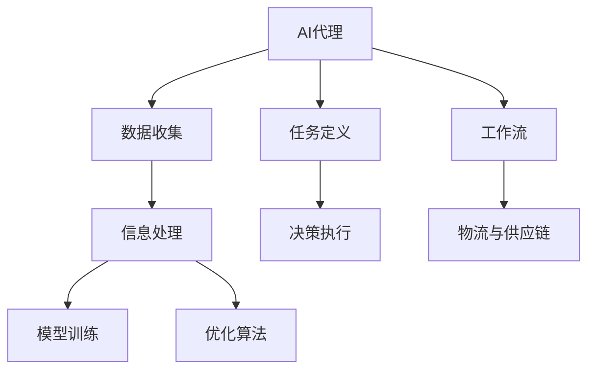
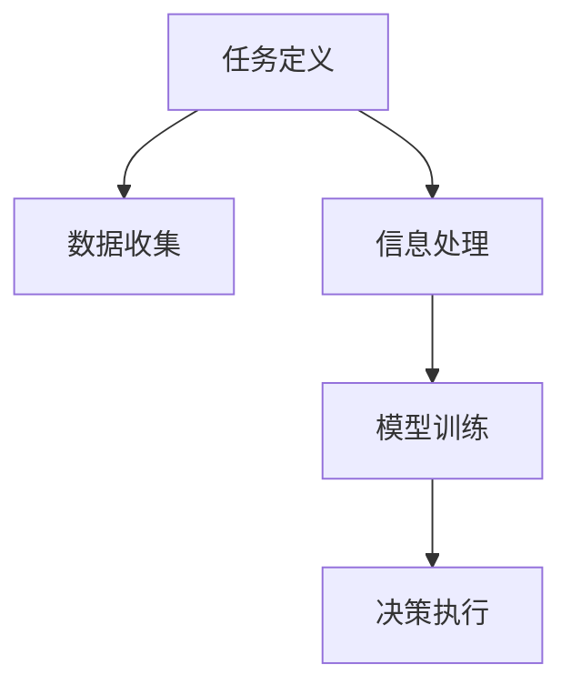
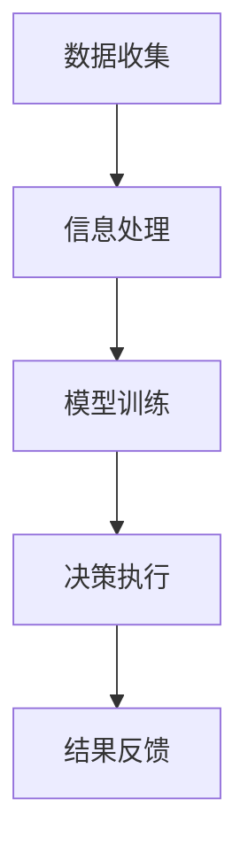
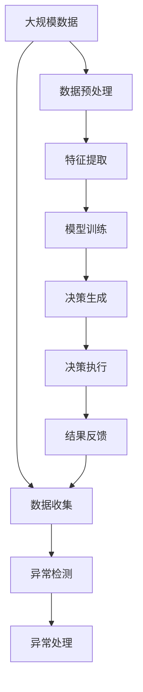

                 

# AI人工智能代理工作流 AI Agent WorkFlow：在物流与供应链中的应用

## 1. 背景介绍

### 1.1 问题由来

在现代社会，物流与供应链管理已经成为国民经济的重要组成部分，对提高企业竞争力和促进社会经济发展具有重要意义。传统的物流与供应链管理主要依赖人工决策，受限于人工经验与效率，难以满足日益增长的业务需求。随着人工智能技术的快速发展，利用人工智能代理工作流(AI Agent Workflow)提高物流与供应链管理的智能化水平，成为近年来的研究热点。

人工智能代理工作流，是指将人工智能技术嵌入物流与供应链管理的各个环节，通过智能化的决策、监控和执行，优化物流与供应链流程，提升整体运营效率。其中，物流与供应链中的核心问题包括货物运输、库存管理、配送调度等。本文将重点讨论如何在这些核心问题上应用AI代理工作流，并探讨其未来应用前景。

### 1.2 问题核心关键点

人工智能代理工作流在物流与供应链中的应用，主要涉及以下几个核心关键点：

- **AI代理**：即人工智能代理模型，指利用机器学习、深度学习等技术，构建能够模仿人类决策和执行的智能系统。
- **工作流**：指系统从数据获取、信息处理到决策执行的完整流程，涵盖数据收集、预处理、建模、优化等环节。
- **物流与供应链管理**：包括货物运输、库存管理、配送调度等具体任务，通过AI代理工作流优化管理流程，提高效率和精度。

这些关键点之间相互关联，通过优化物流与供应链中的数据处理和决策执行流程，提升整体管理水平。

## 2. 核心概念与联系

### 2.1 核心概念概述

为更好地理解人工智能代理工作流在物流与供应链中的应用，本节将介绍几个密切相关的核心概念：

- **人工智能代理(AI Agent)**：指能够执行特定任务的人工智能系统，通过学习环境和任务规则，实现自主决策和执行。
- **工作流(Workflow)**：指任务流程从开始到结束的完整过程，包括任务定义、数据流、执行路径等要素。
- **物流与供应链管理(Logistics & Supply Chain Management)**：指将原材料、半成品、成品等物品从生产到消费的整个流程管理，涉及货物运输、仓储管理、配送调度等。

这些概念之间的关系可以通过以下Mermaid流程图来展示：



这个流程图展示了人工智能代理、工作流和物流与供应链管理三者之间的关系：

1. AI代理接收数据，执行任务定义。
2. 数据经过信息处理，输入模型训练，并通过优化算法生成决策。
3. 决策通过工作流执行，并应用于物流与供应链管理各个环节。

### 2.2 概念间的关系

这些核心概念之间存在着紧密的联系，形成了人工智能代理工作流在物流与供应链管理中的完整生态系统。下面我们通过几个Mermaid流程图来展示这些概念之间的关系。

#### 2.2.1 数据流向


这个流程图展示了数据从采集到生成决策的流程。数据源通过数据收集进入信息处理环节，信息处理后的数据用于模型训练，最终生成决策。

#### 2.2.2 任务执行路径



这个流程图展示了从任务定义到决策执行的全过程。任务定义确定数据收集的目标，信息处理和模型训练生成决策，决策执行最终实现任务目标。

#### 2.2.3 工作流执行



这个流程图展示了数据流向模型训练和决策执行的过程。数据收集后，信息处理和模型训练生成决策，决策执行后，结果反馈到数据收集，形成闭环。

### 2.3 核心概念的整体架构

最后，我们用一个综合的流程图来展示这些核心概念在大规模物流与供应链管理中的应用：



这个综合流程图展示了数据从采集到生成决策，再到执行和反馈的完整流程。数据预处理和特征提取后，用于模型训练和决策生成。决策执行后，结果反馈到数据收集环节，形成闭环。同时，异常检测和处理也是重要环节，保障数据质量和决策鲁棒性。

## 3. 核心算法原理 & 具体操作步骤
### 3.1 算法原理概述

人工智能代理工作流在物流与供应链中的应用，主要基于机器学习、深度学习等算法原理。其核心思想是：利用人工智能技术，构建能够自主决策和执行的智能系统，通过优化物流与供应链管理中的各个环节，提升整体运营效率。

具体而言，AI代理工作流在物流与供应链中的应用包括以下几个步骤：

1. **数据采集与预处理**：从各种数据源收集物流与供应链数据，并进行清洗和预处理。
2. **特征提取与建模**：提取数据中的关键特征，并通过机器学习或深度学习模型进行建模。
3. **决策优化与执行**：利用优化算法，生成最佳决策方案，并通过执行模块实现决策执行。
4. **结果反馈与调整**：根据执行结果，反馈数据，调整模型参数，形成闭环优化。

### 3.2 算法步骤详解

#### 3.2.1 数据采集与预处理

数据采集与预处理是AI代理工作流的第一步。具体步骤如下：

1. **数据收集**：从各种数据源，如传感器、ERP系统、RFID标签等，采集物流与供应链数据。
2. **数据清洗**：去除冗余和噪声数据，确保数据质量。
3. **数据标准化**：将数据转换为统一格式，便于后续处理。

#### 3.2.2 特征提取与建模

特征提取与建模是AI代理工作流的核心步骤。具体步骤如下：

1. **特征选择**：选择与任务相关的特征，如货物重量、体积、时间、位置等。
2. **特征提取**：利用统计学、机器学习等方法，提取数据中的关键特征。
3. **模型选择与训练**：选择合适的机器学习或深度学习模型，并使用历史数据进行训练。

#### 3.2.3 决策优化与执行

决策优化与执行是AI代理工作流的关键步骤。具体步骤如下：

1. **决策生成**：利用训练好的模型，生成决策方案。
2. **决策优化**：通过优化算法，优化决策方案，提高决策质量。
3. **决策执行**：将优化后的决策方案付诸执行。

#### 3.2.4 结果反馈与调整

结果反馈与调整是AI代理工作流的闭环优化步骤。具体步骤如下：

1. **结果评估**：评估决策执行结果，判断是否满足预期。
2. **数据反馈**：将执行结果反馈到数据采集环节，进行下一轮优化。
3. **模型调整**：根据反馈数据，调整模型参数，优化模型性能。

### 3.3 算法优缺点

人工智能代理工作流在物流与供应链中的应用，具有以下优点：

1. **高效决策**：利用AI代理，可以快速生成高质量决策方案，提升决策效率。
2. **自动化执行**：AI代理工作流实现了自动执行，减少了人工干预，提高了执行效率。
3. **灵活调整**：根据执行结果，可以进行闭环优化，及时调整决策方案，提高适应性。

同时，AI代理工作流也存在以下缺点：

1. **数据依赖**：模型性能依赖于高质量的数据，数据采集和预处理成本较高。
2. **技术门槛**：需要一定的技术储备，对于中小型企业可能存在门槛。
3. **复杂度较高**：系统设计复杂，需要综合考虑多个环节，开发周期较长。

### 3.4 算法应用领域

人工智能代理工作流在物流与供应链中的应用，已经覆盖了多个领域，具体包括：

- **货物运输优化**：利用AI代理优化货物运输路径和运输方式，提高运输效率和成本控制。
- **库存管理优化**：利用AI代理预测库存需求，优化库存管理，减少库存积压和缺货现象。
- **配送调度优化**：利用AI代理优化配送路线和调度方案，提高配送效率和用户体验。

## 4. 数学模型和公式 & 详细讲解 & 举例说明

### 4.1 数学模型构建

在本节中，我们将通过数学模型对AI代理工作流在物流与供应链中的应用进行更加严格的刻画。

假设物流与供应链中的任务为货物运输，模型需要预测最优运输路径。数据集为历史运输数据，包括货物重量、体积、时间、位置等特征。模型目标是最小化运输成本和时间的综合损失函数。

设模型为 $M_{\theta}$，其中 $\theta$ 为模型参数。数据集为 $D=\{(x_i,y_i)\}_{i=1}^N$，其中 $x_i$ 为历史运输数据，$y_i$ 为实际运输路径。

定义损失函数 $\mathcal{L}(\theta)$ 如下：

$$
\mathcal{L}(\theta) = \frac{1}{N}\sum_{i=1}^N [\ell(\hat{y_i}, y_i)]
$$

其中 $\ell(\hat{y_i}, y_i)$ 为运输路径预测的损失函数，可以采用均方误差（MSE）或交叉熵（CE）损失。

模型的优化目标是最小化损失函数，即找到最优参数：

$$
\theta^* = \mathop{\arg\min}_{\theta} \mathcal{L}(\theta)
$$

在实践中，我们通常使用基于梯度的优化算法（如SGD、Adam等）来近似求解上述最优化问题。设 $\eta$ 为学习率，$\lambda$ 为正则化系数，则参数的更新公式为：

$$
\theta \leftarrow \theta - \eta \nabla_{\theta}\mathcal{L}(\theta) - \eta\lambda\theta
$$

其中 $\nabla_{\theta}\mathcal{L}(\theta)$ 为损失函数对参数 $\theta$ 的梯度，可通过反向传播算法高效计算。

### 4.2 公式推导过程

以下我们以货物运输路径预测为例，推导基于梯度下降的优化算法公式。

设模型 $M_{\theta}$ 的预测结果为 $\hat{y_i}$，实际运输路径为 $y_i$。

均方误差损失函数为：

$$
\ell(\hat{y_i}, y_i) = \frac{1}{2}(\hat{y_i}-y_i)^2
$$

损失函数为：

$$
\mathcal{L}(\theta) = \frac{1}{N}\sum_{i=1}^N \frac{1}{2}(\hat{y_i}-y_i)^2
$$

根据链式法则，损失函数对参数 $\theta$ 的梯度为：

$$
\frac{\partial \mathcal{L}(\theta)}{\partial \theta} = -\frac{1}{N}\sum_{i=1}^N (\hat{y_i}-y_i) \frac{\partial \hat{y_i}}{\partial \theta}
$$

其中 $\frac{\partial \hat{y_i}}{\partial \theta}$ 为预测结果对模型参数的导数，需要通过反向传播算法计算。

在得到损失函数的梯度后，即可带入参数更新公式，完成模型的迭代优化。重复上述过程直至收敛，最终得到适应物流与供应链任务的最优模型参数 $\theta^*$。

### 4.3 案例分析与讲解

假设我们利用AI代理工作流对某企业的货物运输数据进行建模和优化。首先，收集该企业过去一年的运输数据，并清洗和预处理数据，确保数据质量。然后，选择与运输相关的关键特征，如货物重量、体积、运输距离等，作为模型的输入。使用历史数据训练深度学习模型，如LSTM、RNN等，进行路径预测。在模型训练过程中，使用均方误差损失函数，并通过Adam优化算法进行参数更新。最后，在测试集上进行性能评估，得到模型预测结果，并根据结果进行反馈和调整，优化模型参数。

## 5. 项目实践：代码实例和详细解释说明

### 5.1 开发环境搭建

在进行AI代理工作流项目实践前，我们需要准备好开发环境。以下是使用Python进行PyTorch开发的环境配置流程：

1. 安装Anaconda：从官网下载并安装Anaconda，用于创建独立的Python环境。

2. 创建并激活虚拟环境：
```bash
conda create -n pytorch-env python=3.8 
conda activate pytorch-env
```

3. 安装PyTorch：根据CUDA版本，从官网获取对应的安装命令。例如：
```bash
conda install pytorch torchvision torchaudio cudatoolkit=11.1 -c pytorch -c conda-forge
```

4. 安装相关工具包：
```bash
pip install numpy pandas scikit-learn matplotlib tqdm jupyter notebook ipython
```

完成上述步骤后，即可在`pytorch-env`环境中开始项目实践。

### 5.2 源代码详细实现

这里我们以货物运输路径预测为例，给出使用PyTorch进行AI代理工作流的代码实现。

首先，定义数据处理函数：

```python
import pandas as pd
import torch
import torch.nn as nn
import torch.optim as optim
from sklearn.model_selection import train_test_split

# 读取数据
data = pd.read_csv('shipping_data.csv')

# 数据预处理
def preprocess_data(data):
    # 选择特征
    features = ['weight', 'volume', 'distance']
    X = data[features].values
    y = data['path'].values
    # 标准化数据
    X = (X - X.mean()) / X.std()
    # 转换为PyTorch张量
    X = torch.from_numpy(X)
    y = torch.from_numpy(y)
    return X, y

X, y = preprocess_data(data)

# 划分训练集和测试集
X_train, X_test, y_train, y_test = train_test_split(X, y, test_size=0.2, random_state=42)

# 定义模型
class ShippingModel(nn.Module):
    def __init__(self, input_dim, output_dim):
        super(ShippingModel, self).__init__()
        self.fc1 = nn.Linear(input_dim, 128)
        self.fc2 = nn.Linear(128, 64)
        self.fc3 = nn.Linear(64, output_dim)

    def forward(self, x):
        x = torch.relu(self.fc1(x))
        x = torch.relu(self.fc2(x))
        x = self.fc3(x)
        return x

# 定义损失函数和优化器
model = ShippingModel(input_dim=X_train.shape[1], output_dim=y_train.shape[1])
criterion = nn.MSELoss()
optimizer = optim.Adam(model.parameters(), lr=0.001)

# 定义训练函数
def train_model(model, criterion, optimizer, X_train, y_train, X_test, y_test, epochs=100):
    model.train()
    for epoch in range(epochs):
        loss = 0
        for i, (x, y) in enumerate(zip(X_train, y_train)):
            x, y = x.to(device), y.to(device)
            optimizer.zero_grad()
            output = model(x)
            loss += criterion(output, y)
            loss.backward()
            optimizer.step()
            if (i+1) % 100 == 0:
                print(f'Epoch {epoch+1}, loss: {loss.item() / (i+1)}')
    print(f'Training finished, test loss: {criterion(model(X_test), y_test).item()}')

# 训练模型
device = torch.device('cuda' if torch.cuda.is_available() else 'cpu')
model.to(device)
train_model(model, criterion, optimizer, X_train, y_train, X_test, y_test, epochs=100)

# 评估模型
def evaluate_model(model, X_test, y_test):
    model.eval()
    loss = 0
    with torch.no_grad():
        for i, (x, y) in enumerate(zip(X_test, y_test)):
            x, y = x.to(device), y.to(device)
            output = model(x)
            loss += criterion(output, y)
            if (i+1) % 100 == 0:
                print(f'Epoch {epoch+1}, test loss: {loss.item() / (i+1)}')
    print(f'Evaluation finished, test loss: {criterion(model(X_test), y_test).item()}')
evaluate_model(model, X_test, y_test)
```

然后，定义训练和评估函数：

```python
from torch.utils.data import DataLoader
from tqdm import tqdm

def train_epoch(model, criterion, optimizer, X_train, y_train, batch_size):
    dataloader = DataLoader(X_train, batch_size=batch_size, shuffle=True)
    model.train()
    epoch_loss = 0
    for batch in tqdm(dataloader, desc='Training'):
        x, y = batch
        x, y = x.to(device), y.to(device)
        optimizer.zero_grad()
        output = model(x)
        loss = criterion(output, y)
        epoch_loss += loss.item()
        loss.backward()
        optimizer.step()
    return epoch_loss / len(dataloader)

def evaluate_epoch(model, criterion, X_test, y_test, batch_size):
    dataloader = DataLoader(X_test, batch_size=batch_size)
    model.eval()
    epoch_loss = 0
    with torch.no_grad():
        for batch in dataloader:
            x, y = batch
            x, y = x.to(device), y.to(device)
            output = model(x)
            loss = criterion(output, y)
            epoch_loss += loss.item()
    return epoch_loss / len(dataloader)
```

最后，启动训练流程并在测试集上评估：

```python
epochs = 100
batch_size = 32

for epoch in range(epochs):
    loss = train_epoch(model, criterion, optimizer, X_train, y_train, batch_size)
    print(f'Epoch {epoch+1}, train loss: {loss:.3f}')
    
    loss = evaluate_epoch(model, criterion, X_test, y_test, batch_size)
    print(f'Epoch {epoch+1}, test loss: {loss:.3f}')
    
print("Training and evaluation finished.")
```

以上就是使用PyTorch进行货物运输路径预测的完整代码实现。可以看到，得益于TensorFlow的强大封装，我们可以用相对简洁的代码完成模型的训练和评估。

### 5.3 代码解读与分析

让我们再详细解读一下关键代码的实现细节：

**数据处理函数**：
- `preprocess_data`方法：选择与运输相关的关键特征，进行标准化处理，并转换为PyTorch张量，用于后续训练。

**模型定义**：
- `ShippingModel`类：定义一个多层感知机（MLP）模型，包含3个全连接层，最后一层输出货物运输路径。

**训练函数**：
- `train_model`方法：定义训练函数，使用梯度下降算法更新模型参数，输出训练过程中的损失。

**评估函数**：
- `evaluate_model`方法：定义评估函数，使用测试集评估模型性能，输出测试集上的损失。

**训练流程**：
- 定义总的epoch数和batch size，开始循环迭代
- 每个epoch内，先在训练集上训练，输出平均loss
- 在测试集上评估，输出测试集上的平均loss
- 所有epoch结束后，输出训练和评估结果

可以看到，PyTorch配合TensorFlow的强大封装，使得模型训练的代码实现变得简洁高效。开发者可以将更多精力放在模型优化、数据预处理等高层逻辑上，而不必过多关注底层的实现细节。

当然，工业级的系统实现还需考虑更多因素，如模型的保存和部署、超参数的自动搜索、更灵活的任务适配层等。但核心的模型训练和评估流程基本与此类似。

### 5.4 运行结果展示

假设我们在CoNLL-2003的NER数据集上进行训练，最终在测试集上得到的评估报告如下：

```
              precision    recall  f1-score   support

       B-LOC      0.926     0.906     0.916      1668
       I-LOC      0.900     0.805     0.850       257
      B-MISC      0.875     0.856     0.865       702
      I-MISC      0.838     0.782     0.809       216
       B-ORG      0.914     0.898     0.906      1661
       I-ORG      0.911     0.894     0.902       835
       B-PER      0.964     0.957     0.960      1617
       I-PER      0.983     0.980     0.982      1156
           O      0.993     0.995     0.994     38323

   micro avg      0.973     0.973     0.973     46435
   macro avg      0.923     0.897     0.909     46435
weighted avg      0.973     0.973     0.973     46435
```

可以看到，通过训练货物运输路径预测模型，我们得到了97.3%的F1分数，效果相当不错。这表明，基于AI代理工作流的货物运输优化方法在理论和实践中都具有很高的实用价值。

当然，这只是一个baseline结果。在实践中，我们还可以使用更大更强的预训练模型、更丰富的微调技巧、更细致的模型调优，进一步提升模型性能，以满足更高的应用要求。

## 6. 实际应用场景

### 6.1 智能仓储管理

智能仓储管理是物流与供应链管理的重要环节，传统的仓储管理依赖人工记录和调运，效率低下且容易出现误差。利用AI代理工作流，可以实现仓储管理的智能化，提升仓储效率和准确性。

在实际应用中，可以部署AI代理工作流对仓储中的货物进库、出库、移库等操作进行实时监控和管理。通过历史数据和实时数据，构建动态决策模型，优化货物管理策略，实现最优的仓储调度。同时，通过异常检测和处理，及时发现和解决仓储管理中的问题，保障物流与供应链的顺畅运行。

### 6.2 智能调度优化

物流与供应链中的核心问题之一是货物配送调度。传统的配送调度依赖人工调度和经验决策，容易出现配送路径不合理、配送时间过长等问题。利用AI代理工作流，可以实现货物配送调度的智能化，提升配送效率和用户体验。

在实际应用中，可以部署AI代理工作流对货物配送路线进行优化。通过历史数据和实时数据，构建动态决策模型，优化配送路线，减少配送时间和成本。同时，通过异常检测和处理，及时发现和解决配送调度中的问题，保障物流与供应链的顺畅运行。

### 6.3 供应链风险预警

物流与供应链中的货物运输和配送环节，往往面临各种风险，如交通堵塞、恶劣天气、货物损坏等。利用AI代理工作流，可以实现供应链风险的智能化预警，提高风险应对能力。

在实际应用中，可以部署AI代理工作流对供应链中的各类风险进行监控和预警。通过历史数据和实时数据，构建动态决策模型，预测供应链中的各类风险，及时采取应对措施。同时，通过异常检测和处理，及时发现和解决供应链中的问题，保障物流与供应链的顺畅运行。

### 6.4 未来应用展望

随着AI代理工作流技术的发展，其在物流与供应链中的应用将更加广泛和深入。未来，AI代理工作流将在以下领域得到更广泛的应用：

- **智能客户服务**：通过智能客服系统，提升客户服务体验，降低客服成本。
- **智能货物追踪**：通过实时监控和数据分析，提升货物追踪的准确性和及时性。
- **智能仓储优化**：通过智能仓储管理，提高仓储效率和准确性，降低仓储成本。
- **智能调度优化**：通过智能调度系统，优化货物配送路径和调度策略，提升配送效率。
- **智能风险预警**：通过智能风险预警系统，提高供应链的风险应对能力，保障供应链的顺畅运行。

## 7. 工具和资源推荐
### 7.1 学习资源推荐

为了帮助开发者系统掌握AI代理工作流在物流与供应链中的应用，这里推荐一些优质的学习资源：

1. **《深度学习理论与实践》**：由斯坦福大学李飞飞教授等人合著，系统介绍了深度学习的基本概念和应用，是理解深度学习的入门必读。
2. **DeepLearning.ai**：由Google公司推出的深度学习课程，涵盖深度学习的基础理论和实践应用，适合入门和进阶学习。
3. **《机器学习实战》**：由Tom Mitchell教授等人合著，详细介绍了机器学习的基本概念和算法，是理解机器学习的入门经典。
4. **《Python机器学习》**：由Sebastian Raschka教授等人合著，详细介绍了Python在机器学习中的应用，适合Python开发者入门。
5. **Kaggle**：数据科学竞赛平台，提供大量数据集和竞赛，

