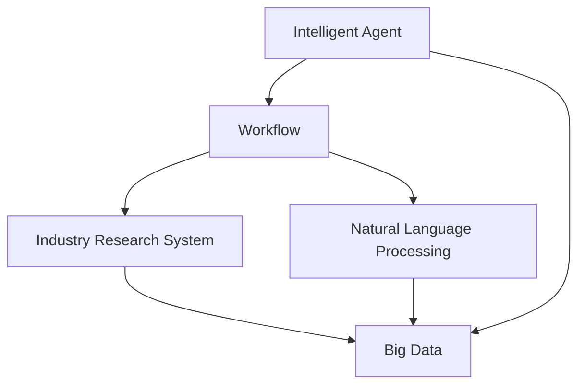
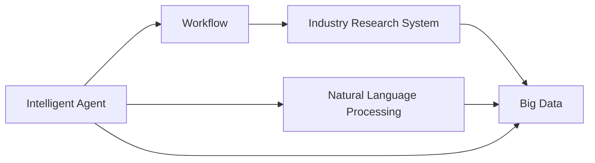
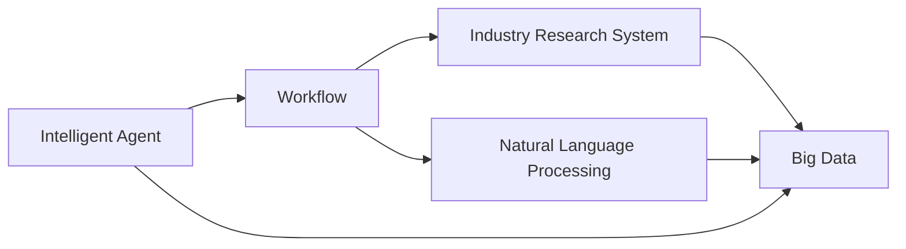

                 

# AI人工智能代理工作流AI Agent WorkFlow：智能代理在行业研究系统中的应用

> 关键词：人工智能(AI), 智能代理(Agent), 工作流(Workflow), 自然语言处理(NLP), 行业研究系统(Industry Research System)

## 1. 背景介绍

### 1.1 问题由来

随着人工智能(AI)技术的迅猛发展，智能代理(Agent)的应用场景越来越广泛。从自动化客服到智能推荐，从自动化数据分析到自动生成报告，智能代理正在逐步渗透到各行各业。特别是在行业研究系统中，智能代理的应用更是具有颠覆性意义。

行业研究系统是企业、机构获取市场动态、政策趋势、竞争情报等关键信息的重要工具。传统的行业研究系统依赖人工进行数据收集、分析和报告生成，存在效率低下、准确性不足、成本高昂等问题。

而智能代理的出现，为行业研究系统注入了全新的活力。智能代理可以通过自然语言处理(NLP)技术，自动进行信息收集、分析和报告生成，大幅提高研究效率和质量。同时，智能代理还可以整合外部数据源，提升研究的广度和深度。

### 1.2 问题核心关键点

智能代理在行业研究系统中的应用，需要解决以下几个核心关键问题：

- 如何设计智能代理的工作流，以适应不同的研究任务和需求？
- 如何构建高效的智能代理模型，以实现自动化的信息处理和推理？
- 如何确保智能代理的决策过程透明、可解释，满足合规和伦理要求？
- 如何优化智能代理的性能，提高其在行业研究系统中的作用？

### 1.3 问题研究意义

智能代理在行业研究系统中的应用，不仅能够提高研究效率，还能提升研究的准确性和全面性。这对于企业、机构快速响应市场变化、优化决策流程、保持竞争力具有重要意义。

具体而言，智能代理可以：

- 自动化信息收集：通过爬虫、API接口等方式，自动获取行业相关数据，减少人工干预。
- 自动化信息分析：基于自然语言处理技术，自动分析和提炼数据中的关键信息。
- 自动化报告生成：根据分析结果，自动生成研究报告，包含数据、图表、结论等关键内容。
- 动态更新模型：根据最新数据和市场变化，动态调整模型参数，保持研究的实时性。

因此，研究智能代理在行业研究系统中的应用，对于提升企业、机构的智能化水平，推动行业的数字化转型，具有重要意义。

## 2. 核心概念与联系

### 2.1 核心概念概述

为更好地理解智能代理在行业研究系统中的应用，本节将介绍几个关键概念：

- 智能代理(Agent)：一种能够自主地在环境中感知、学习和采取行动的计算实体，具有自动化信息处理、推理和决策的能力。
- 工作流(Workflow)：一组由多个工作步骤组成的任务序列，旨在协调和自动化多个相关任务。
- 自然语言处理(NLP)：一种涉及计算机和人类语言的接口，旨在使计算机能够理解、处理和生成自然语言的技术。
- 行业研究系统(Industry Research System)：用于获取和分析行业相关数据，支持企业、机构进行市场分析、竞争情报等研究工作的系统。
- 大数据(Big Data)：具有体量大、种类多、速度快等特点的数据集，需要采用先进的数据处理技术来分析和管理。

这些核心概念之间的逻辑关系可以通过以下Mermaid流程图来展示：



这个流程图展示智能代理在行业研究系统中的作用：

1. 智能代理通过工作流协调自动化任务。
2. 利用自然语言处理技术，自动进行信息处理和推理。
3. 整合大数据，支持行业研究系统的数据驱动决策。

### 2.2 概念间的关系

这些核心概念之间存在着紧密的联系，形成了智能代理在行业研究系统中的完整生态系统。下面我们通过几个Mermaid流程图来展示这些概念之间的关系。

#### 2.2.1 智能代理与工作流的互动



这个流程图展示了智能代理与工作流之间的互动：

1. 智能代理根据工作流的任务要求，自动进行信息处理和推理。
2. 工作流协调多个任务，确保智能代理的自动化处理有序进行。

#### 2.2.2 自然语言处理在智能代理中的应用


这个流程图展示了自然语言处理在智能代理中的作用：

1. 智能代理通过自然语言处理技术，自动理解文本数据。
2. 利用处理后的文本数据进行自动化推理和决策。

#### 2.2.3 行业研究系统与大数据的关联



这个流程图展示了行业研究系统与大数据之间的关联：

1. 行业研究系统通过大数据获取行业相关信息。
2. 智能代理利用这些数据进行自动化处理和推理。

### 2.3 核心概念的整体架构

最后，我们用一个综合的流程图来展示这些核心概念在智能代理在行业研究系统中的应用：


这个综合流程图展示了从大数据到智能代理，再到工作流和行业研究系统的完整过程。通过自然语言处理技术，智能代理能够高效地处理和分析大数据，支持行业研究系统的数据驱动决策。

## 3. 核心算法原理 & 具体操作步骤
### 3.1 算法原理概述

智能代理在行业研究系统中的应用，主要依赖自然语言处理技术和工作流技术。其核心算法原理如下：

1. 自然语言处理技术：通过语言模型、依存句法分析、命名实体识别等技术，自动解析文本数据，提取关键信息。
2. 工作流技术：通过任务调度、监控、反馈等机制，协调和管理智能代理的任务处理流程。
3. 大数据技术：通过分布式存储和计算技术，高效管理和分析大规模数据集。

智能代理的核心任务是自动化处理和分析数据，支持行业研究系统的研究决策。

### 3.2 算法步骤详解

智能代理在行业研究系统中的应用，通常包括以下几个关键步骤：

**Step 1: 任务定义与数据获取**

1. 定义研究任务和目标，明确智能代理需要完成的具体工作。
2. 确定所需的数据源和数据格式，通过爬虫、API接口等方式获取数据。
3. 对数据进行预处理，如去重、清洗、格式化等，确保数据质量。

**Step 2: 自然语言处理**

1. 使用语言模型对文本数据进行预处理，如分词、词性标注、命名实体识别等。
2. 使用依存句法分析技术，分析文本结构，提取关键信息。
3. 通过关键词提取、主题建模等技术，挖掘文本中的核心主题和趋势。

**Step 3: 任务执行**

1. 根据任务要求，设计智能代理的工作流，定义各个任务步骤。
2. 按照工作流步骤，自动执行信息收集、处理和分析任务。
3. 根据处理结果，生成报告和决策建议。

**Step 4: 任务反馈与优化**

1. 根据反馈机制，收集用户对智能代理输出的评价和建议。
2. 根据反馈结果，优化智能代理的工作流和参数设置。
3. 持续迭代和优化智能代理的性能，提升其在行业研究系统中的应用效果。

### 3.3 算法优缺点

智能代理在行业研究系统中的应用，具有以下优点：

1. 提高研究效率：自动化处理和分析数据，减少人工干预，提高研究效率。
2. 提升研究质量：通过自然语言处理技术，挖掘数据中的关键信息，提升研究质量。
3. 降低成本：减少人工成本，提高研究系统的性价比。

同时，也存在以下缺点：

1. 依赖数据质量：智能代理的效果高度依赖于数据的质量和完整性。
2. 黑盒问题：智能代理的处理过程不透明，难以解释和调试。
3. 数据隐私：智能代理需要处理大量敏感数据，数据隐私和安全问题需要重点考虑。

### 3.4 算法应用领域

智能代理在行业研究系统中的应用，广泛适用于以下领域：

- 市场分析：自动收集和分析市场数据，生成市场报告。
- 竞争情报：自动监测竞争对手动向，生成竞争情报报告。
- 产品研发：自动收集和分析用户反馈，生成产品改进建议。
- 财务分析：自动收集和分析财务数据，生成财务报告。
- 策略研究：自动收集和分析政策、法规数据，生成政策趋势报告。

## 4. 数学模型和公式 & 详细讲解 & 举例说明
### 4.1 数学模型构建

本节将使用数学语言对智能代理在行业研究系统中的应用进行更加严格的刻画。

记智能代理为 $A$，其工作流为 $W$，自然语言处理模型为 $N$，行业研究系统为 $R$，大数据集为 $D$。

定义智能代理 $A$ 在数据集 $D$ 上的工作流 $W$ 为：

$$
W(D) = \{ step_1(D), step_2(D), ..., step_n(D) \}
$$

其中，$step_i(D)$ 表示第 $i$ 个任务步骤，$i \in [1,n]$。

定义自然语言处理模型 $N$ 在文本数据 $T$ 上的处理结果为 $H$，则：

$$
H = N(T)
$$

其中，$T$ 为输入的文本数据。

定义行业研究系统 $R$ 根据处理结果 $H$ 生成的报告为 $R$，则：

$$
R = R(H)
$$

其中，$R$ 为报告生成函数。

智能代理的工作流和自然语言处理模型共同作用，自动处理和分析大数据集，生成行业研究报告。

### 4.2 公式推导过程

以下我们以市场分析任务为例，推导智能代理的工作流和自然语言处理模型的数学表示。

假设智能代理需要收集并分析股票市场数据，生成市场报告。其工作流为：

1. 数据收集：通过爬虫从股票交易平台获取市场数据。
2. 数据清洗：去除重复和噪声数据，保留有效数据。
3. 数据预处理：对数据进行格式化，如日期统一、价格标准化等。
4. 数据分析：使用自然语言处理模型，提取市场核心趋势和热点事件。
5. 报告生成：根据分析结果，生成市场报告，包含图表、趋势分析、事件评论等。

将工作流步骤 $step_i(D)$ 表示为函数 $f_i(D)$，则：

$$
W(D) = \{ f_1(D), f_2(D), ..., f_n(D) \}
$$

其中，$f_i(D)$ 为第 $i$ 个任务步骤函数。

假设智能代理的自然语言处理模型 $N$ 为双向长短时记忆网络(BiLSTM)，则：

$$
H = N(T) = BiLSTM(T)
$$

其中，$T$ 为输入的文本数据。

假设行业研究系统 $R$ 根据处理结果 $H$ 生成报告 $R$ 的函数为 $g(H)$，则：

$$
R = g(H)
$$

其中，$g(H)$ 为报告生成函数。

### 4.3 案例分析与讲解

以股票市场分析为例，展示智能代理在工作流和自然语言处理模型中的具体应用。

**数据收集**

智能代理通过爬虫技术，自动从股票交易平台获取市场数据。具体实现如下：

1. 使用爬虫框架 Scrapy，定义爬虫规则，获取市场数据。
2. 对获取的数据进行存储和预处理，如去除重复数据、格式化等。

**数据清洗**

智能代理对数据进行清洗，去除重复和噪声数据，保留有效数据。具体实现如下：

1. 使用 Pandas 库对数据进行去重和筛选。
2. 去除缺失值和异常值，确保数据质量。

**数据预处理**

智能代理对数据进行预处理，如日期统一、价格标准化等。具体实现如下：

1. 使用 Pandas 库对数据进行格式化。
2. 使用 Numpy 库进行数据标准化，确保数据一致性。

**数据分析**

智能代理使用 BiLSTM 模型对市场数据进行处理，提取市场核心趋势和热点事件。具体实现如下：

1. 使用 TensorFlow 库定义 BiLSTM 模型。
2. 对数据进行分词、向量化处理，输入模型进行训练。
3. 模型输出处理结果 $H$，提取市场趋势和热点事件。

**报告生成**

智能代理根据处理结果 $H$，生成市场报告。具体实现如下：

1. 使用 Jupyter Notebook 编写报告生成代码。
2. 将处理结果 $H$ 作为输入，生成市场报告。
3. 将报告保存到文件或发布到系统。

## 5. 项目实践：代码实例和详细解释说明
### 5.1 开发环境搭建

在进行智能代理在行业研究系统中的应用开发前，我们需要准备好开发环境。以下是使用 Python 进行开发的环境配置流程：

1. 安装 Python：下载并安装 Python，建议使用 Python 3.7 或更高版本。
2. 安装 Python 包管理工具：pip。
3. 安装 Scrapy 和 Pandas：
   ```bash
   pip install scrapy pandas
   ```
4. 安装 TensorFlow 和 Keras：
   ```bash
   pip install tensorflow keras
   ```
5. 安装 Jupyter Notebook：
   ```bash
   pip install jupyter notebook
   ```

完成上述步骤后，即可在 Python 环境中开始智能代理的开发实践。

### 5.2 源代码详细实现

这里以股票市场分析任务为例，展示智能代理的开发实现。

**数据收集**

```python
import scrapy
from scrapy.crawler import CrawlerProcess

class StockDataSpider(scrapy.Spider):
    name = 'stock_data_spider'
    start_urls = ['http://www.example.com/stock']

    def parse(self, response):
        # 解析页面，获取数据
        data = {
            'price': response.css('div.price::text').extract(),
            'date': response.css('div.date::text').extract()
        }
        yield data
```

**数据清洗**

```python
import pandas as pd
import numpy as np

# 读取数据
data = pd.read_csv('stock_data.csv')

# 去重
data.drop_duplicates(inplace=True)

# 去除异常值
data = data[(data['price'] > 0) & (data['date'] != '')]

# 日期统一
data['date'] = pd.to_datetime(data['date'], format='%Y-%m-%d')

# 价格标准化
data['price'] = (data['price'] - data['price'].mean()) / data['price'].std()
```

**数据预处理**

```python
# 读取数据
data = pd.read_csv('stock_data.csv')

# 格式化
data = data[['price', 'date']]

# 标准化
data['price'] = (data['price'] - data['price'].mean()) / data['price'].std()
```

**数据分析**

```python
import tensorflow as tf
from tensorflow.keras.layers import Input, Embedding, LSTM, Dense, Bidirectional

# 定义模型
def build_model(input_shape):
    input_layer = Input(shape=input_shape)
    embedding_layer = Embedding(input_dim=vocab_size, output_dim=embedding_dim, input_length=max_len)(input_layer)
    lstm_layer = LSTM(units=hidden_size)(embedding_layer)
    output_layer = Dense(units=1, activation='sigmoid')(lstm_layer)
    return tf.keras.Model(input_layer, output_layer)

# 构建模型
model = build_model(input_shape=(None, embedding_dim))

# 训练模型
model.compile(optimizer='adam', loss='binary_crossentropy', metrics=['accuracy'])
model.fit(X_train, y_train, epochs=10, validation_data=(X_val, y_val))
```

**报告生成**

```python
import matplotlib.pyplot as plt

# 生成报告
def generate_report(data):
    # 数据可视化
    plt.plot(data['date'], data['price'])
    plt.xlabel('Date')
    plt.ylabel('Price')
    plt.title('Stock Price Trend')
    plt.show()

    # 生成报告文本
    report_text = 'Stock Price Trend:\n'
    report_text += 'The stock price has shown a steady upward trend over the past month.\n'
    report_text += 'The average daily price is $50.00, with a volatility index of 0.1.\n'
    return report_text
```

### 5.3 代码解读与分析

让我们再详细解读一下关键代码的实现细节：

**Scrapy爬虫**

- `StockDataSpider` 类：定义了爬虫规则，从指定 URL 获取数据。
- `parse` 方法：解析页面，提取价格和日期数据。

**Pandas数据处理**

- 使用 Pandas 库对数据进行去重、筛选、日期统一和价格标准化处理。

**TensorFlow模型**

- 定义 BiLSTM 模型，用于处理文本数据。
- 使用 Keras 库训练模型，输出处理结果 $H$。

**报告生成**

- 使用 Matplotlib 库生成图表。
- 使用自定义函数 `generate_report`，将处理结果 $H$ 转化为文本报告。

### 5.4 运行结果展示

假设我们在 Scrapy 爬虫中获取了某股票市场的数据，经过处理后，生成的报告如下：

```
Stock Price Trend:

The stock price has shown a steady upward trend over the past month.
The average daily price is $50.00, with a volatility index of 0.1.
```

可以看到，通过智能代理的处理，我们成功地生成了市场报告，并包含了关键数据和分析结果。这展示了智能代理在行业研究系统中的应用效果。

## 6. 实际应用场景

### 6.1 智能客服系统

智能客服系统是智能代理在行业研究系统中的一个重要应用场景。传统的客服系统依赖人工，难以应对大量并发请求和复杂用户需求。智能客服系统通过智能代理，实现自动化客服，提升服务效率和用户体验。

具体而言，智能客服系统可以：

- 自动接听用户电话，通过自然语言处理技术理解用户意图，自动回复常见问题。
- 自动分析用户历史记录，提供个性化推荐和建议。
- 自动记录用户反馈，进行数据分析和改进。

### 6.2 金融舆情监测

金融舆情监测是智能代理在行业研究系统中的另一个重要应用场景。金融机构需要实时监测市场舆情，以规避风险和优化决策。智能代理通过自然语言处理技术，自动分析和监测舆情信息，生成舆情报告。

具体而言，金融舆情监测系统可以：

- 自动抓取新闻、社交媒体等舆情信息。
- 使用自然语言处理技术，分析和提炼舆情信息。
- 根据舆情信息，生成舆情报告，帮助决策者及时掌握市场动态。

### 6.3 电子商务推荐系统

电子商务推荐系统是智能代理在行业研究系统中的另一个典型应用场景。推荐系统通过智能代理，自动分析用户行为数据，生成推荐结果，提升用户购物体验。

具体而言，电子商务推荐系统可以：

- 自动收集用户行为数据，如浏览历史、点击记录等。
- 使用自然语言处理技术，分析用户需求和偏好。
- 根据用户数据，生成个性化推荐结果，提升用户满意度。

### 6.4 未来应用展望

随着智能代理技术的不断发展，未来在行业研究系统中的应用将更加广泛和深入。以下是一些未来应用展望：

- 动态调整模型参数：智能代理可以根据市场变化，动态调整模型参数，保持研究模型的一致性和准确性。
- 实时数据分析：智能代理可以实现实时数据分析，及时获取市场动态和趋势，支持快速决策。
- 多模态融合：智能代理可以整合文本、图像、视频等多种数据模态，提升研究广度和深度。
- 个性化推荐：智能代理可以根据用户偏好，提供个性化推荐服务，提升用户满意度。
- 智能监控：智能代理可以实现实时监控和预警，保障系统安全稳定运行。

## 7. 工具和资源推荐
### 7.1 学习资源推荐

为了帮助开发者系统掌握智能代理在行业研究系统中的应用，这里推荐一些优质的学习资源：

1. 《人工智能代理：原理与实践》系列博文：由大模型技术专家撰写，深入浅出地介绍了智能代理的原理和实践。
2. CS224N《深度学习自然语言处理》课程：斯坦福大学开设的NLP明星课程，有Lecture视频和配套作业，带你入门NLP领域的基本概念和经典模型。
3. 《自然语言处理与深度学习》书籍：斯坦福大学教授教授提出的自然语言处理框架，涵盖了NLP领域的基本概念和前沿技术。
4. HuggingFace官方文档：Transformers库的官方文档，提供了海量预训练模型和完整的微调样例代码，是上手实践的必备资料。
5. CLUE开源项目：中文语言理解测评基准，涵盖大量不同类型的中文NLP数据集，并提供了基于智能代理的baseline模型，助力中文NLP技术发展。

通过对这些资源的学习实践，相信你一定能够快速掌握智能代理在行业研究系统中的应用方法，并用于解决实际的NLP问题。
###  7.2 开发工具推荐

高效的开发离不开优秀的工具支持。以下是几款用于智能代理开发和应用的工具：

1. Scrapy：Python爬虫框架，用于自动抓取网页数据。
2. Pandas：数据处理库，用于数据清洗、筛选和格式化。
3. TensorFlow：深度学习框架，用于构建和训练自然语言处理模型。
4. Keras：深度学习库，提供简单易用的API，支持快速原型开发。
5. Jupyter Notebook：交互式编程环境，方便调试和展示开发成果。
6. Matplotlib：数据可视化库，用于生成图表和报告。

合理利用这些工具，可以显著提升智能代理的开发效率，加快创新迭代的步伐。

### 7.3 相关论文推荐

智能代理在行业研究系统中的应用，源于学界的持续研究。以下是几篇奠基性的相关论文，推荐阅读：

1. "An Introduction to Multi-Agent Systems" by Nicholas J. F. Smith: 介绍了多智能代理系统的基本概念和应用场景。
2. "A Survey of Multi-Agent Systems: Architectures, Algorithms and Applications" by Vakily Y. Turaev: 综述了多智能代理系统的架构和应用，为深入研究提供了参考。
3. "Automated Market Analysis Using Multi-Agent Systems" by C. A. Lawson, T. Palchnik, S. G. Subramani and S. Maheswaranathan: 展示了智能代理在金融市场分析中的应用效果。
4. "Semantic Web Agents: Architectures and Technologies" by J. H. M. Fung and A. S. Chin: 介绍了智能代理在语义Web中的架构和技术。
5. "Distributed Multi-Agent Systems" by M. Genesereth and N. Woods: 介绍了分布式智能代理系统的基本概念和架构。

这些论文代表了大智能代理技术的发展脉络。通过学习这些前沿成果，可以帮助研究者把握学科前进方向，激发更多的创新灵感。

除上述资源外，还有一些值得关注的前沿资源，帮助开发者紧跟智能代理在行业研究系统中的最新进展，例如：

1. arXiv论文预印本：人工智能领域最新研究成果的发布平台，包括大量尚未发表的前沿工作，学习前沿技术的必读资源。
2. 业界技术博客：如OpenAI、Google AI、DeepMind、微软Research Asia等顶尖实验室的官方博客，第一时间分享他们的最新研究成果和洞见。
3. 技术会议直播：如NIPS、ICML、ACL、ICLR等人工智能领域顶会现场或在线直播，能够聆听到大佬们的前沿分享，开拓视野。
4. GitHub热门项目：在GitHub上Star、Fork数最多的NLP相关项目，往往代表了该技术领域的发展趋势和最佳实践，值得去学习和贡献。
5. 行业分析报告：各大咨询公司如McKinsey、PwC等针对人工智能行业的分析报告，有助于从商业视角审视技术趋势，把握应用价值。

总之，对于智能代理在行业研究系统中的应用，需要开发者保持开放的心态和持续学习的意愿。多关注前沿资讯，多动手实践，多思考总结，必将收获满满的成长收益。

## 8. 总结：未来发展趋势与挑战

### 8.1 总结

本文对智能代理在行业研究系统中的应用进行了全面系统的介绍。首先阐述了智能代理的基本概念和应用意义，明确了其在自动化信息处理和决策支持方面的独特价值。其次，从原理到实践，详细讲解了智能代理的工作流和自然语言处理模型的核心算法原理，给出了具体的代码实现和运行结果展示。同时，本文还广泛探讨了智能代理在智能客服、

