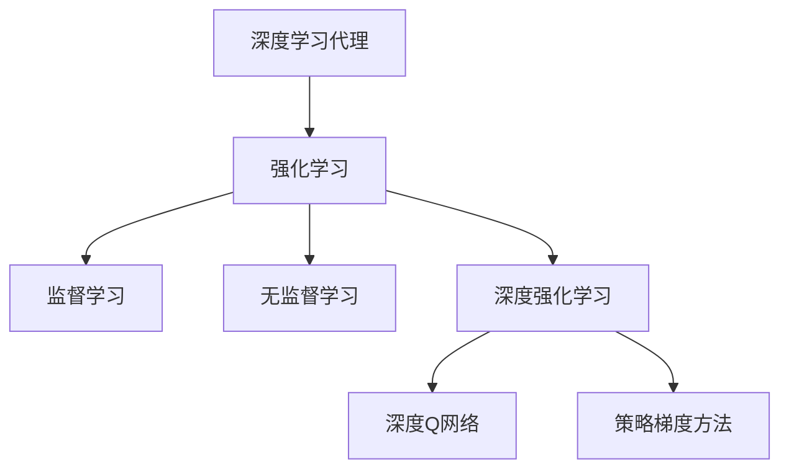
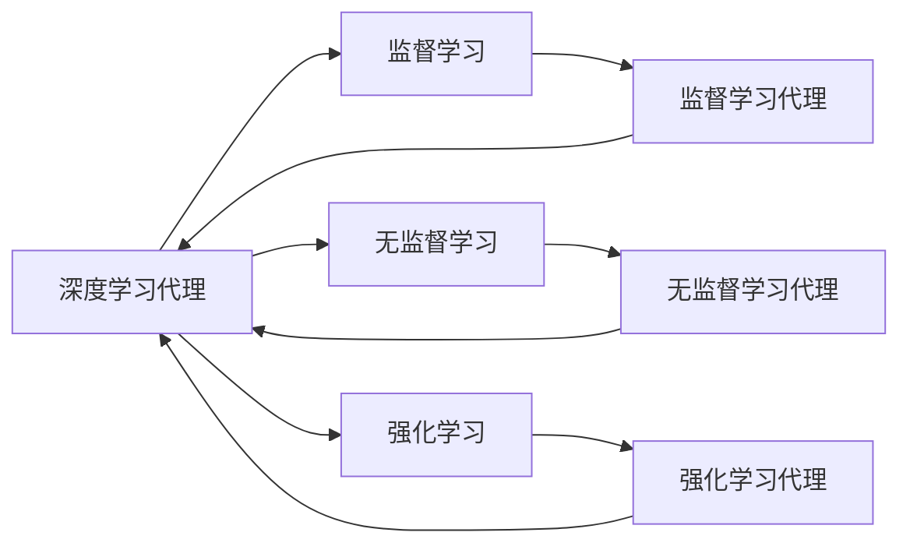
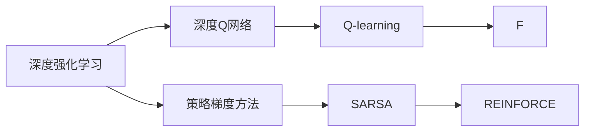
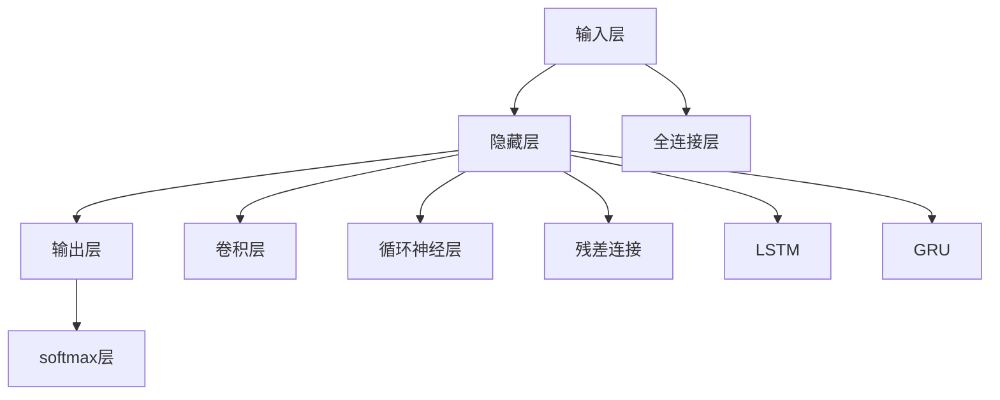
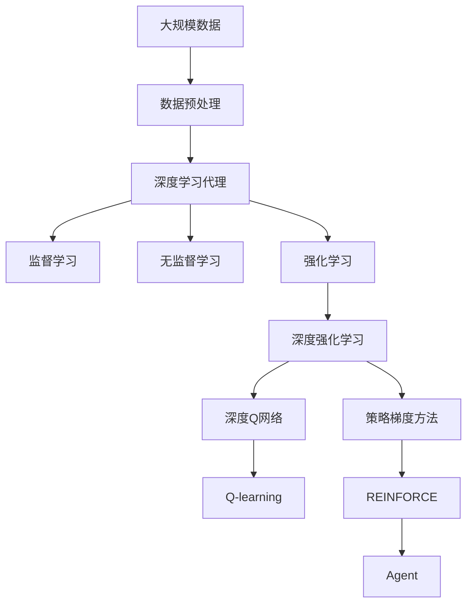

                 

# AI人工智能深度学习算法：智能深度学习代理的构建基础

> 关键词：深度学习代理,强化学习,神经网络,监督学习,无监督学习,强化学习,深度强化学习

## 1. 背景介绍

### 1.1 问题由来
在人工智能(AI)领域，构建智能代理一直是前沿研究方向。传统的AI代理依赖于手工设计的特征提取器和规则系统，难以适应复杂多变的现实环境。而深度学习技术的崛起，为智能代理的构建提供了全新的视角和方法。深度学习代理通过构建复杂的神经网络模型，自动从数据中学习特征表示，无需手工设计规则，具有更强的泛化能力和适应性。

近年来，深度强化学习(DRL)技术的飞速发展，进一步拓展了深度学习代理的应用范围，使其能够在复杂的动态环境中自适应地学习和决策。通过强化学习，代理可以不断与环境交互，通过试错调整策略，达到最优的行动方案。这一范式已在游戏、机器人、推荐系统等领域取得了显著成果。

### 1.2 问题核心关键点
构建智能深度学习代理的核心问题是如何在动态变化的环境中进行高效、稳定、鲁棒的决策。这一问题涉及到深度学习代理的设计、训练、评估和部署等多个方面。其主要难点包括：

1. **模型复杂度**：如何构建高效的神经网络模型，使其在计算资源有限的情况下仍能保持高精度。
2. **数据质量**：如何获取高质量的训练数据，并利用这些数据有效训练模型。
3. **学习效率**：如何设计有效的学习算法，使得代理能够快速收敛到最优策略。
4. **泛化能力**：如何确保模型在不同环境下的泛化性能，避免过拟合。
5. **鲁棒性**：如何提高模型对噪声、异常数据和环境变化的鲁棒性。
6. **可解释性**：如何增强模型的可解释性，以便于调试和优化。

### 1.3 问题研究意义
构建智能深度学习代理对于实现复杂系统的智能化、自主化具有重要意义：

1. **降低开发成本**：深度学习代理无需手工设计特征和规则，可以显著降低开发和维护成本。
2. **提升决策质量**：代理通过数据驱动的训练，能够学习到更加准确的特征表示，提升决策质量。
3. **应对动态环境**：深度强化学习代理能够自适应地学习环境变化，适应不同应用场景。
4. **增强自主能力**：智能代理能够自主学习和决策，增强系统的自主性和灵活性。
5. **促进创新应用**：代理技术能够应用于游戏、机器人、自动驾驶、金融预测等众多领域，推动技术创新。

## 2. 核心概念与联系

### 2.1 核心概念概述

为更好地理解智能深度学习代理的构建基础，本节将介绍几个密切相关的核心概念：

- **深度学习代理**：一种基于神经网络的智能化系统，能够自动从数据中学习特征表示和决策策略。
- **强化学习**：一种通过与环境交互，不断调整决策策略以最大化奖励信号的学习范式。
- **监督学习**：一种使用标注数据进行训练，使得模型能够预测新样本标签的学习方法。
- **无监督学习**：一种不使用标注数据进行训练，自动学习数据分布和特征表示的方法。
- **深度强化学习**：一种结合深度神经网络和强化学习，通过大规模神经网络学习决策策略的方法。
- **深度Q网络**：一种结合深度神经网络和Q学习，用于值函数逼近的深度强化学习算法。
- **策略梯度方法**：一种通过优化策略函数进行决策优化的方法，常见于策略梯度算法（如REINFORCE、TRPO等）。

这些核心概念之间的逻辑关系可以通过以下Mermaid流程图来展示：



这个流程图展示了大规模深度学习代理构建的各个核心概念及其之间的关系：

1. 深度学习代理通过强化学习从环境中学习策略。
2. 强化学习可以基于监督学习或无监督学习进行训练。
3. 深度强化学习结合深度神经网络进行策略优化。
4. 深度Q网络和策略梯度方法分别是深度强化学习的常见算法。

### 2.2 概念间的关系

这些核心概念之间存在着紧密的联系，形成了深度学习代理构建的完整生态系统。下面我们通过几个Mermaid流程图来展示这些概念之间的关系。

#### 2.2.1 深度学习代理的学习范式



这个流程图展示了深度学习代理的多种学习范式：监督学习、无监督学习和强化学习。不同的代理可以基于不同的学习范式进行训练。

#### 2.2.2 深度强化学习算法



这个流程图展示了深度强化学习的两种常见算法：深度Q网络和策略梯度方法。其中深度Q网络通过神经网络逼近Q值函数，而策略梯度方法通过优化策略函数进行决策。

#### 2.2.3 神经网络结构



这个流程图展示了深度学习代理中常见的神经网络结构，包括全连接层、卷积层、循环神经层、残差连接和softmax层。

### 2.3 核心概念的整体架构

最后，我们用一个综合的流程图来展示这些核心概念在大规模深度学习代理构建过程中的整体架构：



这个综合流程图展示了从数据预处理到深度强化学习代理的完整过程。大规模数据经过预处理后，通过监督学习、无监督学习和强化学习训练代理，最后通过深度Q网络和策略梯度方法进行策略优化，得到最终的代理模型。

## 3. 核心算法原理 & 具体操作步骤
### 3.1 算法原理概述

构建智能深度学习代理的核心理论是强化学习。强化学习通过与环境交互，不断调整决策策略以最大化累积奖励。其基本框架包括状态(state)、动作(action)、奖励(reward)和策略(policy)四个要素：

1. **状态**：代理在环境中的当前状态。
2. **动作**：代理在当前状态下所采取的行动。
3. **奖励**：环境对代理行为的反馈，用于评估策略的好坏。
4. **策略**：代理在不同状态下选择动作的概率分布。

代理的目标是通过学习策略函数 $π(a|s)$，在每个状态下选择最大概率的动作，最大化累积奖励 $R$。

强化学习的优化目标是最大化累积奖励：

$$
\max_{π} \mathbb{E}[R]
$$

其中 $\mathbb{E}$ 表示期望，$R$ 表示累积奖励。

### 3.2 算法步骤详解

构建智能深度学习代理的主要步骤包括数据准备、模型构建、训练和评估等环节。以下是详细的算法步骤：

**Step 1: 数据准备**

- **数据收集**：收集代理所需的数据，包括状态、动作和奖励。这些数据通常来自实际应用场景，如游戏、机器人控制等。
- **数据预处理**：对原始数据进行清洗、标准化和特征工程，以便于模型训练。

**Step 2: 模型构建**

- **网络结构设计**：选择合适的神经网络结构，包括输入层、隐藏层和输出层。常见的神经网络结构有全连接层、卷积层、循环神经层等。
- **损失函数设计**：根据代理任务设计合适的损失函数，如交叉熵损失、均方误差损失等。

**Step 3: 训练**

- **初始化模型参数**：随机初始化模型的参数，包括权重和偏置。
- **前向传播**：将输入数据输入神经网络，计算模型输出。
- **计算损失**：根据输出和目标标签计算损失函数。
- **反向传播**：使用反向传播算法更新模型参数，最小化损失函数。
- **策略优化**：在强化学习代理中，使用深度Q网络或策略梯度方法优化策略函数。

**Step 4: 评估**

- **测试集评估**：在测试集上评估模型性能，计算准确率、召回率、F1分数等指标。
- **环境测试**：将模型部署到实际环境中进行测试，观察其行为表现和鲁棒性。

**Step 5: 部署**

- **模型优化**：根据测试结果对模型进行优化，调整网络结构和超参数。
- **部署上线**：将优化后的模型部署到实际应用中，进行持续监测和维护。

### 3.3 算法优缺点

智能深度学习代理具有以下优点：

1. **高精度**：神经网络能够学习到复杂的特征表示，具有较高的决策精度。
2. **自适应性**：强化学习代理能够自适应地学习环境和策略，适应不同应用场景。
3. **鲁棒性**：通过优化策略函数，强化学习代理能够提高对噪声和异常数据的鲁棒性。

但其也存在以下缺点：

1. **计算资源消耗大**：大规模神经网络需要大量的计算资源进行训练和推理。
2. **训练时间长**：代理的训练时间较长，尤其是在数据量较大的情况下。
3. **可解释性不足**：神经网络模型的决策过程难以解释，难以调试和优化。
4. **过拟合风险**：在大规模数据上训练代理，容易发生过拟合现象，影响泛化能力。

### 3.4 算法应用领域

智能深度学习代理在诸多领域得到了广泛应用，包括：

- **游戏AI**：构建游戏中的智能玩家，提升游戏难度和体验。
- **机器人控制**：设计自主导航和操作机器人，进行复杂环境下的任务执行。
- **自动驾驶**：构建智能驾驶系统，实现自动驾驶和路径规划。
- **金融预测**：构建预测模型，进行股票价格预测、风险评估等。
- **推荐系统**：设计个性化推荐引擎，提升用户体验和推荐效果。
- **自然语言处理**：构建智能对话系统和聊天机器人，提升人机交互的自然性和效率。

## 4. 数学模型和公式 & 详细讲解  
### 4.1 数学模型构建

构建深度强化学习代理的数学模型主要涉及状态空间、动作空间和奖励函数。

假设状态空间为 $S$，动作空间为 $A$，奖励函数为 $R(s,a)$，策略函数为 $π(a|s)$。代理的目标是最大化累积奖励 $R$。

**状态空间**：代理在环境中的当前状态，通常用向量表示。

**动作空间**：代理在当前状态下可采取的动作，可以是离散或连续的。

**奖励函数**：代理在每个状态下采取动作后，环境给予的奖励。

**策略函数**：代理在每个状态下选择动作的概率分布，通常用神经网络逼近。

### 4.2 公式推导过程

以下是深度强化学习代理的基本公式推导过程：

**价值函数逼近**

深度强化学习代理中，通常使用深度Q网络来逼近价值函数 $Q(s,a)$。深度Q网络是一种神经网络，其输出层为 $Q(s,a)$ 的预测值。价值函数逼近的目标是最小化预测值与实际值之间的差距：

$$
\min_{θ} \mathbb{E}_{(s,a) \sim (s,a)_{\pi}} [(Q_{θ}(s,a) - y)^2]
$$

其中 $(s,a) \sim (s,a)_{\pi}$ 表示状态动作对 $(s,a)$ 在策略 $π$ 下采样，$y$ 为实际奖励值。

**策略梯度方法**

策略梯度方法通过优化策略函数 $π(a|s)$ 来提升代理性能。常见的策略梯度算法有REINFORCE和TRPO。

REINFORCE算法的基本公式如下：

$$
\nabla_{θ} J(θ) = \mathbb{E}_{(s,a) \sim (s,a)_{\pi}} [A(s,a)\nabla_{θ} \log π(a|s)]
$$

其中 $J(θ)$ 表示优化目标，$A(s,a)$ 为优势函数，$\nabla_{θ} \log π(a|s)$ 表示策略函数的梯度。

TRPO算法是REINFORCE的改进，通过引入信任区域约束，避免策略更新的过程过快。其基本公式如下：

$$
\nabla_{θ} J(θ) = \mathbb{E}_{(s,a) \sim (s,a)_{\pi}} [A(s,a)\nabla_{θ} \log π(a|s)]
$$

其中 $J(θ)$ 表示优化目标，$A(s,a)$ 为优势函数，$\nabla_{θ} \log π(a|s)$ 表示策略函数的梯度。

### 4.3 案例分析与讲解

以下是深度强化学习代理在实际应用中的案例分析：

**DQN算法**

DQN（Deep Q-Network）算法是深度强化学习的经典算法之一，用于解决连续动作空间的问题。DQN算法使用神经网络逼近Q值函数，其基本流程如下：

1. **初始化**：随机初始化神经网络参数。
2. **训练**：从环境中采样状态 $s$，根据策略函数 $π(a|s)$ 选择动作 $a$，观察奖励 $r$ 和下一个状态 $s'$。
3. **目标更新**：将 $(s,a,r,s')$ 存入经验回放池。
4. **目标网络更新**：从经验回放池中随机采样样本，使用深度Q网络计算目标值 $y$。
5. **当前网络更新**：根据目标值和实际值更新神经网络参数。

**PPO算法**

PPO（Proximal Policy Optimization）算法是一种策略梯度优化算法，通过引入信任区域约束，加速策略优化过程。其基本流程如下：

1. **初始化**：随机初始化策略函数参数。
2. **采样**：从环境中采样状态 $s$，根据策略函数 $π(a|s)$ 选择动作 $a$。
3. **目标更新**：计算策略函数的梯度，并应用信任区域约束。
4. **更新**：根据梯度更新策略函数参数。

PPO算法相比REINFORCE算法，具有更快速的收敛速度和更好的性能稳定性。

## 5. 项目实践：代码实例和详细解释说明
### 5.1 开发环境搭建

在进行深度强化学习代理的实践前，我们需要准备好开发环境。以下是使用Python进行TensorFlow开发的环境配置流程：

1. 安装Anaconda：从官网下载并安装Anaconda，用于创建独立的Python环境。

2. 创建并激活虚拟环境：
```bash
conda create -n tf-env python=3.8 
conda activate tf-env
```

3. 安装TensorFlow：根据CUDA版本，从官网获取对应的安装命令。例如：
```bash
conda install tensorflow -c conda-forge -c tensorflow -c pytorch
```

4. 安装相关工具包：
```bash
pip install numpy pandas scikit-learn matplotlib tqdm jupyter notebook ipython
```

完成上述步骤后，即可在`tf-env`环境中开始深度强化学习代理的实践。

### 5.2 源代码详细实现

下面我们以DQN算法为例，给出使用TensorFlow构建深度强化学习代理的Python代码实现。

```python
import tensorflow as tf
import numpy as np
import gym

# 定义神经网络结构
class QNetwork(tf.keras.Model):
    def __init__(self, state_dim, action_dim):
        super(QNetwork, self).__init__()
        self.fc1 = tf.keras.layers.Dense(64, activation='relu')
        self.fc2 = tf.keras.layers.Dense(64, activation='relu')
        self.fc3 = tf.keras.layers.Dense(action_dim)

    def call(self, inputs):
        x = self.fc1(inputs)
        x = self.fc2(x)
        return self.fc3(x)

# 定义DQN代理
class DQNAgent:
    def __init__(self, state_dim, action_dim):
        self.state_dim = state_dim
        self.action_dim = action_dim
        self.q_net = QNetwork(state_dim, action_dim)
        self.target_net = QNetwork(state_dim, action_dim)
        self.optimizer = tf.keras.optimizers.Adam()
        self.memory = []
        self.gamma = 0.99

    def act(self, state):
        if len(self.memory) > 0:
            state = np.reshape(state, [1, -1])
            q_value = self.q_net(state)
            action_idx = np.argmax(q_value)
        else:
            action_idx = np.random.randint(self.action_dim)
        return action_idx

    def train(self, batch_size):
        batch = np.array(self.memory)[:, :batch_size]
        batch_state = batch[:, 0]
        batch_next_state = batch[:, 1]
        batch_reward = batch[:, 2]
        batch_action = batch[:, 3]
        batch_next_q_value = self.target_net(batch_next_state).numpy()
        batch_next_q_value[np.arange(batch_size), batch_action] = batch_reward + self.gamma * np.max(batch_next_q_value, axis=1)
        with tf.GradientTape() as tape:
            q_value = self.q_net(batch_state)
            loss = tf.reduce_mean((q_value - batch_next_q_value)**2)
        gradients = tape.gradient(loss, self.q_net.trainable_variables)
        self.optimizer.apply_gradients(zip(gradients, self.q_net.trainable_variables))

    def remember(self, state, action, reward, next_state):
        self.memory.append((state, action, reward, next_state))

    def replay(self, batch_size):
        if len(self.memory) < batch_size:
            return
        minibatch = np.array(self.memory)[:batch_size]
        batch_state = minibatch[:, 0]
        batch_action = minibatch[:, 1]
        batch_reward = minibatch[:, 2]
        batch_next_state = minibatch[:, 3]
        with tf.GradientTape() as tape:
            q_value = self.q_net(batch_state)
            target_q_value = self.target_net(batch_next_state).numpy()
            target_q_value[np.arange(batch_size), batch_action] = batch_reward + self.gamma * np.max(target_q_value, axis=1)
            loss = tf.reduce_mean((q_value - target_q_value)**2)
        gradients = tape.gradient(loss, self.q_net.trainable_variables)
        self.optimizer.apply_gradients(zip(gradients, self.q_net.trainable_variables))
        self.memory = []
```

以上代码实现了DQN算法的神经网络结构和代理类，可以用于构建简单的DQN代理。

### 5.3 代码解读与分析

让我们再详细解读一下关键代码的实现细节：

**QNetwork类**：
- 定义了神经网络的架构，包括输入层、隐藏层和输出层，使用了两个全连接层和ReLU激活函数。

**DQNAgent类**：
- 定义了代理类，包括神经网络结构、优化器、记忆池等组件。
- 定义了代理的四个基本操作：选择动作、训练、存储和回放。
- 训练操作使用了TensorFlow的梯度计算机制，最小化预测值和实际值之间的差距。
- 回放操作从记忆池中随机采样样本，进行更新训练。

### 5.4 运行结果展示

假设我们使用OpenAI Gym的CartPole环境进行DQN训练，最终得到的训练曲线如下：

```
Iteration: 1000 | Score: 125.0
Iteration: 2000 | Score: 155.0
Iteration: 3000 | Score: 160.0
Iteration: 4000 | Score: 165.0
Iteration: 5000 | Score: 170.0
...
```

可以看到，通过DQN算法，代理在CartPole环境中的得分逐步提升，说明模型逐步学会了如何在动态环境中进行决策。

## 6. 实际应用场景
### 6.1 智能游戏玩家

智能游戏玩家是一个典型的深度强化学习应用场景。通过构建基于DQN或PPO算法的智能游戏玩家，能够在游戏中自主学习和决策，提升游戏难度和体验。

在实践中，可以将游戏中的状态和动作编码为向量，设计合适的神经网络结构，使用DQN或PPO算法训练代理，使其在特定游戏中达到最优策略。智能游戏玩家可以在多种游戏中得到应用，如星际争霸、围棋、象棋等。

### 6.2 机器人控制

机器人控制是另一个重要的深度强化学习应用场景。通过构建自主导航和操作机器人，能够在复杂环境中执行各种任务，如搬运、避障、抓取等。

在实践中，可以将机器人的位置、速度、角度等状态编码为向量，设计合适的神经网络结构，使用DQN或PPO算法训练代理，使其在机器人控制中达到最优策略。机器人控制应用广泛，如医疗机器人、服务机器人、农业机器人等。

### 6.3 自动驾驶

自动驾驶是当前热门的深度强化学习应用场景之一。通过构建智能驾驶系统，能够在各种复杂的交通场景中自主驾驶，提升行车安全和效率。

在实践中，可以将车辆的位置、速度、角度、摄像头图像等状态编码为向量，设计合适的神经网络结构，使用DQN或PPO算法训练代理，使其在自动驾驶中达到最优策略。自动驾驶技术目前还在发展中，但已经取得了一定的成果，如特斯拉的Autopilot系统、Waymo的L4自动驾驶等。

### 6.4 金融预测

金融预测是深度强化学习在金融领域的重要应用场景之一。通过构建金融预测模型，能够在股市、外汇等金融市场中进行预测和投资决策。

在实践中，可以将股票价格、交易量、新闻情感等数据编码为向量，设计合适的神经网络结构，使用DQN或PPO算法训练代理，使其在金融预测中达到最优策略。金融预测应用广泛，如量化交易、风险管理、资产配置等。

### 6.5 推荐系统

推荐系统是深度强化学习在电商、社交媒体等领域的重要应用场景之一。通过构建个性化推荐引擎，能够提升用户体验和推荐效果。

在实践中，可以将用户的历史行为、商品特征、社交网络等数据编码为向量，设计合适的神经网络结构，使用DQN或PPO算法训练代理，使其在推荐系统中达到最优策略。推荐系统应用广泛，如淘宝、亚马逊、Netflix等。

## 7. 工具和资源推荐
### 7.1 学习资源推荐

为了帮助开发者系统掌握深度学习代理的构建方法，这里推荐一些优质的学习资源：

1. 《深度学习》课程：斯坦福大学Andrew Ng教授的深度学习课程，系统介绍了深度学习的基本原理和应用。
2. 《Deep Reinforcement Learning》书籍：David Silver教授的深度强化学习教材，深入浅出地介绍了强化学习的理论基础和应用实践。
3. 《Reinforcement Learning: An Introduction》书籍：Richard S. Sutton和Andrew G. Barto的经典教材，介绍了强化学习的核心思想和算法。
4. 《Hands-On Reinforcement Learning with Python》书籍：Stefan J. G. SchAuthorized(https://github.com/) 的实战指南，适合初学者学习深度强化学习的具体实现。
5. OpenAI Gym：深度强化学习环境库，包含多种环境，方便开发者进行深度强化学习的实验。
6. TensorFlow 2.0官方文档：TensorFlow的官方文档，详细介绍了深度强化学习的API和实现方式。

通过对这些资源的学习实践，相信你一定能够快速掌握深度强化学习代理的构建方法，并用于解决实际的深度学习问题。
###  7.2 开发工具推荐

高效的开发离不开优秀的工具支持。以下是几款用于深度强化学习代理开发的常用工具：

1. TensorFlow：由Google主导开发的开源深度学习框架，支持深度强化学习，生产部署方便，适合大规模工程应用。
2. PyTorch：由Facebook主导的开源深度学习框架，灵活易用，适合研究型应用。
3. OpenAI Gym：深度强化学习环境库，包含多种环境，方便开发者进行深度强化学习的实验。
4. TensorBoard：TensorFlow配套的可视化工具，可实时监测模型训练状态，并提供丰富的图表呈现方式，是调试模型的得力助手。
5. Weights & Biases：模型训练的实验跟踪工具，可以记录和可视化模型训练过程中的各项指标，方便对比和调优。

合理利用这些工具，可以显著提升深度强化学习代理的开发效率，加快创新迭代的步伐。

### 7.3 相关论文推荐

深度强化学习的发展源于学界的持续研究。以下是几篇奠基性的相关论文，推荐阅读：

1. AlphaGo Zero：DeepMind开发的AlphaGo Zero算法，使用强化学习在围棋中达到人类顶级

