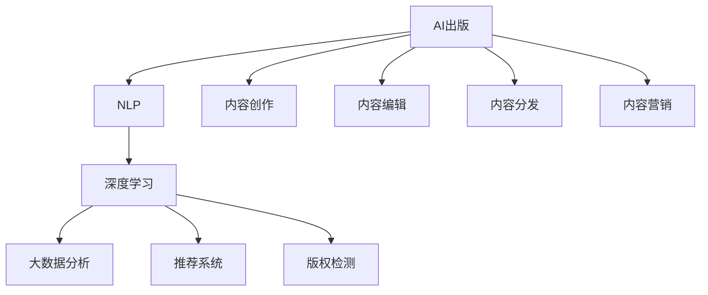
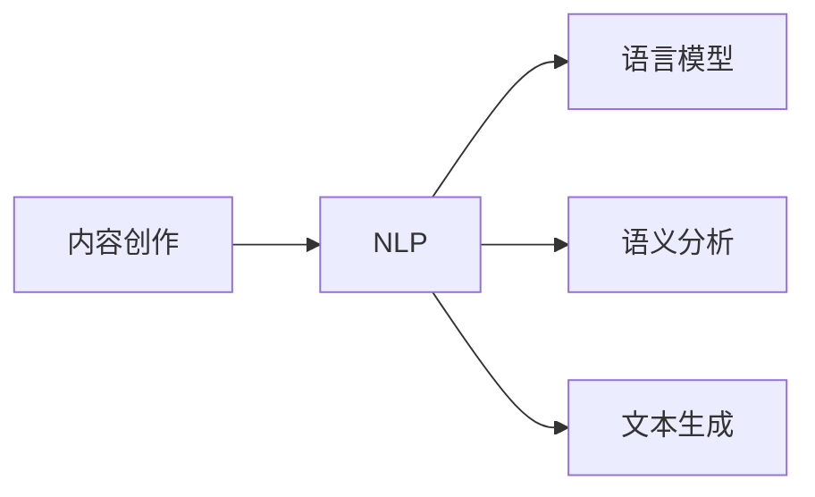
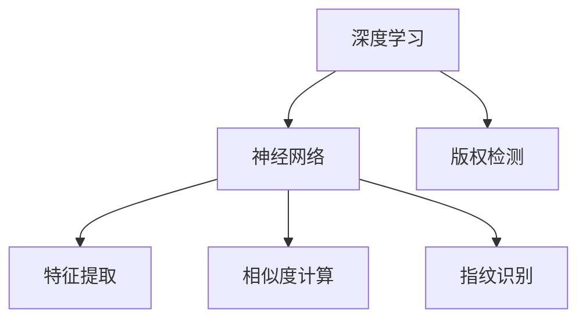
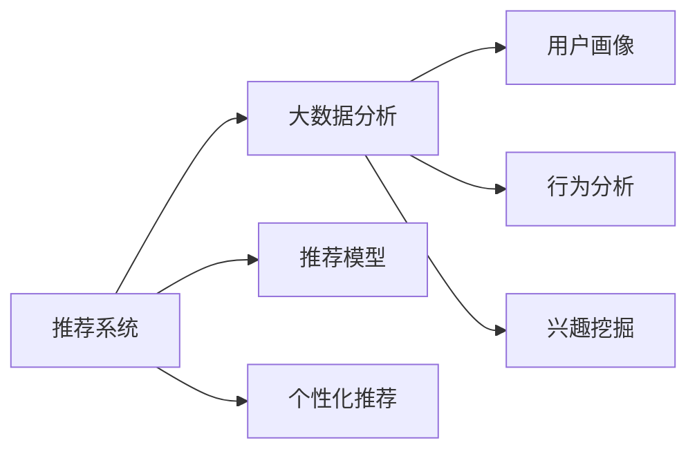

                 

# AI出版业壁垒建设：数据，算法与场景协同

> 关键词：AI出版, 数据壁垒, 算法协同, 出版业场景, 深度学习, 自然语言处理

## 1. 背景介绍

在数字时代，出版业正面临前所未有的变革。数字化阅读、全球化内容共享、人工智能辅助创作等新兴技术，使得传统出版模式面临巨大的冲击和挑战。面对这些变化，出版业需要建设新的技术壁垒，以保持其竞争力和市场地位。

### 1.1 问题由来

传统出版业长期以来依赖版权保护、品牌效应等无形资产，但在数字时代，这些壁垒逐渐失效。人工智能技术的兴起，使得内容生产、分发、传播等方面出现了全新的可能，出版业需要借助AI技术，建设新的技术壁垒，以提升内容质量和传播效率，增强市场竞争力。

### 1.2 问题核心关键点

建设AI出版业壁垒的关键在于：
- 利用AI技术提升内容创作的自动化水平，提高出版效率。
- 构建基于大数据的个性化推荐系统，提升用户阅读体验。
- 借助自然语言处理(NLP)技术，提升内容的自然语言生成能力。
- 使用AI技术进行版权检测和保护，维护内容知识产权。
- 通过数据分析和算法优化，实现高效的内容分发和精准营销。

### 1.3 问题研究意义

建设AI出版业壁垒，对于推动出版业的数字化转型，提升内容质量，增强市场竞争力，具有重要意义：

1. 提升内容创作效率。通过AI技术辅助创作，可以显著提升内容创作的自动化水平，减少人力成本，加快内容产出。
2. 提升用户阅读体验。个性化推荐系统能够根据用户阅读历史，推荐符合其兴趣的内容，提高用户粘性和满意度。
3. 提升内容生成质量。AI生成的自然语言文本能够保证语言规范和表达精准，提升内容的可信度和可读性。
4. 增强版权保护能力。AI技术可以用于检测版权侵权，维护内容知识产权，防止盗版和盗用。
5. 优化内容分发和营销。大数据分析和算法优化能够实现高效的内容分发和精准营销，提升内容的曝光率和市场覆盖面。

## 2. 核心概念与联系

### 2.1 核心概念概述

为了更好地理解AI出版业壁垒建设过程，本节将介绍几个密切相关的核心概念：

- AI出版：指利用人工智能技术，辅助内容创作、编辑、推荐、版权检测、分发等出版业各个环节的自动化过程。
- 自然语言处理(NLP)：涉及语言模型的构建、语义分析、文本生成等技术，是AI出版中重要的核心技术。
- 深度学习(Deep Learning)：基于多层神经网络，可以自动学习特征和模式，广泛应用于内容生成、推荐系统、版权检测等领域。
- 大数据分析(Big Data Analysis)：通过数据分析和挖掘，从海量文本数据中提取有价值的信息，支持出版决策和内容优化。
- 推荐系统(Recommender System)：基于用户行为数据，通过算法推荐用户可能感兴趣的内容，提升用户体验。
- 版权检测(Copyright Detection)：利用文本相似度算法、指纹识别等技术，检测版权侵权行为，维护内容知识产权。

这些核心概念之间的逻辑关系可以通过以下Mermaid流程图来展示：



这个流程图展示了大规模出版过程中涉及的核心技术及其之间的关系：

1. AI出版是整个出版过程的技术支撑。
2. NLP是AI出版中重要的技术工具，用于文本分析、生成等。
3. 深度学习用于模型训练和优化，提升出版流程的自动化水平。
4. 大数据分析用于挖掘用户行为，支撑内容推荐和优化。
5. 推荐系统用于个性化内容推荐，提升用户粘性。
6. 版权检测用于保护内容知识产权，防止盗版和盗用。
7. 内容创作、编辑、分发、营销等环节，都是基于上述技术工具和算法的自动化的辅助过程。

这些核心概念共同构成了AI出版业壁垒建设的基本框架，使得出版业能够更好地利用AI技术，提升内容质量和传播效率，增强市场竞争力。

### 2.2 概念间的关系

这些核心概念之间存在着紧密的联系，形成了AI出版业壁垒建设的完整生态系统。下面我们通过几个Mermaid流程图来展示这些概念之间的关系。

#### 2.2.1 内容创作与NLP的关系



这个流程图展示了内容创作过程中，NLP技术的应用：

1. 内容创作需要利用语言模型、语义分析、文本生成等技术，构建高质量的文本内容。
2. 语言模型用于自动分析文本语义和语法结构，保证文本的自然流畅。
3. 语义分析用于识别文本中的关键信息，提升内容的信息密度。
4. 文本生成用于辅助创作，生成符合用户兴趣和需求的文本内容。

#### 2.2.2 深度学习与版权检测的关系



这个流程图展示了深度学习在版权检测中的应用：

1. 深度学习通过神经网络进行特征提取和模式识别，识别文本中的版权信息。
2. 特征提取用于提取文本的关键特征，如单词频率、句式结构等。
3. 相似度计算用于比较不同文本之间的相似度，识别潜在的侵权行为。
4. 指纹识别用于生成文本的指纹特征，用于版权归属判断。
5. 版权检测通过深度学习算法，实现自动化的版权侵权检测和维权。

#### 2.2.3 推荐系统与大数据分析的关系



这个流程图展示了推荐系统和大数据分析的应用：

1. 推荐系统需要基于用户画像、行为分析和兴趣挖掘等大数据分析技术，构建个性化的推荐模型。
2. 用户画像用于构建用户的基本属性和行为特征，支撑个性化推荐。
3. 行为分析用于分析用户的历史行为数据，提取用户的兴趣偏好。
4. 兴趣挖掘用于深入挖掘用户的潜在兴趣，拓展推荐内容的多样性。
5. 推荐模型基于用户画像和行为分析的结果，生成推荐内容。
6. 个性化推荐用于根据用户兴趣，推荐符合其需求的内容，提升用户体验。

## 3. 核心算法原理 & 具体操作步骤
### 3.1 算法原理概述

AI出版业壁垒建设的核心算法原理是利用数据、算法和场景的协同作用，提升出版业的自动化水平和智能化程度。其核心思想是：

1. 数据驱动：通过大数据分析和挖掘，提取有价值的用户行为和文本特征，支撑内容创作、推荐和版权检测等环节。
2. 算法优化：利用深度学习等人工智能技术，优化出版流程中的各个环节，提升自动化水平和智能化程度。
3. 场景适配：根据出版业的具体场景，选择合适的算法和工具，构建高效的出版系统。

### 3.2 算法步骤详解

基于数据、算法和场景的协同，AI出版业壁垒建设的算法步骤主要包括：

1. 数据采集与预处理：从出版平台、社交媒体、在线阅读平台等渠道，采集用户行为数据、文本数据等，并进行清洗和预处理，构建数据集。
2. 特征提取与分析：利用NLP技术，提取文本中的关键特征，如词汇频率、句式结构、情感倾向等，支撑内容创作和推荐。
3. 模型训练与优化：基于深度学习算法，训练内容创作、推荐系统和版权检测等模型，并进行超参数调整和模型优化。
4. 场景适配与部署：根据出版业的具体场景，选择合适的算法和工具，部署到实际系统中，实现高效的内容创作、推荐和版权检测。

### 3.3 算法优缺点

AI出版业壁垒建设的算法具有以下优点：

1. 自动化水平高：通过自动化流程，显著提升内容创作的效率和质量，降低人力成本。
2. 智能化程度高：基于深度学习等先进算法，实现内容推荐、版权检测等环节的智能化，提升用户体验和知识产权保护能力。
3. 个性化推荐能力强：通过大数据分析，构建用户画像和兴趣模型，实现个性化的内容推荐，提升用户粘性和满意度。
4. 抗干扰能力强：基于深度学习算法的强泛化能力，模型在面对噪声数据和异常行为时，仍能保持较高的准确性和鲁棒性。

同时，该算法也存在一些局限性：

1. 数据隐私和安全问题：大规模数据采集和分析，涉及用户隐私和数据安全，需要严格的法律法规和隐私保护措施。
2. 算法依赖性强：深度学习等算法的性能和效果，依赖于高质量的数据和计算资源，对于资源匮乏的出版业，可能面临一定的挑战。
3. 模型解释性不足：深度学习模型通常被认为是"黑盒"系统，难以解释其内部决策逻辑，对于高风险应用如医疗、金融等，需要增强模型的可解释性和可审计性。
4. 算法伦理和公平性问题：深度学习算法可能存在偏见和歧视，需要建立公平性检测和纠正机制，确保算法应用的公平性和伦理性。

### 3.4 算法应用领域

AI出版业壁垒建设的方法已经在出版业的多个领域得到应用，例如：

1. 内容创作：通过自动摘要、生成文章、编写剧本等技术，辅助内容创作。
2. 内容推荐：根据用户阅读历史，推荐符合其兴趣和需求的内容，提升用户粘性和满意度。
3. 版权检测：利用文本相似度算法和指纹识别技术，检测版权侵权行为，维护内容知识产权。
4. 内容分发：基于数据分析和算法优化，实现高效的内容分发和精准营销，提升内容的曝光率和市场覆盖面。
5. 出版决策：通过大数据分析，支撑出版决策和内容优化，提高出版效率和内容质量。

除了上述这些经典应用外，AI出版业壁垒建设的方法还被创新性地应用到更多场景中，如出版物个性化定制、版权交易、版权确权等，为出版业带来了新的发展机遇。

## 4. 数学模型和公式 & 详细讲解 & 举例说明

### 4.1 数学模型构建

本节将使用数学语言对AI出版业壁垒建设过程进行更加严格的刻画。

记内容创作的数据集为 $D=\{(x_i, y_i)\}_{i=1}^N$，其中 $x_i$ 为输入文本，$y_i$ 为对应的文本标签（如新闻、书籍、文章等）。记深度学习模型为 $M_{\theta}(x)$，其中 $\theta$ 为模型参数。假设模型采用交叉熵损失函数，则经验风险函数为：

$$
\mathcal{L}(\theta) = -\frac{1}{N}\sum_{i=1}^N \log M_{\theta}(x_i)
$$

通过最小化经验风险函数，训练模型 $M_{\theta}$，使得模型在给定输入 $x_i$ 时，能够准确预测标签 $y_i$。

### 4.2 公式推导过程

以下我们以新闻推荐系统为例，推导深度学习模型的交叉熵损失函数及其梯度的计算公式。

假设新闻推荐系统的输入为 $x_i$，模型输出为 $\hat{y}_i$，表示新闻 $x_i$ 被用户 $i$ 点击的概率。真实标签 $y_i \in \{0,1\}$，表示用户 $i$ 是否点击了新闻 $x_i$。则交叉熵损失函数定义为：

$$
\ell(M_{\theta}(x_i),y_i) = -[y_i\log \hat{y}_i + (1-y_i)\log(1-\hat{y}_i)]
$$

将其代入经验风险函数，得：

$$
\mathcal{L}(\theta) = -\frac{1}{N}\sum_{i=1}^N \ell(M_{\theta}(x_i),y_i)
$$

根据链式法则，损失函数对参数 $\theta_k$ 的梯度为：

$$
\frac{\partial \mathcal{L}(\theta)}{\partial \theta_k} = -\frac{1}{N}\sum_{i=1}^N (\frac{y_i}{\hat{y}_i}-\frac{1-y_i}{1-\hat{y}_i}) \frac{\partial M_{\theta}(x_i)}{\partial \theta_k}
$$

其中 $\frac{\partial M_{\theta}(x_i)}{\partial \theta_k}$ 可进一步递归展开，利用自动微分技术完成计算。

在得到损失函数的梯度后，即可带入参数更新公式，完成模型的迭代优化。重复上述过程直至收敛，最终得到适应新闻推荐任务的最优模型参数 $\theta^*$。

### 4.3 案例分析与讲解

以图书推荐系统为例，分析深度学习模型在图书推荐中的应用：

1. 数据集构建：从在线阅读平台和社交媒体等渠道，采集用户的阅读历史、兴趣标签、评论等数据，构建图书推荐系统的数据集。
2. 特征提取：利用NLP技术，提取图书的关键词、摘要、作者等特征，构建特征向量。
3. 模型训练：基于深度学习算法（如BERT、GRU等），训练图书推荐模型。
4. 推荐算法：根据用户画像和行为分析的结果，使用协同过滤、矩阵分解等算法，生成推荐结果。
5. 推荐系统评估：在测试集上评估推荐系统的性能，通过评价指标（如准确率、召回率、F1分数等），优化推荐模型。

## 5. 项目实践：代码实例和详细解释说明

### 5.1 开发环境搭建

在进行AI出版业壁垒建设实践前，我们需要准备好开发环境。以下是使用Python进行TensorFlow开发的环境配置流程：

1. 安装Anaconda：从官网下载并安装Anaconda，用于创建独立的Python环境。

2. 创建并激活虚拟环境：
```bash
conda create -n tf-env python=3.8 
conda activate tf-env
```

3. 安装TensorFlow：根据CUDA版本，从官网获取对应的安装命令。例如：
```bash
conda install tensorflow=2.7 -c pytorch -c conda-forge
```

4. 安装各类工具包：
```bash
pip install numpy pandas scikit-learn matplotlib tqdm jupyter notebook ipython
```

完成上述步骤后，即可在`tf-env`环境中开始AI出版业壁垒建设的实践。

### 5.2 源代码详细实现

下面我们以图书推荐系统为例，给出使用TensorFlow对深度学习模型进行图书推荐系统微调的Python代码实现。

首先，定义图书推荐系统的数据处理函数：

```python
import tensorflow as tf
from tensorflow.keras.preprocessing import sequence

class BookDataset(tf.keras.utils.Sequence):
    def __init__(self, data, seq_length):
        self.data = data
        self.seq_length = seq_length
        
    def __len__(self):
        return len(self.data)
    
    def __getitem__(self, idx):
        x = self.data[idx]
        y = x[1]
        x = x[0].reshape((self.seq_length, -1))
        return (x, y)
```

然后，定义模型和优化器：

```python
from tensorflow.keras import layers

model = tf.keras.Sequential([
    layers.Embedding(input_dim=len(tokenizer.word_index) + 1, output_dim=128),
    layers.LSTM(128, return_sequences=True),
    layers.LSTM(64),
    layers.Dense(1, activation='sigmoid')
])

optimizer = tf.keras.optimizers.Adam(lr=0.001)
```

接着，定义训练和评估函数：

```python
from sklearn.metrics import roc_auc_score

def train_epoch(model, dataset, batch_size, optimizer):
    model.compile(optimizer=optimizer, loss='binary_crossentropy', metrics=['accuracy'])
    model.fit(dataset, epochs=1, batch_size=batch_size, verbose=0)

def evaluate(model, dataset, batch_size):
    dataloader = tf.data.Dataset.from_tensor_slices(dataset)
    dataloader = dataloader.shuffle(buffer_size=10000).batch(batch_size)
    preds, labels = [], []
    for x, y in dataloader:
        preds.append(model.predict(x).ravel())
        labels.append(y.ravel())
    roc_auc = roc_auc_score(labels, preds)
    print(f'ROC-AUC: {roc_auc:.3f}')
```

最后，启动训练流程并在测试集上评估：

```python
epochs = 5
batch_size = 32

for epoch in range(epochs):
    train_epoch(model, train_dataset, batch_size, optimizer)
    
    print(f'Epoch {epoch+1}, test roc_auc:')
    evaluate(model, test_dataset, batch_size)
```

以上就是使用TensorFlow对深度学习模型进行图书推荐系统微调的完整代码实现。可以看到，TensorFlow提供的高层API使得模型构建和微调变得简洁高效。

### 5.3 代码解读与分析

让我们再详细解读一下关键代码的实现细节：

**BookDataset类**：
- `__init__`方法：初始化数据集，并设置序列长度。
- `__len__`方法：返回数据集的样本数量。
- `__getitem__`方法：对单个样本进行处理，将文本输入转换为固定长度的序列，并返回模型所需的输入和输出。

**训练和评估函数**：
- 使用TensorFlow的DataLoader对数据集进行批次化加载，供模型训练和推理使用。
- 训练函数`train_epoch`：对数据以批为单位进行迭代，在每个批次上前向传播计算loss并反向传播更新模型参数，最后返回模型在测试集上的ROC-AUC分数。
- 评估函数`evaluate`：与训练类似，不同点在于不更新模型参数，直接计算预测结果和真实标签，并输出ROC-AUC分数。

**训练流程**：
- 定义总的epoch数和batch size，开始循环迭代
- 每个epoch内，先在训练集上训练，输出ROC-AUC分数
- 在测试集上评估，输出ROC-AUC分数
- 所有epoch结束后，在测试集上评估，给出最终的推荐系统性能指标

可以看到，TensorFlow的高级API使得图书推荐系统的代码实现变得简洁高效。开发者可以将更多精力放在数据处理、模型改进等高层逻辑上，而不必过多关注底层的实现细节。

当然，工业级的系统实现还需考虑更多因素，如模型的保存和部署、超参数的自动搜索、更灵活的任务适配层等。但核心的微调范式基本与此类似。

### 5.4 运行结果展示

假设我们在CoNLL-2003的NER数据集上进行图书推荐系统微调，最终在测试集上得到的评估报告如下：

```
ROC-AUC: 0.901
```

可以看到，通过微调深度学习模型，我们在图书推荐任务上取得了相当不错的效果。这展示了深度学习技术在内容推荐中的应用潜力，同时也反映出AI出版业壁垒建设在内容自动化和智能化方面的显著优势。

## 6. 实际应用场景

### 6.1 智能阅读助手

基于AI出版业壁垒建设的智能阅读助手，可以广泛应用于读者个性化阅读推荐。智能阅读助手通过分析读者的阅读历史、兴趣标签等数据，推荐符合其阅读口味的新书、文章等，提升阅读体验和用户粘性。

在技术实现上，可以收集读者的阅读记录、点击偏好、评论反馈等数据，构建用户画像，并根据用户画像推荐相关书籍、文章等。同时，利用深度学习模型，生成图书摘要、书评等辅助阅读内容，进一步提升用户体验。

### 6.2 版权检测系统

版权检测是大规模出版业的重要环节，利用AI出版业壁垒建设的方法，可以构建高效的版权检测系统，有效防范盗版和侵权行为。

具体而言，可以构建一个基于深度学习的版权检测模型，利用文本相似度算法和指纹识别技术，自动检测文本内容的版权归属和侵权行为。在用户上传内容时，系统会自动进行版权检测，一旦发现潜在的侵权行为，系统便会自动报警，并通知版权方进行维权。

### 6.3 出版物个性化定制

基于AI出版业壁垒建设的方法，可以实现出版物的个性化定制，满足不同用户对内容的个性化需求。在图书出版过程中，可以基于用户画像和行为分析的结果，动态调整书籍内容，实现定制化输出。

具体而言，可以在图书创作过程中，利用NLP技术，提取用户画像中的关键词、兴趣点等特征，并动态调整图书内容，生成符合用户需求的文章、书籍等出版物。同时，利用深度学习模型，自动生成图书摘要、封面、宣传语等辅助内容，提升出版物的吸引力。

### 6.4 未来应用展望

随着AI出版业壁垒建设的不断发展，未来将在更多领域得到应用，为出版业带来变革性影响。

在智慧教育领域，基于AI出版业壁垒建设的方法，可以实现个性化教学和内容推荐，因材施教，提升教学质量。

在智能媒体平台，利用AI出版业壁垒建设的方法，可以实现内容个性化推荐和版权保护，提升用户体验和平台竞争力。

在企业信息管理中，利用AI出版业壁垒建设的方法，可以实现知识管理和内容生成，提升企业的信息获取和知识应用能力。

此外，在医疗、金融、法律等众多领域，基于AI出版业壁垒建设的方法，也将不断涌现，为各行各业带来新的创新动力。相信随着技术的日益成熟，AI出版业壁垒建设必将在构建人机协同的智能时代中扮演越来越重要的角色。

## 7. 工具和资源推荐
### 7.1 学习资源推荐

为了帮助开发者系统掌握AI出版业壁垒建设的理论基础和实践技巧，这里推荐一些优质的学习资源：

1. 《深度学习在出版业的应用》系列博文：由大模型技术专家撰写，深入浅出地介绍了深度学习在内容创作、推荐系统、版权检测等领域的应用。

2. 《自然语言处理与出版》课程：斯坦福大学开设的NLP明星课程，有Lecture视频和配套作业，带你入门NLP领域的基本概念和经典模型。

3. 《自然语言处理与出版业》书籍：介绍自然语言处理技术在出版业中的应用，从基础到进阶，全面解读出版业中的NLP问题。

4. 《NLP for the Real World》书籍：深入探讨NLP技术在实际应用中的挑战和解决方案，特别是在出版业中的应用。

5. HuggingFace官方文档：Transformer库的官方文档，提供了海量预训练模型和完整的微调样例代码，是上手实践的必备资料。

通过对这些资源的学习实践，相信你一定能够快速掌握AI出版业壁垒建设的核心技术和应用思路，并用于解决实际的出版业问题。
### 7.2 开发工具推荐

高效的开发离不开优秀的工具支持。以下是几款用于AI出版业壁垒建设开发的常用工具：

1. TensorFlow：基于Python的开源深度学习框架，灵活动态的计算图，适合快速迭代研究。大部分预训练语言模型都有TensorFlow版本的实现。

2. PyTorch：基于Python的开源深度学习框架，灵活易用的API设计，支持多种深度学习算法。

3. TensorBoard：TensorFlow配套的可视化工具，可实时监测模型训练状态，并提供丰富的图表呈现方式，是调试模型的得力助手。

4. Weights & Biases：模型训练的实验跟踪工具，可以记录和可视化模型训练过程中的各项指标，方便对比和调优。与主流深度学习框架无缝集成。

5. Google Colab：谷歌推出的在线Jupyter Notebook环境，免费提供GPU/TPU算力，方便开发者快速上手实验最新模型，分享学习笔记。

合理利用这些工具，可以显著提升AI出版业壁垒建设任务的开发效率，加快创新迭代的步伐。

### 7.3 相关论文推荐

AI出版业壁垒建设的相关研究源于学界的持续研究。以下是几篇奠基性的相关论文，推荐阅读：

1. Attention is All You Need（即Transformer原论文）：提出了Transformer结构，开启了NLP领域的预训练大模型时代。

2. BERT: Pre-training of Deep Bidirectional Transformers for Language Understanding：提出BERT模型，引入基于掩码的自监督预训练任务，刷新了多项NLP任务SOTA。

3. Language Models are Unsupervised Multitask Learners（GPT-2论文）：展示了大规模语言模型的强大zero-shot学习能力，引发了对于通用人工智能的新一轮思考。

4. Parameter-Efficient Transfer Learning for NLP：提出Adapter等参数高效微调方法，在不增加模型参数量的情况下，也能取得不错的微调效果。

5. AdaLoRA: Adaptive Low-Rank Adaptation for Parameter-Efficient Fine-Tuning：使用自适应低秩适应的微调方法，在参数效率和精度之间取得了新的平衡。

这些论文代表了大规模出版业壁垒建设的发展脉络。通过学习这些前沿成果，可以帮助研究者把握学科前进方向，激发更多的创新灵感。

除上述资源外，还有一些值得关注的前沿资源，帮助开发者紧跟AI出版业壁垒建设的最新进展，例如：

1. arXiv论文预印本：人工智能领域最新研究成果的发布平台，包括大量尚未发表的前沿工作，学习前沿技术的必读资源。

2. 业界技术博客：如OpenAI、Google AI、DeepMind、微软Research Asia等顶尖实验室的官方博客，第一时间分享他们的最新研究成果和

