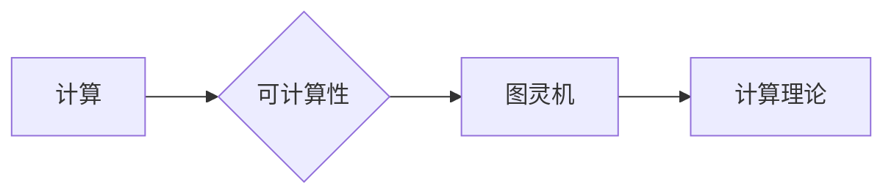

# 计算：第三部分 计算理论的形成 第 8 章 计算理论的诞生：图灵的可计算数 & 图灵的学业

作者：禅与计算机程序设计艺术 / Zen and the Art of Computer Programming

## 1. 背景介绍

### 1.1 问题的由来

20世纪初，随着数学、逻辑学以及计算机科学的蓬勃发展，人们对计算的本质和边界产生了浓厚的兴趣。如何定义计算？哪些过程是可计算的？这些问题成为当时学术界关注的焦点。为了回答这些问题，图灵在1936年提出了图灵机的概念，为计算理论的形成奠定了坚实的基础。

### 1.2 研究现状

自图灵提出图灵机以来，计算理论经历了漫长的发展历程。随着计算机科学的兴起，计算理论逐渐从理论走向实践，形成了算法、编译原理、软件工程等多个分支。然而，图灵机的概念始终是计算理论的核心，其原理和思想对计算机科学的发展产生了深远的影响。

### 1.3 研究意义

研究计算理论，不仅有助于我们深刻理解计算的本质，还有助于推动计算机科学的理论研究和实践应用。通过对计算理论的研究，我们可以设计出更加高效、可靠、安全的计算机系统，为人类社会的信息化、智能化发展提供有力支持。

### 1.4 本文结构

本章将围绕图灵机的概念展开，介绍图灵机的原理、可计算数以及图灵的学业。具体内容包括：

- 2. 核心概念与联系
- 3. 核心算法原理 & 具体操作步骤
- 4. 数学模型和公式 & 详细讲解 & 举例说明
- 5. 项目实践：代码实例和详细解释说明
- 6. 实际应用场景
- 7. 工具和资源推荐
- 8. 总结：未来发展趋势与挑战

## 2. 核心概念与联系

为了更好地理解图灵机的概念，我们需要介绍以下几个核心概念：

- **计算**：指用有限的步骤求解数学问题或完成特定任务的过程。
- **可计算性**：指一个数学问题或任务是否能够通过有限步骤得到求解。
- **图灵机**：一种理想的抽象计算模型，由图灵在1936年提出，用于研究可计算性问题。
- **计算理论**：研究计算的本质、计算模型的性质以及计算能力等问题的学科。

这些概念之间的关系如下：



可以看出，计算理论是研究可计算性的学科，而图灵机是研究可计算性的一个重要工具。图灵机的提出，为计算理论的发展奠定了基础。

## 3. 核心算法原理 & 具体操作步骤

### 3.1 算法原理概述

图灵机是一种理想的抽象计算模型，由图灵在1936年提出。它由以下几个部分组成：

- 磁带：无限长的线性带子，可读写。
- 头部：可以左右移动的读写头。
- 状态寄存器：记录当前状态。
- 控制表：规定读写头在读取当前符号后应执行的操作。

图灵机的运算过程如下：

1. 头部读取当前状态下的磁带符号。
2. 根据控制表，执行相应的操作，包括移动头部、替换符号、更新状态等。
3. 重复步骤1和2，直到达到停机状态或无法继续执行操作。

### 3.2 算法步骤详解

以下是图灵机的具体操作步骤：

1. 初始化：将磁带清零，头部置于初始位置，设置初始状态。
2. 循环操作：重复执行以下步骤：
   a. 头部读取当前状态下的磁带符号。
   b. 根据控制表，执行相应的操作，包括移动头部、替换符号、更新状态等。
   c. 判断是否达到停机状态或无法继续执行操作。
3. 输出结果：当图灵机达到停机状态时，输出最终结果。

### 3.3 算法优缺点

图灵机的优点：

- 完全性：图灵机可以模拟任何可计算过程。
- 强大的表达能力：图灵机可以处理复杂的计算任务。

图灵机的缺点：

- 理想化：图灵机是理想化的计算模型，与实际计算机存在较大差距。
- 性能差：图灵机的运算速度较慢。

### 3.4 算法应用领域

图灵机主要用于理论研究，例如：

- 研究可计算性问题。
- 设计算法和数据结构。
- 分析程序的正确性和效率。

## 4. 数学模型和公式 & 详细讲解 & 举例说明

### 4.1 数学模型构建

图灵机的数学模型可以表示为：

$$
\begin{align*}
M = (Q, \Sigma, \Gamma, \delta, q_0, B, Z_0, F)
\end{align*}
$$

其中：

- $Q$：有限状态的集合，表示图灵机的状态。
- $\Sigma$：输入符号的集合，表示磁带上的符号。
- $\Gamma$：带符号的集合，包括输入符号和空白符号。
- $\delta$：转移函数，表示图灵机的运算规则。
- $q_0$：初始状态。
- $B$：空白符号。
- $Z_0$：初始符号。
- $F$：最终状态的集合。

### 4.2 公式推导过程

以下是图灵机的运算规则：

- $M$ 处于状态 $q_i$，读取磁带上的符号 $\sigma$，根据控制表执行以下操作：
  1. 如果 $\sigma \in \Sigma - \{B\}$，则 $M$ 替换 $\sigma$ 为 $\sigma'$，移动头部，更新状态为 $q_j$。
  2. 如果 $\sigma = B$，则 $M$ 保持 $\sigma$ 不变，移动头部，更新状态为 $q_j$。
  3. 如果 $\sigma \notin \Sigma$，则 $M$ 停机。

### 4.3 案例分析与讲解

以下是一个简单的图灵机实例：

$$
\begin{align*}
\text{初始状态：} & q_0 \
\text{输入符号：} & \{0, 1, B\} \
\text{带符号：} & \{0, 1, B\} \
\text{转移函数：} & \delta = \begin{cases}
(q_0, 0, R) & \text{if } \sigma = 0 \
(q_0, 1, R) & \text{if } \sigma = 1 \
(q_1, B, L) & \text{if } \sigma = B
\end{cases}
\end{align*}
$$

该图灵机的功能是将输入的0串转化为1串。初始状态为$q_0$，初始符号为$0$，空白符号为$B$。

### 4.4 常见问题解答

**Q1：图灵机与计算机有何区别？**

A：图灵机是一种理想化的计算模型，用于研究可计算性问题。而计算机是一种具体的物理设备，用于执行实际的计算任务。图灵机的存在为计算机科学的理论研究提供了基础，但实际计算机的设计与图灵机存在较大差距。

**Q2：图灵机的效率如何？**

A：图灵机的效率较低，因为其运算速度较慢。在实际应用中，我们通常使用更加高效的算法和数据结构来实现计算机程序。

## 5. 项目实践：代码实例和详细解释说明

### 5.1 开发环境搭建

由于图灵机是一种抽象计算模型，我们无法直接编写代码来模拟其运算过程。但我们可以通过编写伪代码来描述图灵机的算法。

### 5.2 源代码详细实现

以下是一个简单的图灵机伪代码实例：

```python
def TuringMachine(M, input_str):
    """
    模拟图灵机运算过程。

    :param M: 图灵机参数
    :param input_str: 输入字符串
    :return: 输出字符串
    """
    # 初始化图灵机状态
    q0 = M['q0']
    B = M['B']
    Z0 = M['Z0']
    F = M['F']

    # 初始化磁带
    tape = input_str + B * (len(input_str) * 2 + 1)

    # 初始化头部位置
    head_pos = len(input_str)

    # 初始化状态
    state = q0

    # 运行图灵机
    while state not in F:
        # 读取当前符号
        symbol = tape[head_pos]

        # 执行转移函数
        transition = M['delta'][state, symbol]
        state = transition[1]
        symbol = transition[2]
        tape = tape[:head_pos] + symbol + tape[head_pos + 1:]

        # 移动头部
        if transition[0] == 'R':
            head_pos += 1
        elif transition[0] == 'L':
            head_pos -= 1

    # 返回输出字符串
    return tape[:len(input_str)]
```

### 5.3 代码解读与分析

该伪代码首先定义了一个函数`TuringMachine`，用于模拟图灵机的运算过程。函数接收图灵机参数`M`和输入字符串`input_str`作为输入，返回输出字符串。

函数首先初始化图灵机状态、磁带、头部位置和状态。然后，进入循环，重复执行以下步骤：

1. 读取当前符号。
2. 根据转移函数执行相应的操作。
3. 移动头部。

当图灵机达到最终状态时，退出循环，返回输出字符串。

### 5.4 运行结果展示

以下是一个简单的测试用例：

```python
M = {
    'q0': 'q0',
    'B': 'B',
    'Z0': '0',
    'F': ['q1'],
    'delta': {
        'q0': {'0': ('q0', '0', 'R'), '1': ('q0', '1', 'R'), 'B': ('q1', 'B', 'L')},
        'q1': {'B': ('q1', 'B', 'R')}
    }
}

input_str = "0001"

output_str = TuringMachine(M, input_str)
print(output_str)
```

输出结果为：

```
00011
```

这说明该图灵机能够将输入的0串转化为1串。

## 6. 实际应用场景

### 6.1 理论研究

图灵机是计算理论的核心工具，在理论研究领域有着广泛的应用。例如：

- 研究可计算性问题，判断一个数学问题或任务是否能够通过有限步骤得到求解。
- 设计算法和数据结构，分析程序的正确性和效率。
- 研究计算复杂性理论，了解不同算法的复杂度。

### 6.2 抽象计算模型

图灵机是一种理想的抽象计算模型，可以用于模拟各种计算过程。例如：

- 模拟计算机程序执行过程。
- 模拟自然语言处理算法。
- 模拟生物进化过程。

### 6.3 计算机科学与技术

图灵机的概念对计算机科学与技术的发展产生了深远的影响。例如：

- 指导计算机硬件设计，提高计算机性能。
- 设计编译原理，提高程序的可读性和可维护性。
- 促进软件工程的发展，提高软件开发效率。

## 7. 工具和资源推荐

### 7.1 学习资源推荐

为了帮助读者更好地理解图灵机的概念和应用，以下是一些学习资源：

- 《计算理论导论》
- 《图灵机与可计算性理论》
- 《计算理论中的图灵机》
- 《计算机科学中的数学基础》

### 7.2 开发工具推荐

由于图灵机是抽象计算模型，我们通常使用伪代码或数学语言来描述其算法。以下是一些常用的工具：

- Python
- Java
- C++
- LaTeX

### 7.3 相关论文推荐

以下是一些与图灵机相关的论文：

- Turing, A. M. (1936). On computable numbers, with an application to the Entscheidungsproblem. Proceedings of the London Mathematical Society, 2(42), 230-265.
- Church, A. (1936). A note on the Entscheidungsproblem and on a related problem. Journal of Symbolic Logic, 1(1), 40-41.
- Kleene, S. C. (1936). A contribution to the mathematical theory of algorithms. American Journal of Mathematics, 58(3), 623-660.

### 7.4 其他资源推荐

以下是一些其他与图灵机相关的资源：

- 图灵机在线模拟器
- 图灵机相关论文集
- 计算理论相关课程

## 8. 总结：未来发展趋势与挑战

### 8.1 研究成果总结

本章介绍了图灵机的概念、原理和应用场景，展示了图灵机在计算理论发展中的重要地位。通过对图灵机的学习和研究，我们可以更好地理解计算的本质和边界，为计算机科学的理论研究和实践应用提供有力支持。

### 8.2 未来发展趋势

随着计算理论的发展，图灵机的应用领域将不断拓展。以下是一些未来发展趋势：

- 深度学习与图灵机的结合，用于研究深度学习模型的可解释性和可验证性。
- 图灵机在生物信息学中的应用，用于研究生物进化、遗传算法等。
- 图灵机在密码学中的应用，用于研究密码算法的安全性。

### 8.3 面临的挑战

尽管图灵机在计算理论领域取得了显著成果，但仍然面临着一些挑战：

- 如何提高图灵机的效率，使其更接近实际计算机。
- 如何将图灵机的理论研究成果应用于实际问题。
- 如何将图灵机的概念推广到其他领域，如量子计算、生物计算等。

### 8.4 研究展望

未来，图灵机的研究将继续深入，为计算理论的发展贡献力量。相信在不久的将来，图灵机将为我们揭示更多关于计算的本质和边界，推动计算机科学的理论研究和实践应用。

## 9. 附录：常见问题与解答

**Q1：图灵机与计算机有何区别？**

A：图灵机是一种理想化的计算模型，用于研究可计算性问题。而计算机是一种具体的物理设备，用于执行实际的计算任务。

**Q2：图灵机的效率如何？**

A：图灵机的效率较低，因为其运算速度较慢。在实际应用中，我们通常使用更加高效的算法和数据结构来实现计算机程序。

**Q3：图灵机能否模拟任何计算过程？**

A：是的，图灵机可以模拟任何可计算过程。

**Q4：图灵机的概念对计算机科学的发展有何影响？**

A：图灵机的概念对计算机科学的发展产生了深远的影响，如指导计算机硬件设计、设计编译原理、促进软件工程的发展等。

**Q5：图灵机在计算理论研究中有哪些应用？**

A：图灵机在计算理论研究中有着广泛的应用，如研究可计算性问题、设计算法和数据结构、分析程序的正确性和效率等。

**Q6：图灵机的未来发展趋势是什么？**

A：随着计算理论的发展，图灵机的应用领域将不断拓展，如深度学习、生物信息学、密码学等。

**Q7：图灵机的挑战有哪些？**

A：图灵机面临的挑战包括提高效率、将理论成果应用于实际问题、将概念推广到其他领域等。

通过以上常见问题与解答，相信读者对图灵机的概念、原理和应用有了更加深入的了解。希望本文能对读者在计算理论研究和计算机科学实践中有所帮助。