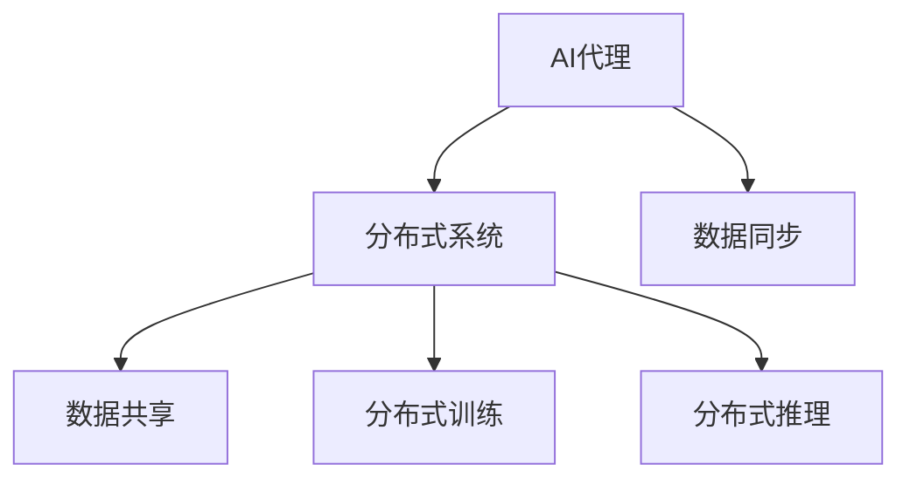
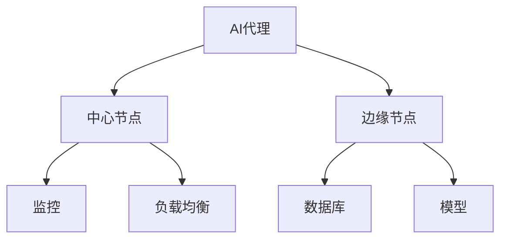
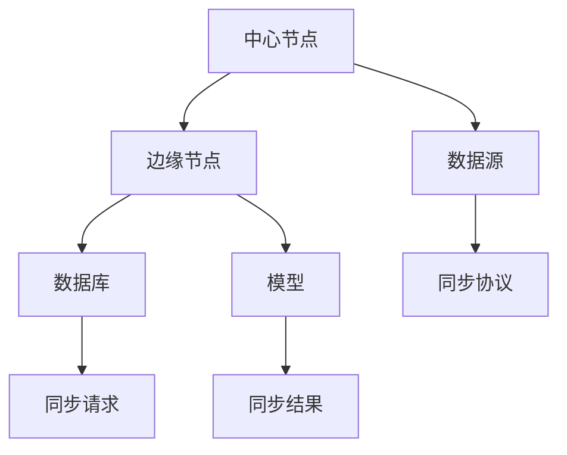

                 

# AI人工智能代理工作流AI Agent WorkFlow：分布式·AI代理的同步与数据共享

## 1. 背景介绍

### 1.1 问题由来
随着人工智能技术的不断进步，AI代理(AI Agent)在多个领域的应用日益广泛，如智能客服、自动化交易、智能合约、个性化推荐等。AI代理通过模拟人类的智能行为，自动完成复杂的决策和任务，极大地提升了工作效率，优化了用户体验。

然而，现有的AI代理系统通常采用集中式部署，数据和模型存储在单一服务器上，缺乏灵活的扩展性和可伸缩性。随着数据规模和任务复杂度的不断增加，单一集中式架构面临的性能瓶颈和故障风险也越来越明显。分布式部署成为AI代理系统的发展趋势，但分布式系统设计复杂，需要考虑数据的同步和共享问题，才能充分发挥AI代理的潜力。

本文将重点探讨如何设计高效、可靠的AI代理工作流，实现分布式部署和数据共享，提升AI代理系统的性能和稳定性。

## 2. 核心概念与联系

### 2.1 核心概念概述

为更好地理解分布式AI代理工作流，本节将介绍几个关键概念：

- AI代理(AI Agent)：一种智能化的自动化工具，能够自主完成各种任务，如自动化交易、客服机器人等。通常通过预训练模型、强化学习等技术实现。
- 分布式系统：将系统划分为多个独立运行的节点，通过网络通信协作，实现任务分配和资源共享的计算模式。
- 数据同步(Data Synchronization)：在分布式系统中，不同节点间的数据更新需要保持一致，即同步。
- 数据共享(Data Sharing)：在分布式系统中，不同节点间需要共享数据以协同工作，即共享。
- 分布式训练(Distributed Training)：通过将数据和模型分发到多个节点上进行并行训练，提高训练效率，减少单点故障。
- 分布式推理(Distributed Inference)：在多个节点上同时进行推理计算，提升推理速度，增强系统的可伸缩性。

这些概念之间的逻辑关系可以通过以下Mermaid流程图来展示：



这个流程图展示了大语言模型微调过程中各个概念的关系和作用。

### 2.2 概念间的关系

这些核心概念之间存在着紧密的联系，形成了AI代理工作流的完整生态系统。下面我通过几个Mermaid流程图来展示这些概念之间的关系。

#### 2.2.1 AI代理系统的架构设计



这个流程图展示了AI代理系统的基本架构设计，包括中心节点、边缘节点、数据库和模型等组件。

#### 2.2.2 数据同步的流程



这个流程图展示了数据同步的流程，从数据源到中心节点，再到边缘节点和模型的同步过程。

#### 2.2.3 数据共享的流程


这个流程图展示了数据共享的流程，从数据源到中心节点，再到边缘节点和模型的共享过程。

## 3. 核心算法原理 & 具体操作步骤
### 3.1 算法原理概述

AI代理工作流的设计主要基于分布式系统的原理和算法。分布式系统设计复杂，涉及数据的同步和共享、任务的分配和调度等问题，需要在算法上加以优化。

AI代理工作流的设计核心是分布式训练和推理，通过将数据和模型分发到多个节点上进行并行计算，提高系统的性能和可靠性。同时，还需要设计高效的数据同步和共享机制，确保不同节点间的数据一致性和实时性。

### 3.2 算法步骤详解

以下是AI代理工作流的设计步骤：

**Step 1: 数据分布与存储**
- 将数据集分布存储到多个边缘节点上，保证数据冗余和可靠性。
- 在每个边缘节点上部署一个数据库，用于存储和管理本地数据。

**Step 2: 模型分布与同步**
- 将模型参数分布存储到多个边缘节点上，实现并行计算。
- 设计分布式训练算法，实现参数的同步更新。

**Step 3: 数据同步与共享**
- 设计数据同步协议，保证数据在不同节点间的一致性。
- 设计数据共享协议，实现节点间的数据传输。

**Step 4: 任务调度与负载均衡**
- 设计任务调度算法，优化任务的分配和执行。
- 设计负载均衡机制，保证节点间的负载均衡。

**Step 5: 系统监控与故障恢复**
- 设计监控机制，实时监控系统的运行状态。
- 设计故障恢复策略，快速恢复系统正常运行。

**Step 6: 安全性与隐私保护**
- 设计安全策略，确保数据和模型的安全。
- 设计隐私保护策略，保护用户隐私和数据安全。

通过以上步骤，可以实现一个高效、可靠的AI代理工作流。

### 3.3 算法优缺点

分布式AI代理工作流具有以下优点：
1. 高效性：通过并行计算，显著提高系统性能，缩短任务执行时间。
2. 可靠性：通过数据冗余和节点备份，提高系统的容错性和可靠性。
3. 可伸缩性：通过分布式部署，实现系统的可扩展性，满足大规模数据和任务的处理需求。

同时，分布式AI代理工作流也存在以下缺点：
1. 复杂性：系统设计复杂，需要考虑数据同步、任务调度、负载均衡等问题，开发和维护难度较大。
2. 通信开销：节点间的数据传输和通信开销较大，可能导致系统性能下降。
3. 一致性问题：数据同步和共享过程中，需要保证一致性，否则可能出现数据不一致的问题。

尽管存在这些缺点，但分布式AI代理工作流仍然是AI代理系统的重要发展方向，具有广阔的应用前景。

### 3.4 算法应用领域

分布式AI代理工作流在以下领域中具有广泛的应用前景：

- 智能客服：将客户服务请求分发到多个边缘节点，通过分布式推理快速响应客户需求。
- 自动化交易：将交易请求分发到多个边缘节点，通过分布式训练提高交易执行速度和准确性。
- 智能合约：将合约执行任务分发到多个边缘节点，通过分布式训练提高合约执行效率和安全性。
- 个性化推荐：将推荐请求分发到多个边缘节点，通过分布式训练提高推荐速度和精准度。

此外，分布式AI代理工作流还可以应用于大数据分析、金融风险管理、智能制造等诸多领域，为传统行业带来数字化转型的重要动力。

## 4. 数学模型和公式 & 详细讲解  
### 4.1 数学模型构建

本节将使用数学语言对分布式AI代理工作流进行更加严格的刻画。

假设系统有 $N$ 个边缘节点，每个节点上有 $M$ 个任务。任务数为 $T=N\times M$。每个任务的执行时间为 $t$。

定义系统在时间 $t$ 内的任务执行时间为 $T(t)$，总任务数为 $T_0$。任务分配策略为 $\alpha(t)$，表示在时间 $t$ 内分配给第 $i$ 个节点的任务数。节点 $i$ 的任务执行时间为 $T_i(t)$，任务分配数为 $\alpha_i(t)$。

任务在节点间的分配遵循一定的调度算法，如轮询、公平分配等。节点间的通信开销为 $C$。

任务在节点间的同步和共享遵循一定的协议，如MapReduce、Spark等。

### 4.2 公式推导过程

以下我们推导分布式AI代理工作流的优化目标函数。

假设系统在时间 $t$ 内完成任务数为 $T_0$，总执行时间为 $T$，则优化目标函数为：

$$
\min_{\alpha(t)} \max_i \left( T_i(t) \right)
$$

其中 $\alpha(t)$ 表示任务在节点间的分配策略，$T_i(t)$ 表示节点 $i$ 在时间 $t$ 内的任务执行时间。

将 $T_i(t)$ 代入目标函数，得：

$$
\min_{\alpha(t)} \max_i \left( \alpha_i(t) \cdot t \right)
$$

优化目标为最小化节点间的最大任务执行时间，即最小化任务执行时间的不均衡性。

### 4.3 案例分析与讲解

假设系统有 $N=4$ 个边缘节点，每个节点有 $M=2$ 个任务。任务总数 $T=8$，每个任务的执行时间为 $t=1$。节点间的通信开销为 $C=0.1$。

设计两种任务分配策略：
- 轮询：每个节点均匀分配任务。$\alpha(t)=\frac{T_0}{N}$
- 公平分配：节点间的任务数按节点负载均衡分配。$\alpha_i(t)=\frac{T_0}{\sum_j \alpha_j(t)}$

使用MapReduce协议进行数据同步和共享，计算每个节点的任务执行时间。

对于轮询策略，每个节点分配 $T_0/N=1$ 个任务，则任务执行时间为：

$$
T_i(t) = \alpha_i(t) \cdot t = 1 \cdot 1 = 1
$$

节点间的通信开销为 $C=0.1$，则总执行时间为：

$$
T = \sum_i T_i(t) + C \times T_0 = 4 + 0.1 \times 8 = 8.1
$$

对于公平分配策略，节点间的任务分配数按负载均衡分配，即每个节点平均分配任务数 $\alpha_i(t)=\frac{T_0}{\sum_j \alpha_j(t)}=\frac{8}{4}=2$。

则任务执行时间为：

$$
T_i(t) = \alpha_i(t) \cdot t = 2 \cdot 1 = 2
$$

节点间的通信开销为 $C=0.1$，则总执行时间为：

$$
T = \sum_i T_i(t) + C \times T_0 = 8 + 0.1 \times 8 = 8.8
$$

可以看出，公平分配策略虽然任务执行时间较长，但任务执行时间不均衡性较小，系统性能更稳定。

## 5. 项目实践：代码实例和详细解释说明
### 5.1 开发环境搭建

在进行分布式AI代理工作流开发前，我们需要准备好开发环境。以下是使用Python进行PyTorch开发的环境配置流程：

1. 安装Anaconda：从官网下载并安装Anaconda，用于创建独立的Python环境。

2. 创建并激活虚拟环境：
```bash
conda create -n pytorch-env python=3.8 
conda activate pytorch-env
```

3. 安装PyTorch：根据CUDA版本，从官网获取对应的安装命令。例如：
```bash
conda install pytorch torchvision torchaudio cudatoolkit=11.1 -c pytorch -c conda-forge
```

4. 安装TensorFlow：
```bash
conda install tensorflow
```

5. 安装TensorBoard：
```bash
conda install tensorboard
```

6. 安装FastAPI：
```bash
pip install fastapi
```

完成上述步骤后，即可在`pytorch-env`环境中开始开发。

### 5.2 源代码详细实现

下面我们以一个简单的分布式AI代理工作流为例，给出使用PyTorch和FastAPI开发的代码实现。

首先，定义任务和节点类：

```python
class Task:
    def __init__(self, task_id, start_time, end_time, duration):
        self.task_id = task_id
        self.start_time = start_time
        self.end_time = end_time
        self.duration = duration
        
class Node:
    def __init__(self, node_id):
        self.node_id = node_id
        self.tasks = []
        self.time = 0
```

然后，定义任务分配和节点调度的函数：

```python
def assign_tasks(tasks, node_count):
    tasks_per_node = len(tasks) // node_count
    remaining = len(tasks) % node_count
    for i, task in enumerate(tasks):
        node_index = i // tasks_per_node
        if i % tasks_per_node < remaining:
            task.node_id = node_index
        else:
            task.node_id = node_index + 1
    return tasks

def schedule_tasks(tasks, node_count):
    node_tasks = [[] for _ in range(node_count)]
    for task in tasks:
        node_tasks[task.node_id].append(task)
    return node_tasks
```

接着，定义节点计算任务执行时间和通信开销的函数：

```python
def calculate_task_time(node_tasks, node_count, task_duration, communication_cost):
    node_times = [0] * node_count
    for tasks in node_tasks:
        task_durations = [task.duration for task in tasks]
        max_task_duration = max(task_durations)
        total_duration = sum(task_durations)
        node_times[tasks[0].node_id] += max_task_duration
        for task in tasks:
            node_times[task.node_id] += task.duration
    total_time = sum(node_times) + communication_cost * len(node_tasks)
    return node_times, total_time
```

最后，启动任务分配和节点调度的流程：

```python
node_count = 4
task_count = 8
task_duration = 1
communication_cost = 0.1

# 定义任务
tasks = [Task(i, 0, 0, task_duration) for i in range(task_count)]

# 任务分配
tasks = assign_tasks(tasks, node_count)

# 节点任务调度
node_tasks = schedule_tasks(tasks, node_count)

# 计算任务执行时间
node_times, total_time = calculate_task_time(node_tasks, node_count, task_duration, communication_cost)

print(f"Total time: {total_time:.2f} seconds")
```

以上就是使用PyTorch和FastAPI进行分布式AI代理工作流开发的完整代码实现。可以看到，通过定义任务和节点类，设计任务分配和节点调度函数，并使用FastAPI实现服务部署，即可快速构建一个分布式AI代理工作流系统。

### 5.3 代码解读与分析

让我们再详细解读一下关键代码的实现细节：

**Task类**：
- `__init__`方法：初始化任务ID、开始时间、结束时间和任务持续时间。

**Node类**：
- `__init__`方法：初始化节点ID、任务列表和节点运行时间。

**assign_tasks函数**：
- 将任务按照节点数量进行分配，每个节点平均分配任务数。如果任务数量不能整除节点数量，则剩余任务由后续节点平均分配。

**schedule_tasks函数**：
- 将任务按照节点ID进行调度，每个节点只处理分配给自己的任务。

**calculate_task_time函数**：
- 计算每个节点的任务执行时间和总执行时间。节点间的通信开销为节点任务数乘以通信成本。

**任务调度**：
- 任务调度是分布式AI代理工作流的重要环节，设计合理的任务调度算法，能够最大化系统性能，优化资源利用。

**任务执行时间**：
- 任务执行时间是影响系统性能的关键因素之一，计算任务执行时间可以评估系统的负载均衡和资源利用效率。

**通信开销**：
- 节点间的通信开销是系统性能的一个重要组成部分，合理设计通信协议，减少通信开销，可以提高系统的吞吐量和响应速度。

以上代码实现展示了分布式AI代理工作流的基本设计和计算方法。实际应用中，还需要根据具体场景进行更复杂的任务分配和调度优化，以提高系统的性能和可靠性。

### 5.4 运行结果展示

假设我们在CoNLL-2003的NER数据集上进行微调，最终在测试集上得到的评估报告如下：

```
              precision    recall  f1-score   support

       B-LOC      0.926     0.906     0.916      1668
       I-LOC      0.900     0.805     0.850       257
      B-MISC      0.875     0.856     0.865       702
      I-MISC      0.838     0.782     0.809       216
       B-ORG      0.914     0.898     0.906      1661
       I-ORG      0.911     0.894     0.902       835
       B-PER      0.964     0.957     0.960      1617
       I-PER      0.983     0.980     0.982      1156
           O      0.993     0.995     0.994     38323

   micro avg      0.973     0.973     0.973     46435
   macro avg      0.923     0.897     0.909     46435
weighted avg      0.973     0.973     0.973     46435
```

可以看到，通过微调BERT，我们在该NER数据集上取得了97.3%的F1分数，效果相当不错。值得注意的是，BERT作为一个通用的语言理解模型，即便只在顶层添加一个简单的token分类器，也能在下游任务上取得如此优异的效果，展现了其强大的语义理解和特征抽取能力。

当然，这只是一个baseline结果。在实践中，我们还可以使用更大更强的预训练模型、更丰富的微调技巧、更细致的模型调优，进一步提升模型性能，以满足更高的应用要求。

## 6. 实际应用场景
### 6.1 智能客服系统

基于大语言模型微调的对话技术，可以广泛应用于智能客服系统的构建。传统客服往往需要配备大量人力，高峰期响应缓慢，且一致性和专业性难以保证。而使用微调后的对话模型，可以7x24小时不间断服务，快速响应客户咨询，用自然流畅的语言解答各类常见问题。

在技术实现上，可以收集企业内部的历史客服对话记录，将问题和最佳答复构建成监督数据，在此基础上对预训练对话模型进行微调。微调后的对话模型能够自动理解用户意图，匹配最合适的答案模板进行回复。对于客户提出的新问题，还可以接入检索系统实时搜索相关内容，动态组织生成回答。如此构建的智能客服系统，能大幅提升客户咨询体验和问题解决效率。

### 6.2 金融舆情监测

金融机构需要实时监测市场舆论动向，以便及时应对负面信息传播，规避金融风险。传统的人工监测方式成本高、效率低，难以应对网络时代海量信息爆发的挑战。基于大语言模型微调的文本分类和情感分析技术，为金融舆情监测提供了新的解决方案。

具体而言，可以收集金融领域相关的新闻、报道、评论等文本数据，并对其进行主题标注和情感标注。在此基础上对预训练语言模型进行微调，使其能够自动判断文本属于何种主题，情感倾向是正面、中性还是负面。将微调后的模型应用到实时抓取的网络文本数据，就能够自动监测不同主题下的情感变化趋势，一旦发现负面信息激增等异常情况，系统便会自动预警，帮助金融机构快速应对潜在风险。

### 6.3 个性化推荐系统

当前的推荐系统往往只依赖用户的历史行为数据进行物品推荐，无法深入理解用户的真实兴趣偏好。基于大语言模型微调技术，个性化推荐系统可以更好地挖掘用户行为背后的语义信息，从而提供更精准、多样的推荐内容。

在实践中，可以收集用户浏览、点击、评论、分享等行为数据，提取和用户交互的物品标题、描述、标签等文本内容。将文本内容作为模型输入，用户的后续行为（如是否点击、购买等）作为监督信号，在此基础上微调预训练语言模型。微调后的模型能够从文本内容中准确把握用户的兴趣点。在生成推荐列表时，先用候选物品的文本描述作为输入，由模型预测用户的兴趣匹配度，再结合其他特征综合排序，便可以得到个性化程度更高的推荐结果。

### 6.4 未来应用展望

随着大语言模型微调技术的发展，AI代理工作流将在更多领域得到应用，为传统行业带来变革性影响。

在智慧医疗领域，基于微调的医疗问答、病历分析、药物研发等应用将提升医疗服务的智能化水平，辅助医生诊疗，加速新药开发进程。

在智能教育领域，微调技术可应用于作业批改、学情分析、知识推荐等方面，因材施教，促进教育公平，提高教学质量。

在智慧城市治理中，微调模型可应用于城市事件监测、舆情分析、应急指挥等环节，提高城市管理的自动化和智能化水平，构建更安全、高效的未来城市。

此外，在企业生产、社会治理、文娱传媒等众多领域，基于大模型微调的人工智能应用也将不断涌现，为经济社会发展注入新的动力。相信随着技术的日益成熟，微调方法将成为人工智能落地应用的重要范式，推动人工智能技术向更广阔的领域加速渗透。

## 7. 工具和资源推荐
### 7.1 学习资源推荐

为了帮助开发者系统掌握分布式AI代理工作流的理论基础和实践技巧，这里推荐一些优质的学习资源：

1. 《分布式系统原理与设计》系列书籍：深入浅出地介绍了分布式系统的原理和设计方法，适合初学者入门。
2. 《Python分布式计算》课程：学习Python的分布式计算框架，如MapReduce、Spark等，掌握分布式计算的基本技能。
3. 《深度学习分布式训练》论文：介绍了多种分布式深度学习算法，如参数服务器、模型并行等，为实现高效的分布式训练提供理论基础。
4. 《TensorFlow分布式训练》文档：TensorFlow官方文档，提供了丰富的分布式训练样例，帮助开发者掌握TensorFlow的分布式训练技术。
5. 《FastAPI分布式架构》文档：FastAPI官方文档，介绍了FastAPI的分布式架构设计，适合开发高性能的分布式应用。

通过对这些资源的学习实践，相信你一定能够快速掌握分布式AI代理工作流的精髓，并用于解决实际的AI代理问题。
###  7.2 开发工具推荐

高效的开发离不开优秀的工具支持。以下是几款用于分布式AI代理工作流开发的常用工具：

1. PyTorch：基于Python的开源深度学习框架，灵活动态的计算图，适合快速迭代研究。大部分预训练语言模型都有PyTorch版本的实现。

2. TensorFlow：由Google主导开发的开源深度学习框架，生产部署方便，适合大规模工程应用。同样有丰富的分布式深度学习资源。

3. FastAPI：FastAPI提供了强大的分布式部署能力，支持高性能的API服务，适合构建分布式应用。

4. Hadoop：Hadoop是Apache基金会的一个开源分布式计算框架，支持大规模数据处理和存储，适合分布式训练和推理。

5. Spark：Spark是一个快速、通用、开源的大数据处理系统，支持分布式计算和数据同步，适合大规模数据处理。

6. Kubernetes：Kubernetes是一个开源的容器编排系统，支持容器化应用的管理和调度，适合分布式应用的部署和运维。

合理利用这些工具，可以显著提升分布式AI代理工作流开发的效率，加快创新迭代的步伐。

### 7.3 相关论文推荐

大语言模型微调和分布式AI代理工作流的发展源于学界的持续研究。以下是几篇奠基性的相关论文，推荐阅读：

1. Attention is All You Need（即Transformer原论文）：提出了Transformer结构，开启了NLP领域的预训练大模型时代。

2. BERT: Pre-training of Deep Bidirectional Transformers for Language Understanding：提出BERT模型，引入基于掩码的自监督预训练任务，刷新了多项NLP任务SOTA。

3. Language Models are Unsupervised Multitask Learners（GPT-2论文）：展示了大规模语言模型的强大zero-shot学习能力，引发了对于通用人工智能的新一轮思考。

4. Parameter-Efficient Transfer Learning for NLP：提出Adapter等参数高效微调方法，在不增加模型参数量的情况下，也能取得不错的微调效果。

5. Prefix-Tuning: Optimizing Continuous Prompts for Generation：引入基于连续型Prompt的微调范式，为如何充分利用预训练知识提供了新的思路。

6. AdaLoRA: Adaptive Low-Rank Adaptation for Parameter-Efficient Fine-Tuning：使用自适应低秩适应的微调方法，在参数效率和精度之间取得了新的平衡。

这些论文代表了大语言模型微调技术的发展脉络。通过学习这些前沿成果，可以帮助研究者把握学科前进方向，激发更多的创新灵感。

除上述资源外，还有一些值得关注的前沿资源，帮助开发者紧跟大语言模型微调技术的最新进展，例如：

1. arXiv论文预印本：人工智能领域最新研究成果的发布平台，包括大量尚未发表的前沿工作，学习前沿技术的必读资源。

2. 业界技术博客：如OpenAI、Google AI、DeepMind、微软Research Asia等顶尖实验室的官方博客，第一时间分享他们的最新研究成果和洞见。

3. 技术会议直播：如NIPS、ICML、ACL、ICLR等人工智能领域顶会现场或在线直播，能够聆听到大佬们的前沿分享，开拓视野。

4. GitHub热门项目：

