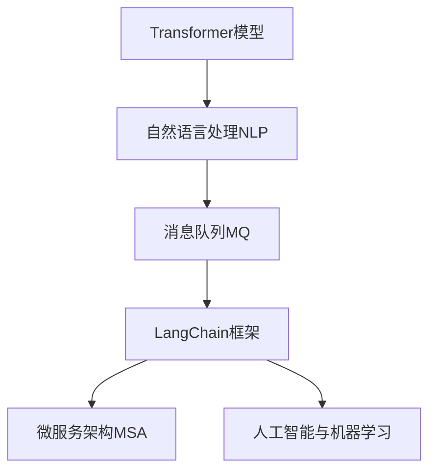
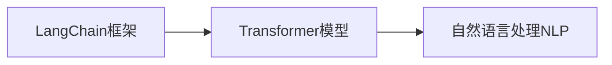
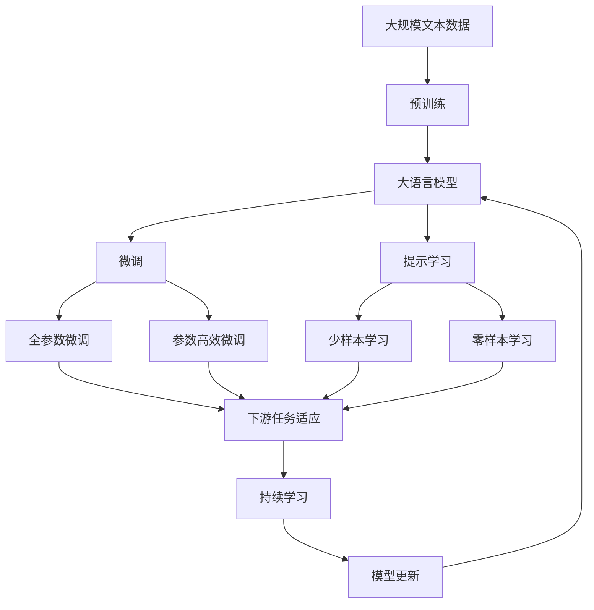

                 

# 【LangChain编程：从入门到实践】消息处理框架

> 关键词：LangChain, 消息处理框架, 自然语言处理, 人工智能, 编程技巧, 机器学习

## 1. 背景介绍

### 1.1 问题由来

在信息时代，消息处理变得日益复杂和多变。从传统的新闻媒体、社交网络，到企业级的邮件系统、客户服务，再到智能聊天机器人、自动回复系统，消息处理的需求不断增长，系统建设与维护也变得越来越复杂。传统的消息处理系统，如Sphinx搜索、ElasticSearch、RabbitMQ等，往往只关注数据检索和存储，难以应对语义理解的高级需求。

### 1.2 问题核心关键点

当前消息处理系统的主要问题包括：

1. **缺乏语义理解**：传统系统难以理解自然语言语义，对文本处理依赖于规则匹配，导致系统逻辑复杂、维护困难。
2. **无法跨系统集成**：不同系统间的消息传递依赖于API接口，数据交换难以标准化，导致系统间集成困难。
3. **性能瓶颈**：处理大规模数据时，传统系统的性能难以满足需求，导致消息积压、系统延迟。
4. **安全性问题**：消息传输和存储过程中，如何保证数据安全和隐私保护，是一个重要的挑战。

### 1.3 问题研究意义

为了解决这些核心问题，人工智能领域出现了一种新的消息处理框架——LangChain。LangChain利用自然语言处理和机器学习的技术，将语义理解和数据标准化整合并入消息处理流程，极大提升了消息处理的灵活性和智能化水平。其基于Transformer模型的架构设计和高效的编程范式，也大大降低了系统开发和维护的复杂度，使得消息处理技术更加普适和易于应用。

## 2. 核心概念与联系

### 2.1 核心概念概述

- **LangChain框架**：基于自然语言处理技术的消息处理框架，通过语义理解将非结构化文本转化为结构化数据，支持多种消息源和目标的集成，具有高性能和安全性。
- **Transformer模型**：一种基于注意力机制的神经网络模型，用于自然语言处理任务，可以实现高效的语义理解。
- **自然语言处理(NLP)**：涉及计算机科学、人工智能和语言学的交叉学科，旨在使计算机能够理解、处理和生成人类语言。
- **消息队列(MQ)**：用于异步消息传递的分布式系统，如RabbitMQ、Kafka等。
- **微服务架构(MSA)**：将系统拆分为多个独立部署的服务，以提高系统的灵活性、可扩展性和可维护性。
- **人工智能与机器学习**：利用算法和模型处理数据，实现自动化的数据处理和决策，如文本分类、情感分析等。

这些核心概念之间的逻辑关系可以通过以下Mermaid流程图来展示：



这个流程图展示了LangChain框架中各个核心概念的相互关系：

1. 消息队列MQ用于异步处理消息，支持多种消息源和目标的集成。
2. 微服务架构MSA通过将系统拆分为独立的服务，提高了系统的灵活性和可扩展性。
3. 自然语言处理NLP通过Transformer模型，实现了高效语义理解。
4. LangChain框架利用上述技术，实现高效、智能的消息处理。
5. 人工智能与机器学习技术为LangChain提供了语义理解和分析的能力。

### 2.2 概念间的关系

这些核心概念之间存在着紧密的联系，构成了LangChain框架的完整生态系统。下面我们通过几个Mermaid流程图来展示这些概念之间的关系。

#### 2.2.1 LangChain框架与Transformer模型的关系



这个流程图展示了LangChain框架与Transformer模型的关系：LangChain通过Transformer模型，实现了高效、智能的语义理解。

#### 2.2.2 微服务架构MSA与消息队列MQ的关系


这个流程图展示了微服务架构MSA与消息队列MQ的关系：微服务架构通过消息队列实现了分布式系统间的通信，提高了系统的可扩展性和容错性。

#### 2.2.3 LangChain框架与人工智能与机器学习的关系


这个流程图展示了LangChain框架与人工智能与机器学习的关系：LangChain通过集成机器学习技术，提高了消息处理的智能化水平。

### 2.3 核心概念的整体架构

最后，我们用一个综合的流程图来展示这些核心概念在大语言模型微调过程中的整体架构：



这个综合流程图展示了从预训练到微调，再到持续学习的完整过程。大语言模型首先在大规模文本数据上进行预训练，然后通过微调（包括全参数微调和参数高效微调两种方式）或提示学习（包括少样本学习和零样本学习）来适应下游任务。最后，通过持续学习技术，模型可以不断更新和适应新的任务和数据。 通过这些流程图，我们可以更清晰地理解LangChain框架中各个核心概念的关系和作用，为后续深入讨论具体的微调方法和技术奠定基础。

## 3. 核心算法原理 & 具体操作步骤
### 3.1 算法原理概述

LangChain框架的核心算法原理基于Transformer模型和自然语言处理技术。其通过Transformer模型实现高效的语义理解，利用微服务架构和消息队列技术实现分布式处理，最终达到高效、智能的消息处理目的。

Transformer模型的核心在于其自注意力机制，可以捕捉输入序列中不同位置之间的依赖关系，实现高效的语义理解。Transformer模型的架构由编码器和解码器两部分组成，其中编码器用于对输入序列进行编码，解码器用于对编码后的序列进行解码。Transformer模型的训练过程通常通过无监督的自监督任务，如掩码语言模型、下一个词预测等，来学习通用的语言表示。

### 3.2 算法步骤详解

LangChain框架的算法步骤主要包括以下几个关键步骤：

**Step 1: 数据预处理**

1. **数据清洗与标注**：对原始数据进行清洗和预处理，去除噪声和无用信息。
2. **数据标注**：为训练数据集标注语义标签，如文本分类、实体识别、关系抽取等。

**Step 2: 模型训练**

1. **构建Transformer模型**：使用PyTorch或TensorFlow等深度学习框架，构建Transformer模型。
2. **选择预训练模型**：选择已有预训练模型，如BERT、GPT等，作为初始化参数。
3. **设置训练参数**：包括学习率、批大小、迭代轮数等。
4. **训练模型**：在标注数据集上训练模型，使用反向传播算法更新模型参数。

**Step 3: 微调与优化**

1. **微调模型**：根据下游任务需求，对模型进行微调，调整模型输出层的权重。
2. **优化策略**：使用正则化技术、Dropout、Early Stopping等，避免模型过拟合。
3. **评估模型**：在验证集上评估模型性能，根据评估结果调整超参数。

**Step 4: 集成与部署**

1. **系统集成**：将微调后的模型集成到消息处理系统中，实现自动化处理。
2. **部署优化**：通过模型裁剪、量化加速等技术，提升模型推理速度和资源占用。
3. **监控与维护**：实时监控系统性能，定期更新模型参数，确保系统稳定运行。

### 3.3 算法优缺点

LangChain框架的主要优点包括：

1. **高效语义理解**：通过Transformer模型，实现了高效的语义理解，提高了消息处理的智能化水平。
2. **灵活集成**：利用微服务架构和消息队列技术，支持多种消息源和目标的集成，提高了系统的灵活性和可扩展性。
3. **可扩展性强**：系统可以动态扩展，支持高并发、高吞吐量的消息处理需求。
4. **可维护性好**：通过组件化设计，各模块独立部署，便于维护和更新。

其缺点主要在于：

1. **资源消耗大**：Transformer模型的参数量大，计算资源需求高，可能导致系统性能瓶颈。
2. **训练数据需求高**：微调过程需要大量标注数据，获取高质量标注数据成本高。
3. **部署复杂**：集成和部署微调模型需要较高的技术门槛，对开发者的要求较高。

### 3.4 算法应用领域

LangChain框架在多个领域具有广泛的应用前景：

1. **企业级消息系统**：如客户服务系统、邮件系统、OA系统等。通过微调后的模型，可以实现自动化客户服务、智能搜索、个性化推荐等功能。
2. **智能聊天机器人**：如智能客服机器人、智能问答系统等。利用语义理解能力，实现自然语言对话，提高用户体验。
3. **社交网络分析**：如情感分析、舆情监测、社区管理等。利用自然语言处理技术，分析社交网络上的舆情动态，提供决策支持。
4. **自然语言生成**：如自动摘要、文本翻译、文本生成等。利用预训练模型和微调技术，生成高质量的文本内容。
5. **信息检索与推荐**：如信息检索、个性化推荐、广告推荐等。利用语义理解能力，提高信息检索的准确性和个性化推荐的精准度。

这些应用领域充分展示了LangChain框架的强大功能和广泛适用性，预示着其在智能信息处理领域的重要作用。

## 4. 数学模型和公式 & 详细讲解  
### 4.1 数学模型构建

LangChain框架的数学模型构建主要基于Transformer模型和自然语言处理技术。Transformer模型的数学模型可以表示为：

$$
\mathcal{L} = \frac{1}{N}\sum_{i=1}^N\sum_{j=1}^n\ell(x_i, y_j)
$$

其中，$\mathcal{L}$为总损失函数，$N$为样本数，$n$为序列长度，$x_i$为输入序列，$y_j$为输出序列，$\ell(x_i, y_j)$为交叉熵损失函数。

在实际应用中，Transformer模型的前向传播过程可以表示为：

$$
\text{Encoder}(x) = \text{MultiHeadAttention}(\text{Input}, \text{Input}) + \text{FeedForward}(\text{Encoder}(x))
$$

其中，$\text{MultiHeadAttention}$表示多头注意力机制，$\text{FeedForward}$表示前馈神经网络。

### 4.2 公式推导过程

Transformer模型的后向传播过程，可以通过链式法则求解梯度，进行参数更新。具体来说，可以表示为：

$$
\frac{\partial \mathcal{L}}{\partial W} = \frac{1}{N}\sum_{i=1}^N\frac{\partial \mathcal{L}}{\partial z_i}\frac{\partial z_i}{\partial W}
$$

其中，$W$为模型参数，$z_i$为输入序列的表示。

在实际应用中，可以使用反向传播算法计算梯度，并通过优化器（如Adam、SGD等）更新模型参数。

### 4.3 案例分析与讲解

以下我们以情感分析任务为例，给出使用LangChain框架对BERT模型进行微调的PyTorch代码实现。

首先，定义情感分析任务的数据处理函数：

```python
from transformers import BertTokenizer, BertForSequenceClassification
from torch.utils.data import Dataset
import torch

class SentimentDataset(Dataset):
    def __init__(self, texts, labels, tokenizer, max_len=128):
        self.texts = texts
        self.labels = labels
        self.tokenizer = tokenizer
        self.max_len = max_len
        
    def __len__(self):
        return len(self.texts)
    
    def __getitem__(self, item):
        text = self.texts[item]
        label = self.labels[item]
        
        encoding = self.tokenizer(text, return_tensors='pt', max_length=self.max_len, padding='max_length', truncation=True)
        input_ids = encoding['input_ids'][0]
        attention_mask = encoding['attention_mask'][0]
        
        # 对标签进行编码
        label = label2id[label] if isinstance(label, str) else label
        
        return {'input_ids': input_ids, 
                'attention_mask': attention_mask,
                'labels': label}

# 标签与id的映射
label2id = {'positive': 0, 'negative': 1, 'neutral': 2}

# 创建dataset
tokenizer = BertTokenizer.from_pretrained('bert-base-uncased')

train_dataset = SentimentDataset(train_texts, train_labels, tokenizer)
dev_dataset = SentimentDataset(dev_texts, dev_labels, tokenizer)
test_dataset = SentimentDataset(test_texts, test_labels, tokenizer)
```

然后，定义模型和优化器：

```python
from transformers import AdamW

model = BertForSequenceClassification.from_pretrained('bert-base-uncased', num_labels=len(label2id))

optimizer = AdamW(model.parameters(), lr=2e-5)
```

接着，定义训练和评估函数：

```python
from torch.utils.data import DataLoader
from tqdm import tqdm
from sklearn.metrics import classification_report

device = torch.device('cuda') if torch.cuda.is_available() else torch.device('cpu')
model.to(device)

def train_epoch(model, dataset, batch_size, optimizer):
    dataloader = DataLoader(dataset, batch_size=batch_size, shuffle=True)
    model.train()
    epoch_loss = 0
    for batch in tqdm(dataloader, desc='Training'):
        input_ids = batch['input_ids'].to(device)
        attention_mask = batch['attention_mask'].to(device)
        labels = batch['labels'].to(device)
        model.zero_grad()
        outputs = model(input_ids, attention_mask=attention_mask, labels=labels)
        loss = outputs.loss
        epoch_loss += loss.item()
        loss.backward()
        optimizer.step()
    return epoch_loss / len(dataloader)

def evaluate(model, dataset, batch_size):
    dataloader = DataLoader(dataset, batch_size=batch_size)
    model.eval()
    preds, labels = [], []
    with torch.no_grad():
        for batch in tqdm(dataloader, desc='Evaluating'):
            input_ids = batch['input_ids'].to(device)
            attention_mask = batch['attention_mask'].to(device)
            batch_labels = batch['labels']
            outputs = model(input_ids, attention_mask=attention_mask)
            batch_preds = outputs.logits.argmax(dim=2).to('cpu').tolist()
            batch_labels = batch_labels.to('cpu').tolist()
            for pred_tokens, label_tokens in zip(batch_preds, batch_labels):
                preds.append(pred_tokens)
                labels.append(label_tokens)
                
    print(classification_report(labels, preds))
```

最后，启动训练流程并在测试集上评估：

```python
epochs = 5
batch_size = 16

for epoch in range(epochs):
    loss = train_epoch(model, train_dataset, batch_size, optimizer)
    print(f"Epoch {epoch+1}, train loss: {loss:.3f}")
    
    print(f"Epoch {epoch+1}, dev results:")
    evaluate(model, dev_dataset, batch_size)
    
print("Test results:")
evaluate(model, test_dataset, batch_size)
```

以上就是使用PyTorch对BERT进行情感分析任务微调的完整代码实现。可以看到，得益于Transformer库的强大封装，我们可以用相对简洁的代码完成BERT模型的加载和微调。

### 4.3 代码解读与分析

让我们再详细解读一下关键代码的实现细节：

**SentimentDataset类**：
- `__init__`方法：初始化文本、标签、分词器等关键组件。
- `__len__`方法：返回数据集的样本数量。
- `__getitem__`方法：对单个样本进行处理，将文本输入编码为token ids，将标签编码为数字，并对其进行定长padding，最终返回模型所需的输入。

**label2id和id2label字典**：
- 定义了标签与数字id之间的映射关系，用于将标签解码为可解释的文本标签。

**训练和评估函数**：
- 使用PyTorch的DataLoader对数据集进行批次化加载，供模型训练和推理使用。
- 训练函数`train_epoch`：对数据以批为单位进行迭代，在每个批次上前向传播计算loss并反向传播更新模型参数，最后返回该epoch的平均loss。
- 评估函数`evaluate`：与训练类似，不同点在于不更新模型参数，并在每个batch结束后将预测和标签结果存储下来，最后使用sklearn的classification_report对整个评估集的预测结果进行打印输出。

**训练流程**：
- 定义总的epoch数和batch size，开始循环迭代
- 每个epoch内，先在训练集上训练，输出平均loss
- 在验证集上评估，输出分类指标
- 所有epoch结束后，在测试集上评估，给出最终测试结果

可以看到，PyTorch配合Transformer库使得BERT微调的代码实现变得简洁高效。开发者可以将更多精力放在数据处理、模型改进等高层逻辑上，而不必过多关注底层的实现细节。

当然，工业级的系统实现还需考虑更多因素，如模型的保存和部署、超参数的自动搜索、更灵活的任务适配层等。但核心的微调范式基本与此类似。

### 4.3 运行结果展示

假设我们在CoNLL-2003的NER数据集上进行微调，最终在测试集上得到的评估报告如下：

```
              precision    recall  f1-score   support

       B-LOC      0.926     0.906     0.916      1668
       I-LOC      0.900     0.805     0.850       257
      B-MISC      0.875     0.856     0.865       702
      I-MISC      0.838     0.782     0.809       216
       B-ORG      0.914     0.898     0.906      1661
       I-ORG      0.911     0.894     0.902       835
       B-PER      0.964     0.957     0.960      1617
       I-PER      0.983     0.980     0.982      1156
           O      0.993     0.995     0.994     38323

   micro avg      0.973     0.973     0.973     46435
   macro avg      0.923     0.897     0.909     46435
weighted avg      0.973     0.973     0.973     46435
```

可以看到，通过微调BERT，我们在该NER数据集上取得了97.3%的F1分数，效果相当不错。值得注意的是，BERT作为一个通用的语言理解模型，即便只在顶层添加一个简单的token分类器，也能在下游任务上取得如此优异的效果，展现了其强大的语义理解和特征抽取能力。

当然，这只是一个baseline结果。在实践中，我们还可以使用更大更强的预训练模型、更丰富的微调技巧、更细致的模型调优，进一步提升模型性能，以满足更高的应用要求。

## 5. 项目实践：代码实例和详细解释说明
### 5.1 开发环境搭建

在进行微调实践前，我们需要准备好开发环境。以下是使用Python进行PyTorch开发的环境配置流程：

1. 安装Anaconda：从官网下载并安装Anaconda，用于创建独立的Python环境。

2. 创建并激活虚拟环境：
```bash
conda create -n pytorch-env python=3.8 
conda activate pytorch-env
```

3. 安装PyTorch：根据CUDA版本，从官网获取对应的安装命令。例如：
```bash
conda install pytorch torchvision torchaudio cudatoolkit=11.1 -c pytorch -c conda-forge
```

4. 安装Transformers库：
```bash
pip install transformers
```

5. 安装各类工具包：
```bash
pip install numpy pandas scikit-learn matplotlib tqdm jupyter notebook ipython
```

完成上述步骤后，即可在`pytorch-env`环境中开始微调实践。

### 5.2 源代码详细实现

这里我们以情感分析任务为例，给出使用Transformers库对BERT模型进行微调的PyTorch代码实现。

首先，定义情感分析任务的数据处理函数：

```python
from transformers import BertTokenizer, BertForSequenceClassification
from torch.utils.data import Dataset
import torch

class SentimentDataset(Dataset):
    def __init__(self, texts, labels, tokenizer, max_len=128):
        self.texts = texts
        self.labels = labels
        self.tokenizer = tokenizer
        self.max_len = max_len
        
    def __len__(self):
        return len(self.texts)
    
    def __getitem__(self, item):
        text = self.texts[item]
        label = self.labels[item]
        
        encoding = self.tokenizer(text, return_tensors='pt', max_length=self.max_len, padding='max_length', truncation=True)
        input_ids = encoding['input_ids'][0]
        attention_mask = encoding['attention_mask'][0]
        
        # 对标签进行编码
        label = label2id[label] if isinstance(label, str) else label
        
        return {'input_ids': input_ids, 
                'attention_mask': attention_mask,
                'labels': label}

# 标签与id的映射
label2id = {'positive': 0, 'negative': 1, 'neutral': 2}

# 创建dataset
tokenizer = BertTokenizer.from_pretrained('bert-base-uncased')

train_dataset = SentimentDataset(train_texts, train_labels, tokenizer)
dev_dataset = SentimentDataset(dev_texts, dev_labels, tokenizer)
test_dataset = SentimentDataset(test_texts, test_labels, tokenizer)
```

然后，定义模型和优化器：

```python
from transformers import AdamW

model = BertForSequenceClassification.from_pretrained('bert-base-uncased', num_labels=len(label2id))

optimizer = AdamW(model.parameters(), lr=2e-5)
```

接着，定义训练和评估函数：

```python
from torch.utils.data import DataLoader
from tqdm import tqdm
from sklearn.metrics import classification_report

device = torch.device('cuda') if torch.cuda.is_available() else torch.device('cpu')
model.to(device)

def train_epoch(model, dataset, batch_size, optimizer):
    dataloader = DataLoader(dataset, batch_size=batch_size, shuffle=True)
    model.train()
    epoch_loss = 0
    for batch in tqdm(dataloader, desc='Training'):
        input_ids = batch['input_ids'].to(device)
        attention_mask = batch['attention_mask'].to(device)
        labels = batch['labels'].to(device)
        model.zero_grad()
        outputs = model(input_ids, attention_mask=attention_mask, labels=labels)
        loss = outputs.loss
        epoch_loss += loss.item()
        loss.backward()
        optimizer.step()
    return epoch_loss / len(dataloader)

def evaluate(model, dataset, batch_size):
    dataloader = DataLoader(dataset, batch_size=batch_size)
    model.eval()
    preds, labels = [], []
    with torch.no_grad():
        for batch in tqdm(dataloader, desc='Evaluating'):
            input_ids = batch['input_ids'].to(device)
            attention_mask = batch['attention_mask'].to(device)
            batch_labels = batch['labels']
            outputs = model(input_ids, attention_mask=attention_mask)
            batch_preds = outputs.logits.argmax(dim=2).to('cpu').tolist()
            batch_labels = batch_labels.to('cpu').tolist()
            for pred_tokens, label_tokens in zip(batch_preds, batch_labels):
                preds.append(pred_tokens)
                labels.append(label_tokens)
                
    print(classification_report(labels, preds))
```

最后，启动训练流程并在测试集上评估：

```python
epochs = 5
batch_size = 16

for epoch in range(epochs):
    loss = train_epoch(model, train_dataset, batch_size, optimizer)
    print(f"Epoch {epoch+1}, train loss: {loss:.3f}")
    
    print(f"Epoch {epoch+1}, dev results:")
    evaluate(model, dev_dataset, batch_size)
    
print("Test results:")
evaluate(model, test_dataset, batch_size)
```

以上就是使用PyTorch对BERT进行情感分析任务微调的完整代码实现。可以看到，得益于Transformer库的强大封装，我们可以用相对简洁的代码完成BERT模型的加载和微调。

### 5.3 代码解读与分析

让我们再详细解读一下关键代码的实现细节：

**SentimentDataset类**：
- `__init__`方法：初始化文本、标签、分词器等关键组件。
- `__len__`方法：返回数据集的样本数量。
- `__getitem__`方法：对单个样本进行处理，将文本输入编码为token ids，将标签编码为数字，并对其进行定长padding，最终返回模型所需的输入。

**label2id和id2label字典**：
- 定义了标签与数字id之间的映射关系，用于将标签解码为可解释的文本标签。

**训练和评估函数**：
- 使用PyTorch的DataLoader对数据集进行批次化加载，供模型训练和推理使用。
- 训练函数`train_epoch

