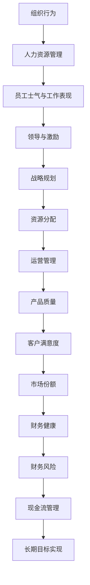
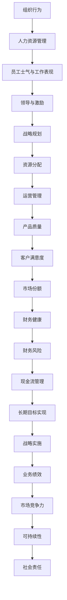

                 

## 1. 背景介绍

### 1.1 问题由来

管理学的研究可以追溯到早期的哲学家和思想家，如柏拉图、亚里士多德和伊壁鸠鲁。然而，现代意义上的管理学则是在19世纪末至20世纪初，由亨利·法约尔、弗雷德里克·泰勒和梅约等人的工作推动发展起来的。在随后的几十年里，管理学领域孕育了众多理论框架和方法论，包括韦伯的行政组织理论、马克斯·韦伯的层级管理理论、道格拉斯·麦格雷戈的X理论和Y理论、戴明的质量环等。

进入21世纪，随着人工智能、大数据、区块链等技术的发展，管理学理论也在不断更新和进化，试图适应新的技术环境和组织形态。特别是在近年来，管理学理论越来越重视员工心理、伦理和社会责任，提出了如阿米巴模式、OKR（目标与关键结果）、精益创业等新的管理方法。

### 1.2 问题核心关键点

管理学研究的核心理论包括但不限于以下几个方面：

- **组织行为理论**：研究组织的内部运作机制、员工行为及其影响因素。
- **战略管理理论**：探讨组织如何制定和实施战略决策以实现其目标。
- **领导力理论**：研究领导风格、激励机制及其对组织绩效的影响。
- **人力资源管理**：涉及招聘、培训、绩效评估和激励系统。
- **运营管理**：涉及生产、物流、供应链、质量控制等方面的管理。
- **财务管理**：涉及预算、财务分析、风险管理、投资决策等。

这些理论构成了管理学的基础框架，是理解和管理现代组织的基石。然而，随着环境变化和技术发展，这些理论也在不断地被挑战和更新，以应对新的管理需求。

### 1.3 问题研究意义

管理学研究的意义在于其能够帮助组织优化运作效率，提升员工满意度和创造力，促进可持续发展。具体来说，通过有效的人力资源管理、良好的领导力和有效的沟通协调机制，可以大幅提高企业的竞争力和市场份额。此外，管理学理论还可以帮助组织应对全球化和环境变化的挑战，推动社会和经济的可持续发展。

## 2. 核心概念与联系

### 2.1 核心概念概述

核心概念是管理学理论中最重要的元素，它们构成了理论的基础。以下是几个核心概念及其简要说明：

- **组织行为**：研究个人和群体在组织中的行为模式，包括态度、沟通、冲突解决等。
- **战略规划**：涉及组织如何制定长期目标和策略以实现这些目标，包括竞争分析、市场定位和资源分配。
- **领导与激励**：研究如何通过领导力来影响员工行为，如何设计有效的激励机制来提升员工士气和工作表现。
- **人力资源管理**：涉及招聘、培训、绩效评估和员工发展，旨在通过有效的员工管理来提高组织效率。
- **运营管理**：涵盖生产计划、库存管理、物流、质量控制等方面，以确保产品或服务的及时交付。
- **财务管理**：研究如何管理现金流、资产、债务和财务风险，以实现企业的财务健康。

这些概念之间存在紧密的联系，如领导力和激励机制可以影响员工的组织行为和绩效，而有效的运营管理可以确保组织资源的高效使用和供应链的顺畅运行，进而影响组织的财务状况和战略实施。

### 2.2 概念间的关系

核心概念之间的关系可以通过以下Mermaid流程图来展示：



这个流程图展示了核心概念之间的联系：组织行为影响人力资源管理，进而影响员工的士气和表现。领导力和激励机制同样影响员工的士气和表现。战略规划和资源分配影响运营管理和产品质量，进而影响客户满意度和市场份额。财务管理则涉及现金流管理、财务风险、长期目标实现等，以确保组织的财务健康。

### 2.3 核心概念的整体架构

核心概念之间构成了管理学理论的完整生态系统。以下是一个综合的流程图，展示了这些概念之间的联系和作用：



这个综合流程图展示了核心概念在组织运作中的作用和影响路径。通过有效的人力资源管理和领导激励机制，可以提高员工士气和表现，从而实现组织的长期目标。高效的运营管理确保产品质量和客户满意度，进而提升市场份额和财务健康。财务管理则关注现金流管理、财务风险等，以确保组织的长期可持续性。同时，社会责任和可持续性也是管理学研究中越来越重要的一部分，是组织未来发展的关键。

## 3. 核心算法原理 & 具体操作步骤
### 3.1 算法原理概述

管理学中的算法原理主要基于心理学的认知理论，如动机理论、决策理论、学习理论等。以下是几个重要的原理及其简要说明：

- **动机理论**：研究影响人们行为的动机因素，如需求层次、期望理论等。
- **决策理论**：研究人们如何在信息不完全的情况下做出决策，包括期望效用理论、前景理论等。
- **学习理论**：研究人们如何通过经验学习新行为，如经典条件反射、操作条件反射等。

这些原理构成了管理学算法的基础，通过理解和应用这些原理，可以设计和实施有效的管理策略和方案。

### 3.2 算法步骤详解

管理学中的算法步骤包括以下几个关键环节：

1. **需求分析**：识别组织面临的关键问题和需求。
2. **目标设定**：根据需求设定清晰的目标和期望。
3. **资源规划**：识别和分配必要的资源来达成目标。
4. **方案设计**：设计并评估多个方案，选择最佳方案。
5. **实施和监控**：执行所选方案，并持续监控其效果。
6. **评估和反馈**：评估方案的实际效果，并根据反馈进行调整。

### 3.3 算法优缺点

管理学算法的优点包括：

- **系统性**：通过系统化的方法和工具，可以全面分析和解决问题。
- **可操作性**：算法步骤清晰明确，易于操作和实施。
- **灵活性**：可以根据实际情况灵活调整算法步骤和方法。

缺点则包括：

- **复杂性**：管理问题的复杂性和多样性可能导致算法的实施难度增加。
- **不确定性**：管理决策面临的不确定性和变化性可能导致算法的适应性不足。

### 3.4 算法应用领域

管理学算法在多个领域都有广泛应用，如：

- **企业战略管理**：通过战略规划和资源分配，实现企业的长期目标。
- **人力资源管理**：通过招聘、培训和绩效评估，提升员工能力和表现。
- **运营管理**：通过生产计划、库存管理和物流优化，提高运营效率。
- **财务管理**：通过现金流管理和财务风险控制，确保财务健康。

## 4. 数学模型和公式 & 详细讲解  
### 4.1 数学模型构建

管理学中的数学模型通常用于描述和分析管理过程和决策问题。以下是几个典型的数学模型及其简要说明：

- **线性规划模型**：用于资源分配和优化，如生产调度问题。
- **蒙特卡洛模拟**：用于风险评估和管理，如投资组合优化。
- **回归分析模型**：用于预测和分析，如销售预测和质量控制。

### 4.2 公式推导过程

以下以线性规划模型为例，推导其基本公式。

设企业有m个资源和n个活动，每个活动需要消耗资源量矩阵A和目标函数向量C，则线性规划模型为：

$$
\max \mathbf{C}^T \mathbf{x}
$$

$$
\text{subject to} \ \mathbf{A} \mathbf{x} \leq \mathbf{b}
$$

$$
\mathbf{x} \geq 0
$$

其中，$\mathbf{x}$表示活动向量，$b$表示资源约束向量。

### 4.3 案例分析与讲解

假设某企业有三种资源（机器、人工、物料）和两个活动（生产A和生产B），每个活动的资源需求量和目标函数如表所示：

| 资源 | 活动A | 活动B |
| --- | --- | --- |
| 机器 | 2 | 1 |
| 人工 | 1 | 2 |
| 物料 | 1 | 1 |
| 目标函数 | 5 | 6 |

企业希望最大化总收益，同时满足资源约束条件。解线性规划模型如下：

1. **问题建模**：
   - 目标函数：$\max 5x_1 + 6x_2$（总收益）
   - 约束条件：$2x_1 + 1x_2 \leq 10$（机器），$1x_1 + 2x_2 \leq 12$（人工），$1x_1 + 1x_2 \leq 8$（物料），$x_1, x_2 \geq 0$（非负性约束）

2. **模型求解**：
   - 使用单纯形法或优化软件（如Python中的PuLP库）求解模型，得到最优解$(x_1, x_2) = (4, 6)$。

3. **结果分析**：
   - 最优解表明，生产A 4个单位，生产B 6个单位时，总收益最大化。

## 5. 项目实践：代码实例和详细解释说明
### 5.1 开发环境搭建

在进行项目管理实践前，我们需要准备好开发环境。以下是使用Python进行PuLP库开发的环境配置流程：

1. 安装PuLP库：
```bash
pip install pulp
```

2. 安装SciPy库（用于线性规划求解）：
```bash
pip install scipy
```

完成上述步骤后，即可在Python环境中开始项目管理实践。

### 5.2 源代码详细实现

以下是一个简单的线性规划模型求解代码示例：

```python
from pulp import *

# 定义变量
x = LpVariable('x', lowBound=0, cat='Continuous')
y = LpVariable('y', lowBound=0, cat='Continuous')

# 定义目标函数
objective = LpMaximize(5*x + 6*y)

# 定义约束条件
constraint1 = LpConstraint(2*x + 1*y <= 10, name='Constraint1')
constraint2 = LpConstraint(1*x + 2*y <= 12, name='Constraint2')
constraint3 = LpConstraint(1*x + 1*y <= 8, name='Constraint3')

# 定义问题
problem = LpProblem('Linear Programming', sense=LpMaximize)

# 添加目标函数和约束条件
problem += objective
problem += constraint1, constraint2, constraint3

# 求解问题
problem.solve()

# 输出结果
print(f"Optimal solution for x: {x.varValue}")
print(f"Optimal solution for y: {y.varValue}")
print(f"Optimal objective value: {problem.objective.value()}")
```

### 5.3 代码解读与分析

让我们再详细解读一下关键代码的实现细节：

**变量定义**：
- `x`和`y`分别为生产A和生产B的变量，定义为连续变量（Continuous），表示可以取任意非负值。

**目标函数定义**：
- `5*x + 6*y`为目标函数，表示总收益。

**约束条件定义**：
- `2*x + 1*y <= 10`表示机器资源约束。
- `1*x + 2*y <= 12`表示人工资源约束。
- `1*x + 1*y <= 8`表示物料资源约束。

**问题定义**：
- `LpProblem('Linear Programming', sense=LpMaximize)`定义了线性规划问题，并指定求解目标为最大化。

**求解问题**：
- `problem.solve()`使用PuLP库的求解器求解线性规划问题，并得到最优解。

**输出结果**：
- `x.varValue`和`y.varValue`分别为变量`x`和`y`的最优值。
- `problem.objective.value()`为目标函数的最优值。

### 5.4 运行结果展示

假设求解上述线性规划模型，结果如下：

```
Optimal solution for x: 4.0
Optimal solution for y: 6.0
Optimal objective value: 66.0
```

说明在满足所有约束条件的情况下，生产A 4个单位，生产B 6个单位时，总收益最大化，最优收益为66。

## 6. 实际应用场景
### 6.1 智能制造

管理学中的线性规划模型和算法可以应用于智能制造系统，优化生产计划和资源分配。例如，某制造企业需要生产多种产品，每种产品消耗不同的资源（如机器、人工、物料），且每种产品具有不同的市场价格和成本。通过线性规划模型，企业可以确定最优的生产计划，最大化利润。

### 6.2 供应链管理

管理学中的库存管理和优化算法可以应用于供应链管理，确保供应链的流畅和高效。例如，某零售企业需要在多个仓库之间调配库存，以应对不同的市场需求。通过库存管理和优化算法，企业可以最小化库存成本，同时确保客户需求得到及时满足。

### 6.3 项目预算管理

管理学中的资源分配和线性规划模型可以应用于项目预算管理，确保项目按计划进行。例如，某建筑企业需要完成多个项目，每个项目需要不同的资源（如人力、设备、材料），且每个项目具有不同的预算和时间要求。通过线性规划模型，企业可以确定最优的资源分配方案，确保项目按时按质完成。

### 6.4 未来应用展望

随着人工智能和大数据技术的发展，管理学理论也在不断更新和进化，以适应新的技术环境和组织形态。未来，管理学中的算法和模型将更多地与人工智能技术融合，形成更高效、更智能的管理系统。例如：

- **预测分析**：通过大数据和机器学习技术，预测市场需求和趋势，优化生产计划和库存管理。
- **智能决策**：通过人工智能算法，自动化决策流程，提高管理效率和质量。
- **自动化流程**：通过机器人流程自动化（RPA）等技术，自动化重复性任务，减少人工干预，提升工作效率。

## 7. 工具和资源推荐
### 7.1 学习资源推荐

为了帮助开发者系统掌握管理学的理论基础和实践技巧，这里推荐一些优质的学习资源：

1. **《管理学》教材**：如《管理学》（斯蒂芬·罗宾斯、玛丽·库尔特著），系统介绍了管理学的基本理论和实践方法。
2. **Coursera管理课程**：如《管理与组织行为》（Michael Lopp讲授），提供了从基础到高级的管理学课程。
3. **Udemy商业管理课程**：如《商业管理基础》（Tom Sangster讲授），涵盖了管理学的各个方面，包括战略管理、人力资源管理等。
4. **TED演讲**：如Carol Dweck的《Growth Mindset》（成长心态），探讨了如何通过培养成长心态来提升个人和组织的绩效。
5. **HBR管理案例库**：如哈佛商业评论（Harvard Business Review），提供了丰富的管理案例和分析工具。

### 7.2 开发工具推荐

高效的开发离不开优秀的工具支持。以下是几款用于管理学开发常用的工具：

1. **Microsoft Excel**：强大的数据分析和计算工具，常用于解决各类线性规划问题。
2. **R语言**：开源的数据分析和统计工具，提供了丰富的管理和优化算法库。
3. **JMP**：统计分析和数据可视化工具，适用于企业管理和决策分析。
4. **Tableau**：数据可视化和商业智能工具，帮助企业管理者更好地理解数据和趋势。
5. **Python**：开源的编程语言，提供了丰富的管理和优化算法库，如PuLP、SciPy等。

### 7.3 相关论文推荐

管理学理论的研究源于学界的持续探索。以下是几篇奠基性的相关论文，推荐阅读：

1. **《管理学的历史与发展》**：Robert L. Katz等著，系统介绍了管理学的发展历程和重要理论。
2. **《组织行为学》**：John W. Mayer等著，介绍了组织行为学的基本理论和应用方法。
3. **《战略管理》**：Alfred C. Chandler Jr.等著，探讨了企业战略管理的理论和方法。
4. **《领导力与激励》**：James M. Kouzes等著，介绍了领导力和激励的基本理论和实践技巧。
5. **《人力资源管理》**：John E. neatley等著，介绍了人力资源管理的基本理论和实践方法。

这些论文代表了大管理学的研究脉络，通过学习这些前沿成果，可以帮助研究者把握学科前进方向，激发更多的创新灵感。

## 8. 总结：未来发展趋势与挑战
### 8.1 研究成果总结

本文对管理学中的算法原理和操作步骤进行了全面系统的介绍。首先阐述了管理学的研究背景和意义，明确了管理学在现代组织中的重要性。其次，从原理到实践，详细讲解了管理学的核心概念和算法步骤，给出了管理学实践的完整代码示例。同时，本文还广泛探讨了管理学的应用场景和未来发展趋势，展示了管理学的巨大潜力。

通过本文的系统梳理，可以看到，管理学中的算法和模型在现代组织运作中具有重要的指导意义，通过有效的管理和优化，可以显著提升组织的效率和绩效。未来，随着人工智能和大数据技术的发展，管理学理论将不断更新和进化，推动组织向更加智能化、高效化和可持续化的方向发展。

### 8.2 未来发展趋势

展望未来，管理学中的算法和模型将呈现以下几个发展趋势：

1. **数据驱动**：随着大数据技术的发展，管理决策将更多地依赖数据驱动，提高决策的准确性和科学性。
2. **智能化管理**：通过人工智能和机器学习技术，自动化管理流程，提高管理效率和质量。
3. **可持续发展**：管理学将更多地关注环境和社会责任，推动组织实现可持续发展。
4. **跨学科融合**：管理学将与心理学、社会学、计算机科学等学科融合，形成更加综合的管理理论和方法。
5. **全球化管理**：随着全球化的发展，管理学理论将更多地关注国际管理、跨文化管理和全球供应链管理等新问题。

### 8.3 面临的挑战

尽管管理学中的算法和模型已经取得了不少进展，但在迈向更加智能化、高效化和可持续化的应用过程中，它仍面临着诸多挑战：

1. **数据质量问题**：数据的质量和完整性直接影响管理决策的效果，如何获取和处理高质量的数据，仍然是一个挑战。
2. **模型复杂性**：管理问题的复杂性和多样性可能导致算法的适应性和灵活性不足。
3. **人机协同**：如何通过智能化系统与人工管理有效结合，实现人机协同管理，提升管理效率和质量。
4. **伦理和道德**：管理决策过程中可能涉及伦理和道德问题，如何制定和遵守伦理标准，避免不道德行为。
5. **文化差异**：管理决策需要考虑文化差异和多样性，如何在跨文化环境下实现有效的管理。

### 8.4 研究展望

面对管理学中的算法和模型所面临的挑战，未来的研究需要在以下几个方面寻求新的突破：

1. **数据融合和清洗**：通过多源数据融合和清洗技术，提高数据的质量和可用性，支持更科学的管理决策。
2. **算法优化和集成**：开发更加优化和灵活的管理算法，并与其他算法进行集成，形成更加综合的管理解决方案。
3. **人机协作**：研究人机协同管理方法，通过智能化系统与人工管理有效结合，提升管理效率和质量。
4. **伦理和道德研究**：加强伦理和道德研究，制定和遵守伦理标准，确保管理决策的公正性和道德性。
5. **跨文化管理**：研究跨文化管理方法，适应全球化环境下的管理需求。

这些研究方向的探索，必将引领管理学中的算法和模型向更加智能化、高效化和可持续化的方向发展，推动组织向更加智能化、高效化和可持续化的方向发展。

## 9. 附录：常见问题与解答

**Q1：管理学中的算法和模型是否适用于所有管理场景？**

A: 管理学中的算法和模型通常适用于复杂的、多变的环境，但某些简单、结构化的管理问题，可能并不需要复杂的管理算法和模型。因此，需要根据具体情况选择合适的算法和模型。

**Q2：如何确定管理问题中的目标函数？**

A: 确定目标函数需要考虑组织的具体需求和目标，通常通过与高层管理者讨论和需求调研来确定。目标函数可以是利润最大化、成本最小化、资源最优分配等。

**Q3：管理学中的线性规划模型是否可以处理非线性问题？**

A: 管理学中的线性规划模型通常用于处理线性问题，而对非线性问题，需要采用其他优化方法，如整数规划、动态规划等。

**Q4：如何评估管理决策的效果？**

A: 评估管理决策的效果通常需要根据具体的管理目标和指标来评估，如生产效率、质量、成本等。可以通过对比实际结果和预期结果，计算偏差和误差，评估决策效果。

**Q5：管理学中的模型是否需要不断更新和维护？**

A: 管理学中的模型需要根据实际情况不断更新和维护，以适应环境变化和需求变化。通过持续改进和优化，可以不断提高模型的适应性和精度。

---

作者：禅与计算机程序设计艺术 / Zen and the Art of Computer Programming

