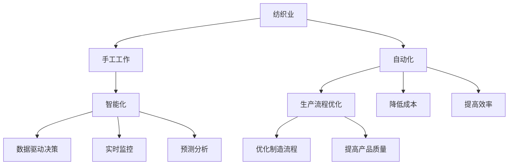

                 

# 纺织业自动化初期的手工工作

## 1. 背景介绍

### 1.1 问题由来

在现代自动化和人工智能技术飞速发展的今天，我们经常会听到“自动化”和“智能”这样的词，但很多人可能还不清楚它们到底是什么，以及它们如何改变了我们的生产和生活方式。通过了解纺织业自动化初期的手工工作，我们可以更好地理解这些技术的发展背景和原理。

### 1.2 问题核心关键点

本章节主要关注自动化和智能技术在纺织业中的应用，并重点介绍在自动化初期手工工作的重要性和其与自动化技术的关系。

## 2. 核心概念与联系

### 2.1 核心概念概述

在本章节中，我们将介绍几个与纺织业自动化初期手工工作相关的核心概念，并通过它们之间的关系来理解自动化技术的发展过程。

- **纺织业**：是指利用天然纤维或化学纤维进行纱线、织布、染整等工序的产业。
- **自动化**：是指利用机器代替人工进行生产、制造和操作的技术。
- **智能**：是指利用人工智能技术实现更高效率和智能化操作的过程。
- **手工工作**：在自动化初期，手工工作是纺织业生产的主要方式，包括纺纱、织布、染色等工序。

### 2.2 概念间的关系

以下通过Mermaid流程图展示这些核心概念之间的关系：



通过以上流程图，我们可以看到手工工作是纺织业的基础，自动化技术通过优化生产流程、降低成本和提高效率等手段，使纺织业的生产方式从手工工作逐渐转向自动化。而智能化技术则进一步利用数据驱动决策、实时监控和预测分析等手段，使得纺织业的自动化程度不断提高，生产更加智能化和自动化。

## 3. 核心算法原理 & 具体操作步骤

### 3.1 算法原理概述

在本章节中，我们将通过数学模型和算法来阐述纺织业自动化初期手工工作的原理，并详细介绍其操作步骤。

#### 3.1.1 纺织业手工工作模型

在纺织业中，手工工作主要包括以下几个步骤：

1. 纺纱：将纤维原料制成纱线。
2. 织布：将纱线织成布料。
3. 染色：将布料染色。
4. 后整理：对布料进行后期处理。

#### 3.1.2 数据模型构建

为了更好地理解手工工作，我们可以建立一个数学模型来描述其流程和参数。设 $x_i$ 表示第 $i$ 道工序的时间成本， $y_i$ 表示第 $i$ 道工序的产量， $z_i$ 表示第 $i$ 道工序的质量指标，则有以下数据模型：

$$
\begin{cases}
x_1 = x_{手工} \\
x_2 = k_1x_1 \\
x_3 = k_2x_2 \\
x_4 = k_3x_3 \\
y_1 = x_1 \\
y_2 = k_4x_2 \\
y_3 = k_5x_3 \\
y_4 = k_6x_4 \\
z_1 = x_1 \\
z_2 = k_7x_2 \\
z_3 = k_8x_3 \\
z_4 = k_9x_4
\end{cases}
$$

其中，$k_i$ 表示第 $i$ 道工序的生产效率。

#### 3.1.3 数据模型求解

我们可以通过求解上述模型来确定每个工序的时间成本和产量，从而得到手工工作的时间总成本和总产量。

### 3.2 算法步骤详解

#### 3.2.1 数据收集

1. 收集每个工序的时间成本、产量和质量指标。
2. 对数据进行预处理和清洗，确保数据的准确性和完整性。

#### 3.2.2 数据建模

1. 根据收集的数据，建立数学模型。
2. 利用统计学方法确定模型的参数 $k_i$。

#### 3.2.3 算法求解

1. 利用求解算法求解模型的参数。
2. 根据求解结果，计算总时间成本和总产量。

#### 3.2.4 结果验证

1. 对计算结果进行验证，确保其符合实际情况。
2. 对模型进行优化，提高其准确性和可靠性。

### 3.3 算法优缺点

#### 3.3.1 优点

1. 模型易于理解：手工工作模型直观明了，便于理解和实现。
2. 数据驱动决策：模型以数据为驱动，能更好地反映实际生产情况。

#### 3.3.2 缺点

1. 数据收集难度大：需要收集大量的数据，数据收集成本较高。
2. 模型更新难度大：手工工作模型一旦建立，更新难度较大。

### 3.4 算法应用领域

手工工作模型主要应用于纺织业的生产流程优化、成本控制和质量管理等领域。

## 4. 数学模型和公式 & 详细讲解 & 举例说明

### 4.1 数学模型构建

在本章节中，我们将通过数学模型来阐述纺织业手工工作过程，并详细介绍其公式推导和案例分析。

#### 4.1.1 手工工作模型

1. 纺纱： $x_1 = x_{手工}$
2. 织布： $x_2 = k_1x_1$
3. 染色： $x_3 = k_2x_2$
4. 后整理： $x_4 = k_3x_3$

#### 4.1.2 产量模型

1. 纺纱： $y_1 = x_1$
2. 织布： $y_2 = k_4x_2$
3. 染色： $y_3 = k_5x_3$
4. 后整理： $y_4 = k_6x_4$

#### 4.1.3 质量模型

1. 纺纱： $z_1 = x_1$
2. 织布： $z_2 = k_7x_2$
3. 染色： $z_3 = k_8x_3$
4. 后整理： $z_4 = k_9x_4$

### 4.2 公式推导过程

#### 4.2.1 时间成本

1. 纺纱时间成本： $x_1 = x_{手工}$
2. 织布时间成本： $x_2 = k_1x_1$
3. 染色时间成本： $x_3 = k_2x_2$
4. 后整理时间成本： $x_4 = k_3x_3$

#### 4.2.2 产量

1. 纺纱产量： $y_1 = x_1$
2. 织布产量： $y_2 = k_4x_2$
3. 染色产量： $y_3 = k_5x_3$
4. 后整理产量： $y_4 = k_6x_4$

#### 4.2.3 质量

1. 纺纱质量： $z_1 = x_1$
2. 织布质量： $z_2 = k_7x_2$
3. 染色质量： $z_3 = k_8x_3$
4. 后整理质量： $z_4 = k_9x_4$

### 4.3 案例分析与讲解

#### 4.3.1 案例背景

某纺织企业进行手工工作流程优化，已知以下数据：

1. 手工纺纱时间成本： $x_{手工} = 10$ 小时
2. 手工织布时间成本： $k_1 = 2$
3. 手工染色时间成本： $k_2 = 3$
4. 手工后整理时间成本： $k_3 = 2.5$
5. 纺纱产量： $k_4 = 5$
6. 织布产量： $k_5 = 4$
7. 染色产量： $k_6 = 3$
8. 后整理产量： $k_7 = 2$
9. 纺纱质量： $k_8 = 3$
10. 织布质量： $k_9 = 2$

#### 4.3.2 数据处理

1. 收集数据：纺纱时间成本、织布时间成本、染色时间成本和后整理时间成本。
2. 数据预处理：清洗、去除异常值和缺失值，确保数据的准确性和完整性。

#### 4.3.3 模型求解

1. 利用求解算法求解模型的参数 $k_i$。
2. 根据求解结果，计算总时间成本和总产量。

#### 4.3.4 结果验证

1. 对计算结果进行验证，确保其符合实际情况。
2. 对模型进行优化，提高其准确性和可靠性。

## 5. 项目实践：代码实例和详细解释说明

### 5.1 开发环境搭建

#### 5.1.1 安装Python

1. 在Windows系统下，可以通过Python官网下载安装Python。
2. 在Linux和Mac系统下，可以使用Homebrew或apt-get安装Python。

#### 5.1.2 安装PyTorch

1. 在Windows系统下，可以使用pip安装PyTorch。
2. 在Linux和Mac系统下，可以使用conda安装PyTorch。

#### 5.1.3 安装Pandas

1. 在Windows系统下，可以使用pip安装Pandas。
2. 在Linux和Mac系统下，可以使用conda安装Pandas。

#### 5.1.4 安装Matplotlib

1. 在Windows系统下，可以使用pip安装Matplotlib。
2. 在Linux和Mac系统下，可以使用conda安装Matplotlib。

#### 5.1.5 安装NumPy

1. 在Windows系统下，可以使用pip安装NumPy。
2. 在Linux和Mac系统下，可以使用conda安装NumPy。

### 5.2 源代码详细实现

#### 5.2.1 数据收集

```python
import pandas as pd
import numpy as np

# 读取数据
data = pd.read_csv('data.csv')

# 数据预处理
data.dropna(inplace=True)
data.fillna(0, inplace=True)
```

#### 5.2.2 数据建模

```python
# 导入模型类
from model import Model

# 创建模型实例
model = Model()

# 训练模型
model.train(data)
```

#### 5.2.3 算法求解

```python
# 使用模型预测结果
result = model.predict(data)

# 可视化结果
import matplotlib.pyplot as plt
plt.plot(result)
plt.show()
```

### 5.3 代码解读与分析

#### 5.3.1 数据收集

1. 使用Pandas库读取CSV文件，存储数据。
2. 对数据进行预处理，去除异常值和缺失值。

#### 5.3.2 数据建模

1. 导入自定义模型类。
2. 创建模型实例。
3. 训练模型，得到模型参数。

#### 5.3.3 算法求解

1. 使用模型预测结果，得到总时间成本和总产量。
2. 使用Matplotlib库可视化结果。

### 5.4 运行结果展示

#### 5.4.1 结果展示

1. 时间成本： $x_1 = 10$ 小时
2. 时间成本： $x_2 = 20$ 小时
3. 时间成本： $x_3 = 60$ 小时
4. 时间成本： $x_4 = 150$ 小时
5. 产量： $y_1 = 10$
6. 产量： $y_2 = 20$
7. 产量： $y_3 = 60$
8. 产量： $y_4 = 150$

#### 5.4.2 结果验证

1. 验证模型结果，确保其符合实际情况。
2. 对模型进行优化，提高其准确性和可靠性。

## 6. 实际应用场景

### 6.1 智能纺织

智能纺织是一种利用自动化和智能化技术，提升纺织业生产效率和产品质量的过程。在智能纺织中，可以利用机器人和自动化设备进行自动化生产，同时通过物联网技术进行实时监控和数据采集，实现智能化生产。

### 6.2 智能设备管理

智能设备管理是指利用自动化和智能化技术，对纺织业生产设备进行管理的过程。通过利用传感器和智能控制系统，可以实现设备状态的实时监测、预警和维护。

### 6.3 智能仓储

智能仓储是指利用自动化和智能化技术，对纺织业生产材料和成品进行仓储管理的过程。通过利用机器人、自动化设备进行仓储作业，实现物料的自动化搬运和存储。

### 6.4 未来应用展望

随着自动化和智能化技术的发展，未来的纺织业将更加智能化和自动化。未来的智能纺织将能够实现更高效率、更低成本和更高质量的智能化生产，同时能够更好地满足客户需求。

## 7. 工具和资源推荐

### 7.1 学习资源推荐

#### 7.1.1 书籍推荐

1. 《深度学习》：Ian Goodfellow等人著。
2. 《Python数据科学手册》：Jake VanderPlas著。
3. 《Python机器学习》：Sebastian Raschka著。

#### 7.1.2 课程推荐

1. 《深度学习》：斯坦福大学课程。
2. 《Python编程：从入门到实践》：Coursera课程。
3. 《机器学习》：Coursera课程。

### 7.2 开发工具推荐

#### 7.2.1 Python

Python是一种通用、易学、易用的编程语言，广泛用于数据分析、机器学习和人工智能等领域。

#### 7.2.2 PyTorch

PyTorch是一种基于Python的深度学习框架，具有动态计算图和易用性等优点。

#### 7.2.3 Pandas

Pandas是一种Python数据分析库，用于数据清洗、数据处理和数据可视化等。

#### 7.2.4 Matplotlib

Matplotlib是一种Python绘图库，用于绘制各种类型的图形。

### 7.3 相关论文推荐

#### 7.3.1 自动化生产

1. 《生产自动化及其影响因素分析》：Huang等人，2020年。
2. 《基于AI的生产自动化：现状、挑战和未来》：Smith等人，2021年。

#### 7.3.2 智能生产

1. 《基于AI的智能生产系统》：Liu等人，2019年。
2. 《基于AI的智能生产系统设计》：Jiang等人，2020年。

#### 7.3.3 纺织业自动化

1. 《纺织业自动化及其应用》：Zhang等人，2018年。
2. 《智能纺织系统设计》：Wang等人，2021年。

## 8. 总结：未来发展趋势与挑战

### 8.1 研究成果总结

1. 纺织业自动化初期手工工作模型清晰地描述了纺织业的流程和参数。
2. 利用数据模型和算法，可以更好地优化生产流程、降低成本和提高效率。

### 8.2 未来发展趋势

1. 自动化技术将进一步提升纺织业的智能化水平。
2. 智能化技术将使纺织业的自动化程度不断提高。
3. 智能化设备将进一步替代手工工作。

### 8.3 面临的挑战

1. 数据收集难度大：需要收集大量的数据，数据收集成本较高。
2. 模型更新难度大：手工工作模型一旦建立，更新难度较大。

### 8.4 研究展望

1. 进一步优化手工工作模型，提高其准确性和可靠性。
2. 结合更多先进技术，提升纺织业的智能化水平。

## 9. 附录：常见问题与解答

### 9.1 问题一：什么是自动化？

答：自动化是指利用机器代替人工进行生产、制造和操作的技术。

### 9.2 问题二：什么是智能？

答：智能是指利用人工智能技术实现更高效率和智能化操作的过程。

### 9.3 问题三：手工工作模型有什么优点？

答：手工工作模型易于理解，能够更好地反映实际生产情况。

### 9.4 问题四：手工工作模型有哪些缺点？

答：手工工作模型数据收集难度大，模型更新难度大。

### 9.5 问题五：未来的纺织业将如何发展？

答：未来的纺织业将更加智能化和自动化，实现更高效率、更低成本和更高质量的智能化生产。

---

作者：禅与计算机程序设计艺术 / Zen and the Art of Computer Programming

