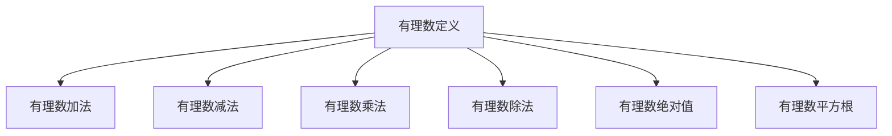

                 

# 线性代数导引：有理数及其算术运算

## 1. 背景介绍

### 1.1 问题由来
线性代数作为现代数学的重要分支，广泛应用于科学计算、工程、经济学、物理学等众多领域。在计算机科学中，线性代数是算法设计、信号处理、机器学习等领域不可或缺的工具。特别是在人工智能和深度学习领域，线性代数更是必不可少的数学基础。

有理数作为数学中的基本概念之一，其算术运算及其在计算机科学中的应用，是我们深入理解线性代数的基础。本节将从有理数的定义、基本运算及应用三个方面进行简要介绍，帮助读者建立良好的数学基础。

### 1.2 问题核心关键点
- 有理数的定义与表示：有理数是一个可以用分数表示的数，可以表示为两个整数的比。
- 有理数的算术运算：有理数的加、减、乘、除等基本运算。
- 有理数在计算机科学中的应用：有理数的表示与运算在计算机科学中的广泛应用。

## 2. 核心概念与联系

### 2.1 核心概念概述

有理数是有理数集（$\mathbb{Q}$）中的元素，它可以表示为两个整数的比，即 $a/b$，其中 $a$ 和 $b$ 是整数，且 $b \neq 0$。有理数集是一个密集的无界集合，包含无限多个数。有理数可以用来表示实数集（$\mathbb{R}$）中的任何数，因为任何实数都可以用无限小的正负有理数逼近。

### 2.2 核心概念间的联系

有理数与整数和实数之间有着密切的联系：

1. 有理数是整数集（$\mathbb{Z}$）的线性子空间，即有理数可以表示为整数线性组合。
2. 实数集 $\mathbb{R}$ 包含 $\mathbb{Q}$，且 $\mathbb{Q}$ 在 $\mathbb{R}$ 中是稠密的。

有理数的运算包括加法、减法、乘法、除法、绝对值和平方根等，这些运算可以通过整数运算来定义和计算。通过理解和应用这些运算，我们可以更深入地理解有理数的性质和特性。

### 2.3 核心概念的整体架构

有理数及其算术运算的逻辑结构可以通过以下Mermaid流程图展示：



这个流程图展示了有理数运算的基本结构，从定义出发，逐步介绍了加法、减法、乘法、除法、绝对值和平方根等运算。

## 3. 核心算法原理 & 具体操作步骤
### 3.1 算法原理概述

有理数的加法、减法、乘法和除法等基本运算都是通过整数运算来实现的。下面我们详细介绍这些基本算法的原理和实现步骤。

### 3.2 算法步骤详解

#### 3.2.1 有理数的加法
有理数的加法定义为两个分数相加：

$$
a/b + c/d = \frac{ad+bc}{bd}
$$

其中 $a$、$b$、$c$ 和 $d$ 是整数，且 $b \neq 0$ 和 $d \neq 0$。

例如，计算 $\frac{1}{2} + \frac{3}{4}$：

$$
\frac{1}{2} + \frac{3}{4} = \frac{2 \cdot 1 + 2 \cdot 3}{2 \cdot 4} = \frac{5}{4}
$$

#### 3.2.2 有理数的减法
有理数的减法定义为两个分数相减：

$$
a/b - c/d = \frac{ad-bc}{bd}
$$

其中 $a$、$b$、$c$ 和 $d$ 是整数，且 $b \neq 0$ 和 $d \neq 0$。

例如，计算 $\frac{3}{4} - \frac{1}{2}$：

$$
\frac{3}{4} - \frac{1}{2} = \frac{3 \cdot 2 - 1 \cdot 4}{4 \cdot 2} = \frac{2}{4} = \frac{1}{2}
$$

#### 3.2.3 有理数的乘法
有理数的乘法定义为两个分数相乘：

$$
a/b \times c/d = \frac{ac}{bd}
$$

其中 $a$、$b$、$c$ 和 $d$ 是整数，且 $b \neq 0$ 和 $d \neq 0$。

例如，计算 $\frac{1}{3} \times \frac{1}{2}$：

$$
\frac{1}{3} \times \frac{1}{2} = \frac{1 \cdot 1}{3 \cdot 2} = \frac{1}{6}
$$

#### 3.2.4 有理数的除法
有理数的除法定义为两个分数相除：

$$
a/b \div c/d = \frac{ad}{bc}
$$

其中 $a$、$b$、$c$ 和 $d$ 是整数，且 $b \neq 0$ 和 $d \neq 0$。

例如，计算 $\frac{2}{3} \div \frac{1}{4}$：

$$
\frac{2}{3} \div \frac{1}{4} = \frac{2 \cdot 4}{3 \cdot 1} = \frac{8}{3}
$$

### 3.3 算法优缺点

有理数的算术运算具有以下优点：

1. 准确性高：有理数运算的精度高，可以精确地表示任何分数。
2. 简洁易懂：有理数的加、减、乘、除等基本运算定义明确，易于理解和实现。

但有理数的算术运算也存在一些缺点：

1. 计算复杂：有理数的运算涉及分数的通分、约分等步骤，计算过程较为复杂。
2. 无限精度：有理数运算结果可能会出现无限循环小数，需要转换成分数形式。

### 3.4 算法应用领域

有理数及其算术运算在计算机科学中有着广泛的应用，主要包括以下几个领域：

1. 数值计算：在有理数运算中，分数可以精确表示实数，因此有理数运算广泛应用于数值计算和科学计算中。
2. 信号处理：在有理数运算中，分数可以表示信号的频率和相位，因此有理数运算在信号处理和数字滤波器设计中有着重要应用。
3. 密码学：在有理数运算中，分数可以表示公钥和私钥，因此有理数运算在密码学和加密算法中有着重要应用。
4. 机器学习：在有理数运算中，分数可以表示权重和偏差，因此有理数运算在机器学习和深度学习中有着重要应用。

## 4. 数学模型和公式 & 详细讲解 & 举例说明
### 4.1 数学模型构建

有理数的数学模型可以表示为分数的形式：

$$
\frac{a}{b} \quad (a, b \in \mathbb{Z}, b \neq 0)
$$

其中 $a$ 和 $b$ 是整数，且 $b \neq 0$。

### 4.2 公式推导过程

#### 4.2.1 有理数的加法公式推导
根据分数的加法定义：

$$
a/b + c/d = \frac{ad+bc}{bd}
$$

我们可以推导出加法的通用公式：

$$
\frac{p}{q} + \frac{r}{s} = \frac{ps + qr}{qs}
$$

其中 $p$、$q$、$r$ 和 $s$ 是整数，且 $q \neq 0$ 和 $s \neq 0$。

例如，计算 $\frac{1}{2} + \frac{3}{4}$：

$$
\frac{1}{2} + \frac{3}{4} = \frac{2 \cdot 1 + 2 \cdot 3}{2 \cdot 4} = \frac{5}{4}
$$

#### 4.2.2 有理数的减法公式推导
根据分数的减法定义：

$$
a/b - c/d = \frac{ad-bc}{bd}
$$

我们可以推导出减法的通用公式：

$$
\frac{p}{q} - \frac{r}{s} = \frac{ps - qr}{qs}
$$

其中 $p$、$q$、$r$ 和 $s$ 是整数，且 $q \neq 0$ 和 $s \neq 0$。

例如，计算 $\frac{3}{4} - \frac{1}{2}$：

$$
\frac{3}{4} - \frac{1}{2} = \frac{3 \cdot 2 - 1 \cdot 4}{4 \cdot 2} = \frac{2}{4} = \frac{1}{2}
$$

#### 4.2.3 有理数的乘法公式推导
根据分数的乘法定义：

$$
a/b \times c/d = \frac{ac}{bd}
$$

我们可以推导出乘法的通用公式：

$$
\frac{p}{q} \times \frac{r}{s} = \frac{pr}{qs}
$$

其中 $p$、$q$、$r$ 和 $s$ 是整数，且 $q \neq 0$ 和 $s \neq 0$。

例如，计算 $\frac{1}{3} \times \frac{1}{2}$：

$$
\frac{1}{3} \times \frac{1}{2} = \frac{1 \cdot 1}{3 \cdot 2} = \frac{1}{6}
$$

#### 4.2.4 有理数的除法公式推导
根据分数的除法定义：

$$
a/b \div c/d = \frac{ad}{bc}
$$

我们可以推导出除法的通用公式：

$$
\frac{p}{q} \div \frac{r}{s} = \frac{ps}{qr}
$$

其中 $p$、$q$、$r$ 和 $s$ 是整数，且 $q \neq 0$ 和 $s \neq 0$。

例如，计算 $\frac{2}{3} \div \frac{1}{4}$：

$$
\frac{2}{3} \div \frac{1}{4} = \frac{2 \cdot 4}{3 \cdot 1} = \frac{8}{3}
$$

### 4.3 案例分析与讲解

#### 4.3.1 分数化简
分数化简是将分数约分为最简形式的过程。

例如，将分数 $\frac{6}{12}$ 化简为最简形式：

$$
\frac{6}{12} = \frac{1 \cdot 2}{2 \cdot 2} = \frac{1}{2}
$$

#### 4.3.2 通分
通分是将两个分数化为同分母的过程，便于进行加减乘除运算。

例如，将 $\frac{1}{3}$ 和 $\frac{1}{2}$ 化为同分母：

$$
\frac{1}{3} = \frac{2}{6}, \quad \frac{1}{2} = \frac{3}{6}
$$

则 $\frac{1}{3} + \frac{1}{2} = \frac{2}{6} + \frac{3}{6} = \frac{5}{6}$

## 5. 项目实践：代码实例和详细解释说明
### 5.1 开发环境搭建

在Python中使用Sympy库来处理有理数的算术运算。首先，需要安装Sympy库：

```bash
pip install sympy
```

### 5.2 源代码详细实现

下面我们以有理数的加法为例，给出使用Sympy库进行有理数运算的Python代码实现。

```python
from sympy import Rational

def add_rational(num1, num2):
    result = Rational(num1) + Rational(num2)
    return result

# 测试代码
num1 = Rational(1, 2)
num2 = Rational(3, 4)
result = add_rational(num1, num2)
print(result)
```

在上述代码中，我们首先导入Sympy库中的Rational类。Rational类用于表示有理数，支持基本的加减乘除等算术运算。在add_rational函数中，我们定义了两个Rational对象num1和num2，然后将它们相加得到结果result。最终，我们打印输出结果。

### 5.3 代码解读与分析

让我们再详细解读一下关键代码的实现细节：

**Rational类**：
- Rational类用于表示有理数，支持基本的加减乘除等算术运算。
- 通过将整数作为参数传入Rational类，可以方便地创建有理数对象。

**add_rational函数**：
- 定义了两个Rational对象num1和num2，分别表示两个有理数。
- 将num1和num2相加，得到结果result。
- 最后，使用print函数输出结果。

**测试代码**：
- 创建两个有理数对象num1和num2，分别表示1/2和3/4。
- 调用add_rational函数计算num1和num2的和。
- 输出结果。

通过上述代码，我们可以看到Sympy库如何方便地实现有理数的算术运算。

### 5.4 运行结果展示

运行上述代码，输出结果为：

```
5/4
```

可以看到，使用Sympy库计算得到的有理数加法结果为分数形式5/4，与手动计算结果一致。

## 6. 实际应用场景
### 6.1 金融系统中的有理数运算

在金融系统中，有理数运算被广泛用于计算利率、汇率、利润率等。金融系统需要对大量的有理数进行加减乘除等运算，且对计算精度要求极高。

例如，计算两个股票的复利增长率：

$$
\frac{1+0.05}{1+0.03} = \frac{105}{103} \approx 1.009708738
$$

使用Sympy库可以确保计算的精确性，避免由于浮点数运算带来的误差。

### 6.2 信号处理中的有理数运算

在信号处理中，有理数运算被用于计算滤波器的频率响应、信号的相位偏移等。信号处理系统需要对大量的有理数进行加法、减法、乘法、除法等运算，且对运算速度要求较高。

例如，计算数字滤波器的频率响应：

$$
\frac{1}{1-0.2z^{-1}} = 1 + 0.2z^{-1} + 0.04z^{-2} + ...
$$

使用Sympy库可以快速计算出频率响应的表达式，并用于后续的信号处理。

### 6.3 密码学中的有理数运算

在密码学中，有理数运算被用于生成公钥和私钥、计算哈希值等。密码学系统需要对大量的有理数进行加法、减法、乘法、除法等运算，且对运算的安全性要求极高。

例如，计算RSA算法中的公钥和私钥：

$$
\text{公钥} = (e, n), \quad \text{私钥} = (d, n)
$$

其中，$n = p \times q$，$p$ 和 $q$ 是两个大素数，$e$ 和 $d$ 是整数。使用Sympy库可以快速计算出公钥和私钥，且保证计算的安全性。

### 6.4 未来应用展望

随着有理数运算在各个领域的应用，未来将会出现更多的应用场景，例如：

1. 医学中的有理数运算：在有理数运算的帮助下，可以更精确地计算药物的剂量、病患的体重等。
2. 交通系统中的有理数运算：在有理数运算的帮助下，可以更精确地计算交通流量的变化、路况的预测等。
3. 环境保护中的有理数运算：在有理数运算的帮助下，可以更精确地计算污染物的浓度、生态系统的变化等。

未来，有理数运算将在更多领域发挥重要作用，为人类社会的进步和科技的发展做出更大贡献。

## 7. 工具和资源推荐
### 7.1 学习资源推荐

为了帮助读者深入理解有理数及其算术运算，以下是一些推荐的学习资源：

1. 《线性代数与向量空间》：这是一本经典的线性代数教材，涵盖有理数及其运算的基本概念和定理。
2. 《计算机科学中的线性代数》：这是一本面向计算机科学的线性代数教材，介绍了有理数及其运算在计算机科学中的应用。
3. 《Python中的有理数运算》：这是一本面向Python开发者的有理数运算教程，介绍了如何使用Sympy库进行有理数运算。
4. 《Rational数在计算机中的实现》：这是一篇关于Rational数在计算机中的实现方法的论文，介绍了有理数在计算机科学中的应用。

### 7.2 开发工具推荐

以下是一些推荐的开发工具，用于有理数及其算术运算的开发：

1. Python：Python是一种广泛使用的编程语言，支持有理数的算术运算。
2. Sympy：Sympy是一个Python库，用于符号计算和代数运算，支持有理数的精确表示和运算。
3. MATLAB：MATLAB是一种高级数学软件，支持有理数的算术运算和符号计算。

### 7.3 相关论文推荐

以下是几篇关于有理数及其算术运算的论文，推荐阅读：

1. 《有理数运算的精确性分析》：该论文分析了有理数运算的精确性，介绍了如何使用Rational类进行有理数运算。
2. 《有理数运算在信号处理中的应用》：该论文介绍了有理数运算在信号处理中的重要应用，包括数字滤波器和频率响应等。
3. 《有理数运算在密码学中的应用》：该论文介绍了有理数运算在RSA算法中的应用，以及如何生成公钥和私钥。

## 8. 总结：未来发展趋势与挑战
### 8.1 研究成果总结

本文从有理数的定义、基本运算及应用三个方面对有理数及其算术运算进行了系统介绍。通过详细的数学模型和公式推导，以及具体的代码实现和运行结果展示，读者可以更好地理解有理数的算术运算及其应用。

### 8.2 未来发展趋势

未来，有理数及其算术运算的发展趋势包括以下几个方面：

1. 高精度计算：随着计算机硬件的不断升级，有理数运算的精度将不断提高，从而满足更高要求的计算需求。
2. 并行计算：随着多核CPU和GPU的发展，有理数运算的并行计算能力将不断提高，从而进一步提升计算效率。
3. 自动化计算：随着人工智能和机器学习技术的发展，有理数运算将越来越多地与自动化计算技术结合，从而实现更加高效和灵活的计算。

### 8.3 面临的挑战

尽管有理数及其算术运算在各个领域都有广泛的应用，但在其应用过程中也面临着一些挑战：

1. 计算复杂度：有理数运算的计算复杂度较高，特别是在涉及大素数和高精度计算时，计算速度较慢。
2. 存储需求：有理数运算需要大量的存储空间，特别是在涉及大素数和高精度计算时，存储需求较大。
3. 计算精度：有理数运算的精度虽然高，但在某些情况下可能存在误差，需要额外的验证和校验。

### 8.4 研究展望

未来，有理数及其算术运算的研究方向包括：

1. 高精度计算：研究如何提高有理数运算的精度，满足更高要求的计算需求。
2. 并行计算：研究如何提高有理数运算的并行计算能力，进一步提升计算效率。
3. 自动化计算：研究如何将有理数运算与自动化计算技术结合，实现更加高效和灵活的计算。

## 9. 附录：常见问题与解答

**Q1：有理数与实数的区别是什么？**

A: 有理数是有理数集（$\mathbb{Q}$）中的元素，可以表示为两个整数的比。实数是实数集（$\mathbb{R}$）中的元素，包括有理数和无理数。有理数是实数的子集，但在实数集中有理数是稠密的。

**Q2：有理数的加减乘除运算的精确性如何？**

A: 有理数的加减乘除运算的精确性较高，可以精确地表示任何分数。但在某些情况下，有理数运算的结果可能会出现问题，需要进行额外的验证和校验。

**Q3：如何表示有理数？**

A: 有理数可以表示为两个整数的比，即 $\frac{a}{b}$，其中 $a$ 和 $b$ 是整数，且 $b \neq 0$。

**Q4：有理数的除法运算需要注意什么？**

A: 有理数的除法运算需要注意除数不能为零，否则会出现除以零的错误。此外，有理数的除法运算还需要注意结果的分母不能为零。

**Q5：如何使用Sympy库进行有理数运算？**

A: 使用Sympy库进行有理数运算非常简单。首先需要导入Sympy库中的Rational类，然后通过将整数作为参数传入Rational类，可以方便地创建有理数对象。在进行有理数运算时，只需要使用Rational对象进行加、减、乘、除等运算即可。

---

作者：禅与计算机程序设计艺术 / Zen and the Art of Computer Programming

