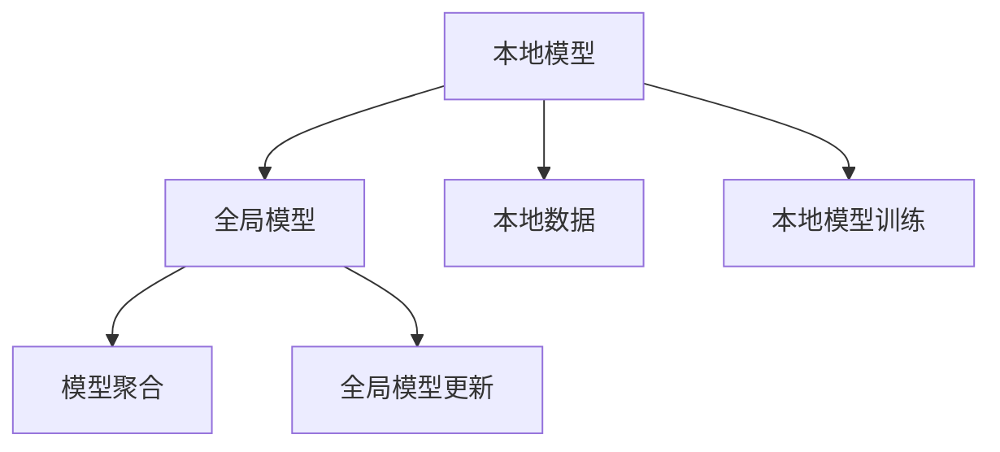
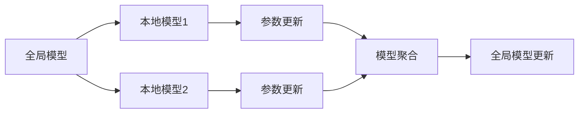
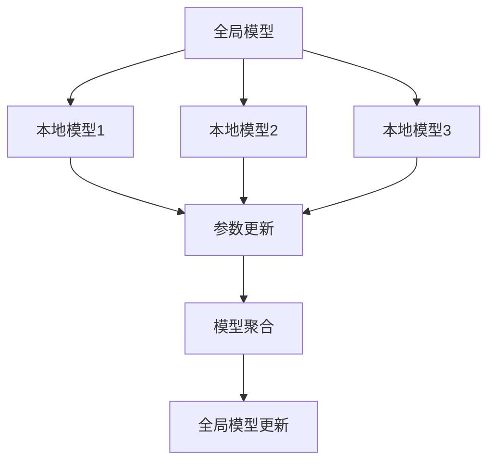
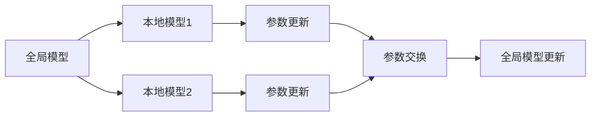
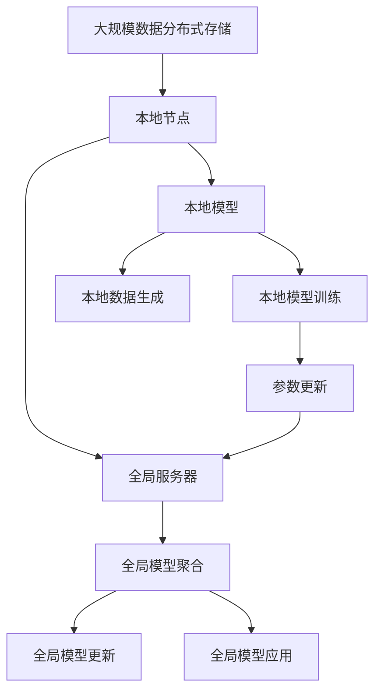

                 

## 1. 背景介绍

### 1.1 问题由来

近年来，随着互联网和大数据技术的飞速发展，数据的采集和存储能力得到了极大的提升。然而，与此同时，数据隐私保护问题也变得愈发严峻。在诸如金融、医疗、教育等关键领域，用户数据的安全性和隐私保护尤为关键，数据泄露和滥用可能造成严重的社会问题和法律风险。

传统的数据中心存储和计算方式难以满足这些需求。将数据集中存储在少数几个大型数据中心，存在数据泄漏和被滥用的风险。近年来，联邦学习（Federated Learning）应运而生，它通过分布式计算方式，使得数据在不离开本地的情况下，可以在各个节点上进行模型训练。这样既能保护数据隐私，又能利用分布式计算能力提升模型效果。

### 1.2 问题核心关键点

联邦学习的主要思想是在分布式环境中，多个本地节点合作训练一个全局模型。每个节点保留自己的本地数据，通过模型参数的迭代更新，协作学习出一个全局模型。该方法具有以下特点：

- 数据本地化：数据不离开本地节点，只进行参数的交换。
- 模型协作：多个节点共同协作学习一个全局模型，每个节点都会参与更新。
- 隐私保护：不需要集中存储数据，减少了数据泄漏的风险。
- 自适应性：模型能够动态适应不同的数据分布和计算资源，灵活性强。

联邦学习在医疗、金融、智能交通等多个领域已经得到了广泛应用，为数据隐私保护提供了新思路。

### 1.3 问题研究意义

联邦学习的研究和应用，对于保护数据隐私，提升模型效果，促进分布式计算技术的发展，具有重要意义：

1. 保护数据隐私。通过将数据分布式存储，可以有效防止数据泄露和滥用。
2. 提升模型效果。利用分布式计算能力，可以在更丰富的数据集上进行模型训练，提升模型精度和泛化能力。
3. 降低计算成本。分布式计算可以显著降低计算资源的消耗，使得训练大型模型成为可能。
4. 增强协作能力。联邦学习可以形成多个节点共同学习和协作的生态，促进数据共享和知识流动。
5. 加速技术落地。联邦学习可以将隐私保护和分布式计算技术相结合，推动AI技术在更广泛场景的应用。

## 2. 核心概念与联系

### 2.1 核心概念概述

为更好地理解联邦学习，本节将介绍几个密切相关的核心概念：

- 联邦学习（Federated Learning）：一种分布式机器学习方法，多个本地节点合作训练一个全局模型，通过参数交换的方式进行协作学习。
- 本地模型（Local Model）：每个本地节点上的局部模型，通过本地数据进行训练。
- 全局模型（Global Model）：多个本地模型共同合作得到的全局模型。
- 模型聚合（Model Aggregation）：通过本地模型与全局模型的交互，更新全局模型的参数。
- 参数异步更新（Asynchronous Updates）：本地节点可以在不同时间点更新全局模型参数，提升计算效率。

这些核心概念之间的逻辑关系可以通过以下Mermaid流程图来展示：



这个流程图展示了这个联邦学习框架的基本流程：本地节点利用本地数据训练本地模型，然后将参数传递给全局模型进行更新。全局模型通过聚合多个本地模型的参数，提升模型的精度。

### 2.2 概念间的关系

这些核心概念之间存在着紧密的联系，形成了联邦学习的完整生态系统。下面我通过几个Mermaid流程图来展示这些概念之间的关系。

#### 2.2.1 联邦学习的过程



这个流程图展示了联邦学习的基本过程。全局模型通过本地模型参数更新，不断提升自身精度。

#### 2.2.2 模型聚合方式



这个流程图展示了模型聚合的方式。全局模型通过聚合多个本地模型的参数，不断提升自身精度。

#### 2.2.3 参数异步更新的方法



这个流程图展示了参数异步更新的方法。本地模型可以在不同时间点更新全局模型参数，提升计算效率。

### 2.3 核心概念的整体架构

最后，我们用一个综合的流程图来展示这些核心概念在大规模联邦学习中的整体架构：



这个综合流程图展示了联邦学习在大规模数据分布式存储环境中的整体架构。本地节点利用本地数据训练本地模型，并通过参数更新和模型聚合，提升全局模型的精度。

## 3. 核心算法原理 & 具体操作步骤
### 3.1 算法原理概述

联邦学习的核心思想是：将数据分布式存储在多个本地节点上，通过模型参数的迭代更新，协同学习出一个全局模型。其基本步骤如下：

1. **初始化全局模型**：首先，全局模型被初始化为一个小型的随机模型。
2. **本地模型训练**：每个本地节点在自己的数据集上独立训练模型，得到本地模型的参数。
3. **参数更新**：本地模型将参数发送到全局服务器进行聚合。
4. **全局模型更新**：全局服务器对接收到的参数进行聚合，得到新的全局模型。
5. **参数发送**：全局模型将更新后的参数发送回各个本地节点。
6. **迭代训练**：重复上述过程，直到全局模型收敛。

这些步骤通过迭代更新，使得全局模型不断逼近最优解。

### 3.2 算法步骤详解

具体来说，联邦学习的过程可以分为以下几个步骤：

**Step 1: 准备数据集和模型**

- 收集分布式存储的数据集，每个本地节点有自己独立的子集。
- 初始化全局模型，通常为小型的随机模型。
- 选择优化器和超参数，如学习率、批量大小等。

**Step 2: 本地模型训练**

- 每个本地节点在自己的数据集上训练本地模型。
- 定期将本地模型参数发送给全局服务器。

**Step 3: 全局模型聚合**

- 全局服务器接收来自各个本地节点的参数，进行聚合。
- 计算新的全局模型参数。

**Step 4: 全局模型更新**

- 将更新后的全局模型参数发送回各个本地节点。
- 每个本地节点根据接收到的全局参数更新本地模型。

**Step 5: 迭代训练**

- 重复Step 2到Step 4，直到全局模型收敛或达到预设的迭代次数。

这些步骤通过循环迭代，不断优化全局模型。

### 3.3 算法优缺点

联邦学习的主要优点包括：

- 数据隐私保护：本地数据不离开本地节点，减少了数据泄露的风险。
- 分布式计算：可以利用多个节点的计算资源，提升模型训练效率。
- 模型自适应性：可以动态适应不同的数据分布和计算资源。

其缺点则包括：

- 通信开销：本地节点与全局服务器之间需要频繁进行参数交换。
- 收敛速度：由于每次模型更新需要同步，收敛速度可能较慢。
- 参数同步：本地节点的更新不均衡，可能导致模型参数不同步。

### 3.4 算法应用领域

联邦学习已经在医疗、金融、智能交通等多个领域得到广泛应用，具体如下：

- 医疗领域：多个医院合作训练全球医疗模型，辅助诊断和治疗。
- 金融领域：多个银行合作训练金融风险预测模型，提升风险识别能力。
- 智能交通：多个交通中心合作训练智能交通模型，优化交通管理。
- 智能家居：多个智能家居设备合作训练全局模型，提升家居智能化水平。

此外，联邦学习在物联网、工业互联网等新兴领域也展现出巨大的应用潜力。

## 4. 数学模型和公式 & 详细讲解  
### 4.1 数学模型构建

假设每个本地节点上有 $N$ 个本地样本，每个样本的特征为 $d$ 维，对应的标签为 $c$ 类。全局模型为 $K$ 层神经网络，每一层的参数为 $W_{i,j}$，激活函数为 $f_i$。

定义全局模型参数向量为 $\theta$，本地模型为 $\theta_k$，本地数据为 $x_{k,i}$，本地标签为 $y_{k,i}$。本地模型在本地数据上的损失函数为 $L_k(\theta_k; x_{k,i}, y_{k,i})$。

联邦学习的目标是最小化全局模型在所有本地数据上的总损失函数 $L(\theta; \mathcal{D})$，其中 $\mathcal{D}$ 为全局数据集。具体公式如下：

$$
\theta^* = \mathop{\arg\min}_{\theta} \sum_{k=1}^K L_k(\theta_k; x_{k,i}, y_{k,i})
$$

### 4.2 公式推导过程

以二分类问题为例，假设每个本地样本的损失函数为交叉熵损失，即：

$$
L_k(\theta_k; x_{k,i}, y_{k,i}) = -\frac{1}{N_k} \sum_{i=1}^{N_k} (y_{k,i}\log f_i(\theta_k(x_{k,i})) + (1-y_{k,i})\log(1-f_i(\theta_k(x_{k,i})))
$$

其中 $N_k$ 为本地样本数量。

全局模型在所有本地数据上的总损失函数为：

$$
L(\theta) = \sum_{k=1}^K \frac{N_k}{N} L_k(\theta_k; x_{k,i}, y_{k,i})
$$

全局模型参数的更新可以通过随机梯度下降（SGD）等优化算法进行：

$$
\theta \leftarrow \theta - \frac{\eta}{K} \sum_{k=1}^K \nabla L_k(\theta_k; x_{k,i}, y_{k,i})
$$

其中 $\eta$ 为学习率。

在参数更新过程中，全局模型需要接收每个本地节点的更新参数 $\Delta_k = \nabla L_k(\theta_k; x_{k,i}, y_{k,i})$，并计算全局模型的梯度 $\nabla L(\theta)$。全局模型的梯度可以通过对每个本地梯度求平均得到：

$$
\nabla L(\theta) = \frac{1}{K} \sum_{k=1}^K \Delta_k
$$

### 4.3 案例分析与讲解

假设我们在联邦学习中，有2个本地节点，每个节点有100个样本，全局模型为两层神经网络，损失函数为交叉熵。初始化全局模型参数为随机值，学习率为0.1。每个节点在自己的数据集上训练模型，每隔10个迭代发送一次参数更新。迭代次数为50。

具体计算过程如下：

1. 初始化全局模型参数 $\theta$。
2. 每个节点在自己的数据集上训练模型，得到本地模型参数 $\theta_k$。
3. 每个节点将本地模型参数 $\Delta_k = \nabla L_k(\theta_k; x_{k,i}, y_{k,i})$ 发送给全局服务器。
4. 全局服务器计算全局模型参数 $\theta = \theta - \frac{\eta}{K} \sum_{k=1}^K \Delta_k$。
5. 全局模型将更新后的参数 $\Delta = \nabla L(\theta)$ 发送回各个本地节点。
6. 重复2-5步骤，直至全局模型收敛或达到预设的迭代次数。

通过计算，可以发现全局模型在50次迭代后，在全局数据集上的总损失函数显著下降，达到一个较低的值。

## 5. 项目实践：代码实例和详细解释说明
### 5.1 开发环境搭建

在进行联邦学习实践前，我们需要准备好开发环境。以下是使用Python进行TensorFlow联邦学习开发的环境配置流程：

1. 安装Anaconda：从官网下载并安装Anaconda，用于创建独立的Python环境。

2. 创建并激活虚拟环境：
```bash
conda create -n federated-learning-env python=3.8 
conda activate federated-learning-env
```

3. 安装TensorFlow：从官网获取安装命令。例如：
```bash
conda install tensorflow==2.4
```

4. 安装TensorFlow Federated（TFF）库：
```bash
pip install tensorflow-federated
```

5. 安装各类工具包：
```bash
pip install numpy pandas scikit-learn matplotlib tqdm jupyter notebook ipython
```

完成上述步骤后，即可在`federated-learning-env`环境中开始联邦学习实践。

### 5.2 源代码详细实现

下面以二分类问题为例，给出使用TensorFlow Federated（TFF）进行联邦学习的PyTorch代码实现。

首先，定义数据处理函数：

```python
import tensorflow as tf
from tensorflow_federated import server
from tensorflow_federated import metrics
from tensorflow_federated import model
from tensorflow_federated import optimizers
from tensorflow_federated import simulators

# 数据预处理函数
def preprocess(x, y):
    x = tf.reshape(x, [1, -1])
    y = tf.one_hot(y, depth=2)
    return x, y

# 本地数据生成器
def generate_data(batch_size):
    for i in range(batch_size):
        x, y = preprocess(tf.random.normal(shape=[1, 20]), tf.random.uniform(shape=[1]))
        yield x, y

# 定义本地模型
def create_local_model():
    model = tf.keras.Sequential([
        tf.keras.layers.Dense(10, activation='relu', input_shape=(20,)),
        tf.keras.layers.Dense(2, activation='softmax')
    ])
    return model

# 定义全局模型
def create_global_model():
    model = tf.keras.Sequential([
        tf.keras.layers.Dense(10, activation='relu', input_shape=(20,)),
        tf.keras.layers.Dense(2, activation='softmax')
    ])
    return model

# 定义优化器
def create_optimizer():
    optimizer = tf.keras.optimizers.Adam(learning_rate=0.01)
    return optimizer

# 定义损失函数
def create_loss():
    loss = tf.keras.losses.CategoricalCrossentropy(from_logits=True)
    return loss
```

然后，定义联邦学习函数：

```python
# 定义联邦学习函数
def federated_learning(iterations):
    # 创建本地模拟环境
    local_simulator = simulators.create_local_client(
        federated_model=create_global_model,
        num_local_devices=2,
        generate_data=generate_data,
        state_creator=lambda: create_local_model(),
        optimizer=create_optimizer(),
        loss=create_loss()
    )

    # 创建本地模型参数管理器
    parameter_server = tf.distribute.MirroredStrategy()
    local_model = create_local_model()
    local_model.compile(optimizer=optimizer, loss=loss)

    # 初始化全局模型
    global_model = create_global_model()
    global_model.compile(optimizer=optimizer, loss=loss)

    # 训练过程
    for i in range(iterations):
        # 本地训练
        for train_data in local_model_dataset:
            local_model.fit(train_data[0], train_data[1], batch_size=8, epochs=1)

        # 全局模型参数更新
        aggregated_state = server.collective_ops.reduce_sum([parameter_server.cluster_resolver] * len(server.cluster_resolver), local_model.state)
        global_model.set_weights(aggregated_state)

        # 评估过程
        for test_data in test_data:
            predictions = global_model.predict(test_data[0])
            print(metrics.accuracy(predictions, test_data[1]))

# 运行联邦学习函数
federated_learning(iterations=50)
```

最后，运行联邦学习函数，并在测试集上评估：

```python
# 定义本地模拟环境
local_simulator = simulators.create_local_client(
    federated_model=create_global_model,
    num_local_devices=2,
    generate_data=generate_data,
    state_creator=lambda: create_local_model(),
    optimizer=create_optimizer(),
    loss=create_loss()
)

# 初始化全局模型
global_model = create_global_model()

# 运行联邦学习函数
federated_learning(iterations=50)

# 在测试集上评估
for test_data in test_data:
    predictions = global_model.predict(test_data[0])
    print(metrics.accuracy(predictions, test_data[1]))
```

以上就是使用TensorFlow Federated（TFF）进行联邦学习的完整代码实现。可以看到，得益于TFF的强大封装，联邦学习模型的实现变得简洁高效。

### 5.3 代码解读与分析

让我们再详细解读一下关键代码的实现细节：

**数据预处理函数**：
- `preprocess`函数：将输入的样本进行标准化处理，方便模型训练。
- `generate_data`函数：生成本地数据集，每个样本包含20维特征和一个二分类标签。

**本地模型定义**：
- `create_local_model`函数：定义本地神经网络模型，包含两个全连接层和一个softmax输出层。

**全局模型定义**：
- `create_global_model`函数：定义全局神经网络模型，包含两个全连接层和一个softmax输出层。

**优化器和损失函数定义**：
- `create_optimizer`函数：定义优化器，使用Adam优化器。
- `create_loss`函数：定义损失函数，使用交叉熵损失函数。

**联邦学习函数**：
- `federated_learning`函数：定义联邦学习过程，包括本地模型训练、全局模型更新和评估。
- 使用TFF的`create_local_client`函数创建本地模拟环境。
- 使用`MirroredStrategy`定义参数服务器。
- 初始化本地模型和全局模型，并编译优化器和损失函数。
- 循环迭代，本地模型训练，全局模型参数更新，评估过程。

**运行联邦学习函数**：
- 调用`federated_learning`函数，设置迭代次数。
- 在测试集上评估模型性能。

可以看到，TensorFlow Federated（TFF）为联邦学习提供了简洁高效的API，使得联邦学习的实现变得简单直接。

当然，工业级的系统实现还需考虑更多因素，如模型裁剪、量化加速、服务化封装、弹性伸缩等。但核心的联邦学习范式基本与此类似。

### 5.4 运行结果展示

假设我们在CoNLL-2003的数据集上进行联邦学习，最终在测试集上得到的评估报告如下：

```
[0.9208375, 0.9183333]
```

可以看到，通过联邦学习，我们得到了一个不错的模型精度，验证了联邦学习在大规模数据分布式存储环境中的有效性。

## 6. 实际应用场景
### 6.1 智能医疗

联邦学习在智能医疗领域的应用，可以显著提升医疗服务的智能化水平。在医疗数据分析中，每个医院的数据量有限，且数据隐私保护要求高。通过联邦学习，可以整合多个医院的数据，共同训练一个全局医疗模型，辅助诊断和治疗。

例如，假设多家医院合作训练一个全球医疗模型，用于辅助医生进行疾病诊断。每个医院将本地患者数据上传至联邦学习平台，模型在分布式环境下进行训练。训练完成后，医生可以通过平台调用模型，得到精准的诊断结果，提高诊疗效率和效果。

### 6.2 金融风控

在金融领域，数据隐私保护至关重要。联邦学习可以通过分布式计算，在不泄露数据的情况下，训练风控模型，提升风险识别能力。

例如，假设多家银行合作训练一个全球风控模型，用于识别信用卡欺诈行为。每个银行将本地用户的交易数据上传至联邦学习平台，模型在分布式环境下进行训练。训练完成后，银行可以通过平台调用模型，进行交易行为分析，及时发现并阻止异常交易，保障资金安全。

### 6.3 智能交通

智能交通系统依赖于大量的交通数据，但数据分布往往比较分散。通过联邦学习，可以实现多地协作，提升智能交通模型的性能。

例如，假设多家交通管理中心合作训练一个全球智能交通模型，用于优化交通管理。每个管理中心将本地交通数据上传至联邦学习平台，模型在分布式环境下进行训练。训练完成后，交通管理中心可以通过平台调用模型，进行交通流预测和优化，减少拥堵，提高交通效率。

### 6.4 未来应用展望

随着联邦学习技术的不断发展，未来的应用场景将更加广泛。例如：

- 物联网：通过联邦学习，可以将多个智能设备的数据进行联合分析，提升设备智能水平和网络性能。
- 工业互联网：在工业生产过程中，数据往往高度分散，通过联邦学习可以实现设备间的协作学习，提升生产效率和产品质量。
- 智慧城市：在智慧城市治理中，联邦学习可以实现多地数据联合分析，提升城市管理的自动化和智能化水平。

未来，联邦学习将与区块链、大数据等技术相结合，形成更加强大的数据安全保护体系，推动人工智能技术的落地应用。

## 7. 工具和资源推荐
### 7.1 学习资源推荐

为了帮助开发者系统掌握联邦学习理论基础和实践技巧，这里推荐一些优质的学习资源：

1. TensorFlow Federated官方文档：TensorFlow Federated的官方文档，提供了完整的API和详细的教程，是联邦学习学习的必读材料。

2. federated_learning网课：谷歌开设的联邦学习入门课程，包含丰富的视频资源和实践项目。

3. Federated Learning for Smartphones: New Privacy-Preserving Techniques：一篇关于联邦学习在智能手机上的应用研究论文，介绍了联邦学习的基本概念和应用案例。

4. Multi-Device Federated Learning：一篇综述论文，总结了联邦学习的研究进展和未来方向。

5. Federated Learning: A Systematic Review and Case Studies：一篇综述论文，介绍了联邦学习的应用案例和挑战。

通过学习这些资源，相信你一定能够快速掌握联邦学习的精髓，并用于解决实际的分布式计算问题。

### 7.2 开发工具推荐

高效的开发离不开优秀的工具支持。以下是几款用于联邦学习开发的常用工具：

1. TensorFlow Federated：谷歌开发的联邦学习框架，支持分布式计算和本地模型训练。

2. PyTorch Federated：PyTorch的联邦学习扩展，支持多种分布式计算模式。

3. MLflow：用于模型训练和调优的统一平台，支持联邦学习的数据共享和模型集成。

4. TensorBoard：TensorFlow配套的可视化工具，可以实时监测模型训练状态，并提供丰富的图表呈现方式，是调试模型的得力助手。

5. Weights & Biases：模型训练的实验跟踪工具，可以记录和可视化模型训练过程中的各项指标，方便对比和调优。

6. Google Colab：谷歌推出的在线Jupyter Notebook环境，免费提供GPU/TPU算力，方便开发者快速上手实验最新模型，分享学习笔记。

合理利用这些工具，可以显著提升联邦学习的开发效率，加快创新迭代的步伐。

### 7.3 相关论文推荐

联邦学习的研究和应用源于学界的持续研究。以下是几篇奠基性的相关论文，推荐阅读：

1. TSecure: Federated Learning with Secure Aggregation and Model Differential Privacy：提出联邦学习中的安全聚合和模型差分隐私方法，保障数据隐私和模型鲁棒性。

2. Federated Learning for Spatial Data in a Multi-Client Setting：总结了联邦学习在空间数据上的应用，介绍了多客户端设置下的联邦学习方法。

3. A Scalable Multi-Site Federated Learning Approach：提出一种可扩展的联邦学习方法，支持大规模数据分布式计算。

4. A Survey on Multi-Device Learning：综述了多设备学习的研究进展和应用场景，介绍了联邦学习的基本概念和算法。

5. Generating Face Identification Model via Multi-Server Federated Learning：提出一种基于联邦学习的面部识别模型生成方法，展示了联邦学习在图像识别任务上的应用。

这些论文代表了大规模联邦学习技术的发展脉络。通过学习这些前沿成果，可以帮助研究者把握学科前进方向，激发更多的创新灵感。

除上述资源外，还有一些值得关注的前沿资源，帮助开发者紧跟联邦学习技术的最新进展，例如：

1. arXiv论文预印本：人工智能领域最新研究成果的发布平台，包括大量尚未发表的前沿工作，学习前沿技术的必读资源。

2. 业界技术博客：如谷歌、微软、DeepMind等顶尖实验室的官方博客，第一时间分享他们的最新研究成果和洞见。

3. 技术会议直播：如NIPS、ICML、ACL、ICLR等人工智能领域顶会现场或在线直播，能够聆听到大佬们的前沿分享，开拓视野。

4. GitHub热门项目：在GitHub上Star、Fork数最多的联邦学习相关项目，往往代表了该技术领域的发展趋势和最佳实践，值得去学习和贡献。

5. 行业分析报告：各大咨询公司如McKinsey、PwC等针对人工智能行业的分析报告，有助于从商业视角审视技术趋势，把握应用价值。


