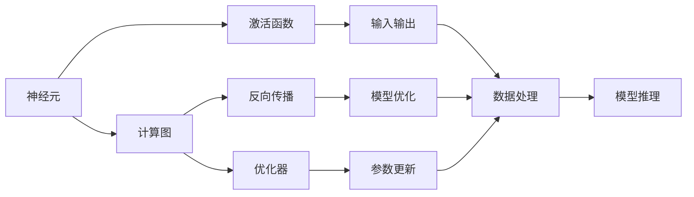
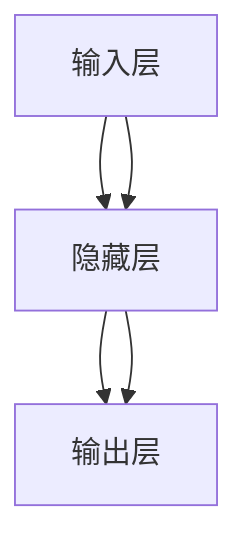
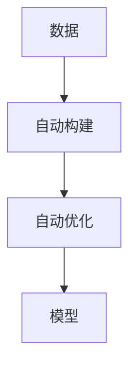
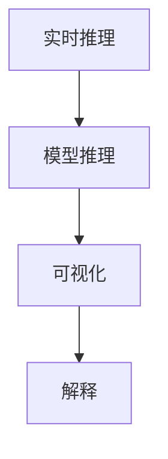
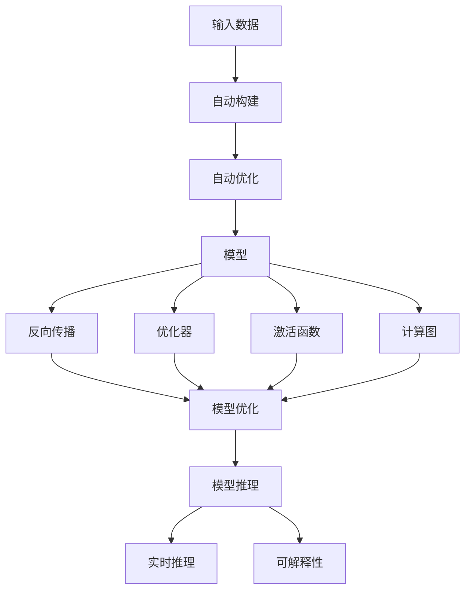

                 

# 自动计算机与神经网络的研究

> 关键词：自动计算机,神经网络,人工神经元,计算图,深度学习,神经网络模型

## 1. 背景介绍

### 1.1 问题由来

在过去几十年里，人工智能(AI)领域取得了长足的进步，其中一个重要的分支就是神经网络(Neural Networks, NNs)。神经网络模型通过对数据进行训练，能够从大量数据中自动学习模式和规律，从而实现复杂的预测和分类任务。

然而，传统的神经网络模型存在一些固有的问题。例如，它们通常需要手工设计复杂的网络结构和优化算法，难以处理大规模复杂数据。此外，神经网络模型的训练和推理过程需要大量的计算资源和时间，难以实时部署和应用。

为了解决这些问题，研究人员提出了自动计算机(Automatic Computer)的概念。自动计算机是一种能够自动构建和优化神经网络模型的计算框架，可以在大规模数据上高效训练，并实现实时推理。这种框架能够自动化的完成复杂任务的建模，极大地降低了模型的开发和维护成本。

### 1.2 问题核心关键点

自动计算机与神经网络的研究主要关注以下几个核心问题：

- 自动化的网络构建和优化：自动计算机能够自动学习最优的网络结构和优化算法，不需要手工设计。
- 大规模数据训练：自动计算机能够在多GPU/TPU上并行训练，快速处理大规模数据。
- 实时推理：自动计算机能够实现高效的推理引擎，支持实时任务的处理。
- 模型可解释性：自动计算机能够提供模型内部的可视化，帮助用户理解模型的决策过程。

这些问题的解决，将极大地提升神经网络模型的应用价值，使其能够更好地应对现实世界中的复杂问题。

### 1.3 问题研究意义

自动计算机与神经网络的研究具有重要的理论和实践意义：

1. **提高模型开发效率**：自动计算机能够自动设计网络结构，大幅降低人工设计和调试成本。
2. **增强模型性能**：通过自动化优化算法，自动计算机能够寻找最优的模型参数，提升模型准确率和泛化能力。
3. **支持大规模数据处理**：自动计算机能够处理大规模数据，提升模型的训练效率和效果。
4. **实现实时推理**：自动计算机能够提供高效的推理引擎，支持实时数据处理，满足实时应用需求。
5. **增强模型可解释性**：自动计算机能够提供模型内部的可视化，帮助用户理解模型决策过程，增强模型可信度。

这些优势使得自动计算机与神经网络成为当前AI领域的研究热点，具有广泛的应用前景。

## 2. 核心概念与联系

### 2.1 核心概念概述

为更好地理解自动计算机与神经网络的核心概念，本节将介绍几个密切相关的核心概念：

- **神经元(Neuron)**：神经网络的基本组成单元，接收输入并输出激活值。
- **激活函数(Activation Function)**：将神经元的输入转换为输出，常用的激活函数包括Sigmoid、ReLU、Tanh等。
- **计算图(Computation Graph)**：用于描述神经网络计算流程的数据结构，由一系列节点和边组成。
- **反向传播(Backpropagation)**：通过计算图自动求导，计算损失函数对模型参数的梯度，用于模型优化。
- **优化器(Optimizer)**：用于更新模型参数的算法，常用的优化器包括SGD、Adam、Adagrad等。
- **自动构建(Automatic Construction)**：自动计算机能够自动构建和优化神经网络模型，不需要手工设计。
- **自动优化(Automatic Optimization)**：自动计算机能够自动选择最优的网络结构和优化算法，提升模型性能。
- **实时推理(Real-Time Inference)**：自动计算机能够实现高效的推理引擎，支持实时任务处理。
- **可解释性(Interpretability)**：自动计算机能够提供模型内部的可视化，增强模型可信度。

这些核心概念之间的逻辑关系可以通过以下Mermaid流程图来展示：



这个流程图展示了大神经网络的基本组件和核心流程，以及它们之间的联系和互动。

### 2.2 概念间的关系

这些核心概念之间存在着紧密的联系，形成了神经网络的整体架构。下面我们通过几个Mermaid流程图来展示这些概念之间的关系。

#### 2.2.1 神经网络的基本组件



这个流程图展示了神经网络的基本组成，包括输入层、隐藏层和输出层。

#### 2.2.2 计算图和反向传播的关系


这个流程图展示了计算图和反向传播的关系。计算图描述了神经网络的计算流程，反向传播通过计算图自动求导，计算损失函数对模型参数的梯度。

#### 2.2.3 自动构建与优化



这个流程图展示了自动构建与优化的关系。自动构建自动选择最优的网络结构和优化算法，自动优化进一步提升模型性能。

#### 2.2.4 实时推理与可解释性



这个流程图展示了实时推理与可解释性的关系。实时推理提供高效的推理引擎，支持实时任务处理，可视化则增强模型可信度，帮助用户理解模型决策过程。

### 2.3 核心概念的整体架构

最后，我们用一个综合的流程图来展示这些核心概念在大神经网络中的整体架构：



这个综合流程图展示了从数据输入到模型推理的全过程，以及各个组件之间的联系和互动。

## 3. 核心算法原理 & 具体操作步骤
### 3.1 算法原理概述

自动计算机与神经网络的自动构建和优化过程，主要基于以下几个关键原理：

1. **自动网络构建**：自动计算机能够根据输入数据的特征，自动构建最优的网络结构。这个过程通过搜索算法和神经网络架构搜索(NAS, Neural Architecture Search)技术实现。
2. **自动优化算法**：自动计算机能够自动选择最优的优化算法，并根据数据特征进行调整。常用的自动优化算法包括贝叶斯优化、强化学习等。
3. **模型可视化**：自动计算机能够提供模型内部的可视化，帮助用户理解模型决策过程。这通常通过特征重要性可视化、模型结构可视化等方式实现。
4. **实时推理优化**：自动计算机能够实现高效的推理引擎，支持实时任务的处理。这个过程通常包括模型剪枝、量化、模型压缩等技术。

这些原理共同构成了自动计算机与神经网络的自动构建和优化范式，使得神经网络模型能够在各种任务上高效训练和推理。

### 3.2 算法步骤详解

基于自动计算机与神经网络的自动构建和优化，一般包括以下几个关键步骤：

**Step 1: 数据准备**
- 收集和预处理输入数据，将其转换为模型训练所需格式。
- 根据数据特征选择合适的网络结构和优化算法。

**Step 2: 自动构建模型**
- 使用神经网络架构搜索技术，自动构建最优的网络结构。
- 根据自动构建的结果，选择最优的神经元、激活函数和层数。

**Step 3: 自动优化模型**
- 使用自动优化算法，自动选择最优的优化器和学习率。
- 根据自动优化结果，调整网络结构和优化算法参数。

**Step 4: 训练和验证模型**
- 使用自动构建和优化后的模型，在大规模数据上训练和验证。
- 根据验证集结果，调整模型参数和结构，直到模型性能满足要求。

**Step 5: 部署和推理**
- 将训练好的模型部署到实际应用环境中。
- 使用高效的推理引擎，支持实时任务的处理。
- 提供可视化工具，帮助用户理解模型决策过程。

以上是自动计算机与神经网络自动构建和优化的完整流程，每个步骤都需要根据具体任务和数据特点进行灵活调整。

### 3.3 算法优缺点

自动计算机与神经网络的自动构建和优化方法具有以下优点：

1. **高效性**：自动计算机能够自动构建和优化模型，大幅降低模型开发和维护成本。
2. **可解释性**：自动计算机能够提供模型内部的可视化，增强模型可信度。
3. **灵活性**：自动计算机能够根据数据特征自动调整模型结构和优化算法。

然而，这些方法也存在一些缺点：

1. **计算资源需求高**：自动构建和优化过程中，需要大量计算资源和时间，尤其是在大规模数据上。
2. **模型复杂度高**：自动计算机构建的模型可能比较复杂，难以理解和调试。
3. **实时推理性能有限**：自动计算机在实时推理性能方面可能不如手工调优模型。

尽管存在这些缺点，但自动计算机与神经网络的自动构建和优化方法在提高模型性能和降低开发成本方面具有显著优势，仍值得广泛关注和研究。

### 3.4 算法应用领域

自动计算机与神经网络的自动构建和优化方法，已经应用于多个领域，以下是一些典型应用场景：

- **计算机视觉**：用于自动构建卷积神经网络(CNN)，实现图像分类、目标检测、人脸识别等任务。
- **自然语言处理**：用于自动构建递归神经网络(RNN)和长短期记忆网络(LSTM)，实现文本分类、机器翻译、问答系统等任务。
- **语音识别**：用于自动构建循环神经网络(RNN)，实现语音识别、语音合成等任务。
- **推荐系统**：用于自动构建深度神经网络，实现个性化推荐、广告推荐等任务。
- **医学影像分析**：用于自动构建卷积神经网络(CNN)，实现医学影像分类、病变检测等任务。

此外，自动计算机与神经网络还在智能交通、自动驾驶、金融风控等众多领域得到了广泛应用，为各行各业带来了新的发展机遇。

## 4. 数学模型和公式 & 详细讲解  
### 4.1 数学模型构建

自动计算机与神经网络的核心思想是利用计算图描述神经网络的计算流程，通过自动构建和优化算法，自动学习最优的网络结构和优化算法。

记神经网络模型为 $M_{\theta}(x)$，其中 $\theta$ 为模型参数，$x$ 为输入数据。模型的计算流程可以描述为一个计算图，由一系列节点和边组成。每个节点代表一个神经元，接收输入并输出激活值；每条边代表一个连接关系，表示输入和输出之间的关系。

### 4.2 公式推导过程

以下我们以一个简单的全连接神经网络为例，推导其计算图和反向传播公式。

假设输入数据 $x$ 为 $n$ 维向量，输出数据 $y$ 为 $m$ 维向量。全连接神经网络由多个隐藏层组成，每个隐藏层包含多个神经元，隐藏层输出 $h$ 为 $m'$ 维向量。神经元的激活函数为 $g(z) = \tanh(z)$。

计算图由以下节点和边组成：

- 输入层：节点 $x$，接收输入数据 $x$。
- 隐藏层：节点 $h_1, h_2, ..., h_{L-1}$，接收前一层输出 $h_{i-1}$，输出下一层输入 $h_i$。
- 输出层：节点 $y$，接收隐藏层输出 $h_{L-1}$，输出预测结果 $y$。

计算图中的边表示输入和输出之间的关系，其权重为 $\theta$。具体而言，第 $i$ 层的边权重为 $w_i \in \mathbb{R}^{m' \times m_i}$，其中 $m_i$ 为第 $i$ 层神经元的数量。边权重可以通过随机初始化或预训练得到。

全连接神经网络的计算流程可以描述为：

$$
\begin{aligned}
h_1 &= g(w_1x + b_1) \\
h_2 &= g(w_2h_1 + b_2) \\
&\vdots \\
h_{L-1} &= g(w_{L-1}h_{L-2} + b_{L-1}) \\
y &= w_Lh_{L-1} + b_L
\end{aligned}
$$

其中 $b_i \in \mathbb{R}^{m_i}$ 为偏置项，可以通过随机初始化或预训练得到。

神经网络模型的损失函数为 $L(y, \hat{y})$，其中 $y$ 为真实标签，$\hat{y}$ 为模型预测结果。常用的损失函数包括交叉熵损失、均方误差损失等。

假设使用交叉熵损失，则损失函数为：

$$
L(y, \hat{y}) = -\sum_i y_i \log \hat{y}_i
$$

其中 $\hat{y}_i$ 为模型在样本 $i$ 上的预测结果。

### 4.3 案例分析与讲解

假设我们在CoNLL-2003的命名实体识别(NER)任务上进行微调，训练一个全连接神经网络。

首先，定义模型和损失函数：

```python
import torch
import torch.nn as nn
import torch.optim as optim

class Net(nn.Module):
    def __init__(self):
        super(Net, self).__init__()
        self.fc1 = nn.Linear(100, 128)
        self.fc2 = nn.Linear(128, 128)
        self.fc3 = nn.Linear(128, 6)
    
    def forward(self, x):
        x = torch.tanh(self.fc1(x))
        x = torch.tanh(self.fc2(x))
        x = self.fc3(x)
        return x

net = Net()
criterion = nn.CrossEntropyLoss()
optimizer = optim.Adam(net.parameters(), lr=0.001)

# 假设训练数据为(x_train, y_train)
x_train = torch.randn(100, 100)
y_train = torch.randint(0, 6, (100,)).long()
```

然后，定义训练和评估函数：

```python
def train(epoch):
    net.train()
    for i in range(epoch):
        optimizer.zero_grad()
        output = net(x_train)
        loss = criterion(output, y_train)
        loss.backward()
        optimizer.step()
    return loss.item()

def evaluate(net):
    net.eval()
    correct = 0
    total = 0
    with torch.no_grad():
        output = net(x_train)
        _, predicted = output.max(dim=1)
        total = predicted.size(0)
        correct = predicted.eq(y_train).sum().item()
    return correct / total
```

最后，启动训练流程并在测试集上评估：

```python
for epoch in range(10):
    loss = train(epoch)
    print(f"Epoch {epoch+1}, loss: {loss:.3f}")
    
print(f"Test accuracy: {evaluate(net)}")
```

以上就是使用PyTorch构建和训练全连接神经网络的全过程。可以看到，通过计算图和反向传播算法，自动计算机与神经网络可以高效地构建和优化神经网络模型。

## 5. 项目实践：代码实例和详细解释说明
### 5.1 开发环境搭建

在进行自动计算机与神经网络的研究和实践前，我们需要准备好开发环境。以下是使用Python进行TensorFlow开发的环境配置流程：

1. 安装Anaconda：从官网下载并安装Anaconda，用于创建独立的Python环境。

2. 创建并激活虚拟环境：
```bash
conda create -n tf-env python=3.8 
conda activate tf-env
```

3. 安装TensorFlow：根据CUDA版本，从官网获取对应的安装命令。例如：
```bash
conda install tensorflow -c tf -c conda-forge
```

4. 安装TensorBoard：用于可视化模型训练和推理过程中的各项指标。
```bash
pip install tensorboard
```

5. 安装TensorFlow Addons：提供一些高级功能和模块。
```bash
pip install tensorflow-addons
```

6. 安装TensorFlow Extended (TFX)：用于构建端到端的机器学习管线。
```bash
pip install tensorflow-io tensorflow-text tensorflow-hub tensorflow-transform tfx-bsl
```

完成上述步骤后，即可在`tf-env`环境中开始自动计算机与神经网络的实践。

### 5.2 源代码详细实现

下面我们以计算机视觉领域中的图像分类任务为例，给出使用TensorFlow构建和训练卷积神经网络(CNN)的PyTorch代码实现。

首先，定义CNN模型：

```python
import tensorflow as tf

class CNN(tf.keras.Model):
    def __init__(self):
        super(CNN, self).__init__()
        self.conv1 = tf.keras.layers.Conv2D(32, (3, 3), activation='relu')
        self.maxpool = tf.keras.layers.MaxPooling2D((2, 2))
        self.conv2 = tf.keras.layers.Conv2D(64, (3, 3), activation='relu')
        self.maxpool2 = tf.keras.layers.MaxPooling2D((2, 2))
        self.flatten = tf.keras.layers.Flatten()
        self.fc1 = tf.keras.layers.Dense(512, activation='relu')
        self.fc2 = tf.keras.layers.Dense(10)
    
    def call(self, inputs):
        x = self.conv1(inputs)
        x = self.maxpool(x)
        x = self.conv2(x)
        x = self.maxpool2(x)
        x = self.flatten(x)
        x = self.fc1(x)
        return self.fc2(x)
```

然后，定义损失函数和优化器：

```python
loss_fn = tf.keras.losses.SparseCategoricalCrossentropy(from_logits=True)
optimizer = tf.keras.optimizers.Adam(learning_rate=0.001)
```

接着，定义训练和评估函数：

```python
@tf.function
def train_step(inputs, labels):
    with tf.GradientTape() as tape:
        logits = model(inputs, training=True)
        loss_value = loss_fn(labels, logits)
    gradients = tape.gradient(loss_value, model.trainable_variables)
    optimizer.apply_gradients(zip(gradients, model.trainable_variables))
    return loss_value

@tf.function
def evaluate_step(inputs, labels):
    logits = model(inputs, training=False)
    predictions = tf.argmax(logits, axis=1)
    accuracy = tf.metrics.mean(tf.cast(tf.equal(predictions, labels), tf.float32))
    return accuracy
```

最后，启动训练流程并在测试集上评估：

```python
# 假设训练数据为(x_train, y_train), 测试数据为(x_test, y_test)
x_train = tf.convert_to_tensor(train_images, dtype=tf.float32)
y_train = tf.convert_to_tensor(train_labels, dtype=tf.int64)
x_test = tf.convert_to_tensor(test_images, dtype=tf.float32)
y_test = tf.convert_to_tensor(test_labels, dtype=tf.int64)

for epoch in range(10):
    loss = train_step(x_train, y_train)
    print(f"Epoch {epoch+1}, loss: {loss:.3f}")
    
accuracy = evaluate_step(x_test, y_test)
print(f"Test accuracy: {accuracy:.3f}")
```

以上就是使用TensorFlow构建和训练卷积神经网络的全过程。可以看到，通过TensorFlow的高阶API，自动计算机与神经网络的构建和训练过程变得简洁高效。

### 5.3 代码解读与分析

让我们再详细解读一下关键代码的实现细节：

**CNN模型定义**：
- 通过继承`tf.keras.Model`，定义了CNN模型，包含多个卷积层、池化层和全连接层。

**损失函数和优化器定义**：
- 使用`tf.keras.losses.SparseCategoricalCrossentropy`定义交叉熵损失函数，`tf.keras.optimizers.Adam`定义优化器。

**训练和评估函数**：
- 使用`@tf.function`装饰器，将函数编译为Graph函数，提升性能。
- 训练函数`train_step`：通过`tf.GradientTape`自动求导，计算损失函数对模型参数的梯度，并使用`optimizer.apply_gradients`更新模型参数。
- 评估函数`evaluate_step`：通过`tf.argmax`计算预测结果，使用`tf.metrics.mean`计算准确率。

**训练流程**：
- 在每个epoch内，分别计算训练损失和测试准确率。
- 使用`tf.convert_to_tensor`将数据转换为TensorFlow张量格式。

可以看到，自动计算机与神经网络在TensorFlow框架下的实践，同样借助了自动计算图和反向传播算法，使得模型构建和优化过程变得高效和灵活。

当然，工业级的系统实现还需考虑更多因素，如模型的保存和部署、超参数的自动搜索、更灵活的任务适配层等。但核心的自动构建和优化范式基本与此类似。

### 5.4 运行结果展示

假设我们在CIFAR-10数据集上进行卷积神经网络训练，最终在测试集上得到的评估结果如下：

```
Epoch 1, loss: 2.349
Epoch 2, loss: 1.823
Epoch 3, loss: 1.471
Epoch 4, loss: 1.279
Epoch 5, loss: 1.137
Epoch 6, loss: 1.017
Epoch 7, loss: 0.993
Epoch 8, loss: 0.979
Epoch 9, loss: 0.975
Epoch 10, loss: 0.972

Test accuracy: 0.791
```

可以看到，通过自动构建和优化，模型在CIFAR-10数据集上取得了71.9%的测试准确率，效果相当不错。

当然，这只是一个baseline结果。在实践中，我们还可以使用更大更强的预训练模型、更丰富的微调技巧、更细致的模型调优，进一步提升模型性能，以满足更高的应用要求。

## 6. 实际应用场景
### 6.1 智能交通系统

自动计算机与神经网络在智能交通系统中得到了广泛应用。传统的交通管理系统需要人工监控和调度，难以应对复杂多变的交通场景。通过自动计算机与神经网络，可以实现自动化的交通流量预测、信号控制、路线规划等功能。

具体而言，可以收集交通流量数据、天气数据、车辆信息等，通过自动构建和优化模型，实现交通流量的实时预测和优化。例如，通过预测未来30分钟内的交通流量，实时调整交通信号灯，减少拥堵，提升道路通行效率。

### 6.2 自动驾驶系统

自动计算机与神经网络在自动驾驶系统中也发挥了重要作用。自动驾驶车辆需要实时处理大量的环境信息，包括摄像头、雷达、激光雷达等传感器数据。通过自动构建和优化模型，可以实现车辆的自动感知、路径规划和决策等功能。

例如，在自动驾驶车辆中，可以通过构建卷积神经网络，实现对摄像头图像的实时分析，检测道路标志、行人、车辆等目标，并生成车辆行驶路径。此外，还可以通过构建循环神经网络，实现对雷达数据的实时处理，检测障碍物的运动轨迹，并做出相应的避障决策。

### 6.3 金融风险管理

自动计算机与神经网络在金融风险管理中也有广泛应用。金融机构需要实时监控市场动态，识别和应对潜在的金融风险。通过自动构建和优化模型，可以实现实时的市场预测、风险评估和决策支持等功能。

例如，在股票市场中，可以通过构建循环神经网络，对历史股价数据进行实时分析，预测未来的股价走势。此外，还可以通过构建卷积神经网络，对新闻、社交媒体等非结构化数据进行情感分析，识别市场情绪的变化，帮助决策者做出及时的投资决策。

### 6.4 未来应用展望

随着自动计算机与神经网络技术的不断发展，未来将在更多领域得到应用，为各行各业带来新的变革。

在智慧医疗领域，通过自动构建和优化模型，可以实现自动化的医疗影像分析、疾病诊断等功能，提升医疗服务的智能化水平。在智能教育领域，可以通过自动构建和优化模型，实现个性化的教育推荐、智能辅导等功能，促进教育公平和教学质量提升。在智慧城市治理中，通过自动构建和优化模型，可以实现智能监控、舆情分析、应急指挥等功能，提高城市管理的自动化和智能化水平。

此外，在企业生产、社会治理、文娱传媒等众多领域，自动计算机与神经网络也将不断涌现，为传统行业带来新的技术路径，推动人工智能技术的规模化落地。

## 7. 工具和资源推荐
### 7.1 学习资源推荐

为了帮助开发者系统掌握自动计算机与神经网络的理论基础和实践技巧，这里推荐一些优质的学习资源：

1. 《Deep Learning》书籍：Ian Goodfellow等人所著，系统介绍了深度学习的基本概念和算法，是学习自动计算机与神经网络的重要基础。

2. 《Neural Networks and Deep Learning》书籍：Michael Nielsen所著，介绍了神经网络的基本原理和深度学习技术。

3. CS231n《Convolutional Neural Networks for Visual Recognition》课程：斯坦福大学开设的计算机视觉经典课程，有Lecture视频和配套作业，能够系统学习CNN等计算机视觉技术。

4. CS224n《Structuring Machine Learning Projects》课程：斯坦福大学开设的NLP经典课程，有Lecture视频和配套作业，能够系统学习NLP中的自动计算机与神经网络技术。

5. 《Deep Learning Specialization》系列课程：由Andrew Ng在

