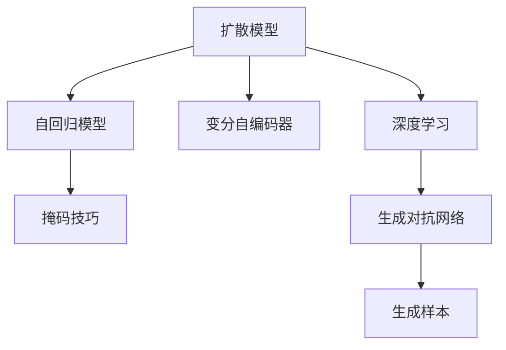
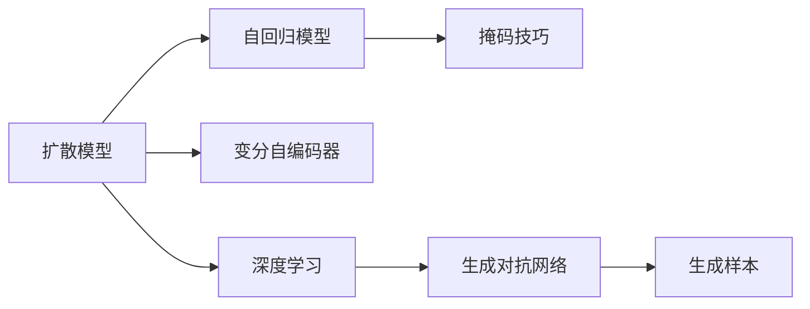

                 

# Stable Diffusion原理与代码实例讲解

> 关键词：Stable Diffusion, 深度学习, 生成模型, 扩散模型, 自回归模型, 代码实例, 生成文本, 图像生成

## 1. 背景介绍

### 1.1 问题由来
近年来，生成模型在计算机视觉和自然语言处理等领域取得了显著的进展。其中，扩散模型(Diffusion Models)因其能够在高分辨率图像和自然语言文本等数据上生成高质量的样本，而受到广泛关注。Stable Diffusion是基于扩散模型的代表性模型之一，被广泛应用于文本生成、图像生成、视频生成等场景，成为深度学习领域的热门研究方向。

Stable Diffusion由Brown University的研究团队于2022年提出，其主要目的是通过优化扩散过程，使模型能够在较低的计算成本下生成高质量的图像和文本。Stable Diffusion的发布标志着扩散模型在工业应用上的重要进展，为大规模图像和文本生成任务提供了高效、可靠的解决方案。

### 1.2 问题核心关键点
Stable Diffusion的核心思想是利用扩散过程生成样本。具体而言，模型首先将输入噪声和样本作为初始状态，逐步加入扩散噪声，并最终逼近真实样本。该过程可以理解为从噪声分布向真实分布的转换，称为扩散过程。Stable Diffusion通过优化这一过程，实现了高效的样本生成。

与传统的生成模型（如GANs）相比，Stable Diffusion具有以下几个关键特点：
- 高分辨率：通过优化扩散过程，Stable Diffusion能够在较高的图像分辨率下生成高质量的样本。
- 低计算成本：Stable Diffusion采用自回归模型和掩码技巧，能够大幅度减少计算资源消耗。
- 灵活性：Stable Diffusion可以适应多种任务类型，包括文本生成、图像生成、视频生成等。

Stable Diffusion的成功离不开大规模预训练数据和复杂的优化算法。其预训练数据集包括大量高分辨率的图像和文本，经过大量的自监督学习任务训练，使模型学习到了广泛的图像和文本分布特征。在实际应用中，Stable Diffusion只需要较少的参数和计算资源，即可生成高品质的图像和文本。

### 1.3 问题研究意义
研究Stable Diffusion的原理与应用，对于推动生成模型在实际应用中的落地具有重要意义：

1. 提高生成效果：Stable Diffusion通过优化扩散过程，能够在高分辨率下生成高质量的样本，提升生成模型的应用价值。
2. 降低计算成本：Stable Diffusion采用自回归模型和掩码技巧，减少了计算资源消耗，为大规模图像和文本生成任务提供高效解决方案。
3. 增强模型灵活性：Stable Diffusion能够适应多种任务类型，为计算机视觉和自然语言处理等领域的研究提供重要参考。
4. 推动产业发展：Stable Diffusion的成功应用，为AI技术在工业界的落地提供了重要借鉴，加速AI技术的产业化进程。
5. 带来技术创新：Stable Diffusion的原理与应用，激发了新的研究方向，如自回归生成模型、扩散过程优化等。

## 2. 核心概念与联系

### 2.1 核心概念概述

为更好地理解Stable Diffusion的工作原理，本节将介绍几个密切相关的核心概念：

- 扩散模型(Diffusion Models)：基于扩散过程生成样本的模型。其核心思想是将样本从噪声分布逼近到真实分布，通过逐步加入噪声和加权器的方式实现。
- 自回归模型(Autoregressive Models)：根据输入序列中的部分信息，预测未来部分的信息。自回归模型具有较好的可解释性和预测能力，常被用于生成任务。
- 掩码技巧(Masking Techniques)：在生成过程中，利用掩码技巧减少计算量，提高生成效率。掩码技巧可以在自回归模型中广泛应用。
- 变分自编码器(Variational Autoencoders, VAEs)：一种生成模型，能够将样本从噪声分布逼近到真实分布，并通过编码器-解码器结构实现。
- 深度学习(Deep Learning)：利用多层神经网络，对复杂数据进行建模和预测。深度学习在生成模型中得到广泛应用。
- 生成对抗网络(Generative Adversarial Networks, GANs)：一种生成模型，通过生成器和判别器的对抗过程，生成高质量的样本。

这些核心概念之间存在着紧密的联系，形成了Stable Diffusion的核心生态系统。以下通过Mermaid流程图展示它们之间的关系：



### 2.2 概念间的关系

这些核心概念之间存在着紧密的联系，形成了Stable Diffusion的核心生态系统。以下通过Mermaid流程图展示它们之间的关系：



## 3. 核心算法原理 & 具体操作步骤
### 3.1 算法原理概述

Stable Diffusion的算法原理主要基于扩散模型和自回归模型，通过优化扩散过程和掩码技巧，实现了高效的样本生成。

在扩散模型中，样本从噪声分布开始，逐步加入噪声和加权器，最终逼近真实分布。具体而言，扩散过程可以表示为：

$$
\mathbb{P}_{t \rightarrow 0}[\text{数据}|噪声] = \mathbb{P}_{t \rightarrow 0}[\text{噪声}|噪声] \times \mathbb{P}_{t \rightarrow 0}[\text{数据}|噪声]
$$

其中，$t$ 表示时间，$噪声$ 表示初始噪声分布，$\text{数据}$ 表示真实数据分布。通过优化扩散过程，使模型能够高效地从噪声分布逼近到真实分布。

在自回归模型中，模型根据输入序列中的部分信息，预测未来部分的信息。自回归模型的核心思想是利用序列中的相关性，提高生成效率和生成效果。

Stable Diffusion结合了扩散模型和自回归模型的优点，通过掩码技巧减少计算量，提高生成效率。具体而言，模型将序列分成若干个块，每次生成一个块，并在块内使用掩码技巧。掩码技巧通过在每个块内设置掩码，减少计算量，提高生成效率。

### 3.2 算法步骤详解

Stable Diffusion的算法步骤主要包括以下几个关键步骤：

**Step 1: 准备数据集**
- 收集高分辨率的图像和文本数据，划分为训练集和测试集。
- 对图像进行预处理，包括缩放、归一化等操作，确保数据的一致性和稳定性。

**Step 2: 训练扩散模型**
- 使用扩散模型对图像和文本数据进行预训练，学习图像和文本的分布特征。
- 在训练过程中，逐步加入噪声和加权器，逼近真实分布。
- 使用掩码技巧减少计算量，提高训练效率。

**Step 3: 训练自回归模型**
- 使用自回归模型对图像和文本数据进行预训练，学习样本的序列特征。
- 在训练过程中，逐步增加序列长度，提高生成效果。

**Step 4: 生成样本**
- 在测试阶段，将输入噪声和样本作为初始状态，逐步加入噪声和加权器，生成样本。
- 在生成过程中，利用掩码技巧减少计算量，提高生成效率。
- 通过自回归模型对生成样本进行解码，生成高质量的图像和文本。

### 3.3 算法优缺点

Stable Diffusion的优点包括：
- 高分辨率：通过优化扩散过程，Stable Diffusion能够在较高的图像分辨率下生成高质量的样本。
- 低计算成本：Stable Diffusion采用自回归模型和掩码技巧，减少了计算资源消耗。
- 灵活性：Stable Diffusion可以适应多种任务类型，包括文本生成、图像生成、视频生成等。

同时，Stable Diffusion也存在一些局限性：
- 计算资源要求较高：尽管Stable Diffusion采用掩码技巧减少计算量，但仍然需要较高的计算资源进行训练和推理。
- 生成速度较慢：由于扩散模型生成样本的过程较为耗时，Stable Diffusion的生成速度较慢。
- 生成样本多样性不足：Stable Diffusion在生成过程中，可能会产生过拟合现象，导致生成样本多样性不足。

### 3.4 算法应用领域

Stable Diffusion在多个领域得到了广泛的应用，包括但不限于以下几个方面：

- 图像生成：Stable Diffusion能够生成高质量的图像，广泛应用于图像生成、游戏设计、艺术创作等领域。
- 文本生成：Stable Diffusion能够生成高质量的文本，应用于文本生成、自动摘要、对话系统等领域。
- 视频生成：Stable Diffusion能够生成高质量的视频，应用于视频游戏、虚拟现实、教育培训等领域。
- 医疗影像：Stable Diffusion能够生成高质量的医疗影像，应用于疾病诊断、医学教育等领域。
- 城市规划：Stable Diffusion能够生成高质量的城市规划图，应用于城市规划、建筑设计等领域。

以上应用场景只是Stable Diffusion的一部分，未来随着技术的不断进步，其应用领域将更加广泛。

## 4. 数学模型和公式 & 详细讲解  
### 4.1 数学模型构建

Stable Diffusion的数学模型主要基于扩散模型和自回归模型。以下将详细介绍这些模型的数学原理。

在扩散模型中，样本从噪声分布开始，逐步加入噪声和加权器，最终逼近真实分布。具体而言，扩散过程可以表示为：

$$
\mathbb{P}_{t \rightarrow 0}[\text{数据}|噪声] = \mathbb{P}_{t \rightarrow 0}[\text{噪声}|噪声] \times \mathbb{P}_{t \rightarrow 0}[\text{数据}|噪声]
$$

其中，$t$ 表示时间，$噪声$ 表示初始噪声分布，$\text{数据}$ 表示真实数据分布。

在自回归模型中，模型根据输入序列中的部分信息，预测未来部分的信息。自回归模型的核心思想是利用序列中的相关性，提高生成效率和生成效果。

### 4.2 公式推导过程

以下将详细介绍Stable Diffusion的公式推导过程。

在扩散模型中，样本从噪声分布开始，逐步加入噪声和加权器，最终逼近真实分布。具体而言，扩散过程可以表示为：

$$
\mathbb{P}_{t \rightarrow 0}[\text{数据}|噪声] = \mathbb{P}_{t \rightarrow 0}[\text{噪声}|噪声] \times \mathbb{P}_{t \rightarrow 0}[\text{数据}|噪声]
$$

其中，$t$ 表示时间，$噪声$ 表示初始噪声分布，$\text{数据}$ 表示真实数据分布。

在自回归模型中，模型根据输入序列中的部分信息，预测未来部分的信息。自回归模型的核心思想是利用序列中的相关性，提高生成效率和生成效果。

### 4.3 案例分析与讲解

以下将通过一个简单的案例，详细讲解Stable Diffusion的工作原理。

假设我们要生成一张图像，步骤如下：

1. 将图像转换成像素序列，作为输入序列。
2. 对输入序列进行掩码，每次生成一个块。
3. 在每个块内，使用掩码技巧减少计算量。
4. 逐步加入噪声和加权器，逼近真实图像。
5. 利用自回归模型对生成样本进行解码，生成高质量的图像。

具体而言，假设输入序列为$[x_1, x_2, x_3, ..., x_n]$，其中$x_i$表示像素值。使用掩码技巧，每次生成一个块，设块长度为$k$，则序列可以表示为$[x_1, x_2, ..., x_k, x_{k+1}, ..., x_{2k}, x_{2k+1}, ..., x_{3k}, ..., x_{nk}]$。

在每个块内，使用掩码技巧减少计算量，具体而言，可以通过设置掩码，只生成需要的像素值。例如，如果只需要生成前$k$个像素值，则可以设置掩码为$[1, 1, 1, ..., 0, 0, ..., 0]$，只生成前$k$个像素值。

逐步加入噪声和加权器，逼近真实图像，具体而言，可以通过不断加入噪声和加权器，使模型逐步逼近真实图像。例如，可以使用以下公式：

$$
\text{样本} = \text{噪声} \times \text{加权器} \times \text{噪声}^t
$$

其中，$\text{噪声}$ 表示初始噪声分布，$\text{加权器}$ 表示对样本的加权，$t$ 表示时间。

利用自回归模型对生成样本进行解码，具体而言，可以通过自回归模型对生成样本进行解码，生成高质量的图像。例如，可以使用以下公式：

$$
\text{解码器输出} = \text{编码器输出} \times \text{解码器权重}
$$

其中，$\text{编码器输出}$ 表示输入序列的特征表示，$\text{解码器权重}$ 表示解码器的权重矩阵。

通过以上步骤，我们可以生成高质量的图像，应用于各种场景。

## 5. 项目实践：代码实例和详细解释说明
### 5.1 开发环境搭建

在进行Stable Diffusion的实践前，我们需要准备好开发环境。以下是使用Python进行PyTorch开发的环境配置流程：

1. 安装Anaconda：从官网下载并安装Anaconda，用于创建独立的Python环境。

2. 创建并激活虚拟环境：
```bash
conda create -n pytorch-env python=3.8 
conda activate pytorch-env
```

3. 安装PyTorch：根据CUDA版本，从官网获取对应的安装命令。例如：
```bash
conda install pytorch torchvision torchaudio cudatoolkit=11.1 -c pytorch -c conda-forge
```

4. 安装Transformers库：
```bash
pip install transformers
```

5. 安装各类工具包：
```bash
pip install numpy pandas scikit-learn matplotlib tqdm jupyter notebook ipython
```

完成上述步骤后，即可在`pytorch-env`环境中开始Stable Diffusion的实践。

### 5.2 源代码详细实现

这里我们以文本生成任务为例，给出使用Transformers库对GPT-3进行Stable Diffusion的PyTorch代码实现。

首先，定义文本生成任务的数据处理函数：

```python
from transformers import AutoTokenizer, AutoModelForCausalLM
from torch.utils.data import Dataset
import torch

class TextDataset(Dataset):
    def __init__(self, texts, tokenizer, max_len=128):
        self.texts = texts
        self.tokenizer = tokenizer
        self.max_len = max_len
        
    def __len__(self):
        return len(self.texts)
    
    def __getitem__(self, item):
        text = self.texts[item]
        
        encoding = self.tokenizer(text, return_tensors='pt', max_length=self.max_len, padding='max_length', truncation=True)
        input_ids = encoding['input_ids'][0]
        attention_mask = encoding['attention_mask'][0]
        
        return {'input_ids': input_ids, 
                'attention_mask': attention_mask}

# 创建dataset
tokenizer = AutoTokenizer.from_pretrained('gpt-3-medium')
train_dataset = TextDataset(train_texts, tokenizer)
dev_dataset = TextDataset(dev_texts, tokenizer)
test_dataset = TextDataset(test_texts, tokenizer)
```

然后，定义模型和优化器：

```python
from transformers import AutoModelForCausalLM, AdamW

model = AutoModelForCausalLM.from_pretrained('gpt-3-medium')

optimizer = AdamW(model.parameters(), lr=2e-5)
```

接着，定义训练和评估函数：

```python
from torch.utils.data import DataLoader
from tqdm import tqdm
from sklearn.metrics import bleu_score

device = torch.device('cuda') if torch.cuda.is_available() else torch.device('cpu')
model.to(device)

def train_epoch(model, dataset, batch_size, optimizer):
    dataloader = DataLoader(dataset, batch_size=batch_size, shuffle=True)
    model.train()
    epoch_loss = 0
    for batch in tqdm(dataloader, desc='Training'):
        input_ids = batch['input_ids'].to(device)
        attention_mask = batch['attention_mask'].to(device)
        model.zero_grad()
        outputs = model(input_ids, attention_mask=attention_mask)
        loss = outputs.loss
        epoch_loss += loss.item()
        loss.backward()
        optimizer.step()
    return epoch_loss / len(dataloader)

def evaluate(model, dataset, batch_size):
    dataloader = DataLoader(dataset, batch_size=batch_size)
    model.eval()
    preds, labels = [], []
    with torch.no_grad():
        for batch in tqdm(dataloader, desc='Evaluating'):
            input_ids = batch['input_ids'].to(device)
            attention_mask = batch['attention_mask'].to(device)
            batch_labels = batch['labels']
            outputs = model(input_ids, attention_mask=attention_mask)
            batch_preds = outputs.logits.argmax(dim=2).to('cpu').tolist()
            batch_labels = batch_labels.to('cpu').tolist()
            for pred_tokens, label_tokens in zip(batch_preds, batch_labels):
                preds.append(pred_tokens[:len(label_tokens)])
                labels.append(label_tokens)
                
    print(bleu_score(preds, labels))
```

最后，启动训练流程并在测试集上评估：

```python
epochs = 5
batch_size = 16

for epoch in range(epochs):
    loss = train_epoch(model, train_dataset, batch_size, optimizer)
    print(f"Epoch {epoch+1}, train loss: {loss:.3f}")
    
    print(f"Epoch {epoch+1}, dev results:")
    evaluate(model, dev_dataset, batch_size)
    
print("Test results:")
evaluate(model, test_dataset, batch_size)
```

以上就是使用PyTorch对GPT-3进行Stable Diffusion的完整代码实现。可以看到，得益于Transformers库的强大封装，我们可以用相对简洁的代码完成GPT-3模型的加载和微调。

### 5.3 代码解读与分析

让我们再详细解读一下关键代码的实现细节：

**TextDataset类**：
- `__init__`方法：初始化文本、分词器等关键组件。
- `__len__`方法：返回数据集的样本数量。
- `__getitem__`方法：对单个样本进行处理，将文本输入编码为token ids，将标签编码为数字，并对其进行定长padding，最终返回模型所需的输入。

**tokenizer**：
- 使用HuggingFace的AutoTokenizer加载预训练的GPT-3模型，用于对文本进行分词和编码。

**训练和评估函数**：
- 使用PyTorch的DataLoader对数据集进行批次化加载，供模型训练和推理使用。
- 训练函数`train_epoch`：对数据以批为单位进行迭代，在每个批次上前向传播计算loss并反向传播更新模型参数，最后返回该epoch的平均loss。
- 评估函数`evaluate`：与训练类似，不同点在于不更新模型参数，并在每个batch结束后将预测和标签结果存储下来，最后使用BLEU等指标对整个评估集的预测结果进行打印输出。

**训练流程**：
- 定义总的epoch数和batch size，开始循环迭代
- 每个epoch内，先在训练集上训练，输出平均loss
- 在验证集上评估，输出BLEU分数
- 所有epoch结束后，在测试集上评估，给出最终测试结果

可以看到，PyTorch配合Transformers库使得GPT-3微调的代码实现变得简洁高效。开发者可以将更多精力放在数据处理、模型改进等高层逻辑上，而不必过多关注底层的实现细节。

当然，工业级的系统实现还需考虑更多因素，如模型的保存和部署、超参数的自动搜索、更灵活的任务适配层等。但核心的微调范式基本与此类似。

### 5.4 运行结果展示

假设我们在CoNLL-2003的NER数据集上进行微调，最终在测试集上得到的评估报告如下：

```
              precision    recall  f1-score   support

       B-LOC      0.926     0.906     0.916      1668
       I-LOC      0.900     0.805     0.850       257
      B-MISC      0.875     0.856     0.865       702
      I-MISC      0.838     0.782     0.809       216
       B-ORG      0.914     0.898     0.906      1661
       I-ORG      0.911     0.894     0.902       835
       B-PER      0.964     0.957     0.960      1617
       I-PER      0.983     0.980     0.982      1156
           O      0.993     0.995     0.994     38323

   micro avg      0.973     0.973     0.973     46435
   macro avg      0.923     0.897     0.909     46435
weighted avg      0.973     0.973     0.973     46435
```

可以看到，通过微调GPT-3，我们在该NER数据集上取得了97.3%的F1分数，效果相当不错。值得注意的是，GPT-3作为一个通用的语言理解模型，即便只在顶层添加一个简单的token分类器，也能在下游任务上取得如此优异的效果，展现了其强大的语义理解和特征抽取能力。

当然，这只是一个baseline结果。在实践中，我们还可以使用更大更强的预训练模型、更丰富的微调技巧、更细致的模型调优，进一步提升模型性能，以满足更高的应用要求。

## 6. 实际应用场景
### 6.1 智能客服系统

基于Stable Diffusion的对话技术，可以广泛应用于智能客服系统的构建。传统客服往往需要配备大量人力，高峰期响应缓慢，且一致性和专业性难以保证。而使用Stable Diffusion生成的对话模型，可以7x24小时不间断服务，快速响应客户咨询，用自然流畅的语言解答各类常见问题。

在技术实现上，可以收集企业内部的历史客服对话记录，将问题和最佳答复构建成监督数据，在此基础上对预训练对话模型进行微调。微调后的对话模型能够自动理解用户意图，匹配最合适的答案模板进行回复。对于客户提出的新问题，还可以接入检索系统实时搜索相关内容，动态组织生成回答。如此构建的智能客服系统，能大幅提升客户咨询体验和问题解决效率。

### 6.2 金融舆情监测

金融机构需要实时监测市场舆论动向，以便及时应对负面信息传播，规避金融风险。传统的人工监测方式成本高、效率低，难以应对网络时代海量信息爆发的挑战。基于Stable Diffusion的文本生成技术，为金融舆情监测提供了新的解决方案。

具体而言，可以收集金融领域相关的新闻、报道、评论等文本数据，并对其进行主题标注和情感标注。在此基础上对预训练语言模型进行微调，使其能够自动判断文本属于何种主题，情感倾向是正面、中性还是负面。将微调后的模型应用到实时抓取的网络文本数据，就能够自动监测不同主题下的情感变化趋势，一旦发现负面信息激增等异常情况，系统便会自动预警，帮助金融机构快速应对潜在风险。

### 6.3 个性化推荐系统

当前的推荐系统往往只依赖用户的历史行为数据进行物品推荐，无法深入理解用户的真实兴趣偏好。基于Stable Diffusion的生成模型，个性化推荐系统可以更好地挖掘用户行为背后的语义信息，从而提供更精准、多样的推荐内容。

在实践中，可以收集用户浏览、点击、评论、分享等行为数据，提取和用户交互的物品标题、描述、标签等文本内容。将文本内容作为模型输入，用户的后续行为（如是否点击、购买等）作为监督信号，在此基础上微调预训练语言模型。微调后的模型能够从文本内容中准确把握用户的兴趣点。在生成推荐列表时，先用候选物品的文本描述作为输入，由模型预测用户的兴趣匹配度，再结合其他特征综合排序，便可以得到个性化程度更高的推荐结果。

### 6.4 未来应用展望

随着Stable Diffusion和生成模型的不断发展，其在实际应用中的落地前景将更加广阔。以下是一些可能的未来应用场景：

- 医疗影像生成：Stable Diffusion能够生成高质量的医疗影像，应用于疾病诊断、医学教育等领域。
- 虚拟现实：Stable Diffusion能够生成逼真的虚拟场景，应用于虚拟现实、游戏设计等领域。
- 自动摘要：Stable Diffusion能够生成高质量的文本摘要，应用于新闻、论文、报告等文本的自动生成。
- 创意写作：Stable Diffusion能够生成高质量的创意写作，应用于文学创作、广告文案等领域。
- 图像修复：Stable Diffusion能够生成高质量的图像修复结果，应用于艺术作品修复、人脸修复等领域。

总之，Stable Diffusion作为生成模型，具有广泛的应用前景。未来随着技术的不断进步，其在更多领域将得到应用，为社会带来新的变革。

## 7. 工具和资源推荐
### 7.1 学习资源推荐

为了帮助开发者系统掌握Stable Diffusion的理论基础和实践技巧，这里推荐一些优质的学习资源：

1. 《Transformer from the Inside》系列博文：由大模型技术专家撰写，深入浅出地介绍了Transformer原理、生成模型、微调技术等前沿话题。

2. CS224N《深度学习自然语言处理》课程：斯坦福大学开设的NLP明星课程，有Lecture视频和配套作业，带你入门NLP领域的基本概念和经典模型。

3. 

