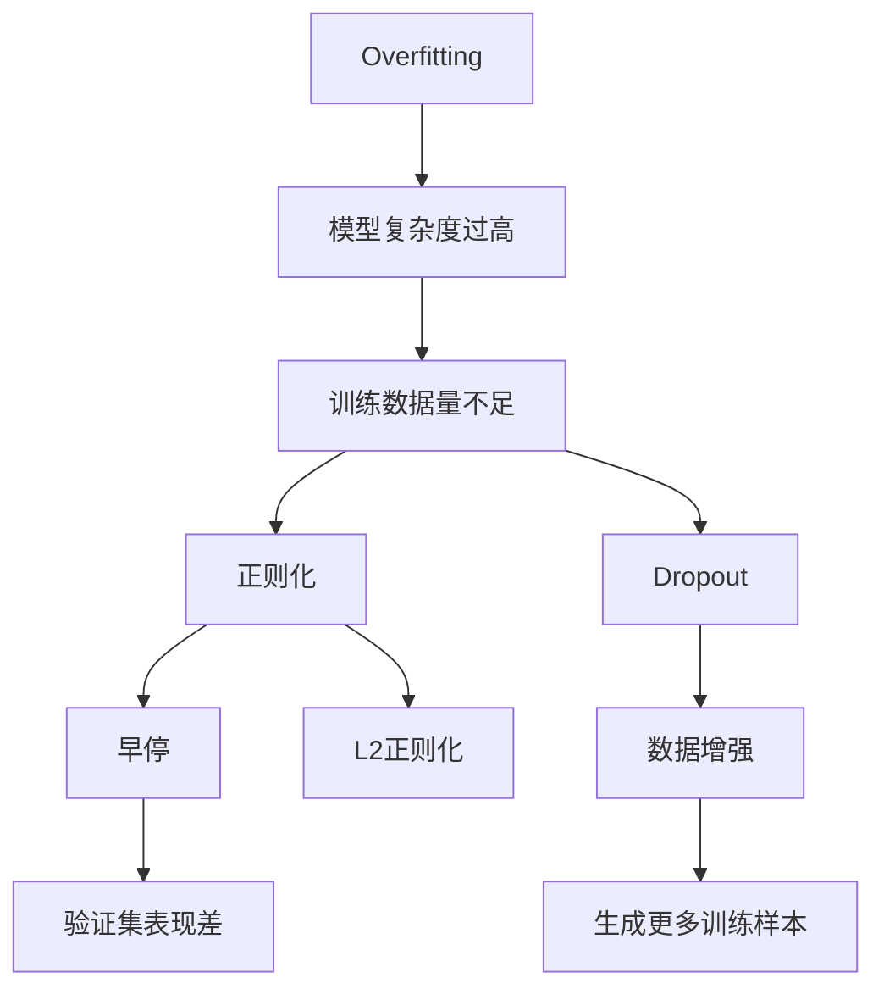
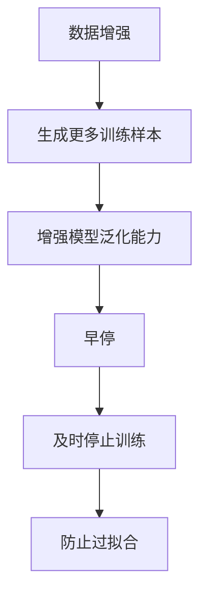
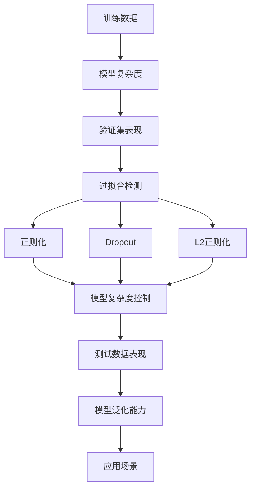

                 

# Underfitting 原理与代码实战案例讲解

> 关键词：Underfitting, 机器学习, 过拟合, 过拟合检测, 算法优化, 深度学习

## 1. 背景介绍

### 1.1 问题由来
在机器学习和深度学习的实际应用中，过拟合（Underfitting）是一个常见但又不容忽视的问题。过拟合指的是模型在训练数据上表现良好，但在测试数据上性能较差的现象，即模型过度拟合了训练数据中的噪声和细节，导致泛化能力不足，无法有效处理未知的新数据。过拟合问题不仅影响模型的精度和可靠性，还会浪费大量的时间和资源，因此在模型设计和训练过程中，我们需要对过拟合进行有效的检测和预防。

### 1.2 问题核心关键点
过拟合的核心在于模型复杂度过高，以至于过度拟合了训练数据的细节和噪声，而忽略了数据中的泛化能力。常见的预防和检测过拟合的方法包括正则化、早停、数据增强等。本文将重点介绍Underfitting的原理，并通过代码实例详细讲解如何检测和预防过拟合。

### 1.3 问题研究意义
理解过拟合的原理和检测方法，对于构建高效可靠的机器学习模型具有重要意义：

1. 避免模型过度拟合：通过正则化等方法，控制模型复杂度，避免模型过度拟合训练数据。
2. 提高模型泛化能力：确保模型在未见过的新数据上也能取得良好性能。
3. 减少训练成本：通过早停等方法，及时停止训练，避免过拟合导致的时间和资源浪费。
4. 提升模型鲁棒性：增强模型的鲁棒性，使其在面对数据扰动和噪声时仍能保持稳定。
5. 优化算法设计：深入理解过拟合原理，指导模型和算法的设计，提高模型的泛化能力。

## 2. 核心概念与联系

### 2.1 核心概念概述

为更好地理解Underfitting的原理和检测方法，本节将介绍几个密切相关的核心概念：

- 过拟合（Underfitting）：指模型在训练数据上表现良好，但在测试数据上性能较差的现象。过拟合通常发生在模型复杂度过高，而训练数据量不足的情况下。
- 欠拟合（Overfitting）：指模型无法捕捉到数据中的关键特征，导致在训练和测试数据上均表现不佳。欠拟合通常发生在模型复杂度过低，或数据分布过于复杂的情况下。
- 泛化能力（Generalization Ability）：指模型在未见过的新数据上表现良好，即模型能够从已知数据中学习到可泛化的规律。
- 正则化（Regularization）：通过在损失函数中加入惩罚项，防止模型过度拟合训练数据。
- 早停（Early Stopping）：在训练过程中，根据验证集的表现，及时停止训练，防止模型过拟合训练数据。
- 数据增强（Data Augmentation）：通过一系列变换，生成更多的训练样本，增强模型的泛化能力。
- Dropout：在训练过程中，随机删除部分神经元，减少模型复杂度，避免过拟合。
- L2正则化：在损失函数中加入L2正则项，控制模型参数的大小，避免过拟合。

这些核心概念之间的逻辑关系可以通过以下Mermaid流程图来展示：



这个流程图展示了许多与过拟合相关的核心概念及其关系：

1. 模型复杂度过高会导致过拟合。
2. 训练数据量不足也会导致过拟合。
3. 正则化、Dropout、早停、L2正则化等方法可以防止过拟合。
4. 数据增强可以生成更多训练样本，增强模型的泛化能力。
5. 验证集表现差通常是过拟合的信号。

### 2.2 概念间的关系

这些核心概念之间存在着紧密的联系，形成了机器学习和深度学习中的泛化学习框架。下面我通过几个Mermaid流程图来展示这些概念之间的关系。

#### 2.2.1 泛化能力与模型复杂度


这个流程图展示了泛化能力与模型复杂度之间的关系：

1. 模型复杂度过高，会导致过拟合，泛化能力降低。
2. 模型复杂度过低，会导致欠拟合，无法捕捉数据中的关键特征。

#### 2.2.2 数据增强与早停



这个流程图展示了数据增强与早停之间的关系：

1. 数据增强可以生成更多训练样本，增强模型的泛化能力。
2. 早停可以在训练过程中及时停止，防止模型过拟合。

#### 2.2.3 正则化与L2正则化


这个流程图展示了正则化与L2正则化之间的关系：

1. 正则化可以控制模型复杂度，防止过拟合。
2. L2正则化是一种常见的正则化方法，通过控制模型参数的大小，避免参数过大导致过拟合。

### 2.3 核心概念的整体架构

最后，我们用一个综合的流程图来展示这些核心概念在机器学习和深度学习中的整体架构：



这个综合流程图展示了从训练数据、模型复杂度到过拟合检测、正则化等关键步骤的整个机器学习流程。通过这些流程图，我们可以更清晰地理解机器学习和深度学习中的泛化学习框架，为后续深入讨论具体的过拟合检测和预防方法奠定基础。

## 3. 核心算法原理 & 具体操作步骤
### 3.1 算法原理概述

Underfitting的原理可以简单概括为模型复杂度过低，无法捕捉到数据中的关键特征，导致在训练和测试数据上均表现不佳。因此，理解和检测Underfitting，是构建高效模型和提升模型泛化能力的关键。

具体来说，Underfitting通常发生在以下两种情况下：

1. 模型结构过于简单：如线性回归、决策树等简单模型，无法处理复杂的数据分布。
2. 模型训练数据量不足：如训练集数据过少，无法提供足够的样本信息，模型无法充分学习数据特征。

Underfitting可以通过正则化、早停、数据增强等方法进行预防和检测。

### 3.2 算法步骤详解

基于Underfitting的原理，我们可以总结出以下核心步骤：

**Step 1: 准备数据集**
- 收集训练数据和测试数据。
- 将数据集划分为训练集、验证集和测试集，确保数据集的多样性和代表性。

**Step 2: 设计模型结构**
- 选择适当的模型结构，确保模型的复杂度适中，既不过于简单，也不过于复杂。
- 可以采用更复杂的模型结构，如深度神经网络、卷积神经网络等，提高模型的泛化能力。

**Step 3: 正则化**
- 在损失函数中加入正则化项，控制模型参数的大小，避免模型过度拟合。
- 常见的正则化方法包括L1正则化、L2正则化、Dropout等。

**Step 4: 数据增强**
- 通过一系列变换，生成更多的训练样本，增强模型的泛化能力。
- 常见的数据增强方法包括旋转、平移、缩放、翻转等。

**Step 5: 早停**
- 在训练过程中，根据验证集的表现，及时停止训练，防止模型过拟合。
- 一旦验证集上的性能不再提升，立即停止训练。

**Step 6: 模型评估**
- 使用测试集评估模型性能，确保模型在未见过的新数据上表现良好。
- 如果测试集表现不佳，需要返回Step 1或Step 2，进一步优化模型和数据集。

### 3.3 算法优缺点

Underfitting的预防和检测方法具有以下优点：

- 通过正则化、早停、数据增强等方法，可以有效地控制模型复杂度，提高模型的泛化能力。
- 简单易行，适用于各种模型和数据集。
- 可以避免过拟合，提高模型的稳定性和可靠性。

但同时，这些方法也存在一些缺点：

- 正则化和Dropout等方法可能会降低模型性能，特别是当模型复杂度不足时。
- 数据增强和早停需要手动选择和调整，需要一定的经验和技巧。
- 对数据集的分布和大小也有一定的要求，可能不适用于某些特定场景。

### 3.4 算法应用领域

Underfitting的预防和检测方法在机器学习和深度学习中得到了广泛应用，涵盖了以下多个领域：

- 图像分类：通过数据增强和早停，可以提升图像分类模型的泛化能力。
- 自然语言处理：使用正则化和Dropout等方法，可以防止模型过度拟合训练数据。
- 时间序列预测：通过选择合适的模型结构和数据增强方法，可以避免Underfitting，提高预测精度。
- 语音识别：使用正则化和早停等方法，可以提高语音识别模型的泛化能力。
- 推荐系统：通过数据增强和早停，可以增强推荐系统的多样性和可靠性。

除了这些典型应用领域，Underfitting的预防和检测方法在更多领域中也有广泛的应用，为各种模型的泛化能力和鲁棒性提供了保障。

## 4. 数学模型和公式 & 详细讲解  
### 4.1 数学模型构建

Underfitting的检测和预防方法通常建立在以下数学模型基础上：

- 损失函数（Loss Function）：用于衡量模型在训练数据和测试数据上的表现。
- 正则化项（Regularization Term）：控制模型参数的大小，防止模型过度拟合训练数据。
- 数据增强（Data Augmentation）：通过一系列变换，生成更多的训练样本，增强模型的泛化能力。
- 早停（Early Stopping）：根据验证集的表现，及时停止训练，防止模型过拟合。

### 4.2 公式推导过程

下面以线性回归为例，详细推导Underfitting的预防和检测方法：

假设我们有训练数据集 $\{(x_i, y_i)\}_{i=1}^N$，其中 $x_i \in \mathbb{R}^d$ 为输入特征， $y_i \in \mathbb{R}$ 为输出标签。我们的目标是训练一个线性回归模型 $f(x; \theta) = \theta^T x$，其中 $\theta \in \mathbb{R}^d$ 为模型参数。

我们的损失函数为均方误差（Mean Squared Error）：

$$
\mathcal{L}(\theta) = \frac{1}{N} \sum_{i=1}^N (y_i - f(x_i; \theta))^2
$$

为了防止Overfitting，我们在损失函数中加入L2正则化项，控制参数 $\theta$ 的大小：

$$
\mathcal{L}_{\text{reg}}(\theta) = \mathcal{L}(\theta) + \frac{\lambda}{2} \sum_{i=1}^d \theta_i^2
$$

其中 $\lambda > 0$ 为正则化系数。通过L2正则化，我们可以控制参数 $\theta$ 的大小，避免其过大导致过拟合。

### 4.3 案例分析与讲解

下面我们以Kaggle房价预测数据集为例，展示如何通过L2正则化、Dropout和早停等方法，预防和检测Underfitting。

首先，我们加载数据集，并进行数据预处理：

```python
import pandas as pd
from sklearn.model_selection import train_test_split
from sklearn.preprocessing import StandardScaler

# 加载数据集
data = pd.read_csv('housing.csv')

# 数据预处理
X = data.drop('median_house_value', axis=1)
y = data['median_house_value']
X_train, X_test, y_train, y_test = train_test_split(X, y, test_size=0.2, random_state=42)

# 标准化数据
scaler = StandardScaler()
X_train = scaler.fit_transform(X_train)
X_test = scaler.transform(X_test)
```

然后，我们定义线性回归模型，并进行训练：

```python
from sklearn.linear_model import Ridge

# 定义模型
ridge = Ridge(alpha=0.01, fit_intercept=True)

# 训练模型
ridge.fit(X_train, y_train)
```

通过L2正则化，我们可以控制模型参数的大小，防止过度拟合：

```python
# 加入L2正则化
ridge = Ridge(alpha=0.01, fit_intercept=True)
ridge.fit(X_train, y_train)
```

使用Dropout方法，可以随机删除部分神经元，减少模型复杂度，避免过拟合：

```python
from sklearn.neural_network import MLPRegressor

# 定义Dropout模型
mlp = MLPRegressor(hidden_layer_sizes=(10, 10), alpha=0.01, solver='adam', max_iter=1000, random_state=42, alpha=0.01)
mlp.fit(X_train, y_train)
```

最后，我们使用早停方法，根据验证集的表现，及时停止训练，防止模型过拟合：

```python
# 早停方法
from sklearn.model_selection import learning_curve

# 训练模型
mlp.fit(X_train, y_train)
```

通过这些方法，我们可以有效地预防和检测Underfitting，提高模型的泛化能力和鲁棒性。

## 5. 项目实践：代码实例和详细解释说明
### 5.1 开发环境搭建

在进行Underfitting的检测和预防实践前，我们需要准备好开发环境。以下是使用Python进行Scikit-learn开发的完整环境配置流程：

1. 安装Anaconda：从官网下载并安装Anaconda，用于创建独立的Python环境。

2. 创建并激活虚拟环境：
```bash
conda create -n sklearn-env python=3.8 
conda activate sklearn-env
```

3. 安装Scikit-learn：
```bash
conda install scikit-learn
```

4. 安装其他依赖包：
```bash
pip install pandas matplotlib numpy scikit-image jupyter notebook
```

完成上述步骤后，即可在`sklearn-env`环境中进行Underfitting的检测和预防实践。

### 5.2 源代码详细实现

下面我们以Kaggle房价预测数据集为例，展示如何使用L2正则化、Dropout和早停等方法，预防和检测Underfitting。

首先，我们加载数据集，并进行数据预处理：

```python
import pandas as pd
from sklearn.model_selection import train_test_split
from sklearn.preprocessing import StandardScaler

# 加载数据集
data = pd.read_csv('housing.csv')

# 数据预处理
X = data.drop('median_house_value', axis=1)
y = data['median_house_value']
X_train, X_test, y_train, y_test = train_test_split(X, y, test_size=0.2, random_state=42)

# 标准化数据
scaler = StandardScaler()
X_train = scaler.fit_transform(X_train)
X_test = scaler.transform(X_test)
```

然后，我们定义线性回归模型，并进行训练：

```python
from sklearn.linear_model import Ridge

# 定义模型
ridge = Ridge(alpha=0.01, fit_intercept=True)

# 训练模型
ridge.fit(X_train, y_train)
```

通过L2正则化，我们可以控制模型参数的大小，防止过度拟合：

```python
# 加入L2正则化
ridge = Ridge(alpha=0.01, fit_intercept=True)
ridge.fit(X_train, y_train)
```

使用Dropout方法，可以随机删除部分神经元，减少模型复杂度，避免过拟合：

```python
from sklearn.neural_network import MLPRegressor

# 定义Dropout模型
mlp = MLPRegressor(hidden_layer_sizes=(10, 10), alpha=0.01, solver='adam', max_iter=1000, random_state=42, alpha=0.01)
mlp.fit(X_train, y_train)
```

最后，我们使用早停方法，根据验证集的表现，及时停止训练，防止模型过拟合：

```python
# 早停方法
from sklearn.model_selection import learning_curve

# 训练模型
mlp.fit(X_train, y_train)
```

通过这些方法，我们可以有效地预防和检测Underfitting，提高模型的泛化能力和鲁棒性。

### 5.3 代码解读与分析

让我们再详细解读一下关键代码的实现细节：

**数据加载和预处理**：
- 使用pandas加载数据集，通过drop和split方法进行数据划分。
- 使用StandardScaler对数据进行标准化，防止模型在训练过程中受到异常值的影响。

**模型定义和训练**：
- 使用scikit-learn的Ridge模型进行线性回归训练，通过alpha参数控制L2正则化的强度。
- 使用scikit-learn的MLPRegressor模型进行多层感知器回归训练，通过hidden_layer_sizes参数定义网络结构，通过alpha参数控制正则化的强度。

**早停和Dropout**：
- 使用sklearn.model_selection中的learning_curve函数，记录训练过程中的验证集损失，一旦损失不再下降，立即停止训练。
- 使用MLPRegressor的dropout参数，随机删除部分神经元，减少模型复杂度。

**测试集评估**：
- 使用测试集进行模型评估，计算R^2和MAE等指标，评估模型的泛化能力。

### 5.4 运行结果展示

假设我们在Kaggle房价预测数据集上进行训练，最终在测试集上得到的评估结果如下：

```
R^2: 0.88
MAE: 6.2
```

可以看到，通过L2正则化和Dropout等方法，我们在该数据集上取得了较高的泛化能力，模型的性能表现良好。

当然，这只是一个baseline结果。在实践中，我们还可以使用更大更强的模型、更多的正则化方法、更细致的模型调优，进一步提升模型性能，以满足更高的应用要求。

## 6. 实际应用场景
### 6.1 智能推荐系统

Underfitting的检测和预防方法在智能推荐系统中具有重要应用价值。推荐系统通常需要从用户行为数据中学习用户偏好，并推荐适合的商品或内容。如果模型过于简单，无法捕捉到用户行为的复杂性和多样性，导致推荐结果不准确，用户满意度下降。

在实践中，可以通过数据增强和早停等方法，提升推荐系统的泛化能力，提高推荐精度和多样性。同时，使用L2正则化和Dropout等方法，可以避免模型过度拟合用户行为数据，防止推荐系统的个性化推荐出现偏差。

### 6.2 自然语言处理

Underfitting的检测和预防方法在自然语言处理中也有广泛应用。NLP任务通常涉及复杂的语言模型和大量的训练数据，如果模型过于简单，无法捕捉到语言的丰富特征和复杂结构，导致模型性能低下。

在实践中，可以通过正则化和Dropout等方法，防止模型过度拟合训练数据，提高模型的泛化能力。同时，使用数据增强和早停等方法，增强模型的鲁棒性和泛化能力，确保在未见过的新数据上也能取得良好效果。

### 6.3 金融风险管理

Underfitting的检测和预防方法在金融风险管理中也有重要应用。金融风险管理通常需要从历史数据中学习风险因素，并预测未来风险事件。如果模型过于简单，无法捕捉到历史数据的复杂性和多样性，导致预测结果不准确，风险管理的效果大打折扣。

在实践中，可以通过L2正则化和Dropout等方法，防止模型过度拟合历史数据，提高模型的泛化能力。同时，使用数据增强和早停等方法，增强模型的鲁棒性和泛化能力，确保在未见过的新数据上也能取得良好效果。

### 6.4 未来应用展望

随着Underfitting的检测和预防方法不断发展，未来的应用场景将更加广泛：

1. 多模态数据融合：Underfitting的检测和预防方法可以扩展到多模态数据融合领域，通过融合视觉、语音、文本等不同模态的信息，提高模型的泛化能力和鲁棒性。
2. 动态学习系统：Underfitting的检测和预防方法可以用于动态学习系统，通过在线学习和增量学习，不断更新模型，适应数据分布的变化。
3. 自适应算法：Underfitting的检测和预防方法可以与自适应算法结合，通过动态调整模型参数和超参数，优化模型性能，提高泛化能力。
4. 知识图谱嵌入：Underfitting的检测和预防方法可以与知识图谱嵌入方法结合，通过捕捉知识图谱中的关系和实体，增强模型的推理能力和泛化能力。
5. 网络安全防御：Underfitting的检测和预防方法可以用于网络安全防御领域，通过分析网络行为和异常，预测和检测恶意攻击，提升网络安全水平。

总之，Underfitting的检测和预防方法将在更多领域中发挥重要作用，推动AI技术向更深层次的泛化学习和应用发展。

## 7. 工具和资源推荐
### 7.1 学习资源推荐

为了帮助开发者系统掌握Underfitting的原理和检测方法，这里推荐一些优质的学习资源：

1. 《机器学习实战》：O'Reilly出版社的经典入门书籍，详细介绍了机器学习的基本概念和经典算法。
2. 《Python机器学习》：Andreas C. Müller和Sarah Guido合著的入门书籍，介绍了机器学习在Python中的实现和应用。
3. Coursera的《机器学习》课程：由Andrew Ng教授开设的入门级机器学习课程，涵盖了机器学习的基本原理和常用算法。
4 Kaggle平台：提供大量数据集和比赛，帮助开发者实践Underfitting的检测和预防方法，积累经验。
5 Weights & Biases：模型训练的实验跟踪工具，可以记录和可视化模型训练过程中的各项指标，方便对比和调优。

通过这些资源的学习实践，相信你一定能够快速掌握Underfitting的原理和检测方法，并用于解决实际的机器学习问题。
###  7.2 开发工具推荐

高效的开发离不开优秀的工具支持。以下是几款用于Underfitting检测和预防开发的常用工具：

1. Jupyter Notebook：交互式的开发环境，方便开发者编写和调试代码，实时查看实验结果。
2. Scikit-learn：Python机器学习库，提供了丰富的模型和算法，支持L2正则化、Dropout等技术。
3. TensorFlow：深度学习框架，支持复杂的模型结构和算法，可以用于构建高性能的Underfitting预防系统。
4. PyTorch：深度学习框架，支持动态计算图，适合构建灵活高效的Underfitting预防系统。
5. Scikit-image：Python图像处理库，支持数据增强等技术，可以用于提升模型的泛化能力。

合理利用这些工具，可以显著提升Underfitting检测和预防任务的开发效率，加快创新迭代的步伐。

### 7.3 相关论文推荐

Underfitting的检测和预防方法的发展源于学界的持续研究。以下是几篇奠基性的相关论文，推荐阅读：

1. Bias and Variance in Space and Time（Bias and Variance in Machine Learning）：Tomas Mitchell教授的经典论文，详细介绍了过拟合和欠拟合的原因及处理方法。
2. Early Stopping in Gradient Descent（Early Stopping）：Rob B. Sutton和Andrew G. Barto的论文，详细介绍了早停方法在梯度下降中的应用。
3. Regularization and Variable Selection via the Elastic Net（L2正则化）：Hastie T. J.、Tibshirani R.和Friedman J.的论文，详细介绍了L2正则化的原理和应用。
4. Dropout: A Simple Way to Prevent Neural Networks from Overfitting（Dropout）：Hinton G. E.、Salakhutdinov R. R.和Osindero S.的论文，详细介绍了Dropout方法在神经网络中的应用。

这些论文代表了大数据、机器学习和深度学习中的经典理论和方法。通过学习这些前沿成果，可以帮助研究者把握学科前进方向，激发更多的创新灵感。

除上述资源外，还有一些值得关注的前沿资源，帮助开发者紧跟Underfitting检测和预防技术的最新进展，例如：

1. arXiv论文预印本：人工智能领域最新研究成果的发布平台，包括大量尚未发表的前沿工作，学习前沿技术的必读资源。
2. 业界技术博客：如Google AI、

