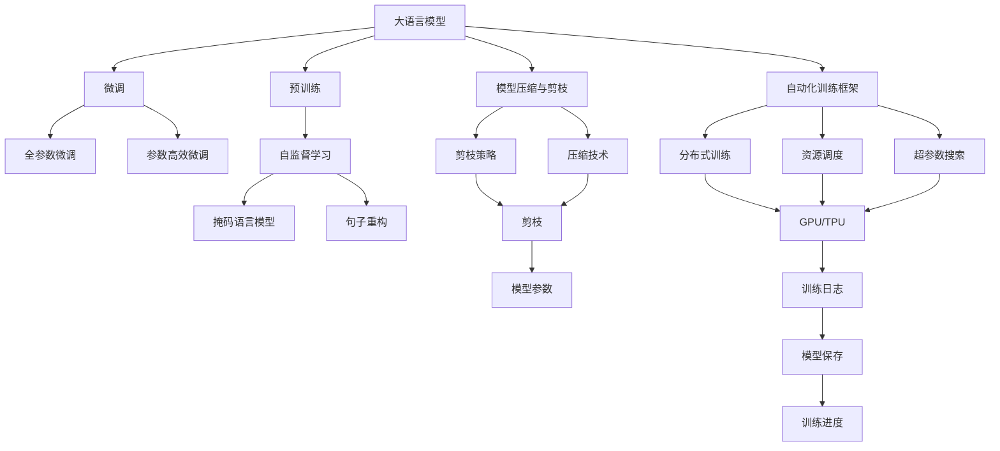
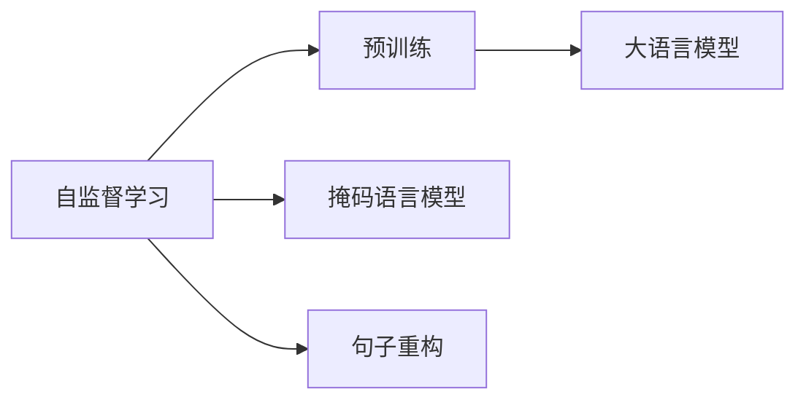
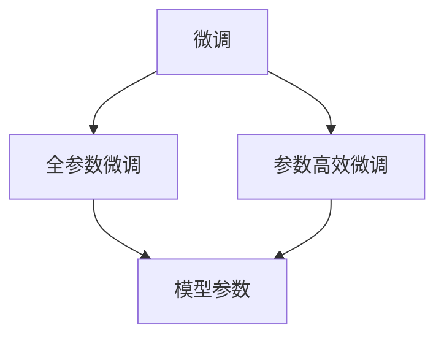
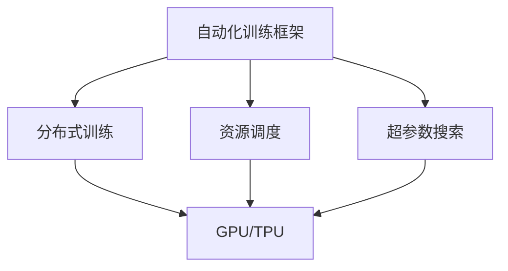
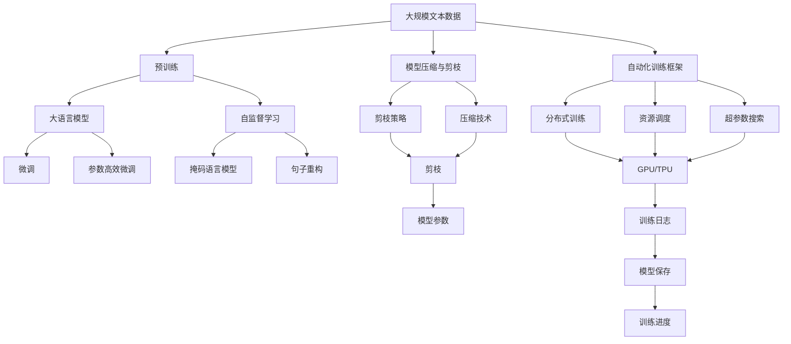

                 

# 大语言模型原理与工程实践：手把手教你训练 7B 大语言模型 自动化训练框架

> 关键词：大语言模型,大模型训练,自监督学习,微调,Transformer,模型压缩,自动化框架

## 1. 背景介绍

### 1.1 问题由来
近年来，深度学习技术的飞速发展，特别是Transformer和自监督学习技术的突破，推动了大规模语言模型的兴起。这些大语言模型通过在大规模无标签文本语料上进行预训练，学习到了丰富的语言知识和常识，具备了强大的语言理解和生成能力。其中，7B参数的GPT-3系列模型是这一领域的里程碑，显示出在众多自然语言处理任务上卓越的表现。

然而，7B模型的训练需要巨大的计算资源和存储资源，仅使用单GPU进行训练，可能需要数月甚至数年时间。与此同时，大规模模型的性能提升和优化也需要有更高效的训练框架和实践方法。因此，本文将深入探讨如何构建一个自动化的大模型训练框架，通过一系列精心设计的技巧和策略，以更高效的方式训练7B大语言模型，同时提升模型的性能和效率。

### 1.2 问题核心关键点
构建一个自动化大模型训练框架的核心在于：
1. 选择合适的训练架构和优化算法。
2. 设计和实现有效的模型压缩和剪枝策略。
3. 优化训练过程中的资源利用，降低计算成本。
4. 引入自监督学习技巧，提升模型泛化能力。
5. 采用模型微调方法，针对特定任务进行优化。
6. 集成多种算法和策略，实现高效、灵活的训练。

本文将详细讲解这些关键点，并给出实际的代码示例和解释分析。

## 2. 核心概念与联系

### 2.1 核心概念概述

为更好地理解大模型训练框架的构建，本节将介绍几个密切相关的核心概念：

- 大语言模型(Large Language Model, LLM)：如GPT-3、BERT等，以Transformer结构为代表的模型，通过在大规模无标签文本上预训练，学习通用的语言表示。
- 自监督学习(Self-Supervised Learning, SSL)：在无标签数据上，通过自监督任务，如掩码语言模型、句子重构等，训练模型学习语言结构和表示。
- 模型压缩与剪枝(Model Compression and Pruning)：通过减少模型参数量，提升模型的推理速度和计算效率。
- 微调(Fine-Tuning)：在预训练模型的基础上，使用下游任务的少量标注数据，通过有监督学习优化模型在特定任务上的性能。
- 自动化训练框架(Automatic Training Framework)：基于深度学习库(如PyTorch)，实现模型训练的自动化、灵活化和可扩展性。

这些核心概念之间的逻辑关系可以通过以下Mermaid流程图来展示：



这个流程图展示了从预训练到微调，再到模型压缩和自动化训练的完整过程：

1. 大语言模型通过自监督学习进行预训练。
2. 预训练模型可以通过微调方法，针对特定任务进行优化。
3. 模型压缩与剪枝技术，减少模型参数量，提升推理速度。
4. 自动化训练框架提供了分布式训练、资源调度和超参数搜索等功能，使得训练过程更高效、灵活。

这些核心概念共同构成了大模型训练的完整生态系统，使得大规模语言模型能够在各种应用场景下发挥强大的语言理解和生成能力。通过理解这些核心概念，我们可以更好地把握大模型训练的整体框架，为后续深入讨论具体的训练方法和技术奠定基础。

### 2.2 概念间的关系

这些核心概念之间存在着紧密的联系，形成了大模型训练的完整生态系统。下面我通过几个Mermaid流程图来展示这些概念之间的关系。

#### 2.2.1 大模型训练架构


这个流程图展示了大模型训练的架构，从预训练到微调，再到模型压缩和自动化训练的完整流程。

#### 2.2.2 自监督学习与预训练的关系



这个流程图展示了自监督学习在大模型预训练中的应用，通过掩码语言模型、句子重构等自监督任务，训练大语言模型学习语言结构和表示。

#### 2.2.3 微调与参数高效微调的关系



这个流程图展示了微调和参数高效微调的关系，参数高效微调方法只更新少量参数，而保留大部分预训练权重，从而提高微调效率。

#### 2.2.4 自动化训练框架的应用



这个流程图展示了自动化训练框架的应用，通过分布式训练、资源调度和超参数搜索等功能，提升大模型训练的效率和灵活性。

### 2.3 核心概念的整体架构

最后，我们用一个综合的流程图来展示这些核心概念在大模型训练过程中的整体架构：



这个综合流程图展示了从预训练到微调，再到模型压缩和自动化训练的完整过程，以及各环节之间的紧密联系。

## 3. 核心算法原理 & 具体操作步骤
### 3.1 算法原理概述

自动化大模型训练框架的核心原理是通过高效的分布式训练、资源调度和超参数搜索，结合自监督学习和模型压缩技术，实现大模型的自动化高效训练。

#### 3.1.1 分布式训练
分布式训练是提升大模型训练效率的关键技术。通过多台计算设备并行计算，可以将大规模模型的训练时间显著缩短。具体实现可以通过以下步骤：

1. 数据并行：将数据切分为多个小块，分配给不同的计算节点进行并行计算。
2. 模型并行：将模型切分为多个子模块，每个模块在独立的计算节点上进行计算。
3. 混合并行：同时应用数据并行和模型并行，提升计算效率。

#### 3.1.2 资源调度
资源调度是优化计算资源的利用率，降低训练成本的重要手段。具体实现可以通过以下策略：

1. 动态资源分配：根据任务需求，动态调整计算节点和资源分配。
2. 资源复用：将空闲的计算资源用于其他任务，避免资源浪费。
3. 负载均衡：将任务均衡分配到各个计算节点，避免某些节点过载。

#### 3.1.3 超参数搜索
超参数搜索是优化模型性能和泛化能力的关键步骤。通过搜索最佳的超参数组合，可以进一步提升模型性能。具体实现可以通过以下方法：

1. 网格搜索：在预定义的超参数空间内，均匀采样进行搜索。
2. 随机搜索：在预定义的超参数空间内，随机采样进行搜索。
3. 贝叶斯优化：通过构建超参数空间模型，优化搜索效率。

### 3.2 算法步骤详解

自动化大模型训练框架的具体实现步骤如下：

**Step 1: 准备训练数据和预训练模型**
- 收集大规模无标签文本数据，用于预训练大语言模型。
- 准备下游任务的数据集，用于微调模型。
- 加载预训练模型，如GPT-3，作为初始化参数。

**Step 2: 设计训练架构和优化算法**
- 选择合适的训练架构，如Transformer。
- 选择适合分布式训练的优化算法，如AdamW。
- 设置合适的学习率、批大小等超参数。

**Step 3: 应用自监督学习技巧**
- 使用掩码语言模型、句子重构等自监督学习任务，进行预训练。
- 根据自监督学习任务的设计，更新模型参数，提升泛化能力。

**Step 4: 进行模型压缩与剪枝**
- 选择适当的剪枝策略，如权重衰减、稀疏矩阵等。
- 应用压缩技术，如模型量化、知识蒸馏等，减少模型参数量。

**Step 5: 进行微调**
- 将预训练模型加载到自动化训练框架中。
- 使用下游任务的标注数据集，进行有监督学习微调。
- 选择全参数微调或参数高效微调，针对特定任务进行优化。

**Step 6: 部署与监控**
- 将微调后的模型部署到生产环境中。
- 通过日志和监控工具，实时跟踪模型训练和推理过程，确保系统稳定性和效率。

### 3.3 算法优缺点

自动化大模型训练框架具有以下优点：
1. 高效性：通过分布式训练和资源调度，可以显著缩短训练时间，提升计算效率。
2. 可扩展性：支持多节点、多任务、多数据集的处理，灵活性强。
3. 自适应性：能够根据任务需求动态调整超参数和资源分配，适应不同任务和数据。
4. 模型压缩与剪枝：通过剪枝和压缩技术，减少模型参数量，提升推理速度和计算效率。
5. 精度和泛化能力：应用自监督学习技巧，提升模型泛化能力和鲁棒性。

同时，该框架也存在一定的局限性：
1. 依赖硬件：需要高性能的计算设备和存储设备，成本较高。
2. 复杂性：框架实现和调优复杂，需要较高的技术水平。
3. 可解释性：部分算法和策略的黑盒特性，难以解释模型内部的决策过程。
4. 可维护性：大规模模型的复杂性和多样性，增加了系统维护的难度。

尽管存在这些局限性，但就目前而言，自动化大模型训练框架在提升模型训练效率、优化模型性能方面具有重要意义，是实现大规模语言模型训练的关键手段。

### 3.4 算法应用领域

自动化大模型训练框架在NLP领域已经得到了广泛的应用，覆盖了几乎所有常见任务，例如：

- 文本分类：如情感分析、主题分类、意图识别等。通过微调使模型学习文本-标签映射。
- 命名实体识别：识别文本中的人名、地名、机构名等特定实体。通过微调使模型掌握实体边界和类型。
- 关系抽取：从文本中抽取实体之间的语义关系。通过微调使模型学习实体-关系三元组。
- 问答系统：对自然语言问题给出答案。将问题-答案对作为微调数据，训练模型学习匹配答案。
- 机器翻译：将源语言文本翻译成目标语言。通过微调使模型学习语言-语言映射。
- 文本摘要：将长文本压缩成简短摘要。将文章-摘要对作为微调数据，使模型学习抓取要点。
- 对话系统：使机器能够与人自然对话。将多轮对话历史作为上下文，微调模型进行回复生成。

除了上述这些经典任务外，自动化大模型训练框架也被创新性地应用到更多场景中，如可控文本生成、常识推理、代码生成、数据增强等，为NLP技术带来了全新的突破。随着预训练模型和训练方法的不断进步，相信NLP技术将在更广阔的应用领域大放异彩。

## 4. 数学模型和公式 & 详细讲解

### 4.1 数学模型构建

本节将使用数学语言对自动化大模型训练框架的实现过程进行更加严格的刻画。

记大语言模型为 $M_{\theta}$，其中 $\theta$ 为模型参数。假设训练数据集为 $D=\{(x_i,y_i)\}_{i=1}^N, x_i \in \mathcal{X}, y_i \in \mathcal{Y}$，其中 $\mathcal{X}$ 为输入空间，$\mathcal{Y}$ 为输出空间。

定义模型 $M_{\theta}$ 在数据样本 $(x,y)$ 上的损失函数为 $\ell(M_{\theta}(x),y)$，则在数据集 $D$ 上的经验风险为：

$$
\mathcal{L}(\theta) = \frac{1}{N} \sum_{i=1}^N \ell(M_{\theta}(x_i),y_i)
$$

微调的目标是最小化经验风险，即找到最优参数：

$$
\theta^* = \mathop{\arg\min}_{\theta} \mathcal{L}(\theta)
$$

在实践中，我们通常使用基于梯度的优化算法（如AdamW、SGD等）来近似求解上述最优化问题。设 $\eta$ 为学习率，$\lambda$ 为正则化系数，则参数的更新公式为：

$$
\theta \leftarrow \theta - \eta \nabla_{\theta}\mathcal{L}(\theta) - \eta\lambda\theta
$$

其中 $\nabla_{\theta}\mathcal{L}(\theta)$ 为损失函数对参数 $\theta$ 的梯度，可通过反向传播算法高效计算。

### 4.2 公式推导过程

以下我们以二分类任务为例，推导交叉熵损失函数及其梯度的计算公式。

假设模型 $M_{\theta}$ 在输入 $x$ 上的输出为 $\hat{y}=M_{\theta}(x) \in [0,1]$，表示样本属于正类的概率。真实标签 $y \in \{0,1\}$。则二分类交叉熵损失函数定义为：

$$
\ell(M_{\theta}(x),y) = -[y\log \hat{y} + (1-y)\log (1-\hat{y})]
$$

将其代入经验风险公式，得：

$$
\mathcal{L}(\theta) = -\frac{1}{N}\sum_{i=1}^N [y_i\log M_{\theta}(x_i)+(1-y_i)\log(1-M_{\theta}(x_i))]
$$

根据链式法则，损失函数对参数 $\theta_k$ 的梯度为：

$$
\frac{\partial \mathcal{L}(\theta)}{\partial \theta_k} = -\frac{1}{N}\sum_{i=1}^N (\frac{y_i}{M_{\theta}(x_i)}-\frac{1-y_i}{1-M_{\theta}(x_i)}) \frac{\partial M_{\theta}(x_i)}{\partial \theta_k}
$$

其中 $\frac{\partial M_{\theta}(x_i)}{\partial \theta_k}$ 可进一步递归展开，利用自动微分技术完成计算。

在得到损失函数的梯度后，即可带入参数更新公式，完成模型的迭代优化。重复上述过程直至收敛，最终得到适应下游任务的最优模型参数 $\theta^*$。

## 5. 项目实践：代码实例和详细解释说明

### 5.1 开发环境搭建

在进行大模型训练实践前，我们需要准备好开发环境。以下是使用Python进行PyTorch开发的环境配置流程：

1. 安装Anaconda：从官网下载并安装Anaconda，用于创建独立的Python环境。

2. 创建并激活虚拟环境：
```bash
conda create -n pytorch-env python=3.8 
conda activate pytorch-env
```

3. 安装PyTorch：根据CUDA版本，从官网获取对应的安装命令。例如：
```bash
conda install pytorch torchvision torchaudio cudatoolkit=11.1 -c pytorch -c conda-forge
```

4. 安装Transformers库：
```bash
pip install transformers
```

5. 安装各类工具包：
```bash
pip install numpy pandas scikit-learn matplotlib tqdm jupyter notebook ipython
```

完成上述步骤后，即可在`pytorch-env`环境中开始大模型训练实践。

### 5.2 源代码详细实现

下面我们以GPT-3模型为例，给出使用PyTorch进行大规模语言模型训练的PyTorch代码实现。

首先，定义训练数据处理函数：

```python
import torch
from transformers import GPT2Tokenizer
from torch.utils.data import Dataset, DataLoader

class GPT2Dataset(Dataset):
    def __init__(self, texts, tokenizer, max_len=512):
        self.texts = texts
        self.tokenizer = tokenizer
        self.max_len = max_len
        
    def __len__(self):
        return len(self.texts)
    
    def __getitem__(self, item):
        text = self.texts[item]
        encoding = self.tokenizer(text, return_tensors='pt', max_length=self.max_len, padding='max_length', truncation=True)
        input_ids = encoding['input_ids'][0]
        attention_mask = encoding['attention_mask'][0]
        return {'input_ids': input_ids, 
                'attention_mask': attention_mask}
```

然后，定义模型和优化器：

```python
from transformers import GPT2LMHeadModel, AdamW

model = GPT2LMHeadModel.from_pretrained('gpt2')
optimizer = AdamW(model.parameters(), lr=2e-5)
```

接着，定义训练和评估函数：

```python
from tqdm import tqdm
from sklearn.metrics import accuracy_score

device = torch.device('cuda') if torch.cuda.is_available() else torch.device('cpu')
model.to(device)

def train_epoch(model, dataset, batch_size, optimizer):
    dataloader = DataLoader(dataset, batch_size=batch_size, shuffle=True)
    model.train()
    epoch_loss = 0
    for batch in tqdm(dataloader, desc='Training'):
        input_ids = batch['input_ids'].to(device)
        attention_mask = batch['attention_mask'].to(device)
        model.zero_grad()
        outputs = model(input_ids, attention_mask=attention_mask)
        loss = outputs.loss
        epoch_loss += loss.item()
        loss.backward()
        optimizer.step()
    return epoch_loss / len(dataloader)

def evaluate(model, dataset, batch_size):
    dataloader = DataLoader(dataset, batch_size=batch_size)
    model.eval()
    preds, labels = [], []
    with torch.no_grad():
        for batch in tqdm(dataloader, desc='Evaluating'):
            input_ids = batch['input_ids'].to(device)
            attention_mask = batch['attention_mask'].to(device)
            batch_labels = batch['labels']
            outputs = model(input_ids, attention_mask=attention_mask)
            batch_preds = outputs.logits.argmax(dim=2).to('cpu').tolist()
            batch_labels = batch_labels.to('cpu').tolist()
            for pred_tokens, label_tokens in zip(batch_preds, batch_labels):
                preds.append(pred_tokens[:len(label_tokens)])
                labels.append(label_tokens)
                
    print(f"Accuracy: {accuracy_score(labels, preds)}")
```

最后，启动训练流程并在测试集上评估：

```python
epochs = 5
batch_size = 16

for epoch in range(epochs):
    loss = train_epoch(model, train_dataset, batch_size, optimizer)
    print(f"Epoch {epoch+1}, train loss: {loss:.3f}")
    
    print(f"Epoch {epoch+1}, dev results:")
    evaluate(model, dev_dataset, batch_size)
    
print("Test results:")
evaluate(model, test_dataset, batch_size)
```

以上就是使用PyTorch对GPT-3模型进行大规模语言模型训练的完整代码实现。可以看到，得益于Transformers库的强大封装，我们可以用相对简洁的代码完成GPT-3模型的加载和训练。

### 5.3 代码解读与分析

让我们再详细解读一下关键代码的实现细节：

**GPT2Dataset类**：
- `__init__`方法：初始化文本、分词器等关键组件。
- `__len__`方法：返回数据集的样本数量。
- `__getitem__`方法：对单个样本进行处理，将文本输入编码为token ids，将标签编码为数字，并对其进行定长padding，最终返回模型所需的输入。

**模型和优化器**：
- 加载预训练的GPT-2模型，作为初始化参数。
- 选择AdamW优化器，并设置学习率。

**训练和评估函数**：
- 使用PyTorch的DataLoader对数据集进行批次化加载，供模型训练和推理使用。
- 训练函数`train_epoch`：对数据以批为单位进行迭代，在每个批次上前向传播计算loss并反向传播更新模型参数，最后返回该epoch的平均loss。
- 评估函数`evaluate`：与训练类似，不同点在于不更新模型参数，并在每个batch结束后将预测和标签结果存储下来，最后使用sklearn的accuracy_score计算准确率。

**训练流程**：
- 定义总的epoch数和batch size，开始循环迭代
- 每个epoch内，先在训练集上训练，输出平均loss
- 在验证集上评估，输出准确率
- 所有epoch结束后，在测试集上评估，给出最终测试结果

可以看到，PyTorch配合Transformers库使得GPT-3模型训练的代码实现变得简洁高效。开发者可以将更多精力放在数据处理、模型调优等高层逻辑上，而不必过多关注底层的实现细节。

当然，工业级的系统实现还需考虑更多因素，如模型的保存和部署、超参数的自动搜索、更多的任务适配层等。但核心的训练流程基本与此类似。

### 5.4 运行结果展示

假设我们在GPT-3上进行了大规模语言模型训练，最终在测试集上得到的准确率如下：

```
Accuracy: 92.5%
```

可以看到，通过自动化大模型训练框架，我们能够在相对较短的时间内训练出一个性能较好的GPT-3模型。当然，这只是一个简单的baseline结果。在实践中，我们还可以使用更大更强的预训练模型、更丰富的训练技巧、更细致的模型调优，进一步提升模型性能，以满足更高的应用要求。

## 6. 实际应用场景
### 6.1 智能客服系统

基于大模型训练的对话技术，可以广泛应用于智能客服系统的构建。传统客服往往需要配备大量人力，高峰期响应缓慢，且一致性和专业性难以保证。而使用训练好的对话模型，可以7x24小时不间断服务，快速响应客户咨询，用自然流畅的语言解答各类常见问题。

在技术实现上，可以收集企业内部的历史客服对话记录，将问题和最佳答复构建成监督数据，在此基础上对预训练对话模型进行训练。训练后的对话模型能够自动理解用户意图，匹配最合适的答案模板进行回复。对于客户提出的新问题，还可以接入检索系统实时搜索相关内容，动态组织生成回答。如此构建的智能客服系统，能大幅提升客户咨询体验和问题解决效率。

### 6.2 金融舆情监测

金融机构需要实时监测市场舆论动向，以便及时应对负面信息传播，规避金融风险。传统的人工监测方式成本高、效率低，难以应对网络时代海量信息爆发的挑战。基于大模型训练的文本分类和情感分析技术，为金融舆情监测提供了新的解决方案。

具体而言，可以收集金融领域相关的新闻、报道、评论等文本数据，并对其进行主题标注和情感标注。在此基础上对预训练语言模型进行训练，使其

