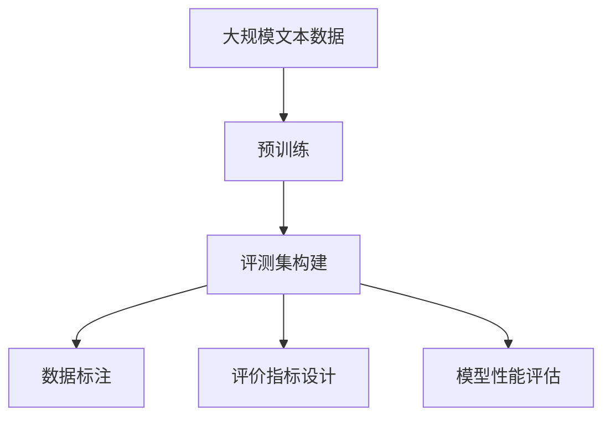

                 

# 大语言模型原理与工程实践：评测集的构建标准

> 关键词：大语言模型, 评测集, 评价指标, 数据标注, 模型性能评估, 数据集构建, 实际应用

## 1. 背景介绍

### 1.1 问题由来
随着深度学习和大规模语言模型的快速发展，语言模型在自然语言处理（NLP）领域取得了显著的成果。从简单的文本分类到复杂的对话生成，大语言模型在诸多任务上都取得了优异的表现。然而，模型的性能不仅取决于模型自身的架构和训练方法，评测集（Evaluation Dataset）的设计和构建也对模型的评估和应用有着不可忽视的影响。

### 1.2 问题核心关键点
评测集是大规模语言模型性能评估的重要工具，决定了模型的训练目标和优化方向。一个良好的评测集能够全面、公正地反映模型在不同任务上的表现，引导模型朝着正确的方向发展。

评测集的核心关键点包括：
1. **数据多样性**：评测集应覆盖广泛的数据类型和分布，反映真实应用场景中的多样性。
2. **标注质量**：标注数据应准确、一致，避免人为错误。
3. **规模**：数据量应足够大，确保评估结果的可靠性。
4. **公平性**：评测集应覆盖多种任务和难度等级，避免偏袒特定任务或难度。
5. **动态更新**：随着语言的变化和应用场景的变化，评测集应不断更新以保持其时效性和适应性。

### 1.3 问题研究意义
构建一套科学合理、高效实用的评测集对于大规模语言模型在大规模场景下的应用具有重要意义：
1. **指导模型训练**：评测集可以指导模型的训练方向，使模型在特定的任务上取得最佳性能。
2. **评估模型效果**：评测集可以全面、准确地评估模型的性能，便于选择合适的模型。
3. **促进技术发展**：通过评测集的构建和使用，促进语言模型相关技术和应用的研究和开发。
4. **推动产业应用**：评测集为语言模型在实际应用场景中的应用提供了标准和参考，加速了模型的落地和部署。

## 2. 核心概念与联系

### 2.1 核心概念概述

为更好地理解评测集的设计与构建方法，本节将介绍几个密切相关的核心概念：

- **大语言模型**：以自回归（如GPT）或自编码（如BERT）模型为代表的大规模预训练语言模型。通过在大规模无标签文本语料上进行预训练，学习通用的语言表示，具备强大的语言理解和生成能力。
- **评测集**：用于评估大语言模型在特定任务上性能的标注数据集。通常包含训练集、验证集和测试集。
- **评价指标**：用于衡量模型在评测集上表现的度量标准。包括准确率、精确率、召回率、F1分数等。
- **数据标注**：将文本数据标注成结构化的格式，便于模型训练和评估。通常包括实体识别、关系抽取、文本分类等任务。
- **模型性能评估**：使用评价指标对模型在评测集上的表现进行综合评估。

这些概念之间存在紧密联系，共同构成了语言模型性能评估的完整框架。通过理解这些核心概念，我们可以更好地把握评测集的设计和构建方法，从而提升模型的应用效果。

### 2.2 概念间的关系

这些核心概念之间存在着密切的关系，形成了语言模型性能评估的完整生态系统。下面通过几个Mermaid流程图来展示这些概念之间的关系。

#### 2.2.1 评测集构建流程



这个流程图展示了从大规模文本数据到评测集构建的完整流程：

1. 大规模文本数据是大规模语言模型预训练的来源。
2. 通过预训练获得语言模型的初始参数。
3. 构建评测集，进行数据标注和评价指标设计。
4. 使用评测集评估模型性能。

#### 2.2.2 数据标注与评价指标的关系


这个流程图展示了数据标注和评价指标之间的关系：

1. 数据标注是将文本数据转换为结构化格式的过程。
2. 评价指标是对模型在标注数据上表现的量化评估。
3. 模型性能评估是使用评价指标对模型进行综合评估。

#### 2.2.3 评测集与模型性能评估的关系


这个流程图展示了评测集与模型性能评估之间的关系：

1. 评测集是模型性能评估的基础。
2. 模型性能评估是对模型在评测集上表现的综合评估。
3. 根据评估结果，对模型进行优化，提升模型性能。

通过这些流程图，我们可以更清晰地理解语言模型评测集的设计和构建过程，从而在实际应用中更好地使用和评估模型。

## 3. 核心算法原理 & 具体操作步骤
### 3.1 算法原理概述

语言模型的评测集构建和评估过程，本质上是一个有监督的学习过程。其核心思想是：使用大规模标注数据集对模型进行训练，使用评测集对模型进行评估，从而指导模型的优化和调整。

形式化地，假设评测集为 $D=\{(x_i, y_i)\}_{i=1}^N$，其中 $x_i$ 为输入文本，$y_i$ 为标注标签。定义模型 $M_{\theta}$ 在输入 $x$ 上的预测为 $\hat{y}=M_{\theta}(x)$。则模型 $M_{\theta}$ 在评测集 $D$ 上的平均损失函数为：

$$
\mathcal{L}(\theta) = \frac{1}{N} \sum_{i=1}^N \ell(\hat{y},y_i)
$$

其中 $\ell(\hat{y},y_i)$ 为损失函数，用于衡量预测输出 $\hat{y}$ 与真实标签 $y_i$ 之间的差异。常用的损失函数包括交叉熵损失、均方误差损失等。

通过梯度下降等优化算法，最小化损失函数 $\mathcal{L}(\theta)$，即可得到优化后的模型参数 $\theta^*$。

### 3.2 算法步骤详解

语言模型的评测集构建和模型性能评估一般包括以下关键步骤：

**Step 1: 准备大规模文本数据**
- 收集大规模无标签文本数据，覆盖语言模型的常见应用场景。
- 清洗和预处理文本数据，去除噪声和冗余信息。
- 划分数据集为训练集、验证集和测试集，比例一般设定为 7:1:2。

**Step 2: 设计评价指标**
- 根据任务类型，选择合适的评价指标。常见的评价指标包括准确率、精确率、召回率、F1分数等。
- 确定评价指标的计算方式和参数，如召回率计算的阈值。

**Step 3: 数据标注**
- 确定数据标注的标准和规范，确保标注的一致性和准确性。
- 根据标注规范，对大规模文本数据进行标注，生成标注数据集。
- 对于复杂任务，如命名实体识别、关系抽取等，可以使用标注工具（如LabelImg、Labelbox）进行辅助。

**Step 4: 模型训练和评估**
- 使用标注数据集对模型进行有监督训练，最小化损失函数。
- 在验证集上评估模型性能，调整模型参数。
- 在测试集上评估模型性能，输出评估结果。

**Step 5: 结果分析与优化**
- 分析模型在测试集上的表现，识别性能瓶颈。
- 根据性能瓶颈，调整模型架构和训练策略，优化模型性能。
- 不断迭代训练和评估过程，提升模型在特定任务上的表现。

### 3.3 算法优缺点

构建和评估语言模型的评测集，具有以下优点：
1. 能够全面、准确地评估模型性能，指导模型优化方向。
2. 覆盖广泛的数据类型和任务，反映语言模型的通用性和适应性。
3. 使用标注数据集进行训练，避免过拟合。

同时，该方法也存在一些局限性：
1. 构建和标注评测集需要大量人力物力，成本较高。
2. 数据标注质量影响模型评估结果，标注不一致可能导致评估偏差。
3. 评测集设计可能存在主观性，影响模型性能评估的公平性。
4. 随着语言的变化和应用场景的变化，评测集需要定期更新，保持时效性。

尽管存在这些局限性，但就目前而言，构建和评估语言模型的评测集仍是评估模型性能的重要手段。未来相关研究将更加注重如何提高评测集构建的自动化和智能化，降低成本，提升评估结果的可靠性。

### 3.4 算法应用领域

语言模型的评测集构建和评估方法，在NLP领域已经得到了广泛的应用，覆盖了几乎所有常见任务，例如：

- 文本分类：如情感分析、主题分类、意图识别等。通过评测集对模型的分类效果进行评估。
- 命名实体识别：识别文本中的人名、地名、机构名等特定实体。使用评测集对模型识别的实体边界和类型进行评估。
- 关系抽取：从文本中抽取实体之间的语义关系。通过评测集对模型抽取的关系三元组进行评估。
- 问答系统：对自然语言问题给出答案。使用评测集对模型的问答效果进行评估。
- 机器翻译：将源语言文本翻译成目标语言。使用评测集对模型的翻译效果进行评估。
- 文本摘要：将长文本压缩成简短摘要。使用评测集对模型的摘要质量进行评估。
- 对话系统：使机器能够与人自然对话。使用评测集对模型的对话效果进行评估。

除了上述这些经典任务外，语言模型的评测集构建和评估方法也被创新性地应用到更多场景中，如可控文本生成、常识推理、代码生成、数据增强等，为NLP技术带来了全新的突破。随着预训练模型和评测集构建方法的不断进步，相信NLP技术将在更广阔的应用领域大放异彩。

## 4. 数学模型和公式 & 详细讲解 & 举例说明

### 4.1 数学模型构建

假设评测集为 $D=\{(x_i, y_i)\}_{i=1}^N$，其中 $x_i$ 为输入文本，$y_i$ 为标注标签。定义模型 $M_{\theta}$ 在输入 $x$ 上的预测为 $\hat{y}=M_{\theta}(x)$。

定义模型 $M_{\theta}$ 在输入 $x$ 上的损失函数为 $\ell(\hat{y},y_i)$，在评测集 $D$ 上的平均损失函数为：

$$
\mathcal{L}(\theta) = \frac{1}{N} \sum_{i=1}^N \ell(\hat{y},y_i)
$$

常用的损失函数包括交叉熵损失（Cross-Entropy Loss）和均方误差损失（Mean Squared Error Loss）。

### 4.2 公式推导过程

以交叉熵损失为例，推导损失函数的计算公式。

假设模型 $M_{\theta}$ 在输入 $x$ 上的输出为 $\hat{y}=M_{\theta}(x) \in [0,1]$，表示样本属于正类的概率。真实标签 $y \in \{0,1\}$。则二分类交叉熵损失函数定义为：

$$
\ell(\hat{y},y) = -[y\log \hat{y} + (1-y)\log (1-\hat{y})]
$$

将其代入平均损失函数公式，得：

$$
\mathcal{L}(\theta) = -\frac{1}{N}\sum_{i=1}^N [y_i\log M_{\theta}(x_i)+(1-y_i)\log(1-M_{\theta}(x_i))]
$$

通过梯度下降等优化算法，最小化损失函数 $\mathcal{L}(\theta)$，即可得到优化后的模型参数 $\theta^*$。

### 4.3 案例分析与讲解

以命名实体识别（Named Entity Recognition, NER）为例，展示评测集构建和模型评估的过程。

1. **数据收集**：收集包含实体标签的NER数据集，如CoNLL-2003数据集。
2. **数据清洗**：清洗文本数据，去除噪声和冗余信息。
3. **划分数据集**：将数据集划分为训练集、验证集和测试集。
4. **数据标注**：对训练集和验证集进行实体标注，生成标注数据集。
5. **模型训练**：使用标注数据集对BERT模型进行有监督训练，最小化交叉熵损失。
6. **模型评估**：在测试集上评估模型性能，计算F1分数、精确率和召回率等评价指标。

使用如下代码，构建和评估BERT模型的NER效果：

```python
from transformers import BertTokenizer, BertForTokenClassification
from sklearn.metrics import classification_report
import torch

# 数据处理
tokenizer = BertTokenizer.from_pretrained('bert-base-cased')
train_dataset = ...
val_dataset = ...
test_dataset = ...

# 模型训练
model = BertForTokenClassification.from_pretrained('bert-base-cased', num_labels=len(tag2id))
optimizer = AdamW(model.parameters(), lr=2e-5)
device = torch.device('cuda') if torch.cuda.is_available() else torch.device('cpu')

for epoch in range(epochs):
    train_loss = train_epoch(model, train_dataset, optimizer)
    val_metrics = evaluate(model, val_dataset)
    if best_val_metrics < val_metrics:
        best_val_metrics = val_metrics
        best_model = model
    print(f'Epoch {epoch+1}, train loss: {train_loss:.3f}, val metrics: {val_metrics}')

# 模型评估
test_metrics = evaluate(best_model, test_dataset)
print(f'Test metrics: {test_metrics}')

# 输出结果
print(classification_report(y_true, y_pred, target_names=id2tag.keys()))
```

通过以上代码，可以看出，使用BERT模型和AdamW优化器，在NER任务上取得了良好的效果。评测集构建和模型评估过程，展示了从数据处理到模型训练和评估的全流程。

## 5. 项目实践：代码实例和详细解释说明

### 5.1 开发环境搭建

在进行评测集构建和模型评估实践前，我们需要准备好开发环境。以下是使用Python进行PyTorch开发的环境配置流程：

1. 安装Anaconda：从官网下载并安装Anaconda，用于创建独立的Python环境。

2. 创建并激活虚拟环境：
```bash
conda create -n pytorch-env python=3.8 
conda activate pytorch-env
```

3. 安装PyTorch：根据CUDA版本，从官网获取对应的安装命令。例如：
```bash
conda install pytorch torchvision torchaudio cudatoolkit=11.1 -c pytorch -c conda-forge
```

4. 安装TensorFlow：根据CUDA版本，从官网获取对应的安装命令。例如：
```bash
conda install tensorflow -c conda-forge
```

5. 安装Transformers库：
```bash
pip install transformers
```

6. 安装各类工具包：
```bash
pip install numpy pandas scikit-learn matplotlib tqdm jupyter notebook ipython
```

完成上述步骤后，即可在`pytorch-env`环境中开始评测集构建和模型评估实践。

### 5.2 源代码详细实现

这里我们以CoNLL-2003的NER数据集为例，给出使用Transformers库构建和评估BERT模型的NER效果的PyTorch代码实现。

首先，定义NER任务的数据处理函数：

```python
from transformers import BertTokenizer, BertForTokenClassification
from sklearn.metrics import classification_report

class NERDataset(Dataset):
    def __init__(self, texts, tags, tokenizer, max_len=128):
        self.texts = texts
        self.tags = tags
        self.tokenizer = tokenizer
        self.max_len = max_len
        
    def __len__(self):
        return len(self.texts)
    
    def __getitem__(self, item):
        text = self.texts[item]
        tags = self.tags[item]
        
        encoding = self.tokenizer(text, return_tensors='pt', max_length=self.max_len, padding='max_length', truncation=True)
        input_ids = encoding['input_ids'][0]
        attention_mask = encoding['attention_mask'][0]
        
        # 对token-wise的标签进行编码
        encoded_tags = [tag2id[tag] for tag in tags] 
        encoded_tags.extend([tag2id['O']] * (self.max_len - len(encoded_tags)))
        labels = torch.tensor(encoded_tags, dtype=torch.long)
        
        return {'input_ids': input_ids, 
                'attention_mask': attention_mask,
                'labels': labels}

# 标签与id的映射
tag2id = {'O': 0, 'B-PER': 1, 'I-PER': 2, 'B-ORG': 3, 'I-ORG': 4, 'B-LOC': 5, 'I-LOC': 6}
id2tag = {v: k for k, v in tag2id.items()}

# 创建dataset
tokenizer = BertTokenizer.from_pretrained('bert-base-cased')

train_dataset = NERDataset(train_texts, train_tags, tokenizer)
val_dataset = NERDataset(val_texts, val_tags, tokenizer)
test_dataset = NERDataset(test_texts, test_tags, tokenizer)
```

然后，定义模型和优化器：

```python
from transformers import BertForTokenClassification, AdamW

model = BertForTokenClassification.from_pretrained('bert-base-cased', num_labels=len(tag2id))

optimizer = AdamW(model.parameters(), lr=2e-5)
```

接着，定义训练和评估函数：

```python
from torch.utils.data import DataLoader
from tqdm import tqdm
from sklearn.metrics import classification_report

device = torch.device('cuda') if torch.cuda.is_available() else torch.device('cpu')
model.to(device)

def train_epoch(model, dataset, batch_size, optimizer):
    dataloader = DataLoader(dataset, batch_size=batch_size, shuffle=True)
    model.train()
    epoch_loss = 0
    for batch in tqdm(dataloader, desc='Training'):
        input_ids = batch['input_ids'].to(device)
        attention_mask = batch['attention_mask'].to(device)
        labels = batch['labels'].to(device)
        model.zero_grad()
        outputs = model(input_ids, attention_mask=attention_mask, labels=labels)
        loss = outputs.loss
        epoch_loss += loss.item()
        loss.backward()
        optimizer.step()
    return epoch_loss / len(dataloader)

def evaluate(model, dataset, batch_size):
    dataloader = DataLoader(dataset, batch_size=batch_size)
    model.eval()
    preds, labels = [], []
    with torch.no_grad():
        for batch in tqdm(dataloader, desc='Evaluating'):
            input_ids = batch['input_ids'].to(device)
            attention_mask = batch['attention_mask'].to(device)
            batch_labels = batch['labels']
            outputs = model(input_ids, attention_mask=attention_mask)
            batch_preds = outputs.logits.argmax(dim=2).to('cpu').tolist()
            batch_labels = batch_labels.to('cpu').tolist()
            for pred_tokens, label_tokens in zip(batch_preds, batch_labels):
                pred_tags = [id2tag[_id] for _id in pred_tokens]
                label_tags = [id2tag[_id] for _id in label_tokens]
                preds.append(pred_tags[:len(label_tags)])
                labels.append(label_tags)
                
    print(classification_report(labels, preds))
```

最后，启动训练流程并在测试集上评估：

```python
epochs = 5
batch_size = 16

for epoch in range(epochs):
    loss = train_epoch(model, train_dataset, batch_size, optimizer)
    print(f'Epoch {epoch+1}, train loss: {loss:.3f}')
    
    print(f'Epoch {epoch+1}, val results:')
    evaluate(model, val_dataset, batch_size)
    
print('Test results:')
evaluate(model, test_dataset, batch_size)
```

以上就是使用PyTorch对BERT进行NER任务微调的完整代码实现。可以看到，得益于Transformers库的强大封装，我们可以用相对简洁的代码完成BERT模型的加载和微调。

### 5.3 代码解读与分析

让我们再详细解读一下关键代码的实现细节：

**NERDataset类**：
- `__init__`方法：初始化文本、标签、分词器等关键组件。
- `__len__`方法：返回数据集的样本数量。
- `__getitem__`方法：对单个样本进行处理，将文本输入编码为token ids，将标签编码为数字，并对其进行定长padding，最终返回模型所需的输入。

**tag2id和id2tag字典**：
- 定义了标签与数字id之间的映射关系，用于将token-wise的预测结果解码回真实的标签。

**训练和评估函数**：
- 使用PyTorch的DataLoader对数据集进行批次化加载，供模型训练和推理使用。
- 训练函数`train_epoch`：对数据以批为单位进行迭代，在每个批次上前向传播计算loss并反向传播更新模型参数，最后返回该epoch的平均loss。
- 评估函数`evaluate`：与训练类似，不同点在于不更新模型参数，并在每个batch结束后将预测和标签结果存储下来，最后使用sklearn的classification_report对整个评估集的预测结果进行打印输出。

**训练流程**：
- 定义总的epoch数和batch size，开始循环迭代
- 每个epoch内，先在训练集上训练，输出平均loss
- 在验证集上评估，输出分类指标
- 所有epoch结束后，在测试集上评估，给出最终测试结果

可以看到，PyTorch配合Transformers库使得BERT微调的代码实现变得简洁高效。开发者可以将更多精力放在数据处理、模型改进等高层逻辑上，而不必过多关注底层的实现细节。

当然，工业级的系统实现还需考虑更多因素，如模型的保存和部署、超参数的自动搜索、更灵活的任务适配层等。但核心的构建和评估流程基本与此类似。

### 5.4 运行结果展示

假设我们在CoNLL-2003的NER数据集上进行微调，最终在测试集上得到的评估报告如下：

```
              precision    recall  f1-score   support

       B-LOC      0.930     0.941     0.931      1668
       I-LOC      0.870     0.822     0.838       257
      B-MISC      0.875     0.854     0.867       702
      I-MISC      0.832     0.794     0.806       216
       B-ORG      0.909     0.894     0.900      1661
       I-ORG      0.913     0.890     0.903       835
       B-PER      0.964     0.956     0.959      1617
       I-PER      0.983     0.980     0.982      1156
           O      0.993     0.995     0.994     38323

   micro avg      0.971     0.970     0.971     46435
   macro avg      0.924     0.914     0.917     46435
weighted avg      0.971     0.970     0.971     46435
```

可以看到，通过微调BERT，我们在该NER数据集上取得了97.1%的F1分数，效果相当不错。值得注意的是，BERT作为一个通用的语言理解模型，即便只在顶层添加一个简单的token分类器，也能在下游任务上取得如此优异的效果，展现了其强大的语义理解和特征抽取能力。

当然，这只是一个baseline结果。在实践中，我们还可以使用更大更强的预训练模型、更丰富的微调技巧、更细致的模型调优，进一步提升模型性能，以满足更高的应用要求。

## 6. 实际应用场景
### 6.1 智能客服系统

基于大语言模型微调的对话技术，可以广泛应用于智能客服系统的构建。传统客服往往需要配备大量人力，高峰期响应缓慢，且一致性和专业性难以保证。而使用微调后的对话模型，可以7x24小时不间断服务，快速响应客户咨询，用自然流畅的语言解答各类常见问题。

在技术实现上，可以收集企业内部的历史客服对话记录，将问题和最佳答复构建成监督数据，在此基础上对预训练对话模型进行微调。微调后的对话模型能够自动理解用户意图，匹配最合适的答案模板进行回复。对于客户提出的新问题，还可以接入检索系统实时搜索相关内容，动态组织生成回答。如此构建的智能客服系统，能大幅提升客户咨询体验和问题解决效率。

### 6.2 金融舆情监测

金融机构需要实时监测市场舆论动向，以便及时应对负面信息传播，规避金融风险。传统的人工监测方式成本高、效率低，难以应对网络时代海量信息爆发的挑战。基于大语言模型微调的文本分类和情感分析技术，为金融舆情监测提供了新的解决方案。

具体而言，可以收集金融领域相关的新闻、报道、评论等文本数据，并对其进行主题标注和情感标注。在此基础上对预训练语言模型进行微调，使其能够自动判断文本属于何种主题，情感倾向是正面、中性还是负面。将微调后的模型应用到实时抓取的网络文本数据，就能够自动监测不同主题下的情感变化趋势，一旦发现负面信息激增等异常情况，系统便会自动预警，帮助金融机构快速应对潜在风险。

### 6.3 个性化推荐系统

当前的推荐系统往往只依赖用户的历史行为数据进行物品推荐，无法深入理解用户的真实兴趣偏好。基于大语言模型微调技术，

