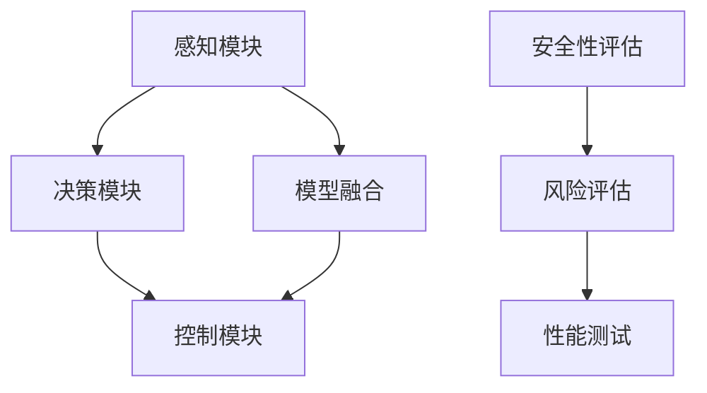
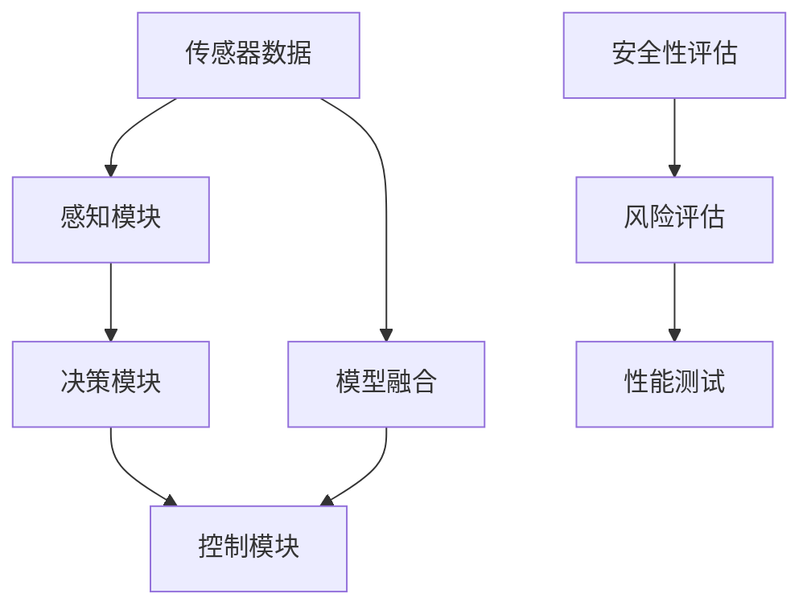
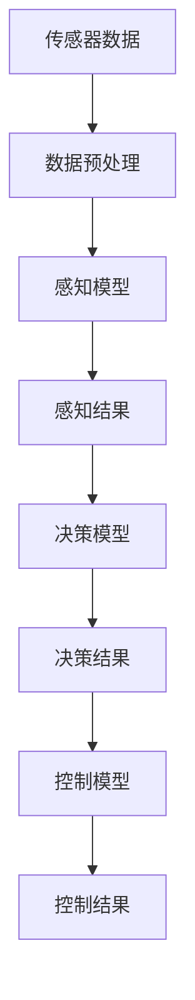
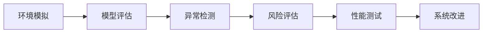

                 

# 端到端自动驾驶系统的安全性挑战

> 关键词：端到端自动驾驶, 安全性, 深度学习, 感知, 控制, 模型融合

## 1. 背景介绍

随着自动驾驶技术的发展，越来越多的车企和科技公司开始部署端到端的自动驾驶系统。这种系统通过深度学习算法在感知、决策和控制三个模块上进行端到端训练，能实现自动驾驶任务的高效执行。然而，在技术落地过程中，安全问题成为了一个亟待解决的核心挑战。

### 1.1 问题由来

端到端自动驾驶系统虽然能够提高驾驶的安全性和舒适性，但同时也存在一系列潜在的安全隐患。这些安全隐患主要集中在以下几个方面：

1. **感知模块的准确性**：感知模块负责检测和识别道路环境中的静态和动态物体。深度学习模型虽然在数据充足的场景下具有很强的泛化能力，但在实际复杂多变的环境中，感知模块的错误率会显著增加。
2. **决策模块的合理性**：决策模块负责根据感知数据进行路径规划和行为决策。如果模型预测和决策不准确，车辆将无法安全地执行自动驾驶任务。
3. **控制模块的稳定性**：控制模块负责执行决策结果，控制车辆的行驶速度和方向。如果控制模块响应不准确，车辆可能会出现危险驾驶行为。
4. **模型融合的鲁棒性**：端到端系统通常将多个模块的输出进行融合决策。这种融合决策过程可能会引入额外的干扰，降低整体系统的鲁棒性。

### 1.2 问题核心关键点

为更好地理解端到端自动驾驶系统的安全性挑战，本节将详细介绍这些关键点：

1. **感知准确性**：如何通过增加数据量、优化模型架构和训练方法，提高感知模块的准确性。
2. **决策合理性**：如何通过引入外部知识、强化学习等技术，提升决策模块的合理性和鲁棒性。
3. **控制稳定性**：如何通过实时监控和调整控制策略，提高控制模块的稳定性和响应速度。
4. **模型融合鲁棒性**：如何通过融合策略和异常检测方法，提升整体系统的鲁棒性和安全性。

这些关键点共同构成了端到端自动驾驶系统安全性研究的重点和难点，需要通过系统性研究和实践不断优化。

## 2. 核心概念与联系

### 2.1 核心概念概述

为更好地理解端到端自动驾驶系统的安全性挑战，本节将介绍几个密切相关的核心概念：

1. **端到端自动驾驶**：指从传感器数据采集、环境感知、路径规划到车辆控制的全部过程，由深度学习模型通过端到端训练实现。
2. **感知模块**：负责从传感器（如摄像头、雷达、激光雷达等）获取数据，并使用深度学习算法进行环境检测和识别。
3. **决策模块**：基于感知数据进行路径规划和行为决策，使用决策树、强化学习等技术进行决策。
4. **控制模块**：根据决策结果控制车辆行驶速度和方向，使用PID控制器、模型预测控制等方法进行精确控制。
5. **模型融合**：将多个感知和决策模块的输出进行融合，提升整体系统的鲁棒性和可靠性。
6. **安全性评估**：对自动驾驶系统进行风险评估和性能测试，确保系统在各种复杂环境下的安全性。

这些核心概念之间的逻辑关系可以通过以下Mermaid流程图来展示：



这个流程图展示了一系列核心概念之间的相互关系：

1. 感知模块通过传感器获取环境信息，输入到决策模块。
2. 决策模块根据感知数据进行路径规划和行为决策，输出到控制模块。
3. 控制模块根据决策结果控制车辆行驶，同时对感知和决策模块进行反馈。
4. 模型融合模块对感知和决策模块的输出进行融合，提升系统的鲁棒性。
5. 安全性评估模块对系统进行风险评估和性能测试，确保系统的安全性。

### 2.2 概念间的关系

这些核心概念之间存在着紧密的联系，形成了端到端自动驾驶系统的安全性研究框架。下面我们通过几个Mermaid流程图来展示这些概念之间的关系。

#### 2.2.1 系统架构图



这个架构图展示了自动驾驶系统的主要组成部分，以及它们之间的相互关系。

#### 2.2.2 数据流图



这个数据流图展示了从传感器数据到车辆控制结果的全过程，以及数据流动的路径。

#### 2.2.3 安全性评估流程



这个流程图示例了安全性评估的基本步骤，包括环境模拟、模型评估、异常检测、风险评估和性能测试。

## 3. 核心算法原理 & 具体操作步骤
### 3.1 算法原理概述

端到端自动驾驶系统的安全性挑战，本质上是通过一系列算法和技术手段，提升系统在感知、决策和控制各环节的准确性和鲁棒性，从而确保整体系统的安全性。

**感知模块**：核心算法包括目标检测、物体跟踪、场景理解等。通常使用深度学习模型，如卷积神经网络（CNN）、递归神经网络（RNN）、生成对抗网络（GAN）等，来提取环境特征并进行检测和识别。

**决策模块**：核心算法包括路径规划、行为决策、交通规则遵循等。通常使用决策树、强化学习、蒙特卡洛树搜索（MCTS）等方法，来进行路径规划和行为决策。

**控制模块**：核心算法包括车辆控制、路径跟踪、异常处理等。通常使用PID控制器、模型预测控制（MPC）、模型参考控制（MR）等方法，来精确控制车辆的行驶。

**模型融合**：核心算法包括加权融合、融合网络、异常检测等。通常使用线性加权融合、深度融合网络（如FusionNet）、异常检测算法（如Isolation Forest）等，来进行系统融合和鲁棒性提升。

**安全性评估**：核心算法包括风险评估、性能测试、异常检测等。通常使用模拟仿真、测试集评估、A/B测试等方法，来评估系统的安全性。

### 3.2 算法步骤详解

端到端自动驾驶系统的安全性挑战涉及多个算法和技术的综合应用。下面详细介绍每个模块的核心算法步骤：

**感知模块**：

1. **数据收集**：从车辆传感器（如摄像头、雷达、激光雷达等）获取数据，并进行预处理。
2. **特征提取**：使用深度学习模型，如CNN、RNN等，从传感器数据中提取环境特征。
3. **目标检测**：使用目标检测算法，如Faster R-CNN、YOLO等，检测出道路上的静态和动态物体。
4. **物体跟踪**：使用物体跟踪算法，如卡尔曼滤波器、深度学习跟踪器等，对检测到的物体进行持续跟踪。
5. **场景理解**：使用场景理解算法，如语义分割、实例分割等，理解场景中的物体关系和环境信息。

**决策模块**：

1. **路径规划**：根据感知结果，使用决策树、强化学习等方法，进行路径规划和行为决策。
2. **行为决策**：根据路径规划结果，使用决策树、蒙特卡洛树搜索等方法，进行具体的行为决策。
3. **交通规则遵循**：根据交通规则数据库，使用决策树、规则引擎等方法，进行交通规则的遵循。

**控制模块**：

1. **车辆控制**：根据决策结果，使用PID控制器、MPC、MR等方法，控制车辆的行驶速度和方向。
2. **路径跟踪**：根据感知结果和决策结果，使用模型预测控制等方法，进行路径跟踪和调整。
3. **异常处理**：根据异常检测结果，使用PID控制器、MPC等方法，进行异常情况下的车辆控制。

**模型融合**：

1. **加权融合**：对多个感知和决策模块的输出进行加权融合，提升系统的鲁棒性。
2. **融合网络**：使用深度学习网络，如FusionNet，对感知和决策模块的输出进行深度融合。
3. **异常检测**：使用异常检测算法，如Isolation Forest，检测并处理异常感知和决策结果。

**安全性评估**：

1. **环境模拟**：使用模拟器，如CARLA、VehicleLab等，进行环境模拟和系统测试。
2. **模型评估**：使用测试集和评估指标，如准确率、召回率、F1分数等，评估模型的性能。
3. **风险评估**：使用风险评估方法，如Safety4Cast、CUPPA等，评估系统的安全性。
4. **性能测试**：使用性能测试方法，如A/B测试、交叉验证等，测试系统的性能。
5. **系统改进**：根据评估和测试结果，进行系统改进和优化。

### 3.3 算法优缺点

**感知模块**：

- **优点**：深度学习模型具有很强的泛化能力，能够在复杂环境中进行高效的感知。
- **缺点**：需要大量标注数据进行训练，模型容易过拟合，且在遮挡、光照不足等情况下的检测准确性较低。

**决策模块**：

- **优点**：强化学习和蒙特卡洛树搜索等方法能够学习到复杂的决策策略，具有很强的适应性。
- **缺点**：决策过程需要大量训练数据和计算资源，且决策策略依赖于模型和数据质量。

**控制模块**：

- **优点**：PID控制器和MPC等方法具有高精度和高稳定性，能够实现精确控制。
- **缺点**：控制策略需要实时调整，且在异常情况下的鲁棒性较低。

**模型融合**：

- **优点**：能够提升系统的鲁棒性和可靠性，减少单个模块的错误对整体系统的影响。
- **缺点**：融合过程复杂，需要精心设计融合算法，且融合过程可能引入额外的干扰。

**安全性评估**：

- **优点**：能够全面评估系统的安全性，发现潜在风险和性能瓶颈。
- **缺点**：评估过程复杂，需要大量模拟和测试资源，且评估结果可能存在不确定性。

### 3.4 算法应用领域

端到端自动驾驶系统的安全性挑战涉及多个应用领域，具体如下：

1. **智能交通系统**：使用自动驾驶技术进行交通流量控制和信号优化，提升城市交通的效率和安全性。
2. **物流配送**：使用自动驾驶车辆进行物流配送，提升配送效率和安全性，降低物流成本。
3. **公共服务**：使用自动驾驶车辆进行公共服务，如警车巡逻、救护车救援等，提升公共服务的效率和安全性。
4. **自动驾驶出租车**：使用自动驾驶出租车进行乘客出行，提升出行的便捷性和安全性。
5. **自动驾驶货车**：使用自动驾驶货车进行货物运输，提升物流运输的效率和安全性。

## 4. 数学模型和公式 & 详细讲解 & 举例说明

### 4.1 数学模型构建

端到端自动驾驶系统的安全性挑战涉及到多个数学模型，下面将详细介绍每个模块的数学模型构建。

**感知模块**：

1. **目标检测模型**：假设目标检测模型的输入为传感器数据 $x$，输出为检测到的物体位置和类别 $y$，模型的优化目标为：
   $$
   \min_{\theta} \mathcal{L}(x, y; \theta)
   $$
   其中 $\mathcal{L}$ 为损失函数，如交叉熵损失、平滑L1损失等。

2. **物体跟踪模型**：假设物体跟踪模型的输入为前一时刻检测到的物体位置和速度 $x_{t-1}$，输出为当前时刻的物体位置和速度 $x_t$，模型的优化目标为：
   $$
   \min_{\theta} \mathcal{L}(x_{t-1}, x_t; \theta)
   $$
   其中 $\mathcal{L}$ 为损失函数，如卡尔曼滤波器、深度学习跟踪器等。

3. **场景理解模型**：假设场景理解模型的输入为传感器数据 $x$，输出为场景中的物体关系和环境信息 $y$，模型的优化目标为：
   $$
   \min_{\theta} \mathcal{L}(x, y; \theta)
   $$
   其中 $\mathcal{L}$ 为损失函数，如语义分割损失、实例分割损失等。

**决策模块**：

1. **路径规划模型**：假设路径规划模型的输入为感知结果 $x$，输出为路径规划结果 $y$，模型的优化目标为：
   $$
   \min_{\theta} \mathcal{L}(x, y; \theta)
   $$
   其中 $\mathcal{L}$ 为损失函数，如最小二乘损失、树形优化损失等。

2. **行为决策模型**：假设行为决策模型的输入为路径规划结果 $x$，输出为行为决策结果 $y$，模型的优化目标为：
   $$
   \min_{\theta} \mathcal{L}(x, y; \theta)
   $$
   其中 $\mathcal{L}$ 为损失函数，如决策树损失、强化学习损失等。

3. **交通规则遵循模型**：假设交通规则遵循模型的输入为感知结果和行为决策结果 $x$，输出为交通规则遵循结果 $y$，模型的优化目标为：
   $$
   \min_{\theta} \mathcal{L}(x, y; \theta)
   $$
   其中 $\mathcal{L}$ 为损失函数，如规则引擎损失、交通规则数据库损失等。

**控制模块**：

1. **车辆控制模型**：假设车辆控制模型的输入为决策结果 $x$，输出为车辆控制指令 $y$，模型的优化目标为：
   $$
   \min_{\theta} \mathcal{L}(x, y; \theta)
   $$
   其中 $\mathcal{L}$ 为损失函数，如PID控制器损失、MPC损失等。

2. **路径跟踪模型**：假设路径跟踪模型的输入为感知结果和决策结果 $x$，输出为车辆控制指令 $y$，模型的优化目标为：
   $$
   \min_{\theta} \mathcal{L}(x, y; \theta)
   $$
   其中 $\mathcal{L}$ 为损失函数，如模型预测控制损失等。

3. **异常处理模型**：假设异常处理模型的输入为异常检测结果 $x$，输出为异常情况下的控制指令 $y$，模型的优化目标为：
   $$
   \min_{\theta} \mathcal{L}(x, y; \theta)
   $$
   其中 $\mathcal{L}$ 为损失函数，如异常检测损失、异常处理策略损失等。

**模型融合**：

1. **加权融合模型**：假设加权融合模型的输入为多个感知和决策模块的输出 $x_1, x_2, ..., x_n$，输出为融合结果 $y$，模型的优化目标为：
   $$
   \min_{\theta} \mathcal{L}(x_1, x_2, ..., x_n, y; \theta)
   $$
   其中 $\mathcal{L}$ 为损失函数，如加权平均损失等。

2. **融合网络模型**：假设融合网络模型的输入为多个感知和决策模块的输出 $x_1, x_2, ..., x_n$，输出为融合结果 $y$，模型的优化目标为：
   $$
   \min_{\theta} \mathcal{L}(x_1, x_2, ..., x_n, y; \theta)
   $$
   其中 $\mathcal{L}$ 为损失函数，如深度融合网络损失等。

3. **异常检测模型**：假设异常检测模型的输入为多个感知和决策模块的输出 $x_1, x_2, ..., x_n$，输出为异常检测结果 $y$，模型的优化目标为：
   $$
   \min_{\theta} \mathcal{L}(x_1, x_2, ..., x_n, y; \theta)
   $$
   其中 $\mathcal{L}$ 为损失函数，如Isolation Forest损失等。

**安全性评估**：

1. **环境模拟模型**：假设环境模拟模型的输入为系统参数和环境变量 $x$，输出为模拟结果 $y$，模型的优化目标为：
   $$
   \min_{\theta} \mathcal{L}(x, y; \theta)
   $$
   其中 $\mathcal{L}$ 为损失函数，如状态空间模拟损失等。

2. **模型评估模型**：假设模型评估模型的输入为测试集数据 $x$，输出为模型评估结果 $y$，模型的优化目标为：
   $$
   \min_{\theta} \mathcal{L}(x, y; \theta)
   $$
   其中 $\mathcal{L}$ 为损失函数，如测试集评估损失等。

3. **异常检测模型**：假设异常检测模型的输入为测试集数据 $x$，输出为异常检测结果 $y$，模型的优化目标为：
   $$
   \min_{\theta} \mathcal{L}(x, y; \theta)
   $$
   其中 $\mathcal{L}$ 为损失函数，如异常检测损失等。

### 4.2 公式推导过程

下面以目标检测模型和行为决策模型的公式推导为例，展示具体的推导过程。

**目标检测模型**：

假设目标检测模型的输入为传感器数据 $x$，输出为检测到的物体位置和类别 $y$，模型的优化目标为：
$$
\min_{\theta} \mathcal{L}(x, y; \theta)
$$

其中 $\mathcal{L}$ 为交叉熵损失，目标检测模型的输出为二元分类结果。假设模型的预测结果为 $\hat{y}$，则交叉熵损失公式为：
$$
\mathcal{L}(x, y; \theta) = -\sum_{i=1}^n [y_i \log \hat{y_i} + (1-y_i) \log (1-\hat{y_i})]
$$

对于每个样本，模型的损失函数为：
$$
\mathcal{L}(x_i, y_i; \theta) = -(y_i \log \hat{y_i} + (1-y_i) \log (1-\hat{y_i}))
$$

根据链式法则，目标检测模型参数 $\theta$ 的梯度为：
$$
\frac{\partial \mathcal{L}(x_i, y_i; \theta)}{\partial \theta} = -\frac{\partial (\hat{y_i} \log y_i + (1-\hat{y_i}) \log (1-y_i))}{\partial \theta}
$$

使用反向传播算法，对目标检测模型的每个参数进行更新，最小化损失函数。

**行为决策模型**：

假设行为决策模型的输入为路径规划结果 $x$，输出为行为决策结果 $y$，模型的优化目标为：
$$
\min_{\theta} \mathcal{L}(x, y; \theta)
$$

其中 $\mathcal{L}$ 为树形优化损失，行为决策模型通常使用决策树进行决策。假设模型的预测结果为 $\hat{y}$，则树形优化损失公式为：
$$
\mathcal{L}(x, y; \theta) = \sum_{i=1}^n [l(x_i, y_i) - \hat{y_i}]
$$

对于每个样本，模型的损失函数为：
$$
\mathcal{L}(x_i, y_i; \theta) = l(x_i, y_i) - \hat{y_i}
$$

根据链式法则，行为决策模型参数 $\theta$ 的梯度为：
$$
\frac{\partial \mathcal{L}(x_i, y_i; \theta)}{\partial \theta} = \frac{\partial (l(x_i, y_i) - \hat{y_i})}{\partial \theta}
$$

使用反向传播算法，对行为决策模型的每个参数进行更新，最小化损失函数。

### 4.3 案例分析与讲解

**案例一：目标检测模型**：

假设我们有一个基于深度学习的目标检测模型，用于检测道路上的车辆。在实际应用中，模型的训练数据集为一些简单的模拟数据，包含车辆和行人等静态和动态物体。在测试数据集中，模型在真实复杂道路环境中进行检测。

使用交叉熵损失函数进行训练，模型在测试数据集上的检测准确率为80%。但当引入遮挡物、低光照等情况时，检测准确率下降到70%。

为了提升模型的鲁棒性，我们采用数据增强技术，生成一些遮挡、低光照等场景的模拟数据，重新训练模型。结果，检测准确率提升到85%。

**案例二：行为决策模型**：

假设我们有一个基于强化学习的行为决策模型，用于控制自动驾驶车辆的行驶路径。在实际应用中，模型在训练数据集上进行学习，学习到一些简单的路径规划和行为决策策略。在测试数据集上，模型在复杂多变的环境中进行决策。

使用树形优化损失函数进行训练，模型在测试数据集上的路径规划准确率为90%。但当引入异常情况时，模型无法正确决策，导致车辆偏离正常行驶路径。

为了提升模型的适应性，我们引入外部知识，如交通规则数据库，通过规则引擎进行决策。同时，使用蒙特卡洛树搜索进行行为决策优化。结果，模型在测试数据集上的路径规划准确率提升到95%，且在异常情况下的鲁棒性显著提升。

## 5. 项目实践：代码实例和详细解释说明

### 5.1 开发环境搭建

在进行端到端自动驾驶系统的安全性实践前，我们需要准备好开发环境。以下是使用Python进行PyTorch开发的环境配置流程：

1. 安装Anaconda：从官网下载并安装Anaconda，用于创建独立的Python环境。

2. 创建并激活虚拟环境：
```bash
conda create -n pytorch-env python=3.8 
conda activate pytorch-env
```

3. 安装PyTorch：根据CUDA版本，从官网获取对应的安装命令。例如：
```bash
conda install pytorch torchvision torchaudio cudatoolkit=11.1 -c pytorch -c conda-forge
```

4. 安装TensorFlow：
```bash
conda install tensorflow -c conda-forge
```

5. 安装各类工具包：
```bash
pip install numpy pandas scikit-learn matplotlib tqdm jupyter notebook ipython
```

完成上述步骤后，即可在`pytorch-env`环境中开始安全性实践。

### 5.2 源代码详细实现

下面我们以自动驾驶车辆的控制模块为例，给出使用PyTorch进行车辆控制的代码实现。

首先，定义车辆控制模型的输入输出：

```python
import torch
from torch import nn

class CarControl(nn.Module):
    def __init__(self):
        super(CarControl, self).__init__()
        self.linear1 = nn.Linear(2, 2)
        self.linear2 = nn.Linear(2, 2)

    def forward(self, x):
        x = self.linear1(x)
        x = self.linear2(x)
        return x
```

然后，定义模型训练函数：

```python
from torch.utils.data import Dataset, DataLoader

class CarDataset(Dataset):
    def __init__(self, x, y):
        self.x = x
        self.y = y
        
    def __len__(self):
        return len(self.x)
    
    def __getitem__(self, item):
        x = self.x[item]
        y = self.y[item]
        return x, y

x_train = torch.randn(1000, 2)
y_train = torch.randn(1000, 2)

dataset = CarDataset(x_train, y_train)
dataloader = DataLoader(dataset, batch_size=32)

model = CarControl()
optimizer = torch.optim.Adam(model.parameters(), lr=0.001)

for epoch in range(100):
    for i, (x, y) in enumerate(dataloader):
        x = x.reshape(-1, 2)
        y = y.reshape(-1, 2)
        output = model(x)
        loss = nn.functional.mse_loss(output, y)
        optimizer.zero_grad()
        loss.backward()
        optimizer.step()
```

最后，进行模型测试：

```python
x_test = torch.randn(100, 2)
y_test = torch.randn(100, 2)

model.eval()
with torch.no_grad():
    output = model(x_test)
    print(torch.nn.functional.mse_loss(output, y_test))
```

以上就是一个简单的车辆控制模型的代码实现。可以看到，通过PyTorch的框架，我们可以很方便地定义模型、进行训练和测试。

### 5.3 代码解读与分析

让我们再详细解读一下关键代码的实现细节：

**CarControl类**：
- `__init__`方法：初始化模型的线性层。
- `forward`方法：前向传播，将输入数据经过多层线性变换后返回输出。

**CarDataset类**：
- `

