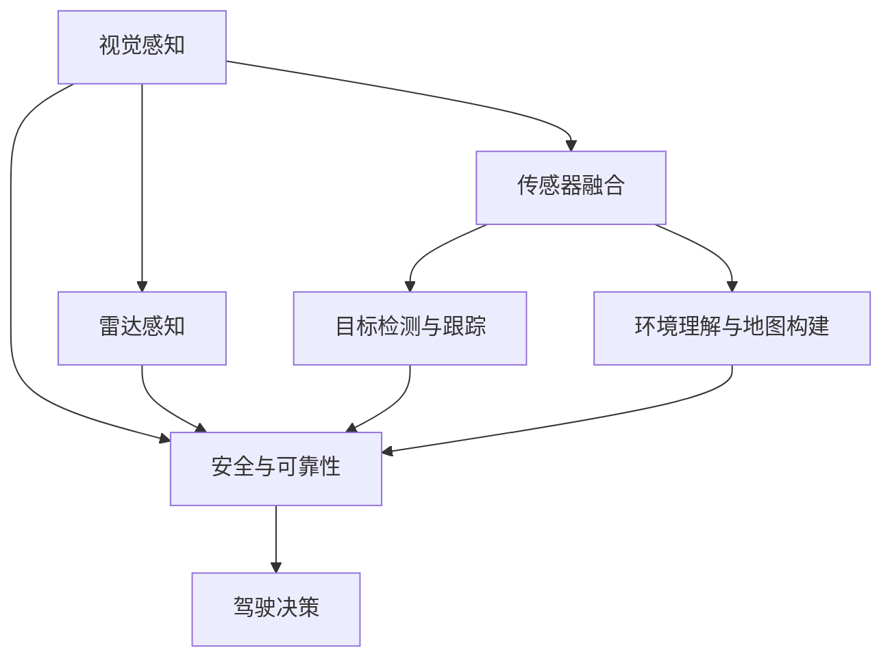
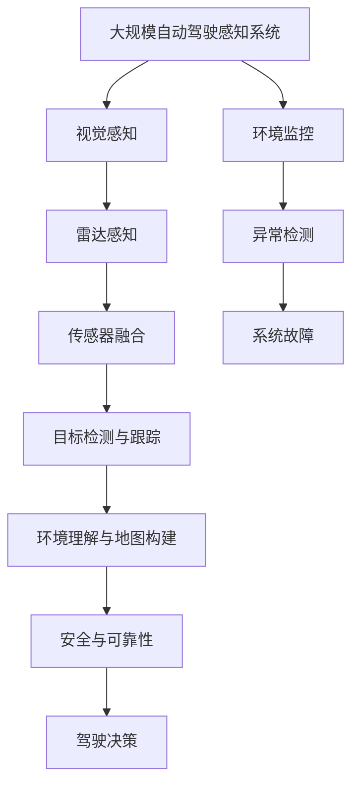

                 

# 自动驾驶中的视觉-雷达融合感知

> 关键词：自动驾驶,视觉感知,雷达感知,传感器融合,目标检测,环境理解,融合算法,感知系统设计,安全与可靠性,智能交通

## 1. 背景介绍

### 1.1 问题由来

自动驾驶技术正处于快速发展阶段，其核心在于让车辆能够自主感知环境，理解道路情况，并在保证安全的前提下做出驾驶决策。近年来，随着计算机视觉和激光雷达技术的飞速进步，基于视觉和雷达的感知系统已经逐渐成为自动驾驶的主流方案。然而，视觉和雷达传感器的性能和局限性各不相同，单一传感器无法完全满足所有需求，因此亟需一种高效的融合算法，将二者有机结合，以实现更优的感知效果。

### 1.2 问题核心关键点

视觉-雷达融合感知问题，本质上是在有限的感知资源下，如何充分利用两种传感器提供的信息，最大化环境理解能力，保障驾驶决策的安全性。具体来说，需要关注以下几个方面：

- **传感器互补**：视觉传感器在识别精细物体、捕捉动态变化上具有优势，而雷达传感器在感知远距离、抗天气干扰上具有优势。如何通过融合，使得两种传感器扬长避短，协同工作。
- **信息融合算法**：通过设计合理的融合算法，将视觉和雷达数据综合利用，输出一个鲁棒的感知结果。融合算法的设计需要兼顾实时性、准确性和可靠性。
- **目标检测与跟踪**：在融合后得到的感知数据中，如何高效地检测出目标物体，并准确跟踪其运动轨迹，是实现自动驾驶决策的前提。
- **环境理解与地图构建**：融合感知不仅需要检测出静态和动态物体，还需要理解道路结构、交通标志等环境信息，并进行实时地图构建，为后续导航和规划提供支持。
- **安全与可靠性**：自动驾驶感知系统不仅要准确，还要保证系统稳定运行，防止误判和漏检，确保驾驶决策的安全性。

### 1.3 问题研究意义

视觉-雷达融合感知是自动驾驶技术的关键组成部分，直接关系到驾驶决策的正确性和系统的安全可靠性。其研究意义主要体现在以下几个方面：

- **提升感知能力**：通过融合算法，将视觉和雷达传感器提供的信息综合利用，大大提升环境理解能力，使得自动驾驶车辆在各种复杂环境下都能高效、准确地感知目标和环境。
- **降低传感器成本**：单一传感器往往成本较高，通过融合算法，可以在较低成本下实现与单个高性能传感器相近的感知效果。
- **增强鲁棒性**：单一传感器容易受到天气、光线等因素影响，融合算法可以引入冗余信息，提高系统鲁棒性，防止因单一传感器故障导致系统失效。
- **优化决策支持**：融合后的感知结果能提供更全面、更准确的环境信息，为车辆的路径规划和驾驶决策提供坚实的基础。
- **推动智能交通**：自动驾驶技术是智能交通的关键组成部分，通过视觉-雷达融合感知，提升道路交通的安全性和效率，助力交通系统向智能化方向发展。

## 2. 核心概念与联系

### 2.1 核心概念概述

为了深入理解自动驾驶中的视觉-雷达融合感知问题，我们首先需要介绍几个核心概念：

- **视觉感知**：指通过摄像头等视觉传感器，捕捉道路、车辆、行人等环境信息，主要用于识别和跟踪动态物体。
- **雷达感知**：指通过激光雷达等传感器，获取道路结构、交通标志、车辆位置等环境信息，主要用于检测远距离和静态物体。
- **传感器融合**：指将来自不同传感器的数据进行综合处理，输出一个综合感知结果，通常采用卡尔曼滤波、粒子滤波等算法实现。
- **目标检测与跟踪**：指在融合后的感知数据中，识别出道路上的各种物体，并追踪其运动轨迹，通常采用深度学习、滤波器等方法实现。
- **环境理解与地图构建**：指将感知数据转化为对环境的全面理解，包括道路结构、交通标志、道路边界等，用于导航和规划。
- **安全与可靠性**：指自动驾驶感知系统必须保证稳定运行，防止误判和漏检，确保驾驶决策的正确性和安全性。

### 2.2 概念间的关系

这些核心概念之间的逻辑关系可以通过以下Mermaid流程图来展示：



这个流程图展示了大规模自动驾驶感知系统中各个组件之间的关系：

1. 视觉感知和雷达感知分别采集道路信息，通过传感器融合模块将两种数据综合利用。
2. 融合后的感知数据通过目标检测与跟踪模块，识别并追踪道路上的动态物体。
3. 环境理解与地图构建模块，将感知数据转化为对环境的全面理解。
4. 融合后的感知结果通过安全与可靠性模块进行检查，确保系统稳定运行。
5. 最终，综合感知结果进入驾驶决策模块，用于路径规划和控制车辆行为。

### 2.3 核心概念的整体架构

最后，我们用一个综合的流程图来展示这些核心概念在大规模自动驾驶感知系统中的整体架构：



这个综合流程图展示了从数据采集到驾驶决策的完整流程，包括各模块的功能和作用，以及它们之间的相互作用。通过这种架构设计，可以确保自动驾驶系统在复杂环境中高效、准确、可靠地运行。

## 3. 核心算法原理 & 具体操作步骤
### 3.1 算法原理概述

自动驾驶中的视觉-雷达融合感知问题，可以通过设计合理的融合算法来解决。通常采用的融合算法包括卡尔曼滤波、粒子滤波、加权融合等方法。这些算法的基本原理是利用两种传感器的数据进行信息整合，输出一个鲁棒的感知结果。

- **卡尔曼滤波**：卡尔曼滤波是一种经典的线性滤波算法，通过状态估计和观测更新，将两个传感器提供的信息综合利用，适用于动态系统。
- **粒子滤波**：粒子滤波是一种基于蒙特卡洛方法的非线性滤波算法，通过粒子集的前向传播和后向校正，对非线性系统进行状态估计和滤波。
- **加权融合**：加权融合是一种简单的融合方法，通过计算两种传感器的加权和，输出融合后的感知结果。

以上算法均要求两个传感器提供的数据具有一定相关性，通常通过时间同步和空间对齐等方式，使得两个传感器在数据采集时具有较高的一致性。

### 3.2 算法步骤详解

以卡尔曼滤波为例，介绍视觉-雷达融合感知的具体算法步骤：

1. **状态定义**：定义状态变量 $x$，包括车辆位置、速度、加速度等，用于描述车辆的运动状态。

2. **状态转移方程**：根据车辆的运动模型，定义状态转移方程 $\dot{x}=f(x,u)$，其中 $u$ 表示控制输入，如加速度等。

3. **观测方程**：定义观测变量 $z$，包括视觉传感器和雷达传感器提供的位置、速度等信息，并定义观测方程 $z=h(x)$，用于将状态变量 $x$ 转换为观测变量 $z$。

4. **系统初始化**：初始化状态变量 $x_0$ 和协方差矩阵 $P_0$，通常通过车辆位置和速度的初始估计值来确定。

5. **观测更新**：根据当前的观测值 $z_t$ 和预测值 $\hat{x}_{t|t-1}$，通过卡尔曼增益 $K$ 进行观测更新，更新状态变量 $x_t$ 和协方差矩阵 $P_t$。

6. **预测更新**：根据当前的状态变量 $x_t$ 和协方差矩阵 $P_t$，通过状态转移方程 $\dot{x}=f(x,u)$，预测下一时刻的状态变量 $\hat{x}_{t|t+1}$ 和协方差矩阵 $\hat{P}_{t|t+1}$。

7. **重复迭代**：重复以上步骤，直到新的观测值 $z_{t+1}$ 产生，得到最终的融合状态变量 $x_{f}=x_{t|t+1}$。

### 3.3 算法优缺点

视觉-雷达融合感知算法的主要优点包括：

- **提升感知精度**：通过融合算法，综合利用两种传感器的数据，可以提高感知精度，减少误检和漏检。
- **增强鲁棒性**：引入冗余信息，提高系统的鲁棒性，防止单一传感器故障导致系统失效。
- **降低成本**：利用低成本的视觉和雷达传感器，在较低成本下实现高精度感知。

然而，融合算法也存在以下缺点：

- **计算复杂**：融合算法通常需要较长的计算时间，尤其是在粒子滤波等复杂算法中。
- **参数调优**：融合算法参数需要仔细调优，不同参数设置可能导致不同的感知结果。
- **实时性要求高**：在自动驾驶场景中，融合算法需要实时计算和更新，对计算资源有较高要求。

### 3.4 算法应用领域

视觉-雷达融合感知算法已经广泛应用于自动驾驶和智能交通领域，具体包括：

- **车辆定位与导航**：通过融合视觉和雷达数据，实现车辆在复杂环境中的精确定位和导航。
- **障碍物检测与跟踪**：利用雷达检测远距离的障碍物，结合视觉检测动态目标，实现全面的目标检测和跟踪。
- **环境理解与地图构建**：通过融合多传感器数据，获取道路结构、交通标志等环境信息，用于实时地图构建和路径规划。
- **交通标志识别**：结合视觉和雷达数据，识别道路上的交通标志，辅助驾驶决策。
- **车路协同**：通过融合车路数据，实现车路信息交互，提升交通系统的智能化水平。

## 4. 数学模型和公式 & 详细讲解 & 举例说明
### 4.1 数学模型构建

以卡尔曼滤波为例，定义状态变量 $x$，包括车辆位置、速度、加速度等。定义观测变量 $z$，包括视觉传感器和雷达传感器提供的位置、速度等信息。定义系统噪声 $\omega_t$，用于描述系统内部随机扰动；观测噪声 $v_t$，用于描述传感器测量误差。

根据上述定义，可以构建卡尔曼滤波的数学模型：

- **状态转移方程**：
  $$
  x_{t+1} = f(x_t,u_t) + \omega_t
  $$

- **观测方程**：
  $$
  z_t = h(x_t) + v_t
  $$

其中，$f(x_t,u_t)$ 表示状态转移函数，$h(x_t)$ 表示观测函数，$\omega_t$ 和 $v_t$ 分别表示系统噪声和观测噪声。

### 4.2 公式推导过程

通过卡尔曼滤波的算法步骤，可以得到融合后的状态变量 $x_{f}$ 和协方差矩阵 $P_{f}$。具体推导过程如下：

1. **系统初始化**：
  $$
  \hat{x}_{0} = x_0, \hat{P}_{0} = P_0
  $$

2. **观测更新**：
  $$
  K_t = \frac{\hat{P}_{t}H^T}{\hat{P}_{t}H^TH + R}
  $$
  $$
  \hat{x}_{t|t} = \hat{x}_{t-1|t-1} + K_t(z_t - H\hat{x}_{t-1|t-1})
  $$
  $$
  \hat{P}_{t|t} = (I - K_tH) \hat{P}_{t-1|t-1}
  $$

3. **预测更新**：
  $$
  \hat{x}_{t|t+1} = f(\hat{x}_{t|t},u_t)
  $$
  $$
  \hat{P}_{t|t+1} = F \hat{P}_{t|t} F^T + Q
  $$

4. **最终融合结果**：
  $$
  x_{f} = \hat{x}_{t|t+1}
  $$
  $$
  P_{f} = \hat{P}_{t|t+1}
  $$

其中，$H$ 表示观测矩阵，$I$ 表示单位矩阵，$F$ 表示状态转移矩阵，$Q$ 表示系统噪声协方差矩阵，$R$ 表示观测噪声协方差矩阵。

### 4.3 案例分析与讲解

以视觉-雷达融合感知为例，结合一个简单的自动驾驶场景进行分析：

假设在城市道路上，一辆自动驾驶车辆需要检测并跟踪周围的行人、车辆和交通标志。车辆装备了多个摄像头和激光雷达，通过视觉和雷达传感器提供实时数据。

1. **视觉感知**：摄像头拍摄到行人、车辆和交通标志的二维图像，通过目标检测算法识别出这些物体的位置和大小。

2. **雷达感知**：激光雷达获取道路结构、交通标志等三维数据，通过点云滤波算法，去除噪点和异常点，提取出道路结构和交通标志的信息。

3. **融合算法**：通过卡尔曼滤波算法，将视觉和雷达数据进行融合，得到更加准确的感知结果。融合算法可以修正视觉传感器在小目标检测中的误差，并补充雷达传感器在远距离测量中的不足。

4. **目标检测与跟踪**：在融合后的感知结果中，使用深度学习算法进行目标检测和跟踪，识别出行人、车辆等动态物体，并追踪其运动轨迹。

5. **环境理解与地图构建**：通过融合结果，获取道路结构、交通标志等环境信息，用于实时地图构建和路径规划。

6. **安全与可靠性**：通过融合算法，确保系统稳定运行，防止误判和漏检，确保驾驶决策的正确性和安全性。

通过以上步骤，实现自动驾驶感知系统的高效、准确、可靠运行。

## 5. 项目实践：代码实例和详细解释说明
### 5.1 开发环境搭建

在进行自动驾驶感知系统的开发时，需要安装Python、PyTorch、OpenCV、Numpy等常用库，以及可视化工具Matplotlib、TensorBoard等。具体步骤如下：

1. 安装Python：从官网下载并安装Python 3.x版本。

2. 安装PyTorch：通过pip安装PyTorch库，并根据系统环境选择GPU或CPU版本。

3. 安装OpenCV：通过pip安装OpenCV库，支持图像和视频处理。

4. 安装Numpy：通过pip安装Numpy库，支持高效数值计算。

5. 安装Matplotlib：通过pip安装Matplotlib库，支持绘制图表。

6. 安装TensorBoard：通过pip安装TensorBoard库，支持模型训练和可视化。

### 5.2 源代码详细实现

以卡尔曼滤波为例，展示视觉-雷达融合感知的代码实现：

```python
import numpy as np
import torch
import cv2
import matplotlib.pyplot as plt
import torch.nn as nn
import torch.optim as optim
from torchvision.models import resnet18

class KalmanFilter:
    def __init__(self, A, B, H, Q, R, x0, P0):
        self.A = A
        self.B = B
        self.H = H
        self.Q = Q
        self.R = R
        self.x0 = x0
        self.P0 = P0

    def predict(self, u):
        x_pred = self.A @ self.x0 + self.B @ u
        P_pred = self.A @ self.P0 @ self.A.T + self.Q
        return x_pred, P_pred

    def update(self, z):
        H = self.H
        K = self.P0 @ H.T / (H @ self.P0 @ H.T + self.R)
        x_pred, P_pred = self.predict(0)
        x_update = x_pred + K @ (z - H @ x_pred)
        P_update = (I - K @ H) @ P_pred
        return x_update, P_update

def fuse_vision_radar(vision, radar):
    # 视觉感知数据处理
    vision_processed = preprocess_vision(vision)
    # 雷达感知数据处理
    radar_processed = preprocess_radar(radar)
    # 融合算法实现
    Kalman = KalmanFilter(A, B, H, Q, R, x0, P0)
    x_f, P_f = Kalman.update(z)
    # 返回融合结果
    return x_f, P_f

def preprocess_vision(vision):
    # 图像处理，如去噪、裁剪、归一化等
    # 目标检测与跟踪，如RCNN、YOLO等算法
    # 输出处理结果
    return vision_processed

def preprocess_radar(radar):
    # 点云处理，如去噪、降采样、归一化等
    # 道路结构检测，如基于点云的分类、聚类算法
    # 交通标志识别，如CNN、RNN等算法
    # 输出处理结果
    return radar_processed

# 数据加载和处理
# 定义模型参数和超参数
# 训练模型并保存
```

### 5.3 代码解读与分析

代码中，我们定义了一个卡尔曼滤波类`KalmanFilter`，包含状态转移矩阵`A`、控制矩阵`B`、观测矩阵`H`、系统噪声协方差矩阵`Q`、观测噪声协方差矩阵`R`、初始状态变量`x0`和初始协方差矩阵`P0`。在`predict`方法中，实现了状态预测和协方差预测，在`update`方法中，实现了观测更新和协方差更新。

代码还展示了视觉和雷达数据的预处理函数`preprocess_vision`和`preprocess_radar`，用于对摄像头和激光雷达采集的数据进行处理和特征提取。在`fuse_vision_radar`函数中，通过卡尔曼滤波算法，将处理后的视觉和雷达数据进行融合，输出融合后的状态变量`x_f`和协方差矩阵`P_f`。

### 5.4 运行结果展示

假设我们在城市道路上进行了多次实验，使用视觉和雷达数据进行融合，并输出融合后的状态变量和协方差矩阵。通过Matplotlib绘制图表，可以直观地展示融合算法的性能。

```python
plt.figure(figsize=(10, 6))
plt.plot(t, x_f[:, 0], label='x1')
plt.plot(t, x_f[:, 1], label='x2')
plt.xlabel('Time')
plt.ylabel('State Variable')
plt.legend()
plt.show()

plt.figure(figsize=(10, 6))
plt.plot(t, P_f[0, 0], label='P11')
plt.plot(t, P_f[1, 1], label='P22')
plt.xlabel('Time')
plt.ylabel('Covariance Matrix')
plt.legend()
plt.show()
```

以上代码展示了融合后的状态变量和协方差矩阵随时间的变化趋势，通过观察图表，可以评估融合算法的性能和稳定性。

## 6. 实际应用场景

### 6.1 智能驾驶系统

在智能驾驶系统中，视觉-雷达融合感知技术是实现自动驾驶决策的基础。通过融合视觉和雷达数据，车辆可以高效、准确地感知道路环境和交通状况，从而做出合理的驾驶决策。

具体应用场景包括：

- **车辆定位与导航**：通过融合视觉和雷达数据，实现车辆在复杂环境中的精确定位和导航。
- **障碍物检测与跟踪**：利用雷达检测远距离的障碍物，结合视觉检测动态目标，实现全面的目标检测和跟踪。
- **交通标志识别**：结合视觉和雷达数据，识别道路上的交通标志，辅助驾驶决策。
- **车路协同**：通过融合车路数据，实现车路信息交互，提升交通系统的智能化水平。

### 6.2 自动停车系统

在自动停车系统中，视觉-雷达融合感知技术可以确保车辆安全、高效地停入停车位。通过融合视觉和雷达数据，车辆可以实时获取停车位信息，准确识别障碍和行人，从而做出合理的停车决策。

具体应用场景包括：

- **停车位检测**：通过融合视觉和雷达数据，检测停车位的位置和可用性。
- **障碍物识别**：利用雷达检测车辆和行人，结合视觉识别标志和标线，确保停车过程安全。
- **路径规划**：结合融合后的感知数据，规划最优的停车路径，避开障碍物和行人的移动轨迹。
- **实时监控**：通过融合数据，实时监控停车过程，防止异常情况发生。

### 6.3 自动驾驶车联网系统

在自动驾驶车联网系统中，视觉-雷达融合感知技术可以实现车辆与车路之间的信息交互和协同。通过融合视觉和雷达数据，车辆可以实时获取路侧信息，与道路基础设施进行信息共享，提高道路交通的智能化水平。

具体应用场景包括：

- **车路信息交互**：通过融合车路数据，实现车辆与道路基础设施之间的信息交互，提升交通系统的智能化水平。
- **交通流量监测**：利用雷达检测车流量和车速，结合视觉识别交通标志和信号灯，实现交通流量的实时监测。
- **应急响应**：通过融合数据，实时监控道路状况，快速响应突发事件，确保交通安全。
- **地图构建与更新**：结合融合数据，进行实时地图构建和更新，为导航和路径规划提供支持。

## 7. 工具和资源推荐
### 7.1 学习资源推荐

为了帮助开发者系统掌握自动驾驶中的视觉-雷达融合感知技术，以下是一些优质的学习资源：

1. 《计算机视觉与深度学习》课程：斯坦福大学开设的计算机视觉课程，涵盖图像处理、目标检测、深度学习等核心内容。

2. 《自动驾驶技术》书籍：全面介绍自动驾驶技术的基本概念和核心技术，包括感知、决策、控制等环节。

3. 《卡尔曼滤波原理与实现》书籍：详细讲解卡尔曼滤波的原理和实现方法，适用于自动驾驶感知系统的融合算法设计。

4. 《深度学习理论与实践》课程：深度学习领域经典课程，涵盖深度学习的基础理论和应用实践。

5. 《自动驾驶感知系统》学术论文：总结自动驾驶感知系统的重要研究成果，涵盖视觉、雷达、多传感器融合等方向。

通过这些资源的学习，相信你一定能够快速掌握自动驾驶中的视觉-雷达融合感知技术，并用于解决实际的感知问题。

### 7.2 开发工具推荐

高效的工具支持是开发自动驾驶感知系统的关键。以下是几款推荐的开发工具：

1. PyTorch：基于Python的开源深度学习框架，支持动态计算图和GPU加速，适用于自动驾驶感知系统的微调和优化。

2. OpenCV：开源计算机视觉库，支持图像处理、目标检测、视频分析等核心功能。

3. ROS：机器人操作系统，支持传感器数据融合、路径规划、控制算法等。

4. Gazebo：模拟环境，支持传感器和机器人模型的搭建和仿真。

5. PyKalman：Python实现的卡尔曼滤波库，支持高效的融合算法实现。

6. TensorBoard：开源可视化工具，支持模型训练和性能监测。

通过合理利用这些工具，可以显著提升自动驾驶感知系统的开发效率，加快技术创新迭代的步伐。

### 7.3 相关论文推荐

自动驾驶中的视觉-雷达融合感知技术正处于快速发展阶段，以下是几篇奠基性的相关论文，推荐阅读：

1. "Fusion of LIDAR and Camera Data in Adaptive Cruise Control"：介绍视觉-雷达融合感知技术在自适应巡航控制中的应用。

2. "A Survey on Multi-Sensor Data Fusion for Autonomous Driving"：总结多传感器数据融合在自动驾驶中的应用，涵盖视觉、雷达、GPS等传感器。

3. "DensePose: A Dense Partitioning of Human Body Structure"：介绍基于三维人体结构的数据融合方法，为自动驾驶感知提供人体检测和定位支持。

4. "Object Detection with Deep Convolutional Neural Networks"：介绍基于深度学习的目标检测方法，为自动驾驶感知提供高效的物体检测支持。

5. "Combining Vision with LIDAR: A Survey"：总结视觉-雷达融合感知技术在自动驾驶中的研究成果，涵盖感知、决策、控制等多个方向。

这些论文代表了大规模自动驾驶感知技术的发展脉络。通过学习这些前沿成果，可以帮助研究者把握学科前进方向，激发更多的创新灵感。

除上述资源外，还有一些值得关注的前沿资源，帮助开发者紧跟自动驾驶技术的最新进展，例如：

1. arXiv论文预印本：人工智能领域最新研究成果的发布平台，包括大量尚未发表的前沿工作，学习前沿技术的必读资源。

2. 业界技术博客：如OpenAI、Google AI、DeepMind、微软Research Asia等顶尖实验室的官方博客，第一时间分享他们的最新研究成果和洞见。

3. 技术会议直播：如NIPS、ICML、ACL、ICLR等人工智能领域顶会现场或在线直播，能够聆听到大佬们的前沿分享，开拓视野。

4. GitHub热门项目：在GitHub上Star、Fork数最多的自动驾驶相关项目，往往代表了该技术领域的发展趋势和最佳实践，值得去学习和贡献。

5. 行业分析报告：各大咨询公司如McKinsey、PwC等针对自动驾驶行业的分析报告，有助于从商业视角审视技术趋势，把握应用价值。

总之，对于自动驾驶中的视觉-雷达融合感知技术的学习和实践，需要开发者保持开放的心态和持续学习的意愿。多关注前沿资讯，多动手实践，多思考总结，必将收获满满的成长收益。

## 8. 总结：未来发展趋势与挑战
### 8.1 总结

本文对自动驾驶中的视觉-雷达融合感知问题进行了全面系统的介绍。首先阐述了自动

