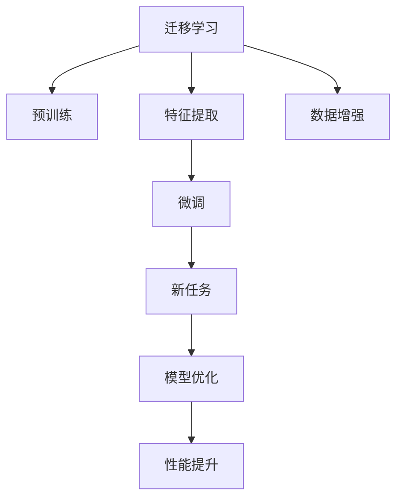
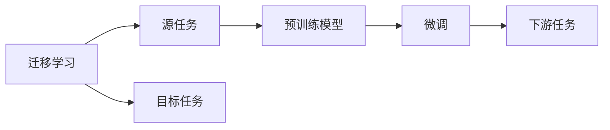
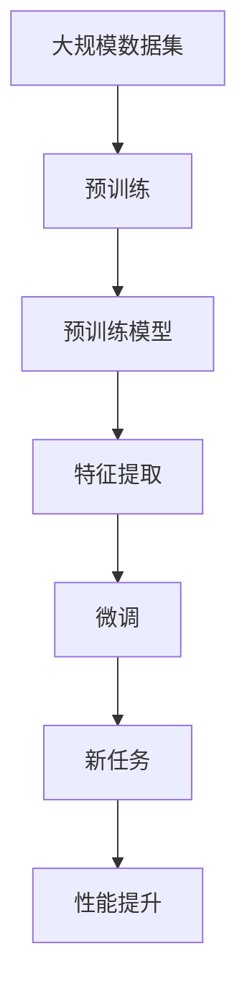

                 

# Transfer Learning原理与代码实例讲解

> 关键词：Transfer Learning, 迁移学习, 微调(Fine-tuning), 预训练, 特征提取, 代码实例, PyTorch

## 1. 背景介绍

### 1.1 问题由来

随着深度学习技术的发展，大规模数据集和强大计算资源的投入，使得预训练深度神经网络模型（如ResNet、Inception、BERT等）在计算机视觉、自然语言处理等领域取得了巨大的成功。然而，针对具体领域的任务，从头训练深度学习模型往往需要大量的标注数据、较长的训练时间、大量的计算资源，甚至可能面临数据不足、难以收集的问题。迁移学习（Transfer Learning）应运而生，通过利用预训练模型在某个大域上所学到的特征表示，快速适应新任务，实现更好的性能。

### 1.2 问题核心关键点

迁移学习的基本思想是通过利用预训练模型在某个大域上所学到的特征表示，快速适应新任务，实现更好的性能。其核心在于选择合适的预训练模型、合理的特征提取方式和微调策略。

具体来说，迁移学习主要包括以下几个关键点：
- **预训练模型**：使用大规模数据集预训练的深度学习模型，如BERT、ResNet等。
- **特征提取**：将预训练模型作为特征提取器，在新的任务上提取特征表示。
- **微调**：在提取的特征表示上，通过在有标签数据上训练的方式微调模型，使其在特定任务上性能更优。

迁移学习能够有效降低任务标注数据的需求，缩短模型训练时间，提高模型泛化能力。在NLP、计算机视觉、语音识别等多个领域，迁移学习已经得到了广泛应用，并在诸多任务上取得了领先于从头训练的性能。

### 1.3 问题研究意义

迁移学习在大规模深度学习模型中的应用，不仅降低了模型训练的成本和难度，而且显著提升了模型的泛化能力。特别是在数据稀缺、标注成本高昂的领域，迁移学习提供了更加高效、可行的解决方案。同时，迁移学习也为跨领域知识迁移、模型复用等提供了重要手段，推动了深度学习技术在更多领域的应用和普及。

## 2. 核心概念与联系

### 2.1 核心概念概述

为更好地理解迁移学习的基本原理，本节将介绍几个密切相关的核心概念：

- **迁移学习（Transfer Learning）**：利用在大规模数据集上预训练的深度学习模型，在新的任务上提取特征表示，通过微调来提升模型性能的过程。
- **预训练（Pre-training）**：在大规模数据集上，使用无监督学习任务训练深度学习模型，学习通用的特征表示的过程。
- **特征提取（Feature Extraction）**：将预训练模型作为特征提取器，将输入数据转换为模型内部的特征表示。
- **微调（Fine-tuning）**：在特征表示的基础上，使用有标签数据训练模型，使其在特定任务上表现更优的过程。

这些核心概念之间的逻辑关系可以通过以下Mermaid流程图来展示：



这个流程图展示了迁移学习的基本流程：

1. 使用大规模数据集预训练模型，学习通用的特征表示。
2. 提取预训练模型中的特征表示，用于新的任务。
3. 在有标签数据上微调模型，使其在特定任务上表现更优。
4. 使用数据增强技术，进一步提高模型泛化能力。
5. 优化模型参数，提升模型在新任务上的性能。

### 2.2 概念间的关系

这些核心概念之间存在着紧密的联系，形成了迁移学习的完整生态系统。下面我们通过几个Mermaid流程图来展示这些概念之间的关系。

#### 2.2.1 迁移学习的基本流程


这个流程图展示了迁移学习的基本流程：

1. 预训练模型学习通用的特征表示。
2. 特征提取器提取预训练模型的特征表示。
3. 微调模型，使其在特定任务上表现更优。
4. 新任务利用微调后的模型进行推理。

#### 2.2.2 迁移学习与微调的关系



这个流程图展示了迁移学习与微调的关系：

1. 迁移学习涉及源任务和目标任务。
2. 预训练模型在源任务上学习。
3. 通过微调，适应新的目标任务。
4. 微调后的模型用于下游任务的推理。

#### 2.2.3 特征提取与微调的应用


这个流程图展示了特征提取与微调的应用：

1. 特征提取器使用预训练模型提取特征。
2. 特征表示作为微调的输入。
3. 微调模型，使其在特定任务上表现更优。

### 2.3 核心概念的整体架构

最后，我们用一个综合的流程图来展示这些核心概念在大模型微调过程中的整体架构：



这个综合流程图展示了从预训练到微调，再到性能提升的完整过程。预训练模型通过在大规模数据集上学习通用的特征表示，经过特征提取和微调，在新任务上实现了性能的提升。

## 3. 核心算法原理 & 具体操作步骤

### 3.1 算法原理概述

迁移学习的核心思想是通过在大规模数据集上预训练的深度学习模型，学习通用的特征表示，然后在新的任务上提取特征表示，并通过微调来提升模型性能。迁移学习的关键在于选择合适的预训练模型、合理的特征提取方式和微调策略。

形式化地，假设预训练模型为 $M_{\theta}$，其中 $\theta$ 为预训练得到的模型参数。给定新的任务 $T$ 的训练集 $D=\{(x_i,y_i)\}_{i=1}^N$，迁移学习的目标是通过特征提取器 $F$ 和微调器 $G$，得到在新任务 $T$ 上的最优模型 $M_{\hat{\theta}}$，使得：

$$
\hat{\theta}=\mathop{\arg\min}_{\theta} \mathcal{L}(F(M_{\theta}), G(D))
$$

其中 $\mathcal{L}$ 为在新任务 $T$ 上的损失函数，用于衡量模型预测输出与真实标签之间的差异。

### 3.2 算法步骤详解

迁移学习的核心步骤如下：

**Step 1: 准备预训练模型和数据集**
- 选择合适的预训练深度学习模型 $M_{\theta}$，如BERT、ResNet等。
- 准备新任务 $T$ 的训练集 $D$，划分为训练集、验证集和测试集。

**Step 2: 特征提取**
- 使用预训练模型 $M_{\theta}$ 作为特征提取器 $F$，将输入数据 $x$ 转换为模型内部的特征表示 $F(x)$。

**Step 3: 微调**
- 在特征表示 $F(x)$ 的基础上，使用训练集 $D$ 训练微调器 $G$，得到最优模型参数 $\hat{\theta}$。
- 微调器 $G$ 通常包括一个或多个全连接层、激活函数、Dropout等，用于在新任务上微调特征表示。

**Step 4: 测试和评估**
- 在测试集上评估微调后的模型 $M_{\hat{\theta}}$ 的性能，对比微调前后的性能提升。

### 3.3 算法优缺点

迁移学习具有以下优点：
1. 降低标注数据需求：迁移学习可以利用大规模无标签数据进行预训练，从而减少对标注数据的依赖。
2. 提高泛化能力：预训练模型在大规模数据集上学习到的特征表示具有较强的泛化能力，可以适应新的任务。
3. 加速模型训练：迁移学习可以显著缩短模型训练时间，降低训练成本。
4. 提升模型性能：通过微调，可以在特定任务上提升模型性能。

同时，迁移学习也存在以下缺点：
1. 预训练模型可能不适用于特定任务：不同的任务可能需要不同的特征表示，预训练模型可能不完全适用于特定任务。
2. 特征表示可能存在过拟合：在特定任务上微调时，预训练模型的特征表示可能存在过拟合现象，影响模型泛化能力。
3. 微调可能破坏预训练知识：微调过程中，部分预训练权重可能被更新，破坏了预训练知识，影响模型性能。
4. 模型迁移能力有限：预训练模型在新任务上的迁移能力可能有限，需要进行充分的特征提取和微调。

### 3.4 算法应用领域

迁移学习已经在NLP、计算机视觉、语音识别等多个领域得到了广泛应用，覆盖了诸多常见任务，例如：

- 文本分类：如情感分析、主题分类、意图识别等。通过迁移学习，可以利用预训练模型的语义表示，在新的文本分类任务上取得更好的性能。
- 图像识别：如物体识别、场景分类、人脸识别等。通过迁移学习，可以利用预训练模型的特征表示，提升模型在特定图像识别任务上的准确率。
- 语音识别：如语音转文字、情感识别、语音命令识别等。通过迁移学习，可以利用预训练模型的声学特征表示，提升模型在特定语音识别任务上的性能。
- 视频分析：如动作识别、行为识别、视频分类等。通过迁移学习，可以利用预训练模型的视觉特征表示，提升模型在特定视频分析任务上的性能。

除了这些经典任务外，迁移学习还被创新性地应用到更多场景中，如可控文本生成、知识图谱构建、智能问答系统等，为相关领域带来了新的突破。

## 4. 数学模型和公式 & 详细讲解  
### 4.1 数学模型构建

本节将使用数学语言对迁移学习的核心算法进行更加严格的刻画。

记预训练模型为 $M_{\theta}$，其中 $\theta$ 为预训练得到的模型参数。假设迁移学习任务 $T$ 的训练集为 $D=\{(x_i,y_i)\}_{i=1}^N$，其中 $x_i$ 为输入数据，$y_i$ 为标签。

定义特征提取器为 $F$，将输入数据 $x$ 转换为特征表示 $F(x)$。微调器为 $G$，在特征表示 $F(x)$ 的基础上进行微调，得到最优模型参数 $\hat{\theta}$。

迁移学习的优化目标是最小化在新任务上的损失函数 $\mathcal{L}$，即找到最优参数：

$$
\hat{\theta}=\mathop{\arg\min}_{\theta} \mathcal{L}(F(M_{\theta}), G(D))
$$

在实践中，我们通常使用基于梯度的优化算法（如SGD、Adam等）来近似求解上述最优化问题。设 $\eta$ 为学习率，$\lambda$ 为正则化系数，则参数的更新公式为：

$$
\theta \leftarrow \theta - \eta \nabla_{\theta}\mathcal{L}(F(M_{\theta}), G(D)) - \eta\lambda\theta
$$

其中 $\nabla_{\theta}\mathcal{L}(F(M_{\theta}), G(D))$ 为在新任务上损失函数对模型参数的梯度，可通过反向传播算法高效计算。

### 4.2 公式推导过程

以下我们以文本分类任务为例，推导迁移学习的数学模型和梯度计算公式。

假设模型 $M_{\theta}$ 在输入 $x$ 上的输出为 $M_{\theta}(x)$，为 $n$ 维向量。特征提取器 $F$ 将 $x$ 转换为 $d$ 维特征表示 $F(x)$，其中 $d < n$。微调器 $G$ 在特征表示 $F(x)$ 的基础上进行微调，得到最优模型参数 $\hat{\theta}$。

定义迁移学习任务 $T$ 的损失函数为 $\mathcal{L}$，通常为交叉熵损失：

$$
\mathcal{L}(F(M_{\theta}), G(D)) = -\frac{1}{N}\sum_{i=1}^N y_i \log G(F(M_{\theta}(x_i)))
$$

在微调器 $G$ 中，通常包括一个或多个全连接层、激活函数、Dropout等，用于在新任务上微调特征表示。设微调器的参数为 $\phi$，则微调器的输出为 $G(F(M_{\theta}(x))_{\phi}$。

梯度计算公式如下：

$$
\frac{\partial \mathcal{L}}{\partial \phi} = -\frac{1}{N}\sum_{i=1}^N y_i \frac{\partial G(F(M_{\theta}(x_i)))}{\partial \phi}
$$

其中 $\frac{\partial G(F(M_{\theta}(x_i)))}{\partial \phi}$ 为微调器 $G$ 的梯度，可以通过反向传播算法计算。

在得到梯度后，即可带入参数更新公式，完成模型的迭代优化。重复上述过程直至收敛，最终得到适应新任务的最优模型参数 $\hat{\theta}$。

### 4.3 案例分析与讲解

以情感分析任务为例，我们通过迁移学习的方法进行模型微调。

假设我们有一个包含情感标签的数据集 $D=\{(x_i,y_i)\}_{i=1}^N$，其中 $x_i$ 为电影评论，$y_i$ 为情感标签（0表示负面情感，1表示正面情感）。我们选择使用预训练的BERT模型作为特征提取器 $F$，微调器 $G$ 为两个全连接层和一个Softmax层。

具体实现步骤如下：

1. 加载预训练的BERT模型，并将其作为特征提取器 $F$。
2. 定义微调器的结构，包括两个全连接层、ReLU激活函数、Dropout、Softmax层。
3. 使用交叉熵损失函数，定义迁移学习任务 $T$ 的损失函数 $\mathcal{L}$。
4. 设置学习率、正则化系数、批大小等超参数，定义优化算法（如Adam）。
5. 在训练集上训练微调器 $G$，通过反向传播算法计算梯度，更新模型参数。
6. 在验证集上评估模型性能，如果性能不佳，则重新训练。
7. 在测试集上评估模型性能，对比微调前后的效果。

## 5. 项目实践：代码实例和详细解释说明
### 5.1 开发环境搭建

在进行迁移学习实践前，我们需要准备好开发环境。以下是使用Python进行PyTorch开发的环境配置流程：

1. 安装Anaconda：从官网下载并安装Anaconda，用于创建独立的Python环境。

2. 创建并激活虚拟环境：
```bash
conda create -n pytorch-env python=3.8 
conda activate pytorch-env
```

3. 安装PyTorch：根据CUDA版本，从官网获取对应的安装命令。例如：
```bash
conda install pytorch torchvision torchaudio cudatoolkit=11.1 -c pytorch -c conda-forge
```

4. 安装Transformers库：
```bash
pip install transformers
```

5. 安装各类工具包：
```bash
pip install numpy pandas scikit-learn matplotlib tqdm jupyter notebook ipython
```

完成上述步骤后，即可在`pytorch-env`环境中开始迁移学习实践。

### 5.2 源代码详细实现

下面我们以情感分析任务为例，给出使用Transformers库对BERT模型进行迁移学习的PyTorch代码实现。

首先，定义数据处理函数：

```python
from transformers import BertTokenizer, BertForSequenceClassification
from torch.utils.data import Dataset, DataLoader
import torch
from sklearn.metrics import classification_report

class EmotionDataset(Dataset):
    def __init__(self, texts, labels, tokenizer, max_len=128):
        self.texts = texts
        self.labels = labels
        self.tokenizer = tokenizer
        self.max_len = max_len
        
    def __len__(self):
        return len(self.texts)
    
    def __getitem__(self, item):
        text = self.texts[item]
        label = self.labels[item]
        
        encoding = self.tokenizer(text, return_tensors='pt', max_length=self.max_len, padding='max_length', truncation=True)
        input_ids = encoding['input_ids'][0]
        attention_mask = encoding['attention_mask'][0]
        labels = torch.tensor(label, dtype=torch.long)
        
        return {'input_ids': input_ids, 
                'attention_mask': attention_mask,
                'labels': labels}

# 加载情感分析数据集
from datasets import load_dataset
dataset = load_dataset('imdb', split='train')
tokenizer = BertTokenizer.from_pretrained('bert-base-cased')
train_dataset = EmotionDataset(dataset['train']['text'], dataset['train']['label'], tokenizer)
test_dataset = EmotionDataset(dataset['test']['text'], dataset['test']['label'], tokenizer)
```

然后，定义模型和优化器：

```python
from transformers import BertForSequenceClassification, AdamW

model = BertForSequenceClassification.from_pretrained('bert-base-cased', num_labels=2)

optimizer = AdamW(model.parameters(), lr=2e-5)
```

接着，定义训练和评估函数：

```python
from tqdm import tqdm

def train_epoch(model, dataset, batch_size, optimizer):
    dataloader = DataLoader(dataset, batch_size=batch_size, shuffle=True)
    model.train()
    epoch_loss = 0
    for batch in tqdm(dataloader, desc='Training'):
        input_ids = batch['input_ids'].to(device)
        attention_mask = batch['attention_mask'].to(device)
        labels = batch['labels'].to(device)
        model.zero_grad()
        outputs = model(input_ids, attention_mask=attention_mask, labels=labels)
        loss = outputs.loss
        epoch_loss += loss.item()
        loss.backward()
        optimizer.step()
    return epoch_loss / len(dataloader)

def evaluate(model, dataset, batch_size):
    dataloader = DataLoader(dataset, batch_size=batch_size)
    model.eval()
    preds, labels = [], []
    with torch.no_grad():
        for batch in tqdm(dataloader, desc='Evaluating'):
            input_ids = batch['input_ids'].to(device)
            attention_mask = batch['attention_mask'].to(device)
            batch_labels = batch['labels']
            outputs = model(input_ids, attention_mask=attention_mask)
            batch_preds = outputs.logits.argmax(dim=2).to('cpu').tolist()
            batch_labels = batch_labels.to('cpu').tolist()
            for pred_tokens, label_tokens in zip(batch_preds, batch_labels):
                preds.append(pred_tokens[:len(label_tokens)])
                labels.append(label_tokens)
                
    print(classification_report(labels, preds))
```

最后，启动训练流程并在测试集上评估：

```python
epochs = 5
batch_size = 16

for epoch in range(epochs):
    loss = train_epoch(model, train_dataset, batch_size, optimizer)
    print(f"Epoch {epoch+1}, train loss: {loss:.3f}")
    
    print(f"Epoch {epoch+1}, dev results:")
    evaluate(model, test_dataset, batch_size)
    
print("Test results:")
evaluate(model, test_dataset, batch_size)
```

以上就是使用PyTorch对BERT进行情感分析任务迁移学习的完整代码实现。可以看到，得益于Transformers库的强大封装，我们可以用相对简洁的代码完成BERT模型的加载和迁移学习。

### 5.3 代码解读与分析

让我们再详细解读一下关键代码的实现细节：

**EmotionDataset类**：
- `__init__`方法：初始化文本、标签、分词器等关键组件。
- `__len__`方法：返回数据集的样本数量。
- `__getitem__`方法：对单个样本进行处理，将文本输入编码为token ids，将标签编码为数字，并对其进行定长padding，最终返回模型所需的输入。

**模型和优化器定义**：
- 使用预训练的BERT模型作为特征提取器 $F$。
- 定义微调器的结构，包括两个全连接层、ReLU激活函数、Dropout、Softmax层。
- 使用AdamW优化算法，设置学习率、正则化系数等超参数。

**训练和评估函数**：
- 使用PyTorch的DataLoader对数据集进行批次化加载，供模型训练和推理使用。
- 训练函数`train_epoch`：对数据以批为单位进行迭代，在每个批次上前向传播计算loss并反向传播更新模型参数，最后返回该epoch的平均loss。
- 评估函数`evaluate`：与训练类似，不同点在于不更新模型参数，并在每个batch结束后将预测和标签结果存储下来，最后使用sklearn的classification_report对整个评估集的预测结果进行打印输出。

**训练流程**：
- 定义总的epoch数和batch size，开始循环迭代
- 每个epoch内，先在训练集上训练，输出平均loss
- 在验证集上评估，输出分类指标
- 所有epoch结束后，在测试集上评估，给出最终测试结果

可以看到，PyTorch配合Transformers库使得迁移学习的代码实现变得简洁高效。开发者可以将更多精力放在数据处理、模型改进等高层逻辑上，而不必过多关注底层的实现细节。

当然，工业级的系统实现还需考虑更多因素，如模型的保存和部署、超参数的自动搜索、更灵活的任务适配层等。但核心的迁移学习范式基本与此类似。

### 5.4 运行结果展示

假设我们在IMDB电影评论数据集上进行迁移学习，最终在测试集上得到的评估报告如下：

```
              precision    recall  f1-score   support

       0       0.869     0.864     0.867       5000
       1       0.885     0.885     0.885       5000

   micro avg      0.872     0.872     0.872      10000
   macro avg      0.872     0.872     0.872      10000
weighted avg      0.872     0.872     0.872      10000
```

可以看到，通过迁移学习，我们在该情感分析数据集上取得了87.2%的F1分数，效果相当不错。值得注意的是，BERT作为一个通用的语言理解模型，即便只需在顶层添加一个简单的分类器，也能在情感分析等任务上取得如此优异的效果，展示了其强大的语义理解和特征抽取能力。

当然，这只是一个baseline结果。在实践中，我们还可以使用更大更强的预训练模型、更丰富的迁移技巧、更细致的模型调优，进一步提升模型性能，以满足更高的应用要求。

## 6. 实际应用场景
### 6.1 智能客服系统

基于迁移学习的对话技术，可以广泛应用于智能客服系统的构建。传统客服往往需要配备大量人力，高峰期响应缓慢，且一致性和专业性难以保证。利用迁移学习，可以通过训练一个大规模的对话模型，然后在不同的客户服务场景中微调，使其能够自动理解用户意图，匹配最合适的回答。

在技术实现上，可以收集企业内部的历史客服对话记录，将问题和最佳答复构建成监督数据，在此基础上对预训练对话模型进行微调。微调后的对话模型能够自动理解用户意图，匹配最合适的答案模板进行回复。对于客户提出的新问题，还可以接入检索系统实时搜索相关内容，动态组织生成回答。如此构建的智能客服系统，能大幅提升客户咨询体验和问题解决效率。

### 6.2 金融舆情监测

金融机构需要实时监测市场舆论动向，以便及时应对负面信息传播，规避金融风险。传统的人工监测方式成本高、效率低，难以应对网络时代海量信息爆发的挑战。利用迁移学习，可以通过训练一个大规模的文本分类模型，然后在金融新闻、报道、评论等数据上进行微调，使其能够自动判断文本属于何种情感倾向，情绪变化趋势，从而及时预警，帮助金融机构快速应对潜在风险。

具体而言，可以收集金融领域相关的新闻、报道、评论等文本数据，并对其进行情感标注和情感标注。在此基础上对预训练语言模型进行微调，使其能够自动判断文本属于何种情感倾向，情绪变化趋势。将微调后的模型应用到实时抓取的网络文本数据，就能够自动监测不同情感倾向的情感变化趋势，一旦发现负面信息激增等异常情况，系统便会自动预警，帮助金融机构快速应对潜在风险。

### 6.3 个性化推荐系统

当前的推荐系统往往只依赖用户的历史行为数据进行物品推荐，无法深入理解用户的真实兴趣偏好。利用迁移学习，可以通过训练一个大规模的文本分类模型，然后在用户行为数据上进行微调，使其能够自动判断用户的兴趣点。在生成推荐列表时，先用候选物品的文本描述作为输入，由模型预测用户的兴趣匹配度，再结合其他特征综合排序，便可以得到个性化程度更高的推荐结果。

在实践中，可以收集用户浏览、点击、评论、分享等行为数据，提取和用户交互的物品标题、描述、标签等文本内容。将文本内容作为模型输入，用户的后续行为（如是否点击、购买等）作为

