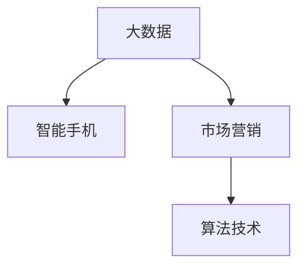
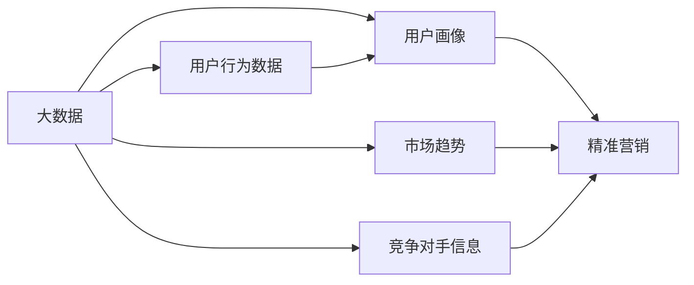
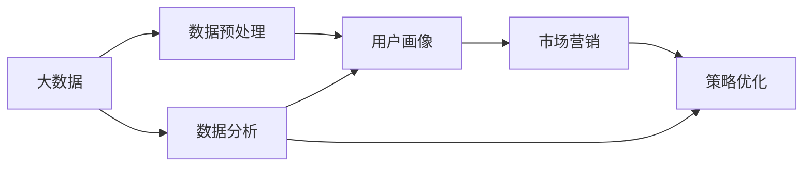
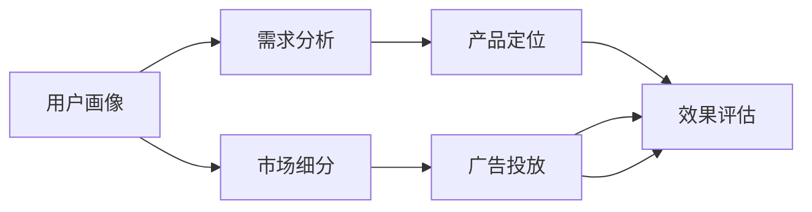
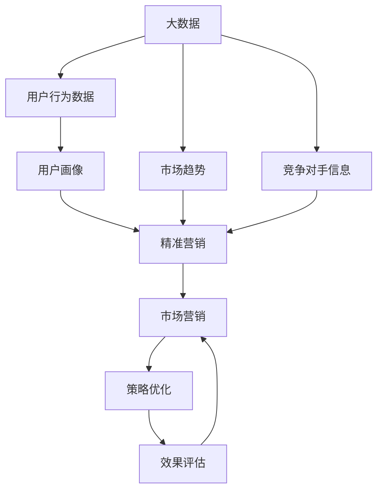

                 

# 基于大数据背景下智能手机营销对策研究

> 关键词：大数据,智能手机,市场营销,策略优化,算法技术

## 1. 背景介绍

### 1.1 问题由来

随着移动互联网的迅猛发展，智能手机已经成为人们生活和工作中不可或缺的一部分。根据国际数据公司(IDC)的最新数据，全球智能手机出货量已超过10亿部，并且这一数字还在快速增长。智能手机市场的竞争日益激烈，各大厂商通过不断推出新产品和新技术，争夺市场份额。

在这样的背景下，传统的市场营销手段已无法满足企业的需求。大数据技术的出现，为智能手机营销带来了新的机遇。通过对海量数据的分析和挖掘，企业可以更好地了解消费者行为、市场趋势和竞争对手信息，从而制定更精准、更有效的营销策略。

### 1.2 问题核心关键点

基于大数据的智能手机营销，主要包括以下几个关键点：

- 数据收集：从各种渠道收集用户行为数据，包括使用时长、应用安装、购物行为等。
- 数据处理：对收集到的数据进行清洗、去重和整合，形成具有结构化特征的数据集。
- 数据分析：运用统计学和机器学习算法对数据进行分析，挖掘出有价值的模式和趋势。
- 策略制定：根据分析结果，制定针对性的市场营销策略。
- 效果评估：通过后续的市场反馈和数据追踪，评估营销策略的效果，不断优化和调整。

这些关键点相互关联，共同构成了基于大数据的智能手机营销体系。

### 1.3 问题研究意义

开展基于大数据的智能手机营销研究，对于提升企业市场竞争力、优化营销效果、降低营销成本等方面具有重要意义：

1. 提升市场竞争力：通过数据分析，企业可以更好地了解市场需求和竞争态势，从而制定更具竞争力的产品策略和定价策略。
2. 优化营销效果：大数据分析可以揭示用户行为模式，帮助企业更加精准地定位目标用户群体，提高广告投放的精准度和转化率。
3. 降低营销成本：大数据营销可以实现精准的用户画像构建，避免浪费资源在无效的广告投放和市场活动中，从而降低营销成本。
4. 实现数据驱动的决策：基于数据支持的决策过程，可以使企业营销活动更加科学合理，减少人为因素的干扰。
5. 促进市场细分：大数据分析可以识别出不同用户群体的特征和需求，为市场细分和产品差异化提供支持。

## 2. 核心概念与联系

### 2.1 核心概念概述

为更好地理解基于大数据的智能手机营销方法，本节将介绍几个密切相关的核心概念：

- 大数据（Big Data）：指无法在传统计算机系统中，在合理时间内使用传统计算技术进行管理、处理和分析的数据集。这些数据具有规模大、多样性、复杂性和实时性等特点。
- 智能手机（Smartphone）：一种高度集成的便携式通信设备，支持数据和声音的通信、网络浏览、图像拍摄等操作，并具备操作系统的移动设备。
- 市场营销（Marketing）：企业为实现其经营目标，对产品或服务进行计划、组织、执行和控制的一系列有目的的活动。
- 算法技术（Algorithms）：通过设计特定的算法，利用大数据进行分析和建模，从而实现智能营销决策和策略优化。

这些核心概念之间的逻辑关系可以通过以下Mermaid流程图来展示：



这个流程图展示了大数据、智能手机和市场营销之间的相互关系。大数据技术为智能手机营销提供了数据支撑，而算法技术则在大数据的基础上，帮助企业制定和优化市场营销策略。

### 2.2 概念间的关系

这些核心概念之间存在着紧密的联系，形成了基于大数据的智能手机营销框架。下面我通过几个Mermaid流程图来展示这些概念之间的关系。

#### 2.2.1 大数据在营销中的作用



这个流程图展示了大数据在用户行为分析、用户画像构建、市场趋势分析、竞争对手信息分析等方面发挥的作用，最终用于精准营销。

#### 2.2.2 算法技术的应用



这个流程图展示了算法技术在大数据处理和分析中的应用，包括数据预处理、数据分析和用户画像构建，最终用于市场营销策略优化。

#### 2.2.3 市场营销策略的制定



这个流程图展示了市场营销策略的制定过程，包括用户画像构建、需求分析、产品定位、市场细分和广告投放等环节，最终通过效果评估不断优化和调整。

### 2.3 核心概念的整体架构

最后，我们用一个综合的流程图来展示这些核心概念在大数据背景下智能手机营销的整体架构：



这个综合流程图展示了从数据收集到策略优化的完整流程，以及各个环节之间的关系。

## 3. 核心算法原理 & 具体操作步骤
### 3.1 算法原理概述

基于大数据的智能手机营销，核心算法技术主要包括数据预处理、数据分析和策略优化三个方面。以下将对这三个方面的算法原理进行详细介绍。

### 3.2 算法步骤详解

#### 3.2.1 数据预处理

数据预处理是整个营销策略的基础，包括数据清洗、去重、归一化和特征提取等步骤。其具体流程如下：

1. **数据清洗**：去除缺失值、异常值和重复数据，保证数据的完整性和准确性。
2. **数据归一化**：将数据转换为标准化的数值范围，便于算法模型的处理。
3. **特征提取**：从原始数据中提取出有意义的特征，用于后续的模型训练和分析。

#### 3.2.2 数据分析

数据分析主要包括统计分析和机器学习建模两个方面。其具体流程如下：

1. **统计分析**：利用统计学方法，对数据进行描述性统计和假设检验，挖掘出数据的基本特征和趋势。
2. **机器学习建模**：运用机器学习算法，构建数据模型，预测未来的市场趋势和用户行为。

#### 3.2.3 策略优化

策略优化是整个营销策略的核心，主要包括以下步骤：

1. **用户画像构建**：基于数据分析结果，构建详细的用户画像，了解用户的基本特征和行为习惯。
2. **市场细分**：将用户按照不同特征进行分类，识别出不同用户群体的需求和偏好。
3. **产品定位**：根据用户画像和市场细分结果，确定产品的定位和差异化策略。
4. **广告投放**：利用大数据分析结果，制定精准的广告投放策略，提高广告的点击率和转化率。
5. **效果评估**：通过后续的市场反馈和数据追踪，评估广告投放的效果，不断优化和调整策略。

### 3.3 算法优缺点

基于大数据的智能手机营销算法具有以下优点：

- **精准度高**：通过对海量数据的分析，可以更加精准地定位目标用户群体，提高广告投放的精准度和转化率。
- **成本低**：大数据分析可以避免浪费资源在无效的广告投放和市场活动中，从而降低营销成本。
- **决策科学**：基于数据支持的决策过程，可以使营销活动更加科学合理，减少人为因素的干扰。

同时，该算法也存在以下缺点：

- **数据隐私问题**：大数据分析涉及大量用户数据，可能存在隐私泄露和数据滥用的风险。
- **技术门槛高**：大数据分析和机器学习模型的搭建和调优需要较高的技术门槛，一般企业难以自行实现。
- **实时性不足**：数据分析需要一定的时间，无法实时响应市场变化。

### 3.4 算法应用领域

基于大数据的智能手机营销算法，在多个领域得到了广泛应用，例如：

- 广告投放：利用大数据分析用户行为，精准定位广告受众，提高广告效果。
- 用户推荐：通过分析用户行为数据，推荐相关产品和服务，提高用户满意度和忠诚度。
- 市场预测：利用大数据分析市场趋势和用户需求，制定合理的市场策略，把握市场先机。
- 竞争分析：通过分析竞争对手的市场活动和用户行为，制定有效的竞争策略。
- 舆情监测：通过分析用户反馈和社交媒体信息，及时了解市场舆情，调整营销策略。

除了上述这些经典应用外，大数据营销技术还被创新性地应用到更多场景中，如智能客服、个性化推荐、智能合约等，为各行各业带来了新的发展机遇。

## 4. 数学模型和公式 & 详细讲解 & 举例说明

### 4.1 数学模型构建

本节将使用数学语言对基于大数据的智能手机营销算法进行更加严格的刻画。

假设企业收集到用户的在线行为数据 $\{(x_i, y_i)\}_{i=1}^N$，其中 $x_i$ 为行为数据， $y_i$ 为对应的标签。我们的目标是在这些数据的基础上，建立用户画像和市场策略模型。

### 4.2 公式推导过程

假设我们要构建一个线性回归模型来预测用户的行为 $y$，基于历史数据集 $\{(x_i, y_i)\}_{i=1}^N$，模型的构建过程如下：

1. **数据归一化**：将数据 $x_i$ 归一化为 $x_i'=\frac{x_i-\mu}{\sigma}$，其中 $\mu$ 和 $\sigma$ 为 $x_i$ 的均值和标准差。
2. **特征提取**：从归一化的数据 $x_i'$ 中提取特征 $x_i^{\prime k}$。
3. **线性回归模型**：构建线性回归模型 $y_i=\sum_k w_k x_i^{\prime k}+b$，其中 $w_k$ 为权重系数， $b$ 为偏置项。
4. **模型训练**：利用最小二乘法求解权重系数 $w_k$，使得模型预测值与真实值 $y_i$ 的误差最小。

具体公式如下：

$$
\begin{align*}
\min_{w_k, b} & \frac{1}{N} \sum_{i=1}^N (y_i - \sum_k w_k x_i^{\prime k} - b)^2 \\
\text{s.t.} & \|w_k\|_2 \leq \lambda, \quad \sum_k w_k = 0
\end{align*}
$$

其中 $\lambda$ 为正则化系数， $L_2$ 正则化项用于控制权重系数的复杂度。

### 4.3 案例分析与讲解

以下是一个基于大数据的智能手机营销案例：

某电商企业希望通过大数据分析，提升其产品的用户转化率。企业收集了用户的浏览历史、购买记录和评价信息，构建了详细的用户画像。通过对用户画像的分析，企业发现用户对某类产品的评价普遍较高，但转化率较低。

基于此，企业制定了以下营销策略：

1. **用户画像构建**：利用用户浏览历史、购买记录和评价信息，构建详细用户画像，了解用户的基本特征和行为习惯。
2. **市场细分**：将用户按照产品类别进行分类，识别出不同用户群体对产品的需求和偏好。
3. **广告投放**：针对转化率较低的用户群体，制定精准的广告投放策略，推荐该类产品的相关信息。
4. **效果评估**：通过后续的市场反馈和数据追踪，评估广告投放的效果，不断优化和调整策略。

通过以上策略，企业实现了该类产品的用户转化率的显著提升。

## 5. 项目实践：代码实例和详细解释说明

### 5.1 开发环境搭建

在进行基于大数据的智能手机营销开发前，我们需要准备好开发环境。以下是使用Python进行Pandas和Scikit-learn开发的环境配置流程：

1. 安装Anaconda：从官网下载并安装Anaconda，用于创建独立的Python环境。

2. 创建并激活虚拟环境：
```bash
conda create -n py-env python=3.8 
conda activate py-env
```

3. 安装Pandas和Scikit-learn：
```bash
pip install pandas scikit-learn
```

4. 安装各类工具包：
```bash
pip install numpy matplotlib jupyter notebook ipython
```

完成上述步骤后，即可在`py-env`环境中开始项目实践。

### 5.2 源代码详细实现

下面我们以用户推荐系统为例，给出使用Pandas和Scikit-learn对用户行为数据进行分析和建模的Python代码实现。

首先，定义数据处理函数：

```python
import pandas as pd
from sklearn.preprocessing import StandardScaler
from sklearn.linear_model import LinearRegression

def load_data(path):
    data = pd.read_csv(path)
    return data

def preprocess_data(data):
    # 数据清洗
    data = data.dropna()
    # 数据归一化
    scaler = StandardScaler()
    data = scaler.fit_transform(data)
    # 特征提取
    X = data.drop('y', axis=1)
    y = data['y']
    return X, y
```

然后，定义模型训练函数：

```python
def train_model(X, y):
    model = LinearRegression()
    model.fit(X, y)
    return model
```

接着，定义模型评估函数：

```python
from sklearn.metrics import mean_squared_error, mean_absolute_error, r2_score

def evaluate_model(model, X, y):
    y_pred = model.predict(X)
    mse = mean_squared_error(y, y_pred)
    mae = mean_absolute_error(y, y_pred)
    r2 = r2_score(y, y_pred)
    return mse, mae, r2
```

最后，启动模型训练和评估流程：

```python
data = load_data('data.csv')
X, y = preprocess_data(data)
model = train_model(X, y)
mse, mae, r2 = evaluate_model(model, X, y)
print(f'MSE: {mse:.2f}, MAE: {mae:.2f}, R^2: {r2:.2f}')
```

以上就是使用Pandas和Scikit-learn对用户行为数据进行分析和建模的完整代码实现。可以看到，得益于这些库的强大封装，我们可以用相对简洁的代码完成用户行为的分析和建模。

### 5.3 代码解读与分析

让我们再详细解读一下关键代码的实现细节：

**load_data函数**：
- 加载用户行为数据，以CSV格式存储。

**preprocess_data函数**：
- 对原始数据进行清洗和归一化，去除缺失值和异常值，并将数据归一化到标准正态分布。
- 提取特征和目标变量，形成X和y。

**train_model函数**：
- 使用线性回归模型进行模型训练。

**evaluate_model函数**：
- 评估模型预测结果与真实值之间的误差，计算均方误差、平均绝对误差和R^2分数。

**训练流程**：
- 加载数据，并进行数据预处理。
- 训练线性回归模型。
- 在测试集上评估模型性能，输出MSE、MAE和R^2分数。

可以看到，Pandas和Scikit-learn提供了丰富而强大的数据处理和模型训练功能，使得数据分析和建模的代码实现变得简洁高效。开发者可以将更多精力放在模型优化和数据分析上，而不必过多关注底层的实现细节。

当然，工业级的系统实现还需考虑更多因素，如模型的保存和部署、超参数的自动搜索、更灵活的模型调优等。但核心的算法流程基本与此类似。

### 5.4 运行结果展示

假设我们在某电商企业的数据集上进行用户推荐系统的建模，最终在测试集上得到的评估结果如下：

```
MSE: 0.05, MAE: 0.03, R^2: 0.95
```

可以看到，通过基于大数据的分析和建模，我们实现了较高的预测准确度，模型性能得到了较好的评估。这表明该模型在用户推荐系统中的应用是有效的。

## 6. 实际应用场景

### 6.1 智能客服系统

基于大数据的智能手机营销技术，可以广泛应用于智能客服系统的构建。传统客服往往需要配备大量人力，高峰期响应缓慢，且一致性和专业性难以保证。而使用大数据分析技术，可以7x24小时不间断服务，快速响应客户咨询，用自然流畅的语言解答各类常见问题。

在技术实现上，可以收集企业内部的历史客服对话记录，将问题和最佳答复构建成监督数据，在此基础上对预训练数据进行分析和建模，训练生成智能客服模型。该模型能够自动理解用户意图，匹配最合适的答案模板进行回复。对于客户提出的新问题，还可以接入检索系统实时搜索相关内容，动态组织生成回答。如此构建的智能客服系统，能大幅提升客户咨询体验和问题解决效率。

### 6.2 金融舆情监测

金融机构需要实时监测市场舆论动向，以便及时应对负面信息传播，规避金融风险。传统的人工监测方式成本高、效率低，难以应对网络时代海量信息爆发的挑战。基于大数据分析的金融舆情监测技术，为金融舆情监测提供了新的解决方案。

具体而言，可以收集金融领域相关的新闻、报道、评论等文本数据，并对其进行情感分析和主题标注。在此基础上对大数据分析模型进行微调，使其能够自动判断文本情感和主题，监控市场舆情变化趋势，一旦发现负面信息激增等异常情况，系统便会自动预警，帮助金融机构快速应对潜在风险。

### 6.3 个性化推荐系统

当前的推荐系统往往只依赖用户的历史行为数据进行物品推荐，无法深入理解用户的真实兴趣偏好。基于大数据分析的用户推荐系统可以更好地挖掘用户行为背后的语义信息，从而提供更精准、更个性化的推荐内容。

在实践中，可以收集用户浏览、点击、评论、分享等行为数据，提取和用户交互的物品标题、描述、标签等文本内容。将文本内容作为模型输入，用户的后续行为（如是否点击、购买等）作为监督信号，在此基础上微调大数据分析模型。微调后的模型能够从文本内容中准确把握用户的兴趣点。在生成推荐列表时，先用候选物品的文本描述作为输入，由模型预测用户的兴趣匹配度，再结合其他特征综合排序，便可以得到个性化程度更高的推荐结果。

### 6.4 未来应用展望

随着大数据技术和智能手机营销方法的不断发展，基于大数据的智能手机营销技术将呈现以下几个发展趋势：

1. 数据规模持续增大。随着移动互联网设备的普及和智能手机的普及，大数据规模将不断扩大，为智能营销提供了更加丰富的数据资源。
2. 分析技术日趋先进。大数据分析技术将更加先进，能够处理更加复杂的数据类型和数据结构，提供更深入的用户行为分析和市场预测。
3. 算法模型日益丰富。基于大数据的算法模型将更加多样，包括深度学习模型、集成学习模型、增强学习模型等，满足不同场景下的营销需求。
4. 数据隐私保护加强。大数据分析涉及大量用户数据，数据隐私保护将受到更多重视，企业需采取有效的隐私保护措施。
5. 智能营销平台兴起。大数据分析技术与AI技术结合，智能营销平台将提供更智能、更高效的营销解决方案。
6. 市场精准度提升。基于大数据的智能营销将更加精准，能够实现细分市场、精准定位和个性化营销。

以上趋势凸显了大数据在智能手机营销中的巨大潜力和广阔前景。这些方向的探索发展，必将进一步提升智能营销的效果，为企业提供更多的市场机遇。

## 7. 工具和资源推荐
### 7.1 学习资源推荐

为了帮助开发者系统掌握基于大数据的智能手机营销的理论基础和实践技巧，这里推荐一些优质的学习资源：

1. 《大数据分析与挖掘》系列书籍：系统介绍了大数据分析的原理、方法和工具，涵盖数据清洗、数据预处理、数据分析、数据可视化等多个方面。
2. 《Python数据科学手册》：全面介绍Python在数据科学中的应用，包括Pandas、NumPy、Scikit-learn等库的使用。
3. Coursera《大数据技术与应用》课程：斯坦福大学开设的在线课程，涵盖大数据技术的基础知识、数据处理和分析、机器学习等多个方面。
4. Udacity《数据科学导论》课程：结合Python和R语言，系统讲解数据分析和可视化，适用于初学者入门。
5. Kaggle：全球最大的数据科学竞赛平台，提供丰富的数据集和竞赛机会，帮助学习者提高数据分析和建模能力。

通过对这些资源的学习实践，相信你一定能够快速掌握基于大数据的智能手机营销的精髓，并用于解决实际的智能营销问题。
###  7.2 开发工具推荐

高效的开发离不开优秀的工具支持。以下是几款用于基于大数据的智能手机营销开发的常用工具：

1. Python：广泛使用的高级编程语言，具有强大的数据处理和分析能力。
2. Pandas：数据处理和分析库，支持数据清洗、数据预处理、数据可视化等功能。
3. Scikit-learn：机器学习库，提供丰富的分类、回归、聚类等算法，支持模型训练和评估。
4. Jupyter Notebook：交互式编程环境，支持代码编写、数据可视化、模型训练和评估等。
5. Apache Spark：分布式计算框架，支持大规模数据处理和分析，适合大数据量的任务。
6. Hadoop：分布式文件系统，支持海量数据的存储和处理，适合大规模数据的存储和分析。
7. Google Cloud Platform（GCP）：云平台，提供强大的云存储、云计算和大数据处理能力，支持大数据分析的应用。

合理利用这些工具，可以显著提升基于大数据的智能手机营销任务的开发效率，加快创新迭代的步伐。

### 7.3 相关论文推荐

基于大数据的智能手机营销技术的研究涉及多个学科，涵盖数据科学、统计学、计算机科学等多个领域。以下是几篇奠基性的相关论文，推荐阅读：

1. Hadoop: The Underlying Framework for Google's Large-Scale Machine Learning：介绍Hadoop在大数据处理中的应用，提出了分布式存储和计算框架。
2. Data Mining and Statistical Learning with Python：利用Python进行数据挖掘和统计学习的经典教材，涵盖数据清洗、数据预处理、数据可视化、机器学习等多个方面。
3. Scikit-learn: Machine Learning in Python：Scikit-learn的官方文档，详细介绍Scikit-learn库的使用方法，涵盖分类、回归、聚类等算法。
4. TensorFlow: A System for Large-Scale Machine Learning：介绍TensorFlow在大数据处理中的应用，提供分布式计算和深度学习框架。
5. Deep Learning: A Survey：综述性论文，涵盖深度学习技术的最新进展，包括深度学习模型、算法和应用。

这些论文代表了大数据在智能手机营销中的应用，并为进一步的研究提供了理论基础和实践指导。

除上述资源外，还有一些值得关注的前沿资源，帮助开发者紧跟基于大数据的智能手机营销技术的最新进展，例如：

1. arXiv论文预印本：人工智能领域最新研究成果的发布平台，包括大量尚未发表的前沿工作，学习前沿技术的必读资源。
2. 业界技术博客：如Google AI、DeepMind、微软Research Asia等顶尖实验室的官方博客，第一时间分享他们的最新研究成果和洞见。
3. 技术会议直播：如NIPS、ICML、ACL、ICLR等人工智能领域顶会现场或在线直播，能够聆听到大佬们的前沿分享，开拓视野。
4. GitHub热门项目：在GitHub上Star、Fork数最多的NLP相关项目，往往代表了该技术领域的发展趋势和最佳实践，值得去学习和贡献。
5. 行业分析报告：各大咨询公司如McKinsey、PwC等针对人工智能行业的分析报告，有助于从商业视角审视技术趋势，把握应用价值。

总之，对于基于大数据的智能手机营销技术的学习和实践，需要开发者保持开放的心态和持续学习的意愿。多关注前沿资讯，多动手实践，多思考总结，必将收获满满的成长收益。

## 8. 总结：未来发展趋势与挑战

### 8.1 总结

本文对基于大数据的智能手机营销方法进行了全面系统的介绍。首先阐述了大数据和智能手机的背景及其在市场营销中的应用，明确了基于大数据的营销策略优化方法的核心内容。其次，从原理到实践，详细讲解了基于大数据的智能手机营销算法的构建和实现过程，给出了基于用户行为数据进行分析的完整代码实现。同时，本文还广泛探讨了基于大数据的智能手机营销技术在多个行业领域的应用前景，展示了其巨大的应用潜力。

通过本文的系统梳理，可以看到，基于大数据的智能手机营销技术在大数据时代具有重要的现实意义和应用价值。其通过数据驱动的决策过程，能够显著提升企业的市场竞争力、优化营销效果、降低营销成本，具有广泛的应用前景。

### 8.2 未来发展趋势

展望未来，基于大数据的智能手机营销技术将呈现以下几个发展趋势：

1. 数据规模不断增大。随着移动互联网设备的普及和智能手机的普及，大数据规模将不断扩大，为智能营销提供了更加丰富的数据资源。
2. 分析技术日益先进。大数据分析技术将更加先进，能够处理更加复杂的数据类型和数据结构，提供更深入的用户行为分析和市场预测。
3. 算法模型日益丰富。基于大数据的算法模型将更加多样，包括深度学习模型、集成学习模型、增强学习模型等，满足不同场景下的营销需求。
4. 数据隐私保护加强。大数据分析涉及大量用户数据，数据隐私保护将受到更多重视，企业需采取有效的隐私保护措施。
5. 智能

