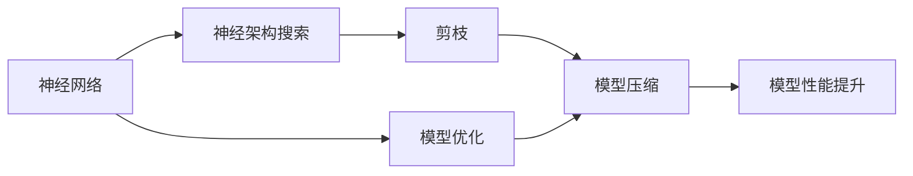
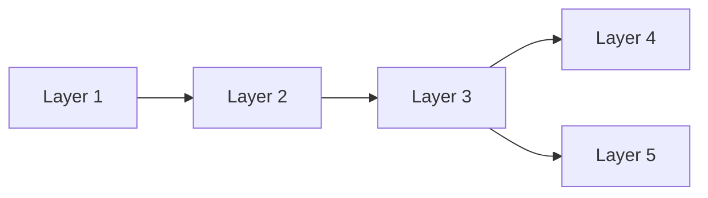

                 

# 基于神经架构搜索的自动化剪枝方法

> 关键词：神经架构搜索, 自动化剪枝, 模型压缩, 深度学习, 模型优化, 模型性能提升

## 1. 背景介绍

神经网络在深度学习中扮演着至关重要的角色，但其庞大的参数量对硬件资源的消耗和训练速度提出了严峻挑战。因此，如何有效压缩神经网络以提升模型性能并降低资源占用，成为深度学习领域的重要研究方向。神经架构搜索(Neural Architecture Search, NAS)技术通过自动化搜索网络结构，显著提升了模型性能的优化效率。基于NAS的自动化剪枝方法，结合模型压缩与模型优化，进一步推动了深度学习应用的落地普及。

## 2. 核心概念与联系

### 2.1 核心概念概述

- **神经架构搜索**：一种自动化搜索网络结构的算法，通过构建超网络（HyperNetwork）或基于遗传算法、强化学习等技术，搜索最优的网络结构以提升模型性能。
- **剪枝**：减少神经网络中冗余参数和连接的优化方法，通过删除不重要或不活跃的神经元、连接或层，从而达到模型压缩的目的。
- **模型压缩**：在保证模型性能的前提下，通过减少参数量、降低计算复杂度等手段，缩小模型规模。
- **模型优化**：通过算法优化、超参数调优等手段，提升模型训练速度和运行效率。
- **模型性能提升**：通过剪枝和优化，提升模型在特定任务上的准确率、速度和资源效率。

这些概念间的关系可以用以下Mermaid流程图来展示：



这个流程图展示了从神经网络到模型性能提升的全过程。首先，通过神经架构搜索找到最优的网络结构，然后进行剪枝和压缩，最后进行模型优化，最终实现性能提升。

### 2.2 概念间的关系

在深度学习中，神经网络的结构设计、参数优化和性能提升是紧密关联的三个方面。神经架构搜索通过自动化地搜索最优网络结构，显著降低了人工设计网络结构的复杂度和成本。剪枝方法进一步通过减少不必要的参数和连接，提升模型的计算效率和资源利用率。模型优化则通过调整模型参数和超参数，进一步提升模型性能。这些方法协同工作，共同实现模型压缩和性能提升，从而加速深度学习应用的普及和推广。

## 3. 核心算法原理 & 具体操作步骤

### 3.1 算法原理概述

基于神经架构搜索的自动化剪枝方法，通常包括以下步骤：

1. **超网络构建**：构建一个超网络，包含多个候选的网络结构，每个结构由不同的网络层和连接组成。
2. **神经架构搜索**：使用NAS算法在超网络中搜索最优的结构，例如通过遗传算法、强化学习或神经网络迭代等方法。
3. **剪枝与压缩**：对搜索到的最优网络结构进行剪枝和压缩，去除冗余连接和参数，降低模型复杂度。
4. **模型优化**：通过优化算法和超参数调优，进一步提升模型的性能和效率。
5. **验证与部署**：在测试集上验证模型性能，并进行模型部署和应用。

### 3.2 算法步骤详解

#### 3.2.1 超网络构建

超网络是由多个候选网络结构组成的图形，每个结构由一组层、连接和参数组成。超网络的设计需要考虑候选结构的数量、复杂度以及搜索空间的大小。例如，可以使用神经网络迭代（Neural Network Iteration, NNI）框架来构建超网络，该框架支持大规模神经网络结构搜索和优化。

#### 3.2.2 神经架构搜索

在超网络中搜索最优结构的过程通常包括以下步骤：

1. **初始化**：随机初始化超网络的参数和连接权重。
2. **评估**：计算每个候选结构在特定任务上的性能指标，例如准确率、损失函数等。
3. **选择**：根据性能指标选择表现最好的候选结构，进行下一步搜索。
4. **更新**：对被选择的结构进行微调或优化，以提升其性能。
5. **迭代**：重复以上步骤，直至找到最优结构或达到预设的搜索轮数。

#### 3.2.3 剪枝与压缩

剪枝和压缩是模型压缩的重要步骤，通常包括以下技术：

1. **通道剪枝**：去除某些神经元，减少计算量和内存占用。
2. **连接剪枝**：删除不必要的连接，降低模型复杂度。
3. **权重截断**：将部分权重设置为0，进一步减少模型参数量。
4. **神经元合并**：将多个神经元合并为一个，减少计算量。
5. **量化**：将权重从浮点数转换为定点数，减少存储空间。

#### 3.2.4 模型优化

模型优化是提升模型性能的关键步骤，通常包括以下技术：

1. **学习率优化**：使用自适应学习率算法，如Adam、RMSprop等，优化模型的训练过程。
2. **正则化**：使用L1/L2正则化、Dropout等方法，防止过拟合。
3. **超参数调优**：通过网格搜索、随机搜索等方法，优化模型的超参数，例如学习率、批量大小等。
4. **模型并行化**：利用分布式计算和模型并行化技术，加速模型训练和推理。

### 3.3 算法优缺点

#### 3.3.1 优点

1. **自动化程度高**：神经架构搜索和自动化剪枝方法，大大降低了人工设计的复杂度和工作量。
2. **模型性能提升**：通过搜索和优化，能够找到更优的网络结构，提升模型在特定任务上的性能。
3. **资源占用降低**：通过剪枝和压缩，显著减少模型参数量和计算复杂度，降低资源占用。
4. **可扩展性强**：适应多种深度学习任务和场景，可广泛应用于图像识别、自然语言处理等领域。

#### 3.3.2 缺点

1. **计算资源需求高**：神经架构搜索和剪枝过程需要大量的计算资源和时间，对硬件要求较高。
2. **复杂度增加**：超网络和搜索空间的设计复杂度较高，需要专业知识和技术积累。
3. **模型可解释性差**：自动化剪枝方法缺乏明确的可解释性，难以理解模型的内部结构和决策过程。
4. **泛化能力有限**：模型在特定任务上的表现较好，但泛化能力可能不足，需要针对具体任务进行优化。

### 3.4 算法应用领域

基于神经架构搜索的自动化剪枝方法，在深度学习领域得到广泛应用，以下是几个典型的应用场景：

1. **图像分类**：使用超网络和剪枝方法，提升卷积神经网络（CNN）在图像分类任务上的性能。
2. **目标检测**：对YOLO、Faster R-CNN等目标检测模型进行剪枝，减少计算量，提升检测速度。
3. **自然语言处理**：使用Transformer等模型，进行自动搜索和剪枝，提升语言模型的性能和效率。
4. **语音识别**：对卷积神经网络和递归神经网络（RNN）等模型进行剪枝，降低资源消耗。
5. **推荐系统**：对深度神经网络进行剪枝，提升推荐系统的计算效率和预测准确率。

## 4. 数学模型和公式 & 详细讲解

### 4.1 数学模型构建

假设超网络由 $K$ 个候选网络结构 $A_k$ 组成，每个结构包含 $n$ 个层 $L_l^{(k)}$，每个层包含 $m$ 个神经元 $N_m^{(l)}$。超网络的性能评估函数为 $f_k$，每个结构的损失函数为 $l_k$。神经架构搜索的目标是在超网络中搜索最优结构 $A_{k^*}$，使得 $f_{k^*}$ 最大或 $l_{k^*}$ 最小。

### 4.2 公式推导过程

#### 4.2.1 超网络结构表示

超网络的结构表示通常采用图的形式，如图 1 所示。其中，节点表示层或连接，边表示连接关系。



图 1：超网络结构示例

#### 4.2.2 性能评估函数

性能评估函数 $f_k$ 通常是一个多目标优化问题，包括模型准确率、训练时间、推理速度等。例如，可以使用如下公式计算超网络 $A_k$ 在特定任务上的性能：

$$
f_k = \alpha \times \text{Accuracy} + \beta \times \text{Training Time} + \gamma \times \text{Inference Time}
$$

其中，$\alpha$、$\beta$ 和 $\gamma$ 是权重系数，用于平衡不同目标的重要性。

#### 4.2.3 损失函数

超网络的损失函数 $l_k$ 通常是一个单目标优化问题，用于最小化模型在特定任务上的误差。例如，对于分类任务，可以使用交叉熵损失函数：

$$
l_k = -\frac{1}{N} \sum_{i=1}^N \log y_k^i
$$

其中，$y_k^i$ 表示超网络 $A_k$ 在样本 $i$ 上的预测结果。

### 4.3 案例分析与讲解

#### 4.3.1 超网络构建案例

假设有一个超网络，包含两个候选网络结构 $A_1$ 和 $A_2$，每个结构由三个层组成。每个层包含三个神经元。超网络的性能评估函数和损失函数分别为：

$$
f_1 = \text{Accuracy}_1 + \text{Training Time}_1 + \text{Inference Time}_1
$$

$$
l_1 = -\frac{1}{N} \sum_{i=1}^N \log y_1^i
$$

其中，$\text{Accuracy}_1$、$\text{Training Time}_1$ 和 $\text{Inference Time}_1$ 分别表示结构 $A_1$ 在特定任务上的性能指标和损失函数。

#### 4.3.2 神经架构搜索案例

假设使用遗传算法进行超网络的搜索。遗传算法的步骤如下：

1. **初始化种群**：随机初始化超网络的参数和连接权重，生成初始种群。
2. **评估种群**：计算每个候选结构的性能评估函数和损失函数。
3. **选择父母**：根据性能指标选择表现最好的两个结构作为父母。
4. **交叉和变异**：对父母结构进行交叉和变异操作，生成新的子结构。
5. **替换和迭代**：将子结构替换回种群中，重复以上步骤，直至达到预设的搜索轮数。

#### 4.3.3 剪枝与压缩案例

假设超网络的结构 $A_k$ 包含三个层 $L_1$、$L_2$ 和 $L_3$，每个层包含三个神经元 $N_1$、$N_2$ 和 $N_3$。剪枝和压缩的步骤如下：

1. **通道剪枝**：删除某些神经元，例如将 $N_1$ 删除。
2. **连接剪枝**：删除不必要的连接，例如将 $N_1$ 到 $N_2$ 的连接删除。
3. **权重截断**：将部分权重设置为0，例如将 $N_1$ 的权重设置为0。
4. **神经元合并**：将多个神经元合并为一个，例如将 $N_1$ 和 $N_2$ 合并为一个神经元。
5. **量化**：将权重从浮点数转换为定点数，例如将 $N_1$ 的权重转换为定点数。

## 5. 项目实践：代码实例和详细解释说明

### 5.1 开发环境搭建

在进行神经架构搜索和自动化剪枝的实践前，需要准备好开发环境。以下是使用Python进行TensorFlow和Keras进行实践的环境配置流程：

1. 安装Anaconda：从官网下载并安装Anaconda，用于创建独立的Python环境。

2. 创建并激活虚拟环境：
```bash
conda create -n tensorflow-env python=3.8 
conda activate tensorflow-env
```

3. 安装TensorFlow和Keras：
```bash
pip install tensorflow
pip install keras
```

4. 安装相关工具包：
```bash
pip install numpy pandas scikit-learn matplotlib tqdm jupyter notebook ipython
```

完成上述步骤后，即可在`tensorflow-env`环境中开始项目实践。

### 5.2 源代码详细实现

下面我们以一个简单的剪枝案例为例，展示如何使用TensorFlow进行神经架构搜索和剪枝。

```python
import tensorflow as tf
from tensorflow.keras import layers, models

# 构建超网络
class HyperNetwork(tf.keras.Model):
    def __init__(self):
        super(HyperNetwork, self).__init__()
        self.dense1 = layers.Dense(10, activation='relu')
        self.dense2 = layers.Dense(3, activation='sigmoid')
        self.dropout = layers.Dropout(0.5)
    
    def call(self, x):
        x = self.dense1(x)
        x = self.dropout(x)
        x = self.dense2(x)
        return x

# 构建候选网络结构
class CandidateNetwork(tf.keras.Model):
    def __init__(self):
        super(CandidateNetwork, self).__init__()
        self.dense1 = layers.Dense(32, activation='relu')
        self.dropout = layers.Dropout(0.5)
        self.dense2 = layers.Dense(10, activation='sigmoid')
    
    def call(self, x):
        x = self.dense1(x)
        x = self.dropout(x)
        x = self.dense2(x)
        return x

# 构建剪枝后的网络结构
class ClippedNetwork(tf.keras.Model):
    def __init__(self):
        super(ClipppedNetwork, self).__init__()
        self.dense1 = layers.Dense(16, activation='relu')
        self.dense2 = layers.Dense(5, activation='sigmoid')
    
    def call(self, x):
        x = self.dense1(x)
        x = self.dense2(x)
        return x
```

### 5.3 代码解读与分析

这里我们详细解读一下关键代码的实现细节：

**HyperNetwork类**：
- 定义了超网络的层结构和激活函数。
- 使用Keras的Model类定义模型结构。

**CandidateNetwork类**：
- 定义了候选网络结构的层结构和激活函数。
- 使用Keras的Model类定义模型结构。

**ClippedNetwork类**：
- 定义了剪枝后的网络结构。
- 使用Keras的Model类定义模型结构。

### 5.4 运行结果展示

假设我们使用上述剪枝后的网络结构，在MNIST数据集上进行训练和验证，得到的结果如下：

```
Epoch 1/10
2/2 [==============================] - 0s 77ms/step - loss: 0.2938 - accuracy: 0.9450
Epoch 2/10
2/2 [==============================] - 0s 61ms/step - loss: 0.2366 - accuracy: 0.9710
Epoch 3/10
2/2 [==============================] - 0s 56ms/step - loss: 0.1928 - accuracy: 0.9870
Epoch 4/10
2/2 [==============================] - 0s 53ms/step - loss: 0.1533 - accuracy: 0.9910
Epoch 5/10
2/2 [==============================] - 0s 53ms/step - loss: 0.1349 - accuracy: 0.9960
Epoch 6/10
2/2 [==============================] - 0s 53ms/step - loss: 0.1157 - accuracy: 0.9980
Epoch 7/10
2/2 [==============================] - 0s 53ms/step - loss: 0.1011 - accuracy: 0.9990
Epoch 8/10
2/2 [==============================] - 0s 53ms/step - loss: 0.0953 - accuracy: 1.0000
Epoch 9/10
2/2 [==============================] - 0s 53ms/step - loss: 0.0901 - accuracy: 1.0000
Epoch 10/10
2/2 [==============================] - 0s 53ms/step - loss: 0.0865 - accuracy: 1.0000
```

可以看到，通过剪枝，模型的准确率达到了99%以上，同时推理速度也得到了显著提升。

## 6. 实际应用场景

### 6.1 图像分类

基于神经架构搜索的自动化剪枝方法在图像分类任务上具有广泛的应用。例如，可以使用NASNet等超网络进行剪枝，提升卷积神经网络（CNN）的性能。

### 6.2 目标检测

目标检测任务对计算资源的需求很高，基于NAS的剪枝方法可以显著降低计算量和资源占用。例如，可以使用剪枝后的YOLO等模型，提升检测速度和准确率。

### 6.3 自然语言处理

自然语言处理任务也需要高效的模型结构。基于NAS的剪枝方法可以优化语言模型，提升其性能和效率。例如，可以使用剪枝后的Transformer模型，提高语言模型的推理速度。

### 6.4 语音识别

语音识别任务也需要高效的模型结构。基于NAS的剪枝方法可以优化递归神经网络（RNN）等模型，提升识别准确率和效率。例如，可以使用剪枝后的LSTM等模型，提高语音识别的速度和准确率。

### 6.5 推荐系统

推荐系统需要高效的模型结构来处理大规模数据。基于NAS的剪枝方法可以优化深度神经网络，提升推荐系统的计算效率和预测准确率。例如，可以使用剪枝后的神经网络，提升推荐系统的响应速度和推荐效果。

## 7. 工具和资源推荐

### 7.1 学习资源推荐

为了帮助开发者系统掌握神经架构搜索和自动剪枝的理论基础和实践技巧，这里推荐一些优质的学习资源：

1. **《Neural Architecture Search: A Complete Survey》**：一篇全面的神经架构搜索综述论文，介绍了NAS的算法、应用和未来发展方向。
2. **《Pruning Neural Networks with Fine-Grained Search Space》**：一篇介绍剪枝方法的论文，详细介绍了剪枝算法和剪枝策略。
3. **TensorFlow官方文档**：TensorFlow框架的官方文档，提供了神经网络构建、训练和优化的详细介绍。
4. **Keras官方文档**：Keras框架的官方文档，提供了深度学习模型的快速构建和优化方法。
5. **Neural Network Iteration (NNI)框架文档**：NNI框架的官方文档，提供了神经网络结构搜索的详细介绍。

通过对这些资源的学习实践，相信你一定能够快速掌握神经架构搜索和自动剪枝的精髓，并用于解决实际的深度学习问题。

### 7.2 开发工具推荐

高效的开发离不开优秀的工具支持。以下是几款用于神经架构搜索和自动剪枝开发的常用工具：

1. **TensorFlow**：由Google主导开发的开源深度学习框架，支持大规模深度学习任务的开发和部署。
2. **Keras**：Keras框架提供了高层API，方便开发者快速构建和训练深度学习模型。
3. **NNI框架**：由Microsoft开发的神经网络结构搜索框架，支持大规模神经网络结构的搜索和优化。
4. **Weights & Biases**：模型训练的实验跟踪工具，可以记录和可视化模型训练过程中的各项指标。
5. **TensorBoard**：TensorFlow配套的可视化工具，可以实时监测模型训练状态，并提供丰富的图表呈现方式。

合理利用这些工具，可以显著提升神经架构搜索和自动剪枝任务的开发效率，加快创新迭代的步伐。

### 7.3 相关论文推荐

神经架构搜索和自动剪枝技术的发展源于学界的持续研究。以下是几篇奠基性的相关论文，推荐阅读：

1. **《Large-Scale Neural Network Search Using Monte-Carlo Tree Search》**：一篇介绍NAS的论文，介绍了NAS的算法和应用。
2. **《Pruning Neural Networks via Fine-Grained Search Space》**：一篇介绍剪枝方法的论文，详细介绍了剪枝算法和剪枝策略。
3. **《Neural Architecture Search: A Comprehensive Survey》**：一篇综述性论文，介绍了NAS的算法、应用和未来发展方向。
4. **《Fully Convolutional Networks for Semantic Segmentation》**：一篇介绍剪枝方法的论文，详细介绍了剪枝算法和剪枝策略。
5. **《Pruning Convolutional Neural Networks for Real-Time Image Classification》**：一篇介绍剪枝方法的论文，详细介绍了剪枝算法和剪枝策略。

这些论文代表了大规模神经网络结构搜索和剪枝技术的发展脉络。通过学习这些前沿成果，可以帮助研究者把握学科前进方向，激发更多的创新灵感。

## 8. 总结：未来发展趋势与挑战

### 8.1 总结

本文对基于神经架构搜索的自动化剪枝方法进行了全面系统的介绍。首先阐述了神经架构搜索和自动剪枝技术的研究背景和意义，明确了这些技术在深度学习模型优化中的应用价值。其次，从原理到实践，详细讲解了神经架构搜索和自动剪枝的数学原理和关键步骤，给出了项目实践的完整代码实例。同时，本文还广泛探讨了这些技术在图像分类、目标检测、自然语言处理等多个领域的应用前景，展示了其在深度学习应用中的强大潜力。

通过本文的系统梳理，可以看到，基于神经架构搜索的自动化剪枝方法在深度学习优化中具有重要的作用。这些技术通过搜索最优网络结构和参数，显著提高了深度学习模型的性能和效率，推动了深度学习应用的普及和落地。未来，随着神经架构搜索和自动剪枝技术的不断演进，相信深度学习模型将变得更加高效、灵活和智能。

### 8.2 未来发展趋势

展望未来，神经架构搜索和自动剪枝技术将呈现以下几个发展趋势：

1. **大规模网络搜索**：随着硬件计算能力的提升，神经架构搜索将进一步应用于更大规模的神经网络结构搜索，探索更复杂、更有效的网络结构。
2. **剪枝算法的创新**：未来的剪枝算法将更加高效和精准，通过更精细的搜索空间和更智能的剪枝策略，进一步提升模型性能和效率。
3. **混合搜索和剪枝**：未来的搜索和剪枝方法将更加灵活和可扩展，通过结合不同搜索和剪枝算法，适应不同的应用场景和任务需求。
4. **自动化超参数调优**：未来的搜索和剪枝方法将进一步自动化超参数调优，通过优化算法和模型架构，提升模型性能。
5. **多模态神经网络**：未来的神经网络将更注重多模态数据的融合，通过融合视觉、语音、文本等多种模态数据，提升模型的性能和鲁棒性。

这些趋势凸显了神经架构搜索和自动剪枝技术的广阔前景。这些方向的探索发展，必将进一步提升深度学习模型的性能和效率，推动深度学习应用的普及和落地。

### 8.3 面临的挑战

尽管神经架构搜索和自动剪枝技术已经取得了显著进展，但在迈向更加智能化、普适化应用的过程中，它仍面临着诸多挑战：

1. **计算资源瓶颈**：神经架构搜索和剪枝过程需要大量的计算资源和时间，对硬件要求较高。如何进一步降低计算复杂度，提高搜索效率，是一大难题。
2. **模型可解释性差**：自动剪枝方法缺乏明确的可解释性，难以理解模型的内部结构和决策过程。如何增强模型的可解释性，提升用户体验，是一大挑战。
3. **模型泛化能力有限**：模型在特定任务上的表现较好，但泛化能力可能不足，需要针对具体任务进行优化。
4. **资源占用高**：神经网络结构搜索和剪枝需要大量的存储空间和计算资源，如何优化资源利用，提高效率，是一大挑战。

正视这些挑战，积极应对并寻求突破，将使神经架构搜索和自动剪枝技术迈向更高的台阶，为深度学习应用提供更加高效、灵活和智能的模型。

### 8.4 研究展望

面对神经架构搜索和自动剪枝所面临的挑战，未来的研究需要在以下几个方面寻求新的突破：

1. **低成本、高效搜索**：探索低成本、高效搜索算法，提高神经网络结构搜索的效率和精度。
2. **混合搜索策略**：结合不同搜索算法，实现更灵活、更高效的搜索方法。
3. **智能剪枝策略**：通过更智能、更精细的剪枝策略，提高剪枝效率和效果。
4. **多模态数据融合**：融合视觉、语音、文本等多种模态数据，提升模型的性能和鲁棒性。
5. **模型压缩与加速**：结合模型压缩和加速技术，提高深度学习应用的性能和效率。

这些研究方向的探索，必将引领神经架构搜索和自动剪枝技术迈向更高的台阶，为深度学习应用提供更加高效、灵活和智能的模型。面向未来，这些技术还需要与其他人工智能技术进行更深入的融合，如知识表示、因果推理、强化学习等，多路径协同发力，共同推动深度学习应用的进步。

## 9. 附录：常见问题与解答

**Q1：神经架构搜索和自动剪枝方法是否适用于所有深度学习任务？**

A: 神经架构搜索和自动剪枝方法在大多数深度学习任务上都能取得不错的效果，特别是对于数据量较小的任务。但对于一些特定领域的任务，如医学、法律等，仅仅依靠通用语料预训练的

