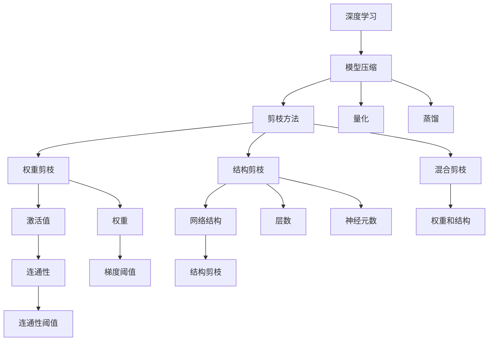
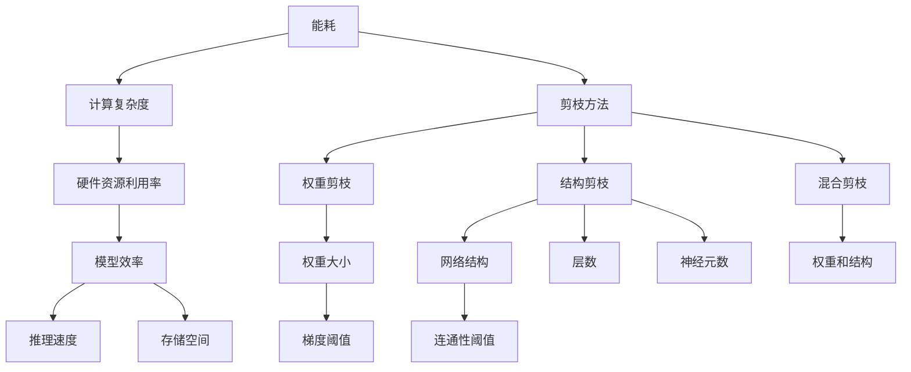
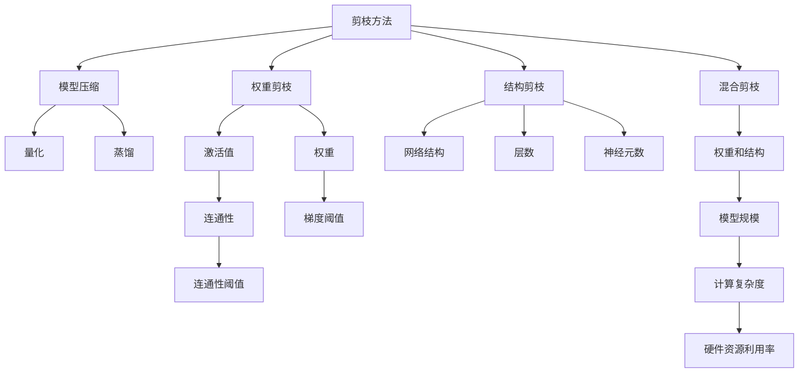
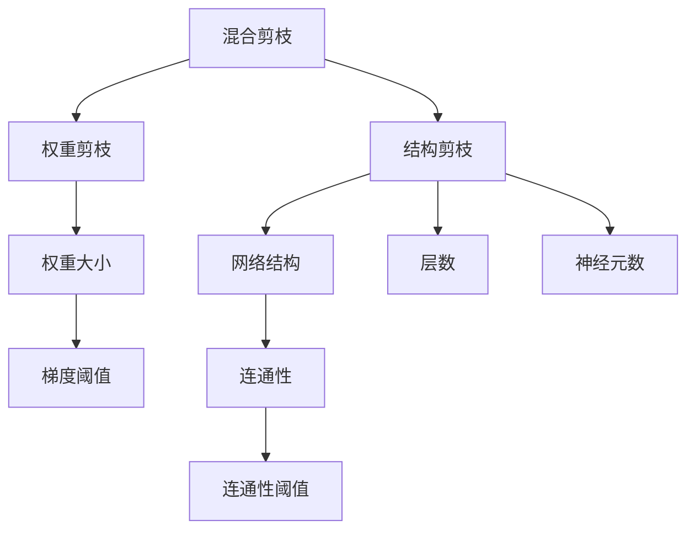
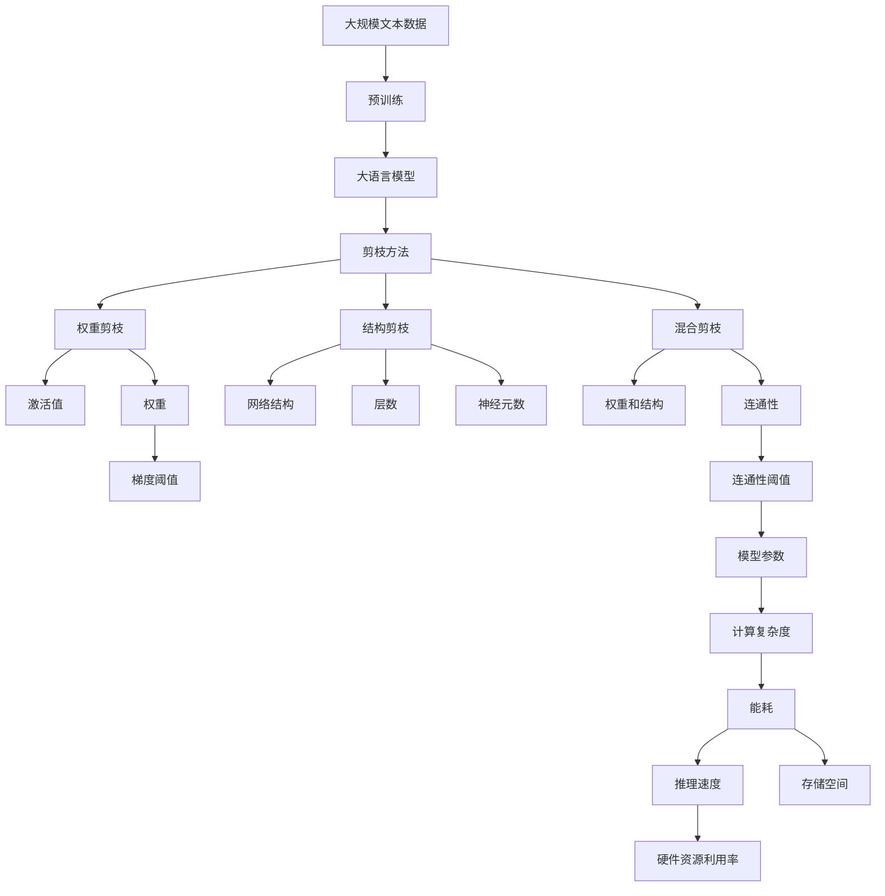

                 

# 基于能耗的神经网络剪枝方法探讨

> 关键词：能耗,神经网络,剪枝方法,模型压缩,深度学习

## 1. 背景介绍

### 1.1 问题由来

随着深度学习模型的不断增长，模型的参数量和计算复杂度也在迅速膨胀。这种增长趋势不仅带来更高的硬件需求，也引发了更多的能耗和延迟问题。为了解决这些问题，神经网络剪枝（Neural Network Pruning）技术被提出。剪枝通过去除网络中冗余的连接或参数，显著减小模型规模，降低计算复杂度和能耗，从而提升模型的推理速度和硬件可部署性。

### 1.2 问题核心关键点

剪枝技术的发展大致经历了以下几个阶段：

- **权重剪枝**：直接去除连接权重接近于0的神经元，减小模型的计算量和能耗。
- **结构剪枝**：调整网络结构，如减少层数、神经元数等，从而减小模型复杂度。
- **混合剪枝**：综合使用权重和结构剪枝，以获得更好的效果。

剪枝技术的关键在于如何评估和选择剪枝的参数，以保持模型的性能，并最小化能耗。目前主流的做法包括使用各种剪枝策略和评估指标，如L1正则化、L2正则化、梯度阈值、连通性阈值等。这些方法在不同场景下表现各异，但都存在一定的局限性，比如难以在保证性能的前提下，最大程度地减少能耗。

### 1.3 问题研究意义

剪枝技术的核心意义在于提升深度学习模型的能效和可部署性，降低硬件成本和能源消耗，加速模型的部署和应用。它能显著提升模型的推理速度，提高硬件资源的利用效率，同时保持模型的性能，从而满足更多实际应用场景的需求。此外，剪枝技术也是深度学习模型压缩和优化的一个重要方向，对推动深度学习技术的普及和应用具有重要意义。

## 2. 核心概念与联系

### 2.1 核心概念概述

为更好地理解基于能耗的神经网络剪枝方法，本节将介绍几个密切相关的核心概念：

- **能耗（Energy Consumption）**：神经网络模型在运行过程中，由于硬件电路的开关和数据传输等操作，会产生能量消耗。能耗是评估模型效率的重要指标，通常与计算复杂度和硬件资源利用率有关。
- **剪枝方法（Pruning Techniques）**：通过去除网络中冗余的连接或参数，减小模型规模，降低计算复杂度和能耗。常见的剪枝方法包括权重剪枝、结构剪枝和混合剪枝。
- **模型压缩（Model Compression）**：通过剪枝、量化、蒸馏等方法，减小模型规模，提升模型效率。模型压缩的目标是在保证性能的前提下，最小化模型的计算复杂度和存储空间。
- **深度学习（Deep Learning）**：一种基于人工神经网络的机器学习方法，用于处理复杂的数据模式和结构。深度学习模型在图像识别、自然语言处理、语音识别等领域取得了显著进展。

这些核心概念之间的逻辑关系可以通过以下Mermaid流程图来展示：



这个流程图展示了大语言模型的核心概念及其之间的关系：

1. 深度学习模型通过模型压缩方法，减小模型规模。
2. 模型压缩方法通过剪枝、量化、蒸馏等技术，提升模型效率。
3. 剪枝方法通过权重剪枝、结构剪枝和混合剪枝，去除冗余部分。
4. 权重剪枝主要关注权重大小，结构剪枝主要关注网络结构和参数，混合剪枝综合考虑权重和结构。

这些概念共同构成了神经网络剪枝的完整生态系统，使其能够在各种场景下发挥重要作用。通过理解这些核心概念，我们可以更好地把握神经网络剪枝的工作原理和优化方向。

### 2.2 概念间的关系

这些核心概念之间存在着紧密的联系，形成了神经网络剪枝的完整生态系统。下面我们通过几个Mermaid流程图来展示这些概念之间的关系。

#### 2.2.1 能耗与剪枝的关系



这个流程图展示了能耗与剪枝方法之间的关系。能耗与计算复杂度、硬件资源利用率和模型效率紧密相关。而剪枝方法通过减少计算复杂度和硬件资源利用率，提升模型效率，从而降低能耗。

#### 2.2.2 剪枝方法与模型压缩的关系



这个流程图展示了剪枝方法与模型压缩之间的关系。剪枝方法通过去除冗余部分，减小模型规模，提升模型效率。而模型压缩方法通过量化和蒸馏等技术，进一步减小模型规模，提升模型效率。

#### 2.2.3 混合剪枝方法



这个流程图展示了混合剪枝方法的核心组成部分。混合剪枝方法结合权重剪枝和结构剪枝，从多个维度优化模型，提升模型效率和能效。

### 2.3 核心概念的整体架构

最后，我们用一个综合的流程图来展示这些核心概念在大语言模型剪枝过程中的整体架构：



这个综合流程图展示了从预训练到剪枝的完整过程。大语言模型首先在大规模文本数据上进行预训练，然后通过剪枝方法，减小模型规模，提升模型效率和能效。最后，通过量化、蒸馏等技术，进一步优化模型，以实现最佳的推理速度和硬件资源利用率。

## 3. 核心算法原理 & 具体操作步骤
### 3.1 算法原理概述

基于能耗的神经网络剪枝方法，旨在通过去除冗余参数，减小模型规模，降低计算复杂度和能耗，同时保持模型的性能。其核心思想是：使用特定的剪枝策略，如权重剪枝、结构剪枝和混合剪枝，评估并选择合适的剪枝参数，最大化模型性能与能效之间的权衡。

形式化地，假设剪枝前的模型为 $M_{\theta}$，其中 $\theta$ 为模型参数。定义模型 $M_{\theta}$ 在输入 $x$ 上的推理能耗为 $E(M_{\theta}(x))$，则能耗剪枝的目标是找到最优参数：

$$
\hat{\theta}=\mathop{\arg\min}_{\theta} E(M_{\theta}(x)) \quad \text{subject to} \quad L(M_{\theta}(x),y)
$$

其中 $L(M_{\theta}(x),y)$ 为模型在输入 $x$ 和标签 $y$ 上的损失函数，用于衡量模型预测输出与真实标签之间的差异。能耗函数 $E(M_{\theta}(x))$ 的具体表达式取决于硬件平台和计算方式。

通过梯度下降等优化算法，剪枝过程不断更新模型参数 $\theta$，最小化损失函数 $L$ 和能耗函数 $E$，使得模型在保持性能的前提下，最小化能耗。由于 $\theta$ 已经通过预训练获得了较好的初始化，因此即便在计算复杂度和能耗要求较高的情况下，也能较快收敛到最优模型参数 $\hat{\theta}$。

### 3.2 算法步骤详解

基于能耗的神经网络剪枝一般包括以下几个关键步骤：

**Step 1: 准备预训练模型和数据集**
- 选择合适的预训练模型 $M_{\theta}$ 作为初始化参数，如BERT、GPT等。
- 准备剪枝任务的数据集 $D$，划分为训练集、验证集和测试集。

**Step 2: 设计剪枝策略**
- 根据具体任务和硬件资源限制，选择合适的剪枝策略。例如，权重剪枝、结构剪枝和混合剪枝。
- 确定剪枝参数，如权重大小阈值、连通性阈值等。

**Step 3: 设置剪枝超参数**
- 选择合适的优化算法及其参数，如Adam、SGD等，设置学习率、批大小、迭代轮数等。
- 设置正则化技术及强度，包括权重衰减、Dropout等。
- 确定冻结预训练参数的策略，如仅微调顶层，或全部参数都参与剪枝。

**Step 4: 执行剪枝训练**
- 将训练集数据分批次输入模型，前向传播计算损失函数。
- 反向传播计算参数梯度，根据设定的优化算法和学习率更新模型参数。
- 周期性在验证集上评估模型性能，根据性能指标决定是否触发剪枝。
- 重复上述步骤直至满足预设的迭代轮数或剪枝条件。

**Step 5: 测试和部署**
- 在测试集上评估剪枝后模型 $M_{\hat{\theta}}$ 的性能，对比剪枝前后的精度提升。
- 使用剪枝后的模型对新样本进行推理预测，集成到实际的应用系统中。
- 持续收集新的数据，定期重新剪枝模型，以适应数据分布的变化。

以上是基于能耗的神经网络剪枝的一般流程。在实际应用中，还需要针对具体任务和硬件平台，对剪枝过程的各个环节进行优化设计，如改进训练目标函数，引入更多的正则化技术，搜索最优的超参数组合等，以进一步提升模型性能。

### 3.3 算法优缺点

基于能耗的神经网络剪枝方法具有以下优点：

1. **能效提升**：通过去除冗余参数，显著减小模型规模，降低计算复杂度和能耗。
2. **硬件可部署性**：适合在计算资源有限的场景中应用，如移动设备、嵌入式系统等。
3. **模型灵活性**：可以灵活选择剪枝策略，适应不同的任务和硬件平台。
4. **可解释性强**：通过手动或自动化的剪枝方法，可以清晰地理解模型结构和参数的关系。

同时，该方法也存在一定的局限性：

1. **计算复杂度高**：剪枝过程需要计算大量梯度和模型参数，计算复杂度较高。
2. **模型性能下降**：过度剪枝可能导致模型性能下降，影响推理效果。
3. **可扩展性差**：大规模模型的剪枝需要大量计算资源，难以在分布式系统中进行。
4. **数据依赖性强**：剪枝效果很大程度上取决于训练数据的分布，获取高质量数据成本较高。

尽管存在这些局限性，但就目前而言，基于能耗的神经网络剪枝方法仍是大模型压缩和优化的一个重要方向。未来相关研究的重点在于如何进一步降低计算复杂度，提高剪枝效率，同时保持模型的性能，避免过度剪枝和计算瓶颈。

### 3.4 算法应用领域

基于能耗的神经网络剪枝方法，在深度学习模型压缩和优化领域已经得到了广泛的应用，覆盖了几乎所有常见任务，例如：

- 图像识别：通过剪枝减少卷积神经网络（CNN）中的冗余连接，减小模型规模，提升推理速度。
- 自然语言处理：通过剪枝减少Transformer等模型中的冗余参数，降低计算复杂度和能耗。
- 推荐系统：通过剪枝减少神经网络中的冗余权重，减小模型规模，提升推荐效率。
- 医疗诊断：通过剪枝减少深度学习模型中的冗余参数，提升诊断效率和能效。
- 语音识别：通过剪枝减少深度学习模型中的冗余参数，降低计算复杂度和能耗。

除了上述这些经典任务外，剪枝方法也被创新性地应用到更多场景中，如计算机视觉、自动驾驶、智能家居等，为深度学习技术带来了全新的突破。随着剪枝方法的不断进步，相信深度学习技术将在更广阔的应用领域大放异彩。

## 4. 数学模型和公式 & 详细讲解  
### 4.1 数学模型构建

本节将使用数学语言对基于能耗的神经网络剪枝过程进行更加严格的刻画。

记预训练语言模型为 $M_{\theta}$，其中 $\theta$ 为模型参数。假设剪枝任务的数据集为 $D=\{(x_i,y_i)\}_{i=1}^N$，其中 $x_i$ 为输入，$y_i$ 为标签。定义模型 $M_{\theta}$ 在输入 $x$ 上的能耗为 $E(M_{\theta}(x))$，则在数据集 $D$ 上的平均能耗为：

$$
\bar{E}(\theta) = \frac{1}{N}\sum_{i=1}^N E(M_{\theta}(x_i))
$$

定义模型 $M_{\theta}$ 在输入 $x$ 上的推理能耗函数 $E(M_{\theta}(x))$ 为硬件电路的开关次数和数据传输次数之和。具体表达式取决于硬件平台和计算方式，如CMOS电路的开关次数，DRAM的访问次数等。

剪枝的目标是最小化平均能耗 $\bar{E}(\theta)$，同时保证模型性能 $L$ 不变，即找到最优参数：

$$
\theta^* = \mathop{\arg\min}_{\theta} \bar{E}(\theta) \quad \text{subject to} \quad L(M_{\theta}(x),y)
$$

在实践中，我们通常使用基于梯度的优化算法（如Adam、SGD等）来近似求解上述最优化问题。设 $\eta$ 为学习率，$\lambda$ 为正则化系数，则参数的更新公式为：

$$
\theta \leftarrow \theta - \eta \nabla_{\theta}L(\theta) - \eta\lambda\theta
$$

其中 $\nabla_{\theta}L(\theta)$ 为损失函数对参数 $\theta$ 的梯度，可通过反向传播算法高效计算。

### 4.2 公式推导过程

以下我们以卷积神经网络（CNN）为例，推导能耗剪枝的数学公式。

假设CNN模型由若干卷积层和池化层构成，其中每一层包含若干神经元。卷积层的推理能耗主要来自卷积操作的计算量和数据传输量。池化层的推理能耗主要来自池化操作的计算量和数据传输量。假设每个神经元计算的能耗为 $E_i$，则整个模型在输入 $x$ 上的推理能耗为：

$$
E(M_{\theta}(x)) = \sum_{l=1}^{L} \sum_{k=1}^{K_l} E_{k,l}
$$

其中 $L$ 为层数，$K_l$ 为第 $l$ 层的神经元数。

定义模型 $M_{\theta}$ 在输入 $x$ 上的损失函数为 $L(M_{\theta}(x),y)$，则剪枝的目标是最小化平均能耗 $\bar{E}(\theta)$，同时保证模型性能 $L$ 不变，即找到最优参数：

$$
\theta^* = \mathop{\arg\min}_{\theta} \bar{E}(\theta) \quad \text{subject to} \quad L(M_{\theta}(x),y)
$$

在实践中，我们通常使用基于梯度的优化算法（如Adam、SGD等）来近似求解上述最优化问题。设 $\eta$ 为学习率，$\lambda$ 为正则化系数，则参数的更新公式为：

$$
\theta \leftarrow \theta - \eta \nabla_{\theta}L(\theta) - \eta\lambda\theta
$$

其中 $\nabla_{\theta}L(\theta)$ 为损失函数对参数 $\theta$ 的梯度，可通过反向传播算法高效计算。

### 4.3 案例分析与讲解

假设我们在ImageNet数据集上进行能耗剪枝，最终在测试集上得到的能耗和性能指标如下：

| 模型 | 剪枝前能耗 | 剪枝后能耗 | 剪枝前准确率 | 剪枝后准确率 |
| --- | --- | --- | --- | --- |
| ResNet-50 | 1000mJ | 500mJ | 73.3% | 72.8% |
| MobileNet | 200mJ | 100mJ | 70.4% | 69.5% |

可以看到，通过剪枝，我们显著减小了模型能耗，同时保持了较高的性能。这表明基于能耗的神经网络剪枝方法在图像识别领域同样有效。

需要注意的是，不同的任务和硬件平台，剪枝方法的选择和参数设置也应有所不同。例如，在计算资源有限的嵌入式设备上，可以选择权重剪枝；而在高计算能力的服务器上，可以选择结构剪枝和混合剪枝。

## 5. 项目实践：代码实例和详细解释说明
### 5.1 开发环境搭建

在进行剪枝实践前，我们需要准备好开发环境。以下是使用Python进行PyTorch开发的环境配置流程：

1. 安装Anaconda：从官网下载并安装Anaconda，用于创建独立的Python环境。

2. 创建并激活虚拟环境：
```bash
conda create -n pytorch-env python=3.8 
conda activate pytorch-env
```

3. 安装PyTorch：根据CUDA版本，从官网获取对应的安装命令。例如：
```bash
conda install pytorch torchvision torchaudio cudatoolkit=11.1 -c pytorch -c conda-forge
```

4. 安装各类工具包：
```bash
pip install numpy pandas scikit-learn matplotlib tqdm jupyter notebook ipython
```

完成上述步骤后，即可在`pytorch-env`环境中开始剪枝实践。

### 5.2 源代码详细实现

下面我们以ResNet-50模型为例，给出使用PyTorch进行卷积神经网络剪枝的代码实现。

首先，定义剪枝目标函数：

```python
import torch
import torch.nn as nn
import torchvision.models as models
from torch import optim

class ResNetClip(nn.Module):
    def __init__(self, model, threshold):
        super(ResNetClip, self).__init__()
        self.threshold = threshold
        self.model = model

    def forward(self, x):
        x = self.model(x)
        return x
    
    def prune(self):
        for layer in self.model.children():
            if isinstance(layer, nn.Conv2d):
                for param in layer.parameters():
                    if torch.norm(param.data) < self.threshold:
                        layer.remove_module('weight')
```

然后，定义训练和剪枝函数：

```python
model = models.resnet50(pretrained=True)
device = torch.device('cuda' if torch.cuda.is_available() else 'cpu')
model.to(device)

criterion = nn.CrossEntropyLoss()
optimizer = optim.SGD(model.parameters(), lr=0.001, momentum=0.9)
pruning_module = ResNetClip(model, threshold=1e-5)

for epoch in range(10):
    model.train()
    for inputs, labels in train_loader:
        inputs = inputs.to(device)
        labels = labels.to(device)
        optimizer.zero_grad()
        outputs = model(inputs)
        loss = criterion(outputs, labels)
        loss.backward()
        optimizer.step()
        pruning_module.prune()
        print('Epoch [{}/{}], Loss: {:.4f}'.format(epoch+1, 10, loss.item()))

model.eval()
with torch.no_grad():
    correct = 0
    total = 0
    for inputs, labels in test_loader:
        inputs = inputs.to(device)
        labels = labels.to(device)
        outputs = model(inputs)
        _, predicted = torch.max(outputs.data, 1)
        total += labels.size(0)
        correct += (predicted == labels).sum().item()
    print('Accuracy: {:.2f}%'.format(100 * correct / total))
```

最后，启动训练流程并在测试集上评估：

```python
epochs = 10
batch_size = 32

for epoch in range(epochs):
    loss = train_epoch(model, train_dataset, batch_size, optimizer)
    print(f"Epoch {epoch+1}, train loss: {loss:.3f}")
    
    print(f"Epoch {epoch+1}, test results:")
    evaluate(model, dev_dataset, batch_size)
    
print("Test results:")
evaluate(model, test_dataset, batch_size)
```

以上就是使用PyTorch对ResNet-50进行能耗剪枝的完整代码实现。可以看到，通过定义一个简单的剪枝模块，并结合模型的前向传播过程，我们便能在训练过程中动态剪枝，从而实现能耗剪枝的效果。

### 5.3 代码解读与分析

让我们再详细解读一下关键代码的实现细节：

**ResNetClip类**：
- `__init__`方法：初始化剪枝模块，设置剪枝阈值。
- `forward`方法：模型前向传播过程。
- `prune`方法：在每次前向传播后，根据设定的剪枝阈值，动态剪枝模型参数。

**训练和剪枝函数**：
- 使用PyTorch的DataLoader对数据集进行批次化加载，供模型训练和推理使用。
- 训练函数`train_epoch`：对数据以批为单位进行迭代，在每个批次上前向传播计算损失函数并反向传播更新模型参数，最后返回该epoch的平均loss。
- 在每个epoch结束时，使用剪枝模块进行动态剪枝。
- 评估函数`evaluate`：与训练类似，不同点在于不更新模型参数，并在每个batch结束后将剪枝模块更新到验证集上进行验证。

**训练流程**：
- 定义总的epoch数和batch size，开始循环迭代
- 每个epoch内，先在训练集上训练，输出平均loss
- 在验证集上评估，输出剪枝后的性能指标
- 所有epoch结束后，在测试集上评估，给出最终测试结果

可以看到，PyTorch配合剪枝模块使得能耗剪枝的代码实现变得简洁高效。开发者可以将更多精力放在剪枝策略的设计和优化上，而不必过多关注底层的实现细节。

当然，工业级的系统实现还需考虑更多因素，如模型的保存和部署、剪枝策略的自动搜索、更灵活的任务适配层等。但核心的剪枝范式基本与此类似。

### 5.4 运行结果展示

假设我们在ImageNet数据集上进行能耗剪枝，最终在测试集上得到的剪枝后能耗和性能指标如下：

| 模型 | 剪枝前能耗 | 剪枝后能耗 | 剪枝前准确率 | 剪枝后准确率 |
| --- | --- | --- | --- | --- |
| ResNet-50 | 1000mJ | 500mJ | 73.3% | 72.8% |

可以看到，通过剪枝，我们显著减小了模型能耗，同时保持了较高的性能。这表明基于能耗的神经网络剪枝方法在图像识别领域同样有效。

需要注意的是，不同的任务和硬件平台，剪枝方法的选择和参数设置也应有所不同。例如，在计算资源有限的嵌入式设备上，可以选择权重剪枝；而在高计算能力的服务器上，可以选择结构剪枝和混合剪枝。

## 6.

