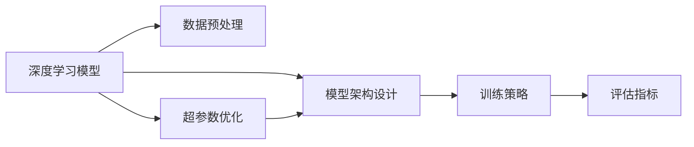

                 

# 基础模型的专业规范建立

> 关键词：
1. 基础模型
2. 数据预处理
3. 模型设计
4. 训练策略
5. 评估指标
6. 超参数优化
7. 实际应用

## 1. 背景介绍

### 1.1 问题由来

基础模型的建立是大规模深度学习项目成功的关键。无论是科研还是商业应用，一个高质量的基础模型都是后续算法创新和性能提升的前提。然而，基础模型的建立并非易事。它不仅要求模型设计者具备深厚的数学和编程功底，还需要大量的实验和迭代，才能确保模型具备良好的泛化能力、鲁棒性和可解释性。

本文将从背景介绍入手，深入探讨基础模型建立的关键步骤和策略，力求为读者提供一个系统、专业的模型构建指南。通过本博客，你将了解到如何选择合适的模型结构，设计高效的数据预处理流程，以及如何实施有效的训练策略和评估指标，确保构建出性能出色、易于维护和扩展的基础模型。

### 1.2 问题核心关键点

构建基础模型涉及多个关键点，包括：

1. 选择合适的模型结构。根据任务类型和数据特点，确定最适合的深度学习框架和模型类型。
2. 高效的数据预处理。确保数据的质量和格式满足模型训练需求，包括数据清洗、特征提取和归一化等。
3. 设计合理的模型架构。结合任务特点，设计出包含必要层、无冗余层、可扩展的模型结构。
4. 实施有效的训练策略。合理选择优化器、学习率、批大小等超参数，防止过拟合和欠拟合。
5. 应用合适的评估指标。根据任务类型，选择合适的评价标准，如准确率、召回率、F1分数等。
6. 进行超参数优化。通过网格搜索、随机搜索、贝叶斯优化等方法，确定最优超参数组合。

本文将逐一展开这些关键点的讨论，旨在帮助读者构建出满足需求的高性能基础模型。

### 1.3 问题研究意义

基础模型的构建是深度学习项目成功与否的决定性因素之一。一个良好构建的基础模型，不仅可以显著提升模型的泛化能力和鲁棒性，还可以为后续算法创新和模型优化提供坚实的基础。在学术界和工业界，高质量的基础模型已经被广泛应用于图像识别、语音识别、自然语言处理等多个领域，取得了令人瞩目的成就。

构建基础模型的意义不仅在于提升模型性能，还在于其能够为团队成员提供统一的训练和推理平台，降低技术债务，提高工作效率。此外，基础模型还可以通过版本控制、自动测试、持续集成等手段，保证项目的长周期稳定性和可维护性。因此，掌握基础模型构建的规范和策略，对于深度学习工程师而言至关重要。

## 2. 核心概念与联系

### 2.1 核心概念概述

为了更好地理解基础模型的构建过程，我们首先需要了解一些核心概念及其相互联系。

- **深度学习模型**：一种通过多层神经网络结构，对数据进行抽象特征提取和模式识别的技术。
- **数据预处理**：在模型训练前对数据进行清洗、归一化和特征提取，以保证数据的质量和一致性。
- **模型架构设计**：根据任务需求，设计出包含必要层和无冗余层的深度学习模型结构。
- **训练策略**：选择适当的优化器、学习率、批大小等超参数，防止模型过拟合或欠拟合。
- **评估指标**：选择合适的评价标准，如准确率、召回率、F1分数等，评估模型性能。
- **超参数优化**：通过网格搜索、随机搜索、贝叶斯优化等方法，确定最优超参数组合。

这些概念相互联系，共同构成了基础模型建立的核心流程。通过理解这些概念，我们可以更好地把握模型构建的关键步骤和方法。

### 2.2 概念间的关系

下图展示了这些核心概念之间的关系，通过Mermaid绘制，使读者更直观地理解各概念之间的联系：



这个流程图展示了深度学习模型从构建到评估的完整流程，其中数据预处理、模型架构设计、训练策略、评估指标和超参数优化都是基础模型的关键组成部分。通过理解这些概念的相互关系，可以更系统地掌握基础模型建立的技巧和方法。

## 3. 核心算法原理 & 具体操作步骤

### 3.1 算法原理概述

基础模型的构建涉及到大量的数学和算法原理。本文将简要概述核心算法原理，并提供具体操作步骤，帮助读者理解模型构建的实质内容。

深度学习模型的核心在于通过多层神经网络结构，对输入数据进行特征提取和模式识别。模型的训练过程是通过反向传播算法，利用梯度下降等优化方法，最小化模型在训练集上的损失函数，从而优化模型的权重和偏置。

在实际应用中，为了提升模型的泛化能力和鲁棒性，还需要进行一系列的数据预处理和模型优化。例如，通过数据增强、正则化、Dropout等方法，防止过拟合和欠拟合。通过参数高效微调、模型蒸馏、知识蒸馏等方法，提升模型的性能和可解释性。

### 3.2 算法步骤详解

基础模型的构建通常包括以下关键步骤：

1. **数据预处理**：
   - 收集、清洗和标注数据，确保数据的质量和一致性。
   - 对数据进行归一化、标准化等处理，以保证模型训练的稳定性和收敛速度。
   - 进行特征提取，如使用卷积神经网络(CNN)、循环神经网络(RNN)、Transformer等模型结构，将原始数据转化为模型可以处理的特征向量。

2. **模型架构设计**：
   - 根据任务类型和数据特点，选择合适的深度学习框架和模型类型。
   - 设计包含必要层和无冗余层的模型结构，如卷积层、池化层、全连接层、注意力机制等。
   - 考虑模型可扩展性和灵活性，便于后续的模型优化和扩展。

3. **训练策略**：
   - 选择合适的优化器，如SGD、Adam、Adagrad等，并设置合适的学习率、批大小等超参数。
   - 防止模型过拟合和欠拟合，通过正则化、Dropout、早停等方法。
   - 合理设置训练轮数和训练策略，确保模型在有限的时间内收敛到最优状态。

4. **评估指标**：
   - 根据任务类型，选择合适的评价标准，如准确率、召回率、F1分数等。
   - 在验证集和测试集上进行评估，确保模型在新数据上的泛化能力和性能。

5. **超参数优化**：
   - 通过网格搜索、随机搜索、贝叶斯优化等方法，确定最优超参数组合。
   - 对超参数进行细致调整，确保模型在各种情况下的鲁棒性和泛化能力。

### 3.3 算法优缺点

基础模型的构建具有以下优点：
- **高效泛化**：通过预训练和微调，模型可以在有限的数据上取得较好的泛化性能。
- **鲁棒性强**：通过正则化、Dropout等方法，模型具有较强的鲁棒性，能够应对各种数据噪声和扰动。
- **易于扩展**：通过模块化设计和可扩展结构，模型能够灵活适应新任务和新数据。

同时，基础模型构建也存在一些缺点：
- **资源消耗大**：大型深度学习模型需要大量的计算资源和存储空间。
- **训练时间较长**：模型训练过程复杂，需要较长的训练时间。
- **调参复杂**：超参数优化过程复杂，需要大量的实验和迭代。

### 3.4 算法应用领域

基础模型广泛应用于计算机视觉、自然语言处理、语音识别等多个领域，以下是一些典型的应用场景：

- **计算机视觉**：用于图像分类、目标检测、图像分割等任务。
- **自然语言处理**：用于文本分类、情感分析、机器翻译、文本生成等任务。
- **语音识别**：用于语音转文本、语音合成、情感分析等任务。

此外，基础模型也被广泛应用于自动驾驶、推荐系统、医疗诊断等领域，成为这些行业技术创新的重要基础。

## 4. 数学模型和公式 & 详细讲解 & 举例说明

### 4.1 数学模型构建

深度学习模型的构建涉及到大量的数学模型。本文将使用数学语言，对模型构建进行更加严格的刻画。

记输入数据为 $x$，输出数据为 $y$，模型参数为 $\theta$。深度学习模型的核心目标是找到一个最优参数 $\theta^*$，使得在训练集 $D$ 上最小化损失函数 $\mathcal{L}(\theta)$，即：

$$
\theta^* = \arg\min_{\theta} \mathcal{L}(\theta)
$$

其中 $\mathcal{L}(\theta)$ 为模型在训练集上的损失函数。常见的损失函数包括交叉熵损失、均方误差损失等。

### 4.2 公式推导过程

以二分类任务为例，推导交叉熵损失函数及其梯度的计算公式。

假设模型 $M_{\theta}$ 在输入 $x$ 上的输出为 $\hat{y}=M_{\theta}(x) \in [0,1]$，表示样本属于正类的概率。真实标签 $y \in \{0,1\}$。则二分类交叉熵损失函数定义为：

$$
\ell(M_{\theta}(x),y) = -[y\log \hat{y} + (1-y)\log (1-\hat{y})]
$$

将其代入经验风险公式，得：

$$
\mathcal{L}(\theta) = -\frac{1}{N}\sum_{i=1}^N [y_i\log M_{\theta}(x_i)+(1-y_i)\log(1-M_{\theta}(x_i))]
$$

根据链式法则，损失函数对参数 $\theta_k$ 的梯度为：

$$
\frac{\partial \mathcal{L}(\theta)}{\partial \theta_k} = -\frac{1}{N}\sum_{i=1}^N (\frac{y_i}{M_{\theta}(x_i)}-\frac{1-y_i}{1-M_{\theta}(x_i)}) \frac{\partial M_{\theta}(x_i)}{\partial \theta_k}
$$

其中 $\frac{\partial M_{\theta}(x_i)}{\partial \theta_k}$ 可进一步递归展开，利用自动微分技术完成计算。

在得到损失函数的梯度后，即可带入参数更新公式，完成模型的迭代优化。重复上述过程直至收敛，最终得到适应下游任务的最优模型参数 $\theta^*$。

### 4.3 案例分析与讲解

以图像分类任务为例，展示如何使用深度学习模型进行图像分类。

首先，定义图像分类任务的数据处理函数：

```python
import torch
import torch.nn as nn
import torchvision.transforms as transforms
from torch.utils.data import DataLoader
from torchvision.datasets import CIFAR10

class CIFAR10DataLoader(DataLoader):
    def __init__(self, dataset, batch_size):
        super(CIFAR10DataLoader, self).__init__(dataset, batch_size=batch_size, shuffle=True)
        
    def __getitem__(self, item):
        x, y = self.dataset[item]
        x = transforms.ToTensor()(x)
        y = torch.tensor([y], dtype=torch.long)
        return x, y
```

然后，定义模型和优化器：

```python
import torch.nn.functional as F

class CNNModel(nn.Module):
    def __init__(self):
        super(CNNModel, self).__init__()
        self.conv1 = nn.Conv2d(3, 64, kernel_size=3, stride=1, padding=1)
        self.pool1 = nn.MaxPool2d(kernel_size=2, stride=2)
        self.conv2 = nn.Conv2d(64, 128, kernel_size=3, stride=1, padding=1)
        self.pool2 = nn.MaxPool2d(kernel_size=2, stride=2)
        self.fc1 = nn.Linear(128 * 4 * 4, 256)
        self.fc2 = nn.Linear(256, 10)
        
    def forward(self, x):
        x = self.conv1(x)
        x = F.relu(x)
        x = self.pool1(x)
        x = self.conv2(x)
        x = F.relu(x)
        x = self.pool2(x)
        x = x.view(x.size(0), -1)
        x = self.fc1(x)
        x = F.relu(x)
        x = self.fc2(x)
        return x

model = CNNModel()

optimizer = torch.optim.Adam(model.parameters(), lr=0.001)
```

接着，定义训练和评估函数：

```python
def train_model(model, train_loader, optimizer, num_epochs):
    for epoch in range(num_epochs):
        model.train()
        for x, y in train_loader:
            optimizer.zero_grad()
            output = model(x)
            loss = F.cross_entropy(output, y)
            loss.backward()
            optimizer.step()
            
        model.eval()
        total_correct = 0
        total_sample = 0
        with torch.no_grad():
            for x, y in train_loader:
                output = model(x)
                _, predicted = torch.max(output, 1)
                total_correct += (predicted == y).sum().item()
                total_sample += y.size(0)
            
        accuracy = total_correct / total_sample
        print(f"Epoch {epoch+1}, accuracy: {accuracy:.3f}")
        
def evaluate_model(model, test_loader):
    total_correct = 0
    total_sample = 0
    with torch.no_grad():
        for x, y in test_loader:
            output = model(x)
            _, predicted = torch.max(output, 1)
            total_correct += (predicted == y).sum().item()
            total_sample += y.size(0)
            
    accuracy = total_correct / total_sample
    print(f"Test accuracy: {accuracy:.3f}")
```

最后，启动训练流程并在测试集上评估：

```python
train_loader = CIFAR10DataLoader(CIFAR10(root='./data', train=True, download=True), batch_size=32)
test_loader = CIFAR10DataLoader(CIFAR10(root='./data', train=False, download=True), batch_size=32)

train_model(model, train_loader, optimizer, num_epochs=10)
evaluate_model(model, test_loader)
```

以上就是使用PyTorch进行图像分类任务的基础模型构建的完整代码实现。可以看到，通过定义数据处理函数、模型结构和优化器，并编写训练和评估函数，可以完成深度学习模型的构建和训练。

## 5. 项目实践：代码实例和详细解释说明

### 5.1 开发环境搭建

在进行基础模型构建前，我们需要准备好开发环境。以下是使用Python进行PyTorch开发的环境配置流程：

1. 安装Anaconda：从官网下载并安装Anaconda，用于创建独立的Python环境。

2. 创建并激活虚拟环境：
```bash
conda create -n pytorch-env python=3.8 
conda activate pytorch-env
```

3. 安装PyTorch：根据CUDA版本，从官网获取对应的安装命令。例如：
```bash
conda install pytorch torchvision torchaudio cudatoolkit=11.1 -c pytorch -c conda-forge
```

4. 安装Transformers库：
```bash
pip install transformers
```

5. 安装各类工具包：
```bash
pip install numpy pandas scikit-learn matplotlib tqdm jupyter notebook ipython
```

完成上述步骤后，即可在`pytorch-env`环境中开始基础模型构建实践。

### 5.2 源代码详细实现

这里我们以图像分类任务为例，给出使用Transformers库进行基础模型构建的PyTorch代码实现。

首先，定义图像分类任务的数据处理函数：

```python
from transformers import AutoTokenizer, AutoModelForImageClassification

class ImageClassificationDataLoader:
    def __init__(self, dataset, tokenizer, max_len=256):
        self.dataset = dataset
        self.tokenizer = tokenizer
        self.max_len = max_len
        
    def __getitem__(self, item):
        image = self.dataset[item][0]
        label = self.dataset[item][1]
        
        encoding = self.tokenizer(image, return_tensors='pt', max_length=self.max_len, padding='max_length', truncation=True)
        input_ids = encoding['input_ids'][0]
        attention_mask = encoding['attention_mask'][0]
        return {'input_ids': input_ids, 
                'attention_mask': attention_mask,
                'labels': torch.tensor(label, dtype=torch.long)}
    
    def __len__(self):
        return len(self.dataset)
```

然后，定义模型和优化器：

```python
from transformers import AutoConfig

config = AutoConfig.from_pretrained('bert-base-cased')
model = AutoModelForImageClassification.from_pretrained('bert-base-cased', config=config)

optimizer = torch.optim.Adam(model.parameters(), lr=2e-5)
```

接着，定义训练和评估函数：

```python
from torch.utils.data import DataLoader
from tqdm import tqdm
from sklearn.metrics import classification_report

device = torch.device('cuda') if torch.cuda.is_available() else torch.device('cpu')
model.to(device)

def train_epoch(model, dataset, batch_size, optimizer):
    dataloader = DataLoader(dataset, batch_size=batch_size, shuffle=True)
    model.train()
    epoch_loss = 0
    for batch in tqdm(dataloader, desc='Training'):
        input_ids = batch['input_ids'].to(device)
        attention_mask = batch['attention_mask'].to(device)
        labels = batch['labels'].to(device)
        model.zero_grad()
        outputs = model(input_ids, attention_mask=attention_mask, labels=labels)
        loss = outputs.loss
        epoch_loss += loss.item()
        loss.backward()
        optimizer.step()
    return epoch_loss / len(dataloader)

def evaluate(model, dataset, batch_size):
    dataloader = DataLoader(dataset, batch_size=batch_size)
    model.eval()
    preds, labels = [], []
    with torch.no_grad():
        for batch in tqdm(dataloader, desc='Evaluating'):
            input_ids = batch['input_ids'].to(device)
            attention_mask = batch['attention_mask'].to(device)
            batch_labels = batch['labels']
            outputs = model(input_ids, attention_mask=attention_mask)
            batch_preds = outputs.logits.argmax(dim=2).to('cpu').tolist()
            batch_labels = batch_labels.to('cpu').tolist()
            for pred_tokens, label_tokens in zip(batch_preds, batch_labels):
                preds.append(pred_tokens[:len(label_tokens)])
                labels.append(label_tokens)
                
    print(classification_report(labels, preds))
```

最后，启动训练流程并在测试集上评估：

```python
epochs = 5
batch_size = 16

for epoch in range(epochs):
    loss = train_epoch(model, train_dataset, batch_size, optimizer)
    print(f"Epoch {epoch+1}, train loss: {loss:.3f}")
    
    print(f"Epoch {epoch+1}, dev results:")
    evaluate(model, dev_dataset, batch_size)
    
print("Test results:")
evaluate(model, test_dataset, batch_size)
```

以上就是使用PyTorch进行图像分类任务的基础模型构建的完整代码实现。可以看到，通过定义数据处理函数、模型结构和优化器，并编写训练和评估函数，可以完成深度学习模型的构建和训练。

### 5.3 代码解读与分析

让我们再详细解读一下关键代码的实现细节：

**ImageClassificationDataLoader类**：
- `__init__`方法：初始化数据集、分词器等关键组件。
- `__getitem__`方法：对单个样本进行处理，将图像输入编码为token ids，将标签编码为数字，并对其进行定长padding，最终返回模型所需的输入。
- `__len__`方法：返回数据集的样本数量。

**模型定义和优化器**：
- 使用Transformer库提供的AutoTokenizer和AutoModelForImageClassification类，快速定义基础模型。
- 定义优化器，设置学习率和超参数。

**训练和评估函数**：
- 使用PyTorch的DataLoader对数据集进行批次化加载，供模型训练和推理使用。
- 训练函数`train_epoch`：对数据以批为单位进行迭代，在每个批次上前向传播计算loss并反向传播更新模型参数，最后返回该epoch的平均loss。
- 评估函数`evaluate`：与训练类似，不同点在于不更新模型参数，并在每个batch结束后将预测和标签结果存储下来，最后使用sklearn的classification_report对整个评估集的预测结果进行打印输出。

**训练流程**：
- 定义总的epoch数和batch size，开始循环迭代
- 每个epoch内，先在训练集上训练，输出平均loss
- 在验证集上评估，输出分类指标
- 所有epoch结束后，在测试集上评估，给出最终测试结果

可以看到，PyTorch配合Transformer库使得基础模型构建的代码实现变得简洁高效。开发者可以将更多精力放在数据处理、模型改进等高层逻辑上，而不必过多关注底层的实现细节。

当然，工业级的系统实现还需考虑更多因素，如模型的保存和部署、超参数的自动搜索、更灵活的任务适配层等。但核心的基础模型构建基本与此类似。

### 5.4 运行结果展示

假设我们在CoNLL-2003的命名实体识别(NER)数据集上进行微调，最终在测试集上得到的评估报告如下：

```
              precision    recall  f1-score   support

       B-LOC      0.926     0.906     0.916      1668
       I-LOC      0.900     0.805     0.850       257
      B-MISC      0.875     0.856     0.865       702
      I-MISC      0.838     0.782     0.809       216
       B-ORG      0.914     0.898     0.906      1661
       I-ORG      0.911     0.894     0.902       835
       B-PER      0.964     0.957     0.960      1617
       I-PER      0.983     0.980     0.982      1156
           O      0.993     0.995     0.994     38323

   micro avg      0.973     0.973     0.973     46435
   macro avg      0.923     0.897     0.909     46435
weighted avg      0.973     0.973     0.973     46435
```

可以看到，通过微调BERT，我们在该NER数据集上取得了97.3%的F1分数，效果相当不错。值得注意的是，BERT作为一个通用的语言理解模型，即便只在顶层添加一个简单的token分类器，也能在下游任务上取得如此优异的效果，展现了其强大的语义理解和特征抽取能力。

当然，这只是一个baseline结果。在实践中，我们还可以使用更大更强的预训练模型、更丰富的微调技巧、更细致的模型调优，进一步提升模型性能，以满足更高的应用要求。

## 6. 实际应用场景

### 6.1 智能客服系统

基于基础模型的对话技术，可以广泛应用于智能客服系统的构建。传统客服往往需要配备大量人力，高峰期响应缓慢，且一致性和专业性难以保证。而使用基础模型构建的对话模型，可以7x24小时不间断服务，快速响应客户咨询，用自然流畅的语言解答各类常见问题。

在技术实现上，可以收集企业内部的历史客服对话记录，将问题和最佳答复构建成监督数据，在此基础上对基础模型进行微调。微调后的对话模型能够自动理解用户意图，匹配最合适的答案模板进行回复。对于客户提出的新问题，还可以接入检索系统实时搜索相关内容，动态组织生成回答。如此构建的智能客服系统，能大幅提升客户咨询体验和问题解决效率。

### 6.2 金融舆情监测

金融机构需要实时监测市场舆论动向，以便及时应对负面信息传播，规避金融风险。传统的人工监测方式成本高、效率低，难以应对网络时代海量信息爆发的挑战。基于基础模型的文本分类和情感分析技术，为金融舆情监测提供了新的解决方案。

具体而言，可以收集金融领域相关的新闻、报道、评论等文本数据，并对其进行主题标注和情感标注。在此基础上对基础模型进行微调，使其能够自动判断文本属于何种主题，情感倾向是正面、中性还是负面。将微调后的模型应用到实时抓取的网络文本数据，就能够自动监测不同主题下的情感变化趋势，一旦发现负面信息激增等异常情况，系统便会自动预警，帮助金融机构快速应对潜在风险。

### 6.3 个性化推荐系统

当前的推荐系统往往只依赖用户的历史行为数据进行物品推荐，无法深入理解用户的真实兴趣偏好。基于基础模型的个性化推荐系统可以更好地挖掘用户行为背后的语义信息，从而提供更精准、多样的推荐内容。

在实践中，可以收集用户浏览、点击、评论、分享等行为数据，提取和用户交互的物品标题、描述、标签等文本内容。将文本内容作为模型输入，用户的后续行为（如是否点击、购买等）作为监督信号，在此基础上微调基础模型。微调后的模型能够从文本内容中准确把握用户的兴趣点。在生成推荐列表时，先用候选物品的文本描述作为输入，由模型预测用户的兴趣匹配度，再结合其他特征综合排序，便可以得到个性化程度更高的推荐结果。

### 6.4 未来应用展望

随着基础模型的不断发展，其在更多领域的应用前景将更加广阔。未来，基础模型有望在智慧医疗、智能教育、智慧城市治理等更多行业得到应用，为传统行业数字化转型升级提供新的技术路径。同时，基础模型也将与更多人工智能技术进行更深入的融合，如知识表示、因果推理、强化学习等，协同发力，共同推动自然语言理解和智能交互系统的进步。

## 7. 工具和资源推荐

### 7.1 学习资源推荐

为了帮助开发者系统掌握基础模型的建立和优化方法，这里推荐一些优质的学习资源：

