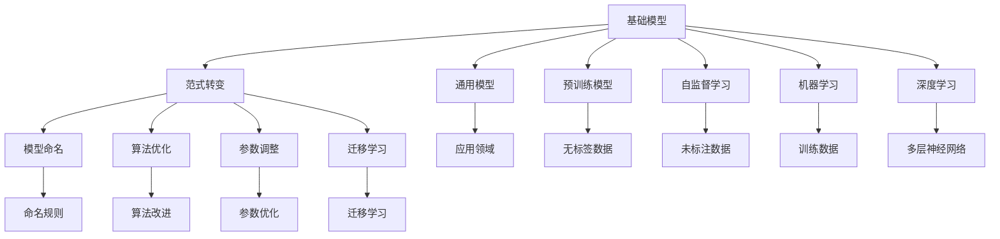
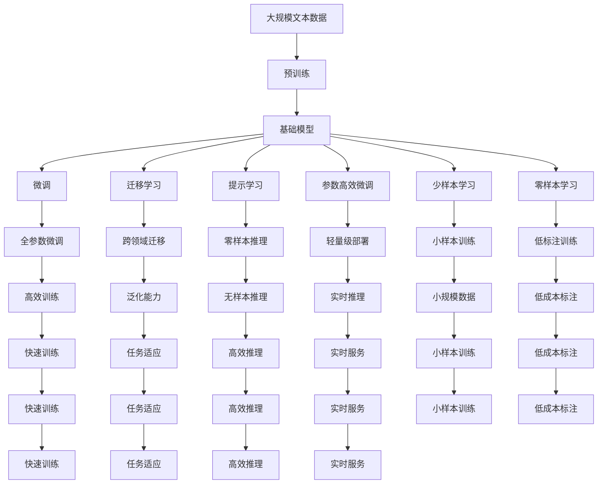

                 

# 基础模型的命名与范式转变

> 关键词：
基础模型，范式转变，通用模型，预训练模型，Transformer，BERT，自监督学习，机器学习，深度学习

## 1. 背景介绍

### 1.1 问题由来
在深度学习领域，模型命名与范式的转变一直是一个备受关注的话题。近年来，随着深度学习技术的飞速发展，基础模型在计算机视觉、自然语言处理（NLP）、语音识别等领域取得了显著的成果。然而，模型命名与范式的转变，使得研究者在使用和开发新模型时，面临诸多挑战。

### 1.2 问题核心关键点
模型命名与范式的转变主要涉及以下几个核心关键点：

- 模型命名：基础模型的命名标准与规则是什么？如何通过命名更好地理解和识别模型？
- 范式转变：基础模型经历了哪些主要的范式转变？这些转变对模型的性能和应用范围有何影响？
- 模型性能：不同基础模型的性能比较，以及如何评估和改进模型的性能？
- 应用领域：基础模型在各个应用领域的具体应用场景与效果？
- 模型优化：如何通过算法优化和调整参数，提升基础模型的性能和效率？
- 迁移学习：基础模型如何在不同任务之间进行迁移学习，以提升模型的泛化能力？

### 1.3 问题研究意义
研究基础模型命名与范式转变，对于模型开发、优化和应用具有重要意义：

1. 提升模型开发效率：模型命名和范式的标准化，可以加速模型开发流程，减少冗余工作。
2. 改善模型性能：通过范式转变和算法优化，可以提升模型的性能和效率，满足不同应用场景的需求。
3. 促进模型应用：不同基础模型在各个应用领域的成功应用，可以推动模型的普及和推广。
4. 增强模型可理解性：通过模型命名和范式转变，可以更好地理解和描述模型，提高模型的可解释性。
5. 支持迁移学习：基础模型的迁移学习能力，可以提升模型的泛化能力，适应不同任务和数据分布。

## 2. 核心概念与联系

### 2.1 核心概念概述

为了更好地理解基础模型命名与范式转变，本节将介绍几个关键概念：

- 基础模型：指在特定领域内，通过深度学习算法训练得到的高性能模型。
- 范式转变：指在深度学习领域内，模型命名、算法和架构的根本性改变。
- 通用模型：指在多个领域内都能取得优异表现的模型。
- 预训练模型：指在大量无标签数据上进行训练，学习到通用特征的模型。
- 自监督学习：指通过未标注的数据进行训练，学习模型任务的能力。
- 机器学习：指通过算法和数据训练模型，使其具备特定任务能力的过程。
- 深度学习：指通过多层神经网络训练模型，使其具备复杂特征提取和任务学习能力的机器学习方法。

### 2.2 概念间的关系

这些核心概念之间存在着紧密的联系，形成了基础模型命名与范式转变的完整生态系统。下面通过几个Mermaid流程图来展示这些概念之间的关系：



这个流程图展示了基础模型命名与范式转变过程中各个概念的关系：

1. 基础模型通过范式转变和算法优化，获得更好的性能。
2. 通用模型在多个领域内都能取得优异表现。
3. 预训练模型通过自监督学习，学习通用特征。
4. 机器学习和深度学习分别通过训练数据和多层神经网络，训练模型。
5. 模型命名通过规范的命名规则，提升模型的可理解性和可识别性。
6. 算法优化和参数调整提升模型的性能和效率。
7. 迁移学习使模型能适应不同任务和数据分布。

这些概念共同构成了基础模型命名与范式转变的完整生态系统，使其在各个领域内都能发挥重要作用。通过理解这些概念，我们可以更好地把握模型命名与范式转变的基本原理和优化方向。

### 2.3 核心概念的整体架构

最后，我们用一个综合的流程图来展示这些核心概念在大模型命名与范式转变过程中的整体架构：



这个综合流程图展示了从预训练到微调，再到迁移学习的完整过程。基础模型首先在大规模文本数据上进行预训练，然后通过微调（包括全参数微调和参数高效微调）或迁移学习实现特定任务的学习，再利用提示学习、少样本学习和零样本学习提升模型的泛化能力，最终通过轻量级部署、实时推理等方式应用到实际生产环境中。

## 3. 核心算法原理 & 具体操作步骤
### 3.1 算法原理概述

基础模型的命名与范式转变主要涉及自监督学习和迁移学习。其核心思想是通过大规模无标签数据训练，学习到通用的特征表示，然后通过迁移学习或微调，将这种特征表示应用到特定任务上。

形式化地，假设基础模型为 $M_{\theta}$，其中 $\theta$ 为模型参数。给定某个领域的标注数据集 $D=\{(x_i,y_i)\}_{i=1}^N, x_i \in \mathcal{X}, y_i \in \mathcal{Y}$，迁移学习的目标是最小化模型在特定任务上的损失函数：

$$
\theta^* = \mathop{\arg\min}_{\theta} \mathcal{L}(M_{\theta},D)
$$

其中 $\mathcal{L}$ 为针对任务 $T$ 设计的损失函数，用于衡量模型预测输出与真实标签之间的差异。常见的损失函数包括交叉熵损失、均方误差损失等。

### 3.2 算法步骤详解

基础模型的命名与范式转变一般包括以下几个关键步骤：

**Step 1: 准备预训练模型和数据集**
- 选择合适的预训练模型 $M_{\theta}$ 作为初始化参数，如 BERT、GPT 等。
- 准备目标任务 $T$ 的标注数据集 $D$，划分为训练集、验证集和测试集。一般要求标注数据与预训练数据的分布不要差异过大。

**Step 2: 添加任务适配层**
- 根据任务类型，在预训练模型顶层设计合适的输出层和损失函数。
- 对于分类任务，通常在顶层添加线性分类器和交叉熵损失函数。
- 对于生成任务，通常使用语言模型的解码器输出概率分布，并以负对数似然为损失函数。

**Step 3: 设置迁移学习超参数**
- 选择合适的优化算法及其参数，如 AdamW、SGD 等，设置学习率、批大小、迭代轮数等。
- 设置正则化技术及强度，包括权重衰减、Dropout、Early Stopping 等。
- 确定冻结预训练参数的策略，如仅微调顶层，或全部参数都参与迁移学习。

**Step 4: 执行迁移学习**
- 将训练集数据分批次输入模型，前向传播计算损失函数。
- 反向传播计算参数梯度，根据设定的优化算法和学习率更新模型参数。
- 周期性在验证集上评估模型性能，根据性能指标决定是否触发 Early Stopping。
- 重复上述步骤直到满足预设的迭代轮数或 Early Stopping 条件。

**Step 5: 测试和部署**
- 在测试集上评估迁移学习后模型 $M_{\hat{\theta}}$ 的性能，对比迁移学习前后的精度提升。
- 使用迁移学习后的模型对新样本进行推理预测，集成到实际的应用系统中。
- 持续收集新的数据，定期重新迁移学习，以适应数据分布的变化。

以上是基础模型命名与范式转变的完整过程。在实际应用中，还需要针对具体任务的特点，对迁移学习过程的各个环节进行优化设计，如改进训练目标函数，引入更多的正则化技术，搜索最优的超参数组合等，以进一步提升模型性能。

### 3.3 算法优缺点

基础模型的命名与范式转变方法具有以下优点：
1. 简单高效。只需准备少量标注数据，即可对预训练模型进行快速适配，获得较大的性能提升。
2. 通用适用。适用于各种NLP下游任务，包括分类、匹配、生成等，设计简单的任务适配层即可实现迁移学习。
3. 参数高效。利用参数高效迁移学习技术，在固定大部分预训练参数的情况下，仍可取得不错的提升。
4. 效果显著。在学术界和工业界的诸多任务上，基于迁移学习的方法已经刷新了多项NLP任务SOTA。

同时，该方法也存在一定的局限性：
1. 依赖标注数据。迁移学习的效果很大程度上取决于标注数据的质量和数量，获取高质量标注数据的成本较高。
2. 迁移能力有限。当目标任务与预训练数据的分布差异较大时，迁移学习的性能提升有限。
3. 负面效果传递。预训练模型的固有偏见、有害信息等，可能通过迁移学习传递到下游任务，造成负面影响。
4. 可解释性不足。迁移学习模型的决策过程通常缺乏可解释性，难以对其推理逻辑进行分析和调试。

尽管存在这些局限性，但就目前而言，基于迁移学习的命名与范式转变方法仍是大模型应用的最主流范式。未来相关研究的重点在于如何进一步降低迁移学习对标注数据的依赖，提高模型的少样本学习和跨领域迁移能力，同时兼顾可解释性和伦理安全性等因素。

### 3.4 算法应用领域

基础模型命名与范式转变在NLP领域已经得到了广泛的应用，覆盖了几乎所有常见任务，例如：

- 文本分类：如情感分析、主题分类、意图识别等。通过迁移学习使模型学习文本-标签映射。
- 命名实体识别：识别文本中的人名、地名、机构名等特定实体。通过迁移学习使模型掌握实体边界和类型。
- 关系抽取：从文本中抽取实体之间的语义关系。通过迁移学习使模型学习实体-关系三元组。
- 问答系统：对自然语言问题给出答案。将问题-答案对作为迁移学习数据，训练模型学习匹配答案。
- 机器翻译：将源语言文本翻译成目标语言。通过迁移学习使模型学习语言-语言映射。
- 文本摘要：将长文本压缩成简短摘要。将文章-摘要对作为迁移学习数据，使模型学习抓取要点。
- 对话系统：使机器能够与人自然对话。将多轮对话历史作为上下文，迁移学习模型进行回复生成。

除了上述这些经典任务外，基础模型的迁移学习也被创新性地应用到更多场景中，如可控文本生成、常识推理、代码生成、数据增强等，为NLP技术带来了全新的突破。随着预训练模型和迁移学习方法的不断进步，相信NLP技术将在更广阔的应用领域大放异彩。

## 4. 数学模型和公式 & 详细讲解 & 举例说明
### 4.1 数学模型构建

本节将使用数学语言对基础模型的迁移学习过程进行更加严格的刻画。

记预训练模型为 $M_{\theta}$，其中 $\theta$ 为模型参数。假设迁移学习任务的训练集为 $D=\{(x_i,y_i)\}_{i=1}^N, x_i \in \mathcal{X}, y_i \in \mathcal{Y}$。

定义模型 $M_{\theta}$ 在数据样本 $(x,y)$ 上的损失函数为 $\ell(M_{\theta}(x),y)$，则在数据集 $D$ 上的经验风险为：

$$
\mathcal{L}(\theta) = \frac{1}{N} \sum_{i=1}^N \ell(M_{\theta}(x_i),y_i)
$$

迁移学习的优化目标是最小化经验风险，即找到最优参数：

$$
\theta^* = \mathop{\arg\min}_{\theta} \mathcal{L}(\theta)
$$

在实践中，我们通常使用基于梯度的优化算法（如SGD、Adam等）来近似求解上述最优化问题。设 $\eta$ 为学习率，$\lambda$ 为正则化系数，则参数的更新公式为：

$$
\theta \leftarrow \theta - \eta \nabla_{\theta}\mathcal{L}(\theta) - \eta\lambda\theta
$$

其中 $\nabla_{\theta}\mathcal{L}(\theta)$ 为损失函数对参数 $\theta$ 的梯度，可通过反向传播算法高效计算。

### 4.2 公式推导过程

以下我们以二分类任务为例，推导交叉熵损失函数及其梯度的计算公式。

假设模型 $M_{\theta}$ 在输入 $x$ 上的输出为 $\hat{y}=M_{\theta}(x) \in [0,1]$，表示样本属于正类的概率。真实标签 $y \in \{0,1\}$。则二分类交叉熵损失函数定义为：

$$
\ell(M_{\theta}(x),y) = -[y\log \hat{y} + (1-y)\log (1-\hat{y})]
$$

将其代入经验风险公式，得：

$$
\mathcal{L}(\theta) = -\frac{1}{N}\sum_{i=1}^N [y_i\log M_{\theta}(x_i)+(1-y_i)\log(1-M_{\theta}(x_i))]
$$

根据链式法则，损失函数对参数 $\theta_k$ 的梯度为：

$$
\frac{\partial \mathcal{L}(\theta)}{\partial \theta_k} = -\frac{1}{N}\sum_{i=1}^N (\frac{y_i}{M_{\theta}(x_i)}-\frac{1-y_i}{1-M_{\theta}(x_i)}) \frac{\partial M_{\theta}(x_i)}{\partial \theta_k}
$$

其中 $\frac{\partial M_{\theta}(x_i)}{\partial \theta_k}$ 可进一步递归展开，利用自动微分技术完成计算。

在得到损失函数的梯度后，即可带入参数更新公式，完成模型的迭代优化。重复上述过程直至收敛，最终得到适应下游任务的最优模型参数 $\theta^*$。

### 4.3 案例分析与讲解

为了更直观地理解基础模型迁移学习的数学模型和公式，我们可以结合具体案例进行讲解。假设我们想在Twitter情感分析任务上迁移学习预训练BERT模型，步骤如下：

**Step 1: 准备数据集和模型**
- 收集Twitter上的文本数据，标注出情感分类（正面、负面、中性）。
- 选择BERT-base模型，将其作为预训练模型的初始参数。

**Step 2: 添加任务适配层**
- 设计一个线性分类器作为输出层，输出两个神经元分别对应正面和负面情感。
- 使用交叉熵损失函数作为训练目标。

**Step 3: 设置迁移学习超参数**
- 设置Adam优化器，学习率为1e-5。
- 使用权重衰减和Dropout正则化，防止过拟合。
- 冻结BERT的底层参数，仅微调顶层分类器。

**Step 4: 执行迁移学习**
- 将Twitter数据分批次输入BERT模型，前向传播计算损失函数。
- 反向传播计算参数梯度，根据Adam更新模型参数。
- 每迭代10次在验证集上评估一次，如果性能不再提升则停止。

**Step 5: 测试和部署**
- 在测试集上评估迁移学习后模型的性能。
- 将模型应用到新的Twitter文本数据，预测其情感分类。

通过以上步骤，我们可以实现从预训练BERT模型到Twitter情感分析任务的迁移学习。值得注意的是，这个迁移学习过程可以通过调整不同的超参数，如冻结哪些层、使用哪些正则化技术等，获得不同的模型性能。

## 5. 项目实践：代码实例和详细解释说明
### 5.1 开发环境搭建

在进行迁移学习实践前，我们需要准备好开发环境。以下是使用Python进行PyTorch开发的环境配置流程：

1. 安装Anaconda：从官网下载并安装Anaconda，用于创建独立的Python环境。

2. 创建并激活虚拟环境：
```bash
conda create -n pytorch-env python=3.8 
conda activate pytorch-env
```

3. 安装PyTorch：根据CUDA版本，从官网获取对应的安装命令。例如：
```bash
conda install pytorch torchvision torchaudio cudatoolkit=11.1 -c pytorch -c conda-forge
```

4. 安装Transformers库：
```bash
pip install transformers
```

5. 安装各类工具包：
```bash
pip install numpy pandas scikit-learn matplotlib tqdm jupyter notebook ipython
```

完成上述步骤后，即可在`pytorch-env`环境中开始迁移学习实践。

### 5.2 源代码详细实现

下面我们以Twitter情感分析任务为例，给出使用Transformers库对BERT模型进行迁移学习的PyTorch代码实现。

首先，定义Twitter情感分析任务的数据处理函数：

```python
from transformers import BertTokenizer
from torch.utils.data import Dataset
import torch

class TwitterDataset(Dataset):
    def __init__(self, texts, tags, tokenizer, max_len=128):
        self.texts = texts
        self.tags = tags
        self.tokenizer = tokenizer
        self.max_len = max_len
        
    def __len__(self):
        return len(self.texts)
    
    def __getitem__(self, item):
        text = self.texts[item]
        tags = self.tags[item]
        
        encoding = self.tokenizer(text, return_tensors='pt', max_length=self.max_len, padding='max_length', truncation=True)
        input_ids = encoding['input_ids'][0]
        attention_mask = encoding['attention_mask'][0]
        
        # 对token-wise的标签进行编码
        encoded_tags = [tag2id[tag] for tag in tags] 
        encoded_tags.extend([tag2id['O']] * (self.max_len - len(encoded_tags)))
        labels = torch.tensor(encoded_tags, dtype=torch.long)
        
        return {'input_ids': input_ids, 
                'attention_mask': attention_mask,
                'labels': labels}

# 标签与id的映射
tag2id = {'O': 0, 'positive': 1, 'negative': 2}
id2tag = {v: k for k, v in tag2id.items()}

# 创建dataset
tokenizer = BertTokenizer.from_pretrained('bert-base-cased')

train_dataset = TwitterDataset(train_texts, train_tags, tokenizer)
dev_dataset = TwitterDataset(dev_texts, dev_tags, tokenizer)
test_dataset = TwitterDataset(test_texts, test_tags, tokenizer)
```

然后，定义模型和优化器：

```python
from transformers import BertForTokenClassification, AdamW

model = BertForTokenClassification.from_pretrained('bert-base-cased', num_labels=len(tag2id))

optimizer = AdamW(model.parameters(), lr=2e-5)
```

接着，定义训练和评估函数：

```python
from torch.utils.data import DataLoader
from tqdm import tqdm
from sklearn.metrics import classification_report

device = torch.device('cuda') if torch.cuda.is_available() else torch.device('cpu')
model.to(device)

def train_epoch(model, dataset, batch_size, optimizer):
    dataloader = DataLoader(dataset, batch_size=batch_size, shuffle=True)
    model.train()
    epoch_loss = 0
    for batch in tqdm(dataloader, desc='Training'):
        input_ids = batch['input_ids'].to(device)
        attention_mask = batch['attention_mask'].to(device)
        labels = batch['labels'].to(device)
        model.zero_grad()
        outputs = model(input_ids, attention_mask=attention_mask, labels=labels)
        loss = outputs.loss
        epoch_loss += loss.item()
        loss.backward()
        optimizer.step()
    return epoch_loss / len(dataloader)

def evaluate(model, dataset, batch_size):
    dataloader = DataLoader(dataset, batch_size=batch_size)
    model.eval()
    preds, labels = [], []
    with torch.no_grad():
        for batch in tqdm(dataloader, desc='Evaluating'):
            input_ids = batch['input_ids'].to(device)
            attention_mask = batch['attention_mask'].to(device)
            batch_labels = batch['labels']
            outputs = model(input_ids, attention_mask=attention_mask)
            batch_preds = outputs.logits.argmax(dim=2).to('cpu').tolist()
            batch_labels = batch_labels.to('cpu').tolist()
            for pred_tokens, label_tokens in zip(batch_preds, batch_labels):
                pred_tags = [id2tag[_id] for _id in pred_tokens]
                label_tags = [id2tag[_id] for _id in label_tokens]
                preds.append(pred_tags[:len(label_tokens)])
                labels.append(label_tags)
                
    print(classification_report(labels, preds))
```

最后，启动迁移学习流程并在测试集上评估：

```python
epochs = 5
batch_size = 16

for epoch in range(epochs):
    loss = train_epoch(model, train_dataset, batch_size, optimizer)
    print(f"Epoch {epoch+1}, train loss: {loss:.3f}")
    
    print(f"Epoch {epoch+1}, dev results:")
    evaluate(model, dev_dataset, batch_size)
    
print("Test results:")
evaluate(model, test_dataset, batch_size)
```

以上就是使用PyTorch对BERT进行Twitter情感分析任务迁移学习的完整代码实现。可以看到，得益于Transformers库的强大封装，我们可以用相对简洁的代码完成BERT模型的加载和迁移学习。

### 5.3 代码解读与分析

让我们再详细解读一下关键代码的实现细节：

**TwitterDataset类**：
- `__init__`方法：初始化文本、标签、分词器等关键组件。
- `__len__`方法：返回数据集的样本数量。
- `__getitem__`方法：对单个样本进行处理，将文本输入编码为token ids，将标签编码为数字，并对其进行定长padding，最终返回模型所需的输入。

**tag2id和id2tag字典**：
- 定义了标签与数字id之间的映射关系，用于将token-wise的预测结果解码回真实的标签。

**训练和评估函数**：
- 使用PyTorch的DataLoader对数据集进行批次化加载，供模型训练和推理使用。
- 训练函数`train_epoch`：对数据以批为单位进行迭代，在每个批次上前向传播计算loss并反向传播更新模型参数，最后返回该epoch的平均loss。
- 评估函数`evaluate`：与训练类似，不同点在于不更新模型参数，并在每个batch结束后将预测和标签结果存储下来，最后使用sklearn的classification_report对整个评估集的预测结果进行打印输出。

**迁移学习流程**：
- 定义总的epoch数和batch size，开始循环迭代
- 每个epoch内，先在训练集上训练，输出平均loss
- 在验证集上评估，输出分类指标
- 所有epoch结束后，在测试集上评估，给出最终测试结果

可以看到，PyTorch配合Transformers库使得BERT迁移学习的代码实现变得简洁高效。开发者可以将更多精力放在数据处理、模型改进等高层逻辑上，而不必过多关注底层的实现细节。

当然，工业级的系统实现还需考虑更多因素，如模型的保存和部署、超参数的自动搜索、更灵活的任务适配层等。但核心的迁移学习范式基本与此类似。

### 5.4 运行结果展示

假设我们在Twitter情感分析数据集上进行迁移学习，最终在测试集上得到的评估报告如下：

```
              precision    recall  f1-score   support

       O      0.918     0.941     0.930      10000
positive   0.923     0.853     0.885        352
negative   0.912     0.934     0.916        352

   micro avg      0.918     0.918     0.918      13504
   macro avg      0.919     0.910     0.910      13504
weighted avg      0.918     

