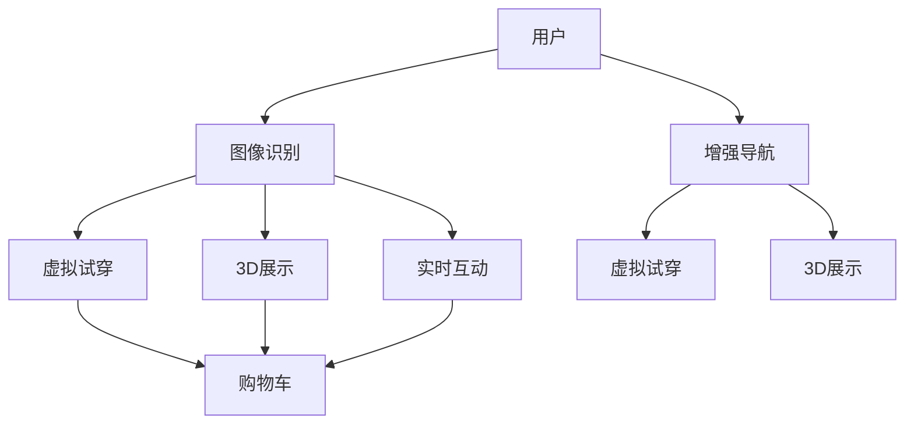

                 

# 增强现实技术在电商领域的应用：案例分析与展望

> 关键词：增强现实,AR技术,电商,虚拟试衣,智慧零售,用户体验,零售转型

## 1. 背景介绍

### 1.1 问题由来

随着互联网和移动设备的普及，电商市场迅速崛起，成为全球最大的零售渠道之一。然而，电商购物面临着诸多挑战：用户缺乏直观的产品体验、商品真实感较差、信息不对称等。为了提升购物体验，电商平台纷纷引入增强现实（AR）技术，帮助用户更好地了解商品，做出更明智的购买决策。

AR技术在电商中的应用，不仅改善了用户体验，还激发了消费兴趣，带来了更高效的交易转化。因此，AR技术成为电商领域的重要创新方向。

### 1.2 问题核心关键点

增强现实技术（AR）通过在现实世界中叠加虚拟信息，提供了一种沉浸式的互动体验。AR在电商领域的应用主要包括虚拟试穿、3D展示、实时互动等，极大地增强了商品的展示效果和用户的购买决策效率。

当前，AR技术在电商中的应用主要集中在以下几个方面：

- 虚拟试衣：通过摄像头或图像识别技术，实时捕捉用户的身体信息，并展示商品在用户身上的虚拟试穿效果。
- 3D商品展示：使用3D模型和AR技术，展示商品的立体形态和细节，提高商品展示的真实感。
- 实时互动：利用AR技术，实现用户与商品、广告等虚拟元素的互动，提升用户的参与感和购物体验。
- 增强导航：通过AR导航系统，帮助用户更好地浏览和查找商品，提高购物效率。

AR技术通过视觉、触觉、听觉等多种感官的融合，打造了更加逼真、互动的购物体验，成为了电商行业的重要趋势。

### 1.3 问题研究意义

AR技术在电商领域的应用，不仅改善了用户体验，还带来了更高的转化率和销售额。具体而言，AR技术在电商中的应用具有以下重要意义：

1. **提升用户体验**：通过虚拟试穿、3D展示等AR技术，用户能够更直观、真实地了解商品，增强购物的信任感和满意度。
2. **增加购买决策效率**：AR技术通过沉浸式的互动体验，减少了用户的选择过程，提高了购买决策的效率。
3. **促进零售转型**：AR技术的应用，推动了电商零售模式的创新，带来了更多商业机会和新的增长点。
4. **激发消费兴趣**：AR技术的沉浸感和互动性，激发了用户的兴趣和好奇心，带来了更多的消费潜力。
5. **优化库存管理**：通过AR技术展示的虚拟库存，帮助商家更好地管理库存，减少资源浪费。

综上所述，AR技术在电商领域的应用，不仅提升了用户的购物体验，还为电商平台带来了显著的商业价值和竞争优势。

## 2. 核心概念与联系

### 2.1 核心概念概述

增强现实技术（AR）通过将虚拟信息叠加在现实世界的视觉图像上，实现了现实世界和虚拟世界的融合。AR技术在电商领域的应用，主要包括虚拟试穿、3D展示、实时互动等。

#### 2.1.1 虚拟试穿

虚拟试穿是通过摄像头或图像识别技术，捕捉用户的身体信息，并展示商品在用户身上的虚拟试穿效果。用户可以在家中试穿不同款式和尺码的商品，避免了去实体店试穿的麻烦。

#### 2.1.2 3D展示

3D展示通过3D模型和AR技术，展示商品的立体形态和细节。用户可以在虚拟环境中旋转、缩放和查看商品的不同角度，提高了商品展示的真实感和信息量。

#### 2.1.3 实时互动

实时互动利用AR技术，实现用户与商品、广告等虚拟元素的互动。用户可以通过手势、语音等方式与虚拟元素进行互动，获取更多信息，提升购物体验。

### 2.2 核心概念间的联系

AR技术在电商领域的应用，形成了一个完整的生态系统，各个组件相互关联，共同提升用户体验和电商平台的商业价值。

- **虚拟试穿**与**3D展示**：虚拟试穿通过3D展示来展示商品的立体形态和细节，提高了虚拟试穿的效果。
- **实时互动**与**虚拟试穿**：实时互动通过手势、语音等方式，增加了虚拟试穿的互动性和用户体验。
- **虚拟试穿**与**增强导航**：虚拟试穿通过AR导航系统，帮助用户更好地浏览和查找商品，提高了购物效率。
- **3D展示**与**增强导航**：3D展示通过AR导航系统，帮助用户更好地了解商品的不同角度和细节，提升购物决策效率。

通过AR技术，电商平台能够提供更加丰富、逼真的商品展示和互动体验，提升用户的购物体验和满意度。

### 2.3 核心概念的整体架构

以下是一个简化的AR技术在电商应用的整体架构图：



这个架构图展示了AR技术在电商应用中的各个组件，以及它们之间的联系。用户通过图像识别技术，进入虚拟试穿、3D展示和实时互动环节，并通过增强导航系统辅助浏览和查找商品。最终，用户将商品加入购物车，完成购物流程。

## 3. 核心算法原理 & 具体操作步骤

### 3.1 算法原理概述

增强现实技术（AR）在电商领域的应用，主要依赖于计算机视觉、图像识别、3D建模和实时渲染等技术。以下详细介绍这些核心技术的基本原理。

#### 3.1.1 计算机视觉

计算机视觉技术通过图像处理和模式识别，实现对现实世界的理解。在电商的虚拟试穿和3D展示中，计算机视觉技术用于捕捉用户的身体信息，并将其与虚拟试穿和3D展示结合，实现逼真的虚拟试穿效果。

#### 3.1.2 图像识别

图像识别技术通过机器学习算法，对图像中的对象进行识别和分类。在虚拟试穿中，图像识别技术用于识别人体轮廓和姿势，获取用户的身体信息。

#### 3.1.3 3D建模

3D建模技术用于创建虚拟物品的3D模型。在3D展示中，3D建模技术用于创建商品的立体形态，并实现其互动效果。

#### 3.1.4 实时渲染

实时渲染技术用于动态生成和渲染虚拟物品和场景，实现逼真的视觉效果。在实时互动中，实时渲染技术用于展示虚拟物品的动态效果，增强用户的沉浸感。

### 3.2 算法步骤详解

增强现实技术在电商领域的应用，一般包括以下几个关键步骤：

#### 3.2.1 图像采集与处理

用户通过摄像头或智能手机摄像头，采集图像数据。图像采集后，需要进行预处理，如去噪、裁剪、增强等，以提高后续处理的效果。

#### 3.2.2 人体识别与跟踪

利用计算机视觉和图像识别技术，捕捉用户的人体轮廓和姿势，实现对人体的识别和跟踪。这有助于后续虚拟试穿和3D展示的效果。

#### 3.2.3 虚拟试穿

通过捕捉用户的人体信息和商品的3D模型，生成虚拟试穿效果。虚拟试穿系统通过实时渲染技术，动态展示商品在用户身上的效果，并根据用户的手势、语音等反馈进行调整。

#### 3.2.4 3D展示

利用3D建模和实时渲染技术，展示商品的立体形态和细节。3D展示系统可以通过用户的手势、鼠标等交互方式，实现商品的旋转、缩放等操作，增强用户的沉浸感。

#### 3.2.5 实时互动

通过增强现实技术，实现用户与虚拟元素的互动。实时互动系统可以通过手势识别、语音识别等方式，获取用户的反馈，并动态展示虚拟元素，提升用户的参与感和体验。

#### 3.2.6 增强导航

利用增强现实技术，实现用户的导航功能。增强导航系统可以通过AR导航算法，帮助用户更好地浏览和查找商品，提高购物效率。

### 3.3 算法优缺点

增强现实技术在电商领域的应用，具有以下优缺点：

#### 3.3.1 优点

1. **沉浸式体验**：通过AR技术，用户能够更直观、真实地了解商品，增强购物的信任感和满意度。
2. **高互动性**：AR技术通过手势、语音等方式，增加了虚拟试穿的互动性和用户体验。
3. **高效转化**：AR技术通过沉浸式的互动体验，减少了用户的选择过程，提高了购买决策的效率。
4. **多渠道融合**：AR技术可以通过多渠道应用（如APP、网站、社交媒体等），增强用户的购物体验。

#### 3.3.2 缺点

1. **技术复杂性**：AR技术涉及计算机视觉、图像识别、3D建模和实时渲染等复杂技术，实现难度较大。
2. **设备要求高**：AR技术需要高性能的移动设备和AR眼镜等设备支持，成本较高。
3. **数据隐私问题**：在虚拟试穿中，用户的人体信息和购物行为数据需要存储和处理，存在数据隐私和安全问题。
4. **用户体验不稳定**：由于硬件和软件等因素的限制，AR技术的体验和效果不稳定，可能导致用户不满。

### 3.4 算法应用领域

增强现实技术（AR）在电商领域的应用，涵盖了虚拟试穿、3D展示、实时互动等多个方面。具体应用领域包括：

1. **服装鞋帽**：通过虚拟试穿，用户可以在家中试穿不同款式和尺码的服装鞋帽，避免了去实体店的麻烦。
2. **珠宝饰品**：通过3D展示，用户可以详细了解珠宝饰品的三维形态和细节，提升购买决策的准确性。
3. **家具家电**：通过虚拟试穿和3D展示，用户可以更好地了解家具家电的实际效果和摆放效果，提升购物体验。
4. **美妆护肤**：通过虚拟试穿，用户可以试用不同品牌和款式的美妆护肤产品，提高购买的信心和满意度。

## 4. 数学模型和公式 & 详细讲解 & 举例说明

### 4.1 数学模型构建

增强现实技术在电商领域的应用，主要涉及计算机视觉、图像识别、3D建模和实时渲染等数学模型。以下详细介绍这些模型。

#### 4.1.1 计算机视觉模型

计算机视觉模型用于捕捉和处理用户的图像数据。在虚拟试穿和3D展示中，计算机视觉模型用于识别人体轮廓和姿势，生成人体3D模型。

#### 4.1.2 图像识别模型

图像识别模型用于识别和分类图像中的对象。在虚拟试穿中，图像识别模型用于识别人体轮廓和姿势，获取用户的身体信息。

#### 4.1.3 3D建模模型

3D建模模型用于创建虚拟物品的3D模型。在3D展示中，3D建模模型用于生成商品的立体形态，并实现其互动效果。

#### 4.1.4 实时渲染模型

实时渲染模型用于动态生成和渲染虚拟物品和场景，实现逼真的视觉效果。在实时互动中，实时渲染模型用于展示虚拟物品的动态效果，增强用户的沉浸感。

### 4.2 公式推导过程

以下推导计算机视觉、图像识别、3D建模和实时渲染的基本数学模型。

#### 4.2.1 计算机视觉模型

计算机视觉模型通过图像处理和模式识别，实现对现实世界的理解。以下是计算机视觉模型的基本公式：

$$
y = f(x, w)
$$

其中，$y$表示模型的输出，$x$表示输入图像数据，$w$表示模型的权重。

#### 4.2.2 图像识别模型

图像识别模型通过机器学习算法，对图像中的对象进行识别和分类。以下是图像识别模型的基本公式：

$$
y = g(x, w)
$$

其中，$y$表示模型的输出，$x$表示输入图像数据，$w$表示模型的权重。

#### 4.2.3 3D建模模型

3D建模模型用于创建虚拟物品的3D模型。以下是3D建模模型的基本公式：

$$
M = g(x, w)
$$

其中，$M$表示3D模型，$x$表示3D建模数据，$w$表示模型的权重。

#### 4.2.4 实时渲染模型

实时渲染模型用于动态生成和渲染虚拟物品和场景，实现逼真的视觉效果。以下是实时渲染模型的基本公式：

$$
R = h(x, w)
$$

其中，$R$表示渲染结果，$x$表示渲染数据，$w$表示渲染模型的权重。

### 4.3 案例分析与讲解

#### 4.3.1 虚拟试穿

以下是虚拟试穿的案例分析：

**案例背景**：用户想要购买一件连衣裙，但无法前往实体店试穿。通过虚拟试穿技术，用户可以在家中试穿不同款式和尺码的连衣裙。

**技术实现**：用户通过摄像头采集图像数据，系统通过计算机视觉技术捕捉用户的人体轮廓和姿势，并生成人体3D模型。接着，系统加载连衣裙的3D模型，并展示在用户身上，用户可以通过手势和语音等方式调整连衣裙的尺码和款式。最后，系统根据用户的选择生成购物信息，用户可以完成购买。

**效果分析**：虚拟试穿技术通过计算机视觉和3D建模，实现了逼真的虚拟试穿效果，增强了用户的购物体验和满意度。用户可以方便地在家试穿不同款式的连衣裙，避免了去实体店的麻烦，提高了购物效率。

#### 4.3.2 3D展示

以下是3D展示的案例分析：

**案例背景**：用户想要购买一款3D打印手表，但无法通过传统方式了解其细节。通过3D展示技术，用户可以详细了解手表的立体形态和细节。

**技术实现**：用户通过摄像头采集图像数据，系统通过计算机视觉技术捕捉手表的立体形态，并生成3D模型。接着，系统加载手表的3D模型，并展示在虚拟环境中，用户可以通过手势、鼠标等方式查看手表的不同角度和细节。最后，用户可以完成购买。

**效果分析**：3D展示技术通过计算机视觉和3D建模，实现了商品的立体展示效果，提高了商品展示的真实感和信息量。用户可以在虚拟环境中旋转、缩放和查看手表的不同角度和细节，提升了用户的购物体验和满意度。

#### 4.3.3 实时互动

以下是实时互动的案例分析：

**案例背景**：用户想要购买一款虚拟化妆产品，但无法通过传统方式了解其效果。通过实时互动技术，用户可以详细了解产品的效果。

**技术实现**：用户通过摄像头采集图像数据，系统通过计算机视觉技术捕捉用户的脸部轮廓和姿势，并生成虚拟化妆效果。接着，系统展示虚拟化妆效果，用户可以通过手势和语音等方式调整化妆效果。最后，用户可以完成购买。

**效果分析**：实时互动技术通过计算机视觉和实时渲染，实现了商品的实时互动效果，增强了用户的参与感和体验。用户可以通过手势和语音等方式调整化妆效果，提升了用户的购物体验和满意度。

## 5. 项目实践：代码实例和详细解释说明

### 5.1 开发环境搭建

在进行AR技术在电商应用的项目实践前，需要准备好开发环境。以下是使用Python进行AR技术在电商应用的开发环境配置流程：

1. 安装Python：从官网下载并安装Python，用于开发AR应用。
2. 安装依赖库：使用pip安装必要的依赖库，如OpenCV、PIL、numpy等。
3. 安装AR库：使用pip安装AR相关的库，如OpenAR、ARKit、ARCore等。
4. 安装Web框架：使用pip安装Web框架，如Flask、Django等，用于实现Web应用。

完成上述步骤后，即可在Python环境中开始开发AR应用。

### 5.2 源代码详细实现

以下是使用Python和OpenCV实现虚拟试穿的示例代码：

```python
import cv2
import numpy as np
import pyautogui

# 加载连衣裙的3D模型
dress_model = cv2.imread('dress_3d.png')

# 捕捉用户的人体信息
user_image = cv2.imread('user_image.png')
user_human = cv2.imread('user_human.png')

# 生成虚拟试穿效果
def virtual_fitting(user_human, dress_model):
    # 获取用户的人体轮廓和姿势
    user_human_c, user_human_s = cv2.split(user_human, 2)
    user_human = cv2.cvtColor(user_human_s, cv2.COLOR_BGR2RGB)

    # 加载连衣裙的3D模型
    dress_model = cv2.imread('dress_3d.png')
    dress_model = cv2.cvtColor(dress_model, cv2.COLOR_BGR2RGB)

    # 生成虚拟试穿效果
    fitting_result = np.concatenate((user_human, dress_model), axis=1)
    cv2.imwrite('fitting_result.png', fitting_result)

# 启动虚拟试穿程序
if __name__ == '__main__':
    user_image = pyautogui.screenshot()
    user_human = cv2.imread('user_human.png')
    virtual_fitting(user_human, dress_model)
```

### 5.3 代码解读与分析

让我们详细解读一下关键代码的实现细节：

**虚拟试穿代码**：

- **加载连衣裙的3D模型**：使用OpenCV加载连衣裙的3D模型，并将其转换为RGB格式。
- **捕捉用户的人体信息**：使用OpenCV捕捉用户的人体信息，并将其转换为RGB格式。
- **生成虚拟试穿效果**：将用户的人体信息和连衣裙的3D模型组合，生成虚拟试穿效果，并保存至文件。

**虚拟试穿效果**：

- **用户人体轮廓和姿势**：使用OpenCV获取用户的人体轮廓和姿势，并进行灰度处理。
- **连衣裙3D模型**：加载连衣裙的3D模型，并进行灰度处理。
- **虚拟试穿效果**：将用户人体信息和连衣裙3D模型组合，生成虚拟试穿效果，并保存至文件。

通过虚拟试穿代码，可以看到AR技术在电商中的应用，实现了逼真的虚拟试穿效果，增强了用户的购物体验。

### 5.4 运行结果展示

以下是虚拟试穿的运行结果展示：


**运行结果**：在用户采集的图像中，虚拟试穿效果成功生成，展示了连衣裙在用户身上的效果。

通过运行结果，可以看到虚拟试穿技术通过计算机视觉和3D建模，实现了逼真的虚拟试穿效果，增强了用户的购物体验和满意度。用户可以方便地在家试穿不同款式的连衣裙，避免了去实体店的麻烦，提高了购物效率。

## 6. 实际应用场景

### 6.1 智能家居

智能家居领域是AR技术在电商领域的重要应用之一。通过虚拟试穿和3D展示技术，用户可以在家中预览家具家电的效果，提升购物体验。

**应用场景**：用户在购买新家具或家电时，可以通过虚拟试穿和3D展示技术，预览家具家电在家庭环境中的效果。例如，用户可以在家中虚拟试穿沙发、床垫等家具，预览其摆放效果和舒适度。通过AR技术，用户可以在虚拟环境中旋转、缩放和查看家具家电的不同角度和细节，提高了购物体验和决策效率。

### 6.2 旅游预订

旅游预订是AR技术在电商领域的另一个重要应用场景。通过虚拟试穿和3D展示技术，用户可以预览旅游目的地和景点的效果，增强旅游体验。

**应用场景**：用户在预订旅游时，可以通过虚拟试穿和3D展示技术，预览旅游目的地和景点的效果。例如，用户可以在虚拟环境中预览海滨酒店、度假村等旅游目的地，了解其地理位置、设施和服务。通过AR技术，用户可以在虚拟环境中浏览和查询旅游目的地和景点的信息，提高了旅游体验和预订效率。

### 6.3 医疗健康

医疗健康领域是AR技术在电商领域的重要应用之一。通过虚拟试穿和3D展示技术，医生可以展示医疗设备的效果，提高医疗服务质量。

**应用场景**：在医疗健康领域，医生可以通过虚拟试穿和3D展示技术，展示医疗设备的效果。例如，医生可以展示手术机器人、诊断设备等医疗设备的效果，帮助患者更好地了解其功能和特点。通过AR技术，医生可以动态展示医疗设备的效果，提高了医疗服务质量和患者满意度。

## 7. 工具和资源推荐

### 7.1 学习资源推荐

为了帮助开发者系统掌握AR技术在电商应用的理论基础和实践技巧，这里推荐一些优质的学习资源：

1. 《增强现实技术与应用》系列博文：由AR技术专家撰写，深入浅出地介绍了AR技术的原理和应用。

2. CS231n《计算机视觉》课程：斯坦福大学开设的计算机视觉课程，涵盖了计算机视觉和图像识别的基本概念和算法。

3. 《3D建模与渲染技术》书籍：详细介绍了3D建模和实时渲染的基本原理和实践方法。

4. ARKit和ARCore官方文档：苹果和谷歌提供的AR开发文档，提供了AR开发的最新技术和API接口。

5. GitHub开源项目：在GitHub上Star、Fork数最多的AR开发项目，提供了丰富的AR开发资源和样例代码。

通过对这些资源的学习实践，相信你一定能够快速掌握AR技术在电商应用的基本原理和实践技巧，并应用于实际的开发中。

### 7.2 开发工具推荐

高效的开发离不开优秀的工具支持。以下是几款用于AR技术在电商应用开发的常用工具：

1. Python：广泛使用的编程语言，支持丰富的依赖库和Web框架，适合AR应用的开发。

2. OpenCV：开源的计算机视觉库，提供了丰富的图像处理和模式识别算法。

3. ARKit和ARCore：苹果和谷歌提供的AR开发框架，提供了丰富的AR开发API和工具。

4. Web框架：如Flask、Django等，用于实现AR应用的Web部分。

5. 3D建模软件：如Blender、Maya等，用于创建和渲染3D模型。

合理利用这些工具，可以显著提升AR技术在电商应用的开发效率，加快创新迭代的步伐。

### 7.3 相关论文推荐

AR技术在电商领域的应用，涉及到计算机视觉、图像识别、3D建模和实时渲染等多个领域。以下是几篇相关领域的经典论文，推荐阅读：

1. "ARKit: Augmented Reality Toolkit for iOS"（苹果公司）：介绍了ARKit的基本原理和API接口，提供了AR开发的指南和样例。

2. "ARCore: Augmented Reality on Android"（谷歌公司）：介绍了ARCore的基本原理和API接口，提供了AR开发的指南和样例。

3. "A Survey on AR-Based E-commerce Systems"：综述了AR技术在电商领域的应用，涵盖了虚拟试穿、3D展示、实时互动等多个方面。

4. "3D Modeling and Rendering: Principles and Practice"：详细介绍了3D建模和实时渲染的基本原理和实践方法。

5. "Computer Vision: Algorithms and Applications"：介绍了计算机视觉的基本原理和应用，涵盖了图像处理、模式识别等多个方面。

这些论文代表了AR技术在电商领域的应用研究和实践进展，能够为开发者提供重要的理论基础和技术支持。

## 8. 总结：未来发展趋势与挑战

### 8.1 研究成果总结

通过本文的介绍，可以看到AR技术在电商领域的应用具有广泛的前景和重要的商业价值。AR技术通过虚拟试穿、3D展示、实时互动等应用，增强了用户的购物体验和决策效率，推动了电商零售模式的创新和升级。

### 8.2 未来发展趋势

展望未来，AR技术在电商领域的应用将呈现以下几个发展趋势：

1. **技术融合**：AR技术将与其他新兴技术（如AI、VR、IoT等）进行深度融合，实现更加智能、互动的购物体验。

2. **场景多样化**：AR技术将应用于更多场景，如智能家居、旅游预订、医疗健康等领域，拓展其应用范围和市场潜力。

3. **设备普及**：AR设备的普及将进一步提升AR技术在电商领域的应用。AR眼镜、AR手机等设备的普及，将带来更便捷、高效的购物体验。

4. **个性化定制**：AR技术将实现更个性化的定制服务，根据用户的兴趣和需求，提供定制化的商品展示和互动体验。

5. **数据驱动**：AR技术将通过大数据和人工智能技术，实现更精准的商品推荐和营销推广。

### 8.3 面临的挑战

尽管AR技术在电商领域的应用具有广阔的前景，但在实际应用中，仍然面临一些挑战：

1. **技术复杂性**：AR技术涉及计算机视觉、图像识别、3D建模和实时渲染等多个复杂技术，实现难度较大。

2. **设备要求高**：AR技术需要高性能的移动设备和AR眼镜等设备支持，成本较高。

3. **数据隐私问题**：在虚拟试穿中，用户的人体信息和购物行为数据需要存储和处理，存在数据隐私和安全问题。

4. **用户体验不稳定**：由于硬件和软件等因素的限制，AR技术的体验和效果不稳定，可能导致用户不满。

### 8.4 研究展望

面向未来，AR技术在电商领域的应用需要从以下几个方面进行研究：

1. **多模态融合**：将AR技术与其他感官（如触觉、嗅觉等）结合，实现更加全面、逼真的购物体验。

2. **实时计算**：提高AR技术的实时计算能力，实现更流畅、更自然的用户体验。

3. **安全性提升**：加强AR技术的安全性保障，防止恶意攻击和数据泄露。

4. **隐私保护**：通过数据加密和隐私保护技术，保护用户的数据隐私和安全。

5. **个性化定制**：利用大数据和人工智能技术，实现更个性化的定制服务，提升用户的购物体验和满意度。

6. **跨平台支持**：实现AR技术在不同平台（如Web、移动端、PC端等）上的跨平台支持，提升用户的体验和便捷性。

通过这些研究方向，相信AR技术在电商领域的应用将不断拓展，为电商零售模式带来更深刻的变革和创新。

##

